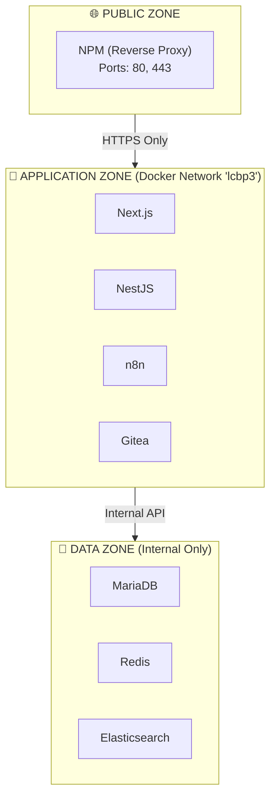
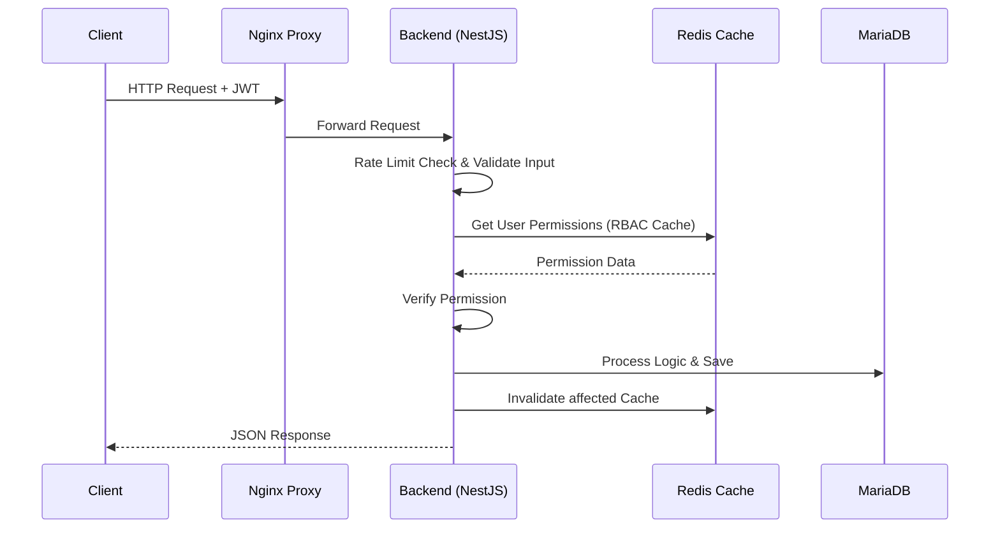
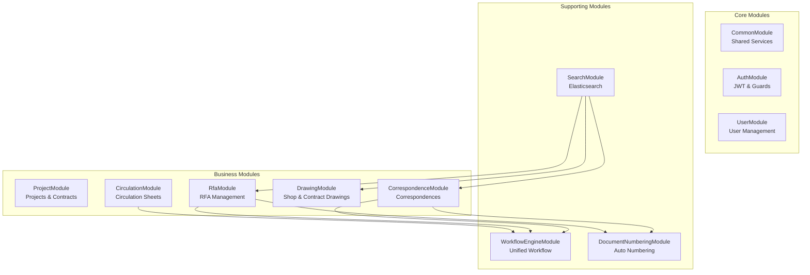
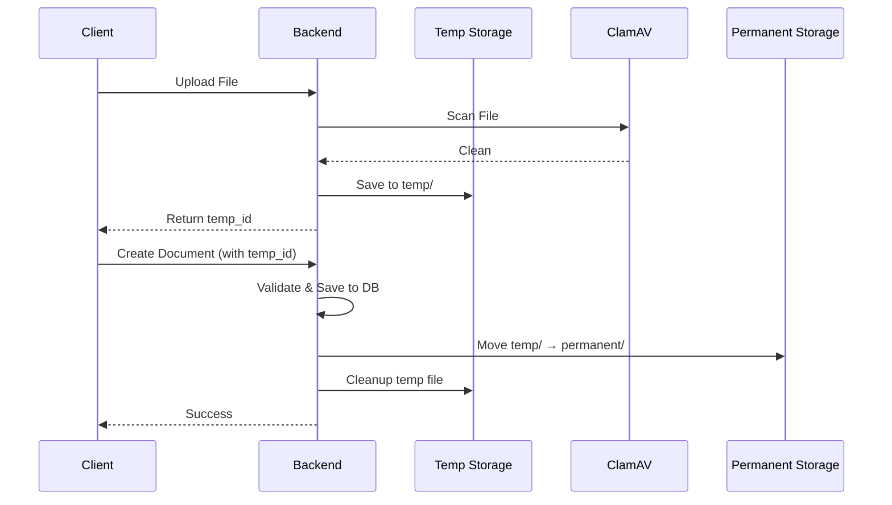
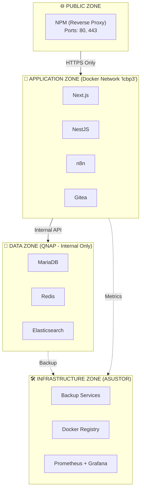
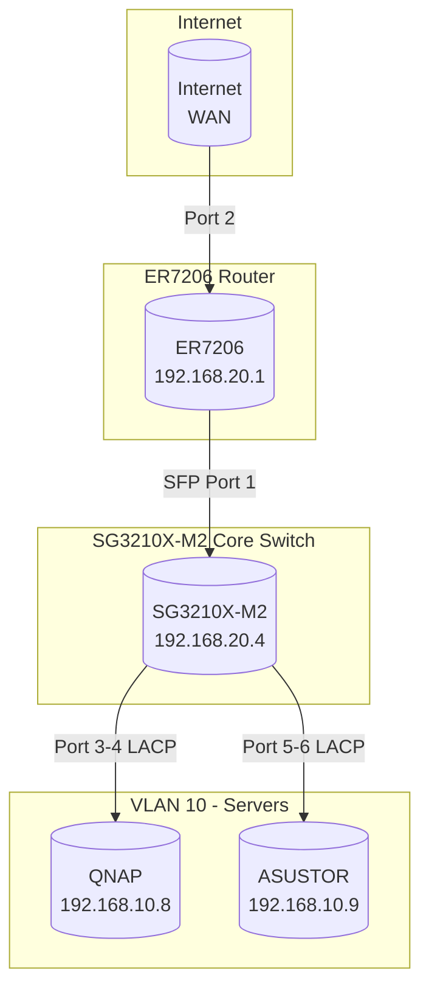
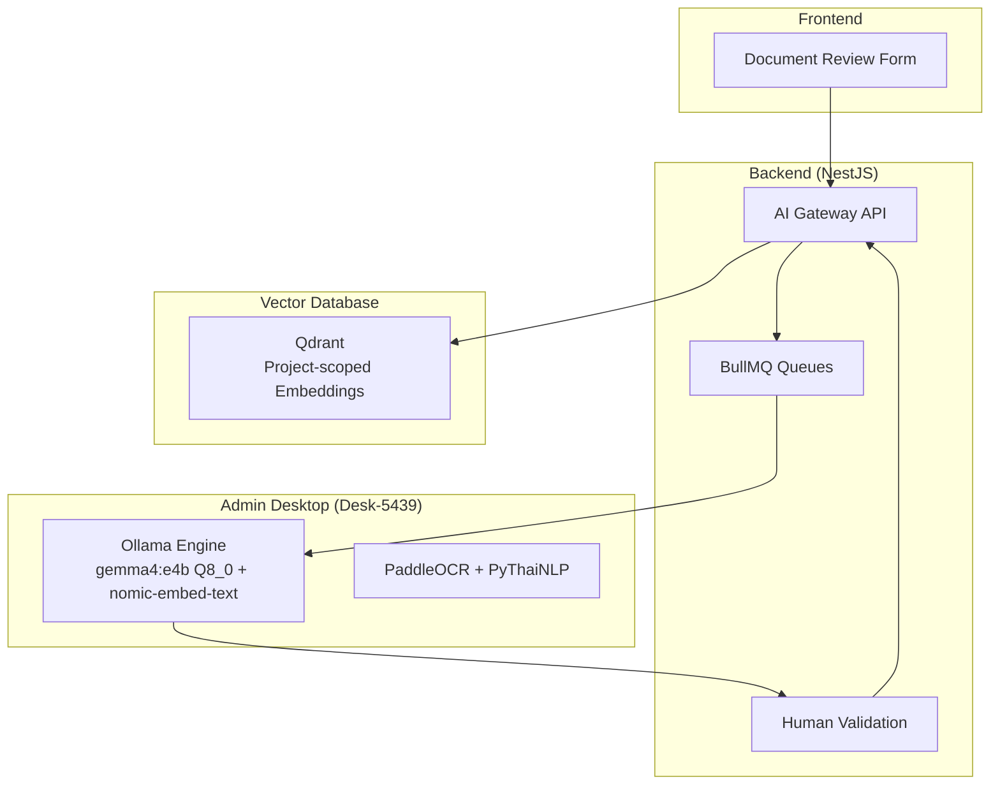

# LCBP3-DMS Architecture Documentation

---

**title:** 'LCBP3-DMS Architecture Documentation'
**version:** 1.9.7
**status:** active
**owner:** Nattanin Peancharoen
**last_updated:** 2026-05-25
**related:**

- specs/02-Architecture/02-01-system-context.md
- specs/02-Architecture/02-02-software-architecture.md
- specs/02-Architecture/02-03-network-design.md
- specs/02-Architecture/02-04-api-design.md
- specs/06-Decision-Records/

---

## 📋 Table of Contents

1. [System Context & Architecture](#1-system-context--architecture)
2. [Software Architecture & Design](#2-software-architecture--design)
3. [Network Design & Security](#3-network-design--security)
4. [API Design & Error Handling](#4-api-design--error-handling)
5. [AI Architecture (ADR-023/023A/024/025)](#5-ai-architecture-adr-023023a)
6. [Architecture Decision Records (ADRs)](#6-architecture-decision-records-adrs)

---

## 1. System Context & Architecture

### 1.1 System Overview

ระบบ LCBP3-DMS (Laem Chabang Port Phase 3 - Document Management System) ถูกออกแบบด้วยสถาปัตยกรรมแบบ **Headless/API-First Architecture** โดยทำงานแบบ **On-Premise 100%** บนเครื่องเซอร์ฟเวอร์ QNAP และ ASUSTOR

### 1.2 Architecture Principles

1. **Data Integrity First:** ความถูกต้องของข้อมูลต้องมาก่อนทุกอย่าง
2. **Security by Design & Container Isolation:** รักษาความปลอดภัยที่ทุกชั้น และแยกส่วนการทำงานของแต่ละระบบอย่างชัดเจน
3. **On-Premise First:** ข้อมูลและระบบงานทั้งหมดต้องอยู่ภายในเครือข่ายของโครงการเท่านั้น
4. **Resilience:** ทนทานต่อ Failure และ Recovery ได้รวดเร็ว
5. **Observability:** ติดตามและวิเคราะห์สถานะระบบได้ง่าย

### 1.3 Hardware Infrastructure

| Component             | Specification                             | Role                                | IP Address   |
| --------------------- | ----------------------------------------- | ----------------------------------- | ------------ |
| **Primary Server**    | QNAP TS-473A (AMD Ryzen V1500B, 32GB RAM) | Primary NAS for DMS, Container Host | 192.168.10.8 |
| **Backup Server**     | ASUSTOR AS5304T                           | Backup / Secondary NAS              | 192.168.10.9 |
| **Network Interface** | LACP bonding (IEEE 802.3ad)               | High availability & bandwidth       | -            |

### 1.4 Container Isolation & Environment



### 1.5 Core Services Architecture

| Service      | Application Name | Domain              | Technology          | Purpose            |
| ------------ | ---------------- | ------------------- | ------------------- | ------------------ |
| **Frontend** | lcbp3-frontend   | lcbp3.np-dms.work   | Next.js 16.2.0      | Web UI             |
| **Backend**  | lcbp3-backend    | backend.np-dms.work | NestJS 11           | API Server & Logic |
| **Database** | lcbp3-db         | db.np-dms.work      | MariaDB 11.8        | Primary Data       |
| **Proxy**    | lcbp3-npm        | npm.np-dms.work     | Nginx Proxy Mgr     | Gateway & SSL      |
| **Workflow** | lcbp3-n8n        | n8n.np-dms.work     | n8n                 | Process Automation |
| **Git**      | git              | git.np-dms.work     | Gitea               | Code Repository    |
| **Cache**    | -                | -                   | Redis               | Caching, Locking   |
| **Search**   | -                | -                   | Elasticsearch 9.3.4 | Full-text Indexing |

### 1.6 Data Flow & Interactions



### 1.7 Backup & Disaster Recovery

- **Database Backup:** ทำ Automated Backup รายวันด้วย QNAP HBS 3
- **File Backup:** ทำ Snapshot จาก `/share/dms-data` บน QNAP ไปยัง ASUSTOR
- **Recovery Standard:** หาก NAS พัง สามารถ Restore Config และรัน `docker-compose up` ขึ้นใหม่ได้ทันที

---

## 2. Software Architecture & Design

### 2.1 Backend Module Architecture (NestJS)



### 2.2 Key Architectural Patterns

#### Unified Workflow Engine (DSL-Based)

ระบบการเดินเอกสารใช้ Engine กลางเดียวกัน ผ่าน **Workflow DSL (JSON Configuration)**

- **Separation of Concerns:** Modules เก็บเฉพาะข้อมูล (Data) ส่วน Flow/State ถูกจัดการโดย Engine
- **Versioning:** อาศัย Workflow Definition Version ป้องกันความขัดแย้งของ State

#### Double-Locking Mechanism (Auto Numbering)

เพื่อป้องกัน Race Condition ในการขอเลขเอกสารพร้อมกัน:

- **Layer 1:** Redis Distributed Lock (ล็อคการเข้าถึงในระดับ Server/Network)
- **Layer 2:** Optimistic Database Lock ผ่าน `@VersionColumn()` (ป้องกันระดับ Data Record)

#### Idempotency

ทุก API ที่แก้ไขสถานะจะต้องส่ง `Idempotency-Key` ป้องกันผู้ใช้กดยืนยันซ้ำสองรอบ

### 2.3 File Upload Flow (Two-Phase Storage)



### 2.4 Security Architecture

#### Rate Limiting (Redis-backed)

| Endpoint Type    | Limit         | Scope |
| ---------------- | ------------- | ----- |
| Anonymous        | 100 req/hour  | IP    |
| File Upload      | 50 req/hour   | User  |
| Document Control | 2000 req/hour | User  |
| Admin            | 5000 req/hour | User  |

#### Authorization checking flow (CASL)

1. ดึง JWT Token ตรวจสอบความถูกต้อง
2. โหลด User Permissions จาก Redis
3. ตรวจสอบเงื่อนไขตาม Context (Global, Organization, Project, Contract)
4. พิจารณาอนุญาตหากระดับใดระดับหนึ่งอนุญาต

### 2.5 Resilience & Error Handling

- **Circuit Breaker:** ใช้งานครอบ API ภายนอก (Email, LINE Notify)
- **Retry Mechanism:** สำหรับกระบวนการสำคัญชั่วคราว
- **Graceful Degradation:** หาก Search Engine ล่ม ระบบสลับไปใช้ Database Query พื้นฐานชั่วคราวได้

---

## 3. Network Design & Security

### 3.1 Network Segmentation (VLANs)

| VLAN ID | Name   | Purpose            | Subnet          | Gateway      | Notes                                     |
| ------- | ------ | ------------------ | --------------- | ------------ | ----------------------------------------- |
| 10      | SERVER | Server & Storage   | 192.168.10.0/24 | 192.168.10.1 | Servers (QNAP, ASUSTOR). Static IPs ONLY. |
| 20      | MGMT   | Management & Admin | 192.168.20.0/24 | 192.168.20.1 | Network devices, Admin PC.                |
| 30      | USER   | User Devices       | 192.168.30.0/24 | 192.168.30.1 | Staff PC, Printers.                       |
| 40      | CCTV   | Surveillance       | 192.168.40.0/24 | 192.168.40.1 | Cameras, NVR. Isolated.                   |
| 50      | VOICE  | IP Phones          | 192.168.50.0/24 | 192.168.50.1 | SIP traffic. Isolated.                    |
| 60      | DMZ    | Public Services    | 192.168.60.0/24 | 192.168.60.1 | DMZ. Isolated from Internal.              |
| 70      | GUEST  | Guest Wi-Fi        | 192.168.70.0/24 | 192.168.70.1 | Isolated Internet Access only.            |

### 3.2 Security Zones



### 3.3 Network Topology



### 3.4 Firewall Rules (ACLs)

กฎของ Firewall จะถูกกำหนดตามหลักการอนุญาตแค่สิ่งที่ต้องการ (Default Deny)

| Priority | Rule                   | Policy | Source            | Destination       | Ports                |
| -------- | ---------------------- | ------ | ----------------- | ----------------- | -------------------- |
| 1        | Allow-User-DHCP        | Allow  | Network → VLAN 30 | IP → 192.168.30.1 | DHCP                 |
| 2        | Allow-Guest-DHCP       | Allow  | Network → VLAN 70 | IP → 192.168.70.1 | DHCP                 |
| 3        | Isolate-Servers        | Deny   | Network → VLAN 10 | Network → VLAN 30 | All                  |
| 4        | Block-User-to-Mgmt     | Deny   | Network → VLAN 30 | Network → VLAN 20 | All                  |
| 5        | Allow-User-to-Services | Allow  | Network → VLAN 30 | IP → QNAP         | Web (443,8443,80,81) |
| 100      | Default                | Deny   | Any               | Any               | All                  |

### 3.5 QoS (Quality of Service) Settings

| Priority    | DSCP Value | Traffic Type          | Application            |
| ----------- | ---------- | --------------------- | ---------------------- |
| Highest (7) | EF (46)    | Voice (SIP/RTP)       | IP Phones (VLAN 50)    |
| High (6)    | AF41 (34)  | Video Surveillance    | CCTV Cameras (VLAN 40) |
| Medium (5)  | AF31 (26)  | Critical Applications | DMS Backend, Database  |
| Low (4)     | AF21 (18)  | Best Effort           | Web browsing, Email    |

---

## 4. API Design & Error Handling

### 4.1 API Design Principles

#### API-First Approach

- **ออกแบบ API ก่อนการ Implement:** ทำการออกแบบ API Endpoint และ Data Contract ให้ชัดเจนก่อนเริ่มเขียนโค้ด
- **Documentation-Driven:** ใช้ OpenAPI/Swagger เป็นเอกสารอ้างอิงหลัก
- **Contract Testing:** ทดสอบ API ตาม Contract ที่กำหนดไว้

#### RESTful Principles

- ใช้ HTTP Methods อย่างถูกต้อง: `GET`, `POST`, `PUT`, `PATCH`, `DELETE`
- ใช้ HTTP Status Codes ที่เหมาะสม
- Resource-Based URL Design
- Stateless Communication

### 4.2 Authentication & Authorization

#### JWT-Based Authentication

- **Token Management:**
  - Access Token Expiration: 8 ชั่วโมง
  - Refresh Token Expiration: 7 วัน
  - Token Rotation: รองรับการหมุนเวียน Refresh Token

#### Authorization (RBAC) (CASL)

ใช้ระบบ 4-Level Permission Hierarchy (Global, Organization, Project, Contract)

```typescript
@RequirePermission('correspondence.create')
@Post('correspondences')
async createCorrespondence(@Body() dto: CreateCorrespondenceDto) {
  // Implementation
}
```

### 4.3 API Conventions

#### Base URL Structure

```
https://backend.np-dms.work/api/v1/{resource}
```

#### HTTP Methods & Usage

| Method   | Usage                          | Idempotent | Example                                |
| -------- | ------------------------------ | ---------- | -------------------------------------- |
| `GET`    | ดึงข้อมูล (Read)               | ✅ Yes     | `GET /api/v1/correspondences`          |
| `POST`   | สร้างข้อมูลใหม่ (Create)       | ❌ No\*    | `POST /api/v1/correspondences`         |
| `PUT`    | อัปเดตทั้งหมด (Full Update)    | ✅ Yes     | `PUT /api/v1/correspondences/:uuid`    |
| `PATCH`  | อัปเดตบางส่วน (Partial Update) | ✅ Yes     | `PATCH /api/v1/correspondences/:uuid`  |
| `DELETE` | ลบข้อมูล (Soft Delete)         | ✅ Yes     | `DELETE /api/v1/correspondences/:uuid` |

### 4.4 Request Format

**Request Headers:**

```http
Content-Type: application/json
Authorization: Bearer <access_token>
Idempotency-Key: <uuid> # สำหรับ POST/PUT/DELETE
```

### 4.5 Response Formats

#### Success Response

```typescript
{
  "data": {
    "uuid": "019505a1-7c3e-7000-8000-abc123def456",
    "document_number": "CORR-2024-0001",
    "subject": "...",
  },
  "meta": {
    "timestamp": "2024-01-01T00:00:00Z",
    "version": "1.0"
  }
}
```

#### Error Response Format

```typescript
{
  "error": {
    "code": "VALIDATION_ERROR",
    "message": "Validation failed on input data",
    "statusCode": 400,
    "timestamp": "2024-01-01T00:00:00Z",
    "path": "/api/correspondences",
    "details": [
      {
        "field": "subject",
        "message": "Subject is required",
        "value": null
      }
    ]
  }
}
```

### 4.6 Error Handling Strategy

#### Global Exception Filter

คลาสจัดการ Error หลักที่จะจับและดัดแปลง Error ส่งคืน Client อย่างสม่ำเสมอ

#### Custom Business Exception

สำหรับจัดการข้อผิดพลาดเชิงความสัมพันธ์ หรือเงื่อนไขธุรกิจ

```typescript
throw new BusinessException('Cannot approve correspondence in current status', 'INVALID_WORKFLOW_TRANSITION');
```

### 4.7 API Security & Rate Limiting

#### File Upload Security

- **Virus Scanning:** ใช้ ClamAV scan ทุกไฟล์
- **File Type Validation:** White-list (PDF, DWG, DOCX, XLSX, ZIP)
- **File Size Limit:** 50MB per file
- **Two-Phase Storage:** Upload to `temp/` → Commit to `permanent/`

---

## 5. AI Architecture (ADR-023/023A/024/025)

### 5.1 AI Integration Architecture



### 5.2 Key Components

| Component         | Location                  | Purpose                                                 |
| ----------------- | ------------------------- | ------------------------------------------------------- |
| **AI Gateway**    | Backend (NestJS)          | API endpoints, validation, audit logging                |
| **BullMQ Queues** | Backend (NestJS)          | ai-realtime (RAG/Suggest), ai-batch (OCR/Extract/Embed) |
| **Ollama Engine** | Admin Desktop (Desk-5439) | gemma4:e4b Q8_0 (LLM) + nomic-embed-text (Embedding)    |
| **OCR Engine**    | Admin Desktop (Desk-5439) | PaddleOCR + PyThaiNLP (Thai/English text extraction)    |
| **Qdrant**        | QNAP NAS                  | Vector storage with project isolation                   |

### 5.3 AI Architecture Rules

- **AI Isolation:** All AI processing on Admin Desktop only (Desk-5439)
- **Data Privacy:** No cloud AI services, on-premises only
- **Audit Trail:** Log all AI interactions and human validations
- **Rate Limiting:** Prevent AI abuse and resource exhaustion
- **Validation:** All AI outputs must be validated before use
- **Multi-tenant Isolation:** Qdrant queries MUST include projectPublicId filter

### 5.4 2-Model Stack (ADR-023A)

- **gemma4:e4b Q8_0** (~4.0GB VRAM) - Main LLM for classification, tagging, extraction
- **nomic-embed-text** (~0.3GB VRAM) - Text embedding for RAG
- **Total VRAM Peak:** ~4.3GB

---

## 6. Architecture Decision Records (ADRs)

### 6.1 Key ADRs Implemented

| ADR          | Title                           | Status    | Description                                                           |
| ------------ | ------------------------------- | --------- | --------------------------------------------------------------------- |
| **ADR-001**  | Unified Workflow Engine         | ✅ Active | DSL-based workflow implementation                                     |
| **ADR-002**  | Document Numbering Strategy     | ✅ Active | Document number generation + locking                                  |
| **ADR-007**  | Error Handling Strategy         | ✅ Active | Layered error classification                                          |
| **ADR-008**  | Email Notification Strategy     | ✅ Active | BullMQ + multi-channel notification                                   |
| **ADR-009**  | Database Migration Strategy     | ✅ Active | Schema changes — edit SQL directly                                    |
| **ADR-016**  | Security Authentication         | ✅ Active | Auth, RBAC, file upload security                                      |
| **ADR-019**  | Hybrid Identifier Strategy      | ✅ Active | INT PK + UUIDv7 Public API                                            |
| **ADR-021**  | Workflow Context                | ✅ Active | Integrated workflow & step attachments                                |
| **ADR-023**  | Unified AI Architecture         | ✅ Active | AI boundaries and pipeline                                            |
| **ADR-023A** | AI Model Revision               | ✅ Active | 2-Model stack with BullMQ queues                                      |
| **ADR-024**  | Intent Classification Strategy  | ✅ Active | Hybrid Pattern → LLM Fallback intent routing                          |
| **ADR-025**  | AI Tool Layer Architecture      | ✅ Active | Server-side Tool dispatch, CASL-guarded bridge                        |
| **ADR-026**  | Document Chat UI Pattern        | ✅ Active | Side-panel document chat UI                                           |
| **ADR-027**  | AI Admin Console & Dynamic Ctrl | ✅ Active | AI Admin Panel + dynamic model/prompt control                         |
| **ADR-028**  | Migration Architecture Refactor | ✅ Active | Staging Queue & post-migration cleanup                                |
| **ADR-029**  | Dynamic Prompt Management       | ✅ Active | Prompt templates in DB (`ai_prompts`), Redis cache TTL 60s, versioned |

### 6.2 ADR References

For detailed architectural decisions, please refer to:

- `specs/06-Decision-Records/` - Complete ADR documentation
- `AGENTS.md` - Quick-reference rules and enforcement

---

## 📚 Related Documentation

- **System Context:** `specs/02-Architecture/02-01-system-context.md`
- **Software Architecture:** `specs/02-Architecture/02-02-software-architecture.md`
- **Network Design:** `specs/02-Architecture/02-03-network-design.md`
- **API Design:** `specs/02-Architecture/02-04-api-design.md`
- **Decision Records:** `specs/06-Decision-Records/`
- **Data Schema:** `specs/03-Data-and-Storage/lcbp3-v1.9.0-schema-*.sql`
- **Engineering Guidelines:** `specs/05-Engineering-Guidelines/`

---

## 🔄 Version History

| Version   | Date       | Changes                                                                                                                             |
| --------- | ---------- | ----------------------------------------------------------------------------------------------------------------------------------- |
| **1.9.7** | 2026-05-25 | Added ADR-029 Dynamic Prompt Management to ADR table; bumped version/date                                                           |
| **1.9.5** | 2026-05-22 | Added ADR-024/025/026/027/028 to ADR reference table; updated AI Architecture section heading; schema reference corrected to v1.9.0 |
| **1.9.2** | 2026-05-18 | Complete restructure following specs/02-Architecture format, added comprehensive diagrams, updated AI Architecture (ADR-023/023A)   |
| **1.9.0** | 2026-05-13 | AI Architecture consolidation, Agent Infrastructure standardization                                                                 |
| **1.8.0** | 2026-02-23 | Initial architecture documentation                                                                                                  |

---

_This document is maintained as part of the LCBP3-DMS project specification suite._
