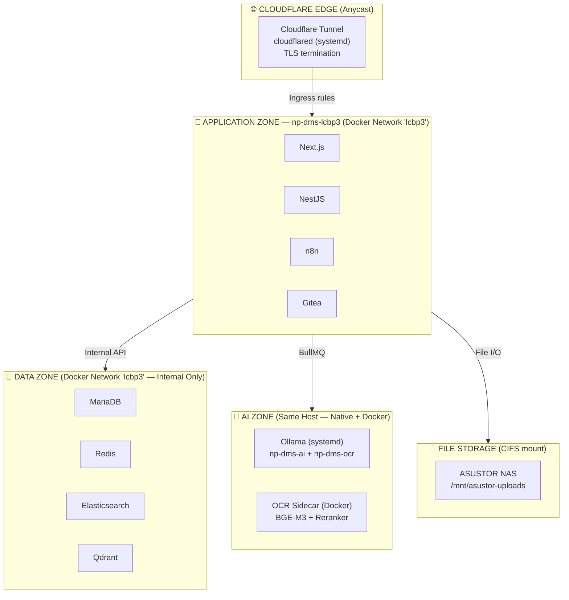
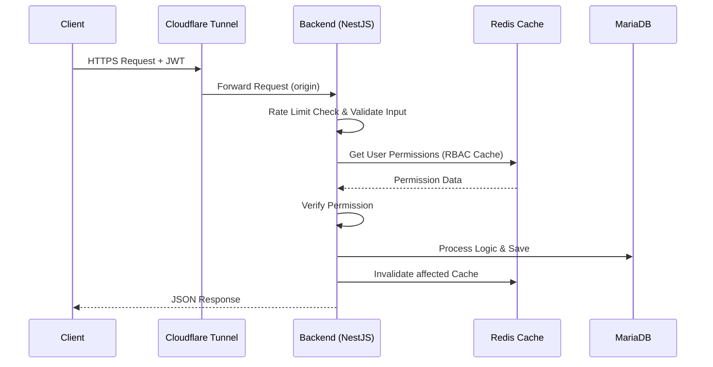
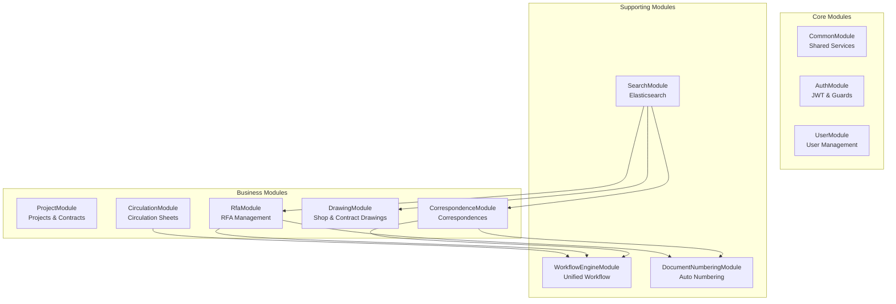
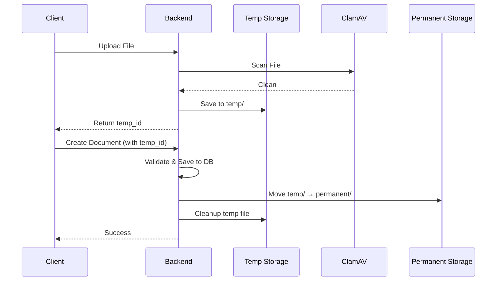
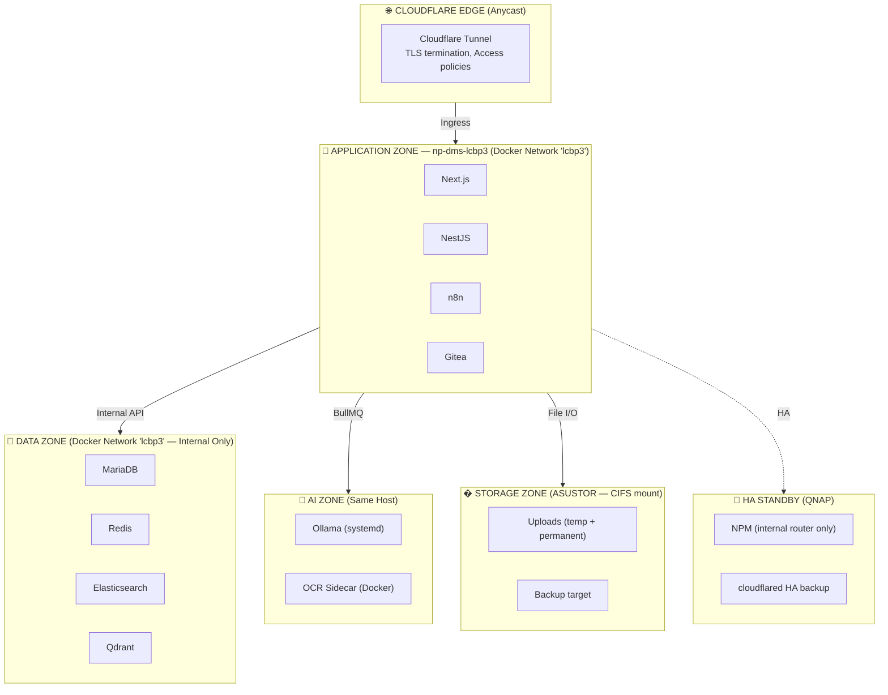
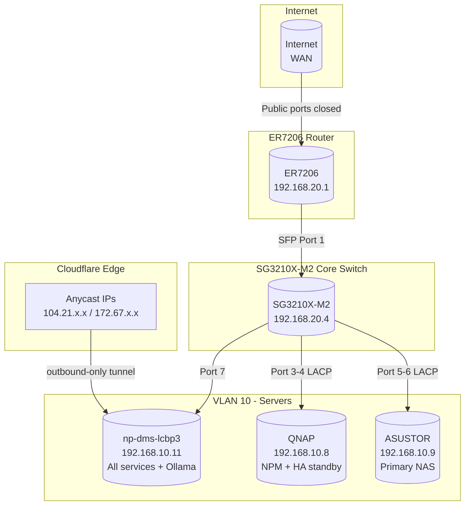
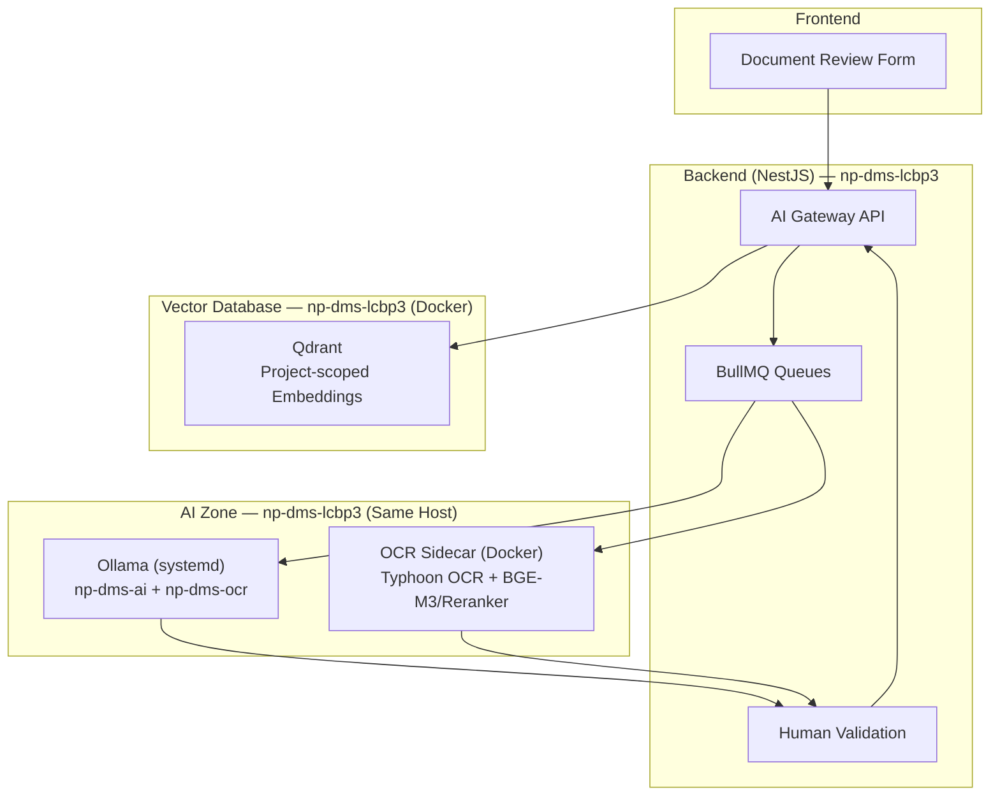

# LCBP3-DMS Architecture Documentation

---

**title:** 'LCBP3-DMS Architecture Documentation'
**version:** 1.9.12
**status:** active
**owner:** Nattanin Peancharoen
**last_updated:** 2026-07-30
**related:**

- specs/02-Architecture/02-01-system-context.md
- specs/02-Architecture/02-02-software-architecture.md
- specs/02-Architecture/02-03-network-design.md
- specs/02-Architecture/02-04-api-design.md
- specs/02-Architecture/02-05-ai-document-ingestion-flow.md
- specs/06-Decision-Records/

---

## 📋 Table of Contents

1. [System Context & Architecture](#1-system-context--architecture)
2. [Software Architecture & Design](#2-software-architecture--design)
3. [Network Design & Security](#3-network-design--security)
4. [API Design & Error Handling](#4-api-design--error-handling)
5. [AI Architecture (ADR-023/023A/024/025/034/035/036/040/042)](#5-ai-architecture-adr-023023a)
6. [Architecture Decision Records (ADRs)](#6-architecture-decision-records-adrs)
7. [AI Document Ingestion Flow](#7-ai-document-ingestion-flow)

---

## 1. System Context & Architecture

### 1.1 System Overview

ระบบ LCBP3-DMS (Laem Chabang Port Phase 3 - Document Management System) ถูกออกแบบด้วยสถาปัตยกรรมแบบ **Headless/API-First Architecture** โดยทำงานแบบ **On-Premise 100%** บนเซิร์ฟเวอร์ `np-dms-lcbp3` (192.168.10.11) ซึ่งเป็น bare-metal Ubuntu server เดียวที่รวมทุก services ตาม ADR-041 (Server Consolidation) — QNAP ทำหน้าที่เป็น internal router/HA standby เท่านั้น และ ASUSTOR เป็น Primary NAS สำหรับ file storage + backup

### 1.2 Architecture Principles

1. **Data Integrity First:** ความถูกต้องของข้อมูลต้องมาก่อนทุกอย่าง
2. **Security by Design & Container Isolation:** รักษาความปลอดภัยที่ทุกชั้น และแยกส่วนการทำงานของแต่ละระบบอย่างชัดเจน
3. **On-Premise First:** ข้อมูลและระบบงานทั้งหมดต้องอยู่ภายในเครือข่ายของโครงการเท่านั้น
4. **Resilience:** ทนทานต่อ Failure และ Recovery ได้รวดเร็ว
5. **Observability:** ติดตามและวิเคราะห์สถานะระบบได้ง่าย

### 1.3 Hardware Infrastructure (Post-Consolidation — ADR-041)

| Component             | Specification                                           | Role                                          | IP Address     |
| --------------------- | ------------------------------------------------------- | --------------------------------------------- | -------------- |
| **Primary Server**    | np-dms-lcbp3 (Ryzen 5 5600, 32GB RAM, RTX 5060 Ti 16GB) | All Docker services + Ollama (native systemd) | 192.168.10.11  |
| **Edge / HA Standby** | QNAP TS-473A (AMD Ryzen V1500B, 32GB RAM)               | NPM (internal router), cloudflared HA backup  | 192.168.10.8   |
| **Primary NAS**       | ASUSTOR AS5304T                                         | File storage (uploads), backup target         | 192.168.10.9   |
| **Decommissioned**    | Desk-5439 (Intel, RTX 4060 Ti 16GB)                     | Former AI host — shut down post-migration     | 192.168.10.100 |
| **Network Interface** | LACP bonding (IEEE 802.3ad) on QNAP                     | High availability & bandwidth                 | -              |

> **หมายเหตุ:** ก่อน ADR-041 ระบบกระจาย services บน QNAP + Desk-5439 หลัง migration ย้ายมารวมบน np-dms-lcbp3 ทั้งหมด ดู `MIGRATION-PLAN.md` สำหรับรายละเอียดการย้าย

### 1.4 Container Isolation & Environment (Post-Consolidation)


```mermaid
graph TB
    subgraph EdgeZone["🌐 CLOUDFLARE EDGE (Anycast)"]
        CF["Cloudflare Tunnel<br/>cloudflared (systemd)<br/>TLS termination"]
    end

    subgraph AppZone["📱 APPLICATION ZONE — np-dms-lcbp3 (Docker Network 'lcbp3')"]
        Frontend["Next.js"]
        Backend["NestJS"]
        N8N["n8n"]
        Gitea["Gitea"]
    end

    subgraph DataZone["💾 DATA ZONE (Docker Network 'lcbp3' — Internal Only)"]
        MariaDB["MariaDB"]
        Redis["Redis"]
        ES["Elasticsearch"]
        Qdrant["Qdrant"]
    end

    subgraph AIZone["🤖 AI ZONE (Same Host — Native + Docker)"]
        Ollama["Ollama (systemd)<br/>np-dms-ai + np-dms-ocr"]
        OCR["OCR Sidecar (Docker)<br/>BGE-M3 + Reranker"]
    end

    subgraph StorageZone["💾 FILE STORAGE (CIFS mount)"]
        ASUSTOR["ASUSTOR NAS<br/>/mnt/asustor-uploads"]
    end

    CF -->|Ingress rules| AppZone
    AppZone -->|Internal API| DataZone
    AppZone -->|BullMQ| AIZone
    AppZone -->|File I/O| StorageZone
```

> **D5 Revised (2026-07-05):** Cloudflare Tunnel เป็น internet-facing edge เดียว — NPM บน QNAP ถูกลดบทบาทเป็น internal router เท่านั้น ดู `MIGRATION-PLAN.md` Section 11

### 1.5 Core Services Architecture

| Service       | Application Name | Domain              | Technology          | Purpose                       |
| ------------- | ---------------- | ------------------- | ------------------- | ----------------------------- |
| **Frontend**  | lcbp3-frontend   | lcbp3.np-dms.work   | Next.js 16.2.0      | Web UI                        |
| **Backend**   | lcbp3-backend    | backend.np-dms.work | NestJS 11           | API Server & Logic            |
| **Database**  | lcbp3-db         | -                   | MariaDB 11.8        | Primary Data                  |
| **Edge**      | -                | -                   | Cloudflare Tunnel   | TLS termination, Ingress edge |
| **Workflow**  | lcbp3-n8n        | n8n.np-dms.work     | n8n                 | Process Automation            |
| **Git**       | git              | git.np-dms.work     | Gitea               | Code Repository               |
| **Cache**     | -                | -                   | Redis               | Caching, Locking              |
| **Search**    | -                | -                   | Elasticsearch 9.3.4 | Full-text Indexing            |
| **Vector DB** | -                | -                   | Qdrant              | Project-scoped embeddings     |
| **AI LLM**    | -                | -                   | Ollama (systemd)    | np-dms-ai + np-dms-ocr        |
| **OCR**       | ocr-sidecar      | -                   | FastAPI (Docker)    | Typhoon OCR + BGE-M3/Reranker |
| **Antivirus** | clamav           | -                   | ClamAV (Docker)     | File scan                     |

### 1.5.1 Frontend Test Structure

Frontend unit and component tests use Vitest + React Testing Library. Test files follow the live `frontend/vitest.config.ts` include pattern with `*.test.ts` / `*.test.tsx` and are placed in `__tests__` folders beside the covered source where practical.

Current coverage expansion includes admin (`components/admin/**/__tests__`), workflow (`components/workflow/__tests__`), transmittal (`components/transmittal/__tests__`), hooks (`hooks/__tests__`), services (`lib/services/__tests__`), API client (`lib/api/__tests__`), stores (`lib/stores/__tests__`), utils (`lib/utils/__tests__`), common components, and UI components. HTTP-facing code is mocked; no frontend coverage test should call the backend API directly.

### 1.6 Data Flow & Interactions


```mermaid
sequenceDiagram
    participant Client as Client
    participant CF as Cloudflare Tunnel
    participant BE as Backend (NestJS)
    participant Redis as Redis Cache
    participant DB as MariaDB

    Client->>CF: HTTPS Request + JWT
    CF->>BE: Forward Request (origin)

    BE->>BE: Rate Limit Check & Validate Input
    BE->>Redis: Get User Permissions (RBAC Cache)
    Redis-->>BE: Permission Data
    BE->>BE: Verify Permission

    BE->>DB: Process Logic & Save
    BE->>Redis: Invalidate affected Cache

    BE-->>Client: JSON Response
```

### 1.7 Backup & Disaster Recovery

- **Database Backup:** ทำ Automated Backup รายวัน (mariadb-dump → `/opt/np-dms/mariadb/backup/`)
- **File Backup:** ASUSTOR เป็น Primary NAS — uploads และ backup ได้รับการ rsync ไปยัง QNAP เป็น offsite copy
- **Recovery Standard:** หาก New Server พัง สามารถ Restore DB dump + file data และรัน `docker compose up` ขึ้นใหม่ได้ทันที
- **UPS Protection:** NUT (Network UPS Tools) ติดตั้งบน np-dms-lcbp3 — เมื่อไฟดับและแบตเหลือ < 20% ระบบจะ graceful stop Docker stack ทั้ง 4 layers ก่อน shutdown อัตโนมัติ (ดู `MIGRATION-PLAN.md` Section 12)

---

## 2. Software Architecture & Design

### 2.1 Backend Module Architecture (NestJS)


```mermaid
graph TB
    subgraph "Core Modules"
        Common[CommonModule<br/>Shared Services]
        Auth[AuthModule<br/>JWT & Guards]
        User[UserModule<br/>User Management]
    end

    subgraph "Business Modules"
        Project[ProjectModule<br/>Projects & Contracts]
        Corr[CorrespondenceModule<br/>Correspondences]
        RFA[RfaModule<br/>RFA Management]
        Drawing[DrawingModule<br/>Shop & Contract Drawings]
        Circ[CirculationModule<br/>Circulation Sheets]
    end

    subgraph "Supporting Modules"
        Workflow[WorkflowEngineModule<br/>Unified Workflow]
        Numbering[DocumentNumberingModule<br/>Auto Numbering]
        Search[SearchModule<br/>Elasticsearch]
    end

    Corr --> Workflow
    RFA --> Workflow
    Circ --> Workflow

    Corr --> Numbering
    RFA --> Numbering

    Search --> Corr
    Search --> RFA
    Search --> Drawing
```

### 2.2 Key Architectural Patterns

#### Unified Workflow Engine (DSL-Based)

ระบบการเดินเอกสารใช้ Engine กลางเดียวกัน ผ่าน **Workflow DSL (JSON Configuration)**

- **Separation of Concerns:** Modules เก็บเฉพาะข้อมูล (Data) ส่วน Flow/State ถูกจัดการโดย Engine
- **Versioning:** อาศัย Workflow Definition Version ป้องกันความขัดแย้งของ State

#### Double-Locking Mechanism (Auto Numbering)

เพื่อป้องกัน Race Condition ในการขอเลขเอกสารพร้อมกัน:

- **Layer 1:** Redis Distributed Lock (ล็อคการเข้าถึงในระดับ Server/Network)
- **Layer 2:** Optimistic Database Lock ผ่าน `@VersionColumn()` (ป้องกันระดับ Data Record)

#### Idempotency

ทุก API ที่แก้ไขสถานะจะต้องส่ง `Idempotency-Key` ป้องกันผู้ใช้กดยืนยันซ้ำสองรอบ

### 2.3 File Upload Flow (Two-Phase Storage)


```mermaid
sequenceDiagram
    participant Client as Client
    participant BE as Backend
    participant Temp as Temp Storage
    participant Virus as ClamAV
    participant Perm as Permanent Storage

    Client->>BE: Upload File
    BE->>Virus: Scan File
    Virus-->>BE: Clean
    BE->>Temp: Save to temp/
    BE-->>Client: Return temp_id

    Client->>BE: Create Document (with temp_id)
    BE->>BE: Validate & Save to DB
    BE->>Perm: Move temp/ → permanent/
    BE->>Temp: Cleanup temp file
    BE-->>Client: Success
```

### 2.4 Security Architecture

#### Rate Limiting (Redis-backed)

| Endpoint Type    | Limit         | Scope |
| ---------------- | ------------- | ----- |
| Anonymous        | 100 req/hour  | IP    |
| File Upload      | 50 req/hour   | User  |
| Document Control | 2000 req/hour | User  |
| Admin            | 5000 req/hour | User  |

#### Authorization checking flow (CASL)

1. ดึง JWT Token ตรวจสอบความถูกต้อง
2. โหลด User Permissions จาก Redis
3. ตรวจสอบเงื่อนไขตาม Context (Global, Organization, Project, Contract)
4. พิจารณาอนุญาตหากระดับใดระดับหนึ่งอนุญาต

### 2.5 Resilience & Error Handling

- **Circuit Breaker:** ใช้งานครอบ API ภายนอก (Email, LINE Notify)
- **Retry Mechanism:** สำหรับกระบวนการสำคัญชั่วคราว
- **Graceful Degradation:** หาก Search Engine ล่ม ระบบสลับไปใช้ Database Query พื้นฐานชั่วคราวได้

---

## 3. Network Design & Security

### 3.1 Network Segmentation (VLANs)

| VLAN ID | Name   | Purpose            | Subnet          | Gateway      | Notes                                     |
| ------- | ------ | ------------------ | --------------- | ------------ | ----------------------------------------- |
| 10      | SERVER | Server & Storage   | 192.168.10.0/24 | 192.168.10.1 | Servers (QNAP, ASUSTOR). Static IPs ONLY. |
| 20      | MGMT   | Management & Admin | 192.168.20.0/24 | 192.168.20.1 | Network devices, Admin PC.                |
| 30      | USER   | User Devices       | 192.168.30.0/24 | 192.168.30.1 | Staff PC, Printers.                       |
| 40      | CCTV   | Surveillance       | 192.168.40.0/24 | 192.168.40.1 | Cameras, NVR. Isolated.                   |
| 50      | VOICE  | IP Phones          | 192.168.50.0/24 | 192.168.50.1 | SIP traffic. Isolated.                    |
| 60      | DMZ    | Public Services    | 192.168.60.0/24 | 192.168.60.1 | DMZ. Isolated from Internal.              |
| 70      | GUEST  | Guest Wi-Fi        | 192.168.70.0/24 | 192.168.70.1 | Isolated Internet Access only.            |

### 3.2 Security Zones (Post-Consolidation)


```mermaid
flowchart TB
    subgraph EdgeZone["🌐 CLOUDFLARE EDGE (Anycast)"]
        CF["Cloudflare Tunnel<br/>TLS termination, Access policies"]
    end

    subgraph AppZone["📱 APPLICATION ZONE — np-dms-lcbp3 (Docker Network 'lcbp3')"]
        Frontend["Next.js"]
        Backend["NestJS"]
        N8N["n8n"]
        Gitea["Gitea"]
    end

    subgraph DataZone["💾 DATA ZONE (Docker Network 'lcbp3' — Internal Only)"]
        MariaDB["MariaDB"]
        Redis["Redis"]
        ES["Elasticsearch"]
        Qdrant["Qdrant"]
    end

    subgraph AIZone["🤖 AI ZONE (Same Host)"]
        Ollama["Ollama (systemd)"]
        OCR["OCR Sidecar (Docker)"]
    end

    subgraph StorageZone["� STORAGE ZONE (ASUSTOR — CIFS mount)"]
        Uploads["Uploads (temp + permanent)"]
        Backup["Backup target"]
    end

    subgraph HAZone["🔄 HA STANDBY (QNAP)"]
        NPM["NPM (internal router only)"]
        CFHA["cloudflared HA backup"]
    end

    EdgeZone -->|Ingress| AppZone
    AppZone -->|Internal API| DataZone
    AppZone -->|BullMQ| AIZone
    AppZone -->|File I/O| StorageZone
    AppZone -.->|HA| HAZone
```

### 3.3 Network Topology (Post-Consolidation)


```mermaid
graph TB
    subgraph Internet
        WAN[("Internet<br/>WAN")]
    end

    subgraph Cloudflare["Cloudflare Edge"]
        CF["Anycast IPs<br/>104.21.x.x / 172.67.x.x"]
    end

    subgraph Router["ER7206 Router"]
        R[("ER7206<br/>192.168.20.1")]
    end

    subgraph CoreSwitch["SG3210X-M2 Core Switch"]
        CS[("SG3210X-M2<br/>192.168.20.4")]
    end

    subgraph Servers["VLAN 10 - Servers"]
        NewServer[(" np-dms-lcbp3<br/>192.168.10.11<br/>All services + Ollama")]
        QNAP[(" QNAP<br/>192.168.10.8<br/>NPM + HA standby")]
        ASUSTOR[(" ASUSTOR<br/>192.168.10.9<br/>Primary NAS")]
    end

    WAN -->|Public ports closed| R
    R -->|SFP Port 1| CS
    CF -->|outbound-only tunnel| NewServer
    CS -->|Port 3-4 LACP| QNAP
    CS -->|Port 5-6 LACP| ASUSTOR
    CS -->|Port 7| NewServer
```

> **Edge Architecture:** Public ports 80/443/8443 ปิดบน router — traffic วิ่งผ่าน Cloudflare Anycast → cloudflared (systemd) บน np-dms-lcbp3 เท่านั้น ยกเว้น Git SSH (port 2222) ที่ใช้ DNS-only record

### 3.4 Firewall Rules (ACLs)

กฎของ Firewall จะถูกกำหนดตามหลักการอนุญาตแค่สิ่งที่ต้องการ (Default Deny)

| Priority | Rule                   | Policy | Source            | Destination        | Ports                          |
| -------- | ---------------------- | ------ | ----------------- | ------------------ | ------------------------------ |
| 1        | Allow-User-DHCP        | Allow  | Network → VLAN 30 | IP → 192.168.30.1  | DHCP                           |
| 2        | Allow-Guest-DHCP       | Allow  | Network → VLAN 70 | IP → 192.168.70.1  | DHCP                           |
| 3        | Isolate-Servers        | Deny   | Network → VLAN 10 | Network → VLAN 30  | All                            |
| 4        | Block-User-to-Mgmt     | Deny   | Network → VLAN 30 | Network → VLAN 20  | All                            |
| 5        | Allow-User-to-Services | Allow  | Network → VLAN 30 | IP → 192.168.10.11 | Web (3000,3001,3003,5678,8080) |
| 100      | Default                | Deny   | Any               | Any                | All                            |

### 3.5 QoS (Quality of Service) Settings

| Priority    | DSCP Value | Traffic Type          | Application            |
| ----------- | ---------- | --------------------- | ---------------------- |
| Highest (7) | EF (46)    | Voice (SIP/RTP)       | IP Phones (VLAN 50)    |
| High (6)    | AF41 (34)  | Video Surveillance    | CCTV Cameras (VLAN 40) |
| Medium (5)  | AF31 (26)  | Critical Applications | DMS Backend, Database  |
| Low (4)     | AF21 (18)  | Best Effort           | Web browsing, Email    |

---

## 4. API Design & Error Handling

### 4.1 API Design Principles

#### API-First Approach

- **ออกแบบ API ก่อนการ Implement:** ทำการออกแบบ API Endpoint และ Data Contract ให้ชัดเจนก่อนเริ่มเขียนโค้ด
- **Documentation-Driven:** ใช้ OpenAPI/Swagger เป็นเอกสารอ้างอิงหลัก
- **Contract Testing:** ทดสอบ API ตาม Contract ที่กำหนดไว้

#### RESTful Principles

- ใช้ HTTP Methods อย่างถูกต้อง: `GET`, `POST`, `PUT`, `PATCH`, `DELETE`
- ใช้ HTTP Status Codes ที่เหมาะสม
- Resource-Based URL Design
- Stateless Communication

### 4.2 Authentication & Authorization

#### JWT-Based Authentication

- **Token Management:**
  - Access Token Expiration: 8 ชั่วโมง
  - Refresh Token Expiration: 7 วัน
  - Token Rotation: รองรับการหมุนเวียน Refresh Token

#### Authorization (RBAC) (CASL)

ใช้ระบบ 4-Level Permission Hierarchy (Global, Organization, Project, Contract)

```typescript
@RequirePermission('correspondence.create')
@Post('correspondences')
async createCorrespondence(@Body() dto: CreateCorrespondenceDto) {
  // Implementation
}
```

### 4.3 API Conventions

#### Base URL Structure

```
https://backend.np-dms.work/api/v1/{resource}
```

#### HTTP Methods & Usage

| Method   | Usage                          | Idempotent | Example                                |
| -------- | ------------------------------ | ---------- | -------------------------------------- |
| `GET`    | ดึงข้อมูล (Read)               | ✅ Yes     | `GET /api/v1/correspondences`          |
| `POST`   | สร้างข้อมูลใหม่ (Create)       | ❌ No\*    | `POST /api/v1/correspondences`         |
| `PUT`    | อัปเดตทั้งหมด (Full Update)    | ✅ Yes     | `PUT /api/v1/correspondences/:uuid`    |
| `PATCH`  | อัปเดตบางส่วน (Partial Update) | ✅ Yes     | `PATCH /api/v1/correspondences/:uuid`  |
| `DELETE` | ลบข้อมูล (Soft Delete)         | ✅ Yes     | `DELETE /api/v1/correspondences/:uuid` |

### 4.4 Request Format

**Request Headers:**

```http
Content-Type: application/json
Authorization: Bearer <access_token>
Idempotency-Key: <uuid> # สำหรับ POST/PUT/DELETE
```

### 4.5 Response Formats

#### Success Response

```typescript
{
  "data": {
    "uuid": "019505a1-7c3e-7000-8000-abc123def456",
    "document_number": "CORR-2024-0001",
    "subject": "...",
  },
  "meta": {
    "timestamp": "2024-01-01T00:00:00Z",
    "version": "1.0"
  }
}
```

#### Error Response Format

```typescript
{
  "error": {
    "code": "VALIDATION_ERROR",
    "message": "Validation failed on input data",
    "statusCode": 400,
    "timestamp": "2024-01-01T00:00:00Z",
    "path": "/api/correspondences",
    "details": [
      {
        "field": "subject",
        "message": "Subject is required",
        "value": null
      }
    ]
  }
}
```

### 4.6 Error Handling Strategy

#### Global Exception Filter

คลาสจัดการ Error หลักที่จะจับและดัดแปลง Error ส่งคืน Client อย่างสม่ำเสมอ

#### Custom Business Exception

สำหรับจัดการข้อผิดพลาดเชิงความสัมพันธ์ หรือเงื่อนไขธุรกิจ

```typescript
throw new BusinessException('Cannot approve correspondence in current status', 'INVALID_WORKFLOW_TRANSITION');
```

### 4.7 API Security & Rate Limiting

#### File Upload Security

- **Virus Scanning:** ใช้ ClamAV scan ทุกไฟล์
- **File Type Validation:** White-list (PDF, DWG, DOCX, XLSX, ZIP)
- **File Size Limit:** 50MB per file
- **Two-Phase Storage:** Upload to `temp/` → Commit to `permanent/`

---

## 5. AI Architecture (ADR-023/023A/024/025/034/035/036/040/042)

### 5.1 AI Integration Architecture (Post-Consolidation — ADR-041)


```mermaid
graph TB
    subgraph "Frontend"
        UI["Document Review Form"]
    end

    subgraph "Backend (NestJS) — np-dms-lcbp3"
        Gateway["AI Gateway API"]
        Queue["BullMQ Queues"]
        Validation["Human Validation"]
    end

    subgraph "AI Zone — np-dms-lcbp3 (Same Host)"
        Ollama["Ollama (systemd)<br/>np-dms-ai + np-dms-ocr"]
        OCR["OCR Sidecar (Docker)<br/>Typhoon OCR + BGE-M3/Reranker"]
    end

    subgraph "Vector Database — np-dms-lcbp3 (Docker)"
        Qdrant["Qdrant<br/>Project-scoped Embeddings"]
    end

    UI --> Gateway
    Gateway --> Queue
    Queue --> Ollama
    Queue --> OCR
    Ollama --> Validation
    OCR --> Validation
    Validation --> Gateway
    Gateway --> Qdrant
```

### 5.2 Key Components

| Component         | Location                        | Purpose                                                 |
| ----------------- | ------------------------------- | ------------------------------------------------------- |
| **AI Gateway**    | Backend (NestJS) — np-dms-lcbp3 | API endpoints, validation, audit logging                |
| **BullMQ Queues** | Backend (NestJS) — np-dms-lcbp3 | ai-realtime (RAG/Suggest), ai-batch (OCR/Extract/Embed) |
| **Ollama Engine** | np-dms-lcbp3 (native systemd)   | `np-dms-ai` (main LLM) + `np-dms-ocr` (OCR model)       |
| **OCR Sidecar**   | np-dms-lcbp3 (Docker)           | Typhoon OCR endpoint + BGE-M3 embed + BGE reranker      |
| **Qdrant**        | np-dms-lcbp3 (Docker)           | Vector storage with project isolation                   |

### 5.3 AI Architecture Rules

- **AI Isolation:** All AI processing on np-dms-lcbp3 only (post-ADR-041 — formerly Desk-5439)
- **Data Privacy:** No cloud AI services, on-premises only
- **Audit Trail:** Log all AI interactions and human validations
- **Rate Limiting:** Prevent AI abuse and resource exhaustion
- **Validation:** All AI outputs must be validated before use
- **Multi-tenant Isolation:** Qdrant queries MUST include projectPublicId filter
- **Network-Trust Boundary:** ADR-040 Phase 2 — Docker-internal isolation replaces X-API-Key auth (complete 2026-07-30, post-ADR-041 cutover)

### 5.4 Model Stack (ADR-034 + ADR-035, amended by ADR-040)

- **np-dms-ai** (`typhoon2.5-qwen3-4b:latest`) — Main LLM for classification, tagging, extraction, RAG answers; `keep_alive` = standby ตลอด
- **np-dms-ocr** (`typhoon-ocr1.5-3b:latest`) — OCR model through the sidecar (engine เดียว — ADR-040 D1); `keep_alive = 0` (unload ทันที, adaptive residency from ADR-033)
- **BGE-M3** (`BAAI/bge-m3`) — Embedding vectors → Qdrant (Dense 1024 + Sparse); replaces `nomic-embed-text` (ADR-035)
- **BGE-Reranker-Large** — Re-rank RAG results ก่อนส่ง LLM; served by OCR sidecar (CPU RAM)
- ~~Tesseract~~ — **removed** per ADR-040 D1 (ไม่มี Tesseract fallback ในโค้ดจริง — engine เดียว `np-dms-ocr`)
- **OCR Sidecar Phase 1 hardening** — ADR-040: network-only auth (post-ADR-041), upload-base path canonicalization, adaptive residency/CPU fallback verification, ลบ `/normalize` endpoint

> ⚠️ **ADR-035 amendment:** ADR-035 อ้าง Tesseract fallback และ `/normalize` endpoint แต่ถูกแก้โดย ADR-040 (2026-06-20) — ดู [`ADR-035`](./specs/06-Decision-Records/ADR-035-ai-pipeline-flow-architecture.md) amendment note สำหรับรายละเอียด

---

### 5.5 Parameter Governance (ADR-036)

- **Production defaults:** `ai_execution_profiles`, keyed by `profile_name` and `canonical_model`
- **Sandbox drafts:** `ai_sandbox_profiles`, seeded from production before admin testing
- **Apply semantics:** draft → production UPSERT + Redis cache invalidation; affects new jobs only
- **Snapshot semantics:** LLM params use `snapshotParams`; OCR quality params use `ocrSnapshotParams`; `keep_alive` remains lazy per ADR-033

---

## 6. Architecture Decision Records (ADRs)

### 6.1 Key ADRs Implemented

| ADR          | Title                           | Status         | Description                                                                                                 |
| ------------ | ------------------------------- | -------------- | ----------------------------------------------------------------------------------------------------------- |
| **ADR-001**  | Unified Workflow Engine         | ✅ Active      | DSL-based workflow implementation                                                                           |
| **ADR-002**  | Document Numbering Strategy     | ✅ Active      | Document number generation + locking                                                                        |
| **ADR-007**  | Error Handling Strategy         | ✅ Active      | Layered error classification                                                                                |
| **ADR-008**  | Email Notification Strategy     | ✅ Active      | BullMQ + multi-channel notification                                                                         |
| **ADR-009**  | Database Migration Strategy     | ✅ Active      | Schema changes — edit SQL directly                                                                          |
| **ADR-016**  | Security Authentication         | ✅ Active      | Auth, RBAC, file upload security                                                                            |
| **ADR-019**  | Hybrid Identifier Strategy      | ✅ Active      | INT PK + UUIDv7 Public API                                                                                  |
| **ADR-021**  | Workflow Context                | ✅ Active      | Integrated workflow & step attachments                                                                      |
| **ADR-023**  | Unified AI Architecture         | ✅ Active      | AI boundaries and pipeline                                                                                  |
| **ADR-023A** | AI Model Revision               | ✅ Active      | 2-Model stack with BullMQ queues                                                                            |
| **ADR-024**  | Intent Classification Strategy  | ✅ Active      | Hybrid Pattern → LLM Fallback intent routing                                                                |
| **ADR-025**  | AI Tool Layer Architecture      | ✅ Active      | Server-side Tool dispatch, CASL-guarded bridge                                                              |
| **ADR-026**  | Document Chat UI Pattern        | ✅ Active      | Side-panel document chat UI                                                                                 |
| **ADR-027**  | AI Admin Console & Dynamic Ctrl | ✅ Active      | AI Admin Panel + dynamic model/prompt control                                                               |
| **ADR-028**  | Migration Architecture Refactor | ✅ Active      | Staging Queue & post-migration cleanup                                                                      |
| **ADR-029**  | Dynamic Prompt Management       | ✅ Active      | Prompt templates in DB (`ai_prompts`), Redis cache TTL 60s, versioned                                       |
| **ADR-031**  | Hermes Agent & Telegram Bridge  | 📝 Draft       | Optional DevOps Agent with Telegram commands, read-only diagnostics                                         |
| **ADR-032**  | Typhoon OCR Integration         | 📝 Draft       | Typhoon OCR-3B + typhoon2.1-gemma3-4b on Admin Desktop, VRAM monitoring, Redis caching                      |
| **ADR-034**  | AI Model Change                 | ✅ Active      | Canonical model identities `np-dms-ai` and `np-dms-ocr` (Typhoon 2.5 + Typhoon OCR)                         |
| **ADR-035**  | AI Pipeline Flow Architecture   | ⚠️ Amended     | 4-flow pipeline, BGE-M3 — OCR sidecar contract amended by ADR-040 (Tesseract removed, `/normalize` removed) |
| **ADR-036**  | Unified AI Model Architecture   | 📋 Proposed    | Sandbox-Production Parity, Profile-Only Parameter Governance                                                |
| **ADR-037**  | Unified Prompt Management UX/UI | ✅ Implemented | Extends ADR-029 prompt_type scope                                                                           |
| **ADR-040**  | OCR Sidecar Refactor            | 📋 Proposed    | Pure compute worker, engine เดียว np-dms-ocr, ลบ `/normalize`, path traversal hardening, amends ADR-035     |
| **ADR-041**  | Server Consolidation            | ✅ Implemented | Single-host Docker on np-dms-lcbp3, 4-layer compose                                                         |
| **ADR-042**  | Sandbox Project + OCR Persist   | 📋 Proposed    | DB-committing full pipeline test + OCR text persistence (แยก rag-prepare เป็น 2 jobs)                       |

### 6.2 ADR References

For detailed architectural decisions, please refer to:

- `specs/06-Decision-Records/` - Complete ADR documentation
- `AGENTS.md` - Quick-reference rules and enforcement

---

## 📚 Related Documentation

- **System Context:** `specs/02-Architecture/02-01-system-context.md`
- **Software Architecture:** `specs/02-Architecture/02-02-software-architecture.md`
- **Network Design:** `specs/02-Architecture/02-03-network-design.md`
- **API Design:** `specs/02-Architecture/02-04-api-design.md`
- **AI Document Ingestion Flow:** `specs/02-Architecture/02-05-ai-document-ingestion-flow.md`
- **Decision Records:** `specs/06-Decision-Records/`
- **Data Schema:** `specs/03-Data-and-Storage/lcbp3-v1.9.0-schema-*.sql`
- **Engineering Guidelines:** `specs/05-Engineering-Guidelines/`
- **Migration Plan:** `specs/04-Infrastructure-OPS/04-00-docker-compose/np-dms-lcbp3/MIGRATION-PLAN.md`

---

## 7. AI Document Ingestion Flow

→ Full walkthrough: [`specs/02-Architecture/02-05-ai-document-ingestion-flow.md`](./specs/02-Architecture/02-05-ai-document-ingestion-flow.md)

เอกสาร `02-05` อธิบาย end-to-end flow ของการนำเอกสารเข้าระบบ (Frontend → Backend → BullMQ Worker → OCR/Embed) โดยอ้างอิง:

- **ADR-040** — Source of Truth สำหรับ OCR sidecar contract (engine selection, `/normalize` removal)
- **ADR-042** — OCR text persistence + Sandbox Project
- **ADR-023A** — AI boundary + Qdrant `projectPublicId` filter
- **ADR-016** — Two-Phase File Upload

> ⚠️ ADR-035 อ้าง Tesseract fallback + `/normalize` endpoint แต่ถูก amend โดย ADR-040 — ดู amendment note ใน ADR-035

---

## 🔄 Version History

| Version    | Date       | Changes                                                                                                                                                      |
| ---------- | ---------- | ------------------------------------------------------------------------------------------------------------------------------------------------------------ |
| **1.9.12** | 2026-07-30 | Added 02-05 AI Document Ingestion Flow; marked ADR-035 as amended by ADR-040; added ADR-036/037/040/041/042 to ADR table; removed Tesseract from model stack |
| **1.9.11** | 2026-07-23 | Post-migration update: ADR-041 server consolidation, Cloudflare Tunnel edge, ADR-035/040 added, AI moved to np-dms-lcbp3, NUT/UPS                            |
| **1.9.9**  | 2026-06-13 | Updated AI Architecture for ADR-036 sandbox-production parity and canonical `np-dms-ai`/`np-dms-ocr` model names                                             |
| **1.9.7**  | 2026-05-25 | Added ADR-029 Dynamic Prompt Management to ADR table; bumped version/date                                                                                    |
| **1.9.5**  | 2026-05-22 | Added ADR-024/025/026/027/028 to ADR reference table; updated AI Architecture section heading; schema reference corrected to v1.9.0                          |
| **1.9.2**  | 2026-05-18 | Complete restructure following specs/02-Architecture format, added comprehensive diagrams, updated AI Architecture (ADR-023/023A)                            |
| **1.9.0**  | 2026-05-13 | AI Architecture consolidation, Agent Infrastructure standardization                                                                                          |
| **1.8.0**  | 2026-02-23 | Initial architecture documentation                                                                                                                           |

---

_This document is maintained as part of the LCBP3-DMS project specification suite._
