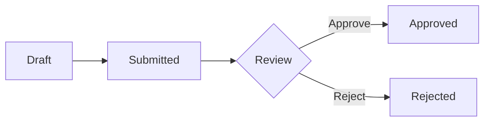

# 📝 Contributing to LCBP3-DMS Specifications

> แนวทางการมีส่วนร่วมในการพัฒนาเอกสาร Specifications ของโครงการ LCBP3-DMS

ยินดีต้อนรับสู่คู่มือการมีส่วนร่วมในการพัฒนาเอกสาร Specifications! เอกสารนี้จะช่วยให้คุณเข้าใจวิธีการสร้าง แก้ไข และปรับปรุงเอกสารข้อกำหนดของโครงการได้อย่างมีประสิทธิภาพ

---

## 📚 Table of Contents

- [ภาพรวม Specification Structure](#-specification-structure)
- [หลักการเขียน Specifications](#-writing-principles)
- [Workflow การแก้ไข Specs](#-contribution-workflow)
- [Template และ Guidelines](#-templates--guidelines)
- [Review Process](#-review-process)
- [Best Practices](#-best-practices)
- [Tools และ Resources](#-tools--resources)

---

## 🗂️ Specification Structure

โครงสร้างเอกสาร Specifications ของโครงการแบ่งออกเป็น 6 หมวดหลัก:

```
specs/
├── 00-overview/              # ภาพรวมโครงการ
│   ├── README.md            # Project overview
│   └── glossary.md          # คำศัพท์เทคนิค
│
├── 01-requirements/          # ข้อกำหนดระบบ
│   ├── README.md            # Requirements overview
│   ├── 01-objectives.md     # วัตถุประสงค์
│   ├── 02-architecture.md   # สถาปัตยกรรม
│   ├── 03-functional-requirements.md
│   ├── 03.1-project-management.md
│   ├── 03.2-correspondence.md
│   ├── 03.3-rfa.md
│   ├── 03.4-contract-drawing.md
│   ├── 03.5-shop-drawing.md
│   ├── 03.6-unified-workflow.md
│   ├── 03.7-transmittals.md
│   ├── 03.8-circulation-sheet.md
│   ├── 03.9-logs.md
│   ├── 03.10-file-handling.md
│   ├── 03.11-document-numbering.md
│   ├── 03.12-json-details.md
│   ├── 04-access-control.md
│   ├── 05-ui-ux.md
│   ├── 06-non-functional.md
│   └── 07-testing.md
│
├── 02-architecture/          # สถาปัตยกรรมระบบ
│   ├── README.md
│   ├── system-architecture.md
│   ├── api-design.md
│   └── data-model.md
│
├── 03-implementation/        # แผนการพัฒนา
│   ├── README.md
│   ├── backend-plan.md
│   ├── frontend-plan.md
│   └── integration-plan.md
│
├── 04-operations/            # การดำเนินงาน
│   ├── README.md
│   ├── deployment.md
│   └── monitoring.md
│
└── 05-decisions/             # Architecture Decision Records
    ├── README.md
    ├── 001-workflow-engine.md
    └── 002-file-storage.md
```

### 📋 หมวดหมู่เอกสาร

| หมวด                  | วัตถุประสงค์                  | ผู้ดูแล                       |
| --------------------- | ----------------------------- | ----------------------------- |
| **00-overview**       | ภาพรวมโครงการและคำศัพท์       | Project Manager               |
| **01-requirements**   | ข้อกำหนดฟังก์ชันและระบบ       | Business Analyst + Tech Lead  |
| **02-architecture**   | สถาปัตยกรรมและการออกแบบ       | Tech Lead + Architects        |
| **03-implementation** | แผนการพัฒนาและ Implementation | Development Team Leads        |
| **04-operations**     | Deployment และ Operations     | DevOps Team                   |
| **05-decisions**      | Architecture Decision Records | Tech Lead + Senior Developers |

---

## ✍️ Writing Principles

### 1. ภาษาที่ใช้

- **ชื่อเรื่อง (Headings)**: ภาษาไทยหรืออังกฤษ (ตามบริบท)
- **เนื้อหาหลัก**: ภาษาไทย
- **Code Examples**: ภาษาอังกฤษ
- **Technical Terms**: ภาษาอังกฤษ (พร้อมคำอธิบายภาษาไทย)

### 2. รูปแบบการเขียน

#### ✅ ถูกต้อง

````markdown
## 3.2 การจัดการเอกสารโต้ตอบ (Correspondence Management)

ระบบต้องรองรับการจัดการเอกสารโต้ตอบ (Correspondence) ระหว่างองค์กร โดยมีฟีเจอร์ดังนี้:

- **สร้างเอกสาร**: ผู้ใช้สามารถสร้างเอกสารใหม่ได้
- **แก้ไขเอกสาร**: รองรับการแก้ไข Draft
- **ส่งเอกสาร**: ส่งผ่าน Workflow Engine

### ตัวอย่าง API Endpoint

```typescript
POST /api/correspondences
{
  "subject": "Request for Information",
  "type_id": 1,
  "to_org_id": 2
}
```
````

````

#### ❌ ผิด

```markdown
## correspondence management

ระบบต้องรองรับ correspondence ระหว่างองค์กร

- สร้างได้
- แก้ไขได้
- ส่งได้
````

### 3. โครงสร้างเอกสาร

ทุกเอกสารควรมีโครงสร้างดังนี้:

```markdown
# [ชื่อเอกสาร]

> คำอธิบายสั้นๆ เกี่ยวกับเอกสาร

## Table of Contents (ถ้าเอกสารยาว)

- [Section 1](#section-1)
- [Section 2](#section-2)

## Overview

[ภาพรวมของหัวข้อ]

## [Main Sections]

[เนื้อหาหลัก]

## Related Documents

- [Link to related spec 1]
- [Link to related spec 2]

---

**Last Updated**: 2025-11-30
**Version**: 1.4.5
**Status**: Draft | Review | Approved
```

---

## 🔄 Contribution Workflow

### ขั้นตอนการแก้ไข Specifications

#### 1. สร้าง Issue (ถ้าจำเป็น)

```bash
# ใน Gitea Issues
Title: [SPEC] Update Correspondence Requirements
Description:
- เพิ่มข้อกำหนดการ CC หลายองค์กร
- อัพเดท Workflow diagram
- เพิ่ม validation rules
```

#### 2. สร้าง Branch

```bash
# Naming convention
git checkout -b spec/[category]/[description]

# ตัวอย่าง
git checkout -b spec/requirements/update-correspondence
git checkout -b spec/architecture/add-workflow-diagram
git checkout -b spec/adr/file-storage-strategy
```

#### 3. แก้ไขเอกสาร

```bash
# แก้ไขไฟล์ที่เกี่ยวข้อง
vim specs/01-requirements/03.2-correspondence.md

# ตรวจสอบ markdown syntax
pnpm run lint:markdown

# Preview (ถ้ามี)
pnpm run preview:specs
```

#### 4. Commit Changes

```bash
# Commit message format
git commit -m "spec(requirements): update correspondence CC requirements

- Add support for multiple CC organizations
- Update workflow diagram
- Add validation rules for CC list
- Link to ADR-003

Refs: #123"

# Commit types:
# spec(category): สำหรับการแก้ไข specs
# docs(category): สำหรับเอกสารทั่วไป
# adr(number): สำหรับ Architecture Decision Records
```

#### 5. Push และสร้าง Pull Request

```bash
git push origin spec/requirements/update-correspondence
```

**Pull Request Template:**

```markdown
## 📝 Specification Changes

### Category

- [ ] Requirements
- [ ] Architecture
- [ ] Implementation
- [ ] Operations
- [ ] ADR

### Type of Change

- [ ] New specification
- [ ] Update existing spec
- [ ] Fix typo/formatting
- [ ] Add diagram/example

### Description

[อธิบายการเปลี่ยนแปลง]

### Impact Analysis

- **Affected Modules**: [ระบุ modules ที่ได้รับผลกระทบ]
- **Breaking Changes**: Yes/No
- **Migration Required**: Yes/No

### Related Documents

- Related Specs: [links]
- Related Issues: #123
- Related ADRs: ADR-001

### Checklist

- [ ] เขียนเป็นภาษาไทย (เนื้อหาหลัก)
- [ ] ใช้ Technical terms ภาษาอังกฤษ
- [ ] มี Code examples (ถ้าเกี่ยวข้อง)
- [ ] อัพเดท Table of Contents
- [ ] อัพเดท Last Updated date
- [ ] ตรวจสอบ markdown syntax
- [ ] ตรวจสอบ internal links
- [ ] เพิ่ม Related Documents
```

---

## 📋 Templates & Guidelines

### Template: Functional Requirement

````markdown
## [Feature ID]. [Feature Name]

### วัตถุประสงค์ (Purpose)

[อธิบายว่าฟีเจอร์นี้ทำอะไร และทำไมต้องมี]

### ข้อกำหนดหลัก (Requirements)

#### [REQ-001] [Requirement Title]

**Priority**: High | Medium | Low
**Status**: Proposed | Approved | Implemented

**Description**:
[คำอธิบายข้อกำหนด]

**Acceptance Criteria**:

- [ ] Criterion 1
- [ ] Criterion 2
- [ ] Criterion 3

**Technical Notes**:

```typescript
// ตัวอย่าง code หรือ API
```
````

**Related**:

- Dependencies: [REQ-002], [REQ-003]
- Conflicts: None
- ADRs: [ADR-001]

### User Stories

```gherkin
Given [context]
When [action]
Then [expected result]
```

### UI/UX Requirements

[Screenshots, Wireframes, หรือ Mockups]

### Non-Functional Requirements

- **Performance**: [เช่น Response time < 200ms]
- **Security**: [เช่น RBAC required]
- **Scalability**: [เช่น Support 100 concurrent users]

### Test Scenarios

1. **Happy Path**: [อธิบาย]
2. **Edge Cases**: [อธิบาย]
3. **Error Handling**: [อธิบาย]

````

### Template: Architecture Decision Record (ADR)

```markdown
# ADR-[NUMBER]: [Title]

**Status**: Proposed | Accepted | Deprecated | Superseded
**Date**: YYYY-MM-DD
**Deciders**: [ชื่อผู้ตัดสินใจ]
**Technical Story**: [Issue/Epic link]

## Context and Problem Statement

[อธิบายปัญหาและบริบท]

## Decision Drivers

- [Driver 1]
- [Driver 2]
- [Driver 3]

## Considered Options

### Option 1: [Title]

**Pros**:
- [Pro 1]
- [Pro 2]

**Cons**:
- [Con 1]
- [Con 2]

### Option 2: [Title]

[เหมือนข้างบน]

## Decision Outcome

**Chosen option**: "[Option X]"

**Justification**:
[อธิบายเหตุผล]

**Consequences**:
- **Positive**: [ผลดี]
- **Negative**: [ผลเสีย]
- **Neutral**: [ผลกระทบอื่นๆ]

## Implementation

```typescript
// ตัวอย่าง implementation
````

## Validation

[วิธีการตรวจสอบว่า decision นี้ถูกต้อง]

## Related Decisions

- Supersedes: [ADR-XXX]
- Related to: [ADR-YYY]
- Conflicts with: None

## References

- [Link 1]
- [Link 2]

````

---

## 👀 Review Process

### Reviewer Checklist

#### ✅ Content Quality

- [ ] **Clarity**: เนื้อหาชัดเจน เข้าใจง่าย
- [ ] **Completeness**: ครบถ้วนตามโครงสร้าง
- [ ] **Accuracy**: ข้อมูลถูกต้อง ตรงตามความเป็นจริง
- [ ] **Consistency**: สอดคล้องกับ specs อื่นๆ
- [ ] **Traceability**: มี links ไปยังเอกสารที่เกี่ยวข้อง

#### ✅ Technical Quality

- [ ] **Feasibility**: สามารถ implement ได้จริง
- [ ] **Performance**: คำนึงถึง performance implications
- [ ] **Security**: ระบุ security requirements
- [ ] **Scalability**: รองรับการขยายตัว
- [ ] **Maintainability**: ง่ายต่อการบำรุงรักษา

#### ✅ Format & Style

- [ ] **Markdown Syntax**: ไม่มี syntax errors
- [ ] **Language**: ใช้ภาษาไทยสำหรับเนื้อหาหลัก
- [ ] **Code Examples**: มี syntax highlighting
- [ ] **Diagrams**: ชัดเจน อ่านง่าย
- [ ] **Links**: ทุก link ใช้งานได้

### Review Levels

| Level | Reviewer | Scope |
|-------|----------|-------|
| **L1: Peer Review** | Team Member | Format, Clarity, Completeness |
| **L2: Technical Review** | Tech Lead | Technical Accuracy, Feasibility |
| **L3: Approval** | Project Manager | Business Alignment, Impact |

### Review Timeline

- **L1 Review**: 1-2 วันทำการ
- **L2 Review**: 2-3 วันทำการ
- **L3 Approval**: 1-2 วันทำการ

---

## 💡 Best Practices

### 1. เขียนให้ชัดเจนและเฉพาะเจาะจง

#### ✅ ถูกต้อง
```markdown
ระบบต้องรองรับการอัปโหลดไฟล์ประเภท PDF, DWG, DOCX, XLSX, ZIP
โดยมีขนาดไม่เกิน 50MB ต่อไฟล์ และต้องผ่านการ scan virus ด้วย ClamAV
````

#### ❌ ผิด

```markdown
ระบบต้องรองรับการอัปโหลดไฟล์หลายประเภท
```

### 2. ใช้ Diagrams และ Examples

````markdown
### Workflow Diagram


````

````

### 3. อ้างอิงเอกสารที่เกี่ยวข้อง

```markdown
## Related Documents

- Requirements: [03.2-correspondence.md](./03.2-correspondence.md)
- Architecture: [system-architecture.md](../02-architecture/system-architecture.md)
- ADR: [ADR-001: Workflow Engine](../05-decisions/001-workflow-engine.md)
- Implementation: [Backend Plan](../../docs/2_Backend_Plan_V1_4_5.md)
````

### 4. Version Control

```markdown
---

**Document History**:

| Version | Date       | Author     | Changes         |
| ------- | ---------- | ---------- | --------------- |
| 1.0.0   | 2025-01-15 | John Doe   | Initial version |
| 1.1.0   | 2025-02-20 | Jane Smith | Add CC support  |
| 1.2.0   | 2025-03-10 | John Doe   | Update workflow |

**Current Version**: 1.2.0
**Status**: Approved
**Last Updated**: 2025-03-10
```

### 5. ใช้ Consistent Terminology

อ้างอิงจาก [glossary.md](./specs/00-overview/glossary.md) เสมอ

```markdown
- ✅ ใช้: "Correspondence" (เอกสารโต้ตอบ)
- ❌ ไม่ใช้: "Letter", "Document", "Communication"

- ✅ ใช้: "RFA" (Request for Approval)
- ❌ ไม่ใช้: "Approval Request", "Submit for Approval"
```

---

## 🛠️ Tools & Resources

### Markdown Tools

```bash
# Lint markdown files
pnpm run lint:markdown

# Fix markdown issues
pnpm run lint:markdown:fix

# Preview specs (if available)
pnpm run preview:specs
```

### Recommended VS Code Extensions

```json
{
  "recommendations": [
    "yzhang.markdown-all-in-one",
    "DavidAnson.vscode-markdownlint",
    "bierner.markdown-mermaid",
    "shd101wyy.markdown-preview-enhanced",
    "streetsidesoftware.code-spell-checker"
  ]
}
```

### Markdown Linting Rules

Create `.markdownlint.json`:

```json
{
  "default": true,
  "MD013": false,
  "MD033": false,
  "MD041": false
}
```

### Diagram Tools

- **Mermaid**: สำหรับ flowcharts, sequence diagrams
- **PlantUML**: สำหรับ UML diagrams
- **Draw.io**: สำหรับ architecture diagrams

### Reference Documents

- [Markdown Guide](https://www.markdownguide.org/)
- [Mermaid Documentation](https://mermaid-js.github.io/)
- [ADR Template](https://github.com/joelparkerhenderson/architecture-decision-record)

---

## 📞 Getting Help

### คำถามเกี่ยวกับ Specs

1. **ตรวจสอบเอกสารที่มีอยู่**: [specs/](./specs/)
2. **ดู Glossary**: [specs/00-overview/glossary.md](./specs/00-overview/glossary.md)
3. **ค้นหา Issues**: [Gitea Issues](https://git.np-dms.work/lcbp3/lcbp3-dms/issues)
4. **ถาม Team**: [ช่องทางการติดต่อ]

### การรายงานปัญหา

```markdown
**Title**: [SPEC] [Category] [Brief description]

**Description**:

- **Current State**: [อธิบายปัญหาปัจจุบัน]
- **Expected State**: [อธิบายสิ่งที่ควรจะเป็น]
- **Affected Documents**: [ระบุเอกสารที่เกี่ยวข้อง]
- **Proposed Solution**: [เสนอแนะวิธีแก้ไข]

**Labels**: spec, [category]
```

---

## 🎯 Quality Standards

### Definition of Done (DoD) สำหรับ Spec Changes

- [x] เนื้อหาครบถ้วนตามโครงสร้าง
- [x] ใช้ภาษาไทยสำหรับเนื้อหาหลัก
- [x] มี code examples (ถ้าเกี่ยวข้อง)
- [x] มี diagrams (ถ้าจำเป็น)
- [x] อัพเดท Table of Contents
- [x] อัพเดท Last Updated date
- [x] ผ่าน markdown linting
- [x] ตรวจสอบ internal links
- [x] เพิ่ม Related Documents
- [x] ผ่าน L1 Peer Review
- [x] ผ่าน L2 Technical Review
- [x] ได้รับ L3 Approval

---

## 📜 License & Copyright

เอกสาร Specifications ทั้งหมดเป็นทรัพย์สินของโครงการ LCBP3-DMS
**Internal Use Only** - ห้ามเผยแพร่ภายนอก

---

## 🙏 Acknowledgments

ขอบคุณทุกท่านที่มีส่วนร่วมในการพัฒนาเอกสาร Specifications ของโครงการ!

---

<div align="center">

**Questions?** Contact the Tech Lead or Project Manager

[Specs Directory](./specs) • [Main README](./README.md) • [Documentation](./docs)

</div>
