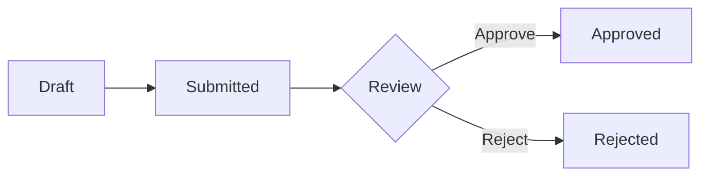

# 📝 Contributing to LCBP3-DMS Specifications

> แนวทางการมีส่วนร่วมในการพัฒนาเอกสาร Specifications ของโครงการ LCBP3-DMS

ยินดีต้อนรับสู่คู่มือการมีส่วนร่วมในการพัฒนาเอกสาร Specifications! เอกสารนี้จะช่วยให้คุณเข้าใจวิธีการสร้าง แก้ไข และปรับปรุงเอกสารข้อกำหนดของโครงการได้อย่างมีประสิทธิภาพ

---

## 📚 Table of Contents

- [ภาพรวม Specification Structure](#-specification-structure)
- [หลักการเขียน Specifications](#-writing-principles)
- [Workflow การแก้ไข Specs](#-contribution-workflow)
- [Template และ Guidelines](#-templates--guidelines)
- [Review Process](#-review-process)
- [Best Practices](#-best-practices)
- [Tools และ Resources](#-tools--resources)

---

## 🗂️ Specification Structure

โครงสร้างเอกสาร Specifications ของโครงการแบ่งออกเป็น 9 หมวดหลัก:

```
specs/
├── 00-Overview/              # ภาพรวมโครงการ
│   ├── README.md
│   ├── 00-01-quick-start.md     # Quick start guide
│   ├── 00-02-glossary.md        # คำศัพท์เทคนิค
│   ├── 00-03-product-vision.md  # Gap 1: Vision, Strategy, Guardrails [★ NEW]
│   ├── 00-04-stakeholder-signoff-and-risk.md  # Gap 5: Sign-off, Risk [★ NEW]
│   ├── 00-05-kpi-baseline.md    # Gap 6: 14 KPIs + Baseline Plan [★ NEW]
│   └── 00-06-training-plan.md   # Gap 9: Training Curriculum [★ NEW]
│
├── 01-Requirements/          # ข้อกำหนดระบบ (21+ docs)
│   ├── README.md
│   ├── 01-01-objectives.md      # วัตถุประสงค์
│   ├── 01-02-business-rules/    # กฏธุรกิจที่ห้ามละเมิด
│   ├── 01-03-modules/           # สเปกของแต่ละฟีเจอร์หลัก
│   ├── 01-04-user-stories.md    # Gap 2: 27 Stories, 8 Epics, MoSCoW [★ NEW]
│   ├── 01-05-acceptance-criteria.md  # Gap 3: UAT Criteria + Sign-off [★ NEW]
│   ├── 01-06-edge-cases-and-rules.md # Gap 10: 37 Edge Cases [★ NEW]
│   └── 01-07-ui-wireframes.md   # Gap 4: 26 Screens, Design System [★ NEW]
│
├── 02-Architecture/          # สถาปัตยกรรมระบบ (4 docs)
│   ├── README.md
│   ├── 02-01-system-context.md
│   ├── 02-02-software-architecture.md
│   ├── 02-03-network-design.md
│   └── 02-04-api-design.md
│
├── 03-Data-and-Storage/      # Database Schema v1.8.0 (3-file split)
│   ├── README.md
│   ├── lcbp3-v1.8.0-schema-01-drop.sql       # DROP statements
│   ├── lcbp3-v1.8.0-schema-02-tables.sql     # CREATE TABLE
│   ├── lcbp3-v1.8.0-schema-03-views-indexes.sql  # Views + Indexes
│   ├── lcbp3-v1.8.0-seed-basic.sql           # Master Data Seed
│   ├── lcbp3-v1.8.0-seed-permissions.sql     # RBAC Permissions Seed
│   ├── 03-01-data-dictionary.md
│   ├── 03-06-migration-business-scope.md     # Gap 7: Migration Scope [★ NEW]
│   └── deltas/                               # Incremental SQL (ADR-009) [★ v1.8.9]
│
├── 04-Infrastructure-OPS/    # Deployment & Operations (9 docs)
│   ├── README.md
│   ├── 04-00-docker-compose/               # 🔒 Live compose stacks [★ v1.8.9 hardened]
│   │   ├── SECURITY-MIGRATION-v1.8.6.md    # 27-finding hardening runbook
│   │   └── README.md                       # Stack overview + secret roadmap
│   ├── 04-01-docker-compose.md
│   ├── 04-03-monitoring.md
│   ├── 04-04-deployment-guide.md
│   ├── 04-07-incident-response.md
│   └── 04-08-release-management-policy.md    # Gap 8: Release Policy [★ NEW]
│
├── 05-Engineering-Guidelines/# แผนการพัฒนา (5 docs)
│   ├── README.md
│   ├── 05-01-fullstack-js-guidelines.md
│   ├── 05-02-backend-guidelines.md
│   ├── 05-03-frontend-guidelines.md
│   └── 05-04-testing-strategy.md
│
├── 06-Decision-Records/      # Architecture Decision Records (22 ADRs)
│   ├── README.md
│   ├── ADR-001-unified-workflow-engine.md
│   ├── ADR-002-document-numbering-strategy.md
│   ├── ADR-003-api-design-strategy.md          # Hybrid REST + Action [★ v1.8.5]
│   ├── ADR-004-database-schema-design-strategy.md  # Selective Normalization [★ v1.8.5]
│   ├── ... (ADR-005 to ADR-006)
│   ├── ADR-007-error-handling-strategy.md      # Layered Error Handling [★ v1.8.5]
│   ├── ... (ADR-008 to ADR-016)
│   ├── ADR-017-ollama-data-migration.md
│   ├── ADR-017B-ai-document-classification.md
│   ├── ADR-018-ai-boundary.md                  # AI Isolation Policy [★ Patch 1.8.1]
│   ├── ADR-019-hybrid-identifier-strategy.md
│   ├── ADR-020-ai-intelligence-integration.md
│   └── ADR-021-workflow-context.md              # Integrated Workflow Context [★ v1.8.7]
│
└── 99-archives/              # ประวัติการทำงานและ Tasks เก่า
    ├── history/
    ├── tasks/
    └── obsolete-specs/
```

### 📋 หมวดหมู่เอกสาร

| หมวด                          | วัตถุประสงค์                           | ไฟล์สำคัญ           | ผู้ดูแล                 |
| ----------------------------- | -------------------------------------- | ------------------- | ----------------------- |
| **00-Overview**               | ภาพรวม, Product Vision, KPI, Training  | Gap 1/5/6/9         | Project Manager / PO    |
| **01-Requirements**           | User Stories, UAT, UI, Edge Cases      | Gap 2/3/4/10        | Business Analyst + PO   |
| **02-Architecture**           | สถาปัตยกรรมและการออกแบบ                | —                   | Tech Lead + Architects  |
| **03-Data-and-Storage**       | Schema v1.8.0, Migration Scope         | Gap 7               | Backend Lead + DBA      |
| **04-Infrastructure-OPS**     | Deployment, Operations, Release Policy | Gap 8               | DevOps Team             |
| **05-Engineering-Guidelines** | แผนการพัฒนาและ Implementation          | —                   | Development Team Leads  |
| **06-Decision-Records**       | Architecture Decision Records (22)     | ADR-018/019/020/021 | Tech Lead + Senior Devs |
| **99-archives**               | Archived / Tasks                       | —                   | All Team Members        |

---

## ✍️ Writing Principles

### 1. ภาษาที่ใช้

- **ชื่อเรื่อง (Headings)**: ภาษาไทยหรืออังกฤษ (ตามบริบท)
- **เนื้อหาหลัก**: ภาษาไทย
- **Code Examples**: ภาษาอังกฤษ
- **Technical Terms**: ภาษาอังกฤษ (พร้อมคำอธิบายภาษาไทย)

### 2. รูปแบบการเขียน

#### ✅ ถูกต้อง

````markdown
## 3.2 การจัดการเอกสารโต้ตอบ (Correspondence Management)

ระบบต้องรองรับการจัดการเอกสารโต้ตอบ (Correspondence) ระหว่างองค์กร โดยมีฟีเจอร์ดังนี้:

- **สร้างเอกสาร**: ผู้ใช้สามารถสร้างเอกสารใหม่ได้
- **แก้ไขเอกสาร**: รองรับการแก้ไข Draft
- **ส่งเอกสาร**: ส่งผ่าน Workflow Engine

### ตัวอย่าง API Endpoint

```typescript
POST /api/correspondences
{
  "subject": "Request for Information",
  "type_id": 1,
  "to_org_id": 2
}
```
````

#### ❌ ผิด

```markdown
## correspondence management

ระบบต้องรองรับ correspondence ระหว่างองค์กร

- สร้างได้
- แก้ไขได้
- ส่งได้
```

### 3. โครงสร้างเอกสาร

ทุกเอกสารควรมีโครงสร้างดังนี้:

```markdown
# [ชื่อเอกสาร]

> คำอธิบายสั้นๆ เกี่ยวกับเอกสาร

## Table of Contents (ถ้าเอกสารยาว)

- [Section 1](#section-1)
- [Section 2](#section-2)

## Overview

[ภาพรวมของหัวข้อ]

## [Main Sections]

[เนื้อหาหลัก]

## Related Documents

- [Link to related spec 1]
- [Link to related spec 2]

---

**Last Updated**: 2026-03-21
**Version**: 1.8.1
**Status**: Draft | Review | Approved
```

---

## 🔄 Contribution Workflow

### ขั้นตอนการแก้ไข Specifications

#### 1. สร้าง Issue (ถ้าจำเป็น)

```bash
# ใน Gitea Issues
Title: [SPEC] Update Correspondence Requirements
Description:
- เพิ่มข้อกำหนดการ CC หลายองค์กร
- อัพเดท Workflow diagram
- เพิ่ม validation rules
Labels: spec, requirements, security
```

#### 2. สร้าง Branch

```bash
# Naming convention
git checkout -b spec/[category]/[description]

# ตัวอย่าง
git checkout -b spec/requirements/update-correspondence
git checkout -b spec/architecture/add-workflow-diagram
git checkout -b spec/adr/file-storage-strategy
```

#### 3. แก้ไขเอกสาร

```bash
# แก้ไขไฟล์ที่เกี่ยวข้อง
vim specs/01-Requirements/01-03-modules/03-correspondence.md

# ตรวจสอบ markdown syntax
pnpm run lint:markdown

# Preview (ถ้ามี)
pnpm run preview:specs
```

#### 4. Commit Changes

```bash
# Commit message format
git commit -m "spec(requirements): update correspondence CC requirements

- Add support for multiple CC organizations
- Update workflow diagram
- Add validation rules for CC list
- Link to ADR-003

Refs: #123"

# Commit types:
# spec(category): สำหรับการแก้ไข specs
# docs(category): สำหรับเอกสารทั่วไป
# adr(number): สำหรับ Architecture Decision Records
```

#### 5. Push และสร้าง Pull Request

```bash
git push origin spec/requirements/update-correspondence
```

**Pull Request Template:**

```markdown
## 📝 Specification Changes

### Category

- [ ] Requirements
- [ ] Architecture
- [ ] Implementation
- [ ] Operations
- [ ] ADR

### Type of Change

- [ ] New specification
- [ ] Update existing spec
- [ ] Fix typo/formatting
- [ ] Add diagram/example

### Description

[อธิบายการเปลี่ยนแปลง]

### Impact Analysis

- **Affected Modules**: [ระบุ modules ที่ได้รับผลกระทบ]
- **Breaking Changes**: Yes/No
- **Migration Required**: Yes/No

### Related Documents

- Related Specs: [links]
- Related Issues: #123
- Related ADRs: ADR-001

### Checklist

- [ ] เขียนเป็นภาษาไทย (เนื้อหาหลัก)
- [ ] ใช้ Technical terms ภาษาอังกฤษ
- [ ] มี Code examples (ถ้าเกี่ยวข้อง)
- [ ] อัพเดท Table of Contents
- [ ] อัพเดท Last Updated date
- [ ] ตรวจสอบ markdown syntax
- [ ] ตรวจสอบ internal links
- [ ] เพิ่ม Related Documents
- [ ] ผ่าน L1 Peer Review
- [ ] ผ่าน L2 Technical Review
- [ ] ได้รับ L3 Approval
```

---

## 📋 Templates & Guidelines

### Template: Functional Requirement

````markdown
## [Feature ID]. [Feature Name]

### วัตถุประสงค์ (Purpose)

[อธิบายว่าฟีเจอร์นี้ทำอะไร และทำไมต้องมี]

### ข้อกำหนดหลัก (Requirements)

#### [REQ-001] [Requirement Title]

**Priority**: High | Medium | Low
**Status**: Proposed | Approved | Implemented

**Description**:
[คำอธิบายข้อกำหนด]

**Acceptance Criteria**:

- [ ] Criterion 1
- [ ] Criterion 2
- [ ] Criterion 3

**Technical Notes**:

```typescript
// ตัวอย่าง code หรือ API
```
````

**Related**:

- Dependencies: [REQ-002], [REQ-003]
- Conflicts: None
- ADRs: [ADR-001]

### User Stories

```gherkin
Given [context]
When [action]
Then [expected result]
```

### UI/UX Requirements

[Screenshots, Wireframes, หรือ Mockups]

### Non-Functional Requirements

- **Performance**: [เช่น Response time < 200ms]
- **Security**: [เช่น RBAC required]
- **Scalability**: [เช่น Support 100 concurrent users]

### Test Scenarios

1. **Happy Path**: [อธิบาย]
2. **Edge Cases**: [อธิบาย]
3. **Error Handling**: [อธิบาย]

````

### Template: Architecture Decision Record (ADR)

```markdown
# ADR-[NUMBER]: [Title]

**Status**: Proposed | Accepted | Deprecated | Superseded
**Date**: YYYY-MM-DD
**Deciders**: [ชื่อผู้ตัดสินใจ]
**Technical Story**: [Issue/Epic link]

## Context and Problem Statement

[อธิบายปัญหาและบริบท]

## Decision Drivers

- [Driver 1]
- [Driver 2]
- [Driver 3]

## Considered Options

### Option 1: [Title]

**Pros**:
- [Pro 1]
- [Pro 2]

**Cons**:
- [Con 1]
- [Con 2]

### Option 2: [Title]

[เหมือนข้างบน]

## Decision Outcome

**Chosen option**: "[Option X]"

**Justification**:
[อธิบายเหตุผล]

**Consequences**:
- **Positive**: [ผลดี]
- **Negative**: [ผลเสีย]
- **Neutral**: [ผลกระทบอื่นๆ]

## Implementation

```typescript
// ตัวอย่าง implementation
````

## Validation

[วิธีการตรวจสอบว่า decision นี้ถูกต้อง]

## Related Decisions

- Supersedes: [ADR-XXX]
- Related to: [ADR-YYY]
- Conflicts with: None

## References

- [Link 1]
- [Link 2]

````

---

## 👀 Review Process

### Reviewer Checklist

#### ✅ Content Quality

- [ ] **Clarity**: เนื้อหาชัดเจน เข้าใจง่าย
- [ ] **Completeness**: ครบถ้วนตามโครงสร้าง
- [ ] **Accuracy**: ข้อมูลถูกต้อง ตรงตามความเป็นจริง
- [ ] **Consistency**: สอดคล้องกับ specs อื่นๆ
- [ ] **Traceability**: มี links ไปยังเอกสารที่เกี่ยวข้อง

#### ✅ Technical Quality

- [ ] **Feasibility**: สามารถ implement ได้จริง
- [ ] **Performance**: คำนึงถึง performance implications
- [ ] **Security**: ระบุ security requirements
- [ ] **Scalability**: รองรับการขยายตัว
- [ ] **Maintainability**: ง่ายต่อการบำรุงรักษา

#### ✅ Format & Style

- [ ] **Markdown Syntax**: ไม่มี syntax errors
- [ ] **Language**: ใช้ภาษาไทยสำหรับเนื้อหาหลัก
- [ ] **Code Examples**: มี syntax highlighting
- [ ] **Diagrams**: ชัดเจน อ่านง่าย
- [ ] **Links**: ทุก link ใช้งานได้

### Review Levels

| Level                    | Reviewer        | Scope                           |
| ------------------------ | --------------- | ------------------------------- |
| **L1: Peer Review**      | Team Member     | Format, Clarity, Completeness   |
| **L2: Technical Review** | Tech Lead       | Technical Accuracy, Feasibility |
| **L3: Approval**         | Project Manager | Business Alignment, Impact      |

### Review Timeline

- **L1 Review**: 1-2 วันทำการ
- **L2 Review**: 2-3 วันทำการ
- **L3 Approval**: 1-2 วันทำการ

---

## 💡 Best Practices

### 1. เขียนให้ชัดเจนและเฉพาะเจาะจง

#### ✅ ถูกต้อง
```markdown
ระบบต้องรองรับการอัปโหลดไฟล์ประเภท PDF, DWG, DOCX, XLSX, ZIP
โดยมีขนาดไม่เกิน 50MB ต่อไฟล์ และต้องผ่านการ scan virus ด้วย ClamAV
````

#### ❌ ผิด

```markdown
ระบบต้องรองรับการอัปโหลดไฟล์หลายประเภท
```

### 2. ใช้ Diagrams และ Examples

````markdown
### Workflow Diagram


```mermaid
graph LR
    A[Draft] --> B[Submitted]
    B --> C{Review}
    C -->|Approve| D[Approved]
    C -->|Reject| E[Rejected]
```
````

````

### 3. อ้างอิงเอกสารที่เกี่ยวข้อง

```markdown
## Related Documents

- Requirements: [03.2-correspondence.md](../01-Requirements/01-03-modules/03-correspondence.md)
- Architecture: [02-02-software-architecture.md](../02-Architecture/02-02-software-architecture.md)
- ADR: [ADR-001-unified-workflow.md](../06-Decision-Records/ADR-001-unified-workflow.md)
- Implementation: [05-02-backend-guidelines.md](../05-Engineering-Guidelines/05-02-backend-guidelines.md)
````

### 4. Version Control

```markdown
---

**Document History**:

| Version | Date       | Author     | Changes                                                           |
| ------- | ---------- | ---------- | ----------------------------------------------------------------- |
| 1.0.0   | 2025-01-15 | John Doe   | Initial version                                                   |
| 1.1.0   | 2025-02-20 | Jane Smith | Add CC support                                                    |
| 1.8.1   | 2026-03-21 | Tech Lead  | Security hardening, numbering fixes, dependency updates           |
| 1.8.5   | 2026-04-10 | Tech Lead  | ADR registry complete (21 ADRs), spec documentation updates       |
| 1.8.7   | 2026-04-14 | Tech Lead  | ADR-021 integration complete (22 ADRs), workflow context features |
| 1.8.8   | 2026-04-14 | Tech Lead  | Step-specific attachments, IntegratedBanner, WorkflowLifecycle    |
| 1.8.9   | 2026-04-18 | Tech Lead  | Docker Compose hardening — 27 findings (C1–S4) addressed          |

**Current Version**: 1.8.9
**Status**: Approved
**Last Updated**: 2026-04-18
**Security**: 0 vulnerabilities (backend) + Compose stack hardened (27 findings → 0)
**Workflow Engine**: ADR-021 Integrated Context complete
```

### 5. UUID Conventions (ADR-019)

โครงการใช้ **Hybrid Identifier Strategy** — INT PK สำหรับ internal, UUIDv7 สำหรับ public API

#### Backend Entity Pattern

```typescript
// ❌ ผิด — ส่ง INT id ออก public API
@Get(':id')
findOne(@Param('id', ParseIntPipe) id: number) { ... }

// ✅ ถูกต้อง — ใช้ UUID สำหรับ public API
@Get(':uuid')
findOne(@Param('uuid', ParseUuidPipe) uuid: string) { ... }
```

#### Backend DTO — FK References

```typescript
// ❌ ผิด — frontend ไม่มี INT id (ถูก @Exclude() แล้ว)
@IsInt()
projectId!: number;

// ✅ ถูกต้อง — รับ UUID จาก frontend, resolve เป็น INT ใน controller
@IsUUID()
projectUuid!: string;

@IsOptional()
@IsInt()
projectId?: number; // resolved internally by controller
```

#### Frontend — Select Components

```typescript
// ❌ ผิด — parseInt บน UUID string จะได้ค่าผิด
onValueChange={(v) => setValue("projectId", parseInt(v))}

// ✅ ถูกต้อง — ส่ง UUID string ตรงๆ
onValueChange={(v) => setValue("projectUuid", v)}
```

#### Serialization Behavior

- `TransformInterceptor` ใช้ `instanceToPlain()` → `@Exclude()` และ `@Expose()` มีผล
- Entity ทั้ง 14 ตาราง มี `@Exclude()` บน INT `id` → API response **ไม่มี** `id` เป็นตัวเลข
- Project & Contract มี `@Expose({ name: 'id' })` บน `uuid` → API response มี `id` = UUID string
- Entity อื่นๆ มี `uuid` field แยก → API response มี `uuid` แต่ไม่มี `id`

> ดูรายละเอียดเพิ่มเติมที่ [05-07-hybrid-uuid-implementation-plan.md](./specs/05-Engineering-Guidelines/05-07-hybrid-uuid-implementation-plan.md)

### 6. ใช้ Consistent Terminology

อ้างอิงจาก [glossary.md](./specs/00-Overview/00-02-glossary.md) เสมอ

```markdown
- ✅ ใช้: "Correspondence" (เอกสารโต้ตอบ)
- ❌ ไม่ใช้: "Letter", "Document", "Communication"

- ✅ ใช้: "RFA" (Request for Approval)
- ❌ ไม่ใช้: "Approval Request", "Submit for Approval"
```

---

## 🛠️ Tools & Resources

### Markdown Tools

```bash
# Lint markdown files
pnpm run lint:markdown

# Fix markdown issues
pnpm run lint:markdown:fix

# Preview specs (if available)
pnpm run preview:specs
```

### Recommended VS Code Extensions

```json
{
  "recommendations": [
    "yzhang.markdown-all-in-one",
    "DavidAnson.vscode-markdownlint",
    "bierner.markdown-mermaid",
    "shd101wyy.markdown-preview-enhanced",
    "streetsidesoftware.code-spell-checker"
  ]
}
```

### Markdown Linting Rules

Create `.markdownlint.json`:

```json
{
  "default": true,
  "MD013": false,
  "MD033": false,
  "MD041": false
}
```

### Diagram Tools

- **Mermaid**: สำหรับ flowcharts, sequence diagrams
- **PlantUML**: สำหรับ UML diagrams
- **Draw.io**: สำหรับ architecture diagrams

### Reference Documents

- [Markdown Guide](https://www.markdownguide.org/)
- [Mermaid Documentation](https://mermaid-js.github.io/)
- [ADR Template](https://github.com/joelparkerhenderson/architecture-decision-record)

---

## 📞 Getting Help

### คำถามเกี่ยวกับ Specs

1. **ตรวจสอบเอกสารที่มีอยู่**: [specs/](./specs/)
2. **ดู Glossary**: [00-02-glossary.md](./specs/00-Overview/00-02-glossary.md)
3. **ค้นหา Issues**: [Gitea Issues](https://git.np-dms.work/lcbp3/lcbp3-dms/issues)
4. **ถาม Team**: [ช่องทางการติดต่อ]

### การรายงานปัญหา

```markdown
**Title**: [SPEC] [Category] [Brief description]

**Description**:

- **Current State**: [อธิบายปัญหาปัจจุบัน]
- **Expected State**: [อธิบายสิ่งที่ควรจะเป็น]
- **Affected Documents**: [ระบุเอกสารที่เกี่ยวข้อง]
- **Proposed Solution**: [เสนอแนะวิธีแก้ไข]

**Labels**: spec, [category]
```

---

## 🤖 AI-Assisted Contributions

โปรเจกต์นี้รองรับ AI agents (Windsurf Cascade, Codex CLI, opencode, Amp, Antigravity) ในการเขียน / review / refactor โค้ด — ผ่านคู่มือกลางคือ [`AGENTS.md`](./AGENTS.md) และชุดทักษะใน [`.agents/skills/`](./.agents/skills/)

### Canonical Rule Sources (อ่านตามลำดับนี้)

1. **[`AGENTS.md`](./AGENTS.md)** — quick-reference rules + change log (supersedes legacy `GEMINI.md`)
2. **[`.agents/skills/_LCBP3-CONTEXT.md`](./.agents/skills/_LCBP3-CONTEXT.md)** — shared context loaded by every speckit-\* skill
3. **[`.agents/skills/README.md`](./.agents/skills/README.md)** — skill-pack layout + Windsurf invocation guide
4. `specs/06-Decision-Records/` (โดยเฉพาะ ADR-019 — UUID **March 2026 pattern**)
5. `specs/05-Engineering-Guidelines/` (backend / frontend / testing / i18n / git conventions)

### Invocation (Windsurf)

ใช้ slash commands ด้านล่าง — `.windsurf/workflows/*.md` ห่อหุ้ม [`.agents/skills/speckit-*`](./.agents/skills/) ไว้ให้:

- `/02-speckit.specify` → spec.md
- `/04-speckit.plan` → plan.md + data-model.md + contracts/
- `/05-speckit.tasks` → tasks.md
- `/07-speckit.implement` → execute tasks (with Ironclad Anti-Regression Protocols)
- `/10-speckit.reviewer` → code review (Tier 1/2/3 classification)
- `/12-speckit.security-audit` → OWASP + CASL + LCBP3-specific

### Health Checks

```bash
# Version + frontmatter consistency
bash  ./.agents/scripts/bash/validate-versions.sh
pwsh  ./.agents/scripts/powershell/validate-versions.ps1

# Full skill audit (20 skills)
bash  ./.agents/scripts/bash/audit-skills.sh
pwsh  ./.agents/scripts/powershell/audit-skills.ps1
```

### 🔴 Tier 1 Non-Negotiables (AI must enforce)

- **ADR-019 UUID** — `publicId` exposed directly; ห้าม `parseInt`/`Number`/`+` บน UUID; ห้าม `id ?? ''` fallback; ห้ามใช้ `@Expose({ name: 'id' })` rename
- **ADR-009 Schema** — แก้ `lcbp3-v1.8.0-schema-02-tables.sql` โดยตรง + เพิ่ม delta ที่ `specs/03-Data-and-Storage/deltas/`; ห้าม TypeORM migrations
- **ADR-016 Security** — CASL + `Idempotency-Key` + ClamAV two-phase upload
- **ADR-018/020 AI Boundary** — Ollama on Admin Desktop only; human-in-the-loop validation

---

## 🎯 Quality Standards

### Definition of Done (DoD) สำหรับ Spec Changes

- [x] เนื้อหาครบถ้วนตามโครงสร้าง
- [x] ใช้ภาษาไทยสำหรับเนื้อหาหลัก
- [x] มี code examples (ถ้าเกี่ยวข้อง)
- [x] มี diagrams (ถ้าจำเป็น)
- [x] อัพเดท Table of Contents
- [x] อัพเดท Last Updated date
- [x] ผ่าน markdown linting
- [x] ตรวจสอบ internal links
- [x] เพิ่ม Related Documents
- [x] ผ่าน L1 Peer Review
- [x] ผ่าน L2 Technical Review
- [x] ได้รับ L3 Approval

---

## 📜 License & Copyright

เอกสาร Specifications ทั้งหมดเป็นทรัพย์สินของโครงการ LCBP3-DMS
**Internal Use Only** - ห้ามเผยแพร่ภายนอก

---

## 🙏 Acknowledgments

ขอบคุณทุกท่านที่มีส่วนร่วมในการพัฒนาเอกสาร Specifications ของโครงการ!

---

<div align="center">

**Questions?** Contact the Tech Lead or Project Manager

[Specs Directory](./specs) • [Main README](./README.md) • [Documentation](./docs)

</div>
