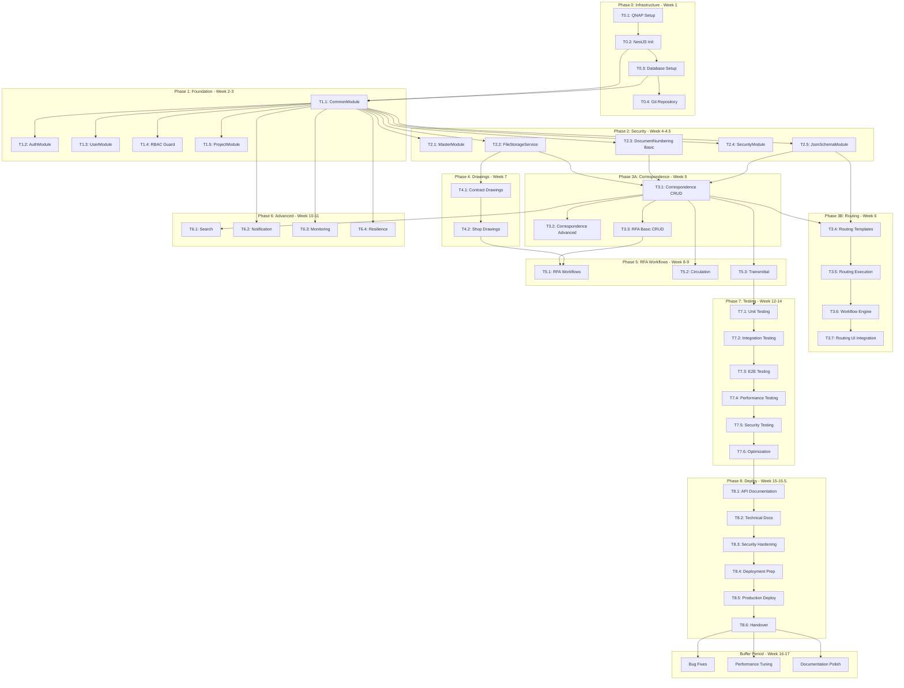

# 📋 **แผนการพัฒนา Backend (NestJS) - LCBP3-DMS v1.4.2 (ปรับปรุงตาม Review)**

* **ปรับปรุงตาม Requirements v1.4.0 และ Review Feedback**
* **Routing, JSON Details, Security และ Testing Strategy ที่ดีขึ้น**
* **Check Lists**
  * [x] LCBP3-DMS_V1_4_1_Backend_Development_Plan.md**
  * [ ] LCBP3-DMS_V1_4_2_Backend_Development_Plan (Patched)
  * [ ] LCBP3-DMS_V1_4_2_FullStackJS (Patched)
  * [ ] LCBP3-DMS_V1_4_2_Requirements (Patched)
  * [ ] LCBP3-DMS — Task Breakdown สำหรับ Phase 2A–2C (v1.4.2).md
  * [ ]

---

## 🎯 **ภาพรวมโครงการ**

พัฒนา Backend สำหรับระบบบริหารจัดการเอกสารโครงการ (Document Management System) ที่รองรับการจัดการเอกสารที่ซับซ้อน มีระบบ Workflow การอนุมัติ และการควบคุมสิทธิ์แบบ RBAC 4 ระดับ พร้อมมาตรการความปลอดภัยที่ทันสมัย

**การปรับปรุงสำคัญใน v1.4.2:**

* แยก CorrespondenceRoutingModule ออกมาชัดเจน
* Simplify DocumentNumbering (เริ่มจาก DB locking ก่อน)
* เพิ่มเวลา Testing จาก 2 เป็น 3 สัปดาห์
* เพิ่ม Buffer time 2 สัปดาห์
* ปรับปรุง JSON Details implementation
* เพิ่ม Security Hardening Checklist

---

## 📐 **สถาปัตยกรรมระบบ**

### **Technology Stack**

* **Framework:** NestJS (TypeScript, ESM)
* **Database:** MariaDB 10.11
* **ORM:** TypeORM
* **Authentication:** JWT + Passport
* **Authorization:** CASL (RBAC 4-level)
* **File Upload:** Multer + Virus Scanning (ClamAV)
* **Search:** Elasticsearch
* **Notification:** Nodemailer + n8n (Line Integration)
* **Caching:** Redis
* **Resilience:** Circuit Breaker, Retry Patterns
* **Security:** Helmet, CSRF Protection, Rate Limiting
* **Monitoring:** Winston, Health Checks, Metrics
* **Scheduling:** @nestjs/schedule (Cron Jobs)
* **Documentation:** Swagger

### **โครงสร้างโมดูล (Domain-Driven)**

```tree
src/
├── common/                    # Shared Module
│   ├── auth/                 # JWT, Guards, RBAC
│   ├── config/               # Configuration Management
│   ├── decorators/           # @RequirePermission, @RateLimit
│   ├── entities/             # Base Entities
│   ├── exceptions/           # Global Filters
│   ├── file-storage/         # FileStorageService (Virus Scanning)
│   ├── guards/               # RBAC Guard, RateLimitGuard
│   ├── interceptors/         # Audit, Transform, Performance
│   ├── resilience/           # Circuit Breaker, Retry Patterns
│   ├── security/             # Input Validation, XSS Protection
│   └── services/             # Notification, Caching, Monitoring
├── modules/
│   ├── user/                 # Users, Roles, Permissions
│   ├── project/              # Projects, Contracts, Organizations
│   ├── master/               # Master Data Management
│   ├── correspondence/       # Correspondence Management
│   ├── correspondence-routing/ # **NEW: Routing Management**
│   ├── rfa/                  # RFA & Workflows
│   ├── drawing/              # Shop/Contract Drawings
│   ├── circulation/          # Internal Circulation
│   ├── transmittal/          # Transmittals
│   ├── search/               # Elasticsearch
│   ├── monitoring/           # Metrics, Health Checks
│   ├── json-schema/          # **NEW: JSON Schema Management**
│   └── document-numbering/   # Internal Service
└── database/                 # Migrations & Seeds
```

---

## 🗓️ **แผนการพัฒนาแบบ Phase-Based (ปรับปรุง)**

### **Timeline Overview**

| Phase      | Duration     | Tasks        | Output                     |
| ---------- | ------------ | ------------ | -------------------------- |
| Phase 0    | 1 สัปดาห์      | 4            | Infrastructure Ready       |
| Phase 1    | 2 สัปดาห์      | 5            | Auth & RBAC                |
| Phase 2    | 1.5 สัปดาห์    | 5            | Security & File Management |
| Phase 3A   | 1 สัปดาห์      | 3            | Correspondence Core        |
| Phase 3B   | 1 สัปดาห์      | 4            | Correspondence Routing     |
| Phase 4    | 1 สัปดาห์      | 2            | Drawing Management         |
| Phase 5    | 2 สัปดาห์      | 3            | RFA Workflows              |
| Phase 6    | 2 สัปดาห์      | 4            | Advanced Features          |
| Phase 7    | 3 สัปดาห์      | 6            | Testing & Optimization     |
| Phase 8    | 1.5 สัปดาห์    | 6            | Documentation & Deploy     |
| **Buffer** | **2 สัปดาห์**  | -            | **Bug Fixes & Polish**     |
| **Total**  | **17 สัปดาห์** | **42 Tasks** | **Production Ready**       |

### **Dependency Diagram (Updated)**



---

## **Phase 0: Infrastructure Setup (สัปดาห์ที่ 1)**

**Milestone:** Infrastructure Ready + Security Baseline

### **Tasks 0**

* **[✅] T0.1 Setup QNAP Container Station**
  * [✅] สร้าง Docker Network: `lcbp3`
  * [✅] Setup docker-compose.yml สำหรับ:
    * MariaDB, PHPMyAdmin, Gitea, NPM
    * Backend, Redis, Elasticsearch
  * [✅]ClamAV
  * [✅] กำหนด Environment Variables ใน docker-compose.yml
  * [✅] Setup network segmentation และ firewall rules
  * **Deliverable:** Services รันได้และเชื่อมต่อกัน
  * **Dependencies:** None

* **[✅] T0.2 Initialize NestJS Project**
  * [ ] สร้างโปรเจกต์ด้วย Nest CLI
  * [ ] ติดตั้ง Dependencies (Core, Auth, Security, Monitoring) :

    ```bash
     # Core
    npm install @nestjs/core @nestjs/common @nestjs/platform-express
    npm install @nestjs/typeorm typeorm mysql2
    npm install @nestjs/config class-validator class-transformer

    # Auth & Security
    npm install @nestjs/jwt @nestjs/passport passport passport-jwt
    npm install casl helmet csurf rate-limiter-flexible bcrypt crypto

    # File & Search
    npm install multer @nestjs/elasticsearch @elastic/elasticsearch
    npm install clamscan @types/multer

    # Resilience & Caching
    npm install @nestjs/cache-manager cache-manager cache-manager-redis-store
    npm install @nestjs/circuit-breaker

     # Monitoring & Scheduling
    npm install @nestjs/schedule @nestjs/monitoring winston

     # Documentation
    npm install @nestjs/swagger

     # Development
    npm install --save-dev @nestjs/testing jest @types/jest supertest
    npm install --save-dev @types/passport-jwt @types/bcrypt @types/crypto
    ```

  * [ ] Setup โครงสร้าง Domain-Driven Architecture
  * [ ] Initialize security headers และ CORS
  * [ ] ตั้งค่า ESLint และ Prettier สำหรับรักษามาตรฐานโค้ด
  * **Deliverable:** Project Structure พร้อม, Swagger ที่ `/api`
  * **Dependencies:** T0.1

* **[✅] T0.3 Setup Database Connection**
  * [ ] Import SQL Schema v1.4.0
  * [ ] Run Seed Data (organizations, users, roles, permissions)
  * [ ] Configure TypeORM
  * [ ] Setup database connection encryption
  * **Deliverable:** Database พร้อม, มี Seed Data
  * **Dependencies:** T0.1, T0.2

* **[✅] T0.4 Setup Git Repository**
  * [ ] สร้าง Repository ใน Gitea
  * [ ] Setup .gitignore, README.md, SECURITY.md
  * [ ] Commit Initial Project
  * **Deliverable:** Code ใน Version Control
  * **Dependencies:** T0.2

### **Testing - Infrastructure Validation**

* [ ] **T0.T1: Database Connectivity Tests**
  * Connection tests, Migration tests, Seed data verification
  * **Exit Criteria:** Database tests 100% passed

* [ ] **T0.T2: Service Connectivity Tests**
  * Docker network, Inter-service communication, SSL
  * **Exit Criteria:** All services communicate securely

---

## **Phase 1: Core Foundation & Security (สัปดาห์ที่ 2-3)**

**Milestone:** Authentication, Authorization, RBAC 4-Level, Base Entities

### **Tasks 1**

* **[ ] T1.1 CommonModule - Base Infrastructure (3 วัน)**
  * [ ] Base Entity (id, timestamps, soft delete)
  * [ ] Global Exception Filter
  * [ ] Response Transform Interceptor
  * [ ] Audit Log Interceptor
  * [ ] RequestContextService
  * [ ] ConfigService
  * [ ] CryptoService
  * [ ] Input validation pipeline
  * **Deliverable:** Common Services พร้อมใช้
  * **Dependencies:** T0.2, T0.3

* **[ ] T1.2 AuthModule - JWT Authentication (2 วัน)**
  * [ ] User Entity
  * [ ] AuthService (login, validateUser, password hashing)
  * [ ] JWT Strategy (Passport)
  * [ ] JwtAuthGuard
  * [ ] Controllers (login, register, refresh, logout, profile)
  * [ ] Rate limiting for auth endpoints
  * **Deliverable:** ล็อกอิน/ล็อกเอาต์ทำงานปลอดภัย
  * **Dependencies:** T1.1

* **[ ] T1.3 UserModule - User Management (2 วัน)**
  * [ ] Entities: User, Role, Permission, UserRole, UserAssignment
  * [ ] UserService CRUD (soft delete)
  * [ ] RoleService CRUD
  * [ ] PermissionService (Read-Only)
  * [ ] UserAssignmentService
  * [ ] Controllers (users, roles, permissions)
  * [ ] Permission checks
  * **Deliverable:** จัดการผู้ใช้และ Role ได้
  * **Dependencies:** T1.1, T1.2

* **[ ] T1.4 RBAC Guard - 4-Level Authorization (2 วัน)**
  * [ ] @RequirePermission() Decorator
  * [ ] RbacGuard (4 ระดับ: Global, Org, Project, Contract)
  * [ ] Permission Hierarchy Logic
  * [ ] CASL Integration
  * [ ] Audit logging for permission checks
  * **Deliverable:** RBAC ทำงานได้ทั้ง 4 ระดับ
  * **Dependencies:** T1.1, T1.3

* **[ ] T1.5 ProjectModule - Base Structures (1 วัน)**
  * [ ] Entities: Organization, Project, Contract, Junctions
  * [ ] Services & Controllers
  * [ ] Data isolation between organizations
  * **Deliverable:** จัดการโครงสร้างโปรเจกต์ได้
  * **Dependencies:** T1.1, T1.2

### **Testing - Core Foundation**

* [ ] **T1.T1: Authentication Test Suite (25+ tests)**
  * AuthService, JWT, Password, Token refresh
  * **Exit Criteria:** Auth system secure and performant

* [ ] **T1.T2: RBAC Test Suite (30+ tests)**
  * 4-level permissions, Hierarchy, Scope isolation
  * **Exit Criteria:** RBAC working for all scenarios

* [ ] **T1.T3: User Management Tests (20+ tests)**
  * CRUD, Role assignment, Soft delete
  * **Exit Criteria:** User management complete

---

## **Phase 2: Security & File Management (สัปดาห์ที่ 4-4.5)**

**Milestone:** Master Data, File Security, Document Numbering, JSON Schema

### **Tasks 2**

* **[ ] T2.1 MasterModule - Master Data (1 วัน)**
  * [ ] Entities: CorrespondenceType, Status, RfaType, Tags
  * [ ] Services & Controllers (CRUD)
  * [ ] Admin-only access
  * **Deliverable:** Admin จัดการ Master Data ได้
  * **Dependencies:** T0.3, T1.1, T1.5

* **[ ] T2.2 FileStorageService - Secure File Management (2 วัน)**
  * [ ] Attachment Entity
  * [ ] FileStorageService (upload, virus scan, validation)
  * [ ] File type white-list (PDF, DWG, DOCX, XLSX, ZIP)
  * [ ] File size check (50MB)
  * [ ] Checksum (SHA-256)
  * [ ] Controller (upload, download with access control)
  * [ ] Access Control via Junction Tables
  * **Deliverable:** อัปโหลด/ดาวน์โหลดปลอดภัย
  * **Dependencies:** T1.1, T1.4

* **[ ] T2.3 DocumentNumberingModule - Basic Implementation (1.5 วัน)**
  * [ ] Entities: DocumentNumberFormat, DocumentNumberCounter
  * [ ] DocumentNumberingService (Database FOR UPDATE locking)
  * [ ] Simple retry mechanism
  * [ ] Format: {ORG_CODE}-{TYPE_CODE}-{YEAR_SHORT}-{SEQ:4}
  * [ ] Audit log every generation
  * **Internal Service เท่านั้น - ไม่มี Controller**
  * **Deliverable:** Basic document numbering works
  * **Dependencies:** T1.1, T0.3
  * **Note:** Redis upgrade จะทำใน Phase 6.4

* **[ ] T2.4 SecurityModule - Enhanced Security (1 วัน)**
  * [ ] Input Validation Service (XSS, SQL Injection, CSRF)
  * [ ] RateLimitGuard (strategy-based limits)
  * [ ] Security Headers Middleware
  * [ ] Content Security Policy
  * **Deliverable:** Security layers ทำงานได้
  * **Dependencies:** T1.1

* **[ ] T2.5 JsonSchemaModule - JSON Management (2 วัน)**

  **T2.5.1: Core Schema Service (1 วัน)**
  * [ ] JsonSchemaService (validate, getSchema, registerSchema)
  * [ ] Predefined schemas (Correspondence types, Routing types, Audit)
  * [ ] Schema versioning และ compatibility
  * **Dependencies:** T1.1, T2.4 (Security)

  **T2.5.2: Details Processing (0.5 วัน)**
  * [ ] DetailsService (process, sanitize, compress)
  * [ ] Data transformation pipelines
  * [ ] Default value population
  * **Dependencies:** T2.5.1

  **T2.5.3: Integration (0.5 วัน)**
  * [ ] Integrate with CorrespondenceModule (placeholder)
  * [ ] Integrate with RoutingModule (placeholder)
  * [ ] Security measures (sanitize, validate size, encrypt)
  * **Deliverable:** JSON schema system พร้อมใช้
  * **Dependencies:** T2.5.1, T2.5.2

### **Testing - Security & File**

* [ ] **T2.T1: File Upload Security (20+ tests)**
  * Validation, Virus scan, Access control, Path traversal
  * **Exit Criteria:** File system secure

* [ ] **T2.T2: JSON Schema Tests (25+ tests)**
  * Validation, Versioning, Transformation, Security
  * **Exit Criteria:** JSON system robust

* [ ] **T2.T3: Document Numbering Tests (10+ tests)**
  * FOR UPDATE locking, Concurrent generation, Retry
  * **Exit Criteria:** No race conditions

---

## **Phase 3A: Correspondence Core (สัปดาห์ที่ 5)**

**Milestone:** Correspondence CRUD, Revisions, Basic Features

### **Tasks 3A**

* **[ ] T3.1 CorrespondenceModule - Basic CRUD (3 วัน)**
  * [ ] Entities: Correspondence, Revision, Recipient, Tag, Reference, Attachment
  * [ ] CorrespondenceService:
    * create (+ Revision, Numbering, Recipients, Tags, Attachments)
    * update (+ new Revision)
    * findAll (paginated), findById
  * [ ] Controllers: POST, GET list, GET detail, PUT, DELETE (soft)
  * [ ] Permission checks
  * **Deliverable:** สร้าง/แก้ไข/ดูเอกสารได้
  * **Dependencies:** T1.1-T1.5, T2.2, T2.3, T2.5

* **[ ] T3.2 CorrespondenceModule - Advanced Features (1 วัน)**
  * [ ] Status Transitions (DRAFT → SUBMITTED → CLOSED/CANCELLED)
  * [ ] References (Link Documents)
  * [ ] Search (Basic)
  * [ ] State transition validation
  * **Deliverable:** Workflow พื้นฐานทำงานได้
  * **Dependencies:** T3.1

* **[ ] T3.3 RfaModule - Basic CRUD (1 วัน)**
  * [ ] Entities: Rfa, RfaRevision, RfaItem
  * [ ] RfaService (create, findAll, findById)
  * [ ] เชื่อม Shop Drawing Revisions (สำหรับ RFA_DWG)
  * [ ] Controllers: POST, GET list, GET detail
  * [ ] Permission checks
  * **Deliverable:** สร้าง RFA และเชื่อม Shop Drawings ได้
  * **Dependencies:** T3.1, T1.5, (T4.2 optional - can mock first)

### **Testing - Correspondence Core**

* [ ] **T3.T1: Correspondence Tests (30+ tests)**
  * CRUD, Revisions, Status, Recipients
  * **Exit Criteria:** Correspondence handles all scenarios

---

## **Phase 3B: Correspondence Routing (สัปดาห์ที่ 6) - NEW STRUCTURE**

**Milestone:** ระบบส่งต่อเอกสารระหว่างองค์กร

### **Module Structure**

```typescript
src/modules/correspondence-routing/
├── templates/
│   ├── entities/
│   │   ├── routing-template.entity.ts
│   │   └── routing-template-step.entity.ts
│   ├── dto/
│   ├── templates.service.ts
│   └── templates.controller.ts
├── instances/
│   ├── entities/
│   │   └── routing-instance.entity.ts
│   ├── dto/
│   ├── routing.service.ts
│   └── routing.controller.ts
├── workflow-engine/
│   ├── state-machine.service.ts
│   ├── deadline.service.ts
│   └── transition-validator.service.ts
└── correspondence-routing.module.ts
```

### **Tasks 3B**

* **[ ] T3.4 Routing Templates Management (1.5 วัน)**
  * [ ] Entities: CorrespondenceRoutingTemplate, TemplateStep
  * [ ] Services:
    * createTemplate, addStep, getTemplates
  * [ ] Controllers:
    * POST /routing/templates (Admin only)
    * GET /routing/templates
    * POST /routing/templates/:id/steps
  * [ ] JSON schema integration for template configuration
  * **Deliverable:** Template CRUD APIs
  * **Dependencies:** T3.1, T2.5 (JSON Details)

* **[ ] T3.5 Routing Execution Engine (1.5 วัน)**
  * [ ] Entity: CorrespondenceRouting
  * [ ] RoutingService:
    * initiateRouting (create instances, calculate due dates)
    * processStep (update status, send notifications)
    * getRoutingStatus
  * [ ] Controllers:
    * POST /correspondences/:id/routing/start
    * POST /routing/:id/process
    * GET /correspondences/:id/routing
  * **Deliverable:** Routing workflow works
  * **Dependencies:** T3.4, T6.2 (NotificationService - can mock first)

* **[ ] T3.6 WorkflowEngineModule - State Management (1 วัน)**
  * [ ] WorkflowEngineService:
    * validateTransition (state machine)
    * getAllowedTransitions
    * autoAdvanceStatus
  * [ ] DeadlineService:
    * checkDeadlines (Cron job)
    * sendReminder
    * escalateOverdue
  * [ ] Status transition rules
  * **Deliverable:** State machine และ deadline management
  * **Dependencies:** T3.5

* **[ ] T3.7 Routing UI Integration (1 วัน)**
  * [ ] API endpoints for frontend:
    * GET /routing/available-templates
    * GET /routing/my-pending
    * POST /routing/bulk-action
  * [ ] Permission checks
  * [ ] Response transformation for UI
  * **Deliverable:** Routing APIs พร้อมสำหรับ Frontend
  * **Dependencies:** T3.6

### **Testing - Routing**

* [ ] **T3.T2: Routing Test Suite (25+ tests)**
  * Templates, Step sequencing, Status transitions
  * **Exit Criteria:** Routing handles complex workflows

---

## **Phase 4: Drawing Management (สัปดาห์ที่ 7)**

**Milestone:** Contract & Shop Drawings พร้อม File Security

### **Tasks 4**

* **[ ] T4.1 DrawingModule - Contract Drawings (2 วัน)**
  * [ ] Entities: ContractDrawing, Volume, Cat, SubCat, Maps, Attachments
  * [ ] ContractDrawingService CRUD
  * [ ] Controllers: GET list, POST, GET detail
  * [ ] Access control
  * **Deliverable:** จัดการ Contract Drawings ได้
  * **Dependencies:** T1.1-T1.5, T2.2

* **[ ] T4.2 DrawingModule - Shop Drawings (3 วัน)**
  * [ ] Entities: ShopDrawing, Revision, Categories, Refs, Attachments
  * [ ] ShopDrawingService CRUD
  * [ ] Controllers: GET list, POST, POST revisions, GET detail
  * [ ] Link to Contract Drawings
  * [ ] Virus scanning for drawing files
  * **Deliverable:** จัดการ Shop Drawings และ Revisions ได้
  * **Dependencies:** T4.1

---

## **Phase 5: RFA Workflows & Internal Routing (สัปดาห์ที่ 8-9)**

**Milestone:** RFA Workflow, Circulation, Transmittal

### **Tasks 5**

* **[ ] T5.1 RfaModule - Workflow Implementation (4 วัน)**
  * [ ] Entities: RfaWorkflowTemplate, TemplateStep, RfaWorkflow
  * [ ] RfaWorkflowService:
    * initiateWorkflow, completeStep, rejectStep
  * [ ] Controllers:
    * POST /rfas/:id/workflow/start
    * POST /rfas/:id/workflow/steps/:stepNumber/complete
    * GET /rfas/:id/workflow
  * [ ] Circuit breaker for notifications
  * **Deliverable:** RFA Workflow ทำงานได้
  * **Dependencies:** T3.3, T4.2, T2.5, T6.2

* **[ ] T5.2 CirculationModule - Internal Routing (3 วัน)**
  * [ ] Entities: Circulation, Template, Assignees, Routing, Attachments
  * [ ] CirculationService:
    * create, assignUser, completeStep, close
  * [ ] Controllers: POST, GET detail, POST complete, POST close
  * [ ] Retry for assignment notifications
  * **Deliverable:** ใบเวียนภายในองค์กรทำงานได้
  * **Dependencies:** T3.1, T2.5, T6.2

* **[ ] T5.3 TransmittalModule - Document Forwarding (3 วัน)**
  * [ ] Entities: Transmittal, TransmittalItem
  * [ ] TransmittalService (create, list, detail)
  * [ ] Controllers: POST, GET list, GET detail
  * [ ] Access control for items
  * **Deliverable:** สร้าง Transmittal ได้
  * **Dependencies:** T3.1

---

## **Phase 6: Advanced Features & Monitoring (สัปดาห์ที่ 10-11)**

**Milestone:** Search, Notification, Monitoring, Resilience, Redis Upgrade

### **Tasks 6**

* **[ ] T6.1 SearchModule - Elasticsearch Integration (3 วัน)**
  * [ ] Setup Elasticsearch
  * [ ] SearchService (index, update, delete, search)
  * [ ] Index: Correspondence, RFA, Drawings, Circulation, Transmittal
  * [ ] Controllers: GET /search
  * [ ] Circuit breaker for Elasticsearch
  * **Deliverable:** ค้นหาขั้นสูงทำงานได้
  * **Dependencies:** T3.1, T3.3, T4.2, T5.2, T5.3

* **[ ] T6.2 NotificationModule - Email & Line (2 วัน)**
  * [ ] NotificationService:
    * sendEmail (Nodemailer)
    * sendLine (n8n Webhook)
    * createSystemNotification
  * [ ] Integrate with Workflow Events
  * [ ] Controllers: GET /notifications, PUT mark as read
  * [ ] Retry with exponential backoff
  * **Deliverable:** ระบบแจ้งเตือนทำงานได้
  * **Dependencies:** T1.1, T6.4

* **[ ] T6.3 MonitoringModule - Observability (2 วัน)**
  * [ ] Health Check Controller: GET /health
  * [ ] Metrics Service:
    * API response times
    * Error rates
    * Cache hit ratios
    * Business metrics
  * [ ] Performance Interceptor (alert if > 200ms)
  * [ ] Logging Service (structured JSON logs)
  * [ ] APM integration (optional)
  * [ ] Error tracking setup
  * [ ] Real-time alerting
  * **Deliverable:** Monitoring system ทำงานได้
  * **Dependencies:** T1.1

* **[ ] T6.4 ResilienceModule - Circuit Breaker & Redis Upgrade (3 วัน)**

  **T6.4.1: Resilience Patterns (1.5 วัน)**
  * [ ] Circuit Breaker Service
  * [ ] @CircuitBreaker() decorator
  * [ ] Retry Service with exponential backoff
  * [ ] @Retry() decorator
  * [ ] Fallback Strategies
  * [ ] Apply to: Email, LINE, Elasticsearch, Virus scanning

  **T6.4.2: Redis Distributed Locking (1.5 วัน)**
  * [ ] Setup Redis container
  * [ ] RedisLockService
  * [ ] Migrate DocumentNumberingService to Redis locking
  * [ ] Advanced retry mechanism
  * [ ] Comprehensive testing
  * **Deliverable:** Resilience + Scalable document numbering
  * **Dependencies:** T1.1, T2.3

---

## **Phase 7: Testing & Optimization (สัปดาห์ที่ 12-14) - EXTENDED**

**Milestone:** Comprehensive Testing, Optimization, Production Ready

### **Week 12: Unit & Integration Testing**

* **[ ] T7.1 Unit Testing (3 วัน)**
  * [ ] **Services สำคัญ (80% coverage minimum):**
    * AuthService (login, validateUser)
    * RbacGuard (4-level permissions)
    * DocumentNumberingService (Redis locking)
    * FileStorageService (virus scan, validation)
    * CorrespondenceService (CRUD, status transitions)
    * RfaWorkflowService (workflow logic)
    * RoutingService (template execution)
    * JsonSchemaService (validation)
  * [ ] Security scenarios (SQL injection, XSS)
  * [ ] Error handling tests
  * [ ] Edge case testing
  * **Target:** 80% Code Coverage
  * **Exit Criteria:** All unit tests pass, coverage target met
  * **Dependencies:** All Phase 1-6 complete

* **[ ] T7.2 Integration Testing (2 วัน)**
  * [ ] **Integration Flows:**
    * Authentication Flow (login → access protected route)
    * Document Creation Flow (create → attach files → virus scan)
    * RFA Workflow Flow (start → step 1 → step 2 → complete)
    * Circulation Flow (create → assign → complete → close)
    * Routing Flow (initiate → process steps → completion)
  * [ ] SQL Views testing (v_user_all_permissions, v_user_tasks)
  * [ ] Database transactions
  * [ ] External service mocking (MSW)
  * [ ] Rate limiting verification
  * [ ] Permission enforcement
  * **Use Test Database**
  * **Exit Criteria:** All integration tests pass
  * **Dependencies:** T7.1

### **Week 13: E2E, Performance & Security Testing**

* **[ ] T7.3 E2E Testing (2 วัน)**
  * [ ] **Complete User Flows:**
    * User Registration & Login
    * Create Correspondence (Full Flow)
    * Create RFA with Shop Drawings
    * Complete RFA Workflow
    * Create and Process Routing
    * Search Documents
    * File Upload & Download
    * Notification triggers
  * [ ] API Contract Testing (Swagger validation)
  * [ ] Cross-module integration
  * **Tools:** Supertest, Jest
  * **Exit Criteria:** All E2E scenarios pass
  * **Dependencies:** T7.2

* **[ ] T7.4 Performance Testing (1 วัน)**
  * [ ] **Load Testing:**
    * 100 concurrent users
    * API response time < 200ms (90th percentile)
    * Search performance < 500ms
    * Document creation throughput
  * [ ] **Stress Testing:**
    * Find breaking points
    * Database connection limits
    * Memory leak detection
  * [ ] **Endurance Testing:**
    * 24-hour continuous operation
    * Resource utilization monitoring
  * **Tools:** autocannon, artillery
  * **Exit Criteria:** Performance targets met
  * **Dependencies:** T7.3

* **[ ] T7.5 Security Testing (2 วัน)**
  * [ ] **Penetration Testing:**
    * OWASP Top 10 vulnerabilities
    * SQL Injection attempts
    * XSS attempts
    * CSRF attempts
    * Authentication bypass attempts
    * Authorization bypass attempts
  * [ ] **Security Audit:**
    * Code review for security flaws
    * Dependency vulnerability scanning (npm audit)
    * Secret scanning (no hardcoded secrets)
  * [ ] **File Upload Security:**
    * Virus scanning effectiveness
    * File type bypass attempts
    * Path traversal attacks
    * File size limit enforcement
  * [ ] **Rate Limiting Testing:**
    * Verify all strategies work
    * Test bypass attempts
  * **Exit Criteria:** Security Hardening Checklist 100% complete
  * **Dependencies:** T7.4

### **Week 14: Optimization & Bug Fixes**

* **[ ] T7.6 Performance Optimization (5 วัน)**
  * [ ] **Caching Implementation:**
    * Cache Master Data (TTL: 1 hour)
    * Cache User Permissions (TTL: 30 minutes)
    * Cache Search Results (TTL: 15 minutes)
    * Cache File Metadata (TTL: 1 hour)
  * [ ] **Database Optimization:**
    * Review and optimize indexes
    * Optimize N+1 queries
    * Implement pagination everywhere
    * Query performance analysis
  * [ ] **API Optimization:**
    * Response payload optimization
    * Unnecessary data removal
    * Compression for large responses
  * [ ] **Memory Optimization:**
    * Fix memory leaks
    * Optimize large file handling
  * [ ] **Bug Fixes:**
    * Fix all bugs found in testing
    * Regression testing
  * **Target:** Response Time < 200ms (90th percentile)
  * **Exit Criteria:** All optimizations done, no critical bugs
  * **Dependencies:** T7.5

### **Testing Metrics & Exit Criteria**

```typescript
// Phase 7 Must Pass ALL These Metrics

interface Phase7ExitCriteria {
  unitTesting: {
    coverage: '≥ 80%',
    criticalPaths: '100% covered',
    status: 'PASS'
  },
  integrationTesting: {
    coreScenarios: '100% passed',
    externalServices: 'all mocked',
    status: 'PASS'
  },
  e2eTesting: {
    userFlows: '100% completed',
    apiContracts: 'validated',
    status: 'PASS'
  },
  performanceTesting: {
    responseTime: '< 200ms (P90)',
    searchPerformance: '< 500ms',
    concurrentUsers: '100+',
    status: 'PASS'
  },
  securityTesting: {
    owaspTop10: 'all checked',
    vulnerabilities: '0 critical',
    penetrationTests: 'passed',
    status: 'PASS'
  },
  optimization: {
    cacheHitRatio: '> 80%',
    memoryLeaks: '0',
    criticalBugs: '0',
    status: 'PASS'
  }
}
```

---

## **Phase 8: Documentation & Deployment (สัปดาห์ที่ 15-15.5)**

**Milestone:** Production Deployment, Documentation Complete, Handover

### **Tasks 7**

* **[ ] T8.1 API Documentation (1 วัน)**
  * [ ] **Swagger Documentation:**
    * ครบทุก Endpoint
    * Description, Example Request/Response
    * Required Permissions ระบุชัดเจน
    * Error Responses documented
  * [ ] Export Swagger JSON → Frontend Team
  * [ ] Security information (not sensitive)
  * **Deliverable:** Swagger Docs สมบูรณ์
  * **Dependencies:** All development complete

* **[ ] T8.2 Technical Documentation (2 วัน)**
  * [ ] **Architecture Overview:**
    * System architecture diagram
    * Module interaction flow
    * Database schema diagram
  * [ ] **API Design Patterns:**
    * RESTful conventions
    * Error handling patterns
    * Pagination patterns
  * [ ] **Security Implementation Guide:**
    * RBAC 4-level explanation
    * Authentication flow
    * File upload security
  * [ ] **Deployment Guide:**
    * Docker deployment steps
    * Environment configuration
    * Health check procedures
  * [ ] **Disaster Recovery Procedures:**
    * Backup procedures
    * Restoration procedures
    * Failover procedures
  * [ ] **Development Guide:**
    * Code style guide
    * Module creation guide
    * Testing guide
  * **Deliverable:** Technical Docs พร้อม
  * **Dependencies:** T8.1

* **[ ] T8.3 Security Hardening (1 วัน)**
  * [ ] **Final Security Review:**

    **Security Hardening Checklist:**

    ```typescript
    // MUST COMPLETE ALL ITEMS

    □ OWASP Top 10 Verified
      □ SQL Injection prevention tested
      □ XSS prevention verified
      □ CSRF protection working
      □ Insecure deserialization checked
      □ Security misconfiguration reviewed
      □ Sensitive data exposure prevented
      □ Insufficient logging addressed
      □ Broken authentication fixed
      □ Using components with vulnerabilities checked
      □ Insufficient attack protection verified

    □ Dependency Security
      □ npm audit shows 0 vulnerabilities
      □ All packages up to date
      □ No deprecated packages

    □ Secret Management
      □ No hardcoded secrets in code
      □ Environment variables encrypted
      □ Secret scanning passed
      □ .gitignore properly configured

    □ Infrastructure Security
      □ HTTPS enforcement configured
      □ Security headers (Helmet) active
      □ CORS properly configured
      □ Rate limiting working all endpoints

    □ Authentication & Authorization
      □ JWT implementation secure
      □ Password hashing (bcrypt) working
      □ Session management secure
      □ RBAC 4-level working correctly
      □ Permission checks comprehensive

    □ Input Validation
      □ All inputs validated
      □ File upload restrictions enforced
      □ SQL injection tests passed
      □ XSS prevention tested

    □ File Security
      □ Virus scanning working
      □ File type validation active
      □ File size limits enforced
      □ Access control working
      □ Download links expire properly

    □ Audit Logging
      □ All critical actions logged
      □ Audit logs immutable
      □ Log retention configured

    □ Monitoring & Alerting
      □ Security alerts configured
      □ Failed login tracking working
      □ Suspicious activity detection active

    □ Backup & Recovery
      □ Backup procedures tested
      □ Recovery procedures verified
      □ RTO/RPO targets met
    ```

  * [ ] **Security Monitoring:**
    * Failed login attempts tracking
    * Suspicious activity alerts
    * Rate limiting monitoring
  * **Deliverable:** Security checklist 100% passed
  * **Dependencies:** T7.5 (Security Testing)

* **[ ] T8.4 Deployment Preparation (1 วัน)**
  * [ ] **Production Configuration:**
    * Production docker-compose.yml
    * Environment Variables setup in QNAP
    * Nginx Proxy Manager SSL Certificate
  * [ ] **Backup Setup:**
    * Database backup scripts
    * File backup scripts
    * Backup verification procedures
  * [ ] **Monitoring Setup:**
    * Health check endpoints configured
    * Metrics collection active
    * Alerting configured
  * [ ] **Performance Baseline:**
    * Document current performance metrics
    * Set up performance monitoring
  * **Deliverable:** Deployment Guide พร้อม
  * **Dependencies:** T8.2, T8.3

* **[ ] T8.5 Production Deployment (1 วัน)**
  * [ ] **Deployment Steps:**
    * Deploy Backend to backend.np-dms.work
    * Verify all services running
    * Run health checks
    * Test API via Postman
  * [ ] **Verification:**
    * Monitor logs (Winston)
    * Verify HTTPS enforcement
    * Check security headers
    * Test rate limiting
    * Verify virus scanning
    * Test authentication flow
    * Test file upload/download
  * [ ] **Smoke Testing:**
    * Test critical user flows
    * Verify integrations (Elasticsearch, Redis)
    * Check notifications (Email, LINE)
  * **Deliverable:** Backend รันบน Production
  * **Dependencies:** T8.4

* **[ ] T8.6 Handover to Frontend Team (0.5 วัน)**
  * [ ] **Handover Materials:**
    * Demo API ให้ Frontend Team
    * Swagger Documentation
    * Postman Collection พร้อม environment
    * Technical Documentation
  * [ ] **Workshop:**
    * วิธีใช้ Authentication & JWT
    * วิธีใช้ RBAC 4-level
    * การจัดการ File Upload
    * Error Handling patterns
  * [ ] **Support Plan:**
    * Communication channel setup (Slack/Discord)
    * Bug reporting procedure
    * API change notification process
  * **Deliverable:** Frontend เริ่มพัฒนาได้
  * **Dependencies:** T8.5

---

## **Buffer Period (สัปดาห์ที่ 16-17) - NEW**

**Milestone:** Production Stabilization, Final Polish

### **Purpose**

Buffer time สำหรับจัดการกับ:

1. Bug fixes ที่เจอหลัง deployment
2. Performance tuning จากการใช้งานจริง
3. Documentation updates
4. Security patches ที่อาจจำเป็น
5. Team training และ knowledge transfer
6. Final optimization based on real usage

### **Activities**

* **[ ] B1: Bug Fixes & Hotfixes**
  * [ ] Monitor production logs
  * [ ] Fix critical bugs immediately
  * [ ] Fix high-priority bugs
  * [ ] Regression testing after fixes
  * **Exit Criteria:** No critical/high bugs remaining

* **[ ] B2: Performance Tuning**
  * [ ] Analyze production metrics
  * [ ] Optimize slow queries
  * [ ] Adjust cache settings
  * [ ] Fine-tune rate limiting
  * **Exit Criteria:** Performance targets consistently met

* **[ ] B3: Documentation Polish**
  * [ ] Update docs based on feedback
  * [ ] Add FAQ section
  * [ ] Create troubleshooting guide
  * [ ] Update API examples
  * **Exit Criteria:** Documentation complete and accurate

* **[ ] B4: Security Review**
  * [ ] Review production security logs
  * [ ] Address any security concerns
  * [ ] Update security documentation
  * **Exit Criteria:** No security issues

* **[ ] B5: Team Training**
  * [ ] Train support team
  * [ ] Knowledge transfer sessions
  * [ ] Create operational runbooks
  * **Exit Criteria:** Team ready for ongoing maintenance

---

## 📊 **สรุป Timeline และ Milestones**

```typescript
interface ProjectTimeline {
  phase0: {
    week: 1,
    duration: '1 week',
    milestone: 'Infrastructure Ready',
    tasks: 4,
    testing: 2
  },
  phase1: {
    week: '2-3',
    duration: '2 weeks',
    milestone: 'Auth & RBAC Complete',
    tasks: 5,
    testing: 3
  },
  phase2: {
    week: '4-4.5',
    duration: '1.5 weeks',
    milestone: 'Security & File Management',
    tasks: 5,
    testing: 3
  },
  phase3A: {
    week: 5,
    duration: '1 week',
    milestone: 'Correspondence Core',
    tasks: 3,
    testing: 1
  },
  phase3B: {
    week: 6,
    duration: '1 week',
    milestone: 'Correspondence Routing',
    tasks: 4,
    testing: 1
  },
  phase4: {
    week: 7,
    duration: '1 week',
    milestone: 'Drawing Management',
    tasks: 2,
    testing: 0 // Included in Phase 7
  },
  phase5: {
    week: '8-9',
    duration: '2 weeks',
    milestone: 'RFA Workflows Complete',
    tasks: 3,
    testing: 0 // Included in Phase 7
  },
  phase6: {
    week: '10-11',
    duration: '2 weeks',
    milestone: 'Advanced Features',
    tasks: 4,
    testing: 0 // Included in Phase 7
  },
  phase7: {
    week: '12-14',
    duration: '3 weeks', // +1 week
    milestone: 'Production Ready',
    tasks: 6,
    testing: 'Comprehensive'
  },
  phase8: {
    week: '15-15.5',
    duration: '1.5 weeks', // +0.5 week
    milestone: 'Deployed & Handed Over',
    tasks: 6,
    testing: 0
  },
  buffer: {
    week: '16-17',
    duration: '2 weeks', // NEW
    milestone: 'Stabilized & Polished',
    tasks: 5,
    testing: 'Ongoing'
  },
  
  total: {
    weeks: 17,
    days: 119,
    months: '~4 months',
    tasks: 42,
    testingPhases: 10
  }
}
```

---

## 🎯 **Critical Success Factors (Updated)**

### **1. Security First**

* ✅ Security Hardening Checklist 100% complete
* ✅ OWASP Top 10 fully addressed
* ✅ Penetration testing passed
* ✅ Virus scanning working
* ✅ RBAC 4-level thoroughly tested

### **2. Quality Assurance**

* ✅ 80% code coverage minimum
* ✅ All E2E tests passed
* ✅ Performance targets met
* ✅ Zero critical bugs
* ✅ Security testing comprehensive

### **3. Performance**

* ✅ API response < 200ms (P90)
* ✅ Search < 500ms
* ✅ File upload < 30s (50MB)
* ✅ Cache hit ratio > 80%
* ✅ 100+ concurrent users supported

### **4. Operational Excellence**

* ✅ Comprehensive documentation
* ✅ Monitoring & alerting active
* ✅ Backup/recovery tested
* ✅ Team training complete
* ✅ Runbooks created

### **5. Scalability**

* ✅ Redis distributed locking
* ✅ Horizontal scaling ready
* ✅ Database optimized
* ✅ Caching strategy implemented

---

## 🚨 **Risk Management**

### **Technical Risks**

| Risk                                     | Probability | Impact   | Mitigation Strategy                                  | Owner         |
| ---------------------------------------- | ----------- | -------- | ---------------------------------------------------- | ------------- |
| Redis complexity delays numbering        | Medium      | High     | Start with DB locking (Phase 2), upgrade in Phase 6  | Backend Lead  |
| JSON schema bugs affect multiple modules | Medium      | High     | Thorough testing in Phase 2.5, isolated testing      | Backend Dev   |
| Routing workflow complex logic bugs      | High        | High     | Extensive E2E testing, staged rollout                | Backend Lead  |
| Performance issues under load            | Medium      | Medium   | Early performance testing, continuous monitoring     | DevOps        |
| Security vulnerabilities discovered late | Low         | Critical | Security testing in every phase, final audit Phase 8 | Security Team |
| Integration issues with Frontend         | Medium      | Medium   | Early API documentation, regular sync meetings       | Both Teams    |

### **Schedule Risks**

| Risk                              | Probability | Impact | Mitigation Strategy                             |
| --------------------------------- | ----------- | ------ | ----------------------------------------------- |
| Testing takes longer than 3 weeks | Medium      | High   | 2-week buffer period, prioritize critical tests |
| JSON Details integration delays   | Medium      | Medium | Parallel development, mock initially            |
| Deployment issues                 | Low         | High   | Thorough deployment prep, staging environment   |
| Bug fixes exceed buffer time      | Low         | Medium | Prioritization, additional resources if needed  |

### **Mitigation Actions**

```typescript
// Proactive Risk Mitigation

1. Weekly Progress Reviews
   - Track against timeline
   - Identify blockers early
   - Adjust resources as needed

2. Daily Standups
   - Share challenges
   - Coordinate dependencies
   - Quick decision making

3. Continuous Testing
   - Don't wait until Phase 7
   - Unit tests with each task
   - Integration tests after each phase

4. Documentation As You Go
   - Don't defer to Phase 8
   - Document while coding
   - Update Swagger continuously

5. Security Reviews
   - Code review every PR
   - Security checklist per phase
   - External audit in Phase 8

6. Performance Monitoring
   - Set up early (Phase 1)
   - Monitor continuously
   - Address issues immediately
```

---

## 📋 **Quality Gates**

### **Phase Completion Criteria**

แต่ละ Phase ต้องผ่าน Quality Gates เหล่านี้:

```typescript
interface QualityGates {
  codeQuality: {
    linting: 'No errors',
    typeScript: 'Strict mode, no any',
    formatting: 'Prettier configured',
    complexity: 'Functions < 20 lines'
  },
  testing: {
    unitTests: 'Written for new code',
    coverage: 'Phase contribution maintained',
    integration: 'Critical paths tested',
    passing: '100% pass rate'
  },
  security: {
    noHardcodedSecrets: true,
    inputValidation: 'All inputs validated',
    authorizationChecks: 'All protected',
    auditLogging: 'Critical actions logged'
  },
  documentation: {
    swagger: 'All endpoints documented',
    code: 'Complex logic commented',
    readme: 'Updated if needed'
  },
  performance: {
    noMemoryLeaks: true,
    queryOptimization: 'Reviewed',
    noPlusOneQueries: 'Checked'
  }
}

// Each Phase Must Pass Before Moving Forward
```

---

## 🔄 **Continuous Integration/Deployment**

### **CI/CD Pipeline**

```yaml
# .github/workflows/backend-ci.yml

name: Backend CI/CD

on: [push, pull_request]

jobs:
  test:
    runs-on: ubuntu-latest
    steps:
      - Checkout code
      - Setup Node.js 20
      - Install dependencies
      - Run linting
      - Run type checking
      - Run unit tests
      - Run integration tests
      - Upload coverage report

  security-scan:
    runs-on: ubuntu-latest
    steps:
      - Run npm audit
      - Run secret scanning
      - Run SAST analysis

  build:
    needs: [test, security-scan]
    runs-on: ubuntu-latest
    steps:
      - Build Docker image
      - Push to registry

  deploy-staging:
    needs: build
    if: github.ref == 'refs/heads/develop'
    runs-on: ubuntu-latest
    steps:
      - Deploy to staging
      - Run smoke tests

  deploy-production:
    needs: build
    if: github.ref == 'refs/heads/main'
    runs-on: ubuntu-latest
    steps:
      - Deploy to production
      - Run health checks
      - Notify team
```

---

## 📞 **Communication Plan**

### **Daily Standup** (15 min)

* What did yesterday
* What doing today
* Any blockers

### **Weekly Sprint Review** (1 hour)

* Demo completed tasks
* Review metrics
* Plan next week

### **Bi-weekly Frontend Sync** (30 min)

* API updates
* Breaking changes
* Integration issues

### **Monthly Stakeholder Update**

* Progress report
* Risks and mitigation
* Timeline updates

---

## ✅ **Final Checklist สำหรับ Production**

```typescript
// MUST COMPLETE BEFORE PRODUCTION DEPLOYMENT

□ All 42 Tasks Completed
□ All Testing Phases Passed (Phase 7)
□ Security Hardening Checklist 100%
□ Performance Targets Met
□ Documentation Complete
  □ API Documentation (Swagger)
  □ Technical Documentation
  □ Deployment Guide
  □ Operational Runbooks
□ Backup & Recovery Tested
□ Monitoring & Alerting Active
□ SSL Certificates Valid
□ Environment Variables Secured
□ Health Checks Working
□ Frontend Team Trained
□ Support Team Ready
□ Disaster Recovery Plan Documented
□ Stakeholder Sign-off Obtained

// After Production Deployment
□ Smoke Tests Passed
□ Performance Monitoring Active
□ Security Monitoring Active
□ Backup Jobs Running
□ Alert Notifications Working
□ Team On-call Schedule Set
□ Post-deployment Review Scheduled
```

---

## 🎓 **Lessons Learned & Best Practices**

### **What Worked Well**

1. ✅ Security-first approach
2. ✅ Domain-driven architecture
3. ✅ Comprehensive testing strategy
4. ✅ Clear dependencies and milestones
5. ✅ Buffer time for unknowns

### **Improvements for Next Project**

1. 📝 Start documentation earlier
2. 📝 More frequent integration testing
3. 📝 Earlier performance testing
4. 📝 More stakeholder communication
5. 📝 Better estimation of complex features

### **Best Practices to Continue**

1. ✅ Code review every PR
2. ✅ Security review every phase
3. ✅ Daily standups
4. ✅ Weekly sprint reviews
5. ✅ Continuous monitoring

---

## 📚 **References & Resources**

### **Technical Documentation**

* [NestJS Documentation](https://docs.nestjs.com/)
* [TypeORM Documentation](https://typeorm.io/)
* [OWASP Top 10](https://owasp.org/www-project-top-ten/)
* [JWT Best Practices](https://tools.ietf.org/html/rfc8725)

### **Security Resources**

* [OWASP API Security Top 10](https://owasp.org/www-project-api-security/)
* [CWE Top 25](https://cwe.mitre.org/top25/)
* [NIST Cybersecurity Framework](https://www.nist.gov/cyberframework)

### **Testing Resources**

* [Jest Documentation](https://jestjs.io/)
* [Testing Best Practices](https://github.com/goldbergyoni/javascript-testing-best-practices)

---

## 📋 **Document Control**

* **Document:** Backend Development Plan v1.4.2
* **Version:** 1.4.2
* **Date:** 2025-01-XX
* **Author:** System Architecture Team
* **Reviewed By:** [Reviewer Name]
* **Approved By:** [Approver Name]
* **Status:** FINAL - Ready for Execution
* **Classification:** Internal Technical Documentation
* **Next Review:** After Buffer Period (Week 17)

---

## 🚀 **Next Steps**

1. ✅ **Approve this plan** → Get stakeholder sign-off
2. ✅ **Setup Phase 0** → Begin Week 1
3. ✅ **Daily Standups** → Start from Day 1
4. ✅ **Weekly Reviews** → Every Friday
5. ✅ **Monthly Updates** → To stakeholders
6. ✅ **Continuous Monitoring** → Throughout project

---

**หมายเหตุ:** แผนนี้เป็น living document และจะถูกปรับปรุงตามความคืบหน้าจริงและ feedback ที่ได้รับ การเปลี่ยนแปลงสำคัญจะต้องได้รับการอนุมัติจาก Project Lead และ Stakeholders

---

_End of Backend Development Plan v1.4.2
