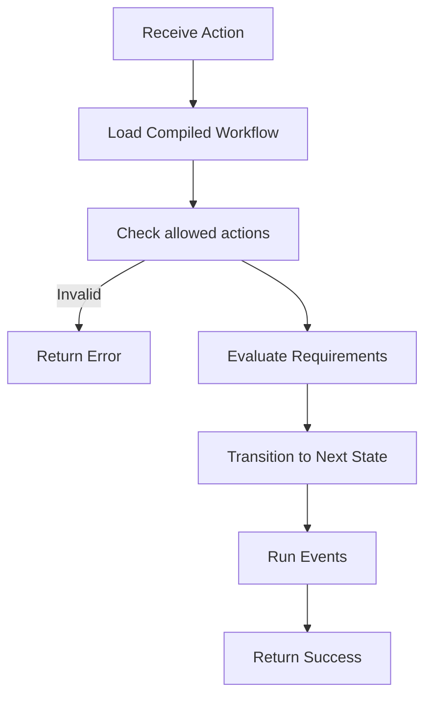

# “Phase 6A + Technical Design Document : Workflow DSL (Mini-Language)”**
ออกแบบสำหรับระบบ Workflow Engine กลางของโครงการ
**ไม่มีโค้ดผูกกับ Framework** เพื่อให้สามารถนำไป Implement ใน NestJS หรือ Microservice ใด ๆ ได้

---

## 📌 **Phase 6A – Workflow DSL Implementation Plan**

### 🎯 เป้าหมายของ Phase 6A

ใน Phase นี้ จะเริ่มสร้าง “Workflow DSL (Domain-Specific Language)” สำหรับนิยามกฎการเดินงาน (Workflow Transition Rules) ให้สามารถ:

* แยก **Business Workflow Logic** ออกจาก Source Code
* แก้ไขกฎ Workflow ได้โดย **ไม่ต้องแก้โค้ดและไม่ต้อง Deploy ใหม่**
* รองรับ Document หลายประเภท เช่น

  * Correspondence
  * RFA
  * Internal Circulation
  * Document Transmittal
* รองรับ Multi-step routing, skip, reject, rollback, parallel assignments
* สามารถนำไปใช้งานทั้งใน

  * Backend (NestJS)
  * Frontend (UI Driven)
  * External Microservices

---

### 📅 ระยะเวลา

**1 สัปดาห์ (หลัง Phase 6.5)**

---

### 🧩 Output ของ Phase 6A

* DSL Specification (Grammar)
* JSON Schema for Workflow Definition
* Workflow Rule Interpreter (Parser + Executor)
* Validation Engine (Compile-time and Runtime)
* Storage (DB Table / Registry)
* Execution API:

| Action                           | Description                     |
| -------------------------------- | ------------------------------- |
| compile()                        | ตรวจ DSL → สร้าง Execution Tree |
| evaluate(state, action, context) | ประมวลผลและส่งสถานะใหม่         |
| preview(state)                   | คำนวณ Next Possible Transitions |
| validate()                       | ตรวจว่า DSL ถูกต้อง             |

---

## 📘 **Technical Specification – Workflow DSL**

---

### 1️⃣ Requirements

#### Functional Requirements

* นิยาม Workflow เป็นภาษาคล้าย State Machine
* แต่ละเอกสารมี **State, Actions, Entry/Exit Events**
* สามารถมี:

  * Required approvals
  * Conditional transition
  * Auto-transition
  * Parallel approval
  * Return/rollback

####
* Running time: < 20ms ต่อคำสั่ง
* Hot reload ไม่ต้อง Compile ใหม่ทั้ง Backend
* DSL ต้อง Debug ได้ง่าย
* ต้อง Versioned
* ต้องรองรับ Audit 100%

---

### 2️⃣ DSL Format (Human Friendly)

```yaml
workflow: RFA
version: 1.0

states:
  - name: DRAFT
    initial: true
    on:
      SUBMIT:
        to: IN_REVIEW
        require:
          - role: ENGINEER
        events:
          - notify: reviewer

  - name: IN_REVIEW
    on:
      APPROVE:
        to: APPROVED
      REJECT:
        to: DRAFT
        events:
          - notify: creator

  - name: APPROVED
    terminal: true
```

---

### 3️⃣ Compiled Execution Model (Normalized JSON)

```json
{
  "workflow": "RFA",
  "version": "1.0",
  "states": {
    "DRAFT": {
      "initial": true,
      "transitions": {
        "SUBMIT": {
          "to": "IN_REVIEW",
          "requirements": [
            { "role": "ENGINEER" }
          ],
          "events": [
            { "type": "notify", "target": "reviewer" }
          ]
        }
      }
    },
    "IN_REVIEW": {
      "transitions": {
        "APPROVE": { "to": "APPROVED" },
        "REJECT": {
          "to": "DRAFT",
          "events": [
            { "type": "notify", "target": "creator" }
          ]
        }
      }
    },
    "APPROVED": {
      "terminal": true
    }
  }
}
```

Frontend และ Backend สามารถแชร์ JSON นี้ร่วมกันได้

---

### 4️⃣ DSL Grammar Definition (EBNF)

```ebnf
workflow     = "workflow" ":" identifier ;
version      = "version" ":" number ;

states       = "states:" state_list ;
state_list   = { state } ;

state        = "- name:" identifier 
               [ "initial:" boolean ] 
               [ "terminal:" boolean ]
               [ "on:" transition_list ] ;

transition_list = { transition } ;

transition   = action ":" 
                indent "to:" identifier
                [ indent "require:" requirements ]
                [ indent "events:" event_list ] ;

requirements = "- role:" identifier | "- user:" identifier ;

event_list   = { event } ;
event        = "- notify:" identifier ;
```

---

### 5️⃣ Validation Rules (Compile-Time)

#### 5.1 State Rules

* ต้องมีอย่างน้อย 1 state ที่ `initial: true`
* หาก `terminal: true` → ต้องไม่มี transition ต่อไป

#### 5.2 Transition Rules

ตรวจสอบว่า:

* `to` ชี้ไปยัง state ที่มีอยู่
* `require.role` ต้องเป็น role ที่ระบบรู้จัก
* Action name ต้องเป็น **UPPER_CASE**

#### 5.3 Version Safety

* ทุกชุด Workflow DSL ต้องขึ้นกับ version
* แก้ไขต้องสร้าง version ใหม่
* ไม่ overwrite version เก่า
* “Document ที่กำลังอยู่ใน step เดิมยังต้องใช้กฎเดิมได้”

---

### 6️⃣ Runtime Validation Rules

เมื่อ execute(action):

```
input: current_state, action, context

1) ตรวจว่า state มี transition "action"
2) ตรวจว่าผู้ใช้มีสิทธิ์ตาม require[]
3) Compute next state
4) Execute events[]
5) Return next_state
```

---

### 7️⃣ Context Model

```ts
interface WorkflowContext {
  userId: string;
  roles: string[];
  documentId: string;
  now: Date;
  payload?: any;
}
```

---

### 8️⃣ Execution API (Abstract)

```ts
class WorkflowEngine {
  
  load(dsl: string | object): CompiledWorkflow

  compile(dsl: string | object): CompiledWorkflow

  evaluate(state: string, action: string, context: WorkflowContext): EvalResult

  getAvailableActions(state: string, context: WorkflowContext): string[]
}
```

---

### 9️⃣ Interpreter Execution Flow



---

### 🔟 Events System

รองรับ event หลายประเภท:

| event.type  | ตัวอย่าง                  |
| ----------- | ------------------------- |
| notify      | ส่ง Email/Line            |
| assign      | เปลี่ยนผู้รับผิดชอบ       |
| webhook     | ยิง Webhook ไปยังระบบอื่น |
| auto_action | ทำ action ซ้ำโดยอัตโนมัติ |

---

### 11️⃣ Database Schema

#### Table: `workflow_definition`

| Field         | Type        | Description           |
| ------------- | ----------- | --------------------- |
| id            | UUID        | PK                    |
| workflow_code | varchar(50) | เช่น `RFA`, `CORR`    |
| version       | int         | Version number        |
| dsl           | JSON        | YAML/JSON DSL เก็บดิบ |
| compiled      | JSON        | JSON ที่ Compile แล้ว |
| created_at    | timestamp   |                       |
| is_active     | boolean     | ใช้อยู่หรือไม่        |

#### Table: `workflow_history`

เก็บ audit แบบ immutable append-only

| Field       | Description     |
| ----------- | --------------- |
| workflow    | Document Type   |
| document_id | เอกสารไหน       |
| from_state  | เดิม            |
| to_state    | ใหม่            |
| action      | คำสั่ง          |
| user        | ใครเป็นคนทำ     |
| timestamp   | เวลา            |
| metadata    | เหตุการณ์อื่น ๆ |

---

### 12️⃣ Error Codes

| Code                    | Meaning                |
| ----------------------- | ---------------------- |
| WF_NO_TRANSITION        | Action นี้ไม่ถูกต้อง   |
| WF_RESTRICTED           | User ไม่มีสิทธิ์       |
| WF_MISSING_REQUIREMENTS | ไม่ผ่านเงื่อนไข        |
| WF_STATE_NOT_FOUND      | ไม่มี state ที่อ้างอิง |
| WF_SYNTAX_ERROR         | DSL ผิดรูปแบบ          |

---

### 13️⃣ Testing Strategy

#### Unit Tests

* Parse DSL → JSON
* Invalid syntax → throw error
* Invalid transitions → throw error

#### Integration Tests

* Evaluate() ผ่าน 20+ cases
* RFA ย้อนกลับ
* Approve chain
* Parallel review

#### Load Tests

* 1,000 documents running workflow
* Evaluate < 20ms ต่อ action

---

### 14️⃣ Deployment Strategy

#### Hot Reload Options

* DSL stored in DB
* Cache in Redis
* Touched timestamp triggers:

```
invalidate cache → recompile
```

#### No downtime required

---

### 15️⃣ Microservice-Ready

DSL Engine แยกเป็น:

* `workflow-engine-core` → Pure JS library
* `workflow-service` → NestJS module
* API public:

```
POST /workflow/evaluate
GET /workflow/preview
POST /workflow/compile
```

ภายหลังสามารถนำไปวางบน:

* Kubernetes
* Worker Node
* API Gateway

---

## 🎉 Summary

### สิ่งที่ Phase 6A เพิ่มเข้าในระบบ

✔ Workflow DSL ที่แก้ไขได้โดยไม่ต้อง Deploy
✔ Parser + Validator + Runtime Interpreter
✔ Database storage + Versioning
✔ Execution API สำหรับ Backend และ Frontend
✔ รองรับ Business Workflow ซับซ้อนทั้งหมด
✔ Ready สำหรับ Microservice model ในอนาคต

