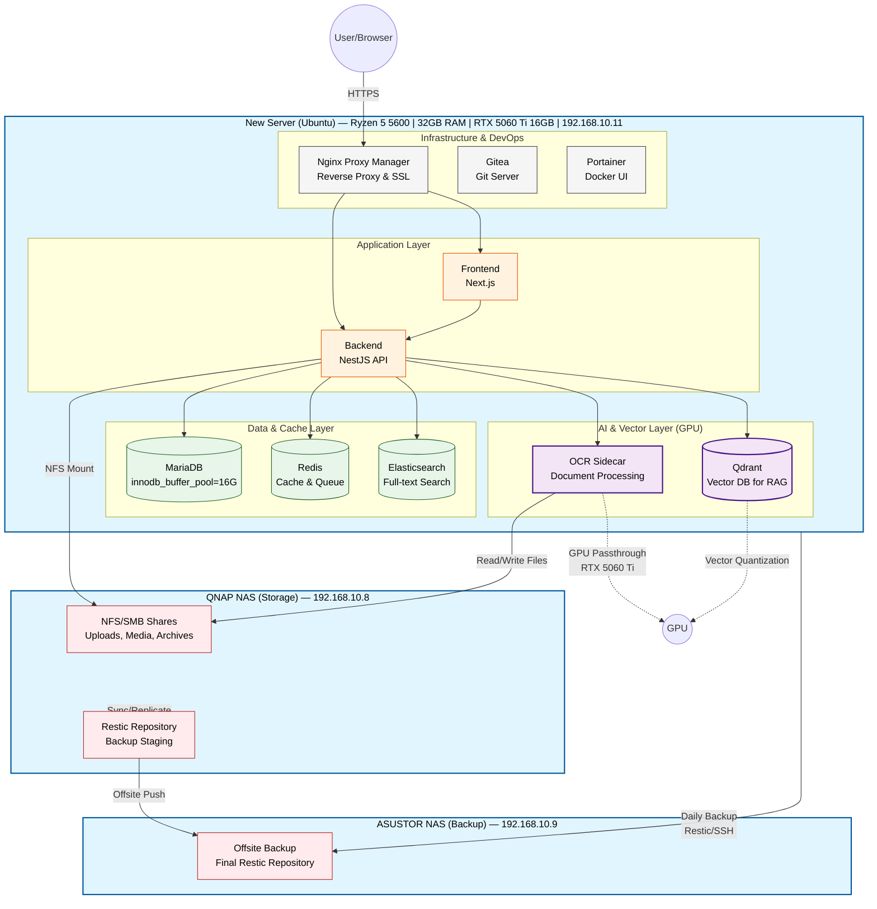

# np-dms-lcbp3 Server Plan

เอกสารสรุปการตั้งค่าเซิร์ฟเวอร์ np-dms-lcbp3 และแผนการย้ายระบบจาก NAS-Centric (QNAP + ASUSTOR) สู่ High-Performance Compute & AI Server

---

## 1. สเปกเซิร์ฟเวอร์

| ส่วนประกอบ | รายละเอียด |
|---|---|
| **CPU** | AMD Ryzen 5 5600 |
| **RAM** | 32GB |
| **GPU** | NVIDIA GeForce RTX 5060 Ti 16GB (GB206) |
| **SSD** | 1TB NVMe (MSI Spatium M450) |
| **IP** | 192.168.10.11 |
| **Mainboard** | MSI B550M PRO-VDH WIFI |

---

## 2. ระบบปฏิบัติการและไดรเวอร์

| รายการ | เวอร์ชัน |
|---|---|
| **OS** | Ubuntu Server 26.04 LTS (Resolute Raccoon) |
| **Kernel** | 7.0.0-22-generic x86_64 |
| **NVIDIA Driver** | 595.71.05 (`nvidia-headless-595-open` + `nvidia-utils-595`) |
| **CUDA** | 13.2 |

> **หมายเหตุ:** RTX 5060 Ti (Blackwell) ต้องใช้ open kernel module เท่านั้น

---

## 3. Storage Layout (LVM)

```
/dev/nvme0n1 (931.5G)
├─ /boot/efi              1G
├─ /boot                  2G
└─ ubuntu-vg (LVM)      928.5G
   ├─ ubuntu-lv   100G   /                  (OS)
   ├─ docker-lv   100G   /var/lib/docker    (Docker)
   ├─ np-dms-lv   300G   /opt/np-dms        (App Data & DB)
   ├─ ollama-lv   100G   /opt/ollama        (Ollama models)
   └─ unallocated ~328G  (สำรองไว้ขยาย)
```

### กลยุทธ์การจัดการ Storage

| ประเภทข้อมูล | ที่เก็บ | เหตุผล |
|---|---|---|
| **Hot Data** (OS, Docker, DB, Redis, ES, Qdrant, Logs) | SSD 1TB (Local) | ต้องการ IOPS สูง |
| **Cold/Bulk Data** (Uploads ถาวร, Media, Backup) | QNAP NAS (NFS/SMB Mount) | ประหยัดพื้นที่ SSD |

---

## 4. Services ที่ติดตั้ง

| Service | Version | Status |
|---|---|---|
| Docker Engine | 29.6.0 | ✅ running |
| nvidia-container-toolkit | latest | ✅ configured |
| Ollama | 0.30.10 | ✅ running (CUDA) |
| Portainer CE | latest | ✅ running |
| Cloudflare Tunnel | 2026.6.1 | ✅ running |

### Ollama Config

```
OLLAMA_MODELS:      /opt/ollama/models
OLLAMA_HOST:        0.0.0.0:11434
OLLAMA_KEEP_ALIVE:  10m
OLLAMA_NUM_PARALLEL: 2
```

---

## 5. Remote Access

| ช่องทาง | คำสั่ง/URL |
|---|---|
| LAN | `ssh nattanin@192.168.10.11` |
| Internet | `ssh nattanin@ssh.np-dms.work` (Cloudflare Tunnel) |
| Portainer | `https://192.168.10.11:9443` |

---

## 6. DeepCool AK500 Digital Pro — หน้าจอฮาร์ดแวร์

### การติดตั้ง

1. **เซนเซอร์เมนบอร์ด:** ติดตั้ง `lm-sensors` และโหลดเคอร์เนลโมดูล `nct6683` (Nuvoton NCT6687-R) เพื่ออ่านอุณหภูมิ CPU และความเร็วพัดลม ตั้งค่าให้โหลดอัตโนมัติทุกครั้งที่บูต
2. **คอมไพล์ `deepcool-digital-linux`:**
   - ติดตั้ง dependencies: `pkg-config`, `libudev-dev` (แก้ปัญหา crate `hidapi`)
   - `cargo clean` → `cargo build --release`
   - ย้าย binary ไป `/usr/sbin/deepcool-digital-linux`
3. **Systemd Service:** สร้าง `/etc/systemd/system/deepcool-digital.service` → `daemon-reload` → `enable --now`

### สถานะปัจจุบัน

- **Status:** `active (running)`
- **Device:** `AK500-DIGITAL-PRO` (USB)
- **Display Mode:** `auto` (สลับแสดงผลอัตโนมัติ)
- **Telemetry Unit:** °C (อ้างอิงเซนเซอร์จริงบนบอร์ด)
- **Update Interval:** 1 วินาที

---

## 7. แผนการย้ายระบบ (Master Migration Plan)

การย้ายครั้งนี้เป็นการ **เปลี่ยนสถาปัตยกรรม (Architecture Shift)** จาก NAS-Centric สู่ Compute & AI Server เนื่องจาก New Server มี RTX 5060 Ti 16GB สำหรับ AI/OCR และ RAM 32GB สำหรับจูน Database

### Phase 1: OS & GPU Foundation

1. ติดตั้ง Ubuntu Server และตั้งค่า Static IP ใน VLAN 10 (192.168.10.11) เพื่อให้อยู่ใน Network เดียวกับ QNAP/ASUSTOR
2. ติดตั้ง NVIDIA Driver & Container Toolkit เพื่อ Passthrough GPU ให้ Docker:

```bash
curl -fsSL https://nvidia.github.io/libnvidia-container/gpgkey | sudo gpg --dearmor -o /usr/share/keyrings/nvidia-container-toolkit-keyring.gpg
curl -s -L https://nvidia.github.io/libnvidia-container/stable/deb/nvidia-container-toolkit.list | \
  sed 's#deb https://#deb [signed-by=/usr/share/keyrings/nvidia-container-toolkit-keyring.gpg] https://#g' | \
  sudo tee /etc/apt/sources.list.d/nvidia-container-toolkit.list
sudo apt-get update && sudo apt-get install -y nvidia-container-toolkit
sudo nvidia-ctk runtime configure --runtime=docker
sudo systemctl restart docker
```

### Phase 2: Infrastructure Adaptation

ปรับแก้ Config เดิมที่ใช้ Path เฉพาะของ QNAP:

- **เปลี่ยน Base Path:** จาก `/share/np-dms/` เป็น `/opt/np-dms/`
- **สร้าง Docker Network:** `docker network create lcbp3`
- **ปรับ MariaDB สำหรับ RAM 32GB:**

```ini
# /opt/np-dms/mariadb/my.cnf
innodb_buffer_pool_size = 16G
innodb_buffer_pool_instances = 16
max_connections = 500
```

- **ปรับ Elasticsearch:** `ES_JAVA_OPTS` → `-Xms4g -Xmx4g`

### Phase 3: Data Migration Strategy

ใช้วิธี **Sync & Cutover** เพื่อลด Downtime:

1. **App Config & Code:** `rsync` จาก QNAP → New Server
   ```bash
   rsync -avz --exclude='*/data/*' --exclude='*/logs/*' admin@192.168.10.8:/share/np-dms/ /opt/np-dms/
   ```
2. **Database (MariaDB):**
   - *วิธีเร็ว (Downtime ~15 นาที):* ปิด App → `mysqldump` → Copy → Restore → เปิด App
   - *วิธี Zero-Downtime:* Master-Slave Replication ชั่วคราว → Promote New Server เป็น Master
3. **File Uploads:** ใช้ NFS Mount จาก QNAP หรือ `rsync` แบบ Continuous Sync จนถึงวัน Cutover

### Phase 4: CI/CD & Operations Cutover

1. **Gitea Actions CI/CD:** เปลี่ยน Host/IP และ SSH Private Key ใน `.gitea/workflows/` ให้ชี้มา New Server ปรับ `deploy.sh` ให้ตรงกับ Path ใหม่
2. **Backup Architecture:** แก้ Cronjob บน ASUSTOR ให้ SSH ดึงข้อมูลจาก New Server (192.168.10.11) แทน QNAP เดิม
3. **Network & Reverse Proxy:** เสียบ LAN เข้า AMPCOM 2.5G Switch หรือ Core Switch SG3210X-M2 อัปเดต DNS/NPM ให้ชี้ IP ใหม่

---

## 8. GPU Configuration สำหรับ Docker Compose

เพิ่ม GPU configuration ใน `docker-compose.yml` สำหรับ OCR Sidecar และ Qdrant:

```yaml
services:
  ocr-sidecar:
    image: your-ocr-image
    deploy:
      resources:
        reservations:
          devices:
            - driver: nvidia
              count: 1
              capabilities: [gpu]

  qdrant:
    image: qdrant/qdrant:latest
    deploy:
      resources:
        reservations:
          devices:
            - driver: nvidia
              count: all
              capabilities: [gpu]
```

### ผลลัพธ์ที่คาดว่าจะได้รับ

1. **ความเร็ว App/DB:** MariaDB และ ES ตอบสนองเร็วขึ้นจาก IOPS ของ SSD + RAM 32GB
2. **AI Processing:** OCR และ Vector Embedding ทำงานบน RTX 5060 Ti โดยไม่กิน CPU ระบบหลัก
3. **ความเสถียร:** Ubuntu Server จัดการ Resource และ Docker ได้มีประสิทธิภาพกว่า Container Station บน QNAP

---

## 9. Target Architecture



---

## 10. บทบาทของแต่ละ Node

### New Server (Ubuntu) — "The Brain"

ศูนย์กลางการประมวลผลและ AI Processing

| Layer | Services | หน้าที่ |
|---|---|---|
| **Infrastructure** | NPM, Gitea, Portainer | Reverse Proxy/SSL, Git Server + CI/CD, Docker GUI |
| **Application** | Frontend, Backend | รันบน NVMe SSD เพื่อความเร็วสูงสุด |
| **Data & Cache** | MariaDB (16G buffer pool), Redis, Elasticsearch | ใช้ RAM 32GB เต็มประสิทธิภาพ |
| **AI & Vector** | OCR Sidecar, Qdrant | ใช้ RTX 5060 Ti ประมวลผลเอกสารและ Vector Quantization |

### QNAP NAS — "The Vault"

ที่เก็บข้อมูลขนาดใหญ่และ Backup Staging

- **NFS/SMB Shares:** เก็บ Uploads ถาวร, Media, Archives (New Server Mount ผ่าน NFS)
- **Restic Repository (Staging):** เก็บ Backup ชั่วคราวก่อน Push ไป ASUSTOR

### ASUSTOR NAS — "The Safe"

Offsite Backup Target (ตาม Strategy 04-02)

- **Final Backup Repository:** รับ Backup จาก New Server และ QNAP ผ่าน Restic/SSH
- **การเปลี่ยนแปลง:** อัปเดต Cronjob ให้ดึงข้อมูลจาก New Server (192.168.10.11) แทน QNAP เดิม

---

## 11. Data Flow สำคัญ

1. **User Access:** User → NPM → Frontend/Backend
2. **File Upload:** Backend → เขียนไฟล์ลง NFS Mount (QNAP) + บันทึก Metadata ลง MariaDB (New Server)
3. **AI Processing:** Backend → OCR Sidecar (GPU) → บันทึกผลลัพธ์ลง Qdrant (Vector DB)
4. **Backup Flow:** New Server → ASUSTOR + QNAP → ASUSTOR

---

## 12. ข้อดีของสถาปัตยกรรมนี้

1. **Optimized Performance:** Hot Data (DB, AI) อยู่ที่ SSD + GPU, Cold Data อยู่ที่ HDD ของ QNAP
2. **Cost-Effective:** ไม่ต้องซื้อ SSD ขนาดใหญ่ (4TB+) ซึ่งราคาแพง
3. **Scalability:** ขยาย HDD ใน QNAP ได้โดยไม่กระทบ New Server
4. **AI-Ready:** RTX 5060 Ti 16GB รองรับ Local LLM และ AI Models ที่ซับซ้อนในอนาคต
