# 🛠️ Section 2: System Architecture (สถาปัตยกรรมและเทคโนโลยี)

---

title: 'System Architecture'
version: 1.8.0
status: first-draft
owner: Nattanin Peancharoen
last_updated: 2026-01-26
related: -
specs/01-objectives.md

---

ชื่อกำหนด สถาปัตยกรรมแบบ Headless/API-First ที่ทันสมัย ทำงานทั้งหมดบน QNAP Server ผ่าน Container Station เพื่อความสะดวกในการจัดการและบำรุงรักษา

## **2.1 Infrastructure & Environment:**

- Domain: `np-dms.work`, `www.np-dms.work`
- IP: 159.192.126.103
- Server: QNAP TS-473A, RAM: 32GB, CPU: AMD Ryzen V1500B, HDD: 4TBx4nos. RAID 5, SSD: 1TB ใช้เป็น caching, มี port 2.5Gbps 2 port
- Server: AS5304T, RAM: 16GB, CPU: Intel Celeron CPU @ 2.00GH, HDD: 6TBx3nos. RAID 5, SSD: 1TB ใช้เป็น caching, มี port 2.5Gbps 2 port
- Rotuter: TP-LINK ER7206, WAN/LAN port 1 SFP, WAN port 2, WAN/LAN 10/100/1000 port 3-6
- Core Switch: TP-LINK TL-SG2428P, LAN port 1-24 10/100/1000, SFP port 25-28 1Gbps
- Server Switch: AMPCOM, LAN port 1-8 10/100/1000/2500, SFP+ port 9 10Gbps
- Admin Switch: TP-LINK ES205G, LAN port 1-5 10/100/1000
- CCTV Switch: TP-LINK TL-SL1226P port 1-24 PoE+ 100Mbps, SFP port 24-25 1Gbps
- IP Phone Switch: TP-LINK TL-SG1210P port 1-8 PoE+ 100Mbps , Uplink1 10/100/1000, Uplink2 SFP 1Gbps
- Controller: TP-LINK OC200
- Wireless Access point: TP-LINK EAP610 16 ตัว
- CCTV: HikVision (DS-7732NXI-K4) + กล้อง 6 ตัว
- IP Phone: YeaLink 8 ตัว
- Admin Desktop: Windows 11, LAN port 10/100/1000/2500
- Printer: Kyocera CS 3554ci, LAN port 10/100/1000
- Containerization: Container Station (Docker & Docker Compose) ใช้ UI ของ Container Station เป็นหลัก ในการ configuration และการรัน docker command
- Development Environment: VS Code/Cursor on Windows 11
- Data Storage: /share/dms-data บน QNAP
- ข้อจำกัด: ไม่สามารถใช้ .env ในการกำหนดตัวแปรภายนอกได้ ต้องกำหนดใน docker-compose.yml เท่านั้น

## **2.2 Netwrok Configuration**

**VLAN Networks**
| VLAN ID | Name   | Purpose   | Gateway/Subnet  | DHCP | IP Range           | DNS     | Lease Time | ARP Detection | IGMP Snooping | MLD Snooping | Notes           |
| ------- | ------ | --------- | --------------- | ---- | ------------------ | ------- | ---------- | ------------- | ------------- | ------------ | --------------- |
| 10      | SERVER | Interface | 192.168.10.1/24 | No   | -                  | Custom  | -          | -             | -             | -            | Static servers  |
| 20      | MGMT   | Interface | 192.168.20.1/24 | No   | -                  | Custom  | -          | Enable        | Enable        | -            | Management only |
| 30      | USER   | Interface | 192.168.30.1/24 | Yes  | 192.168.30.10-254  | Auto    | 7 Days     | -             | Enable        | -            | User devices    |
| 40      | CCTV   | Interface | 192.168.40.1/24 | Yes  | 192.168.40.100-150 | Auto    | 7 Days     | -             | Enable        | -            | CCTV & NVR      |
| 50      | VOICE  | Interface | 192.168.50.1/24 | Yes  | 192.168.50.201-250 | Auto    | 7 Days     | -             | -             | -            | IP Phones       |
| 60      | DMZ    | Interface | 192.168.60.1/24 | No   | -                  | 1.1.1.1 | -          | -             | -             | -            | Public services |
| 70      | GUEST  | Interface | 192.168.70.1/24 | Yes  | 192.168.70.200-250 | Auto    | 1 Day      | -             | -             | -            | Guest           |

**Switch Profiles**
| Profile Name     | Native Network | Tagged Networks       | Untagged Networks | Voice Network | Loopback Control | Usage                   |
| ---------------- | -------------- | --------------------- | ----------------- | ------------- | ---------------- | ----------------------- |
| 01_CORE_TRUNK    | MGMT (20)      | 10,30,40,50,60,70     | MGMT (20)         | -             | Spanning Tree    | Router & switch uplinks |
| 02_MGMT_ONLY     | MGMT (20)      | MGMT (20)             | -                 | -             | Spanning Tree    | Management only         |
| 03_SERVER_ACCESS | SERVER (10)    | MGMT (20)             | SERVER (10)       | -             | Spanning Tree    | QNAP / ASUSTOR          |
| 04_CCTV_ACCESS   | CCTV (40)      | -                     | CCTV (40)         | -             | Spanning Tree    | CCTV cameras            |
| 05_USER_ACCESS   | USER (30)      | -                     | USER (30)         | -             | Spanning Tree    | PC / Printer            |
| 06_AP_TRUNK      | MGMT (20)      | USER (30), GUEST (70) | MGMT (20)         | -             | Spanning Tree    | EAP610 Access Points    |
| 07_VOICE_ACCESS  | USER (30)      | VOICE (50)            | USER (30)         | VOICE (50)    | Spanning Tree    | IP Phones               |

**ER7206 Port Mapping**
| Port | Connected Device | Port          | Description |
| ---- | ---------------- | ------------- | ----------- |
| 1    | -                | -             | -           |
| 2    | WAN              | -             | Internet    |
| 3    | SG2428P          | PVID MGMT(20) | Core Switch |
| 4    | -                | -             | -           |
| 5    | -                | -             | -           |
| 6    | -                | -             | -           |

**AMPCOM Port Aggregate Setting**
| Aggregate Group ID | Type | Member port | Aggregated Port |
| ------------------ | ---- | ----------- | --------------- |
| Trunk1             | LACP | 3,4         | 3,4             |
| Trunk2             | LACP | 5,6         | 5,6             |

**AMPCOM Port VLAN Mapping**
| Port   | Connected Device | Port vlan type | Access VLAN | Native VLAN | Trunk vlan           |
| ------ | ---------------- | -------------- | ----------- | ----------- | -------------------- |
| 1      | SG2428P          | Trunk          | -           | 20          | 10,20,30,40,50,60,70 |
| 2      | -                | Trunk          | -           | 20          | 10,20,30,40,50,60,70 |
| 7      | -                | Access         | 20          | -           | -                    |
| 8      | Admin Desktop    | Access         | 20          | -           | -                    |
| Trunk1 | QNAP             | Trunk          | -           | 10          | 10,20,30,40,50,60,70 |
| Trunk2 | ASUSTOR          | Trunk          | -           | 10          | 10,20,30,40,50,60,70 |

**NAS NIC Bonding Configuration**
| Device  | Bonding Mode        | Member Ports | VLAN Mode | Tagged VLAN | IP Address      | Gateway      | Notes                  |
| ------- | ------------------- | ------------ | --------- | ----------- | --------------- | ------------ | ---------------------- |
| QNAP    | IEEE 802.3ad (LACP) | Adapter 1, 2 | Untagged  | 10 (SERVER) | 192.168.10.8/24 | 192.168.10.1 | Primary NAS for DMS    |
| ASUSTOR | IEEE 802.3ad (LACP) | Port 1, 2    | Untagged  | 10 (SERVER) | 192.168.10.9/24 | 192.168.10.1 | Backup / Secondary NAS |

> **หมายเหตุ**: NAS ทั้งสองตัวใช้ LACP bonding เพื่อเพิ่ม bandwidth และ redundancy โดยต้อง config ให้ตรงกับ AMPCOM Switch (Trunk1)

**SG2428P Port Mapping**
| Port | Connected Device          | Switch Profile       | Description   |
| ---- | ------------------------- | -------------------- | ------------- |
| 1    | ER7206                    | 01_CORE_TRUNK        | Internet      |
| 2    | OC200                     | 01_CORE_TRUNK        | Controller    |
| 3    | Ampcom 2.5G Switch Port 1 | LAG1 (01_CORE_TRUNK) | Uplink        |
| 4    | -                         | LAG1 (01_CORE_TRUNK) | Reserved      |
| 5    | EAP610-01                 | 06_AP_TRUNK          | Access Point  |
| 6    | EAP610-02                 | 06_AP_TRUNK          | Access Point  |
| 7    | EAP610-03                 | 06_AP_TRUNK          | Access Point  |
| 8    | EAP610-04                 | 06_AP_TRUNK          | Access Point  |
| 9    | EAP610-05                 | 06_AP_TRUNK          | Access Point  |
| 10   | EAP610-06                 | 06_AP_TRUNK          | Access Point  |
| 11   | EAP610-07                 | 06_AP_TRUNK          | Access Point  |
| 12   | EAP610-08                 | 06_AP_TRUNK          | Access Point  |
| 13   | EAP610-09                 | 06_AP_TRUNK          | Access Point  |
| 14   | EAP610-10                 | 06_AP_TRUNK          | Access Point  |
| 15   | EAP610-11                 | 06_AP_TRUNK          | Access Point  |
| 16   | EAP610-12                 | 06_AP_TRUNK          | Access Point  |
| 17   | EAP610-13                 | 06_AP_TRUNK          | Access Point  |
| 18   | EAP610-14                 | 06_AP_TRUNK          | Access Point  |
| 19   | EAP610-15                 | 06_AP_TRUNK          | Access Point  |
| 20   | EAP610-16                 | 06_AP_TRUNK          | Access Point  |
| 21   | Reserved                  | 01_CORE_TRUNK        |               |
| 22   | Reserved                  | 01_CORE_TRUNK        |               |
| 23   | Printer                   | 05_USER_ACCESS       | Printer       |
| 24   | ES205G                    | 01_CORE_TRUNK        | Management PC |
| 25   | TL-SL1226P                | 01_CORE_TRUNK        | Uplink        |
| 26   | SG1210P                   | 01_CORE_TRUNK        | Uplink        |
| 27   | Reserved                  | 01_CORE_TRUNK        |               |
| 28   | Reserved                  | 01_CORE_TRUNK        |               |

**ES205G Port Mapping (Admin Switch)**
| Port | Connected Device | VLAN        | Description |
| ---- | ---------------- | ----------- | ----------- |
| 1    | SG2428P Port 24  | Trunk (All) | Uplink      |
| 2    | Admin Desktop    | MGMT (20)   | Admin PC    |
| 3    | Reserved         | MGMT (20)   |             |
| 4    | Reserved         | MGMT (20)   |             |
| 5    | Reserved         | MGMT (20)   |             |

> **หมายเหตุ**: ES205G เป็น Unmanaged Switch ไม่รองรับ VLAN tagging ดังนั้นทุก port จะอยู่ใน Native VLAN (20) ของ uplink

**TL-SL1226P Port Mapping (CCTV Switch)**
| Port | Connected Device | PoE  | VLAN      | Description |
| ---- | ---------------- | ---- | --------- | ----------- |
| 1    | Camera-01        | PoE+ | CCTV (40) | CCTV Camera |
| 2    | Camera-02        | PoE+ | CCTV (40) | CCTV Camera |
| 3    | Camera-03        | PoE+ | CCTV (40) | CCTV Camera |
| 4    | Camera-04        | PoE+ | CCTV (40) | CCTV Camera |
| 5    | Camera-05        | PoE+ | CCTV (40) | CCTV Camera |
| 6    | Camera-06        | PoE+ | CCTV (40) | CCTV Camera |
| 7-23 | Reserved         | PoE+ | CCTV (40) |             |
| 24   | HikVision NVR    | -    | CCTV (40) | NVR         |
| 25   | SG2428P Port 25  | -    | Trunk     | SFP Uplink  |
| 26   | Reserved         | -    | Trunk     | SFP         |

**SG1210P Port Mapping (IP Phone Switch)**
| Port    | Connected Device | PoE  | Data VLAN | Voice VLAN | Description |
| ------- | ---------------- | ---- | --------- | ---------- | ----------- |
| 1       | IP Phone-01      | PoE+ | USER (30) | VOICE (50) | IP Phone    |
| 2       | IP Phone-02      | PoE+ | USER (30) | VOICE (50) | IP Phone    |
| 3       | IP Phone-03      | PoE+ | USER (30) | VOICE (50) | IP Phone    |
| 4       | IP Phone-04      | PoE+ | USER (30) | VOICE (50) | IP Phone    |
| 5       | IP Phone-05      | PoE+ | USER (30) | VOICE (50) | IP Phone    |
| 6       | IP Phone-06      | PoE+ | USER (30) | VOICE (50) | IP Phone    |
| 7       | IP Phone-07      | PoE+ | USER (30) | VOICE (50) | IP Phone    |
| 8       | IP Phone-08      | PoE+ | USER (30) | VOICE (50) | IP Phone    |
| Uplink1 | Reserved         | -    | Trunk     | -          | RJ45 Uplink |
| Uplink2 | SG2428P Port 26  | -    | Trunk     | -          | SFP Uplink  |

> **หมายเหตุ**: SG1210P รองรับ Voice VLAN ทำให้ IP Phone ใช้ VLAN 50 สำหรับ voice traffic และ passthrough VLAN 30 สำหรับ PC ที่ต่อผ่าน phone

**Static IP Allocation**
| VLAN       | Device          | IP Address         | MAC Address | Notes            |
| ---------- | --------------- | ------------------ | ----------- | ---------------- |
| SERVER(10) | QNAP            | 192.168.10.8       | -           | Primary NAS      |
| SERVER(10) | ASUSTOR         | 192.168.10.9       | -           | Backup NAS       |
| SERVER(10) | Docker Host     | 192.168.10.10      | -           | Containers       |
| MGMT(20)   | ER7206          | 192.168.20.1       | -           | Gateway/Router   |
| MGMT(20)   | SG2428P         | 192.168.20.2       | -           | Core Switch      |
| MGMT(20)   | AMPCOM          | 192.168.20.3       | -           | Server Switch    |
| MGMT(20)   | TL-SL1226P      | 192.168.20.4       | -           | CCTV Switch      |
| MGMT(20)   | SG1210P         | 192.168.20.5       | -           | Phone Switch     |
| MGMT(20)   | OC200           | 192.168.20.250     | -           | Omada Controller |
| MGMT(20)   | Admin Desktop   | 192.168.20.100     | -           | Admin PC         |
| USER(30)   | Printer         | 192.168.30.222     | -           | Kyocera CS3554ci |
| CCTV(40)   | NVR             | 192.168.40.100     | -           | HikVision NVR    |
| CCTV(40)   | Camera-01 to 06 | 192.168.40.101-106 | -           | CCTV Cameras     |
| USER(30)   | Admin Desktop   | 192.168.30.100     | -           | Admin PC (USER)  |

**2.8 DHCP Reservation (MAC Mapping)**

**CCTV MAC Address Mapping (VLAN 40)**
| Device Name   | IP Address     | MAC Address | Port (Switch) | Notes      |
| ------------- | -------------- | ----------- | ------------- | ---------- |
| HikVision NVR | 192.168.40.100 |             | Port 24       | Master NVR |
| Camera-01     | 192.168.40.101 |             | Port 1        |            |
| Camera-02     | 192.168.40.102 |             | Port 2        |            |
| Camera-03     | 192.168.40.103 |             | Port 3        |            |
| Camera-04     | 192.168.40.104 |             | Port 4        |            |
| Camera-05     | 192.168.40.105 |             | Port 5        |            |
| Camera-06     | 192.168.40.106 |             | Port 6        |            |

**IP Phone MAC Address Mapping (VLAN 50)**
| Device Name | IP Address     | MAC Address | Port (Switch) | Notes   |
| ----------- | -------------- | ----------- | ------------- | ------- |
| IP Phone-01 | 192.168.50.201 |             | Port 1        | Yealink |
| IP Phone-02 | 192.168.50.202 |             | Port 2        | Yealink |
| IP Phone-03 | 192.168.50.203 |             | Port 3        | Yealink |
| IP Phone-04 | 192.168.50.204 |             | Port 4        | Yealink |
| IP Phone-05 | 192.168.50.205 |             | Port 5        | Yealink |
| IP Phone-06 | 192.168.50.206 |             | Port 6        | Yealink |
| IP Phone-07 | 192.168.50.207 |             | Port 7        | Yealink |
| IP Phone-08 | 192.168.50.208 |             | Port 8        | Yealink |

**Wireless SSID Mapping (OC200 Controller)**
| SSID Name | Band    | VLAN       | Security  | Portal Auth | Notes                   |
| --------- | ------- | ---------- | --------- | ----------- | ----------------------- |
| PSLCBP3   | 2.4G/5G | USER (30)  | WPA2/WPA3 | No          | Staff WiFi              |
| GUEST     | 2.4G/5G | GUEST (70) | WPA2      | Yes         | Guest WiFi with Captive |

> **หมายเหตุ**: ทุก SSID broadcast ผ่าน EAP610 ทั้ง 16 ตัว โดยใช้ 06_AP_TRUNK profile ที่ tag VLAN 30 และ 70

**Gateway ACL (ER7206 Firewall Rules)**

*Inter-VLAN Routing Policy*
| #   | Name              | Source          | Destination      | Service        | Action | Log | Notes                       |
| --- | ----------------- | --------------- | ---------------- | -------------- | ------ | --- | --------------------------- |
| 1   | MGMT-to-ALL       | VLAN20 (MGMT)   | Any              | Any            | Allow  | No  | Admin full access           |
| 2   | SERVER-to-ALL     | VLAN10 (SERVER) | Any              | Any            | Allow  | No  | Servers outbound access     |
| 3   | USER-to-SERVER    | VLAN30 (USER)   | VLAN10 (SERVER)  | HTTP/HTTPS/SSH | Allow  | No  | Users access web apps       |
| 4   | USER-to-DMZ       | VLAN30 (USER)   | VLAN60 (DMZ)     | HTTP/HTTPS     | Allow  | No  | Users access DMZ services   |
| 5   | USER-to-MGMT      | VLAN30 (USER)   | VLAN20 (MGMT)    | Any            | Deny   | Yes | Block users from management |
| 6   | USER-to-CCTV      | VLAN30 (USER)   | VLAN40 (CCTV)    | Any            | Deny   | Yes | Isolate CCTV                |
| 7   | USER-to-VOICE     | VLAN30 (USER)   | VLAN50 (VOICE)   | Any            | Deny   | No  | Isolate Voice               |
| 8   | USER-to-GUEST     | VLAN30 (USER)   | VLAN70 (GUEST)   | Any            | Deny   | No  | Isolate Guest               |
| 9   | CCTV-to-INTERNET  | VLAN40 (CCTV)   | WAN              | HTTPS (443)    | Allow  | No  | NVR cloud backup (optional) |
| 10  | CCTV-to-ALL       | VLAN40 (CCTV)   | Any (except WAN) | Any            | Deny   | Yes | CCTV isolated               |
| 11  | VOICE-to-SIP      | VLAN50 (VOICE)  | SIP Server IP    | SIP/RTP        | Allow  | No  | Voice to SIP trunk          |
| 12  | VOICE-to-ALL      | VLAN50 (VOICE)  | Any              | Any            | Deny   | No  | Voice isolated              |
| 13  | DMZ-to-ALL        | VLAN60 (DMZ)    | Any (internal)   | Any            | Deny   | Yes | DMZ cannot reach internal   |
| 14  | GUEST-to-INTERNET | VLAN70 (GUEST)  | WAN              | HTTP/HTTPS/DNS | Allow  | No  | Guest internet only         |
| 15  | GUEST-to-ALL      | VLAN70 (GUEST)  | Any (internal)   | Any            | Deny   | Yes | Guest isolated              |
| 99  | DEFAULT-DENY      | Any             | Any              | Any            | Deny   | Yes | Catch-all deny              |

*WAN Inbound Rules (Port Forwarding)*
| #   | Name      | WAN Port | Internal IP  | Internal Port | Protocol | Notes               |
| --- | --------- | -------- | ------------ | ------------- | -------- | ------------------- |
| 1   | HTTPS-NPM | 443      | 192.168.10.8 | 443           | TCP      | Nginx Proxy Manager |
| 2   | HTTP-NPM  | 80       | 192.168.10.8 | 80            | TCP      | HTTP redirect       |

> **หมายเหตุ**: ER7206 ใช้หลักการ Default Deny - Rules ประมวลผลจากบนลงล่าง

**Switch ACL (SG2428P Layer 2 Rules)**

*Port-Based Access Control*
| #   | Name            | Source Port     | Source MAC/VLAN | Destination         | Action | Notes                    |
| --- | --------------- | --------------- | --------------- | ------------------- | ------ | ------------------------ |
| 1   | CCTV-Isolation  | Port 25 (CCTV)  | VLAN 40         | VLAN 10,20,30       | Deny   | CCTV cannot reach others |
| 2   | Guest-Isolation | Port 5-20 (APs) | VLAN 70         | VLAN 10,20,30,40,50 | Deny   | Guest isolation          |
| 3   | Voice-QoS       | Port 26 (Phone) | VLAN 50         | Any                 | Allow  | QoS priority DSCP EF     |

*Storm Control (per port)*
| Port Range | Broadcast | Multicast | Unknown Unicast | Notes                   |
| ---------- | --------- | --------- | --------------- | ----------------------- |
| 1-28       | 10%       | 10%       | 10%             | Prevent broadcast storm |

*Spanning Tree Configuration*
| Setting              | Value     | Notes                          |
| -------------------- | --------- | ------------------------------ |
| STP Mode             | RSTP      | Rapid Spanning Tree            |
| Root Bridge Priority | 4096      | SG2428P as root                |
| Port Fast            | Port 5-24 | Edge ports (APs, endpoints)    |
| BPDU Guard           | Port 5-24 | Protect against rogue switches |

> **หมายเหตุ**: SG2428P เป็น L2+ switch, ACL ทำได้จำกัด ให้ใช้ ER7206 เป็น primary firewall

**EAP ACL (Omada Controller - Wireless Rules)**

*SSID: PSLCBP3 (Staff WiFi)*
| #   | Name                | Source     | Destination      | Service  | Action | Schedule | Notes             |
| --- | ------------------- | ---------- | ---------------- | -------- | ------ | -------- | ----------------- |
| 1   | Allow-DNS           | Any Client | 8.8.8.8, 1.1.1.1 | DNS (53) | Allow  | Always   | DNS resolution    |
| 2   | Allow-Server        | Any Client | 192.168.10.0/24  | Any      | Allow  | Always   | Access to servers |
| 3   | Allow-Printer       | Any Client | 192.168.30.222   | 9100,631 | Allow  | Always   | Print services    |
| 4   | Allow-Internet      | Any Client | WAN              | Any      | Allow  | Always   | Internet access   |
| 5   | Block-MGMT          | Any Client | 192.168.20.0/24  | Any      | Deny   | Always   | No management     |
| 6   | Block-CCTV          | Any Client | 192.168.40.0/24  | Any      | Deny   | Always   | No CCTV access    |
| 7   | Block-Voice         | Any Client | 192.168.50.0/24  | Any      | Deny   | Always   | No Voice access   |
| 8   | Block-Client2Client | Any Client | Any Client       | Any      | Deny   | Always   | Client isolation  |

*SSID: GUEST (Guest WiFi)*
| #   | Name                | Source     | Destination      | Service    | Action | Schedule | Notes              |
| --- | ------------------- | ---------- | ---------------- | ---------- | ------ | -------- | ------------------ |
| 1   | Allow-DNS           | Any Client | 8.8.8.8, 1.1.1.1 | DNS (53)   | Allow  | Always   | DNS resolution     |
| 2   | Allow-HTTP          | Any Client | WAN              | HTTP/HTTPS | Allow  | Always   | Web browsing       |
| 3   | Block-RFC1918       | Any Client | 10.0.0.0/8       | Any        | Deny   | Always   | No private IPs     |
| 4   | Block-RFC1918-2     | Any Client | 172.16.0.0/12    | Any        | Deny   | Always   | No private IPs     |
| 5   | Block-RFC1918-3     | Any Client | 192.168.0.0/16   | Any        | Deny   | Always   | No internal access |
| 6   | Block-Client2Client | Any Client | Any Client       | Any        | Deny   | Always   | Client isolation   |

*Rate Limiting*
| SSID    | Download Limit | Upload Limit | Notes                   |
| ------- | -------------- | ------------ | ----------------------- |
| PSLCBP3 | Unlimited      | Unlimited    | Staff full speed        |
| GUEST   | 10 Mbps        | 5 Mbps       | Guest bandwidth control |

*Captive Portal (GUEST SSID)*
| Setting          | Value           | Notes                  |
| ---------------- | --------------- | ---------------------- |
| Portal Type      | Simple Password | Single shared password |
| Session Timeout  | 8 Hours         | Re-auth after 8 hours  |
| Idle Timeout     | 30 Minutes      | Disconnect if idle     |
| Terms of Service | Enabled         | User must accept ToS   |

> **หมายเหตุ**: EAP ACL ทำงานที่ Layer 3 บน Omada Controller ช่วยลด load บน ER7206

**Network Topology Diagram**

```mermaid
graph TB
    subgraph Internet
        WAN[("🌐 Internet<br/>WAN")]
    end

    subgraph Router["ER7206 Router"]
        R[("🔲 ER7206<br/>192.168.20.1")]
    end

    subgraph CoreSwitch["SG2428P Core Switch"]
        CS[("🔲 SG2428P<br/>192.168.20.2")]
    end

    subgraph ServerSwitch["AMPCOM 2.5G Switch"]
        SS[("🔲 AMPCOM<br/>192.168.20.3")]
    end

    subgraph Servers["VLAN 10 - Servers"]
        QNAP[("💾 QNAP<br/>192.168.10.10")]
        ASUSTOR[("💾 ASUSTOR<br/>192.168.10.11")]
    end

    subgraph AccessPoints["EAP610 x16"]
        AP[("📶 WiFi APs")]
    end

    subgraph OtherSwitches["Distribution"]
        CCTV_SW[("🔲 TL-SL1226P<br/>CCTV")]
        PHONE_SW[("🔲 SG1210P<br/>IP Phone")]
        ADMIN_SW[("🔲 ES205G<br/>Admin")]
    end

    WAN --> R
    R -->|Port 3| CS
    CS -->|LAG Port 3-4| SS
    SS -->|Port 3-4 LACP| QNAP
    SS -->|Port 5-6 LACP| ASUSTOR
    SS -->|Port 7| ADMIN_SW
    CS -->|Port 5-20| AP
    CS -->|SFP 25| CCTV_SW
    CS -->|SFP 26| PHONE_SW
    CS -->|Port 24| ADMIN_SW
```

**OC200 Omada Controller Configuration**
| Setting         | Value                      | Notes                          |
| --------------- | -------------------------- | ------------------------------ |
| Controller IP   | 192.168.20.10              | Static IP in MGMT VLAN         |
| Controller Port | 8043 (HTTPS)               | Management Web UI              |
| Adoption URL    | https://192.168.20.10:8043 | URL for AP adoption            |
| Site Name       | LCBP3                      | Single site configuration      |
| Managed Devices | 16x EAP610                 | All APs managed centrally      |
| Firmware Update | Manual                     | Test before production rollout |
| Backup Schedule | Weekly (Sunday 2AM)        | Auto backup to QNAP            |

## **2.3 การจัดการ Configuration (ปรับปรุง):**

- ใช้ docker-compose.yml สำหรับ environment variables ตามข้อจำกัดของ QNAP
- Secrets Management:
  - ห้ามระบุ Sensitive Secrets (Password, Keys) ใน docker-compose.yml หลัก
  - ต้องใช้ไฟล์ docker-compose.override.yml (ที่ถูก gitignore) สำหรับ Inject Environment Variables ที่เป็นความลับในแต่ละ Environment (Dev/Prod)
  - ไฟล์ docker-compose.yml หลักให้ใส่ค่า Dummy หรือว่างไว้
- แต่ต้องมี mechanism สำหรับจัดการ sensitive secrets อย่างปลอดภัย โดยใช้:
  - Docker secrets (ถ้ารองรับ)
  - External secret management (Hashicorp Vault) หรือ
  - Encrypted environment variables
- Development environment ยังใช้ .env ได้ แต่ต้องไม่ commit เข้า version control
- ต้องมี configuration validation during application startup
- ต้องแยก configuration ตาม environment (development, staging, production)
- Docker Network: ทุก Service จะเชื่อมต่อผ่านเครือข่ายกลางชื่อ lcbp3 เพื่อให้สามารถสื่อสารกันได้

## **2.4 Core Services:**

- Code Hosting: Gitea (Self-hosted on QNAP)

  - Application name: git
  - Service name: gitea
  - Domain: git.np-dms.work
  - หน้าที่: เป็นศูนย์กลางในการเก็บและจัดการเวอร์ชันของโค้ด (Source Code) สำหรับทุกส่วน

- Backend / Data Platform: NestJS

  - Application name: lcbp3-backend
  - Service name: backend
  - Domain: backend.np-dms.work
  - Framework: NestJS (Node.js, TypeScript, ESM)
  - หน้าที่: จัดการโครงสร้างข้อมูล (Data Models), สร้าง API, จัดการสิทธิ์ผู้ใช้ (Roles & Permissions), และสร้าง Workflow ทั้งหมดของระบบ

- Database: MariaDB 11.8

  - Application name: lcbp3-db
  - Service name: mariadb
  - Domain: db.np-dms.work
  - หน้าที่: ฐานข้อมูลหลักสำหรับเก็บข้อมูลทั้งหมด
  - Tooling: DBeaver (Community Edition), phpmyadmin สำหรับการออกแบบและจัดการฐานข้อมูล

- Database Management: phpMyAdmin

  - Application name: lcbp3-db
  - Service: phpmyadmin:5-apache
  - Service name: pma
  - Domain: pma.np-dms.work
  - หน้าที่: จัดการฐานข้อมูล mariadb ผ่าน Web UI

- Frontend: Next.js

  - Application name: lcbp3-frontend
  - Service name: frontend
  - Domain: lcbp3.np-dms.work
  - Framework: Next.js (App Router, React, TypeScript, ESM)
  - Styling: Tailwind CSS + PostCSS
  - Component Library: shadcn/ui
  - หน้าที่: สร้างหน้าตาเว็บแอปพลิเคชันสำหรับให้ผู้ใช้งานเข้ามาดู Dashboard, จัดการเอกสาร, และติดตามงาน โดยจะสื่อสารกับ Backend ผ่าน API

- Workflow Automation: n8n

  - Application name: lcbp3-n8n
  - Service: n8nio/n8n:latest
  - Service name: n8n
  - Domain: n8n.np-dms.work
  - หน้าที่: จัดการ workflow ระหว่าง Backend และ Line

- Reverse Proxy: Nginx Proxy Manager

  - Application name: lcbp3-npm
  - Service: Nginx Proxy Manager (nginx-proxy-manage: latest)
  - Service name: npm
  - Domain: npm.np-dms.work
  - หน้าที่: เป็นด่านหน้าในการรับ-ส่งข้อมูล จัดการโดเมนทั้งหมด, ทำหน้าที่เป็น Proxy ชี้ไปยัง Service ที่ถูกต้อง, และจัดการ SSL Certificate (HTTPS) ให้อัตโนมัติ

- Search Engine: Elasticsearch
- Cache: Redis

## **2.5 Business Logic & Consistency (ปรับปรุง):**

- 2.5.1 Unified Workflow Engine (หลัก):

  - ระบบการเดินเอกสารทั้งหมด (Correspondence, RFA, Circulation) ต้อง ใช้ Engine กลางเดียวกัน โดยกำหนด Logic ผ่าน Workflow DSL (JSON Configuration) แทนการเขียน Hard-coded ลงในตาราง
  - Workflow Versioning (เพิ่ม): ระบบต้องรองรับการกำหนด Version ของ Workflow Definition โดยเอกสารที่เริ่มกระบวนการไปแล้ว (In-progress instances) จะต้องใช้ Workflow Version เดิม จนกว่าจะสิ้นสุดกระบวนการ หรือได้รับคำสั่ง Migrate จาก Admin เพื่อป้องกันความขัดแย้งของ State

- 2.5.2 Separation of Concerns:

  - Module ต่างๆ (Correspondence, RFA, Circulation) จะเก็บเฉพาะข้อมูลของเอกสาร (Data) ส่วนสถานะและการเปลี่ยนสถานะ (State Transition) จะถูกจัดการโดย Workflow Engine

- 2.5.3 Idempotency & Locking:

  - ใช้กลไกเดิมในการป้องกันการทำรายการซ้ำ

- 2.5.4 Optimistic Locking:

  - ใช้ Version Column ใน Database ควบคู่กับ Redis Lock สำหรับการสร้างเลขที่เอกสาร เพื่อเป็น Safety Net ชั้นสุดท้าย

- 2.5.5 จะไม่มีการใช้ SQL Triggers
  - เพื่อป้องกันตรรกะซ่อนเร้น (Hidden Logic) และความซับซ้อนในการดีบัก

## **2.6 Data Migration และ Schema Versioning:**

- ต้องมี database migration scripts สำหรับทุก schema change โดยใช้ TypeORM migrations
- ต้องรองรับ rollback ของ migration ได้
- ต้องมี data seeding strategy สำหรับ environment ต่างๆ (development, staging, production)
- ต้องมี version compatibility between schema versions
- Migration scripts ต้องผ่านการทดสอบใน staging environment ก่อน production
- ต้องมี database backup ก่อนทำ migration ใน production

## **2.7 กลยุทธ์ความทนทานและการจัดการข้อผิดพลาด (Resilience & Error Handling Strategy)**

- 2.7.1 Circuit Breaker Pattern: ใช้สำหรับ external service calls (Email, LINE, Elasticsearch)
- 2.7.2 Retry Mechanism: ด้วย exponential backoff สำหรับ transient failures
- 2.7.3 Fallback Strategies: Graceful degradation เมื่อบริการภายนอกล้มเหลว
- 2.7.4 Error Handling: Error messages ต้องไม่เปิดเผยข้อมูล sensitive
- 2.6.5 Monitoring: Centralized error monitoring และ alerting system

