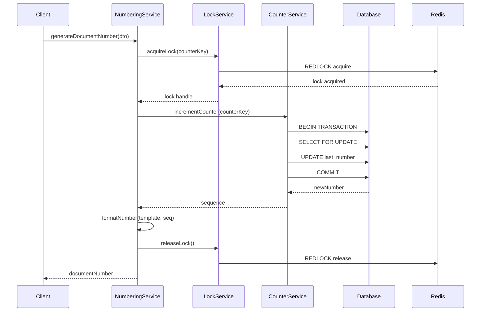
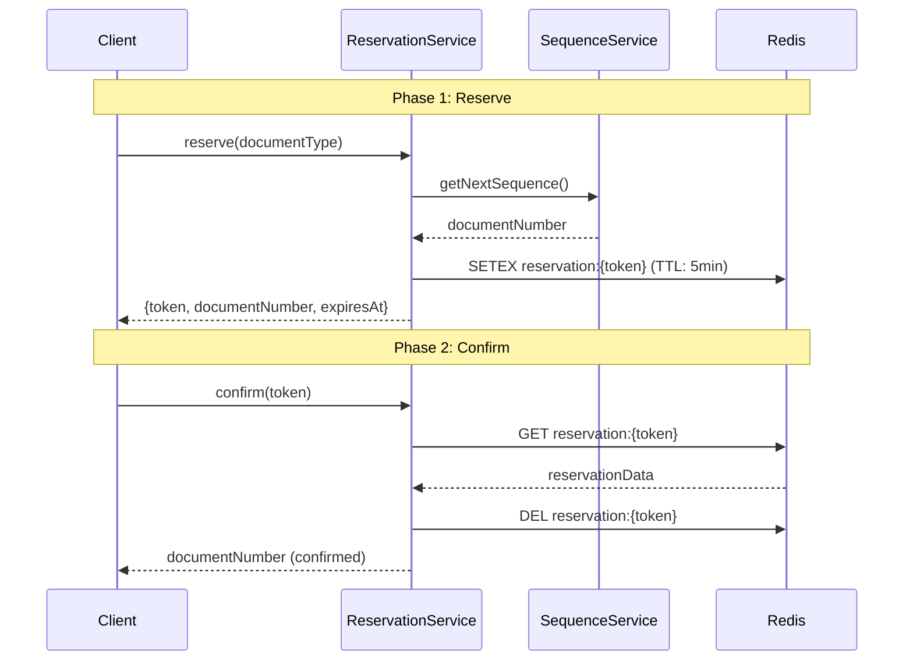

# 3.11 Document Numbering Management & Implementation (V1.8.0)

---
title: 'Specifications & Implementation Guide: Document Numbering System'
version: 1.8.0
status: draft
owner: Nattanin Peancharoen / Development Team
last_updated: 2026-02-23
related:
  - specs/01-requirements/01-01-objectives.md
  - specs/02-architecture/README.md
  - specs/03-implementation/03-02-backend-guidelines.md
  - specs/04-operations/04-08-document-numbering-operations.md
  - specs/07-database/07-01-data-dictionary-v1.8.0.md
  - specs/05-decisions/ADR-002-document-numbering-strategy.md
Clean Version v1.8.0 – Scope of Changes:
  - รวม Functional Requirements เข้ากับ Implementation Guide
  - เลือกใช้ Single Numbering System (Option A) `document_number_counters` เป็น Authoritative Counter
  - เพิ่ม Idempotency Key, Reservation (Two-Phase Commit)
  - Number State Machine, Pattern Validate UTF-8, Cancellation Rule (Void/Replace)
references:
  - [Document Numbering](../../99-archives/01-03.11-document-numbering.md)
  - [Document Numbering](../../99-archives/03-04-document-numbering.md)
---

> **📖 เอกสารฉบับนี้เป็นการรวมรายละเอียดจาก `01-03.11-document-numbering.md` และ `03-04-document-numbering.md` ให้อยู่ในฉบับเดียวสำหรับใช้อ้างอิงการออกแบบเชิง Functional และการพัฒนา Technology Component**

---

## 1. Overview & วัตถุประสงค์ (Purpose)

ระบบ Document Numbering สำหรับสร้างเลขที่เอกสารอัตโนมัติที่มีความเป็นเอกลักษณ์ (unique) และสามารถติดตามได้ (traceable) สำหรับเอกสารทุกประเภทในระบบ LCBP3-DMS

### 1.1 Requirements Summary & Scope
- **Auto-generation**: สร้างเลขที่อัตโนมัติ ไม่ซ้ำ (Unique) ยืดหยุ่น
- **Configurable Templates**: รองรับแบบฟอร์มกำหนดค่า สำหรับโปรเจกต์ ประเภทเอกสาร ฯลฯ
- **Uniqueness Guarantee**: การันตี Uniqueness ใน Concurrent Environment (Race Conditions)
- **Manual override**: รองรับการ Import หรือ Override สำหรับเอกสารเก่า
- **Cancelled/Void Handling**: ไม่นำหมายเลขที่ใช้ หรือ Cancel/Void กลับมาใช้ใหม่ (No reuse)
- **Audit Logging**: บันทึกเหตุการณ์ Operation ทั้งหมดอย่างละเอียดครบถ้วน 7 ปี

### 1.2 Technology Stack
| Component         | Technology           |
| ----------------- | -------------------- |
| Backend Framework | NestJS 10.x          |
| ORM               | TypeORM 0.3.x        |
| Database          | MariaDB 11.8         |
| Cache/Lock        | Redis 7.x + Redlock  |
| Message Queue     | BullMQ               |
| Monitoring        | Prometheus + Grafana |

### 1.3 Architectural Decision (AD-DN-001)
ระบบเลือกใช้ **Option A**:
- `document_number_counters` เป็น Core / Authoritative Counter System.
- `document_numbering_configs` (หรือ `document_number_formats`) ใช้เฉพาะกำหนดระเบียบเลข (Template format) และ Permission.
- เหตุผล: ลดความซ้ำซ้อน, ป้องกัน Counter Mismatch, Debug ง่าย, Ops เคลียร์.

---

## 2. Business Rules & Logic

### 2.1 Counter Logic & Reset Policy

การนับเลขจะแยกตาม **Counter Key** ที่ประกอบด้วยหลายส่วน ซึ่งขึ้นกับประเภทเอกสาร
* `(project_id, originator_organization_id, recipient_organization_id, correspondence_type_id, sub_type_id, rfa_type_id, discipline_id, reset_scope)`

| Document Type                      | Reset Policy       | Counter Key Format / Details                                                   |
| ---------------------------------- | ------------------ | ------------------------------------------------------------------------------ |
| Correspondence (LETTER, MEMO, RFI) | Yearly reset       | `(project_id, originator, recipient, type_id, 0, 0, 0, 'YEAR_2025')`           |
| Transmittal                        | Yearly reset       | `(project_id, originator, recipient, type_id, sub_type_id, 0, 0, 'YEAR_2025')` |
| RFA                                | No reset           | `(project_id, originator, 0, type_id, 0, rfa_type_id, discipline_id, 'NONE')`  |
| Drawing                            | Separate Namespace | `DRAWING::<project>::<contract>` (ไม่ได้ใช้ counter rules เดียวกัน)                 |

### 2.2 Format Templates & Supported Tokens

**Supported Token Types**:
* `{PROJECT}`: รหัสโครงการ (เช่น `LCBP3`)
* `{ORIGINATOR}`: รหัสองค์กรส่ง (เช่น `คคง.`)
* `{RECIPIENT}`: รหัสองค์กรรับหลัก (เช่น `สคฉ.3`) *ไม่ใช้กับ RFA
* `{CORR_TYPE}`: รหัสประเภทเอกสาร (เช่น `RFA`, `LETTER`)
* `{SUB_TYPE}`: ประเภทย่อย (สำหรับ Transmittal)
* `{RFA_TYPE}`: รหัสประเภท RFA (เช่น `SDW`, `RPT`)
* `{DISCIPLINE}`: รหัสสาขาวิชา (เช่น `STR`, `CV`)
* `{SEQ:n}`: Running Number ตามจำนวนหลัก `n` ลบด้วยศูนย์นำหน้า
* `{YEAR:B.E.}`, `{YEAR:A.D.}`, `{YYYY}`, `{YY}`, `{MM}`: สัญลักษณ์บอกเวลาและปฏิทิน.
* `{REV}`: Revision Code (เช่น `A`, `B`)

**Token Validation Grammar**
```ebnf
TEMPLATE     := TOKEN ("-" TOKEN)*
TOKEN        := SIMPLE | PARAM
SIMPLE       := "{PROJECT}" | "{ORIGINATOR}" | "{RECIPIENT}" | "{CORR_TYPE}" | "{DISCIPLINE}" | "{RFA_TYPE}" | "{REV}" | "{YYYY}" | "{YY}" | "{MM}"
PARAM        := "{SEQ:" DIGIT+ "}"
DIGIT        := "0" | "1" | "2" | "3" | "4" | "5" | "6" | "7" | "8" | "9"
```

### 2.3 Character & Format Rules (BR-DN-002, BR-DN-003)
- Document number **must be printable UTF‑8** (Thai, English, Numbers, `-`, `_`, `.`). ไม่อนุญาต Control characters, newlines.
- ต้องยาวระหว่าง 10 ถึง 50 ตัวอักษร
- ต้องกำหนด Token `{SEQ:n}` ลำดับที่ exactly once. ห้ามเป็น Unknown token ใดๆ.

### 2.4 Number State Machine & Idempotency
1. **States Lifecycle**: `RESERVED` (TTL 5 mins) → `CONFIRMED` → `VOID` / `CANCELLED`. Document ที่ Confirmed แล้วสามารถมีพฤติกรรม VOID ในอนาคตเพื่อแทนที่ด้วยเอกสารใหม่ได้ การ Request จะได้ Document ชุดใหม่ทดแทนต่อเนื่องทันที. ห้าม Reuse เลขเดิมโดยสิ้นเชิง.
2. **Idempotency Key Support**: ทุก API ในการ Generator จำเป็นต้องระบุ HTTP Header `Idempotency-Key` ป้องกันระบบสร้างเลขเบิ้ล (Double Submission). ถ้าระบบได้รับคู่ Request + Key ชุดเดิม จะ Response เลขที่เอกสารเดิม.

---

## 3. Functional Requirements

* **FR-DN-001 (Sequential Auto-generation)**: ระบบตอบกลับความรวดเร็วที่ระดับ < 100ms โดยที่ทน Concurrent ได้ ทนต่อปัญหา Duplicate
* **FR-DN-002 (Configurable)**: สามารถเปลี่ยนรูปแบบเทมเพลตผ่านระบบ Admin ได้ด้วยการ Validation ก่อน حفظ
* **FR-DN-003 (Scope-based sequences)**: รองรับ Scope แยกระดับเอกสาร
* **FR-DN-004 (Manual Override)**: ระบบรองรับการตั้งเลขด้วยตนเองสำหรับ Admin Level พร้อมระบุเหตุผลผ่าน Audit Trails เป็นหลักฐานสำคัญ (Import Legacy, Correction)
* **FR-DN-005 (Bulk Import)**: รับเข้าระบบจากไฟล์ Excel/CSV และแก้ไข Counters Sequence ต่อเนื่องพร้อมเช็ค Duplicates.
* **FR-DN-006 (Skip Cancelled)**: ไม่ให้สิทธิ์ดึงเอกสารยกเลิกใช้งานซ้ำ. คงรักษาสภาพ Audit ต่อไป.
* **FR-DN-007 (Void & Replace)**: เปลี่ยน Status เลขเป็น VOID ไม่มีการ Delete. Reference Link เอกสารใหม่ที่เกิดขึ้นทดแทนอิงตาม `voided_from_id`.
* **FR-DN-008 (Race Condition Prevention)**: จัดการ Race Condition (RedLock + Database Pessimistic Locking) เพื่อ Guarantee zero duplicate numbers ที่ Load 1000 req/s.
* **FR-DN-009 (Two-phase Commit)**: แบ่งการออกเลขเป็นช่วง Reserve 5 นาที แล้วค่อยเรียก Confirm หลังจากได้เอกสารที่ Submit เรียบร้อย (ลดอาการเลขหาย/เลขฟันหลอที่ยังไม่ถูกใช้).
* **FR-DN-010/011 (Audit / Metrics Alerting)**: Audit ทุกๆ Step / Transaction ไว้ใน DB ให้เสิร์ชได้เกิน 7 ปี. ส่งแจ้งเตือนถ้า Sequence เริ่มเต็ม (เกิน 90%) หรือ Rate error เริ่มสูง.

---

## 4. Module System & Code Architecture

### 4.1 Folder Structure
```
backend/src/modules/document-numbering/
├── document-numbering.module.ts
├── controllers/          # document-numbering.controller.ts, admin.controller.ts, metrics.controller.ts
├── services/             # Main orchestration (document-numbering.service.ts), lock, counter, reserve, format, audit
├── entities/             # DB Entities mappings
├── dto/                  # DTOs
├── validators/           # template.validator.ts
├── guards/               # manual-override.guard.ts
└── jobs/                 # counter-reset.job.ts (Cron)
```

### 4.2 Sequence Process Architecture

**1. Number Generation Process Diagram**


**2. Two-Phase Commit Pattern (Reserve / Confirm)**


### 4.3 Lock Service (Redis Redlock Example)
```typescript
@Injectable()
export class DocumentNumberingLockService {
  constructor(@InjectRedis() private readonly redis: Redis) {
    this.redlock = new Redlock([redis], { driftFactor: 0.01, retryCount: 5, retryDelay: 100, retryJitter: 50 });
  }

  async acquireLock(counterKey: CounterKey): Promise<Redlock.Lock> {
    const lockKey = this.buildLockKey(counterKey);
    return await this.redlock.acquire([lockKey], /* ttl */ 5000); // 5 sec retention
  }
}
```

### 4.4 Counter Service & Transaction Strategy (Optimistic Example)
```typescript
async incrementCounter(counterKey: CounterKey): Promise<number> {
  const MAX_RETRIES = 2;
  for (let attempt = 0; attempt < MAX_RETRIES; attempt++) {
    try {
      return await this.dataSource.transaction(async (manager) => {
        const counter = await manager.findOne(DocumentNumberCounter, { /* rules */ });
        if (!counter) {
           // Insert base 1
           return 1;
        }
        counter.lastNumber += 1;
        await manager.save(counter); // Trigger Optimistic Version Check
        return counter.lastNumber;
      });
    } catch (error) {
       // Loop if version mismatch
    }
  }
}
```

---

## 5. Database Schema Details

### 5.1 Format Storage & Counters
```sql
-- Format Template Configuration
CREATE TABLE document_number_formats (
  id INT AUTO_INCREMENT PRIMARY KEY,
  project_id INT NOT NULL,
  correspondence_type_id INT NULL,
  format_template VARCHAR(100) NOT NULL,
  reset_sequence_yearly TINYINT(1) DEFAULT 1,
  UNIQUE KEY idx_unique_project_type (project_id, correspondence_type_id),
  FOREIGN KEY (project_id) REFERENCES projects(id) ON DELETE CASCADE
);

-- Active Sequences
CREATE TABLE document_number_counters (
  project_id INT NOT NULL,
  correspondence_type_id INT NULL,
  originator_organization_id INT NOT NULL,
  recipient_organization_id INT NOT NULL DEFAULT 0,
  sub_type_id INT DEFAULT 0,
  rfa_type_id INT DEFAULT 0,
  discipline_id INT DEFAULT 0,
  reset_scope VARCHAR(20) NOT NULL,
  last_number INT DEFAULT 0 NOT NULL,
  version INT DEFAULT 0 NOT NULL,
  PRIMARY KEY (... 8 fields combination ...),
  INDEX idx_counter_lookup (project_id, correspondence_type_id, reset_scope)
);
```

### 5.2 Two-Phase Commit Reservations
```sql
CREATE TABLE document_number_reservations (
  id BIGINT AUTO_INCREMENT PRIMARY KEY,
  token VARCHAR(36) NOT NULL UNIQUE COMMENT 'UUID v4',
  document_number VARCHAR(100) NOT NULL UNIQUE,
  status ENUM('RESERVED', 'CONFIRMED', 'CANCELLED', 'VOID') NOT NULL DEFAULT 'RESERVED',
  document_id INT NULL COMMENT 'Link after confirmed',
  expires_at DATETIME(6) NOT NULL,
  ... Context fields ...
);
```

### 5.3 Audit Trails & Error Logs
```sql
CREATE TABLE document_number_audit (
  id BIGINT AUTO_INCREMENT PRIMARY KEY,
  document_number VARCHAR(100) NOT NULL,
  operation ENUM('RESERVE', 'CONFIRM', 'CANCEL', 'MANUAL_OVERRIDE', 'VOID', 'GENERATE') NOT NULL,
  counter_key JSON NOT NULL,
  is_success BOOLEAN DEFAULT TRUE,
  lock_wait_ms INT,
  ... Extraneous Auditing fields ...
);

CREATE TABLE document_number_errors (
  id BIGINT AUTO_INCREMENT PRIMARY KEY,
  error_type ENUM('LOCK_TIMEOUT','VERSION_CONFLICT','DB_ERROR','REDIS_ERROR','VALIDATION_ERROR','SEQUENCE_EXHAUSTED') NOT NULL,
  stack_trace TEXT,
  context_data JSON
);
```

---

## 6. Endpoints & API Definitions

| Endpoint                                     | Method   | Permission               | Meaning                                    |
| -------------------------------------------- | -------- | ------------------------ | ------------------------------------------ |
| `/document-numbering/preview`                | POST     | `correspondence.read`    | Preview Formats                            |
| `/document-numbering/reserve`                | POST     | `correspondence.create`  | Reserve Token & Logic Number (2PC)         |
| `/document-numbering/confirm`                | POST     | `correspondence.create`  | Confirm Reservation (2PC)                  |
| `/document-numbering/cancel`                 | POST     | `correspondence.create`  | Manual or System Cancel Reservation        |
| `/admin/document-numbering/manual-override`  | POST     | `system.manage_settings` | Inject / Legacy specific number generation |
| `/admin/document-numbering/void-and-replace` | POST     | `system.manage_settings` | Replace document marking old logic as VOID |
| `/admin/document-numbering/bulk-import`      | POST     | `system.manage_settings` | Batch Migration Numbers from legacy        |
| `/admin/document-numbering/templates`        | GET/POST | `system.manage_settings` | Setting Pattern Configurations             |

---

## 7. Security, Error Handling & Concurrency Checklists

**Fallback Strategy for Database Lock Failures**:
1. System attempt to acquire `Redlock`.
2. Redis Down? → **Fallback DB-only Lock** Transaction Layer.
3. Redis Online but Timeout `>3 Times`? → Return HTTP 503 (Exponential Backoff).
4. Save Failed via TypeORM Version Confilct? → Retry Loop `2 Times`, otherwise Return 409 Conflict.

**Rate Limiting Profiles**:
* Single User Threshold: `10 requests/minute`.
* Specific Request IP: `50 requests/minute`.

**Authorization Policies**:
* `Super Admin` เท่านั้นที่บังคับสั่ง `Reset Counter` ให้เริ่มนับศูนย์ได้เมื่อฉุกเฉิน.
* กฎ Audit Log System ระบุชัดเจนว่าต้อง Retain Information ไม่ต่ำกว่า 7 ปี.

## 8. Monitoring / Observability (Prometheus + Grafana)

| Condition Event        | Prometheus Counter Target        | Severity Reaction                                                 |
| ---------------------- | -------------------------------- | ----------------------------------------------------------------- |
| Utilization `>95%`     | `numbering_sequence_utilization` | 🔴 **CRITICAL** (PagerDuty/Slack). Limit Maximum sequence reached. |
| Redis Downtime `>1M`   | Health System                    | 🔴 **CRITICAL** (PagerDuty/Slack)                                  |
| Lock Latency p95 `>1s` | `numbering_lock_wait_seconds`    | 🟡 **WARNING** (Slack). Redis connection struggling.               |
| Error Rate Burst       | `numbering_lock_failures_total`  | 🟡 **WARNING** (Slack). Need investigation logs check              |

---

## 9. Testing & Rollout Migration Strategies

### 9.1 Test Approach Requirements
* **Unit Tests**: Template Tokens Validations, Error handling retry, Optimistic locking checks.
* **Concurrency Integration Test**: Assert >1000 requests without double generating numbers simultaneously per `project_id`.
* **E2E Load Sequence Flow**: Mocking bulk API loads over 500 requests per seconds via CI/CD load pipeline.

### 9.2 Data Rollout Plan (Legacy Legacy Import)
1. Dump out existing Sequence numbers (Extracted Document Strings).
2. Write validation script for Sequence Max Counts.
3. Import to Table `document_number_counters` as Manual Override API Method context (`FR-DN-004`).
4. Re-Verify next sequence logic output `+1` count seamlessly integrates to `nextNumber()`.

---

**Best Practices Checklist**
- ✅ **DO**: Two-Phase Commit (`Reserve` + `Confirm`) ให้เป็น Routine System Concept.
- ✅ **DO**: DB Fallback เมื่อ Redis ดาวน์. ให้ Availability สูงสุด ไม่หยุดทำงาน.
- ✅ **DO**: ข้ามเลขที่ยกเลิกทั้งหมดห้ามมีการ Re-Use เด็ดขาด ไม่ว่าเจตนาใดๆ.
- ❌ **DON'T**: ไม่แก้ Sequence จาก DB Console ตรงๆ โดยเด็ดขาด.
- ❌ **DON'T**: ลืม Validate format หรือ Tokens แปลกๆ ในระบบ Template (ต้อง Check Grammar ตลอดไป).
- ❌ **DON'T**: ลืมเขียน Idempotency-Key สำหรับ Request.

---
**Document Version**: 1.8.0
**Created By**: Development Team
**End of Document**


---

## 10. Operations & Infrastructure Guidelines

### 1. Performance Requirements

### 1.1. Response Time Targets

| Metric           | Target   | Measurement              |
| ---------------- | -------- | ------------------------ |
| 95th percentile  | ≤ 2 วินาที | ตั้งแต่ request ถึง response |
| 99th percentile  | ≤ 5 วินาที | ตั้งแต่ request ถึง response |
| Normal operation | ≤ 500ms  | ไม่มี retry                |

### 1.2. Throughput Targets

| Load Level     | Target      | Notes                    |
| -------------- | ----------- | ------------------------ |
| Normal load    | ≥ 50 req/s  | ใช้งานปกติ                 |
| Peak load      | ≥ 100 req/s | ช่วงเร่งงาน                |
| Burst capacity | ≥ 200 req/s | Short duration (< 1 min) |

### 1.3. Availability SLA

- **Uptime**: ≥ 99.5% (excluding planned maintenance)
- **Maximum downtime**: ≤ 3.6 ชั่วโมง/เดือน (~ 8.6 นาที/วัน)
- **Recovery Time Objective (RTO)**: ≤ 30 นาที
- **Recovery Point Objective (RPO)**: ≤ 5 นาที


### 2. Infrastructure Setup

### 2.1. Database Configuration

#### MariaDB Connection Pool

```typescript
// ormconfig.ts
{
  type: 'mysql',
  host: process.env.DB_HOST,
  port: parseInt(process.env.DB_PORT),
  username: process.env.DB_USERNAME,
  password: process.env.DB_PASSWORD,
  database: process.env.DB_DATABASE,
  extra: {
    connectionLimit: 20,      // Pool size
    queueLimit: 0,            // Unlimited queue
    acquireTimeout: 10000,    // 10s timeout
    retryAttempts: 3,
    retryDelay: 1000
  }
}
```

#### High Availability Setup

```yaml
# docker-compose.yml
services:
  mariadb-master:
    image: mariadb:11.8
    environment:
      MYSQL_REPLICATION_MODE: master
      MYSQL_ROOT_PASSWORD: ${DB_ROOT_PASSWORD}
    volumes:
      - mariadb-master-data:/var/lib/mysql
    networks:
      - backend

  mariadb-replica:
    image: mariadb:11.8
    environment:
      MYSQL_REPLICATION_MODE: slave
      MYSQL_MASTER_HOST: mariadb-master
      MYSQL_MASTER_ROOT_PASSWORD: ${DB_ROOT_PASSWORD}
    volumes:
      - mariadb-replica-data:/var/lib/mysql
    networks:
      - backend
```

### 2.2. Redis Configuration

#### Redis Sentinel for High Availability

```yaml
# docker-compose.yml
services:
  redis-master:
    image: redis:7-alpine
    command: redis-server --appendonly yes
    volumes:
      - redis-master-data:/data
    networks:
      - backend

  redis-replica:
    image: redis:7-alpine
    command: redis-server --replicaof redis-master 6379 --appendonly yes
    volumes:
      - redis-replica-data:/data
    networks:
      - backend

  redis-sentinel:
    image: redis:7-alpine
    command: >
      redis-sentinel /etc/redis/sentinel.conf
      --sentinel monitor mymaster redis-master 6379 2
      --sentinel down-after-milliseconds mymaster 5000
      --sentinel failover-timeout mymaster 10000
    networks:
      - backend
```

#### Redis Connection Pool

```typescript
// redis.config.ts
import IORedis from 'ioredis';

export const redisConfig = {
  host: process.env.REDIS_HOST || 'localhost',
  port: parseInt(process.env.REDIS_PORT) || 6379,
  password: process.env.REDIS_PASSWORD,
  maxRetriesPerRequest: 3,
  enableReadyCheck: true,
  lazyConnect: false,
  poolSize: 10,
  retryStrategy: (times: number) => {
    if (times > 3) {
      return null; // Stop retry
    }
    return Math.min(times * 100, 3000);
  },
};
```

### 2.3. Load Balancing

#### Nginx Configuration

```nginx
# nginx.conf
upstream backend {
  least_conn;  # Least connections algorithm
  server backend-1:3000 max_fails=3 fail_timeout=30s weight=1;
  server backend-2:3000 max_fails=3 fail_timeout=30s weight=1;
  server backend-3:3000 max_fails=3 fail_timeout=30s weight=1;

  keepalive 32;
}

server {
  listen 80;
  server_name api.lcbp3.local;

  location /api/v1/document-numbering/ {
    proxy_pass http://backend;
    proxy_http_version 1.1;
    proxy_set_header Connection "";
    proxy_set_header Host $host;
    proxy_set_header X-Real-IP $remote_addr;
    proxy_set_header X-Forwarded-For $proxy_add_x_forwarded_for;

    proxy_next_upstream error timeout;
    proxy_connect_timeout 10s;
    proxy_send_timeout 30s;
    proxy_read_timeout 30s;
  }
}
```

#### Docker Compose Scaling

```yaml
# docker-compose.yml
services:
  backend:
    image: lcbp3-backend:latest
    deploy:
      replicas: 3
      resources:
        limits:
          cpus: '1.0'
          memory: 1G
        reservations:
          cpus: '0.5'
          memory: 512M
      restart_policy:
        condition: on-failure
        delay: 5s
        max_attempts: 3
    environment:
      NODE_ENV: production
      DB_POOL_SIZE: 20
    networks:
      - backend
```


### 4. Troubleshooting Runbooks

### 4.1. Scenario: Redis Unavailable

**Symptoms:**
- Alert: `RedisUnavailable`
- System falls back to DB-only locking
- Performance degraded 30-50%

**Action Steps:**

1. **Check Redis status:**
   ```bash
   docker exec lcbp3-redis redis-cli ping
   # Expected: PONG
   ```

2. **Check Redis logs:**
   ```bash
   docker logs lcbp3-redis --tail=100
   ```

3. **Restart Redis (if needed):**
   ```bash
   docker restart lcbp3-redis
   ```

4. **Verify failover (if using Sentinel):**
   ```bash
   docker exec lcbp3-redis-sentinel redis-cli -p 26379 SENTINEL masters
   ```

5. **Monitor recovery:**
   - Check metric: `docnum_redis_connection_status` returns to 1
   - Check performance: P95 latency returns to normal (< 500ms)

### 4.2. Scenario: High Lock Failure Rate

**Symptoms:**
- Alert: `HighLockFailureRate` (> 10%)
- Users report "ระบบกำลังยุ่ง" errors

**Action Steps:**

1. **Check concurrent load:**
   ```bash
   # Check current request rate
   curl http://prometheus:9090/api/v1/query?query=rate(docnum_generation_duration_ms_count[1m])
   ```

2. **Check database connections:**
   ```sql
   SHOW PROCESSLIST;
   -- Look for waiting/locked queries
   ```

3. **Check Redis memory:**
   ```bash
   docker exec lcbp3-redis redis-cli INFO memory
   ```

4. **Scale up if needed:**
   ```bash
   # Increase backend replicas
   docker-compose up -d --scale backend=5
   ```

5. **Check for deadlocks:**
   ```sql
   SHOW ENGINE INNODB STATUS;
   -- Look for LATEST DETECTED DEADLOCK section
   ```

### 4.3. Scenario: Slow Performance

**Symptoms:**
- Alert: `SlowDocumentNumberGeneration`
- P95 > 2 seconds

**Action Steps:**

1. **Check database query performance:**
   ```sql
   SELECT * FROM document_number_counters USE INDEX (idx_counter_lookup)
   WHERE project_id = 2 AND correspondence_type_id = 6 AND current_year = 2025;

   -- Check execution plan
   EXPLAIN SELECT ...;
   ```

2. **Check for missing indexes:**
   ```sql
   SHOW INDEX FROM document_number_counters;
   ```

3. **Check Redis latency:**
   ```bash
   docker exec lcbp3-redis redis-cli --latency
   ```

4. **Check network latency:**
   ```bash
   ping mariadb-master
   ping redis-master
   ```

5. **Review slow query log:**
   ```bash
   docker exec lcbp3-mariadb-master cat /var/log/mysql/slow.log
   ```

### 4.4. Scenario: Version Conflicts

**Symptoms:**
- High retry count
- Users report "เลขที่เอกสารถูกเปลี่ยน" errors

**Action Steps:**

1. **Check concurrent requests to same counter:**
   ```sql
   SELECT
     project_id,
     correspondence_type_id,
     COUNT(*) as concurrent_requests
   FROM document_number_audit
   WHERE created_at > NOW() - INTERVAL 5 MINUTE
   GROUP BY project_id, correspondence_type_id
   HAVING COUNT(*) > 10
   ORDER BY concurrent_requests DESC;
   ```

2. **Investigate specific counter:**
   ```sql
   SELECT * FROM document_number_counters
   WHERE project_id = X AND correspondence_type_id = Y;

   -- Check audit trail
   SELECT * FROM document_number_audit
   WHERE counter_key LIKE '%project_id:X%'
   ORDER BY created_at DESC
   LIMIT 20;
   ```

3. **Check for application bugs:**
   - Review error logs for stack traces
   - Check if retry logic is working correctly

4. **Temporary mitigation:**
   - Increase retry count in application config
   - Consider manual counter adjustment (last resort)


### 5. Maintenance Procedures

### 5.1. Counter Reset (Manual)

**Requires:** SUPER_ADMIN role + 2-person approval

**Steps:**

1. **Request approval via API:**
   ```bash
   POST /api/v1/document-numbering/configs/{configId}/reset-counter
   {
     "reason": "เหตุผลที่ชัดเจน อย่างน้อย 20 ตัวอักษร",
     "approver_1": "user_id",
     "approver_2": "user_id"
   }
   ```

2. **Verify in audit log:**
   ```sql
   SELECT * FROM document_number_config_history
   WHERE config_id = X
   ORDER BY changed_at DESC
   LIMIT 1;
   ```

### 5.2. Template Update

**Best Practices:**

1. Always test template in staging first
2. Preview generated numbers before applying
3. Document reason for change
4. Template changes do NOT affect existing documents

**API Call:**
```bash
PUT /api/v1/document-numbering/configs/{configId}
{
  "template": "{ORIGINATOR}-{RECIPIENT}-{SEQ:4}-{YEAR:B.E.}",
  "change_reason": "เหตุผลในการเปลี่ยนแปลง"
}
```

### 5.3. Database Maintenance

**Weekly Tasks:**
- Check slow query log
- Optimize tables if needed:
  ```sql
  OPTIMIZE TABLE document_number_counters;
  OPTIMIZE TABLE document_number_audit;
  ```

**Monthly Tasks:**
- Review and archive old audit logs (> 2 years)
- Check index usage:
  ```sql
  SELECT * FROM sys.schema_unused_indexes
  WHERE object_schema = 'lcbp3_db';
  ```


