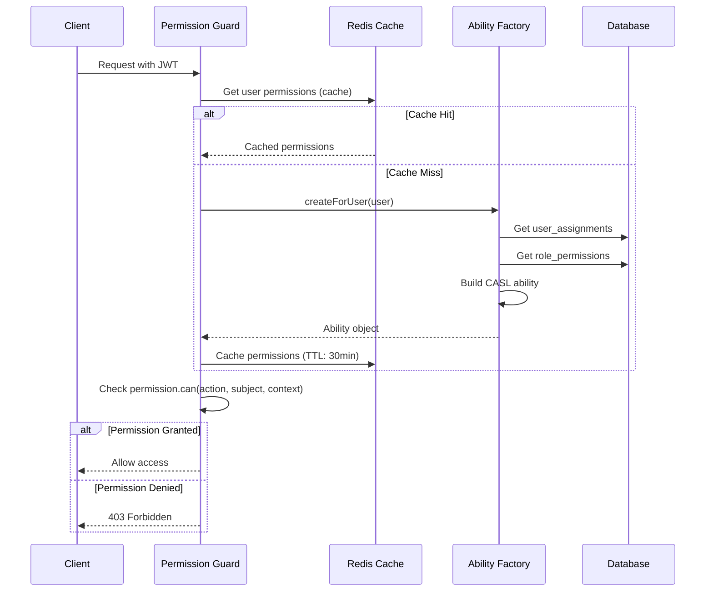

# ADR-004: RBAC Implementation with 4-Level Scope

**Status:** Accepted
**Date:** 2025-11-30
**Decision Makers:** Development Team, Security Team
**Related Documents:**

- [System Architecture](../02-architecture/02-01-system-architecture.md)
- [Access Control Requirements](../01-requirements/01-04-access-control.md)

---

## Context and Problem Statement

LCBP3-DMS ต้องจัดการสิทธิ์การเข้าถึงที่ซับซ้อน:

- **Multi-Organization:** หลายองค์กรใช้ระบบร่วมกัน แต่ต้องแยกข้อมูล
- **Project-Based:** แต่ละ Project มี Contracts แยกกัน
- **Hierarchical Permissions:** สิทธิ์ระดับบนครอบคลุมระดับล่าง
- **Dynamic Roles:** Role และ Permission ต้องปรับได้โดยไม่ต้อง Deploy

### Key Requirements

1. User หนึ่งคนสามารถมีหลาย Roles ในหลาย Scopes
2. Permission Inheritance (Global → Organization → Project → Contract)
3. Fine-grained Access Control (e.g., "ดู Correspondence ได้เฉพาะ Project A")
4. Performance (Check permission ต้องเร็ว < 10ms)

---

## Decision Drivers

- **Security:** ป้องกันการเข้าถึงข้อมูลที่ไม่มีสิทธิ์
- **Flexibility:** ปรับ Roles/Permissions ได้ง่าย
- **Performance:** Check permission รวดเร็ว
- **Usability:** Admin กำหนดสิทธิ์ได้ง่าย
- **Scalability:** รองรับ Users/Organizations จำนวนมาก

---

## Considered Options

### Option 1: Simple Role-Based (No Scope)

**แนวทาง:** Users มี Roles (Admin, Editor, Viewer) เท่านั้น ไม่มี Scope

**Pros:**

- ✅ Very simple implementation
- ✅ Easy to understand

**Cons:**

- ❌ ไม่รองรับ Multi-organization
- ❌ Superadmin เห็นข้อมูลทุก Organization
- ❌ ไม่ยืดหยุ่น

### Option 2: Organization-Only Scope

**แนวทาง:** Roles ผูกกับ Organization เท่านั้น

**Pros:**

- ✅ แยกข้อมูลระหว่าง Organizations ได้
- ✅ Moderate complexity

**Cons:**

- ❌ ไม่รองรับ Project/Contract level permissions
- ❌ User ใน Organization เห็นทุก Project

### Option 3: **4-Level Hierarchical RBAC** ⭐ (Selected)

**แนวทาง:** Global → Organization → Project → Contract

**Pros:**

- ✅ **Maximum Flexibility:** ครอบคลุมทุก Use Case
- ✅ **Inheritance:** Global Admin เห็นทุกอย่าง
- ✅ **Isolation:** Project Manager เห็นแค่ Project ของตน
- ✅ **Fine-grained:** Contract Admin จัดการแค่ Contract เดียว
- ✅ **Dynamic:** Roles/Permissions configurable

**Cons:**

- ❌ Complex implementation
- ❌ Performance concern (need optimization)
- ❌ Learning curve for admins

---

## Decision Outcome

**Chosen Option:** Option 3 - 4-Level Hierarchical RBAC

### Rationale

เลือก 4-Level RBAC เนื่องจาก:

1. **Business Requirements:** Project มีหลาย Contracts ที่ต้องแยกสิทธิ์
2. **Future-proof:** รองรับการเติบโตในอนาคต
3. **CASL Integration:** ใช้ library ที่รองรับ complex permissions
4. **Redis Caching:** แก้ปัญหา Performance ด้วย Cache

---

## Implementation Details

### Database Schema

```sql
-- Roles with Scope
CREATE TABLE roles (
  role_id INT PRIMARY KEY AUTO_INCREMENT,
  role_name VARCHAR(100) NOT NULL,
  scope ENUM('Global', 'Organization', 'Project', 'Contract') NOT NULL,
  description TEXT,
  is_system BOOLEAN DEFAULT FALSE
);

-- Permissions
CREATE TABLE permissions (
  permission_id INT PRIMARY KEY AUTO_INCREMENT,
  permission_name VARCHAR(100) NOT NULL UNIQUE,
  description TEXT,
  module VARCHAR(50),
  scope_level ENUM('GLOBAL', 'ORG', 'PROJECT')
);

-- Role-Permission Mapping
CREATE TABLE role_permissions (
  role_id INT,
  permission_id INT,
  PRIMARY KEY (role_id, permission_id),
  FOREIGN KEY (role_id) REFERENCES roles(role_id) ON DELETE CASCADE,
  FOREIGN KEY (permission_id) REFERENCES permissions(permission_id) ON DELETE CASCADE
);

-- User Role Assignments with Scope Context
CREATE TABLE user_assignments (
  id INT PRIMARY KEY AUTO_INCREMENT,
  user_id INT NOT NULL,
  role_id INT NOT NULL,
  organization_id INT NULL,
  project_id INT NULL,
  contract_id INT NULL,
  assigned_at TIMESTAMP DEFAULT CURRENT_TIMESTAMP,
  FOREIGN KEY (user_id) REFERENCES users(user_id) ON DELETE CASCADE,
  FOREIGN KEY (role_id) REFERENCES roles(role_id) ON DELETE CASCADE,
  FOREIGN KEY (organization_id) REFERENCES organizations(id) ON DELETE CASCADE,
  FOREIGN KEY (project_id) REFERENCES projects(id) ON DELETE CASCADE,
  FOREIGN KEY (contract_id) REFERENCES contracts(id) ON DELETE CASCADE,
  CONSTRAINT chk_scope CHECK (
    (organization_id IS NOT NULL AND project_id IS NULL AND contract_id IS NULL) OR
    (organization_id IS NULL AND project_id IS NOT NULL AND contract_id IS NULL) OR
    (organization_id IS NULL AND project_id IS NULL AND contract_id IS NOT NULL) OR
    (organization_id IS NULL AND project_id IS NULL AND contract_id IS NULL)
  )
);
```

### CASL Ability Rules

```typescript
// ability.factory.ts
import { AbilityBuilder, PureAbility } from '@casl/ability';

export type AppAbility = PureAbility<[string, any]>;

@Injectable()
export class AbilityFactory {
  async createForUser(user: User): Promise<AppAbility> {
    const { can, cannot, build } = new AbilityBuilder<AppAbility>(PureAbility);

    // Get user assignments (from cache or DB)
    const assignments = await this.getUserAssignments(user.user_id);

    for (const assignment of assignments) {
      const role = await this.getRole(assignment.role_id);
      const permissions = await this.getRolePermissions(role.role_id);

      for (const permission of permissions) {
        // permission format: 'correspondence.create', 'project.view'
        const [subject, action] = permission.permission_name.split('.');

        // Apply scope-based conditions
        switch (assignment.scope) {
          case 'Global':
            can(action, subject);
            break;

          case 'Organization':
            can(action, subject, {
              organization_id: assignment.organization_id,
            });
            break;

          case 'Project':
            can(action, subject, {
              project_id: assignment.project_id,
            });
            break;

          case 'Contract':
            can(action, subject, {
              contract_id: assignment.contract_id,
            });
            break;
        }
      }
    }

    return build();
  }
}
```

### Permission Guard

```typescript
// permission.guard.ts
@Injectable()
export class PermissionGuard implements CanActivate {
  constructor(
    private reflector: Reflector,
    private abilityFactory: AbilityFactory,
    private redis: Redis
  ) {}

  async canActivate(context: ExecutionContext): Promise<boolean> {
    // Get required permission from decorator
    const permission = this.reflector.get<string>(
      'permission',
      context.getHandler()
    );

    if (!permission) return true;

    const request = context.switchToHttp().getRequest();
    const user = request.user;

    // Check cache first (30 min TTL)
    const cacheKey = `user:${user.user_id}:permissions`;
    let ability = await this.redis.get(cacheKey);

    if (!ability) {
      ability = await this.abilityFactory.createForUser(user);
      await this.redis.set(cacheKey, JSON.stringify(ability.rules), 'EX', 1800);
    }

    const [action, subject] = permission.split('.');
    const resource = request.params || request.body;

    return ability.can(action, subject, resource);
  }
}
```

### Usage Example

```typescript
@Controller('correspondences')
@UseGuards(JwtAuthGuard, PermissionGuard)
export class CorrespondenceController {
  @Post()
  @RequirePermission('correspondence.create')
  async create(@Body() dto: CreateCorrespondenceDto) {
    // Only users with create permission can access
  }

  @Get(':id')
  @RequirePermission('correspondence.view')
  async findOne(@Param('id') id: string) {
    // Check if user has view permission for this project
  }
}
```

---

## Permission Checking Flow



---

## 4-Level Scope Hierarchy

```
Global (ทั้งระบบ)
│
├─ Organization (ระดับองค์กร)
│  ├─ Project (ระดับโครงการ)
│  │  └─ Contract (ระดับสัญญา)
│  │
│  └─ Project B
│     └─ Contract B
│
└─ Organization 2
   └─ Project C
```

### Example Assignments

```typescript
// User A: Superadmin (Global)
{
  user_id: 1,
  role_id: 1, // Superadmin
  organization_id: null,
  project_id: null,
  contract_id: null
}
// Can access EVERYTHING

// User B: Document Control in TEAM Organization
{
  user_id: 2,
  role_id: 3, // Document Control
  organization_id: 3, // TEAM
  project_id: null,
  contract_id: null
}
// Can manage documents in TEAM organization (all projects)

// User C: Project Manager for LCBP3
{
  user_id: 3,
  role_id: 6, // Project Manager
  organization_id: null,
  project_id: 1, // LCBP3
  contract_id: null
}
// Can manage only LCBP3 project (all contracts within)

// User D: Contract Admin for Contract-1
{
  user_id: 4,
  role_id: 7, // Contract Admin
  organization_id: null,
  project_id: null,
  contract_id: 5 // Contract-1
}
// Can manage only Contract-1
```

---

## Consequences

### Positive

1. ✅ **Fine-grained Control:** แยกสิทธิ์ได้ละเอียดมาก
2. ✅ **Flexible:** User มีหลาย Roles ใน Scopes ต่างกันได้
3. ✅ **Inheritance:** Global → Org → Project → Contract
4. ✅ **Performant:** Redis cache ทำให้เร็ว (< 10ms)
5. ✅ **Auditable:** ทุก Assignment บันทึกใน DB

### Negative

1. ❌ **Complexity:** ซับซ้อนในการ Setup และ Maintain
2. ❌ **Cache Invalidation:** ต้อง Invalidate ถูกต้องเมื่อเปลี่ยน Roles
3. ❌ **Learning Curve:** Admin ต้องเข้าใจ Scope hierarchy
4. ❌ **Testing:** ต้อง Test ทุก Combination

### Mitigation Strategies

- **Complexity:** สร้าง Admin UI ที่ใช้งานง่าย
- **Cache:** Auto-invalidate เมื่อมีการเปลี่ยนแปลง
- **Documentation:** เขียน Guide ชัดเจน
- **Testing:** Integration tests ครอบคลุม Permissions

---

## Compliance

เป็นไปตาม:

- [Requirements Section 4](../01-requirements/01-04-access-control.md) - Access Control
- [Backend Plan Section 2 RBAC](../../docs/2_Backend_Plan_V1_4_5.md#rbac)

---

## Related ADRs

- [ADR-005: Redis Usage Strategy](./ADR-005-redis-usage-strategy.md) - Permission caching
- [ADR-001: Unified Workflow Engine](./ADR-001-unified-workflow-engine.md) - Workflow permission guards

---

## References

- [CASL Documentation](https://casl.js.org/v6/en/guide/intro)
- [RBAC Best Practices](https://csrc.nist.gov/publications/detail/sp/800-162/final)
