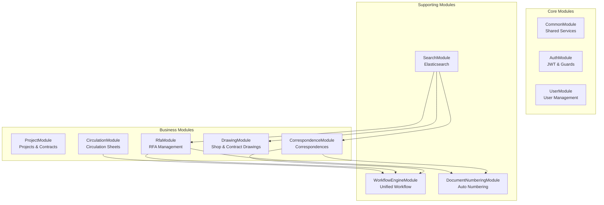
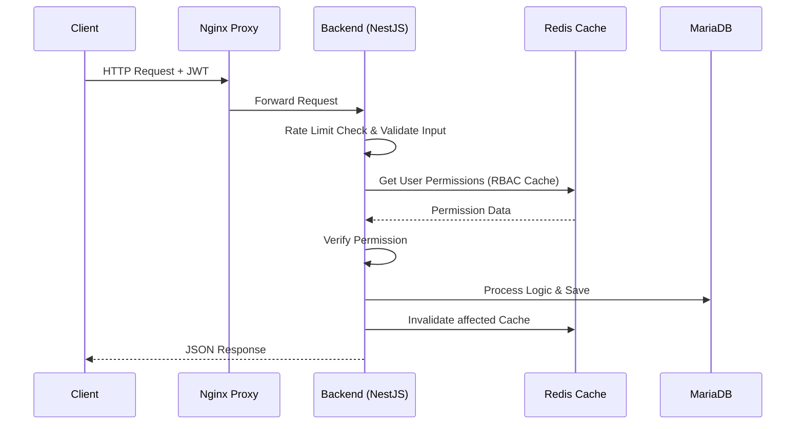

# 02.3 Software Architecture & Design (สถาปัตยกรรมซอฟต์แวร์และการออกแบบ)

---

title: 'Software Architecture'
version: 1.8.0
status: first-draft
owner: Nattanin Peancharoen
last_updated: 2026-02-23
related:
  - specs/02-Architecture/00-01-system-context.md

---

## 1. 🧱 Backend Module Architecture (NestJS)

### 1.1 Modular Design

### 1.2 Key Architectural Patterns

#### Unified Workflow Engine (DSL-Based)
ระบบการเดินเอกสาร (Correspondence, RFA, Circulation) ใช้ Engine กลางเดียวกัน ผ่าน **Workflow DSL (JSON Configuration)**
- **Separation of Concerns:** Modules เก็บเฉพาะข้อมูล (Data) ส่วน Flow/State ถูกจัดการโดย Engine
- **Versioning:** อาศัย Workflow Definition Version ป้องกันความขัดแย้งของ State เมื่อมีการแก้ไข Flow

#### Double-Locking Mechanism (Auto Numbering)
เพื่อป้องกัน Race Condition ในการขอเลขเอกสารพร้อมกัน:
- **Layer 1:** Redis Distributed Lock (ล็อคการเข้าถึงในระดับ Server/Network)
- **Layer 2:** Optimistic Database Lock ผ่าน `@VersionColumn()` (ป้องกันระดับ Data Record)

#### Idempotency
ทุก API ที่แก้ไขสถานะจะต้องส่ง `Idempotency-Key` ป้องกันผู้ใช้กดยืนยันซ้ำสองรอบ

## 2. 📊 Data Flow & Processes

### 2.1 Main Request Flow

### 2.2 File Upload Flow (Two-Phase Storage)
ใช้แบบ **Two-Phase** เพื่อลดความเสี่ยงเกิดไฟล์ขยะ (Orphan Files):
1. **[Phase 1]:** Client อัปโหลดไฟล์ -> ตรวจ Virus -> วางไว้ที่โฟลเดอร์ `temp/` -> ส่ง `temp_id` กลับให้ Client
2. **[Phase 2]:** Client สั่ง Create Document (แนบ `temp_id`) -> Backend บันทึกฐานข้อมูล -> ย้ายไฟล์จาก `temp/` ไปที่ `permanent/` -> สร้างตาราง Attachment -> Commit Transaction
3. **[Cleanup Job]:** ครอนจ็อบตามลบไฟล์ที่ค้างอยู่ใน `temp/` เกิน 24 ชั่วโมง

## 3. 🛡️ Security Architecture

### 3.1 Rate Limiting (Redis-backed)
- Anonymous: 100 req/hour
- File Upload: 50 req/hour
- Document Control: 2000 req/hour
- Admin: 5000 req/hour

### 3.2 Authorization checking flow (CASL)
1. ดึง JWT Token ตรวจสอบความถูกต้อง
2. โหลด User Permissions จาก Redis (`user:{user_id}:permissions`)
3. ตรวจสอบเงื่อนไขตาม Context:
   - Superadmin Override
   - Orgnization Level
   - Project Level
   - Contract Level
4. พิจารณาอนุญาตหากระดับใดระดับหนึ่งอนุญาต (Most Permissive approach)

### 3.3 OWASP Top 10 Protections implemented
- **SQL Injection:** Parameterized Queries via TypeORM
- **XSS/CSRF:** Input Sanitization, CSRF Tokens
- **Insecure File Upload:** Magic Number Validation (ไม่ใช่แค่ extension), ไวรัสสแกน, สิทธิเข้าถึงไฟล์ถูกห่อหุ้มด้วย Authorization endpoint เสมอ ไม่ปล่อย public link

## 4. 🔄 Resilience & Error Handling

- **Circuit Breaker:** ใช้งานครอบ API ภายนอก (Email, LINE Notify). หาก fail ติดต่อกัน 5 ครั้งใน 1 นาที ให้หยุดส่ง (Timeout 30s) แล้วใช้โหมด Half-open
- **Retry Mechanism (Exponential Backoff):** สำหรับกระบวนการสำคัญชั่วคราว เช่น จังหวะล็อก Database ล้มเหลวตอน Generate Number
- **Graceful Degradation:** หาก Search Engine ล่ม (Elasticsearch down), ระบบต้องสลับไปใช้ Database Query พื้นฐานชั่วคราวได้ หรือตัดฟีเจอร์บางส่วนโดยไม่กระทบ CRUD หลัก
