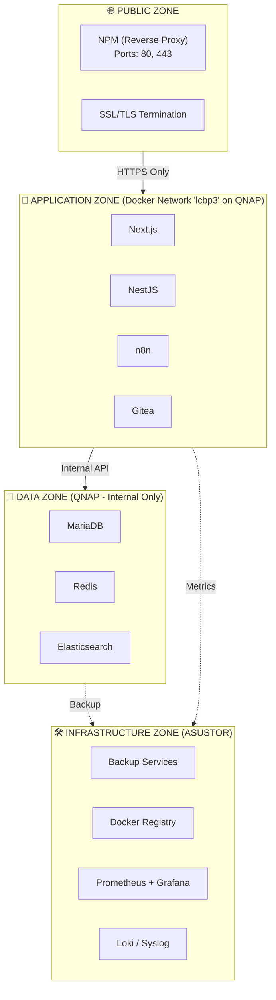
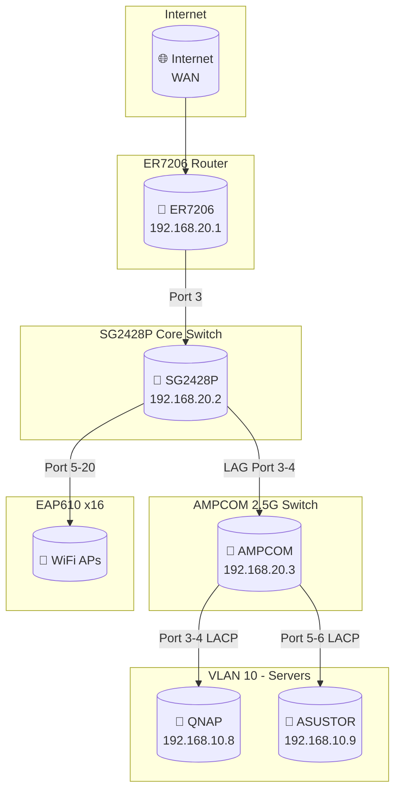

# 02.4 Network Design & Security (การออกแบบเครือข่ายและความปลอดภัย)

---

title: 'Network Design & Security'
version: 1.8.0
status: first-draft
owner: Nattanin Peancharoen
last_updated: 2026-02-23
related:
  - specs/02-Architecture/00-01-system-context.md
  - specs/02-Architecture/02-03-software-architecture.md

---

## 1. 🌐 Network Segmentation (VLANs) และหลักการ Zero Trust

ระบบ LCBP3-DMS จัดแบ่งเครือข่ายออกเป็นเครือข่ายย่อย (VLANs) เพื่อการควบคุมการเข้าถึง (Access Control) ตามหลักการ Zero Trust โดยใช้อุปกรณ์ Network ของ Omada (ER7206 Router & SG2428P Core Switch) และ Switch ต่างๆ ในเครือข่าย

| VLAN ID | Name           | Purpose                 | Subnet          | Gateway      | Notes                                                |
| ------- | -------------- | ----------------------- | --------------- | ------------ | ---------------------------------------------------- |
| 10      | SERVER         | Server & Storage        | 192.168.10.0/24 | 192.168.10.1 | Servers (QNAP, ASUSTOR). Static IPs ONLY.            |
| 20      | MGMT (Default) | Management & Admin      | 192.168.20.0/24 | 192.168.20.1 | Network devices (ER7206, OC200, Switches), Admin PC. |
| 30      | USER           | User Devices            | 192.168.30.0/24 | 192.168.30.1 | Staff PC, Notebooks, Wi-Fi.                          |
| 40      | CCTV           | Surveillance            | 192.168.40.0/24 | 192.168.40.1 | Cameras, NVR. Isolated.                              |
| 50      | VOICE          | IP Phones               | 192.168.50.0/24 | 192.168.50.1 | SIP traffic. Isolated.                               |
| 60      | DMZ            | Public Services         | 192.168.60.0/24 | 192.168.60.1 | DMZ. Isolated from Internal.                         |
| 70      | GUEST          | Guest Wi-Fi (Untrusted) | 192.168.70.0/24 | 192.168.70.1 | Guest Wi-Fi. Isolated Internet Access only.          |

## 2. 🔐 Security Zones และสิทธิการเข้าถึงของ Container

### 2.1 กฎเหล็ก: การเข้าถึงระบบฐานข้อมูล (Database Access Restriction)
> [!CAUTION]
> **MariaDB และ Redis ตั้งอยู่ใน DATA ZONE ภายใต้ Docker Network ภายในชื่อ `lcbp3` เท่านั้น**
- **ห้าม Expose Port ออกสู่ Host โดยตรง:** `mariadb:3306` และ `redis:6379` จะต้องไม่ถูกเปิดสิทธิออกสู่ภายนอก Container Station
- **การเข้าถึงจากระบบอื่น:** เฉพาะ Service ใน **APPLICATION ZONE** (เช่น NestJS Backend) และ Service อื่นบน Network `lcbp3` เท่านั้นที่จะสามารถเรียกใช้งาน Database ได้
- **การจัดการโดย Admin:** หากผู้ดูแลระบบต้องการเข้าไปจัดการฐานข้อมูล จะต้องใช้งานผ่าน **phpMyAdmin** (`pma.np-dms.work`) ซึ่งถูกจำกัดสิทธิเข้าถึงผ่าน Nginx Proxy Manager อีกชั้น หรือผ่าน SSH Tunnel เข้าสู่เซิร์ฟเวอร์เท่านั้น

## 3. 🗺️ Network Topology & Switch Profiles

### 3.1 Switch Profiles & Interfaces
- **01_CORE_TRUNK:** Router & switch uplinks (Native: 20, Tagged: All)
- **02_MGMT_ONLY:** Management only (Native: 20, Untagged: 20)
- **03_SERVER_ACCESS:** QNAP / ASUSTOR (Native: 10, Untagged: 10)
- **04_CCTV_ACCESS:** CCTV cameras (Native: 40, Untagged: 40)
- **05_USER_ACCESS:** PC / Printer (Native: 30, Untagged: 30)
- **06_AP_TRUNK:** EAP610 Access Points (Native: 20, Tagged: 30, 70)
- **07_VOICE_ACCESS:** IP Phones (Native: 30, Tagged: 50, Untagged: 30)

### 3.2 NAS NIC Bonding Configuration
| Device  | Bonding Mode        | Member Ports | VLAN Mode | Tagged VLAN | IP Address      | Gateway      | Notes                  |
| ------- | ------------------- | ------------ | --------- | ----------- | --------------- | ------------ | ---------------------- |
| QNAP    | IEEE 802.3ad (LACP) | Adapter 1, 2 | Untagged  | 10 (SERVER) | 192.168.10.8/24 | 192.168.10.1 | Primary NAS for DMS    |
| ASUSTOR | IEEE 802.3ad (LACP) | Port 1, 2    | Untagged  | 10 (SERVER) | 192.168.10.9/24 | 192.168.10.1 | Backup / Secondary NAS |

## 4. 🔥 Firewall Rules (ACLs) & Port Forwarding

กฎของ Firewall จะถูกกำหนดบน Omada Controller และอุปกรณ์ Gateway (ER7206) ตามหลักการอนุญาตแค่สิ่งที่ต้องการ (Default Deny)

### 4.1 IP Groups & Port Groups (อ้างอิงบ่อย)
**IP Groups:**
- `Server`: 192.168.10.8, 192.168.10.9, 192.168.10.111
- `Omada-Controller`: 192.168.20.250
- `DHCP-Gateways`: 192.168.30.1, 192.168.70.1
- `QNAP_Services`: 192.168.10.8
- `Internal`: 192.168.10.0/24, 192.168.20.0/24, 192.168.30.0/24
- `Blacklist`: (เพิ่ม IP ประสงค์ร้าย)

**Port Groups:**
- `Web`: TCP 443, 8443, 80, 81, 2222
- `Omada-Auth`: TCP 443, 8043, 8088, 8843, 29810-29814
- `VoIP`: UDP 5060, 5061, 10000-20000 (SIP + RTP)
- `DHCP`: UDP 67, 68

### 4.2 Switch ACL (สำหรับ Omada OC200)
> ⚠️ **ลำดับความสำคัญ (Priority Level):** (1) Allow rules (DHCP, Auth) -> (2) Isolate/Deny rules -> (3) Allow specific services -> (4) Default Deny

| ลำดับ  | Name                      | Policy | Source            | Destination                   | Ports                                     |
| :--- | :------------------------ | :----- | :---------------- | :---------------------------- | :---------------------------------------- |
| 1    | 01 Allow-User-DHCP        | Allow  | Network → VLAN 30 | IP → 192.168.30.1             | Port Group → DHCP                         |
| 2    | 02 Allow-Guest-DHCP       | Allow  | Network → VLAN 70 | IP → 192.168.70.1             | Port Group → DHCP                         |
| 3    | 03 Allow-WiFi-Auth        | Allow  | Network → VLAN 30 | IP Group → Omada-Controller   | Port Group → Omada-Auth                   |
| 4    | 04 Allow-Guest-WiFi-Auth  | Allow  | Network → VLAN 70 | IP Group → Omada-Controller   | Port Group → Omada-Auth                   |
| 5    | 05 Isolate-Guests         | Deny   | Network → VLAN 70 | Network → VLAN 10, 20, 30, 60 | All                                       |
| 6    | 06 Isolate-Servers        | Deny   | Network → VLAN 10 | Network → VLAN 30 (USER)      | All                                       |
| 7    | 07 Block-User-to-Mgmt     | Deny   | Network → VLAN 30 | Network → VLAN 20 (MGMT)      | All                                       |
| 8    | 08 Allow-User-to-Services | Allow  | Network → VLAN 30 | IP → QNAP (192.168.10.8)      | Port Group → Web (443,8443, 80, 81, 2222) |
| 9    | 09 Allow-Voice-to-User    | Allow  | Network → VLAN 50 | Network → VLAN 30,50          | All                                       |
| 10   | 10 Allow-MGMT-to-All      | Allow  | Network → VLAN 20 | Any                           | All                                       |
| 11   | 11 Allow-Server-Internal  | Allow  | IP Group : Server | IP Group : Server             | All                                       |
| 12   | 12 Allow-Server → CCTV    | Allow  | IP Group : Server | Network → VLAN 40 (CCTV)      | All                                       |
| 13   | 100 (Default)             | Deny   | Any               | Any                           | All                                       |

### 4.3 Gateway ACL (สำหรับ ER7206)
| ลำดับ  | Name                    | Policy | Direction | PROTOCOLS | Source               | Destination                  |
| :--- | :---------------------- | :----- | :-------- | :-------- | :------------------- | :--------------------------- |
| 1    | 01 Blacklist            | Deny   | [WAN2] IN | All       | IP Group:Blacklist   | IP Group:Internal            |
| 2    | 02 Geo                  | Permit | [WAN2] IN | All       | Location Group:Allow | IP Group:Internal            |
| 3    | 03 Allow-Voice-Internet | Permit | LAN->WAN  | UDP       | Network → VLAN 50    | Any                          |
| 4    | 04 Internal → Internet  | Permit | LAN->WAN  | All       | IP Group:Internal    | Domain Group:DomainGroup_Any |

### 4.4 Port Forwarding
Traffic สาธารณะ (WAN) จะถูกเชื่อมต่อไปยัง Nginx Proxy Manager เพียงจุดเดียว
- **Allow-NPM-HTTPS:** External Port 443 -> QNAP (192.168.10.8) Port 443 (TCP)
- **Allow-NPM-HTTP (สำหรับ Let's Encrypt):** External Port 80 -> QNAP (192.168.10.8) Port 80 (TCP)

## 5. 📡 EAP ACL (Wireless Data Flow Rules)

ตั้งค่าสำหรับ Access Points ให้ป้องกันการ Broadcast ลดทอนกันเอง หรือรบกวนโซนอื่นๆ
* **SSID: PSLCBP3 (Staff WiFi) - VLAN 30**
  - อนุญาต DNS, 192.168.10.0/24 (Servers), Printer, Internet
  - **บล็อค** การเข้าสู่ 192.168.20.0/24 (MGMT), 192.168.40.0/24 (CCTV), และ **Client Isolation (Client-2-Client Deny)**

* **SSID: GUEST (Guest WiFi) - VLAN 70**
  - อนุญาต DNS, Internet (HTTP/HTTPS)
  - **บล็อคเครือข่ายส่วนตัวทั้งหมด (RFC1918):** 10.0.0.0/8, 172.16.0.0/12, 192.168.0.0/16 และสั่ง **Client Isolation**
