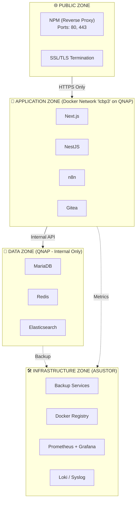
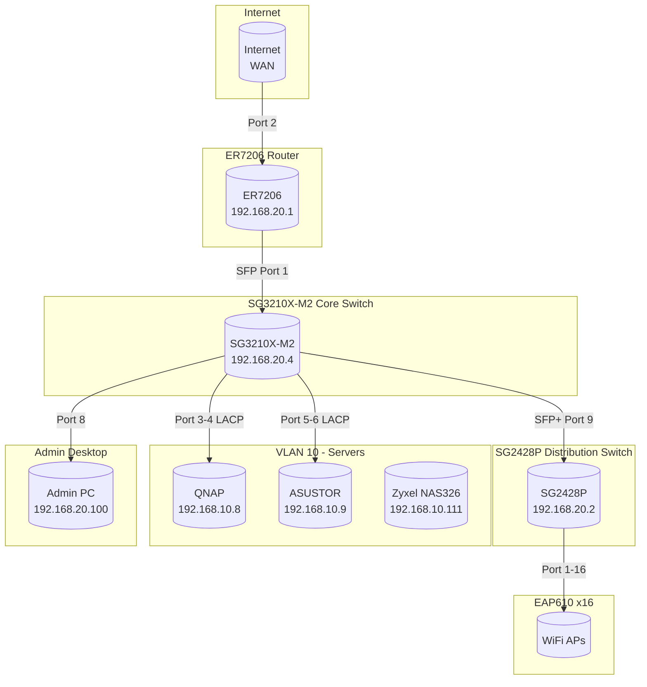

# 02.4 Network Design & Security (การออกแบบเครือข่ายและความปลอดภัย)

---

title: 'Network Design & Security'
version: 1.8.2
status: first-draft
owner: Nattanin Peancharoen
last_updated: 2026-04-23
related:

- specs/02-Architecture/00-01-system-context.md
- specs/02-Architecture/02-03-software-architecture.md

---

## 1. 🌐 Network Segmentation (VLANs) และหลักการ Zero Trust

ระบบ LCBP3-DMS จัดแบ่งเครือข่ายออกเป็นเครือข่ายย่อย (VLANs) เพื่อการควบคุมการเข้าถึง (Access Control) ตามหลักการ Zero Trust โดยใช้อุปกรณ์ Network ของ Omada (ER7206 Router & SG3210X-M2 Core Switch) และ Switch ต่างๆ ในเครือข่าย

| VLAN ID | Name           | Purpose                 | Subnet          | Gateway      | Notes                                                |
| ------- | -------------- | ----------------------- | --------------- | ------------ | ---------------------------------------------------- |
| 10      | SERVER         | Server & Storage        | 192.168.10.0/24 | 192.168.10.1 | Servers (QNAP, ASUSTOR, Zyxel NAS326). Static IPs ONLY. |
| 20      | MGMT (Default) | Management & Admin      | 192.168.20.0/24 | 192.168.20.1 | Network devices (ER7206, OC200, Switches), Admin PC. |
| 30      | USER           | User Devices            | 192.168.30.0/24 | 192.168.30.1 | Staff PC, Notebooks, Wi-Fi.                          |
| 40      | CCTV           | Surveillance            | 192.168.40.0/24 | 192.168.40.1 | Cameras, NVR. Isolated.                              |
| 50      | VOICE          | IP Phones               | 192.168.50.0/24 | 192.168.50.1 | SIP traffic. Isolated.                               |
| 60      | DMZ            | Public Services         | 192.168.60.0/24 | 192.168.60.1 | DMZ. Isolated from Internal.                         |
| 70      | GUEST          | Guest Wi-Fi (Untrusted) | 192.168.70.0/24 | 192.168.70.1 | Guest Wi-Fi. Isolated Internet Access only.          |

## 2. 🔐 Security Zones และสิทธิการเข้าถึงของ Container

```mermaid
flowchart TB
    subgraph PublicZone["🌐 PUBLIC ZONE"]
        direction LR
        NPM["NPM (Reverse Proxy)<br/>Ports: 80, 443"]
        SSL["SSL/TLS Termination"]
    end

    subgraph AppZone["📱 APPLICATION ZONE (Docker Network 'lcbp3' on QNAP)"]
        direction LR
        Frontend["Next.js"]
        Backend["NestJS"]
        N8N["n8n"]
        Gitea["Gitea"]
    end

    subgraph DataZone["💾 DATA ZONE (QNAP - Internal Only)"]
        direction LR
        MariaDB["MariaDB"]
        Redis["Redis"]
        ES["Elasticsearch"]
    end

    subgraph InfraZone["🛠️ INFRASTRUCTURE ZONE (ASUSTOR)"]
        direction LR
        Backup["Backup Services"]
        Registry["Docker Registry"]
        Monitoring["Prometheus + Grafana"]
        Logs["Loki / Syslog"]
    end

    PublicZone -->|HTTPS Only| AppZone
    AppZone -->|Internal API| DataZone
    DataZone -.->|Backup| InfraZone
    AppZone -.->|Metrics| InfraZone
```

### 2.1 กฎเหล็ก: การเข้าถึงระบบฐานข้อมูล (Database Access Restriction)

> [!CAUTION]
> **MariaDB และ Redis ตั้งอยู่ใน DATA ZONE ภายใต้ Docker Network ภายในชื่อ `lcbp3` เท่านั้น**

- **ห้าม Expose Port ออกสู่ Host โดยตรง:** `mariadb:3306` และ `redis:6379` จะต้องไม่ถูกเปิดสิทธิออกสู่ภายนอก Container Station
- **การเข้าถึงจากระบบอื่น:** เฉพาะ Service ใน **APPLICATION ZONE** (เช่น NestJS Backend) และ Service อื่นบน Network `lcbp3` เท่านั้นที่จะสามารถเรียกใช้งาน Database ได้
- **การจัดการโดย Admin:** หากผู้ดูแลระบบต้องการเข้าไปจัดการฐานข้อมูล จะต้องใช้งานผ่าน **phpMyAdmin** (`pma.np-dms.work`) ซึ่งถูกจำกัดสิทธิเข้าถึงผ่าน Nginx Proxy Manager อีกชั้น หรือผ่าน SSH Tunnel เข้าสู่เซิร์ฟเวอร์เท่านั้น

## 3. 🗺️ Network Topology & Switch Profiles

```mermaid
graph TB
    subgraph Internet
        WAN[("Internet<br/>WAN")]
    end

    subgraph Router["ER7206 Router"]
        R[("ER7206<br/>192.168.20.1")]
    end

    subgraph CoreSwitch["SG3210X-M2 Core Switch"]
        CS[("SG3210X-M2<br/>192.168.20.4")]
    end

    subgraph DistSwitch["SG2428P Distribution Switch"]
        DS[("SG2428P<br/>192.168.20.2")]
    end

    subgraph Servers["VLAN 10 - Servers"]
        QNAP[(" QNAP<br/>192.168.10.8")]
        ASUSTOR[(" ASUSTOR<br/>192.168.10.9")]
        Zyxel[(" Zyxel NAS326<br/>192.168.10.111")]
    end

    subgraph AccessPoints["EAP610 x16"]
        AP[(" WiFi APs")]
    end

    subgraph AdminPC["Admin Desktop"]
        PC[(" Admin PC<br/>192.168.20.100")]
    end

    WAN -->|Port 2| R
    R -->|SFP Port 1| CS
    CS -->|SFP+ Port 9| DS
    CS -->|Port 3-4 LACP| QNAP
    CS -->|Port 5-6 LACP| ASUSTOR
    CS -->|Port 8| PC
    DS -->|Port 1-16| AP
```

### 3.1 Switch Profiles & Interfaces

- **01_CORE_TRUNK:** Router & switch uplinks (Native: 20, Tagged: All)
- **02_MGMT_ONLY:** Management only (Native: 20, Untagged: 20)
- **03_SERVER_ACCESS:** QNAP / ASUSTOR (Native: 10, Untagged: 10)
- **04_CCTV_ACCESS:** CCTV cameras (Native: 40, Untagged: 40)
- **05_USER_ACCESS:** PC / Printer (Native: 30, Untagged: 30)
- **06_AP_TRUNK:** EAP610 Access Points (Native: 20, Tagged: 30, 70)
- **07_VOICE_ACCESS:** IP Phones (Native: 30, Tagged: 50, Untagged: 30)

### 3.2 Detailed Port Configuration

#### 3.2.1 TP-Link ER7206 (Router)
- **1× Gigabit SFP WAN/LAN port + 5× Gigabit RJ45 ports (1× WAN, 4× WAN/LAN)**
  - SFP Port 1 WAN/LAN -> SG3210X-M2 Port 10 SFP+
  - Port 2 WAN port uplink Internet

#### 3.2.2 TP-Link SG3210X-M2 (Core Switch)
- **8-Port 2.5Gbps + 2-Port 10G SFP+ Slots**
  - Port 1&2 (Active LACP) -> Reserved
  - Port 3&4 (Active LACP) -> QNAP 192.168.10.8
  - Port 5&6 (Active LACP) -> ASUSTOR 192.168.10.9
  - Port 7 Reserved
  - Port 8 -> Admin Desktop (192.168.20.100)
  - SFP+ Port 9 -> SG2428P (192.168.20.2) Port 28
  - SFP+ Port 10 uplink ER7206 (192.168.20.1) Port 1

#### 3.2.3 TP-Link SG2428P (Distribution Switch)
- **24× 10/100/1000 Mbps RJ45 Ports + 4× Gigabit SFP Slots**
  - Port 1-16 -> EAP610 (16  Access Points)
  - Port 17 Reserved for TP-07 (LAN port)
  - Port 18 TP-08 (LAN port)
  - Port 19 -> TL-SG1210P Port 9 (Voice Switch)
  - Port 20 Reserved
  - Port 21 TP-11 (LAN port)
  - Port 22 Reserved
  - Port 23 -> Printer
  - Port 24 uplink OC200
  - SFP Port 25 Reserved
  - SFP Port 26 -> TL-SL1226P SFP
  - SFP Port 27 Reserved
  - SFP Port 28 uplink SG3210X-M2 SFP+

#### 3.2.4 TP-Link TL-SL1226P (CCTV Switch)
- **24× PoE+ 10/100 Mbps RJ45 ports, 2× Gigabit RJ45 ports, and 2× combo Gigabit SFP**
  - Port 1-6 -> CCTV (6 cameras)
  - 1000 Mbps Port 25 -> NVR
  - SFP Port 26 uplink SG2428P Port 26

#### 3.2.5 TP-Link TL-SG1210P (Voice Switch)
- **9 Port 10/100/1000Mbps RJ45 ports, 1 Gigabit SFP port**
  - Port 1-8 -> IP Phone (TP-01 to TP-06, TP-09, TP-10)
  - Port 9 uplink SG2428P Port 19
  - SFP Port 10 Reserved

### 3.3 VLAN Assignment Table

#### 3.3.1 SG3210X-M2 (Core Switch)

| Port | Connection | VLAN Mode | Native VLAN | Tagged VLANs | Profile |
|------|------------|-----------|-------------|--------------|---------|
| 1-2 | Reserved (LACP) | Trunk | 20 | 10,20,30,40,50,60,70 | 01_CORE_TRUNK |
| 3-4 | QNAP (LACP) | Access | 10 | - | 03_SERVER_ACCESS |
| 5-6 | ASUSTOR (LACP) | Access | 10 | - | 03_SERVER_ACCESS |
| 7 | Reserved | - | - | - | - |
| 8 | Admin Desktop | Access | 20 | - | 02_MGMT_ONLY |
| 9 (SFP+) | SG2428P | Trunk | 20 | 10,20,30,40,50,70 | 01_CORE_TRUNK |
| 10 (SFP+) | ER7206 | Trunk | 20 | 10,20,30,40,50,70 | 01_CORE_TRUNK |

#### 3.3.2 SG2428P (Distribution Switch)

| Port | Connection | VLAN Mode | Native VLAN | Tagged VLANs | Profile |
|------|------------|-----------|-------------|--------------|---------|
| 1-16 | EAP610 APs | Trunk | 20 | 30,70 | 06_AP_TRUNK |
| 17 | TP-07 (LAN) | Access | 30 | - | 05_USER_ACCESS |
| 18 | TP-08 (LAN) | Access | 30 | - | 05_USER_ACCESS |
| 19 | TL-SG1210P | Trunk | 30 | 50 | 07_VOICE_ACCESS |
| 20 | Reserved | - | - | - | - |
| 21 | TP-11 (LAN) | Access | 30 | - | 05_USER_ACCESS |
| 22 | Reserved | - | - | - | - |
| 23 | Printer | Access | 30 | - | 05_USER_ACCESS |
| 24 | OC200 | Access | 20 | - | 02_MGMT_ONLY |
| 25 (SFP) | Reserved | - | - | - | - |
| 26 (SFP) | TL-SL1226P | Trunk | 20 | 40 | 04_CCTV_ACCESS |
| 27 (SFP) | Reserved | - | - | - | - |
| 28 (SFP) | SG3210X-M2 | Trunk | 20 | 10,20,30,40,50,70 | 01_CORE_TRUNK |

#### 3.3.3 TL-SL1226P (CCTV Switch)

| Port | Connection | VLAN Mode | Native VLAN | Tagged VLANs | Profile |
|------|------------|-----------|-------------|--------------|---------|
| 1-6 | CCTV Cameras | Access | 40 | - | 04_CCTV_ACCESS |
| 7-24 | Reserved | - | - | - | - |
| 25 | NVR | Access | 40 | - | 04_CCTV_ACCESS |
| 26 | SG2428P | Trunk | 20 | 40 | 04_CCTV_ACCESS |

#### 3.3.4 TL-SG1210P (Voice Switch)

| Port | Connection | VLAN Mode | Native VLAN | Tagged VLANs | Profile |
|------|------------|-----------|-------------|--------------|---------|
| 1-8 | IP Phone + PC Passthrough | Trunk | 30 (Data) | 50 (Voice) | 07_VOICE_ACCESS |
| 9 | SG2428P | Trunk | 30 | 50 | 07_VOICE_ACCESS |
| 10 (SFP) | Reserved | - | - | - | - |

**Note:** IP Phone ports support PC passthrough - Native VLAN 30 for PC data, Tagged VLAN 50 for VoIP traffic.

### 3.4 NAS NIC Bonding Configuration

| Device  | Bonding Mode        | Member Ports | VLAN Mode | Tagged VLAN | IP Address      | Gateway      | Notes                  |
| ------- | ------------------- | ------------ | --------- | ----------- | --------------- | ------------ | ---------------------- |
| QNAP    | IEEE 802.3ad (LACP) | Adapter 1, 2 | Untagged  | 10 (SERVER) | 192.168.10.8/24 | 192.168.10.1 | Primary NAS for DMS    |
| ASUSTOR | IEEE 802.3ad (LACP) | Port 1, 2    | Untagged  | 10 (SERVER) | 192.168.10.9/24 | 192.168.10.1 | Backup / Secondary NAS |

### 3.5 PoE Budget & Power Consumption

#### 3.5.1 SG2428P (Distribution Switch)

| Specification | Value |
|---------------|-------|
| Total PoE Budget | 370W |
| PoE Standard | IEEE 802.3at (PoE+) |
| PoE Ports | 1-16 (RJ45), 25-26 (SFP) |

**Power Consumption Estimate:**

| Device | Quantity | Power per Device | Total Power | Port Assignment |
|--------|----------|-----------------|-------------|----------------|
| EAP610 Access Point | 16 | ~12.95W | ~207W | Port 1-16 |
| TL-SL1226P Uplink | 1 | ~15W | ~15W | Port 26 (SFP) |
| **Total Used** | - | - | **~222W** | - |
| **Available** | - | - | **148W** | - |
| **Utilization** | - | - | **60%** | - |

#### 3.5.2 TL-SL1226P (CCTV Switch)

| Specification | Value |
|---------------|-------|
| Total PoE Budget | 195W |
| PoE Standard | IEEE 802.3at (PoE+) |
| PoE Ports | 1-24 (RJ45) |

**Power Consumption Estimate:**

| Device | Quantity | Power per Device | Total Power | Port Assignment |
|--------|----------|-----------------|-------------|----------------|
| CCTV Camera | 6 | ~8W | ~48W | Port 1-6 |
| NVR (Non-PoE) | 1 | 0W | 0W | Port 25 (1000Mbps) |
| **Total Used** | - | - | **48W** | - |
| **Available** | - | - | **147W** | - |
| **Utilization** | - | - | **25%** | - |

> [!NOTE]
> PoE budget has sufficient headroom for future expansion. SG2428P can support additional ~12 APs, TL-SL1226P can support additional ~12 cameras.

### 3.6 Cable Specifications

| Link Type | Cable Category | Max Distance | Application |
|-----------|----------------|--------------|-------------|
| 10Gbps Uplinks (SFP+) | Cat6a / Cat7 | 100m | SG3210X-M2 ↔ SG2428P, ER7206 ↔ SG3210X-M2 |
| 2.5Gbps Server Links | Cat6 | 100m | SG3210X-M2 ↔ QNAP/ASUSTOR (LACP) |
| 1Gbps Standard Links | Cat5e / Cat6 | 100m | All other RJ45 connections |
| IP Phone Passthrough | Cat5e / Cat6 | 100m | IP Phone + PC connections |

**Cable Color Coding:**
- **Blue:** Uplink/Trunk links (SFP+, LACP)
- **Green:** Server connections (VLAN 10)
- **Yellow:** Management connections (VLAN 20)
- **Red:** CCTV/Voice connections (VLAN 40, 50)
- **Orange:** User connections (VLAN 30)

### 3.7 QoS (Quality of Service) Settings

#### 3.7.1 Priority Levels (DSCP)

| Priority | DSCP Value | Traffic Type | Application |
|----------|------------|--------------|-------------|
| Highest (7) | EF (46) | Voice (SIP/RTP) | IP Phones (VLAN 50) |
| High (6) | AF41 (34) | Video Surveillance | CCTV Cameras (VLAN 40) |
| Medium (5) | AF31 (26) | Critical Applications | DMS Backend, Database |
| Low (4) | AF21 (18) | Best Effort | Web browsing, Email |
| Lowest (0) | CS0 (0) | Background | File downloads, Updates |

#### 3.7.2 QoS Configuration per Switch

**SG3210X-M2 (Core Switch):**
- Enable QoS globally
- Trust DSCP on all trunk ports
- Prioritize Voice (VLAN 50) and Video (VLAN 40) traffic
- Rate limit Guest VLAN (70) to 10Mbps per client

**SG2428P (Distribution Switch):**
- Enable QoS globally
- Trust DSCP on uplink ports (SFP+ 28, RJ45 19)
- Map VLAN 50 to Queue 7 (Highest)
- Map VLAN 40 to Queue 6 (High)
- Map VLAN 10 to Queue 5 (Medium)

**TL-SL1226P (CCTV Switch):**
- Enable QoS globally
- Map all CCTV ports to Queue 6 (High)
- Ensure NVR traffic has priority

**TL-SG1210P (Voice Switch):**
- Enable QoS globally
- Map VLAN 50 to Queue 7 (Highest)
- Map VLAN 30 to Queue 4 (Low - for PC data)
- Enable LLDP-MED for IP Phone power negotiation

### 3.8 Redundancy Planning & Network Resilience

#### 3.8.1 Critical Links Redundancy

| Critical Path | Primary Link | Backup Link | Failover Time | Implementation Status |
|---------------|--------------|-------------|---------------|-----------------------|
| Internet Access | ER7206 WAN Port 2 | 4G/LTE Backup | < 30s | Planned (Q3 2026) |
| Core Switch Connectivity | SG3210X-M2 SFP+ Port 9-10 | SG3210X-M2 Port 1-2 (LACP) | < 1s | Ready (Ports Reserved) |
| Server Connectivity | QNAP LACP (Ports 3-4) | ASUSTOR LACP (Ports 5-6) | < 1s | Active |
| Distribution Layer | SG2428P SFP+ Port 28 | SG2428P Port 20 | < 5s | Planned |
| Controller Management | OC200 Port 24 | OC200 Wireless Fallback | < 10s | Active |

#### 3.8.2 Single Points of Failure (SPOF) Analysis

| Component | Risk Level | Mitigation Strategy | Target Resolution |
|-----------|------------|---------------------|-------------------|
| ER7206 Router | HIGH | Add secondary router (VRRP) | Q3 2026 |
| SG3210X-M2 Core Switch | MEDIUM | Utilize reserved LACP ports 1-2 | Immediate |
| QNAP Primary Storage | MEDIUM | ASUSTOR backup with real-time sync | Active |
| Internet Connection | HIGH | 4G/LTE failover router | Q3 2026 |
| Power Supply | MEDIUM | UPS + Generator maintenance | Ongoing |

#### 3.8.3 Network Monitoring & Alerting

| Monitor Item | Threshold | Alert Method | Escalation |
|--------------|-----------|--------------|------------|
| Link Utilization > 80% | 5 min | Email + Teams | Network Admin |
| Link Down | Immediate | SMS + Email | Network Admin |
| High Latency > 100ms | 2 min | Email | Network Admin |
| Packet Loss > 1% | 3 min | Email | Network Admin |
| VLAN Misconfiguration | Immediate | Email | Network Admin |

#### 3.8.4 Disaster Recovery Procedures

1. **Core Switch Failure:**
   - Activate LACP ports 1-2 on SG3210X-M2
   - Re-route critical traffic through backup paths
   - Restore within 15 minutes

2. **Router Failure:**
   - Manual failover to backup router
   - Update DHCP gateway addresses
   - Restore within 30 minutes

3. **Internet Outage:**
   - Activate 4G/LTE backup connection
   - Update DNS records if needed
   - Restore within 5 minutes

4. **Power Outage:**
   - UPS maintains critical infrastructure for 2 hours
   - Generator activates after 5 minutes
   - Full service maintained

## 4. 🔥 Firewall Rules (ACLs) & Port Forwarding

กฎของ Firewall จะถูกกำหนดบน Omada Controller และอุปกรณ์ Gateway (ER7206) ตามหลักการอนุญาตแค่สิ่งที่ต้องการ (Default Deny)

### 4.1 IP Groups & Port Groups (อ้างอิงบ่อย)

**IP Groups:**

- `Server`: 192.168.10.8 (QNAP), 192.168.10.9 (ASUSTOR), 192.168.10.111 (Zyxel NAS326)
- `Omada-Controller`: 192.168.20.250
- `DHCP-Gateways`: 192.168.30.1, 192.168.70.1
- `QNAP_Services`: 192.168.10.8
- `Internal`: 192.168.10.0/24, 192.168.20.0/24, 192.168.30.0/24, 192.168.40.0/24, 192.168.50.0/24
- `Blacklist`: (เพิ่ม IP ประสงค์ร้าย)

**Port Groups:**

- `Web`: TCP 443, 8443, 80, 81, 2222
- `Omada-Auth`: TCP 443, 8043, 8088, 8843, 29810-29814
- `VoIP`: UDP 5060, 5061, 10000-20000 (SIP + RTP)
- `DHCP`: UDP 67, 68

### 4.2 Switch ACL (สำหรับ Omada OC200)

> ⚠️ **ลำดับความสำคัญ (Priority Level):** (1) Allow rules (DHCP, Auth) -> (2) Isolate/Deny rules -> (3) Allow specific services -> (4) Default Deny

| ลำดับ | Name                      | Policy | Source            | Destination                   | Ports                                     |
| :---- | :------------------------ | :----- | :---------------- | :---------------------------- | :---------------------------------------- |
| 1     | 01 Allow-User-DHCP        | Allow  | Network → VLAN 30 | IP → 192.168.30.1             | Port Group → DHCP                         |
| 2     | 02 Allow-Guest-DHCP       | Allow  | Network → VLAN 70 | IP → 192.168.70.1             | Port Group → DHCP                         |
| 3     | 03 Allow-WiFi-Auth        | Allow  | Network → VLAN 30 | IP Group → Omada-Controller   | Port Group → Omada-Auth                   |
| 4     | 04 Allow-Guest-WiFi-Auth  | Allow  | Network → VLAN 70 | IP Group → Omada-Controller   | Port Group → Omada-Auth                   |
| 5     | 05 Isolate-Guests         | Deny   | Network → VLAN 70 | Network → VLAN 10, 20, 30, 60 | All                                       |
| 6     | 06 Isolate-Servers        | Deny   | Network → VLAN 10 | Network → VLAN 30 (USER)      | All                                       |
| 7     | 07 Block-User-to-Mgmt     | Deny   | Network → VLAN 30 | Network → VLAN 20 (MGMT)      | All                                       |
| 8     | 08 Allow-User-to-Services | Allow  | Network → VLAN 30 | IP → QNAP (192.168.10.8)      | Port Group → Web (443,8443, 80, 81, 2222) |
| 9     | 09 Allow-Voice-to-User    | Allow  | Network → VLAN 50 | Network → VLAN 30,50          | All                                       |
| 10    | 10 Allow-MGMT-to-All      | Allow  | Network → VLAN 20 | Any                           | All                                       |
| 11    | 11 Allow-Server-Internal  | Allow  | IP Group : Server | IP Group : Server             | All                                       |
| 12    | 12 Allow-Server → CCTV    | Allow  | IP Group : Server | Network → VLAN 40 (CCTV)      | All                                       |
| 13    | 100 (Default)             | Deny   | Any               | Any                           | All                                       |

### 4.3 Gateway ACL (สำหรับ ER7206)

| ลำดับ | Name                    | Policy | Direction | PROTOCOLS | Source               | Destination                  |
| :---- | :---------------------- | :----- | :-------- | :-------- | :------------------- | :--------------------------- |
| 1     | 01 Blacklist            | Deny   | [WAN2] IN | All       | IP Group:Blacklist   | IP Group:Internal            |
| 2     | 02 Geo                  | Permit | [WAN2] IN | All       | Location Group:Allow | IP Group:Internal            |
| 3     | 03 Allow-Voice-Internet | Permit | LAN->WAN  | UDP       | Network → VLAN 50    | Any                          |
| 4     | 04 Internal → Internet  | Permit | LAN->WAN  | All       | IP Group:Internal    | Domain Group:DomainGroup_Any |

### 4.4 Port Forwarding

Traffic สาธารณะ (WAN) จะถูกเชื่อมต่อไปยัง Nginx Proxy Manager เพียงจุดเดียว

- **Allow-NPM-HTTPS:** External Port 443 -> QNAP (192.168.10.8) Port 443 (TCP)
- **Allow-NPM-HTTP (สำหรับ Let's Encrypt):** External Port 80 -> QNAP (192.168.10.8) Port 80 (TCP)

## 5. 📡 EAP ACL (Wireless Data Flow Rules)

ตั้งค่าสำหรับ Access Points ให้ป้องกันการ Broadcast ลดทอนกันเอง หรือรบกวนโซนอื่นๆ

- **SSID: PSLCBP3 (Staff WiFi) - VLAN 30**
  - อนุญาต DNS, 192.168.10.0/24 (Servers), Printer, Internet
  - **บล็อค** การเข้าสู่ 192.168.20.0/24 (MGMT), 192.168.40.0/24 (CCTV), และ **Client Isolation (Client-2-Client Deny)**

- **SSID: GUEST (Guest WiFi) - VLAN 70**
  - อนุญาต DNS, Internet (HTTP/HTTPS)
  - **บล็อคเครือข่ายส่วนตัวทั้งหมด (RFC1918):** 10.0.0.0/8, 172.16.0.0/12, 192.168.0.0/16 และสั่ง **Client Isolation**
