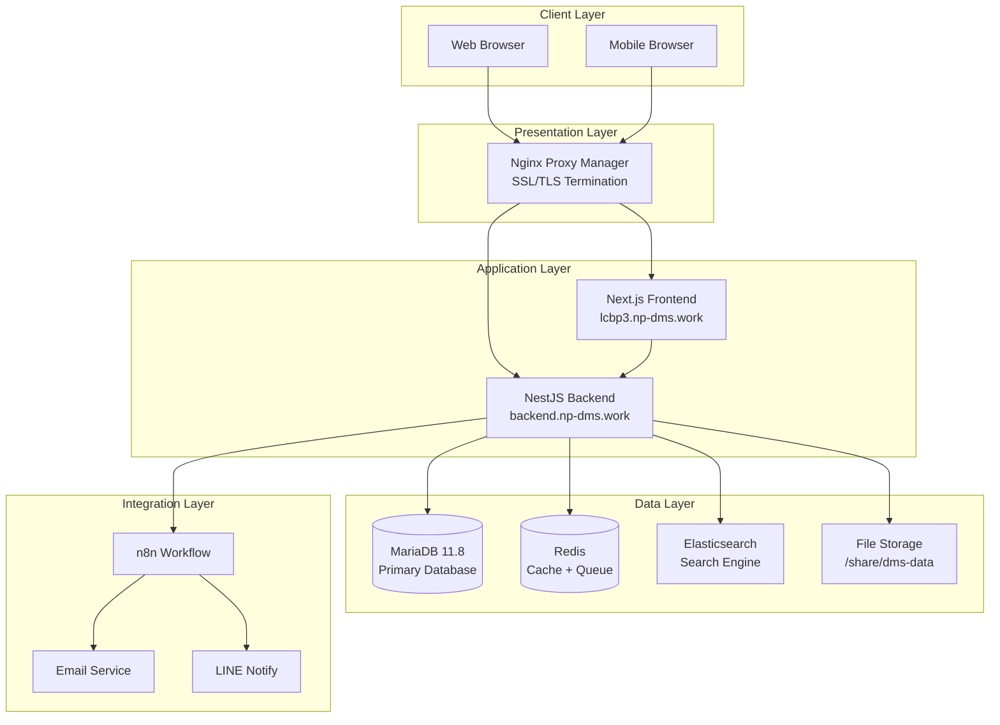
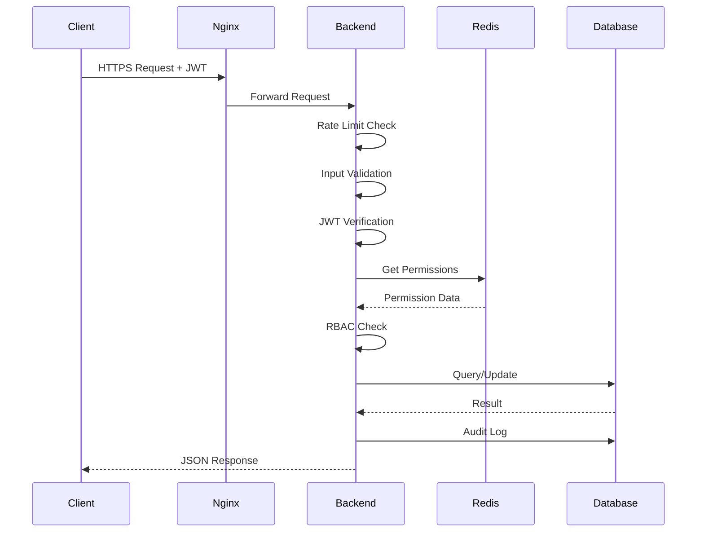

# 📋 Architecture Specification

> **สถาปัตยกรรมระบบ LCBP3-DMS**
>
> เอกสารชุดนี้อธิบายสถาปัตยกรรมทางเทคนิคของระบบ Document Management System สำหรับโครงการท่าเรือแหลมฉบังระยะที่ 3

---

## 📊 Document Status

| Attribute          | Value                            |
| ------------------ | -------------------------------- |
| **Version**        | 1.5.1                            |
| **Status**         | Active                           |
| **Last Updated**   | 2025-12-02                       |
| **Owner**          | Nattanin Peancharoen             |
| **Classification** | Internal Technical Documentation |

---

## 📚 Table of Contents

- [ภาพรวม](#-ภาพรวม-overview)
- [เอกสารสถาปัตยกรรม](#-เอกสารสถาปัตยกรรม)
- [หลักการออกแบบ](#-หลักการออกแบบ-architecture-principles)
- [Technology Stack](#-technology-stack)
- [Key Architectural Decisions](#-key-architectural-decisions)
- [Related Documents](#-related-documents)

---

## 🎯 ภาพรวม (Overview)

ระบบ LCBP3-DMS ใช้สถาปัตยกรรมแบบ **Headless/API-First** ที่แยก Frontend และ Backend เป็นอิสระ โดยเน้นที่:

### Core Principles

1. **Data Integrity First** - ความถูกต้องของข้อมูลเป็นสิ่งสำคัญที่สุด
2. **Security by Design** - ความปลอดภัยที่ทุกชั้น (Defense in Depth)
3. **Scalability** - รองรับการเติบโตในอนาคต
4. **Resilience** - ทนทานต่อความล้มเหลวและกู้คืนได้รวดเร็ว
5. **Observability** - ติดตามและวิเคราะห์สถานะระบบได้ง่าย

### Architecture Style

```
┌─────────────────────────────────────────┐
│   Headless/API-First Architecture       │
├─────────────────────────────────────────┤
│                                         │
│  ┌──────────┐         ┌──────────┐     │
│  │ Next.js  │ ◄─────► │  NestJS  │     │
│  │ Frontend │   API   │  Backend │     │
│  └──────────┘         └────┬─────┘     │
│                            │           │
│                       ┌────▼─────┐     │
│                       │ MariaDB  │     │
│                       │  + Redis │     │
│                       └──────────┘     │
└─────────────────────────────────────────┘
```

---

## 📖 เอกสารสถาปัตยกรรม

### 1. [System Architecture](./system-architecture.md)

**สถาปัตยกรรมระบบโดยรวม**

- Infrastructure & Deployment (QNAP Server)
- Network Architecture
- Core Services (Frontend, Backend, Database, Cache, Search)
- Backend Module Architecture (13 modules)
- Data Flow Architecture
- Security Architecture (6 layers)
- Performance & Scalability
- Resilience & Error Handling
- Monitoring & Observability

**Key Topics:**

- ✅ Modular Design (Domain-Driven)
- ✅ Two-Phase File Storage
- ✅ Document Numbering (Double-Lock Mechanism)
- ✅ Unified Workflow Engine
- ✅ 4-Level RBAC
- ✅ Caching Strategy
- ✅ Rate Limiting

### 2. [API Design](./api-design.md)

**การออกแบบ API แบบ RESTful**

- API Design Principles (API-First Approach)
- Authentication & Authorization (JWT + RBAC)
- API Conventions (HTTP Methods, Status Codes)
- Idempotency Implementation
- Pagination, Filtering & Sorting
- Security Features (Rate Limiting, Input Validation)
- Core Module APIs (Correspondence, RFA, Drawing, etc.)
- Performance Optimization
- API Versioning Strategy

**Key Topics:**

- ✅ RESTful Best Practices
- ✅ Idempotency-Key Header
- ✅ Consistent Response Format
- ✅ Comprehensive Error Handling
- ✅ Rate Limiting per Role
- ✅ File Upload Security

### 3. [Data Model](./data-model.md)

**โครงสร้างฐานข้อมูลและ Entity Relationships**

> [!NOTE]
> เอกสารนี้อยู่ระหว่างการพัฒนา กรุณาอ้างอิง [Data Dictionary](../../docs/4_Data_Dictionary_V1_4_5.md) สำหรับข้อมูลละเอียด

**Expected Content:**

- Entity Relationship Diagrams (ERD)
- Database Schema Design
- Table Relationships
- Indexing Strategy
- JSON Schema Management
- Virtual Columns for Performance
- Partitioning Strategy

---

## 🏗️ หลักการออกแบบ (Architecture Principles)

### 1. Separation of Concerns

```
Frontend (Next.js)     Backend (NestJS)      Database (MariaDB)
      │                      │                      │
      ├─ UI/UX              ├─ Business Logic      ├─ Data Storage
      ├─ Client State       ├─ API Endpoints       ├─ Transactions
      ├─ Validation         ├─ Authorization       ├─ Constraints
      └─ User Interaction   └─ Data Processing     └─ Relationships
```

### 2. Modular Architecture

**Backend Modules (Domain-Driven):**

```
Core Modules:
├── CommonModule (Shared Services)
├── AuthModule (JWT & Guards)
└── UserModule (User Management)

Business Modules:
├── ProjectModule (Projects & Contracts)
├── CorrespondenceModule (Correspondences)
├── RfaModule (RFA Management)
├── DrawingModule (Shop & Contract Drawings)
├── CirculationModule (Circulation Sheets)
└── TransmittalModule (Transmittals)

Supporting Modules:
├── WorkflowEngineModule (Unified Workflow)
├── DocumentNumberingModule (Auto Numbering)
├── SearchModule (Elasticsearch)
├── MasterModule (Master Data)
└── JsonSchemaModule (JSON Validation)
```

### 3. Security Layers

```
Layer 1: Network Security (SSL/TLS, Firewall)
Layer 2: Application Security (Rate Limiting, CSRF, XSS)
Layer 3: Authentication (JWT Tokens)
Layer 4: Authorization (4-Level RBAC)
Layer 5: Data Security (Encryption, Audit Logs)
Layer 6: File Security (Virus Scanning, Access Control)
```

### 4. Data Integrity Mechanisms

- **Two-Phase File Storage** - ป้องกัน Orphan Files
- **Double-Lock Document Numbering** - ป้องกัน Race Condition
- **Optimistic Locking** - Version Column สำหรับ Concurrent Updates
- **Transaction Management** - ACID Compliance
- **Idempotency** - ป้องกันการทำรายการซ้ำ

---

## 🛠️ Technology Stack

### Frontend Stack

| Component            | Technology                       | Purpose                      |
| -------------------- | -------------------------------- | ---------------------------- |
| **Framework**        | Next.js 14+ (App Router)         | React Framework with SSR     |
| **Language**         | TypeScript (ESM)                 | Type-safe JavaScript         |
| **Styling**          | Tailwind CSS + PostCSS           | Utility-first CSS            |
| **Components**       | shadcn/ui                        | Accessible Component Library |
| **State Management** | TanStack Query + React Hook Form | Server State + Form State    |
| **Validation**       | Zod                              | Schema Validation            |
| **Testing**          | Vitest + Playwright              | Unit + E2E Testing           |

### Backend Stack

| Component          | Technology       | Purpose                      |
| ------------------ | ---------------- | ---------------------------- |
| **Framework**      | NestJS (Node.js) | Enterprise Node.js Framework |
| **Language**       | TypeScript (ESM) | Type-safe JavaScript         |
| **ORM**            | TypeORM          | Object-Relational Mapping    |
| **Authentication** | JWT + Passport   | Token-based Auth             |
| **Authorization**  | CASL             | Permission Management        |
| **Validation**     | class-validator  | DTO Validation               |
| **Queue**          | BullMQ (Redis)   | Background Jobs              |
| **Documentation**  | Swagger/OpenAPI  | API Documentation            |
| **Testing**        | Jest + Supertest | Unit + Integration Testing   |

### Infrastructure Stack

| Component            | Technology              | Purpose                 |
| -------------------- | ----------------------- | ----------------------- |
| **Server**           | QNAP TS-473A            | Physical Server         |
| **Containerization** | Docker + Docker Compose | Container Orchestration |
| **Reverse Proxy**    | Nginx Proxy Manager     | SSL/TLS + Routing       |
| **Database**         | MariaDB 11.8            | Relational Database     |
| **Cache**            | Redis 7.x               | Caching + Locking       |
| **Search**           | Elasticsearch           | Full-text Search        |
| **Version Control**  | Gitea                   | Self-hosted Git         |
| **Workflow**         | n8n                     | Workflow Automation     |

---

## 🎯 Key Architectural Decisions

### ADR-001: Unified Workflow Engine

**Decision:** ใช้ Workflow Engine กลางเดียวสำหรับทุกประเภทเอกสาร

**Rationale:**

- ลดความซ้ำซ้อนของ Code
- ง่ายต่อการบำรุงรักษา
- รองรับการเปลี่ยนแปลง Workflow ได้ยืดหยุ่น

**Implementation:**

- DSL-Based Configuration (JSON)
- Workflow Versioning
- Polymorphic Entity Relationships

**Related:** [ADR-001](../05-decisions/ADR-001-unified-workflow-engine.md)

### ADR-002: Document Numbering Strategy

**Decision:** ใช้ Application-Level Locking แทน Database Stored Procedure

**Rationale:**

- ยืดหยุ่นกว่า (Template-Based Generator)
- ง่ายต่อการ Debug และ Monitoring
- รองรับ Complex Numbering Rules
- Support ทุกประเภทเอกสาร (LETTER, RFA, TRANSMITTAL, etc.)

**Implementation:**

- **Layer 1:** Redis Redlock (Distributed Lock)
- **Layer 2:** Optimistic Database Lock (`@VersionColumn()`)
- **Retry:** Exponential Backoff with Jitter
- **Counter Key:** Composite PK (8 columns)

**Documentation:**
- 📋 [Requirements](../01-requirements/03.11-document-numbering.md)
- 📘 [Implementation Guide](../03-implementation/document-numbering.md)
- 📗 [Operations Guide](../04-operations/document-numbering-operations.md)

**Related:** [ADR-002](../05-decisions/ADR-002-document-numbering-strategy.md)

### ADR-003: Two-Phase File Storage

**Decision:** แยกการอัปโหลดไฟล์เป็น 2 ขั้นตอน (Upload → Commit)

**Rationale:**

- ป้องกัน Orphan Files
- รักษา Data Integrity
- รองรับ Transaction Rollback

**Implementation:**

1. Phase 1: Upload to `temp/` → Return `temp_id`
2. Phase 2: Commit to `permanent/` when operation succeeds
3. Cleanup: Cron Job ลบไฟล์ค้างใน `temp/` > 24h

**Related:** [ADR-003](../05-decisions/ADR-003-file-storage-approach.md)

### ADR-004: 4-Level RBAC

**Decision:** ใช้ Permission Hierarchy 4 ระดับ (Global, Organization, Project, Contract)

**Rationale:**

- รองรับโครงสร้างองค์กรที่ซับซ้อน
- ยืดหยุ่นในการกำหนดสิทธิ์
- Most Permissive Rule (ใช้สิทธิ์สูงสุดที่มี)

**Implementation:**

- CASL for Permission Rules
- Redis Cache for Performance
- Permission Checking at Guard Level

**Related:** [ADR-004](../05-decisions/ADR-004-rbac-implementation.md)

---

## 📊 Architecture Diagrams

### High-Level System Architecture



### Request Flow (Simplified)



---

## 🔗 Related Documents

### Requirements

- [Application Requirements](../../docs/0_Requirements_V1_4_5.md)
- [Full Stack Guidelines](../../docs/1_FullStackJS_V1_4_5.md)

### Implementation Plans

- [Backend Development Plan](../../docs/2_Backend_Plan_V1_4_5.md)
- [Frontend Development Plan](../../docs/3_Frontend_Plan_V1_4_5.md)

### Data Specifications

- [Data Dictionary](../../docs/4_Data_Dictionary_V1_4_5.md)
- [Database Schema SQL](../../docs/8_lcbp3_v1_4_5.sql)

### Other Specifications

- [Requirements Specs](../01-requirements/README.md)
- [Implementation Specs](../03-implementation/README.md)
- [Operations Specs](../04-operations/README.md)
- [Architecture Decisions](../05-decisions/README.md)

---

## 📈 Performance Targets

| Metric                 | Target  | Measurement                   |
| ---------------------- | ------- | ----------------------------- |
| **API Response Time**  | < 200ms | 90th percentile (Simple CRUD) |
| **Search Performance** | < 500ms | Complex Search Queries        |
| **File Upload**        | < 30s   | 50MB file processing          |
| **Concurrent Users**   | 100+    | Simultaneous active users     |
| **Cache Hit Ratio**    | > 80%   | Master Data caching           |
| **Uptime**             | 99.5%   | Monthly availability          |

---

## 🛡️ Security Standards

### OWASP Top 10 Protection

| Vulnerability             | Protection Measure                   |
| ------------------------- | ------------------------------------ |
| SQL Injection             | Parameterized Queries (TypeORM)      |
| XSS                       | Input Sanitization + Output Encoding |
| CSRF                      | CSRF Tokens for State-Changing Ops   |
| Broken Authentication     | JWT + Secure Token Management        |
| Security Misconfiguration | Security Headers (Helmet.js)         |
| Sensitive Data Exposure   | Encryption + Secure Storage          |
| Insufficient Logging      | Comprehensive Audit Logs             |

### Rate Limiting

| User Role        | Limit         | Scope      |
| ---------------- | ------------- | ---------- |
| Anonymous        | 100 req/hour  | IP Address |
| Viewer           | 500 req/hour  | User ID    |
| Editor           | 1000 req/hour | User ID    |
| Document Control | 2000 req/hour | User ID    |
| Admin/Superadmin | 5000 req/hour | User ID    |

---

## 🔄 Change History

| Version | Date       | Author      | Changes                            |
| ------- | ---------- | ----------- | ---------------------------------- |
| 1.5.0   | 2025-11-30 | Nattanin P. | Initial architecture specification |
| 1.4.5   | 2025-11-29 | -           | Added security requirements        |
| 1.4.4   | 2025-11-28 | -           | Enhanced resilience patterns       |

---

## 📞 Questions & Feedback

### Architecture Review

- **Tech Lead:** [ระบุชื่อ]
- **Senior Architect:** [ระบุชื่อ]

### Contributing

กรุณาอ่าน [CONTRIBUTING.md](../../CONTRIBUTING.md) สำหรับแนวทางการมีส่วนร่วมในการพัฒนา Specifications

### Issues & Discussions

- [Gitea Issues](https://git.np-dms.work/lcbp3/lcbp3-dms/issues)
- [Architecture Discussions](https://git.np-dms.work/lcbp3/lcbp3-dms/discussions)

---

<div align="center">

**LCBP3-DMS Architecture Specification v1.5.0**

[System Architecture](./system-architecture.md) • [API Design](./api-design.md) • [Data Model](./data-model.md)

[Main README](../../README.md) • [Requirements](../01-requirements/README.md) • [Implementation](../03-implementation/README.md)

</div>
