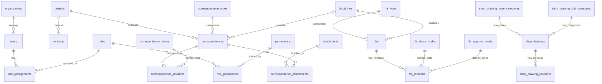

# Data Model Architecture

---

title: 'Data Model Architecture'
version: 1.5.0
status: first-draft
owner: Nattanin Peancharoen
last_updated: 2025-11-30
related:

- specs/01-requirements/02-architecture.md
- specs/01-requirements/03-functional-requirements.md
- docs/4_Data_Dictionary_V1_4_5.md
- docs/8_lcbp3_v1_4_5.sql

---

## 📋 Overview

เอกสารนี้อธิบายสถาปัตยกรรมของ Data Model สำหรับระบบ LCBP3-DMS โดยครอบคลุมโครงสร้างฐานข้อมูล, ความสัมพันธ์ระหว่างตาราง, และหลักการออกแบบที่สำคัญ

## 🎯 Design Principles

### 1. Separation of Concerns

- **Master-Revision Pattern**: แยกข้อมูลที่ไม่เปลี่ยนแปลง (Master) จากข้อมูลที่มีการแก้ไข (Revisions)
  - `correspondences` (Master) ↔ `correspondence_revisions` (Revisions)
  - `rfas` (Master) ↔ `rfa_revisions` (Revisions)
  - `shop_drawings` (Master) ↔ `shop_drawing_revisions` (Revisions)

### 2. Data Integrity

- **Foreign Key Constraints**: ใช้ FK ทุกความสัมพันธ์เพื่อรักษาความสมบูรณ์ของข้อมูล
- **Soft Delete**: ใช้ `deleted_at` แทนการลบข้อมูลจริง เพื่อรักษาประวัติ
- **Optimistic Locking**: ใช้ `version` column ใน `document_number_counters` ป้องกัน Race Condition

### 3. Flexibility & Extensibility

- **JSON Details Field**: เก็บข้อมูลเฉพาะประเภทใน `correspondence_revisions.details`
- **Virtual Columns**: สร้าง Index จาก JSON fields สำหรับ Performance
- **Master Data Tables**: แยกข้อมูล Master (Types, Status, Codes) เพื่อความยืดหยุ่น

### 4. Security & Audit

- **RBAC (Role-Based Access Control)**: ระบบสิทธิ์แบบ Hierarchical Scope
- **Audit Trail**: บันทึกผู้สร้าง/แก้ไข และเวลาในทุกตาราง
- **Two-Phase File Upload**: ป้องกันไฟล์ขยะด้วย Temporary Storage

## 🗂️ Database Schema Overview

### Entity Relationship Diagram



## 📊 Data Model Categories

### 1. 🏢 Core & Master Data

#### 1.1 Organizations & Projects

**Tables:**

- `organization_roles` - บทบาทขององค์กร (OWNER, DESIGNER, CONSULTANT, CONTRACTOR)
- `organizations` - องค์กรทั้งหมดในระบบ
- `projects` - โครงการ
- `contracts` - สัญญาภายใต้โครงการ
- `project_organizations` - M:N ระหว่าง Projects และ Organizations
- `contract_organizations` - M:N ระหว่าง Contracts และ Organizations พร้อม Role

**Key Relationships:**

```
projects (1) ──→ (N) contracts
projects (N) ←→ (N) organizations [via project_organizations]
contracts (N) ←→ (N) organizations [via contract_organizations]
```

**Business Rules:**

- Organization code ต้องไม่ซ้ำกันในระบบ
- Contract ต้องผูกกับ Project เสมอ (ON DELETE CASCADE)
- Soft delete ใช้ `is_active` flag

---

### 2. 👥 Users & RBAC

#### 2.1 User Management

**Tables:**

- `users` - ผู้ใช้งานระบบ
- `roles` - บทบาทพร้อม Scope (Global, Organization, Project, Contract)
- `permissions` - สิทธิ์การใช้งาน (49 permissions)
- `role_permissions` - M:N mapping
- `user_assignments` - การมอบหมายบทบาทพร้อม Scope Context

**Scope Hierarchy:**

```
Global (ทั้งระบบ)
  ↓
Organization (ระดับองค์กร)
  ↓
Project (ระดับโครงการ)
  ↓
Contract (ระดับสัญญา)
```

**Key Features:**

- **Hierarchical Scope**: User สามารถมีหลาย Role ในหลาย Scope
- **Scope Inheritance**: สิทธิ์ระดับบนครอบคลุมระดับล่าง
- **Account Security**: Failed login tracking, Account locking, Password hashing (bcrypt)

**Example User Assignment:**

```sql
-- User A เป็น Editor ในองค์กร TEAM
INSERT INTO user_assignments (user_id, role_id, organization_id)
VALUES (1, 4, 3);

-- User B เป็น Project Manager ในโครงการ LCBP3
INSERT INTO user_assignments (user_id, role_id, project_id)
VALUES (2, 6, 1);
```

---

### 3. ✉️ Correspondences (เอกสารโต้ตอบ)

#### 3.1 Master-Revision Pattern

**Master Table: `correspondences`**

เก็บข้อมูลที่ไม่เปลี่ยนแปลง:

- `correspondence_number` - เลขที่เอกสาร (Unique per Project)
- `correspondence_type_id` - ประเภทเอกสาร (RFA, RFI, TRANSMITTAL, etc.)
- `discipline_id` - สาขางาน (GEN, STR, ARC, etc.) [NEW v1.4.5]
- `project_id`, `originator_id` - โครงการและองค์กรผู้ส่ง

**Revision Table: `correspondence_revisions`**

เก็บข้อมูลที่เปลี่ยนแปลงได้:

- `revision_number` - หมายเลข Revision (0, 1, 2...)
- `is_current` - Flag สำหรับ Revision ปัจจุบัน (UNIQUE constraint)
- `title`, `description` - เนื้อหาเอกสาร
- `correspondence_status_id` - สถานะ (DRAFT, SUBOWN, REPCSC, etc.)
- `details` - JSON field สำหรับข้อมูลเฉพาะประเภท
- Virtual Columns: `v_ref_project_id`, `v_ref_type`, `v_doc_subtype` (Indexed)

**Supporting Tables:**

- `correspondence_types` - Master ประเภทเอกสาร (10 types)
- `correspondence_status` - Master สถานะ (23 status codes)
- `correspondence_sub_types` - ประเภทย่อยสำหรับ Document Numbering [NEW v1.4.5]
- `disciplines` - สาขางาน (GEN, STR, ARC, etc.) [NEW v1.4.5]
- `correspondence_recipients` - M:N ผู้รับ (TO/CC)
- `correspondence_tags` - M:N Tags
- `correspondence_references` - M:N Cross-references

**Example Query - Get Current Revision:**

```sql
SELECT c.correspondence_number, cr.title, cr.revision_label, cs.status_name
FROM correspondences c
JOIN correspondence_revisions cr ON c.id = cr.correspondence_id
JOIN correspondence_status cs ON cr.correspondence_status_id = cs.id
WHERE cr.is_current = TRUE
  AND c.deleted_at IS NULL;
```

---

### 4. 📐 RFAs (Request for Approval)

#### 4.1 RFA Structure

**Master Table: `rfas`**

- `rfa_type_id` - ประเภท RFA (DWG, DOC, MAT, SPC, etc.)
- `discipline_id` - สาขางาน [NEW v1.4.5]

**Revision Table: `rfa_revisions`**

- `correspondence_id` - Link กับ Correspondence (RFA เป็น Correspondence ประเภทหนึ่ง)
- `rfa_status_code_id` - สถานะ (DFT, FAP, FRE, FCO, ASB, OBS, CC)
- `rfa_approve_code_id` - ผลการอนุมัติ (1A, 1C, 1N, 1R, 3C, 3R, 4X, 5N)
- `approved_date` - วันที่อนุมัติ

**Supporting Tables:**

- `rfa_types` - 11 ประเภท (Shop Drawing, Document, Material, etc.)
- `rfa_status_codes` - 7 สถานะ
- `rfa_approve_codes` - 8 รหัสผลการอนุมัติ
- `rfa_items` - M:N เชื่อม RFA (ประเภท DWG) กับ Shop Drawing Revisions

**RFA Workflow States:**

```
DFT (Draft)
  ↓
FAP (For Approve) / FRE (For Review)
  ↓
[Approval Process]
  ↓
FCO (For Construction) / ASB (As-Built) / 3R (Revise) / 4X (Reject)
```

---

### 5. 📐 Drawings (แบบก่อสร้าง)

#### 5.1 Contract Drawings (แบบคู่สัญญา)

**Tables:**

- `contract_drawing_volumes` - เล่มแบบ
- `contract_drawing_cats` - หมวดหมู่หลัก
- `contract_drawing_sub_cats` - หมวดหมู่ย่อย
- `contract_drawing_subcat_cat_maps` - M:N Mapping
- `contract_drawings` - แบบคู่สัญญา

**Hierarchy:**

```
Volume (เล่ม)
  └─ Category (หมวดหมู่หลัก)
      └─ Sub-Category (หมวดหมู่ย่อย)
          └─ Drawing (แบบ)
```

#### 5.2 Shop Drawings (แบบก่อสร้าง)

**Tables:**

- `shop_drawing_main_categories` - หมวดหมู่หลัก (ARCH, STR, MEP, etc.)
- `shop_drawing_sub_categories` - หมวดหมู่ย่อย
- `shop_drawings` - Master แบบก่อสร้าง
- `shop_drawing_revisions` - Revisions
- `shop_drawing_revision_contract_refs` - M:N อ้างอิงแบบคู่สัญญา

**Revision Tracking:**

```sql
-- Get latest revision of a shop drawing
SELECT sd.drawing_number, sdr.revision_label, sdr.revision_date
FROM shop_drawings sd
JOIN shop_drawing_revisions sdr ON sd.id = sdr.shop_drawing_id
WHERE sd.drawing_number = 'SD-STR-001'
ORDER BY sdr.revision_number DESC
LIMIT 1;
```

---

### 6. 🔄 Circulations & Transmittals

#### 6.1 Circulations (ใบเวียนภายใน)

**Tables:**

- `circulation_status_codes` - สถานะ (OPEN, IN_REVIEW, COMPLETED, CANCELLED)
- `circulations` - ใบเวียน (1:1 กับ Correspondence)

**Workflow:**

```
OPEN → IN_REVIEW → COMPLETED
         ↓
    CANCELLED
```

#### 6.2 Transmittals (เอกสารนำส่ง)

**Tables:**

- `transmittals` - ข้อมูล Transmittal (1:1 กับ Correspondence)
- `transmittal_items` - M:N รายการเอกสารที่นำส่ง

**Purpose Types:**

- FOR_APPROVAL
- FOR_INFORMATION
- FOR_REVIEW
- OTHER

---

### 7. 📎 File Management

#### 7.1 Two-Phase Storage Pattern

**Table: `attachments`**

**Phase 1: Temporary Upload**

```sql
INSERT INTO attachments (
  original_filename, stored_filename, file_path,
  mime_type, file_size, is_temporary, temp_id,
  uploaded_by_user_id, expires_at, checksum
)
VALUES (
  'document.pdf', 'uuid-document.pdf', '/temp/uuid-document.pdf',
  'application/pdf', 1024000, TRUE, 'temp-uuid-123',
  1, NOW() + INTERVAL 1 HOUR, 'sha256-hash'
);
```

**Phase 2: Commit to Permanent**

```sql
-- Update attachment to permanent
UPDATE attachments
SET is_temporary = FALSE, expires_at = NULL
WHERE temp_id = 'temp-uuid-123';

-- Link to correspondence
INSERT INTO correspondence_attachments (correspondence_id, attachment_id, is_main_document)
VALUES (1, 123, TRUE);
```

**Junction Tables:**

- `correspondence_attachments` - M:N
- `circulation_attachments` - M:N
- `shop_drawing_revision_attachments` - M:N (with file_type)
- `contract_drawing_attachments` - M:N (with file_type)

**Security Features:**

- Checksum validation (SHA-256)
- Automatic cleanup of expired temporary files
- File type validation via `mime_type`

---

### 8. 🔢 Document Numbering

#### 8.1 Format & Counter System

**Tables:**

- `document_number_formats` - Template รูปแบบเลขที่เอกสาร
- `document_number_counters` - Running Number Counter with Optimistic Locking

**Format Template Example:**

```
{ORG_CODE}-{TYPE_CODE}-{DISCIPLINE_CODE}-{YEAR}-{SEQ:4}
→ TEAM-RFA-STR-2025-0001
```

**Counter Table Structure:**

```sql
CREATE TABLE document_number_counters (
  project_id INT,
  originator_organization_id INT,
  correspondence_type_id INT,
  discipline_id INT DEFAULT 0,  -- NEW v1.4.5
  current_year INT,
  version INT DEFAULT 0,        -- Optimistic Lock
  last_number INT DEFAULT 0,
  PRIMARY KEY (project_id, originator_organization_id, correspondence_type_id, discipline_id, current_year)
);
```

**Optimistic Locking Pattern:**

```sql
-- Get next number with version check
UPDATE document_number_counters
SET last_number = last_number + 1,
    version = version + 1
WHERE project_id = 1
  AND originator_organization_id = 3
  AND correspondence_type_id = 1
  AND discipline_id = 2
  AND current_year = 2025
  AND version = @current_version;  -- Optimistic lock check

-- If affected rows = 0, retry (conflict detected)
```

---

## 🔐 Security & Audit

### 1. Audit Logging

**Table: `audit_logs`**

บันทึกการเปลี่ยนแปลงสำคัญ:

- User actions (CREATE, UPDATE, DELETE)
- Entity type และ Entity ID
- Old/New values (JSON)
- IP Address, User Agent

### 2. User Preferences

**Table: `user_preferences`**

เก็บการตั้งค่าส่วนตัว:

- Language preference
- Notification settings
- UI preferences (JSON)

### 3. JSON Schema Validation

**Table: `json_schemas`**

เก็บ Schema สำหรับ Validate JSON fields:

- `correspondence_revisions.details`
- `user_preferences.preferences`

---

## 📈 Performance Optimization

### 1. Indexing Strategy

**Primary Indexes:**

- Primary Keys (AUTO_INCREMENT)
- Foreign Keys (automatic in InnoDB)
- Unique Constraints (business keys)

**Secondary Indexes:**

```sql
-- Correspondence search
CREATE INDEX idx_corr_type_status ON correspondence_revisions(correspondence_type_id, correspondence_status_id);
CREATE INDEX idx_corr_date ON correspondence_revisions(document_date);

-- Virtual columns for JSON
CREATE INDEX idx_v_ref_project ON correspondence_revisions(v_ref_project_id);
CREATE INDEX idx_v_doc_subtype ON correspondence_revisions(v_doc_subtype);

-- User lookup
CREATE INDEX idx_user_email ON users(email);
CREATE INDEX idx_user_org ON users(primary_organization_id, is_active);
```

### 2. Virtual Columns

ใช้ Virtual Columns สำหรับ Index JSON fields:

```sql
ALTER TABLE correspondence_revisions
ADD COLUMN v_ref_project_id INT GENERATED ALWAYS AS (JSON_UNQUOTE(JSON_EXTRACT(details, '$.ref_project_id'))) VIRTUAL,
ADD INDEX idx_v_ref_project(v_ref_project_id);
```

### 3. Partitioning (Future)

พิจารณา Partition ตาราง `audit_logs` ตามปี:

```sql
ALTER TABLE audit_logs
PARTITION BY RANGE (YEAR(created_at)) (
  PARTITION p2024 VALUES LESS THAN (2025),
  PARTITION p2025 VALUES LESS THAN (2026),
  PARTITION p_future VALUES LESS THAN MAXVALUE
);
```

---

## 🔄 Migration Strategy

### 1. TypeORM Migrations

ใช้ TypeORM Migration สำหรับ Schema Changes:

```typescript
// File: backend/src/migrations/1234567890-AddDisciplineToCorrespondences.ts
import { MigrationInterface, QueryRunner } from 'typeorm';

export class AddDisciplineToCorrespondences1234567890
  implements MigrationInterface
{
  public async up(queryRunner: QueryRunner): Promise<void> {
    await queryRunner.query(`
      ALTER TABLE correspondences
      ADD COLUMN discipline_id INT NULL COMMENT 'สาขางาน (ถ้ามี)'
      AFTER correspondence_type_id
    `);

    await queryRunner.query(`
      ALTER TABLE correspondences
      ADD CONSTRAINT fk_corr_discipline
      FOREIGN KEY (discipline_id) REFERENCES disciplines(id)
      ON DELETE SET NULL
    `);
  }

  public async down(queryRunner: QueryRunner): Promise<void> {
    await queryRunner.query(
      `ALTER TABLE correspondences DROP FOREIGN KEY fk_corr_discipline`
    );
    await queryRunner.query(
      `ALTER TABLE correspondences DROP COLUMN discipline_id`
    );
  }
}
```

### 2. Data Seeding

ใช้ Seed Scripts สำหรับ Master Data:

```typescript
// File: backend/src/seeds/1-organizations.seed.ts
export class OrganizationSeeder implements Seeder {
  public async run(dataSource: DataSource): Promise<void> {
    const repository = dataSource.getRepository(Organization);
    await repository.save([
      {
        organization_code: 'กทท.',
        organization_name: 'Port Authority of Thailand',
      },
      {
        organization_code: 'TEAM',
        organization_name: 'TEAM Consulting Engineering',
      },
      // ...
    ]);
  }
}
```

---

## 📚 Best Practices

### 1. Naming Conventions

- **Tables**: `snake_case`, plural (e.g., `correspondences`, `users`)
- **Columns**: `snake_case` (e.g., `correspondence_number`, `created_at`)
- **Foreign Keys**: `{referenced_table_singular}_id` (e.g., `project_id`, `user_id`)
- **Junction Tables**: `{table1}_{table2}` (e.g., `correspondence_tags`)

### 2. Timestamp Columns

ทุกตารางควรมี:

- `created_at TIMESTAMP DEFAULT CURRENT_TIMESTAMP`
- `updated_at TIMESTAMP DEFAULT CURRENT_TIMESTAMP ON UPDATE CURRENT_TIMESTAMP`

### 3. Soft Delete

ใช้ `deleted_at DATETIME NULL` แทนการลบจริง:

```sql
-- Soft delete
UPDATE correspondences SET deleted_at = NOW() WHERE id = 1;

-- Query active records
SELECT * FROM correspondences WHERE deleted_at IS NULL;
```

### 4. JSON Field Guidelines

- ใช้สำหรับข้อมูลที่ไม่ต้อง Query บ่อย
- สร้าง Virtual Columns สำหรับ fields ที่ต้อง Index
- Validate ด้วย JSON Schema
- Document structure ใน Data Dictionary

---

## 🔗 Related Documentation

- [System Architecture](./02-architecture.md) - สถาปัตยกรรมระบบโดยรวม
- [API Design](./api-design.md) - การออกแบบ API
- [Data Dictionary v1.4.5](../../docs/4_Data_Dictionary_V1_4_5.md) - รายละเอียดตารางทั้งหมด
- [SQL Schema v1.4.5](../../docs/8_lcbp3_v1_4_5.sql) - SQL Script สำหรับสร้างฐานข้อมูล
- [Functional Requirements](../01-requirements/03-functional-requirements.md) - ความต้องการด้านฟังก์ชัน

---

## 📝 Version History

| Version | Date       | Author               | Changes                                        |
| ------- | ---------- | -------------------- | ---------------------------------------------- |
| 1.5.0   | 2025-11-30 | Nattanin Peancharoen | Initial data model documentation               |
| 1.4.5   | 2025-11-29 | System               | Added disciplines and correspondence_sub_types |
