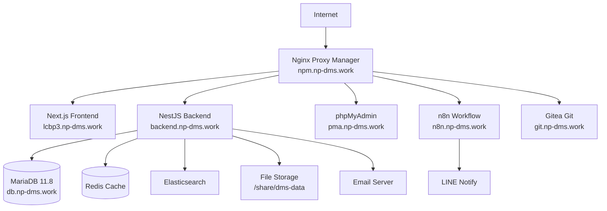
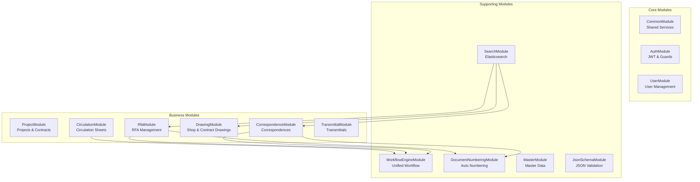
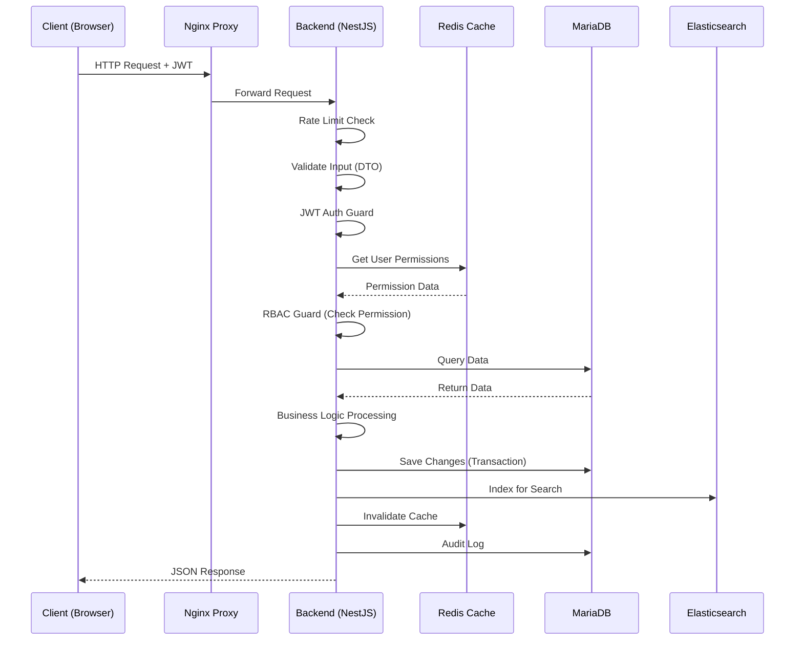
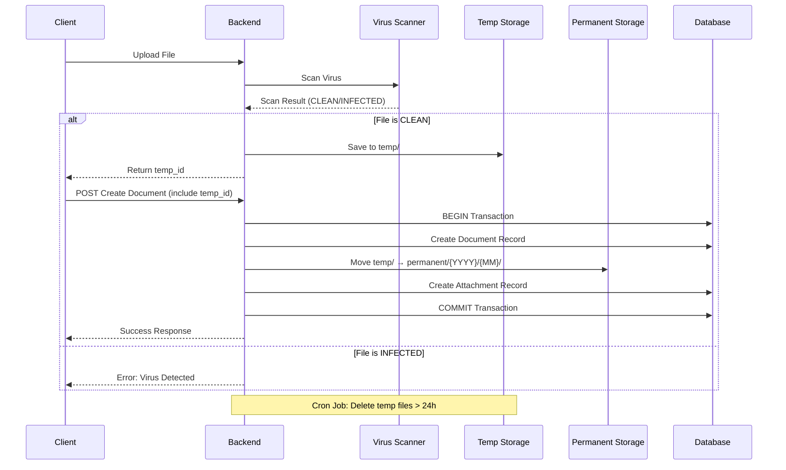
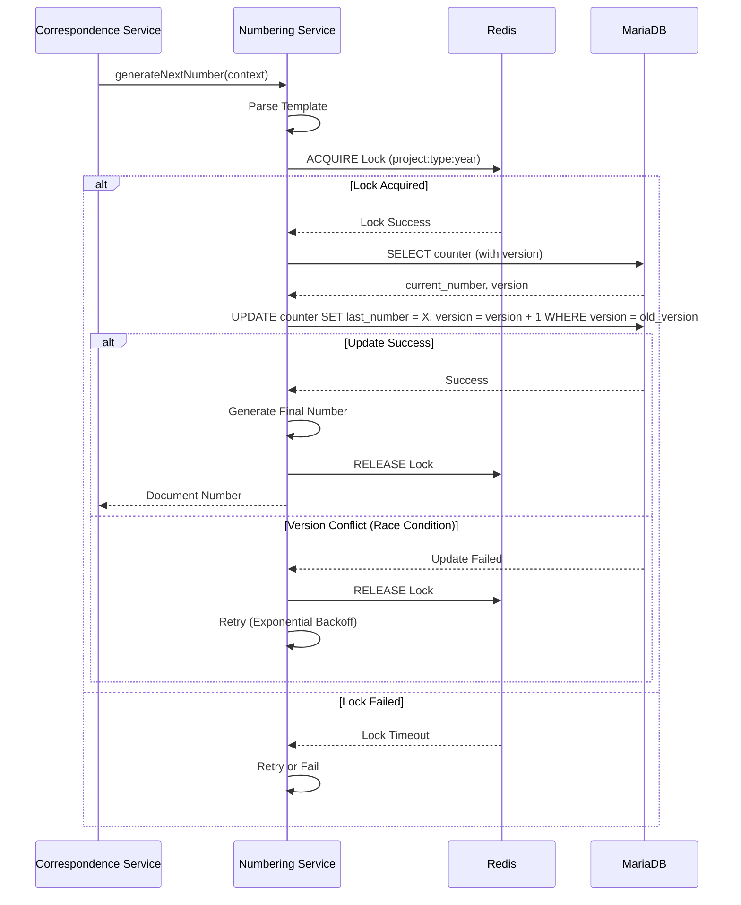
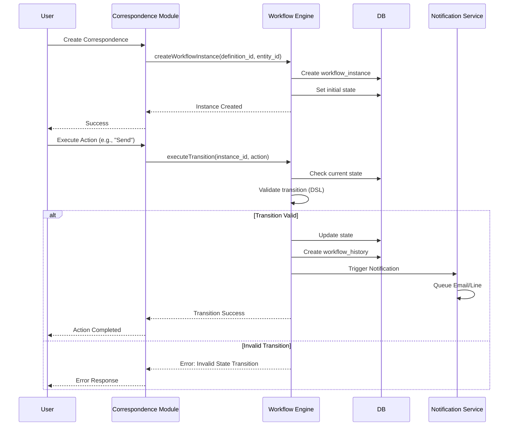
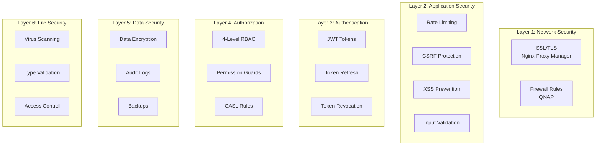
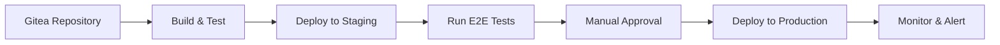

# 🏗️ System Architecture Specification

---

**title:** 'System Architecture'
**version:** 1.5.0
**status:** first-draft
**owner:** Nattanin Peancharoen
**last_updated:** 2025-11-30
**related:**

- specs/01-requirements/02-architecture.md
- specs/01-requirements/06-non-functional.md
- specs/03-implementation/fullftack-js-v1.5.0.md

---

## 📋 ภาพรวม (Overview)

เอกสารนี้อธิบายสถาปัตยกรรมระบบ LCBP3-DMS (Laem Chabang Port Phase 3 - Document Management System) ที่ใช้แนวทาง **Headless/API-First Architecture** พร้อมการ Deploy บน QNAP Server ผ่าน Container Station

## 🎯 Architecture Principles

### 1.1 Core Principles

1. **Data Integrity First:** ความถูกต้องของข้อมูลต้องมาก่อนทุกอย่าง
2. **Security by Design:** รักษาความปลอดภัยที่ทุกชั้น
3. **Scalability:** รองรับการเติบโตในอนาคต
4. **Resilience:** ทนทานต่อ Failure และ Recovery ได้รวดเร็ว
5. **Observability:** ติดตามและวิเคราะห์สถานะระบบได้ง่าย

### 1.2 Architecture Style

- **Headless CMS Architecture:** แยก Frontend และ Backend เป็นอิสระ
- **API-First:** Backend เป็น API Server ที่ Frontend หรือ Third-party สามารถเรียกใช้ได้
- **Microservices-Ready:** ออกแบบเป็น Modular Architecture พร้อมแยกเป็น Microservices ในอนาคต

## 🏢 Infrastructure & Deployment

### 2.1 Server Infrastructure

- **Server:** QNAP TS-473A
  - CPU: AMD Ryzen V1500B
  - RAM: 32GB
  - Storage: /share/dms-data
- **IP Address:** 159.192.126.103
- **Domain:** np-dms.work, <www.np-dms.work>
- **Containerization:** Docker & Docker Compose via Container Station
- **Development Environment:** VS Code/Cursor on Windows 11

### 2.2 Network Architecture



**Docker Network:**

- Network Name: `lcbp3`
- ทุก Service เชื่อมต่อผ่าน Internal Docker Network เพื่อความปลอดภัย

### 2.3 Configuration Management

> [!WARNING] > **ข้อจำกัดสำคัญ:** QNAP Container Station ไม่รองรับการใช้ `.env` files ในการกำหนด Environment Variables

**Configuration Strategy:**

1. **Production/Staging:**

   - ใช้ `docker-compose.yml` สำหรับกำหนด Environment Variables
   - ห้ามระบุ Sensitive Secrets (Password, Keys) ใน `docker-compose.yml` หลัก
   - ใช้ `docker-compose.override.yml` (gitignored) สำหรับ Secrets
   - พิจารณาใช้ Docker Secrets หรือ Hashicorp Vault

2. **Development:**

   - ใช้ `docker-compose.override.yml` สำหรับ Local Secrets
   - ไฟล์หลักใส่ค่า Dummy/Placeholder

3. **Validation:**
   - ใช้ Joi/Zod validate Environment Variables ตอน App Start
   - Throw Error ทันทีหากขาด Variable สำคัญ

## 🔧 Core Services

### 3.1 Service Overview

| Service           | Application Name | Domain              | Technology               | Purpose                     |
| :---------------- | :--------------- | :------------------ | :----------------------- | :-------------------------- |
| **Frontend**      | lcbp3-frontend   | lcbp3.np-dms.work   | Next.js 14+ (App Router) | Web Application UI          |
| **Backend**       | lcbp3-backend    | backend.np-dms.work | NestJS (TypeScript)      | API Server & Business Logic |
| **Database**      | lcbp3-db         | db.np-dms.work      | MariaDB 11.8             | Primary Database            |
| **DB Management** | lcbp3-db         | pma.np-dms.work     | phpMyAdmin               | Database Admin UI           |
| **Reverse Proxy** | lcbp3-npm        | npm.np-dms.work     | Nginx Proxy Manager      | Reverse Proxy & SSL         |
| **Workflow**      | lcbp3-n8n        | n8n.np-dms.work     | n8n                      | Workflow Automation         |
| **Git**           | git              | git.np-dms.work     | Gitea                    | Self-hosted Git             |
| **Cache**         | -                | -                   | Redis                    | Caching & Locking           |
| **Search**        | -                | -                   | Elasticsearch            | Full-text Search            |

### 3.2 Frontend (Next.js)

**Stack:**

- **Framework:** Next.js 14+ with App Router
- **Language:** TypeScript (ESM)
- **Styling:** Tailwind CSS + PostCSS
- **Components:** shadcn/ui
- **State Management:**
  - Server State: TanStack Query (React Query)
  - Form State: React Hook Form + Zod
  - UI State: useState/useReducer

**Responsibilities:**

- Render Web UI สำหรับผู้ใช้
- จัดการ User Interactions
- เรียก Backend API
- Client-side Validation
- Responsive Design (Desktop + Mobile)

### 3.3 Backend (NestJS)

**Stack:**

- **Framework:** NestJS (Node.js + TypeScript)
- **ORM:** TypeORM
- **Authentication:** JWT + Passport
- **Authorization:** CASL (RBAC)
- **Validation:** class-validator + class-transformer
- **Documentation:** Swagger/OpenAPI

**Responsibilities:**

- ให้บริการ RESTful API
- Business Logic Processing
- Authentication & Authorization
- Data Validation
- Database Operations
- File Upload Handling (Two-Phase Storage)
- Workflow Engine
- Background Jobs (Notifications, Cleanup)

### 3.4 Database (MariaDB 11.8)

**Features:**

- **JSON Support:** จัดเก็บ `details` fields (Dynamic Schema)
- **Virtual Columns:** Index JSON fields สำหรับ Performance
- **Partitioning:** สำหรับ `audit_logs` และ `notifications`
- **Optimistic Locking:** ใช้ `@VersionColumn()` ป้องกัน Race Condition

**Key Tables:**

- Users & Permissions: `users`, `roles`, `permissions`, `user_roles`
- Projects: `projects`, `organizations`, `contracts`, `project_parties`
- Documents: `correspondences`, `rfas`, `shop_drawings`, `contract_drawings`
- Workflow: `workflow_definitions`, `workflow_instances`, `workflow_history`
- Files: `attachments`, `correspondence_attachments`, etc.
- Audit: `audit_logs`

### 3.5 Redis

**Use Cases:**

1. **Distributed Locking:** Document Numbering, Critical Operations
2. **Session Caching:** User Permissions, Profile Data
3. **Master Data Cache:** Roles, Permissions, Organizations (TTL: 1 hour)
4. **Queue Management:** BullMQ for Background Jobs
5. **Rate Limiting:** Track API Request Counts

### 3.6 Elasticsearch

**Use Cases:**

- **Full-text Search:** Search across Correspondence, RFA, Drawings
- **Advanced Filtering:** Multi-criteria Search
- **Aggregations:** Statistics และ Dashboard Data

**Indexing Strategy:**

- Index อัตโนมัติเมื่อ Create/Update เอกสาร
- Async Indexing ผ่าน Queue (ไม่ Block Main Request)

## 🧱 Backend Module Architecture

### 4.1 Modular Design



### 4.2 Module Descriptions

#### 4.2.1 CommonModule

**Responsibilities:**

- Database Configuration
- FileStorageService (Two-Phase Upload)
- AuditLogService
- NotificationService
- Shared DTOs, Guards, Interceptors

#### 4.2.2 AuthModule

**Responsibilities:**

- JWT Token Management
- Authentication Guards
- 4-Level Permission Checking:
  - Global (Superadmin)
  - Organization
  - Project
  - Contract
- Token Refresh & Revocation

#### 4.2.3 UserModule

**Responsibilities:**

- User CRUD Operations
- Role Assignment
- Permission Management
- User Profile Management

#### 4.2.4 ProjectModule

**Responsibilities:**

- Project Management
- Contract Management
- Organization Management
- Project Parties & Contract Parties

#### 4.2.5 CorrespondenceModule

**Responsibilities:**

- Correspondence CRUD
- Revision Management
- Attachment Handling
- Workflow Integration (Routing)

#### 4.2.6 RfaModule

**Responsibilities:**

- RFA CRUD
- RFA Item Management
- Workflow Integration (Approval Process)
- Respond/Approve Actions

#### 4.2.7 DrawingModule

**Responsibilities:**

- Shop Drawing Management
- Contract Drawing Management
- Drawing Categories
- Revision Tracking
- Drawing References

#### 4.2.8 CirculationModule

**Responsibilities:**

- Circulation Sheet Management
- Circulation Templates
- Assignees Management
- Workflow Integration (Internal Circulation)

#### 4.2.9 WorkflowEngineModule (Core)

> [!IMPORTANT] > **Unified Workflow Engine** - ระบบกลางสำหรับจัดการ Workflow ทั้งหมด

**Features:**

- DSL-Based Workflow Definitions (JSON Configuration)
- State Machine Management
- Workflow Instance Tracking
- History & Audit Trail
- Workflow Versioning

**Entities:**

- `WorkflowDefinition`: กำหนด Workflow Template
- `WorkflowInstance`: Instance ที่กำลังรัน
- `WorkflowHistory`: ประวัติการเปลี่ยน State

**Integration:**

- CorrespondenceModule → Routing Workflow
- RfaModule → Approval Workflow
- CirculationModule → Internal Circulation Workflow

#### 4.2.10 DocumentNumberingModule (Internal)

**Responsibilities:**

- Auto-generate Document Numbers
- Token-Based Generator: `{CONTRACT}-{TYPE}-{DISCIPLINE}-{SEQ:4}`
- **Double-Lock Mechanism:**
  - Layer 1: Redis Distributed Lock
  - Layer 2: Optimistic Database Lock (`@VersionColumn()`)

**Algorithm:**

1. Parse Template → Identify Required Tokens
2. Acquire Redis Lock (Key: `project_id:type_id:discipline_id:year`)
3. Query `document_number_counters` Table
4. Increment Counter (Check Version)
5. Generate Final Number
6. Release Lock
7. Retry on Conflict (Exponential Backoff)

#### 4.2.11 SearchModule

**Responsibilities:**

- Elasticsearch Integration
- Full-text Search across Documents
- Advanced Filtering
- Search Result Aggregation

#### 4.2.12 JsonSchemaModule (Internal)

**Responsibilities:**

- JSON Schema Validation (AJV)
- Schema Versioning & Migration
- Dynamic Schema Generation
- Data Transformation

## 📊 Data Flow Architecture

### 5.1 Main Request Flow



### 5.2 File Upload Flow (Two-Phase Storage)

> [!IMPORTANT] > **Two-Phase Storage** ป้องกัน Orphan Files และรักษา Data Integrity



### 5.3 Document Numbering Flow



### 5.4 Workflow Execution Flow



## 🛡️ Security Architecture

### 6.1 Security Layers



### 6.2 Authentication & Authorization Details

**JWT Token Structure:**

```json
{
  "sub": "user_id",
  "scope": "organization_id|project_id|contract_id",
  "iat": 1638360000,
  "exp": 1638388800
}
```

**Permission Checking Logic:**

1. Extract JWT from `Authorization: Bearer <token>`
2. Validate Token (Signature, Expiration)
3. Get User Permissions from Redis Cache (Key: `user:{user_id}:permissions`)
4. Check Permission based on Context:
   - Global Permission (Superadmin)
   - Organization Permission
   - Project Permission (if in project context)
   - Contract Permission (if in contract context)
5. Allow if **any level** grants permission (Most Permissive)

### 6.3 Rate Limiting

| Endpoint Category | Limit         | Tracking   |
| :---------------- | :------------ | :--------- |
| Anonymous         | 100 req/hour  | IP Address |
| Authentication    | 10 req/min    | IP Address |
| File Upload       | 50 req/hour   | User ID    |
| Search            | 500 req/hour  | User ID    |
| Viewer            | 500 req/hour  | User ID    |
| Editor            | 1000 req/hour | User ID    |
| Document Control  | 2000 req/hour | User ID    |
| Admin             | 5000 req/hour | User ID    |

**Implementation:** `rate-limiter-flexible` library with Redis backend

### 6.4 Input Validation

**Frontend (Client-Side):**

- React Hook Form + Zod Schema Validation
- Sanitize User Inputs before Display

**Backend (Server-Side):**

- class-validator DTOs
- Whitelist Validation (`@ValidateIf`, `@IsEnum`, etc.)
- Transform Pipes

**File Upload Validation:**

1. **File Type Validation:**

   - White-list: PDF, DWG, DOCX, XLSX, ZIP
   - Magic Number Verification (ไม่ใช่แค่ extension)

2. **File Size Validation:**

   - Maximum: 50MB per file

3. **Virus Scanning:**
   - ClamAV Integration
   - Scan before saving to temp storage

### 6.5 OWASP Top 10 Protection

| Vulnerability                     | Protection Measure                   |
| :-------------------------------- | :----------------------------------- |
| SQL Injection                     | Parameterized Queries (TypeORM)      |
| XSS                               | Input Sanitization + Output Encoding |
| CSRF                              | CSRF Tokens (State-changing ops)     |
| Broken Auth                       | JWT + Secure Token Management        |
| Security Misconfiguration         | Security Headers (Helmet.js)         |
| Sensitive Data Exposure           | Encryption + Secure Storage          |
| Insufficient Logging              | Comprehensive Audit Logs             |
| Insecure Deserialization          | Input Validation                     |
| Using Known Vulnerable Components | Regular Dependency Updates           |

## 📈 Performance & Scalability

### 7.1 Caching Strategy

| Data Type        | Cache Location | TTL     | Invalidation              |
| :--------------- | :------------- | :------ | :------------------------ |
| User Permissions | Redis          | 30 min  | On role/permission change |
| Master Data      | Redis          | 1 hour  | On update                 |
| Search Results   | Redis          | 15 min  | Time-based                |
| File Metadata    | Redis          | 1 hour  | On file update            |
| Session Data     | Redis          | 8 hours | On logout                 |

### 7.2 Database Optimization

**Indexes:**

- Foreign Keys (Auto-indexed)
- Search Columns (`idx_cor_project`, `idx_rfa_status`, etc.)
- JSON Virtual Columns (for frequently queried JSON fields)

**Partitioning:**

- `audit_logs`: Partitioned by Year
- `notifications`: Partitioned by Month
- Automated Partition Creation (Cron Job)

**Query Optimization:**

- Use Views for Complex Queries (`v_current_correspondences`, `v_user_tasks`)
- Pagination for Large Datasets
- Eager/Lazy Loading Strategy

### 7.3 Performance Targets

| Metric                              | Target  | Measurement    |
| :---------------------------------- | :------ | :------------- |
| API Response Time (90th percentile) | < 200ms | Simple CRUD    |
| Search Query Performance            | < 500ms | Complex Search |
| File Upload Processing              | < 30s   | 50MB file      |
| Concurrent Users                    | 100+    | Simultaneous   |
| Cache Hit Ratio                     | > 80%   | Master Data    |
| Application Startup                 | < 30s   | Cold Start     |

## 🔄 Resilience & Error Handling

### 8.1 Resilience Patterns

**Circuit Breaker:**

- Applied to: Elasticsearch, Email Service, LINE Notify
- Threshold: 5 failures in 1 minute
- Timeout: 30 seconds
- Recovery: Half-open after 1 minute

**Retry Mechanism:**

- Strategy: Exponential Backoff
- Max Retries: 3
- Applied to: External API Calls, Document Numbering

**Graceful Degradation:**

- Search Service Down → Return cached results or basic search
- Email Service Down → Queue for later retry
- LINE Notify Down → Log error, continue operation

### 8.2 Error Handling

**Backend:**

- Global Exception Filter
- Structured Error Response Format
- Error Logging with Context (Winston)
- Don't Expose Internal Details in Error Messages

**Frontend:**

- Error Boundaries (React)
- Toast Notifications
- Fallback UI Components
- Retry Mechanisms for Failed Requests

## 📊 Monitoring & Observability

### 9.1 Health Checks

**Endpoints:**

```
GET /health          # Overall health
GET /health/ready    # Readiness probe
GET /health/live     # Liveness probe
```

**Checks:**

- Database Connection
- Redis Connection
- Elasticsearch Connection
- Disk Space
- Memory Usage

### 9.2 Metrics Collection

**Application Metrics:**

- Request Rate (req/sec)
- Response Time (p50, p90, p99)
- Error Rate
- Active Connections

**Business Metrics:**

- Documents Created per Day
- Workflow Completion Rate
- User Activity
- Search Query Performance

**Infrastructure Metrics:**

- CPU Usage
- Memory Usage
- Disk I/O
- Network Throughput

### 9.3 Logging Strategy

> [!WARNING] > **QNAP Storage Constraints:** ต้องจำกัดปริมาณ Logs

**Log Levels:**

- **Production:** WARN and ERROR only
- **Staging:** INFO for critical business flows
- **Development:** DEBUG allowed

**Structured Logging:**

```json
{
  "timestamp": "2025-11-30T13:48:20Z",
  "level": "INFO",
  "service": "backend",
  "module": "CorrespondenceModule",
  "action": "create",
  "user_id": 1,
  "ip_address": "192.168.1.100",
  "duration_ms": 45,
  "message": "Correspondence created successfully"
}
```

**Log Rotation:**

- Rotate Daily
- Keep 7 days
- Compress Old Logs

### 9.4 Audit Logging

**Scope:**

- All CRUD Operations on Critical Data
- Permission Changes
- Login Attempts (Success/Failure)
- File Downloads
- Workflow State Changes

**Audit Log Fields:**

- `user_id`
- `action` (e.g., `correspondence.create`)
- `entity_type`, `entity_id`
- `old_values`, `new_values` (for updates)
- `ip_address`, `user_agent`
- `timestamp`

## 💾 Backup & Disaster Recovery

### 10.1 Backup Strategy

**Database Backup:**

- **Frequency:** Daily (Automated)
- **Method:** Full Backup + Transaction Logs
- **Retention:** 30 days
- **Tool:** QNAP HBS 3 or mysqldump

**File Storage Backup:**

- **Frequency:** Daily
- **Path:** `/share/dms-data`
- **Method:** Incremental Backup
- **Retention:** 30 days
- **Tool:** QNAP Snapshot or rsync

### 10.2 Disaster Recovery

**Recovery Objectives:**

- **RTO (Recovery Time Objective):** < 4 hours
- **RPO (Recovery Point Objective):** < 1 hour

**Recovery Procedures:**

1. **Database Restoration:**

   - Restore latest full backup
   - Apply transaction logs to point-in-time
   - Verify data integrity

2. **File Storage Restoration:**

   - Restore from QNAP snapshot
   - Verify file permissions

3. **Application Redeployment:**

   - Deploy from known-good Docker images
   - Verify health checks

4. **Data Integrity Verification:**
   - Run consistency checks
   - Verify critical business data

## 🏗️ Deployment Architecture

### 11.1 Container Deployment

**Docker Compose Services:**

```yaml
services:
  frontend:
    image: lcbp3-frontend:latest
    networks: [lcbp3]
    depends_on: [backend]

  backend:
    image: lcbp3-backend:latest
    networks: [lcbp3]
    depends_on: [mariadb, redis, elasticsearch]

  mariadb:
    image: mariadb:10.11
    networks: [lcbp3]
    volumes: [/share/dms-data/mysql:/var/lib/mysql]

  redis:
    image: redis:7-alpine
    networks: [lcbp3]

  elasticsearch:
    image: elasticsearch:8.x
    networks: [lcbp3]

  nginx-proxy-manager:
    image: jc21/nginx-proxy-manager:latest
    networks: [lcbp3]
    ports: [80:80, 443:443]
```

### 11.2 CI/CD Pipeline (Future)



## 🎯 Future Enhancements

### 12.1 Scalability Improvements

- [ ] Separate into Microservices (when needed)
- [ ] Add Load Balancer (HAProxy/Nginx)
- [ ] Database Replication (Master-Slave)
- [ ] Message Queue (RabbitMQ/Kafka) for async processing

### 12.2 Advanced Features

- [ ] AI-Powered Document Classification
- [ ] Advanced Analytics & Reporting
- [ ] Mobile Native Apps
- [ ] Blockchain Integration for Document Integrity

### 12.3 Infrastructure

- [ ] Multi-Region Deployment
- [ ] CDN for Static Assets
- [ ] Automated Failover
- [ ] Blue-Green Deployment

---

**Document Control:**

- **Version:** 1.6.0
- **Status:** Active
- **Last Updated:** 2025-12-13
- **Owner:** Nattanin Peancharoen

```

```
