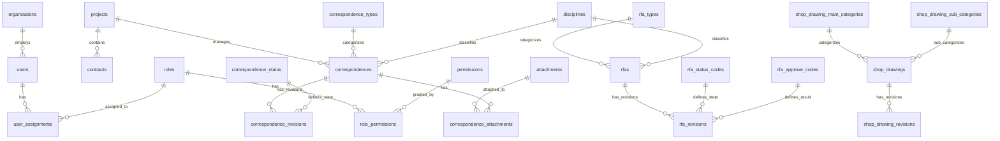

# 1. Data Model Architecture Overview

## 📋 1.1 Overview
เอกสารนี้อธิบายสถาปัตยกรรมของ Data Model สำหรับระบบ LCBP3-DMS โดยครอบคลุมโครงสร้างฐานข้อมูล, ความสัมพันธ์ระหว่างตาราง, และหลักการออกแบบที่สำคัญ

## 🎯 1.2 Design Principles
### 1. Separation of Concerns

- **Master-Revision Pattern**: แยกข้อมูลที่ไม่เปลี่ยนแปลง (Master) จากข้อมูลที่มีการแก้ไข (Revisions)
  - `correspondences` (Master) ↔ `correspondence_revisions` (Revisions)
  - `rfas` (Master) ↔ `rfa_revisions` (Revisions)
  - `shop_drawings` (Master) ↔ `shop_drawing_revisions` (Revisions)

### 2. Data Integrity

- **Foreign Key Constraints**: ใช้ FK ทุกความสัมพันธ์เพื่อรักษาความสมบูรณ์ของข้อมูล
- **Soft Delete**: ใช้ `deleted_at` แทนการลบข้อมูลจริง เพื่อรักษาประวัติ
- **Optimistic Locking**: ใช้ `version` column ใน `document_number_counters` ป้องกัน Race Condition

### 3. Flexibility & Extensibility

- **JSON Details Field**: เก็บข้อมูลเฉพาะประเภทใน `correspondence_revisions.details`
- **Virtual Columns**: สร้าง Index จาก JSON fields สำหรับ Performance
- **Master Data Tables**: แยกข้อมูล Master (Types, Status, Codes) เพื่อความยืดหยุ่น

### 4. Security & Audit

- **RBAC (Role-Based Access Control)**: ระบบสิทธิ์แบบ Hierarchical Scope
- **Audit Trail**: บันทึกผู้สร้าง/แก้ไข และเวลาในทุกตาราง
- **Two-Phase File Upload**: ป้องกันไฟล์ขยะด้วย Temporary Storage

# 2. Database Schema Overview (ERD)
### Entity Relationship Diagram



---

# 3. Data Dictionary V1.8.0

> หมายเหตุ: PK = Primary Key, FK = Foreign Key, AI = AUTO_INCREMENT. รูปแบบ Soft Delete จะปรากฏ Column `deleted_at DATETIME NULL` เป็นมาตรฐาน

## **1. 🏢 Core & Master Data Tables (องค์กร, โครงการ, สัญญา)**

### 1.1 organization_roles

* * Purpose **: MASTER TABLE FOR organization role TYPES IN the system | COLUMN Name | Data TYPE | Constraints | Description | | ----------- | ----------- | --------------------------- | ---------------------------------------------------------------- |
| id | INT | PRIMARY KEY,
AUTO_INCREMENT | UNIQUE identifier FOR organization role | | role_name | VARCHAR(20) | NOT NULL,
UNIQUE | Role name (
  CONTRACTOR,
  THIRD PARTY
) |
| created_at | TIMESTAMP | DEFAULT CURRENT_TIMESTAMP | Record creation timestamp |
| updated_at | TIMESTAMP | DEFAULT CURRENT_TIMESTAMP ON UPDATE | Last update timestamp |
| deleted_at | DATETIME | NULL | Soft delete timestamp | ** INDEXES **: - PRIMARY KEY (id) - UNIQUE (role_name) ** Business Rules **: - Predefined system roles FOR organization TYPES - Cannot be deleted IF referenced by organizations ---

### 1.2 organizations

* * Purpose **: MASTER TABLE storing ALL organizations involved IN the system | COLUMN Name | Data TYPE | Constraints | Description | | ----------------- | ------------ | ----------------------------------- | ---------------------------------------- |
| id | INT | PRIMARY KEY,
AUTO_INCREMENT | UNIQUE identifier FOR organization | | organization_code | VARCHAR(20) | NOT NULL,
UNIQUE | Organization code (e.g., 'กทท.', 'TEAM') | | organization_name | VARCHAR(255) | NOT NULL | FULL organization name | | is_active | BOOLEAN | DEFAULT TRUE | Active STATUS (1 = active, 0 = inactive) | | created_at | TIMESTAMP | DEFAULT CURRENT_TIMESTAMP | Record creation timestamp | | updated_at | TIMESTAMP | DEFAULT CURRENT_TIMESTAMP ON UPDATE | Last
UPDATE timestamp |
| deleted_at | DATETIME | NULL | Soft delete timestamp | ** INDEXES **: - PRIMARY KEY (id) - UNIQUE (organization_code) - INDEX (is_active) ** Relationships **: - Referenced by: users,
  project_organizations,
  contract_organizations,
  correspondences,
  circulations ---

  ### 1.3 projects

  * * Purpose **: MASTER TABLE FOR ALL projects IN the system | COLUMN Name | Data TYPE | Constraints | Description | | ------------ | ------------ | --------------------------- | ----------------------------- |
  | id | INT | PRIMARY KEY,
  AUTO_INCREMENT | UNIQUE identifier FOR project | | project_code | VARCHAR(50) | NOT NULL,
  UNIQUE | Project code (e.g., 'LCBP3') | | project_name | VARCHAR(255) | NOT NULL | FULL project name | | is_active | TINYINT(1) | DEFAULT 1 | Active STATUS |
| created_at | TIMESTAMP | DEFAULT CURRENT_TIMESTAMP | Record creation timestamp |
| updated_at | TIMESTAMP | DEFAULT CURRENT_TIMESTAMP ON UPDATE | Last update timestamp |
| deleted_at | DATETIME | NULL | Soft delete timestamp |
** INDEXES **: - PRIMARY KEY (id) - UNIQUE (project_code) - INDEX (is_active) ** Relationships **: - Referenced by: contracts,
  correspondences,
  document_number_formats,
  drawings ---

  ### 1.4 contracts

  * * Purpose **: MASTER TABLE FOR contracts within projects | COLUMN Name | Data TYPE | Constraints | Description | | ------------- | ------------ | ----------------------------------- | ------------------------------ |
  | id | INT | PRIMARY KEY,
  AUTO_INCREMENT | UNIQUE identifier FOR contract | | project_id | INT | NOT NULL,
  FK | Reference TO projects TABLE | | contract_code | VARCHAR(50) | NOT NULL,
  UNIQUE | Contract code | | contract_name | VARCHAR(255) | NOT NULL | FULL contract name | | description | TEXT | NULL | Contract description | | start_date | DATE | NULL | Contract START date | | end_date | DATE | NULL | Contract
END date | | is_active | BOOLEAN | DEFAULT TRUE | Active STATUS | | created_at | TIMESTAMP | DEFAULT CURRENT_TIMESTAMP | Record creation timestamp | | updated_at | TIMESTAMP | DEFAULT CURRENT_TIMESTAMP ON UPDATE | Last
UPDATE timestamp |
| deleted_at | DATETIME | NULL | Soft delete timestamp | ** INDEXES **: - PRIMARY KEY (id) - UNIQUE (contract_code) - FOREIGN KEY (project_id) REFERENCES projects(id) ON DELETE CASCADE - INDEX (project_id, is_active) ** Relationships **: - Parent: projects - Referenced by: contract_organizations,
  user_assignments ---

  ### 1.5 disciplines (NEW v1.5.1)

  * * Purpose **: เก็บข้อมูลสาขางาน (Disciplines) แยกตามสัญญา (Req 6B) | COLUMN Name | Data TYPE | Constraints | Description | |: -------------- | :----------- | :----------- | :--------------------- |
  | id | INT | PK,
  AI | UNIQUE identifier | | contract_id | INT | FK,
  NOT NULL | ผูกกับสัญญา | | discipline_code | VARCHAR(10) | NOT NULL | รหัสสาขา (เช่น GEN, STR) | | code_name_th | VARCHAR(255) | NULL | ชื่อไทย | | code_name_en | VARCHAR(255) | NULL | ชื่ออังกฤษ | | is_active | TINYINT(1) | DEFAULT 1 | สถานะการใช้งาน | ** INDEXES **: - UNIQUE (contract_id, discipline_code) ---

  ## **2. 👥 Users & RBAC Tables (ผู้ใช้, สิทธิ์, บทบาท)**

  ### 2.1 users

  * * Purpose **: MASTER TABLE storing ALL system users | COLUMN Name | Data TYPE | Constraints | Description | | ----------------------- | ------------ | ----------------------------------- | -------------------------------- |
  | user_id | INT | PRIMARY KEY,
  AUTO_INCREMENT | UNIQUE identifier FOR user | | username | VARCHAR(50) | NOT NULL,
  UNIQUE | Login username | | password_hash | VARCHAR(255) | NOT NULL | Hashed PASSWORD (bcrypt) | | first_name | VARCHAR(50) | NULL | User 's first name                |
| last_name               | VARCHAR(50)  | NULL                                | User' s last name | | email | VARCHAR(100) | NOT NULL,
  UNIQUE | Email address | | line_id | VARCHAR(100) | NULL | LINE messenger ID | | primary_organization_id | INT | NULL,
  FK | PRIMARY organization affiliation | | is_active | TINYINT(1) | DEFAULT 1 | Active STATUS | | failed_attempts | INT | DEFAULT 0 | Failed login attempts counter | | locked_until | DATETIME | NULL | Account LOCK expiration time | | last_login_at | TIMESTAMP | NULL | Last successful login timestamp | | created_at | TIMESTAMP | DEFAULT CURRENT_TIMESTAMP | Record creation timestamp | | updated_at | TIMESTAMP | DEFAULT CURRENT_TIMESTAMP ON UPDATE | Last
UPDATE timestamp | | deleted_at | DATETIME | NULL | Deleted at | ** INDEXES **: - PRIMARY KEY (user_id) - UNIQUE (username) - UNIQUE (email) - FOREIGN KEY (primary_organization_id) REFERENCES organizations(id) ON DELETE
SET NULL - INDEX (is_active) - INDEX (email) ** Relationships **: - Parent: organizations (primary_organization_id) - Referenced by: user_assignments,
  audit_logs,
  notifications,
  circulation_routings ---

  ### 2.2 roles

  * * Purpose **: MASTER TABLE defining system roles WITH scope levels | COLUMN Name | Data TYPE | Constraints | Description | | ----------- | ------------ | --------------------------- | ---------------------------------------------------- |
  | role_id | INT | PRIMARY KEY,
  AUTO_INCREMENT | UNIQUE identifier FOR role | | role_name | VARCHAR(100) | NOT NULL | Role name (e.g., 'Superadmin', 'Document Control') | | scope | ENUM | NOT NULL | Scope LEVEL: GLOBAL,
  Organization,
  Project,
  Contract | | description | TEXT | NULL | Role description | | is_system | BOOLEAN | DEFAULT FALSE | System role flag (cannot be deleted) |
| created_at | TIMESTAMP | DEFAULT CURRENT_TIMESTAMP | Record creation timestamp |
| updated_at | TIMESTAMP | DEFAULT CURRENT_TIMESTAMP ON UPDATE | Last update timestamp |
| deleted_at | DATETIME | NULL | Soft delete timestamp |
** INDEXES **: - PRIMARY KEY (role_id) - INDEX (scope) ** Relationships **: - Referenced by: role_permissions,
  user_assignments ---

  ### 2.3 permissions

  * * Purpose **: MASTER TABLE defining ALL system permissions | COLUMN Name | Data TYPE | Constraints | Description | | --------------- | ------------ | --------------------------- | ------------------------------------------------------ |
  | permission_id | INT | PRIMARY KEY,
  AUTO_INCREMENT | UNIQUE identifier FOR permission | | permission_name | VARCHAR(100) | NOT NULL,
  UNIQUE | Permission code (e.g., 'rfas.create', 'document.view') | | description | TEXT | NULL | Permission description | | module | VARCHAR(50) | NULL | Related module name | | scope_level | ENUM | NULL | Scope: GLOBAL,
  ORG,
  PROJECT | | is_active | TINYINT(1) | DEFAULT 1 | Active STATUS |
| created_at | TIMESTAMP | DEFAULT CURRENT_TIMESTAMP | Record creation timestamp |
| updated_at | TIMESTAMP | DEFAULT CURRENT_TIMESTAMP ON UPDATE | Last update timestamp |
| deleted_at | DATETIME | NULL | Soft delete timestamp |
** INDEXES **: - PRIMARY KEY (permission_id) - UNIQUE (permission_name) - INDEX (module) - INDEX (scope_level) - INDEX (is_active) ** Relationships **: - Referenced by: role_permissions ---

  ### 2.4 role_permissions

  * * Purpose **: Junction TABLE mapping roles TO permissions (M :N) | COLUMN Name | Data TYPE | Constraints | Description | | ------------- | --------- | --------------- | ------------------------------ |
  | role_id | INT | PRIMARY KEY,
  FK | Reference TO roles TABLE | | permission_id | INT | PRIMARY KEY,
  FK | Reference TO permissions TABLE | ** INDEXES **: - PRIMARY KEY (role_id, permission_id) - FOREIGN KEY (role_id) REFERENCES roles(role_id) ON DELETE CASCADE - FOREIGN KEY (permission_id) REFERENCES permissions(permission_id) ON DELETE CASCADE - INDEX (permission_id) ** Relationships **: - Parent: roles,
  permissions ---

  ### 2.5 user_assignments

  * * Purpose **: Junction TABLE assigning users TO roles WITH scope context | COLUMN Name | Data TYPE | Constraints | Description | | ------------------- | --------- | --------------------------- | ---------------------------------- |
  | id | INT | PRIMARY KEY,
  AUTO_INCREMENT | UNIQUE identifier | | user_id | INT | NOT NULL,
  FK | Reference TO users TABLE | | role_id | INT | NOT NULL,
  FK | Reference TO roles TABLE | | organization_id | INT | NULL,
  FK | Organization scope (IF applicable) | | project_id | INT | NULL,
  FK | Project scope (IF applicable) | | contract_id | INT | NULL,
  FK | Contract scope (IF applicable) | | assigned_by_user_id | INT | NULL,
  FK | User who made the assignment | | assigned_at | TIMESTAMP | DEFAULT CURRENT_TIMESTAMP | Assignment timestamp | ** INDEXES **: - PRIMARY KEY (id) - FOREIGN KEY (user_id) REFERENCES users(user_id) ON DELETE CASCADE - FOREIGN KEY (role_id) REFERENCES roles(role_id) ON DELETE CASCADE - FOREIGN KEY (organization_id) REFERENCES organizations(id) ON DELETE CASCADE - FOREIGN KEY (project_id) REFERENCES projects(id) ON DELETE CASCADE - FOREIGN KEY (contract_id) REFERENCES contracts(id) ON DELETE CASCADE - FOREIGN KEY (assigned_by_user_id) REFERENCES users(user_id) - INDEX (user_id, role_id) - INDEX (organization_id) - INDEX (project_id) - INDEX (contract_id) ** Relationships **: - Parent: users,
  roles,
  organizations,
  projects,
  contracts ---

  ### 2.6 project_organizations

  * * Purpose **: Junction TABLE linking projects TO participating organizations (M :N) | COLUMN Name | Data TYPE | Constraints | Description | | --------------- | --------- | --------------- | -------------------------------- |
  | project_id | INT | PRIMARY KEY,
  FK | Reference TO projects TABLE | | organization_id | INT | PRIMARY KEY,
  FK | Reference TO organizations TABLE | ** INDEXES **: - PRIMARY KEY (project_id, organization_id) - FOREIGN KEY (project_id) REFERENCES projects(id) ON DELETE CASCADE - FOREIGN KEY (organization_id) REFERENCES organizations(id) ON DELETE CASCADE - INDEX (organization_id) ** Relationships **: - Parent: projects,
  organizations ---

  ### 2.7 contract_organizations

  * * Purpose **: Junction TABLE linking contracts TO participating organizations WITH roles (M :N) | COLUMN Name | Data TYPE | Constraints | Description | | ---------------- | ------------ | --------------- | ------------------------------------------------------------------------- |
  | contract_id | INT | PRIMARY KEY,
  FK | Reference TO contracts TABLE | | organization_id | INT | PRIMARY KEY,
  FK | Reference TO organizations TABLE | | role_in_contract | VARCHAR(100) | NULL | Organization 's role in contract (Owner, Designer, Consultant, Contractor) |

**Indexes**:

* PRIMARY KEY (contract_id, organization_id)
* FOREIGN KEY (contract_id) REFERENCES contracts(id) ON DELETE CASCADE
* FOREIGN KEY (organization_id) REFERENCES organizations(id) ON DELETE CASCADE
* INDEX (organization_id)
* INDEX (role_in_contract)

**Relationships**:

* Parent: contracts, organizations

---

### 2.8 user_preferences (NEW v1.5.1)

**Purpose**: เก็บการตั้งค่าส่วนตัวของผู้ใช้ (Req 5.5, 6.8.3)

| Column Name  | Data Type   | Constraints       | Description     |
| :----------- | :---------- | :---------------- | :-------------- |
| user_id      | INT         | PK, FK            | User ID         |
| notify_email | BOOLEAN     | DEFAULT TRUE      | รับอีเมลแจ้งเตือน   |
| notify_line  | BOOLEAN     | DEFAULT TRUE      | รับไลน์แจ้งเตือน    |
| digest_mode  | BOOLEAN     | DEFAULT FALSE     | รับแจ้งเตือนแบบรวม |
| ui_theme     | VARCHAR(20) | DEFAULT ' light ' | UI Theme        |

---

### 2.9 refresh_tokens (NEW v1.5.1)

**Purpose**: เก็บ Refresh Tokens สำหรับการทำ Authentication และ Token Rotation

| Column Name       | Data Type    | Constraints               | Description                           |
| :---------------- | :----------- | :------------------------ | :------------------------------------ |
| token_id          | INT          | PK, AI                    | Unique Token ID                       |
| user_id           | INT          | FK, NOT NULL              | เจ้าของ Token                          |
| token_hash        | VARCHAR(255) | NOT NULL                  | Hash ของ Refresh Token (Security)     |
| expires_at        | DATETIME     | NOT NULL                  | วันหมดอายุของ Token                     |
| is_revoked        | BOOLEAN      | DEFAULT FALSE             | สถานะถูกยกเลิก (True = ใช้งานไม่ได้)       |
| created_at        | TIMESTAMP    | DEFAULT CURRENT_TIMESTAMP | เวลาที่สร้าง                             |
| replaced_by_token | VARCHAR(255) | NULL                      | Token ใหม่ที่มาแทนที่ (กรณี Token Rotation) |

**Indexes**:

* PRIMARY KEY (token_id)
* FOREIGN KEY (user_id) REFERENCES users(user_id) ON DELETE CASCADE
* INDEX (user_id)

**Relationships**:

* Parent: users

---

## **3. ✉️ Correspondences Tables (เอกสารหลัก, Revisions, Workflows)**

### 3.1 correspondence_types

**Purpose**: Master table for correspondence document types

| Column Name | Data Type    | Constraints                 | Description                                         |
| ----------- | ------------ | --------------------------- | --------------------------------------------------- |
| id          | INT          | PRIMARY KEY, AUTO_INCREMENT | Unique identifier                                   |
| type_code   | VARCHAR(50)  | NOT NULL, UNIQUE            | Type code (e.g., ' RFA ', ' RFI ', ' TRANSMITTAL ') |
| type_name   | VARCHAR(255) | NOT NULL                    | Full type name                                      |
| sort_order  | INT          | DEFAULT 0                   | Display order                                       |
| is_active   | TINYINT(1)   | DEFAULT 1                   | Active status                                       |
| created_at  | TIMESTAMP    | DEFAULT CURRENT_TIMESTAMP   | Record creation timestamp                           |
| updated_at  | TIMESTAMP    | DEFAULT CURRENT_TIMESTAMP   | Last update timestamp                               |
| deleted_at  | DATETIME     | NULL                        | Soft delete timestamp                               |

**Indexes**:

* PRIMARY KEY (id)
* UNIQUE (type_code)
* INDEX (is_active)
* INDEX (sort_order)

**Relationships**:

* Referenced by: correspondences, document_number_formats, document_number_counters

---

### 3.2 correspondence_sub_types (NEW v1.5.1)

**Purpose**: เก็บประเภทหนังสือย่อย (Sub Types) สำหรับ Mapping เลขรหัส (Req 6B)

| Column Name            | Data Type    | Constraints  | Description               |
| :--------------------- | :----------- | :----------- | :------------------------ |
| id                     | INT          | PK, AI       | Unique identifier         |
| contract_id            | INT          | FK, NOT NULL | ผูกกับสัญญา                  |
| correspondence_type_id | INT          | FK, NOT NULL | ผูกกับประเภทเอกสารหลัก       |
| sub_type_code          | VARCHAR(20)  | NOT NULL     | รหัสย่อย (เช่น MAT, SHP)     |
| sub_type_name          | VARCHAR(255) | NULL         | ชื่อประเภทหนังสือย่อย          |
| sub_type_number        | VARCHAR(10)  | NULL         | เลขรหัสสำหรับ Running Number |

---

### 3.3 correspondences (UPDATE v1.7.0)

**Purpose**: Master table for correspondence documents (non-revisioned data)

| Column Name               | Data Type    | Constraints                 | Description                                |
| ------------------------- | ------------ | --------------------------- | ------------------------------------------ |
| id                        | INT          | PRIMARY KEY, AUTO_INCREMENT | Master correspondence ID                   |
| correspondence_number     | VARCHAR(100) | NOT NULL                    | Document number (from numbering system)    |
| correspondence_type_id    | INT          | NOT NULL, FK                | Reference to correspondence_types          |
| **discipline_id**         | **INT**      | **NULL, FK**                | **[NEW] สาขางาน (ถ้ามี)**                    |
| is_internal_communication | TINYINT(1)   | DEFAULT 0                   | Internal (1) or external (0) communication |
| project_id                | INT          | NOT NULL, FK                | Reference to projects table                |
| originator_id             | INT          | NULL, FK                    | Originating organization                   |
| created_at                | DATETIME     | DEFAULT CURRENT_TIMESTAMP   | Record creation timestamp                  |
| created_by                | INT          | NULL, FK                    | User who created the record                |
| deleted_at                | DATETIME     | NULL                        | Soft delete timestamp                      |

**Indexes**:

* PRIMARY KEY (id)
* FOREIGN KEY (correspondence_type_id) REFERENCES correspondence_types(id) ON DELETE RESTRICT
* **FOREIGN KEY (discipline_id) REFERENCES disciplines(id) ON DELETE SET NULL**
* FOREIGN KEY (project_id) REFERENCES projects(id) ON DELETE CASCADE
* FOREIGN KEY (originator_id) REFERENCES organizations(id) ON DELETE SET NULL
* FOREIGN KEY (created_by) REFERENCES users(user_id) ON DELETE SET NULL
* UNIQUE KEY (project_id, correspondence_number)
* INDEX (correspondence_type_id)
* INDEX (originator_id)
* INDEX (deleted_at)

**Relationships**:

* Parent: correspondence_types, **disciplines**, projects, organizations, users
* Children: correspondence_revisions, correspondence_recipients, correspondence_tags, correspondence_references, correspondence_attachments, circulations, transmittals

---

### 3.4 correspondence_revisions (UPDATE v1.7.0)

**Purpose**: Child table storing revision history of correspondences (1:N)

| Column Name              | Data Type    | Constraints                       | Description                                              |
| ------------------------ | ------------ | --------------------------------- | -------------------------------------------------------- |
| id                       | INT          | PRIMARY KEY, AUTO_INCREMENT       | Unique revision ID                                       |
| correspondence_id        | INT          | NOT NULL, FK                      | Master correspondence ID                                 |
| revision_number          | INT          | NOT NULL                          | Revision sequence (0, 1, 2...)                           |
| revision_label           | VARCHAR(10)  | NULL                              | Display revision (A, B, 1.1...)                          |
| is_current               | BOOLEAN      | DEFAULT FALSE                     | Current revision flag                                    |
| correspondence_status_id | INT          | NOT NULL, FK                      | Current status of this revision                          |
| title                    | VARCHAR(255) | NOT NULL                          | Document title                                           |
| document_date            | DATE         | NULL                              | Document date                                            |
| issued_date              | DATETIME     | NULL                              | Issue date                                               |
| received_date            | DATETIME     | NULL                              | Received date                                            |
| due_date                 | DATETIME     | NULL                              | Due date for response                                    |
| description              | TEXT         | NULL                              | Revision description                                     |
| details                  | JSON         | NULL                              | Type-specific details (e.g., RFI questions)              |
| created_at               | DATETIME     | DEFAULT CURRENT_TIMESTAMP         | Revision creation timestamp                              |
| created_by               | INT          | NULL, FK                          | User who created revision                                |
| updated_by               | INT          | NULL, FK                          | User who last updated                                    |
| v_ref_project_id         | INT          | GENERATED ALWAYS AS (...) VIRTUAL | Virtual Column ดึง Project ID จาก JSON details เพื่อทำ Index |

| v_doc_subtype            | VARCHAR(50)  | GENERATED ALWAYS AS (...) VIRTUAL | Virtual Column ดึง Type จาก JSON details                  |
| schema_version           | INT          | DEFAULT 1                         | Version of the schema used with this details             |

**Indexes**:

* PRIMARY KEY (id)
* FOREIGN KEY (correspondence_id) REFERENCES correspondences(id) ON DELETE CASCADE
* FOREIGN KEY (correspondence_status_id) REFERENCES correspondence_status(id) ON DELETE RESTRICT
* FOREIGN KEY (created_by) REFERENCES users(user_id) ON DELETE SET NULL
* FOREIGN KEY (updated_by) REFERENCES users(user_id) ON DELETE SET NULL
* UNIQUE KEY (correspondence_id, revision_number)
* UNIQUE KEY (correspondence_id, is_current)
* INDEX (correspondence_status_id)
* INDEX (is_current)
* INDEX (document_date)
* INDEX (issued_date)
* INDEX (v_ref_project_id)
* INDEX (v_doc_subtype)

---

### 3.5 correspondence_recipients

**Purpose**: Junction table for correspondence recipients (TO/CC) (M:N)

| Column Name               | Data Type            | Constraints     | Description                  |
| ------------------------- | -------------------- | --------------- | ---------------------------- |
| correspondence_id         | INT                  | PRIMARY KEY, FK | Reference to correspondences |
| recipient_organization_id | INT                  | PRIMARY KEY, FK | Recipient organization       |
| recipient_type            | ENUM(' TO ', ' CC ') | PRIMARY KEY     | Recipient type               |

**Indexes**:

* PRIMARY KEY (correspondence_id, recipient_organization_id, recipient_type)
* FOREIGN KEY (correspondence_id) REFERENCES correspondence_revisions(correspondence_id) ON DELETE CASCADE
* FOREIGN KEY (recipient_organization_id) REFERENCES organizations(id) ON DELETE RESTRICT
* INDEX (recipient_organization_id)
* INDEX (recipient_type)

**Relationships**:

* Parent: correspondences, organizations

---

### 3.6 tags

**Purpose**: Master table for document tagging system

| Column Name | Data Type    | Constraints                         | Description               |
| ----------- | ------------ | ----------------------------------- | ------------------------- |
| id          | INT          | PRIMARY KEY, AUTO_INCREMENT         | Unique tag ID             |
| tag_name    | VARCHAR(100) | NOT NULL, UNIQUE                    | Tag name                  |
| description | TEXT         | NULL                                | Tag description           |
| created_at  | TIMESTAMP    | DEFAULT CURRENT_TIMESTAMP           | Record creation timestamp |
| updated_at  | TIMESTAMP    | DEFAULT CURRENT_TIMESTAMP ON UPDATE | Last update timestamp     |

**Indexes**:

* PRIMARY KEY (id)
* UNIQUE (tag_name)
* INDEX (tag_name) - For autocomplete

**Relationships**:

* Referenced by: correspondence_tags

---

### 3.7 correspondence_tags

**Purpose**: Junction table linking correspondences to tags (M:N)

| Column Name       | Data Type | Constraints     | Description                  |
| ----------------- | --------- | --------------- | ---------------------------- |
| correspondence_id | INT       | PRIMARY KEY, FK | Reference to correspondences |
| tag_id            | INT       | PRIMARY KEY, FK | Reference to tags            |

**Indexes**:

* PRIMARY KEY (correspondence_id, tag_id)
* FOREIGN KEY (correspondence_id) REFERENCES correspondences(id) ON DELETE CASCADE
* FOREIGN KEY (tag_id) REFERENCES tags(id) ON DELETE CASCADE
* INDEX (tag_id)

**Relationships**:

* Parent: correspondences, tags

---

### 3.8 correspondence_references

**Purpose**: Junction table for cross-referencing correspondences (M:N)

| Column Name           | Data Type | Constraints     | Description                           |
| --------------------- | --------- | --------------- | ------------------------------------- |
| src_correspondence_id | INT       | PRIMARY KEY, FK | Source correspondence ID              |
| tgt_correspondence_id | INT       | PRIMARY KEY, FK | Target (referenced) correspondence ID |

**Indexes**:

* PRIMARY KEY (src_correspondence_id, tgt_correspondence_id)
* FOREIGN KEY (src_correspondence_id) REFERENCES correspondences(id) ON DELETE CASCADE
* FOREIGN KEY (tgt_correspondence_id) REFERENCES correspondences(id) ON DELETE CASCADE
* INDEX (tgt_correspondence_id)

**Relationships**:

* Parent: correspondences (both sides)

---

## **4. 📐 approval: RFA Tables (เอกสารขออนุมัติ, Workflows)**

### 4.1 rfa_types (UPDATE v1.7.0)

**Purpose**: Master table for RFA (Request for Approval) types

| Column Name  | Data Type    | Constraints                 | Description                     |
| :----------- | :----------- | :-------------------------- | :------------------------------ |
| id           | INT          | PRIMARY KEY, AUTO_INCREMENT | Unique identifier               |
| contract_id  | INT          | NOT NULL, FK                | Contract reference              |
| type_code    | VARCHAR(20)  | NOT NULL                    | Type code (DWG, DOC, MAT, etc.) |
| type_name_th | VARCHAR(100) | NOT NULL                    | Full type name (TH)             |
| type_name_en | VARCHAR(100) | NOT NULL                    | Full type name (EN)             |
| remark       | TEXT         | NULL                        | Remark                          |
| is_active    | TINYINT(1)   | DEFAULT 1                   | Active status                   |

**Indexes**:

* PRIMARY KEY (id)
* UNIQUE (contract_id, type_code)
* FOREIGN KEY (contract_id) REFERENCES contracts(id) ON DELETE CASCADE
* INDEX (is_active)

**Relationships**:

* Referenced by: rfas

---

### 4.2 rfa_status_codes

**Purpose**: Master table for RFA status codes

| Column Name | Data Type    | Constraints                 | Description                       |
| ----------- | ------------ | --------------------------- | --------------------------------- |
| id          | INT          | PRIMARY KEY, AUTO_INCREMENT | Unique identifier                 |
| status_code | VARCHAR(20)  | NOT NULL, UNIQUE            | Status code (DFT, FAP, FRE, etc.) |
| status_name | VARCHAR(100) | NOT NULL                    | Full status name                  |
| description | TEXT         | NULL                        | Status description                |
| sort_order  | INT          | DEFAULT 0                   | Display order                     |
| is_active   | TINYINT(1)   | DEFAULT 1                   | Active status                     |

**Indexes**:

* PRIMARY KEY (id)
* UNIQUE (status_code)
* INDEX (is_active)
* INDEX (sort_order)

**Relationships**:

* Referenced by: rfa_revisions

---

### 4.3 rfa_approve_codes

**Purpose**: Master table for RFA approval result codes

| Column Name  | Data Type    | Constraints                 | Description                      |
| ------------ | ------------ | --------------------------- | -------------------------------- |
| id           | INT          | PRIMARY KEY, AUTO_INCREMENT | Unique identifier                |
| approve_code | VARCHAR(20)  | NOT NULL, UNIQUE            | Approval code (1A, 1C, 3R, etc.) |
| approve_name | VARCHAR(100) | NOT NULL                    | Full approval name               |
| description  | TEXT         | NULL                        | Code description                 |
| sort_order   | INT          | DEFAULT 0                   | Display order                    |
| is_active    | TINYINT(1)   | DEFAULT 1                   | Active status                    |

**Indexes**:

* PRIMARY KEY (id)
* UNIQUE (approve_code)
* INDEX (is_active)
* INDEX (sort_order)

**Relationships**:

* Referenced by: rfa_revisions

---

### 4.4 rfas (UPDATE v1.7.0)

**Purpose**: Master table for RFA documents (non-revisioned data)

| Column Name | Data Type | Constraints               | Description                                 |
| :---------- | :-------- | :------------------------ | :------------------------------------------ |
| id          | INT       | PK, FK                    | Master RFA ID (Shared with correspondences) |
| rfa_type_id | INT       | NOT NULL, FK              | Reference to rfa_types                      |
| created_at  | DATETIME  | DEFAULT CURRENT_TIMESTAMP | Record creation timestamp                   |
| created_by  | INT       | NULL, FK                  | User who created the record                 |
| deleted_at  | DATETIME  | NULL                      | Soft delete timestamp                       |

**Indexes**:

* PRIMARY KEY (id)
* FOREIGN KEY (id) REFERENCES correspondences(id) ON DELETE CASCADE
* FOREIGN KEY (rfa_type_id) REFERENCES rfa_types(id)
* FOREIGN KEY (created_by) REFERENCES users(user_id) ON DELETE SET NULL
* INDEX (rfa_type_id)
* INDEX (deleted_at)

**Relationships**:

* Parent: correspondences, rfa_types, users
* Children: rfa_revisions

---

### 4.5 rfa_revisions (UPDATE v1.7.0)

**Purpose**: Child table storing revision history of RFAs (1:N)

| Column Name | Data Type | Constraints                 | Description        |
| ----------- | --------- | --------------------------- | ------------------ |
| id          | INT       | PRIMARY KEY, AUTO_INCREMENT | Unique revision ID |

| rfa_id              | INT          | NOT NULL, FK                      | Master RFA ID                                               |
| revision_number     | INT          | NOT NULL                          | Revision sequence (0, 1, 2...)                              |
| revision_label      | VARCHAR(10)  | NULL                              | Display revision (A, B, 1.1...)                             |
| is_current          | BOOLEAN      | DEFAULT FALSE                     | Current revision flag                                       |
| rfa_status_code_id  | INT          | NOT NULL, FK                      | Current RFA status                                          |
| rfa_approve_code_id | INT          | NULL, FK                          | Approval result code                                        |
| title               | VARCHAR(255) | NOT NULL                          | RFA title                                                   |
| document_date       | DATE         | NULL                              | Document date                                               |
| issued_date         | DATE         | NULL                              | Issue date for approval                                     |
| received_date       | DATETIME     | NULL                              | Received date                                               |
| approved_date       | DATE         | NULL                              | Approval date                                               |
| description         | TEXT         | NULL                              | Revision description                                        |
| created_at          | DATETIME     | DEFAULT CURRENT_TIMESTAMP         | Revision creation timestamp                                 |
| created_by          | INT          | NULL, FK                          | User who created revision                                   |
| updated_by          | INT          | NULL, FK                          | User who last updated                                       |
| details             | JSON         | NULL                              | Type-specific details (e.g., RFI questions)                 |
| v_ref_drawing_count | INT          | GENERATED ALWAYS AS (...) VIRTUAL | Virtual Column ดึง Drawing Count จาก JSON details เพื่อทำ Index |
| schema_version      | INT          | DEFAULT 1                         | Version of the schema used with this details                |

**Indexes**:

* PRIMARY KEY (id)
* FOREIGN KEY (rfa_id) REFERENCES rfas(id) ON DELETE CASCADE
* FOREIGN KEY (rfa_status_code_id) REFERENCES rfa_status_codes(id)
* FOREIGN KEY (rfa_approve_code_id) REFERENCES rfa_approve_codes(id) ON DELETE SET NULL
* FOREIGN KEY (created_by) REFERENCES users(user_id) ON DELETE SET NULL
* FOREIGN KEY (updated_by) REFERENCES users(user_id) ON DELETE SET NULL
* UNIQUE KEY (rfa_id, revision_number)
* UNIQUE KEY (rfa_id, is_current)
* INDEX (rfa_status_code_id)
* INDEX (rfa_approve_code_id)
* INDEX (is_current)
* INDEX (v_ref_drawing_count): ตัวอย่างการ Index ข้อมูลตัวเลขใน JSON

**Relationships**:

* Parent: correspondences, rfas, rfa_status_codes, rfa_approve_codes, users
* Children: rfa_items

---

### 4.6 rfa_items

**Purpose**: Junction table linking RFA revisions to shop drawing revisions (M:N)

| Column Name              | Data Type | Constraints     | Description              |
| :----------------------- | :-------- | :-------------- | :----------------------- |
| rfa_revision_id          | INT       | PRIMARY KEY, FK | RFA Revision ID          |
| shop_drawing_revision_id | INT       | PRIMARY KEY, FK | Shop drawing revision ID |

**Indexes**:

* PRIMARY KEY (rfa_revision_id, shop_drawing_revision_id)
* FOREIGN KEY (rfa_revision_id) REFERENCES rfa_revisions(id) ON DELETE CASCADE
* FOREIGN KEY (shop_drawing_revision_id) REFERENCES shop_drawing_revisions(id) ON DELETE CASCADE
* INDEX (shop_drawing_revision_id)

**Relationships**:

* Parent: rfa_revisions, shop_drawing_revisions

**Business Rules**:

* Used primarily for RFA type = ' DWG ' (Shop Drawing)
* One RFA can contain multiple shop drawings
* One shop drawing can be referenced by multiple RFAs

---


---

## **5. 📐 Drawings Tables (แบบ, หมวดหมู่)**

### 5.1 contract_drawing_volumes

**Purpose**: Master table for contract drawing volume classification

| Column Name | Data Type    | Constraints                         | Description               |
| ----------- | ------------ | ----------------------------------- | ------------------------- |
| id          | INT          | PRIMARY KEY, AUTO_INCREMENT         | Unique volume ID          |
| project_id  | INT          | NOT NULL, FK                        | Reference to projects     |
| volume_code | VARCHAR(50)  | NOT NULL                            | Volume code               |
| volume_name | VARCHAR(255) | NOT NULL                            | Volume name               |
| description | TEXT         | NULL                                | Volume description        |
| sort_order  | INT          | DEFAULT 0                           | Display order             |
| created_at  | TIMESTAMP    | DEFAULT CURRENT_TIMESTAMP           | Record creation timestamp |
| updated_at  | TIMESTAMP    | DEFAULT CURRENT_TIMESTAMP ON UPDATE | Last update timestamp     |

**Indexes**:

* PRIMARY KEY (id)
* FOREIGN KEY (project_id) REFERENCES projects(id) ON DELETE CASCADE
* UNIQUE KEY (project_id, volume_code)
* INDEX (sort_order)

**Relationships**:

* Parent: projects
* Referenced by: contract_drawings

**Business Rules**:

* Volume codes must be unique within a project
* Used for organizing large sets of contract drawings

---

### 5.2 contract_drawing_cats

**Purpose**: Master table for contract drawing main categories

| Column Name | Data Type    | Constraints                         | Description               |
| ----------- | ------------ | ----------------------------------- | ------------------------- |
| id          | INT          | PRIMARY KEY, AUTO_INCREMENT         | Unique category ID        |
| project_id  | INT          | NOT NULL, FK                        | Reference to projects     |
| cat_code    | VARCHAR(50)  | NOT NULL                            | Category code             |
| cat_name    | VARCHAR(255) | NOT NULL                            | Category name             |
| description | TEXT         | NULL                                | Category description      |
| sort_order  | INT          | DEFAULT 0                           | Display order             |
| created_at  | TIMESTAMP    | DEFAULT CURRENT_TIMESTAMP           | Record creation timestamp |
| updated_at  | TIMESTAMP    | DEFAULT CURRENT_TIMESTAMP ON UPDATE | Last update timestamp     |

**Indexes**:

* PRIMARY KEY (id)
* FOREIGN KEY (project_id) REFERENCES projects(id) ON DELETE CASCADE
* UNIQUE KEY (project_id, cat_code)
* INDEX (sort_order)

**Relationships**:

* Parent: projects
* Referenced by: contract_drawing_subcat_cat_maps

**Business Rules**:

* Category codes must be unique within a project
* Hierarchical relationship with sub-categories via mapping table

---

### 5.3 contract_drawing_sub_cats

**Purpose**: Master table for contract drawing sub-categories

| Column Name  | Data Type    | Constraints                         | Description               |
| ------------ | ------------ | ----------------------------------- | ------------------------- |
| id           | INT          | PRIMARY KEY, AUTO_INCREMENT         | Unique sub-category ID    |
| project_id   | INT          | NOT NULL, FK                        | Reference to projects     |
| sub_cat_code | VARCHAR(50)  | NOT NULL                            | Sub-category code         |
| sub_cat_name | VARCHAR(255) | NOT NULL                            | Sub-category name         |
| description  | TEXT         | NULL                                | Sub-category description  |
| sort_order   | INT          | DEFAULT 0                           | Display order             |
| created_at   | TIMESTAMP    | DEFAULT CURRENT_TIMESTAMP           | Record creation timestamp |
| updated_at   | TIMESTAMP    | DEFAULT CURRENT_TIMESTAMP ON UPDATE | Last update timestamp     |

**Indexes**:

* PRIMARY KEY (id)
* FOREIGN KEY (project_id) REFERENCES projects(id) ON DELETE CASCADE
* UNIQUE KEY (project_id, sub_cat_code)
* INDEX (sort_order)

**Relationships**:

* Parent: projects
* Referenced by: contract_drawings, contract_drawing_subcat_cat_maps

**Business Rules**:

* Sub-category codes must be unique within a project
* Can be mapped to multiple main categories via mapping table

---

### 5.4 contract_drawing_subcat_cat_maps (UPDATE v1.7.0)

**Purpose**: Junction table mapping sub-categories to main categories (M:N)

| Column Name | Data Type | Constraints                     | Description                |
| ----------- | --------- | ------------------------------- | -------------------------- |
| **id**      | **INT**   | **PRIMARY KEY, AUTO_INCREMENT** | **Unique mapping ID**      |
| project_id  | INT       | NOT NULL, FK                    | Reference to projects      |
| sub_cat_id  | INT       | NOT NULL, FK                    | Reference to sub-category  |
| cat_id      | INT       | NOT NULL, FK                    | Reference to main category |

**Indexes**:

* PRIMARY KEY (id)
* **UNIQUE KEY (project_id, sub_cat_id, cat_id)**
* FOREIGN KEY (project_id) REFERENCES projects(id) ON DELETE CASCADE
* FOREIGN KEY (sub_cat_id) REFERENCES contract_drawing_sub_cats(id) ON DELETE CASCADE
* FOREIGN KEY (cat_id) REFERENCES contract_drawing_cats(id) ON DELETE CASCADE
* INDEX (sub_cat_id)
* INDEX (cat_id)

**Relationships**:

* Parent: projects, contract_drawing_sub_cats, contract_drawing_cats
* Referenced by: contract_drawings

**Business Rules**:

* Allows flexible categorization
* One sub-category can belong to multiple main categories
* Composite uniqueness enforced via UNIQUE constraint

---

### 5.5 contract_drawings (UPDATE v1.7.0)

**Purpose**: Master table for contract drawings (from contract specifications)

| Column Name     | Data Type    | Constraints                         | Description                              |
| --------------- | ------------ | ----------------------------------- | ---------------------------------------- |
| id              | INT          | PRIMARY KEY, AUTO_INCREMENT         | Unique drawing ID                        |
| project_id      | INT          | NOT NULL, FK                        | Reference to projects                    |
| condwg_no       | VARCHAR(255) | NOT NULL                            | Contract drawing number                  |
| title           | VARCHAR(255) | NOT NULL                            | Drawing title                            |
| **map_cat_id**  | **INT**      | **NULL, FK**                        | **[CHANGED] Reference to mapping table** |
| volume_id       | INT          | NULL, FK                            | Reference to volume                      |
| **volume_page** | **INT**      | **NULL**                            | **[NEW] Page number within volume**      |
| created_at      | TIMESTAMP    | DEFAULT CURRENT_TIMESTAMP           | Record creation timestamp                |
| updated_at      | TIMESTAMP    | DEFAULT CURRENT_TIMESTAMP ON UPDATE | Last update timestamp                    |
| deleted_at      | DATETIME     | NULL                                | Soft delete timestamp                    |
| updated_by      | INT          | NULL, FK                            | User who last updated                    |

**Indexes**:

* PRIMARY KEY (id)
* FOREIGN KEY (project_id) REFERENCES projects(id) ON DELETE CASCADE
* **FOREIGN KEY (map_cat_id) REFERENCES contract_drawing_subcat_cat_maps(id) ON DELETE RESTRICT**
* FOREIGN KEY (volume_id) REFERENCES contract_drawing_volumes(id) ON DELETE RESTRICT
* FOREIGN KEY (updated_by) REFERENCES users(user_id)
* UNIQUE KEY (project_id, condwg_no)
* INDEX (map_cat_id)
* INDEX (volume_id)
* INDEX (deleted_at)

**Relationships**:

* Parent: projects, contract_drawing_subcat_cat_maps, contract_drawing_volumes, users
* Referenced by: shop_drawing_revision_contract_refs, contract_drawing_attachments

**Business Rules**:

* Drawing numbers must be unique within a project
* Represents baseline/contract drawings
* Referenced by shop drawings for compliance tracking
* Soft delete preserves history
* **map_cat_id references the mapping table for flexible categorization**

---

### 5.6 shop_drawing_main_categories (UPDATE v1.7.0)

**Purpose**: Master table for shop drawing main categories (discipline-level)

| Column Name        | Data Type    | Constraints                         | Description                          |
| ------------------ | ------------ | ----------------------------------- | ------------------------------------ |
| id                 | INT          | PRIMARY KEY, AUTO_INCREMENT         | Unique category ID                   |
| **project_id**     | **INT**      | **NOT NULL, FK**                    | **[NEW] Reference to projects**      |
| main_category_code | VARCHAR(50)  | NOT NULL, UNIQUE                    | Category code (ARCH, STR, MEP, etc.) |
| main_category_name | VARCHAR(255) | NOT NULL                            | Category name                        |
| description        | TEXT         | NULL                                | Category description                 |
| sort_order         | INT          | DEFAULT 0                           | Display order                        |
| is_active          | TINYINT(1)   | DEFAULT 1                           | Active status                        |
| created_at         | TIMESTAMP    | DEFAULT CURRENT_TIMESTAMP           | Record creation timestamp            |
| updated_at         | TIMESTAMP    | DEFAULT CURRENT_TIMESTAMP ON UPDATE | Last update timestamp                |

**Indexes**:

* PRIMARY KEY (id)
* **FOREIGN KEY (project_id) REFERENCES projects(id)**
* UNIQUE (main_category_code)
* INDEX (is_active)
* INDEX (sort_order)

**Relationships**:

* **Parent: projects**
* Referenced by: shop_drawings, asbuilt_drawings

**Business Rules**:

* **[CHANGED] Project-specific categories (was global)**
* Typically represents engineering disciplines

---

### 5.7 shop_drawing_sub_categories (UPDATE v1.7.0)

**Purpose**: Master table for shop drawing sub-categories (component-level)

| Column Name       | Data Type    | Constraints                         | Description                                     |
| ----------------- | ------------ | ----------------------------------- | ----------------------------------------------- |
| id                | INT          | PRIMARY KEY, AUTO_INCREMENT         | Unique sub-category ID                          |
| **project_id**    | **INT**      | **NOT NULL, FK**                    | **[NEW] Reference to projects**                 |
| sub_category_code | VARCHAR(50)  | NOT NULL, UNIQUE                    | Sub-category code (STR-COLUMN, ARCH-DOOR, etc.) |
| sub_category_name | VARCHAR(255) | NOT NULL                            | Sub-category name                               |
| description       | TEXT         | NULL                                | Sub-category description                        |
| sort_order        | INT          | DEFAULT 0                           | Display order                                   |
| is_active         | TINYINT(1)   | DEFAULT 1                           | Active status                                   |
| created_at        | TIMESTAMP    | DEFAULT CURRENT_TIMESTAMP           | Record creation timestamp                       |
| updated_at        | TIMESTAMP    | DEFAULT CURRENT_TIMESTAMP ON UPDATE | Last update timestamp                           |

**Indexes**:

* PRIMARY KEY (id)
* **FOREIGN KEY (project_id) REFERENCES projects(id)**
* UNIQUE (sub_category_code)
* INDEX (is_active)
* INDEX (sort_order)

**Relationships**:

* **Parent: projects**
* Referenced by: shop_drawings, asbuilt_drawings

**Business Rules**:

* **[CHANGED] Project-specific sub-categories (was global)**
* **[REMOVED] No longer hierarchical under main categories**
* Represents specific drawing types or components

---

### 5.8 shop_drawings (UPDATE v1.7.0)

**Purpose**: Master table for shop drawings (contractor-submitted)

| Column Name      | Data Type    | Constraints                         | Description                |
| ---------------- | ------------ | ----------------------------------- | -------------------------- |
| id               | INT          | PRIMARY KEY, AUTO_INCREMENT         | Unique drawing ID          |
| project_id       | INT          | NOT NULL, FK                        | Reference to projects      |
| drawing_number   | VARCHAR(100) | NOT NULL, UNIQUE                    | Shop drawing number        |
| main_category_id | INT          | NOT NULL, FK                        | Reference to main category |
| sub_category_id  | INT          | NOT NULL, FK                        | Reference to sub-category  |
| created_at       | TIMESTAMP    | DEFAULT CURRENT_TIMESTAMP           | Record creation timestamp  |
| updated_at       | TIMESTAMP    | DEFAULT CURRENT_TIMESTAMP ON UPDATE | Last update timestamp      |
| deleted_at       | DATETIME     | NULL                                | Soft delete timestamp      |
| updated_by       | INT          | NULL, FK                            | User who last updated      |

**Indexes**:

* PRIMARY KEY (id)
* UNIQUE (drawing_number)
* FOREIGN KEY (project_id) REFERENCES projects(id)
* FOREIGN KEY (main_category_id) REFERENCES shop_drawing_main_categories(id)
* FOREIGN KEY (sub_category_id) REFERENCES shop_drawing_sub_categories(id)
* FOREIGN KEY (updated_by) REFERENCES users(user_id)
* INDEX (project_id)
* INDEX (main_category_id)
* INDEX (sub_category_id)
* INDEX (deleted_at)

**Relationships**:

* Parent: projects, shop_drawing_main_categories, shop_drawing_sub_categories, users
* Children: shop_drawing_revisions

**Business Rules**:

* Drawing numbers are globally unique across all projects
* Represents contractor shop drawings
* Can have multiple revisions
* Soft delete preserves history
* **[CHANGED] Title moved to shop_drawing_revisions table**

---

### 5.9 shop_drawing_revisions (UPDATE v1.7.0)

**Purpose**: Child table storing revision history of shop drawings (1:N)

| Column Name               | Data Type        | Constraints                 | Description                              |
| ------------------------- | ---------------- | --------------------------- | ---------------------------------------- |
| id                        | INT              | PRIMARY KEY, AUTO_INCREMENT | Unique revision ID                       |
| shop_drawing_id           | INT              | NOT NULL, FK                | Master shop drawing ID                   |
| revision_number           | INT              | NOT NULL                    | Revision sequence (0, 1, 2...)           |
| revision_label            | VARCHAR(10)      | NULL                        | Display revision (A, B, C...)            |
| revision_date             | DATE             | NULL                        | Revision date                            |
| **title**                 | **VARCHAR(500)** | **NOT NULL**                | **[NEW] Drawing title**                  |
| description               | TEXT             | NULL                        | Revision description/changes             |
| **legacy_drawing_number** | **VARCHAR(100)** | **NULL**                    | **[NEW] Original/legacy drawing number** |
| created_at                | TIMESTAMP        | DEFAULT CURRENT_TIMESTAMP   | Revision creation timestamp              |

**Indexes**:

* PRIMARY KEY (id)
* FOREIGN KEY (shop_drawing_id) REFERENCES shop_drawings(id) ON DELETE CASCADE
* UNIQUE KEY (shop_drawing_id, revision_number)
* INDEX (revision_date)

**Relationships**:

* Parent: shop_drawings
* Referenced by: rfa_items, shop_drawing_revision_contract_refs, shop_drawing_revision_attachments, asbuilt_revision_shop_revisions_refs

**Business Rules**:

* Revision numbers are sequential starting from 0
* Each revision can reference multiple contract drawings
* Each revision can have multiple file attachments
* Linked to RFAs for approval tracking
* **[NEW] Title stored at revision level for version-specific naming**
* **[NEW] legacy_drawing_number supports data migration from old systems**

---

### 5.10 shop_drawing_revision_contract_refs

**Purpose**: Junction table linking shop drawing revisions to referenced contract drawings (M:N)

| Column Name              | Data Type | Constraints     | Description                        |
| ------------------------ | --------- | --------------- | ---------------------------------- |
| shop_drawing_revision_id | INT       | PRIMARY KEY, FK | Reference to shop drawing revision |
| contract_drawing_id      | INT       | PRIMARY KEY, FK | Reference to contract drawing      |

**Indexes**:

* PRIMARY KEY (shop_drawing_revision_id, contract_drawing_id)
* FOREIGN KEY (shop_drawing_revision_id) REFERENCES shop_drawing_revisions(id) ON DELETE CASCADE
* FOREIGN KEY (contract_drawing_id) REFERENCES contract_drawings(id) ON DELETE CASCADE
* INDEX (contract_drawing_id)

**Relationships**:

* Parent: shop_drawing_revisions, contract_drawings

**Business Rules**:

* Tracks which contract drawings each shop drawing revision is based on
* Ensures compliance with contract specifications
* One shop drawing revision can reference multiple contract drawings

---

### 5.11 asbuilt_drawings (NEW v1.7.0)

**Purpose**: Master table for AS Built drawings (final construction records)

| Column Name      | Data Type    | Constraints                         | Description                |
| ---------------- | ------------ | ----------------------------------- | -------------------------- |
| id               | INT          | PRIMARY KEY, AUTO_INCREMENT         | Unique drawing ID          |
| project_id       | INT          | NOT NULL, FK                        | Reference to projects      |
| drawing_number   | VARCHAR(100) | NOT NULL, UNIQUE                    | AS Built drawing number    |
| main_category_id | INT          | NOT NULL, FK                        | Reference to main category |
| sub_category_id  | INT          | NOT NULL, FK                        | Reference to sub-category  |
| created_at       | TIMESTAMP    | DEFAULT CURRENT_TIMESTAMP           | Record creation timestamp  |
| updated_at       | TIMESTAMP    | DEFAULT CURRENT_TIMESTAMP ON UPDATE | Last update timestamp      |
| deleted_at       | DATETIME     | NULL                                | Soft delete timestamp      |
| updated_by       | INT          | NULL, FK                            | User who last updated      |

**Indexes**:

* PRIMARY KEY (id)
* UNIQUE (drawing_number)
* FOREIGN KEY (project_id) REFERENCES projects(id)
* FOREIGN KEY (main_category_id) REFERENCES shop_drawing_main_categories(id)
* FOREIGN KEY (sub_category_id) REFERENCES shop_drawing_sub_categories(id)
* FOREIGN KEY (updated_by) REFERENCES users(user_id)
* INDEX (project_id)
* INDEX (main_category_id)
* INDEX (sub_category_id)
* INDEX (deleted_at)

**Relationships**:

* Parent: projects, shop_drawing_main_categories, shop_drawing_sub_categories, users
* Children: asbuilt_drawing_revisions

**Business Rules**:

* Drawing numbers are globally unique across all projects
* Represents final as-built construction drawings
* Can have multiple revisions
* Soft delete preserves history
* Uses same category structure as shop drawings

---

### 5.12 asbuilt_drawing_revisions (NEW v1.7.0)

**Purpose**: Child table storing revision history of AS Built drawings (1:N)

| Column Name           | Data Type    | Constraints                 | Description                    |
| --------------------- | ------------ | --------------------------- | ------------------------------ |
| id                    | INT          | PRIMARY KEY, AUTO_INCREMENT | Unique revision ID             |
| asbuilt_drawing_id    | INT          | NOT NULL, FK                | Master AS Built drawing ID     |
| revision_number       | INT          | NOT NULL                    | Revision sequence (0, 1, 2...) |
| revision_label        | VARCHAR(10)  | NULL                        | Display revision (A, B, C...)  |
| revision_date         | DATE         | NULL                        | Revision date                  |
| title                 | VARCHAR(500) | NOT NULL                    | Drawing title                  |
| description           | TEXT         | NULL                        | Revision description/changes   |
| legacy_drawing_number | VARCHAR(100) | NULL                        | Original/legacy drawing number |
| created_at            | TIMESTAMP    | DEFAULT CURRENT_TIMESTAMP   | Revision creation timestamp    |

**Indexes**:

* PRIMARY KEY (id)
* FOREIGN KEY (asbuilt_drawing_id) REFERENCES asbuilt_drawings(id) ON DELETE CASCADE
* UNIQUE KEY (asbuilt_drawing_id, revision_number)
* INDEX (revision_date)

**Relationships**:

* Parent: asbuilt_drawings
* Referenced by: asbuilt_revision_shop_revisions_refs, asbuilt_drawing_revision_attachments

**Business Rules**:

* Revision numbers are sequential starting from 0
* Each revision can reference multiple shop drawing revisions
* Each revision can have multiple file attachments
* Title stored at revision level for version-specific naming
* legacy_drawing_number supports data migration from old systems

---

### 5.13 asbuilt_revision_shop_revisions_refs (NEW v1.7.0)

**Purpose**: Junction table linking AS Built drawing revisions to shop drawing revisions (M:N)

| Column Name                 | Data Type | Constraints     | Description                        |
| --------------------------- | --------- | --------------- | ---------------------------------- |
| asbuilt_drawing_revision_id | INT       | PRIMARY KEY, FK | Reference to AS Built revision     |
| shop_drawing_revision_id    | INT       | PRIMARY KEY, FK | Reference to shop drawing revision |

**Indexes**:

* PRIMARY KEY (asbuilt_drawing_revision_id, shop_drawing_revision_id)
* FOREIGN KEY (asbuilt_drawing_revision_id) REFERENCES asbuilt_drawing_revisions(id) ON DELETE CASCADE
* FOREIGN KEY (shop_drawing_revision_id) REFERENCES shop_drawing_revisions(id) ON DELETE CASCADE
* INDEX (shop_drawing_revision_id)

**Relationships**:

* Parent: asbuilt_drawing_revisions, shop_drawing_revisions

**Business Rules**:

* Tracks which shop drawings each AS Built drawing revision is based on
* Maintains construction document lineage
* One AS Built revision can reference multiple shop drawing revisions
* Supports traceability from final construction to approved shop drawings

---

### 5.14 asbuilt_drawing_revision_attachments (NEW v1.7.0)

**Purpose**: Junction table linking AS Built drawing revisions to file attachments (M:N)

| Column Name                 | Data Type                             | Constraints     | Description                           |
| --------------------------- | ------------------------------------- | --------------- | ------------------------------------- |
| asbuilt_drawing_revision_id | INT                                   | PRIMARY KEY, FK | Reference to AS Built revision        |
| attachment_id               | INT                                   | PRIMARY KEY, FK | Reference to attachment file          |
| file_type                   | ENUM('PDF', 'DWG', 'SOURCE', 'OTHER') | NULL            | File type classification              |
| is_main_document            | BOOLEAN                               | DEFAULT FALSE   | Main document flag (1 = primary file) |

**Indexes**:

* PRIMARY KEY (asbuilt_drawing_revision_id, attachment_id)
* FOREIGN KEY (asbuilt_drawing_revision_id) REFERENCES asbuilt_drawing_revisions(id) ON DELETE CASCADE
* FOREIGN KEY (attachment_id) REFERENCES attachments(id) ON DELETE CASCADE
* INDEX (attachment_id)

**Relationships**:

* Parent: asbuilt_drawing_revisions, attachments

**Business Rules**:

* Each AS Built revision can have multiple file attachments
* File types: PDF (documents), DWG (CAD files), SOURCE (source files), OTHER (miscellaneous)
* One attachment can be marked as main document per revision
* Cascade delete when revision is deleted

---

## **6. 🔄 Circulations Tables (ใบเวียนภายใน)**

### 6.1 circulation_status_codes

**Purpose**: Master table for circulation workflow status codes

| Column Name | Data Type   | Constraints                 | Description                                         |
| ----------- | ----------- | --------------------------- | --------------------------------------------------- |
| id          | INT         | PRIMARY KEY, AUTO_INCREMENT | Unique status ID                                    |
| code        | VARCHAR(20) | NOT NULL, UNIQUE            | Status code (OPEN, IN_REVIEW, COMPLETED, CANCELLED) |
| description | VARCHAR(50) | NOT NULL                    | Status description                                  |
| sort_order  | INT         | DEFAULT 0                   | Display order                                       |
| is_active   | TINYINT(1)  | DEFAULT 1                   | Active status                                       |

**Indexes**:

* PRIMARY KEY (id)
* UNIQUE (code)
* INDEX (is_active)
* INDEX (sort_order)

**Relationships**:

* Referenced by: circulations

**Seed Data**: 4 status codes

* OPEN: Initial status when created
* IN_REVIEW: Under review by recipients
* COMPLETED: All recipients have responded
* CANCELLED: Withdrawn/cancelled

---

### 6.2 circulations

**Purpose**: Master table for internal circulation sheets (document routing)

| Column Name             | Data Type    | Constraints                         | Description                               |
| ----------------------- | ------------ | ----------------------------------- | ----------------------------------------- |
| id                      | INT          | PRIMARY KEY, AUTO_INCREMENT         | Unique circulation ID                     |
| correspondence_id       | INT          | UNIQUE, FK                          | Link to correspondence (1:1 relationship) |
| organization_id         | INT          | NOT NULL, FK                        | Organization that owns this circulation   |
| circulation_no          | VARCHAR(100) | NOT NULL                            | Circulation sheet number                  |
| circulation_subject     | VARCHAR(500) | NOT NULL                            | Subject/title                             |
| circulation_status_code | VARCHAR(20)  | NOT NULL, FK                        | Current status code                       |
| created_by_user_id      | INT          | NOT NULL, FK                        | User who created circulation              |
| submitted_at            | TIMESTAMP    | NULL                                | Submission timestamp                      |
| closed_at               | TIMESTAMP    | NULL                                | Closure timestamp                         |
| created_at              | TIMESTAMP    | DEFAULT CURRENT_TIMESTAMP           | Record creation timestamp                 |
| updated_at              | TIMESTAMP    | DEFAULT CURRENT_TIMESTAMP ON UPDATE | Last update timestamp                     |

**Indexes**:

* PRIMARY KEY (id)
* UNIQUE (correspondence_id)
* FOREIGN KEY (correspondence_id) REFERENCES correspondences(id)
* FOREIGN KEY (organization_id) REFERENCES organizations(id)
* FOREIGN KEY (circulation_status_code) REFERENCES circulation_status_codes(code)
* FOREIGN KEY (created_by_user_id) REFERENCES users(user_id)
* INDEX (organization_id)
* INDEX (circulation_status_code)
* INDEX (created_by_user_id)

**Relationships**:

* Parent: correspondences, organizations, circulation_status_codes, users
* Children: circulation_routings, circulation_attachments

**Business Rules**:

* Internal document routing within organization
* One-to-one relationship with correspondences
* Tracks document review/approval workflow
* Status progression: OPEN → IN_REVIEW → COMPLETED/CANCELLED

---

## **7. 📤 Transmittals Tables (เอกสารนำส่ง)**

### 7.1 transmittals

**Purpose**: Child table for transmittal-specific data (1:1 with correspondences)

| Column Name       | Data Type | Constraints     | Description                                               |
| ----------------- | --------- | --------------- | --------------------------------------------------------- |
| correspondence_id | INT       | PRIMARY KEY, FK | Reference to correspondences (1:1)                        |
| purpose           | ENUM      | NULL            | Purpose: FOR_APPROVAL, FOR_INFORMATION, FOR_REVIEW, OTHER |
| remarks           | TEXT      | NULL            | Additional remarks                                        |

**Indexes**:

* PRIMARY KEY (correspondence_id)
* FOREIGN KEY (correspondence_id) REFERENCES correspondences(id) ON DELETE CASCADE
* INDEX (purpose)

**Relationships**:

* Parent: correspondences
* Children: transmittal_items

**Business Rules**:

* One-to-one relationship with correspondences
* Transmittal is a correspondence type for forwarding documents
* Contains metadata about the transmission

---

### 7.2 transmittal_items

**Purpose**: Junction table listing documents included in transmittal (M:N)

| Column Name            | Data Type    | Constraints                 | Description                             |
| ---------------------- | ------------ | --------------------------- | --------------------------------------- |
| id                     | INT          | PRIMARY KEY, AUTO_INCREMENT | Unique item ID                          |
| transmittal_id         | INT          | NOT NULL, FK                | Reference to transmittal                |
| item_correspondence_id | INT          | NOT NULL, FK                | Reference to document being transmitted |
| quantity               | INT          | DEFAULT 1                   | Number of copies                        |
| remarks                | VARCHAR(255) | NULL                        | Item-specific remarks                   |

**Indexes**:

* PRIMARY KEY (id)
* FOREIGN KEY (transmittal_id) REFERENCES transmittals(correspondence_id) ON DELETE CASCADE
* FOREIGN KEY (item_correspondence_id) REFERENCES correspondences(id) ON DELETE CASCADE
* UNIQUE KEY (transmittal_id, item_correspondence_id)
* INDEX (item_correspondence_id)

**Relationships**:

* Parent: transmittals, correspondences

**Business Rules**:

* One transmittal can contain multiple documents
* Tracks quantity of physical copies (if applicable)
* Links to any type of correspondence document

---

## **8. 📎 File Management Tables (ไฟล์แนบ)**

### 8.1 attachments

**Purpose**: Central repository for all file attachments in the system

| Column Name         | Data Type    | Constraints                 | Description                                                    |
| ------------------- | ------------ | --------------------------- | -------------------------------------------------------------- |
| id                  | INT          | PRIMARY KEY, AUTO_INCREMENT | Unique attachment ID                                           |
| original_filename   | VARCHAR(255) | NOT NULL                    | Original filename from upload                                  |
| stored_filename     | VARCHAR(255) | NOT NULL                    | System-generated unique filename                               |
| file_path           | VARCHAR(500) | NOT NULL                    | Full file path on server (/share/dms-data/)                    |
| mime_type           | VARCHAR(100) | NOT NULL                    | MIME type (application/pdf, image/jpeg, etc.)                  |
| file_size           | INT          | NOT NULL                    | File size in bytes                                             |
| uploaded_by_user_id | INT          | NOT NULL, FK                | User who uploaded file                                         |
| created_at          | TIMESTAMP    | DEFAULT CURRENT_TIMESTAMP   | Upload timestamp                                               |
| is_temporary        | BOOLEAN      | DEFAULT TRUE                | ระบุว่าเป็นไฟล์ชั่วคราว (ยังไม่ได้ Commit)                              |
| temp_id\*           | VARCHAR(100) | NULL                        | ID ชั่วคราวสำหรับอ้างอิงตอน Upload Phase 1 (อาจใช้ร่วมกับ id หรือแยกก็ได้) |
| expires_at          | DATETIME     | NULL                        | เวลาหมดอายุของไฟล์ Temp (เพื่อให้ Cron Job ลบออก)                   |
| checksum            | VARCHAR(64)  | NULL                        | SHA-256 Checksum สำหรับ Verify File Integrity [Req 3.9.3]        |

**Indexes**:

* PRIMARY KEY (id)
* FOREIGN KEY (uploaded_by_user_id) REFERENCES users(user_id) ON DELETE CASCADE
* INDEX (stored_filename)
* INDEX (mime_type)
* INDEX (uploaded_by_user_id)
* INDEX (created_at)

**Relationships**:

* Parent: users
* Referenced by: correspondence_attachments, circulation_attachments, shop_drawing_revision_attachments, contract_drawing_attachments

**Business Rules**:

* Central storage prevents file duplication
* Stored filename prevents naming conflicts
* File path points to QNAP NAS storage
* Original filename preserved for download
* One file record can be linked to multiple documents

---

### 8.2 correspondence_attachments

**Purpose**: Junction table linking correspondences to file attachments (M:N)

| Column Name       | Data Type | Constraints     | Description                  |
| ----------------- | --------- | --------------- | ---------------------------- |
| correspondence_id | INT       | PRIMARY KEY, FK | Reference to correspondences |
| attachment_id     | INT       | PRIMARY KEY, FK | Reference to attachments     |
| is_main_document  | BOOLEAN   | DEFAULT FALSE   | Main/primary document flag   |

**Indexes**:

* PRIMARY KEY (correspondence_id, attachment_id)
* FOREIGN KEY (correspondence_id) REFERENCES correspondences(id) ON DELETE CASCADE
* FOREIGN KEY (attachment_id) REFERENCES attachments(id) ON DELETE CASCADE
* INDEX (attachment_id)
* INDEX (is_main_document)

**Relationships**:

* Parent: correspondences, attachments

**Business Rules**:

* One correspondence can have multiple attachments
* One attachment can be linked to multiple correspondences
* is_main_document identifies primary file (typically PDF)

---

### 8.3 circulation_attachments

**Purpose**: Junction table linking circulations to file attachments (M:N)

| Column Name      | Data Type | Constraints     | Description                |
| ---------------- | --------- | --------------- | -------------------------- |
| circulation_id   | INT       | PRIMARY KEY, FK | Reference to circulations  |
| attachment_id    | INT       | PRIMARY KEY, FK | Reference to attachments   |
| is_main_document | BOOLEAN   | DEFAULT FALSE   | Main/primary document flag |

**Indexes**:

* PRIMARY KEY (circulation_id, attachment_id)
* FOREIGN KEY (circulation_id) REFERENCES circulations(id) ON DELETE CASCADE
* FOREIGN KEY (attachment_id) REFERENCES attachments(id) ON DELETE CASCADE
* INDEX (attachment_id)
* INDEX (is_main_document)

**Relationships**:

* Parent: circulations, attachments

---

### 8.4 shop_drawing_revision_attachments

**Purpose**: Junction table linking shop drawing revisions to file attachments (M:N)

| Column Name              | Data Type | Constraints     | Description                        |
| ------------------------ | --------- | --------------- | ---------------------------------- |
| shop_drawing_revision_id | INT       | PRIMARY KEY, FK | Reference to shop drawing revision |
| attachment_id            | INT       | PRIMARY KEY, FK | Reference to attachments           |
| file_type                | ENUM      | NULL            | File type: PDF, DWG, SOURCE, OTHER |
| is_main_document         | BOOLEAN   | DEFAULT FALSE   | Main/primary document flag         |

**Indexes**:

* PRIMARY KEY (shop_drawing_revision_id, attachment_id)
* FOREIGN KEY (shop_drawing_revision_id) REFERENCES shop_drawing_revisions(id) ON DELETE CASCADE
* FOREIGN KEY (attachment_id) REFERENCES attachments(id) ON DELETE CASCADE
* INDEX (attachment_id)
* INDEX (file_type)
* INDEX (is_main_document)

**Relationships**:

* Parent: shop_drawing_revisions, attachments

**Business Rules**:

* file_type categorizes drawing file formats
* Typically includes PDF for viewing and DWG for editing
* SOURCE may include native CAD files

---

### 8.5 contract_drawing_attachments

**Purpose**: Junction table linking contract drawings to file attachments (M:N)

| Column Name         | Data Type | Constraints     | Description                        |
| ------------------- | --------- | --------------- | ---------------------------------- |
| contract_drawing_id | INT       | PRIMARY KEY, FK | Reference to contract drawing      |
| attachment_id       | INT       | PRIMARY KEY, FK | Reference to attachments           |
| file_type           | ENUM      | NULL            | File type: PDF, DWG, SOURCE, OTHER |
| is_main_document    | BOOLEAN   | DEFAULT FALSE   | Main/primary document flag         |

**Indexes**:

* PRIMARY KEY (contract_drawing_id, attachment_id)
* FOREIGN KEY (contract_drawing_id) REFERENCES contract_drawings(id) ON DELETE CASCADE
* FOREIGN KEY (attachment_id) REFERENCES attachments(id) ON DELETE CASCADE
* INDEX (attachment_id)
* INDEX (file_type)
* INDEX (is_main_document)

**Relationships**:

* Parent: contract_drawings, attachments

---

## **9. 🔢 Document Numbering System Tables (ระบบเลขที่เอกสาร)**

### 9.1 document_number_formats

**Purpose**: Master table defining numbering formats for each document type

| Column Name            | Data Type    | Constraints                 | Description                                  |
| ---------------------- | ------------ | --------------------------- | -------------------------------------------- |
| id                     | INT          | PRIMARY KEY, AUTO_INCREMENT | Unique format ID                             |
| project_id             | INT          | NOT NULL, FK                | Reference to projects                        |
| correspondence_type_id | INT          | NOT NULL, FK                | Reference to correspondence_types            |
| format_string          | VARCHAR(100) | NOT NULL                    | Format pattern (e.g., {ORG}-{TYPE}-{YYYY}-#) |
| description            | TEXT         | NULL                        | Format description                           |
| reset_annually         | BOOLEAN      | DEFAULT TRUE                | Start sequence new every year                |
| is_active              | TINYINT(1)   | DEFAULT 1                   | Active status                                |

**Indexes**:

* PRIMARY KEY (id)
* FOREIGN KEY (project_id) REFERENCES projects(id) ON DELETE CASCADE
* FOREIGN KEY (correspondence_type_id) REFERENCES correspondence_types(id) ON DELETE CASCADE
* UNIQUE KEY (project_id, correspondence_type_id)
* INDEX (is_active)

**Relationships**:

* Parent: projects, correspondence_types

**Business Rules**:

* Defines how document numbers are constructed
* Supports placeholders: {PROJ}, {ORG}, {TYPE}, {YYYY}, {MM}, {#}

---

### 9.2 document_number_counters (UPDATE v1.7.0)

**Purpose**: Transaction table tracking running numbers (High Concurrency)

| Column Name                | Data Type   | Constraints   | Description                                     |
| -------------------------- | ----------- | ------------- | ----------------------------------------------- |
| project_id                 | INT         | PK, NOT NULL  | โครงการ                                         |
| originator_organization_id | INT         | PK, NOT NULL  | องค์กรผู้ส่ง                                        |
| recipient_organization_id  | INT         | PK, NOT NULL  | องค์กรผู้รับ (0 = no recipient / RFA)               |
| correspondence_type_id     | INT         | PK, NULL      | ประเภทเอกสาร (NULL = default)                   |
| sub_type_id                | INT         | PK, DEFAULT 0 | ประเภทย่อย สำหรับ TRANSMITTAL (0 = ไม่ระบุ)          |
| rfa_type_id                | INT         | PK, DEFAULT 0 | ประเภท RFA (0 = ไม่ใช่ RFA)                       |
| discipline_id              | INT         | PK, DEFAULT 0 | สาขางาน (0 = ไม่ระบุ)                             |
| reset_scope                | VARCHAR(20) | PK, NOT NULL  | Scope of reset (YEAR_2024, MONTH_2024_01, NONE) |
| last_number                | INT         | DEFAULT 0     | เลขล่าสุดที่ถูกใช้งานไปแล้ว                            |
| version                    | INT         | DEFAULT 0     | Optimistic Lock Version                         |
| updated_at                 | DATETIME(6) | ON UPDATE     | เวลาที่อัปเดตล่าสุด                                  |

**Indexes**:

* **PRIMARY KEY (project_id, originator_organization_id, recipient_organization_id, correspondence_type_id, sub_type_id, rfa_type_id, discipline_id, reset_scope)**
* INDEX idx_counter_lookup (project_id, correspondence_type_id, reset_scope)
* INDEX idx_counter_org (originator_organization_id, reset_scope)

**Business Rules**:

* **Composite Primary Key 8 Columns**: เพื่อรองรับการรันเลขที่ซับซ้อนและ Reset Scope ที่หลากหลาย
* **Concurrency Control**: ใช้ Redis Lock หรือ Optimistic Locking (version)
* **Reset Scope**: ใช้ Field `reset_scope` ควบคุมการ Reset แทน `current_year` แบบเดิม

---

### 9.3 document_number_audit (UPDATE v1.7.0)

**Purpose**: Audit log for document number generation (Debugging & Tracking)

| Column Name                | Data Type    | Constraints        | Description                             |
| :------------------------- | :----------- | :----------------- | :-------------------------------------- |
| id                         | INT          | PK, AI             | ID ของ audit record                     |
| document_id                | INT          | NULL, FK           | ID ของเอกสารที่สร้างเลขที่ (NULL if failed)  |
| document_type              | VARCHAR(50)  | NULL               | ประเภทเอกสาร                            |
| document_number            | VARCHAR(100) | NOT NULL           | เลขที่เอกสารที่สร้าง (ผลลัพธ์)                 |
| operation                  | ENUM         | DEFAULT 'CONFIRM'  | RESERVE, CONFIRM, MANUAL_OVERRIDE, etc. |
| status                     | ENUM         | DEFAULT 'RESERVED' | RESERVED, CONFIRMED, CANCELLED, VOID    |
| counter_key                | JSON         | NOT NULL           | Counter key ที่ใช้ (JSON 8 fields)         |
| reservation_token          | VARCHAR(36)  | NULL               | Token การจอง                            |
| idempotency_key            | VARCHAR(128) | NULL               | Idempotency Key from request            |
| originator_organization_id | INT          | NULL               | องค์กรผู้ส่ง                                |
| recipient_organization_id  | INT          | NULL               | องค์กรผู้รับ                                |
| template_used              | VARCHAR(200) | NOT NULL           | Template ที่ใช้ในการสร้าง                   |
| old_value                  | TEXT         | NULL               | Previous value                          |
| new_value                  | TEXT         | NULL               | New value                               |
| user_id                    | INT          | NULL, FK           | ผู้ขอสร้างเลขที่                             |
| is_success                 | BOOLEAN      | DEFAULT TRUE       | สถานะความสำเร็จ                           |
| created_at                 | TIMESTAMP    | DEFAULT NOW        | วันที่/เวลาที่สร้าง                           |
| total_duration_ms          | INT          | NULL               | เวลารวมทั้งหมดในการสร้าง (ms)              |

**Indexes**:

* PRIMARY KEY (id)
* FOREIGN KEY (document_id) REFERENCES correspondences(id) ON DELETE CASCADE
* FOREIGN KEY (user_id) REFERENCES users(user_id)
* INDEX (document_id)
* INDEX (user_id)
* INDEX (status)
* INDEX (operation)
* INDEX (document_number)
* INDEX (reservation_token)
* INDEX (created_at)

---

### 9.4 document_number_errors (UPDATE v1.7.0)

**Purpose**: Error log for failed document number generation

| Column Name   | Data Type | Constraints | Description                                    |
| :------------ | :-------- | :---------- | :--------------------------------------------- |
| id            | INT       | PK, AI      | ID ของ error record                            |
| error_type    | ENUM      | NOT NULL    | LOCK_TIMEOUT, VERSION_CONFLICT, DB_ERROR, etc. |
| error_message | TEXT      | NULL        | ข้อความ error                                   |
| stack_trace   | TEXT      | NULL        | Stack trace สำหรับ debugging                     |
| context_data  | JSON      | NULL        | Context ของ request                            |
| user_id       | INT       | NULL        | ผู้ที่เกิด error                                    |
| created_at    | TIMESTAMP | DEFAULT NOW | วันที่เกิด error                                   |
| resolved_at   | TIMESTAMP | NULL        | วันที่แก้ไขแล้ว                                     |

**Indexes**:

* PRIMARY KEY (id)
* INDEX (error_type)
* INDEX (created_at)
* INDEX (user_id)
* INDEX (resolved_at)

---

### 9.5 document_number_reservations (NEW v1.7.0)

**Purpose**: Two-Phase Commit table for document number reservation

| Column Name            | Data Type    | Constraints      | Description                          |
| :--------------------- | :----------- | :--------------- | :----------------------------------- |
| id                     | INT          | PK, AI           | Unique ID                            |
| token                  | VARCHAR(36)  | UNIQUE, NOT NULL | UUID v4 Reservation Token            |
| document_number        | VARCHAR(100) | UNIQUE, NOT NULL | เลขที่เอกสารที่จอง                       |
| document_number_status | ENUM         | DEFAULT RESERVED | RESERVED, CONFIRMED, CANCELLED, VOID |
| document_id            | INT          | NULL, FK         | ID ของเอกสาร (เมื่อ Confirm แล้ว)       |
| expires_at             | DATETIME(6)  | NOT NULL         | เวลาหมดอายุการจอง                     |
| project_id             | INT          | NOT NULL, FK     | Project Context                      |
| user_id                | INT          | NOT NULL, FK     | User Context                         |

**Indexes**:

* PRIMARY KEY (id)
* FOREIGN KEY (document_id) REFERENCES correspondence_revisions(id) ON DELETE SET NULL
* FOREIGN KEY (project_id) REFERENCES projects(id) ON DELETE CASCADE
* FOREIGN KEY (correspondence_type_id) REFERENCES correspondence_types(id) ON DELETE CASCADE
* FOREIGN KEY (user_id) REFERENCES users(user_id) ON DELETE CASCADE
* INDEX idx_token (token)
* INDEX idx_status (document_number_status)
* INDEX idx_status_expires (document_number_status, expires_at)
* INDEX idx_document_id (document_id)
* INDEX idx_user_id (user_id)
* INDEX idx_reserved_at (reserved_at)

---

## **10. ⚙️ Unified Workflow Engine Tables (UPDATE v1.7.0)**

### 10.1 workflow_definitions

**Purpose**: เก็บแม่แบบ (Template) ของ Workflow (Definition / DSL)

| Column Name   | Data Type   | Constraints  | Description                            |
| :------------ | :---------- | :----------- | :------------------------------------- |
| id            | CHAR(36)    | PK, UUID     | Unique Workflow Definition ID          |
| workflow_code | VARCHAR(50) | NOT NULL     | รหัส Workflow (เช่น RFA_FLOW_V1)         |
| version       | INT         | DEFAULT 1    | หมายเลข Version                        |
| description   | TEXT        | NULL         | คำอธิบาย Workflow                        |
| dsl           | JSON        | NOT NULL     | นิยาม Workflow ต้นฉบับ (YAML/JSON Format) |
| compiled      | JSON        | NOT NULL     | โครงสร้าง Execution Tree ที่ Compile แล้ว  |
| is_active     | BOOLEAN     | DEFAULT TRUE | สถานะการใช้งาน                          |
| created_at    | TIMESTAMP   | DEFAULT NOW  | วันที่สร้าง                                |
| updated_at    | TIMESTAMP   | ON UPDATE    | วันที่แก้ไขล่าสุด                            |

**Indexes**:

* PRIMARY KEY (id)
* UNIQUE KEY (workflow_code, version)
* INDEX (is_active)

---

### 10.2 workflow_instances

**Purpose**: เก็บสถานะของ Workflow ที่กำลังรันอยู่จริง (Runtime)

| Column Name   | Data Type   | Constraints      | Description                                    |
| :------------ | :---------- | :--------------- | :--------------------------------------------- |
| id            | CHAR(36)    | PK, UUID         | Unique Instance ID                             |
| definition_id | CHAR(36)    | FK, NOT NULL     | อ้างอิง Definition ที่ใช้                           |
| entity_type   | VARCHAR(50) | NOT NULL         | ประเภทเอกสาร (rfa_revision, correspondence...) |
| entity_id     | VARCHAR(50) | NOT NULL         | ID ของเอกสาร                                   |
| current_state | VARCHAR(50) | NOT NULL         | สถานะปัจจุบัน                                     |
| status        | ENUM        | DEFAULT 'ACTIVE' | ACTIVE, COMPLETED, CANCELLED, TERMINATED       |
| context       | JSON        | NULL             | ตัวแปร Context สำหรับตัดสินใจ                       |
| created_at    | TIMESTAMP   | DEFAULT NOW      | เวลาที่สร้าง                                      |
| updated_at    | TIMESTAMP   | ON UPDATE        | เวลาที่อัปเดตล่าสุด                                 |

**Indexes**:

* PRIMARY KEY (id)
* FOREIGN KEY (definition_id) REFERENCES workflow_definitions(id) ON DELETE CASCADE
* INDEX (entity_type, entity_id)
* INDEX (current_state)

---

### 10.3 workflow_histories

**Purpose**: เก็บประวัติการดำเนินการในแต่ละ Step (Audit Trail)

| Column Name       | Data Type   | Constraints  | Description           |
| :---------------- | :---------- | :----------- | :-------------------- |
| id                | CHAR(36)    | PK, UUID     | Unique ID             |
| instance_id       | CHAR(36)    | FK, NOT NULL | อ้างอิง Instance        |
| from_state        | VARCHAR(50) | NOT NULL     | สถานะต้นทาง            |
| to_state          | VARCHAR(50) | NOT NULL     | สถานะปลายทาง          |
| action            | VARCHAR(50) | NOT NULL     | Action ที่กระทำ          |
| action_by_user_id | INT         | FK, NULL     | User ID ผู้กระทำ         |
| comment           | TEXT        | NULL         | ความเห็น               |
| metadata          | JSON        | NULL         | Snapshot ข้อมูล ณ ขณะนั้น |
| created_at        | TIMESTAMP   | DEFAULT NOW  | เวลาที่กระทำ             |

**Indexes**:

* PRIMARY KEY (id)
* FOREIGN KEY (instance_id) REFERENCES workflow_instances(id) ON DELETE CASCADE
* INDEX (instance_id)
* INDEX (action_by_user_id)

---

## **11. 🖥️ System & Logs Tables (ระบบ, บันทึก)**

> **Audit Logging Architecture:**
### 1. Audit Logging

**Table: `audit_logs`**

บันทึกการเปลี่ยนแปลงสำคัญ:

- User actions (CREATE, UPDATE, DELETE)
- Entity type และ Entity ID
- Old/New values (JSON)
- IP Address, User Agent

### 2. User Preferences

**Table: `user_preferences`**

เก็บการตั้งค่าส่วนตัว:

- Language preference
- Notification settings
- UI preferences (JSON)

### 3. JSON Schema Validation

**Table: `json_schemas`**

เก็บ Schema สำหรับ Validate JSON fields:

- `correspondence_revisions.details`
- `user_preferences.preferences`

---


### 11.1 json_schemas (UPDATE v1.7.0)

**Purpose**: เก็บ Schema สำหรับ Validate JSON Columns (Req 3.12)

| Column Name       | Data Type    | Constraints  | Description                      |
| :---------------- | :----------- | :----------- | :------------------------------- |
| id                | INT          | PK, AI       | Unique ID                        |
| schema_code       | VARCHAR(100) | NOT NULL     | รหัส Schema (เช่น RFA_DWG)         |
| version           | INT          | DEFAULT 1    | เวอร์ชันของ Schema                 |
| table_name        | VARCHAR(100) | NOT NULL     | ชื่อตารางเป้าหมาย                   |
| schema_definition | JSON         | NOT NULL     | JSON Schema Definition           |
| ui_schema         | JSON         | NULL         | โครงสร้าง UI Schema สำหรับ Frontend |
| virtual_columns   | JSON         | NULL         | Config สำหรับสร้าง Virtual Columns  |
| migration_script  | JSON         | NULL         | Script สำหรับแปลงข้อมูล              |
| is_active         | BOOLEAN      | DEFAULT TRUE | สถานะการใช้งาน                    |


---

### 11.2 audit_logs (UPDATE v1.7.0)

**Purpose**: Centralized audit logging for all system actions (Req 6.1)

| Column Name  | Data Type    | Constraints               | Description                                  |
| :----------- | :----------- | :------------------------ | :------------------------------------------- |
| audit_id     | BIGINT       | PK, AI                    | Unique log ID                                |
| request_id   | VARCHAR(100) | NULL                      | Trace ID linking to app logs                 |
| user_id      | INT          | NULL, FK                  | User who performed action                    |
| action       | VARCHAR(100) | NOT NULL                  | Action name (e.g. rfa.create)                |
| severity     | ENUM         | DEFAULT 'INFO'            | INFO, WARN, ERROR, CRITICAL                  |
| entity_type  | VARCHAR(50)  | NULL                      | Module/Table name (e.g. rfa, correspondence) |
| entity_id    | VARCHAR(50)  | NULL                      | ID of affected entity                        |
| details_json | JSON         | NULL                      | Context data / Old & New values              |
| ip_address   | VARCHAR(45)  | NULL                      | User IP address                              |
| user_agent   | VARCHAR(255) | NULL                      | User browser/client info                     |
| created_at   | DATETIME     | DEFAULT CURRENT_TIMESTAMP | Log timestamp                                |

**Indexes**:

* PRIMARY KEY (audit_id, created_at) -- **Partition Key**
* INDEX idx_audit_user (user_id)
* INDEX idx_audit_action (action)
* INDEX idx_audit_entity (entity_type, entity_id)
* INDEX idx_audit_created (created_at)

**Partitioning**:
* **PARTITION BY RANGE (YEAR(created_at))**: แบ่ง Partition รายปี เพื่อประสิทธิภาพในการเก็บข้อมูลระยะยาว

---

### 11.3 notifications (UPDATE v1.7.0)

**Purpose**: System notifications for users

| Column Name       | Data Type    | Constraints                 | Description               |
| :---------------- | :----------- | :-------------------------- | :------------------------ |
| id                | INT          | PRIMARY KEY, AUTO_INCREMENT | Unique notification ID    |
| user_id           | INT          | NOT NULL, FK                | Recipient user ID         |
| title             | VARCHAR(255) | NOT NULL                    | Notification title        |
| message           | TEXT         | NOT NULL                    | Notification body         |
| notification_type | ENUM         | NOT NULL                    | Type: EMAIL, LINE, SYSTEM |
| is_read           | BOOLEAN      | DEFAULT FALSE               | Read status               |
| entity_type       | VARCHAR(50)  | NULL                        | Related Entity Type       |
| entity_id         | INT          | NULL                        | Related Entity ID         |
| created_at        | DATETIME     | DEFAULT CURRENT_TIMESTAMP   | Notification timestamp    |

**Indexes**:

* PRIMARY KEY (id, created_at) -- **Partition Key**
* INDEX idx_notif_user (user_id)
* INDEX idx_notif_type (notification_type)
* INDEX idx_notif_read (is_read)
* INDEX idx_notif_created (created_at)

**Partitioning**:
* **PARTITION BY RANGE (YEAR(created_at))**: แบ่ง Partition รายปี

---

## **12. 🔍 Views (มุมมองข้อมูล)**

### 12.1 v_current_correspondences

**Purpose**: แสดงข้อมูล Correspondence Revision ล่าสุด (is_current = TRUE)

### 12.2 v_current_rfas

**Purpose**: แสดงข้อมูล RFA Revision ล่าสุด พร้อม Status และ Approve Code

### 12.3 v_user_tasks (Unified Workflow)

**Purpose**: รวมรายการงานที่ยังค้างอยู่ (Status = ACTIVE) จากทุกระบบ (RFA, Circulation, Correspondence) เพื่อนำไปแสดงใน Dashboard

### 12.4 v_audit_log_details

**Purpose**: แสดง audit_logs พร้อมข้อมูล username และ email ของผู้กระทำ

### 12.5 v_user_all_permissions

**Purpose**: รวมสิทธิ์ทั้งหมด (Global + Project + Organization) ของผู้ใช้ทุกคน

### 12.6 v_documents_with_attachments

**Purpose**: แสดงเอกสารทั้งหมดที่มีไฟล์แนบ (Correspondence, Circulation, Drawings)

### 12.7 v_document_statistics

**Purpose**: แสดงสถิติเอกสารตามประเภทและสถานะ

---

## **13. 📊 Index Summaries (สรุป Index)**

> **Performance Optimization Strategy:**
### 1. Indexing Strategy

**Primary Indexes:**

- Primary Keys (AUTO_INCREMENT)
- Foreign Keys (automatic in InnoDB)
- Unique Constraints (business keys)

**Secondary Indexes:**

```sql
-- Correspondence search
CREATE INDEX idx_corr_type_status ON correspondence_revisions(correspondence_type_id, correspondence_status_id);
CREATE INDEX idx_corr_date ON correspondence_revisions(document_date);

-- Virtual columns for JSON
CREATE INDEX idx_v_ref_project ON correspondence_revisions(v_ref_project_id);
CREATE INDEX idx_v_doc_subtype ON correspondence_revisions(v_doc_subtype);

-- User lookup
CREATE INDEX idx_user_email ON users(email);
CREATE INDEX idx_user_org ON users(primary_organization_id, is_active);
```

### 2. Virtual Columns

ใช้ Virtual Columns สำหรับ Index JSON fields:

```sql
ALTER TABLE correspondence_revisions
ADD COLUMN v_ref_project_id INT GENERATED ALWAYS AS (JSON_UNQUOTE(JSON_EXTRACT(details, '$.ref_project_id'))) VIRTUAL,
ADD INDEX idx_v_ref_project(v_ref_project_id);
```

### 3. Partitioning (Future)

พิจารณา Partition ตาราง `audit_logs` ตามปี:

```sql
ALTER TABLE audit_logs
PARTITION BY RANGE (YEAR(created_at)) (
  PARTITION p2024 VALUES LESS THAN (2025),
  PARTITION p2025 VALUES LESS THAN (2026),
  PARTITION p_future VALUES LESS THAN MAXVALUE
);
```

---


### 13.1 Performance Indexes

| Table Name               | Index Columns                                     | Purpose                        |
| :----------------------- | :------------------------------------------------ | :----------------------------- |
| correspondences          | (project_id, correspondence_number)               | Fast lookup by document number |
| correspondences          | (correspondence_type_id)                          | Filter by type                 |
| correspondence_revisions | (correspondence_id, is_current)                   | Get current revision           |
| rfas                     | (rfa_type_id)                                     | Filter by RFA type             |
| rfa_revisions            | (rfa_id, is_current)                              | Get current RFA revision       |
| rfa_revisions            | (rfa_status_code_id)                              | Filter by status               |
| audit_logs               | (created_at)                                      | Date range queries             |
| audit_logs               | (user_id)                                         | User activity history          |
| audit_logs               | (module, action)                                  | Action type analysis           |
| notifications            | (user_id, is_read)                                | Unread notifications query     |
| document_number_counters | (project_id, correspondence_type_id, reset_scope) | Running number generation      |
| workflow_instances       | (entity_type, entity_id)                          | Workflow lookup by document ID |
| workflow_instances       | (current_state)                                   | Monitor active workflows       |

### 13.2 Unique Constraints

| Table Name              | Columns                              | Description                        |
| :---------------------- | :----------------------------------- | :--------------------------------- |
| users                   | (username)                           | Unique login name                  |
| users                   | (email)                              | Unique email address               |
| organizations           | (organization_code)                  | Unique organization code           |
| projects                | (project_code)                       | Unique project code                |
| contracts               | (contract_code)                      | Unique contract code               |
| correspondences         | (project_id, correspondence_number)  | Unique document number per project |
| shop_drawings           | (drawing_number)                     | Unique shop drawing number         |
| document_number_formats | (project_id, correspondence_type_id) | One format per type per project    |
| workflow_definitions    | (workflow_code, version)             | Unique workflow code per version   |

---

## **14. 🛡️ Data Integrity Constraints (ความถูกต้องของข้อมูล)**

### 14.1 Soft Delete Policy

* **Tables with `deleted_at`**:
  * users
  * organizations
  * projects
  * contracts
  * correspondences
  * rfas
  * shop_drawings
  * contract_drawings
* **Rule**: Records are never physically deleted. `deleted_at` is set to timestamp.
* **Query Rule**: All standard queries MUST include `WHERE deleted_at IS NULL`.

### 14.2 Foreign Key Cascades

* **ON DELETE CASCADE**:
  * Used for child tables that cannot exist without parent (e.g., `correspondence_revisions`, `rfa_revisions`, `correspondence_attachments`).
* **ON DELETE RESTRICT**:
  * Used for master data references to prevent accidental deletion of used data (e.g., `correspondence_types`, `organizations`).
* **ON DELETE SET NULL**:
  * Used for optional references (e.g., `created_by`, `originator_id`).

---

## **15. 🔐 Security & Permissions Model (ความปลอดภัย)**

### 15.1 Row-Level Security (RLS) Logic

* **Organization Scope**: Users can only see documents where `originator_id` OR `recipient_organization_id` matches their organization.
* **Project Scope**: Users can only see documents within projects they are assigned to.
* **Confidentiality**: Documents marked `is_confidential` are visible ONLY to specific roles or users.

### 15.2 Role-Based Access Control (RBAC)

* **Permissions** are granular (e.g., `correspondence.view`, `correspondence.create`).
* **Roles** aggregate permissions (e.g., `Document Controller` = `view` + `create` + `edit`).
* **Assignments** link Users to Roles within a Context (Global, Project, or Organization).

---

## **16. 🔄 Data Migration & Seeding (การย้ายข้อมูล)**

### 16.1 Initial Seeding (V1.7.0)

1. **Master Data**:
    * `organizations`: Owner, Consultant, Contractor
    * `projects`: LCBP3
    * `correspondence_types`: LETTER, MEMO, TRANSMITTAL, RFA
    * `rfa_types`: DWG, MAT, DOC, RFI
    * `rfa_status_codes`: DFT, PEND, APPR, REJ
    * `disciplines`: GEN, STR, ARC, MEP
2. **System Users**:
    * `admin`: Super Admin
    * `system`: System Bot for automated tasks

### 16.2 Migration Strategy

* **Schema Migration**: Use TypeORM Migrations or raw SQL scripts (versioned).
* **Data Migration**:
  * **V1.6.0 -> V1.7.0**:
    * Run SQL script `9_lcbp3_v1_7_0.sql`
    * Migrate `document_number_counters` to 8-col composite PK.
    * Initialize `document_number_reservations`.
    * Update `json_schemas` with new columns.

---

## **17. 📈 Monitoring & Maintenance (การดูแลรักษา)**

### 17.1 Database Maintenance

* **Daily**: Incremental Backup.
* **Weekly**: Full Backup + `OPTIMIZE TABLE` for heavy tables (`audit_logs`, `notifications`).
* **Monthly**: Archive old `audit_logs` partitions to cold storage.

### 17.2 Health Checks

* Monitor `document_number_errors` for numbering failures.
* Monitor `workflow_instances` for stuck workflows (`status = ' IN_PROGRESS '` > 7 days).
* Check `document_number_counters` for gaps or resets.

---

## **18. 📚 Best Practices**
### 1. Naming Conventions

- **Tables**: `snake_case`, plural (e.g., `correspondences`, `users`)
- **Columns**: `snake_case` (e.g., `correspondence_number`, `created_at`)
- **Foreign Keys**: `{referenced_table_singular}_id` (e.g., `project_id`, `user_id`)
- **Junction Tables**: `{table1}_{table2}` (e.g., `correspondence_tags`)

### 2. Timestamp Columns

ทุกตารางควรมี:

- `created_at TIMESTAMP DEFAULT CURRENT_TIMESTAMP`
- `updated_at TIMESTAMP DEFAULT CURRENT_TIMESTAMP ON UPDATE CURRENT_TIMESTAMP`

### 3. Soft Delete

ใช้ `deleted_at DATETIME NULL` แทนการลบจริง:

```sql
-- Soft delete
UPDATE correspondences SET deleted_at = NOW() WHERE id = 1;

-- Query active records
SELECT * FROM correspondences WHERE deleted_at IS NULL;
```

### 4. JSON Field Guidelines

- ใช้สำหรับข้อมูลที่ไม่ต้อง Query บ่อย
- สร้าง Virtual Columns สำหรับ fields ที่ต้อง Index
- Validate ด้วย JSON Schema
- Document structure ใน Data Dictionary

---

---

## **19. 📖 Glossary (คำศัพท์)**

* **RFA**: Request for Approval (เอกสารขออนุมัติ)
* **Transmittal**: Document Transmittal Sheet (ใบนำส่งเอกสาร)
* **Shop Drawing**: แบบก่อสร้างที่ผู้รับเหมาจัดทำ
* **Contract Drawing**: แบบสัญญา (แบบตั้งต้น)
* **Revision**: ฉบับแก้ไข (0, 1, 2, A, B, C)
* **Originator**: ผู้จัดทำ/ผู้ส่งเอกสาร
* **Recipient**: ผู้รับเอกสาร
* **Workflow**: กระบวนการทำงาน/อนุมัติ
* **Discipline**: สาขางาน (เช่น โยธา, สถาปัตย์, ไฟฟ้า)

---

**End of Data Dictionary V1.8.0**

