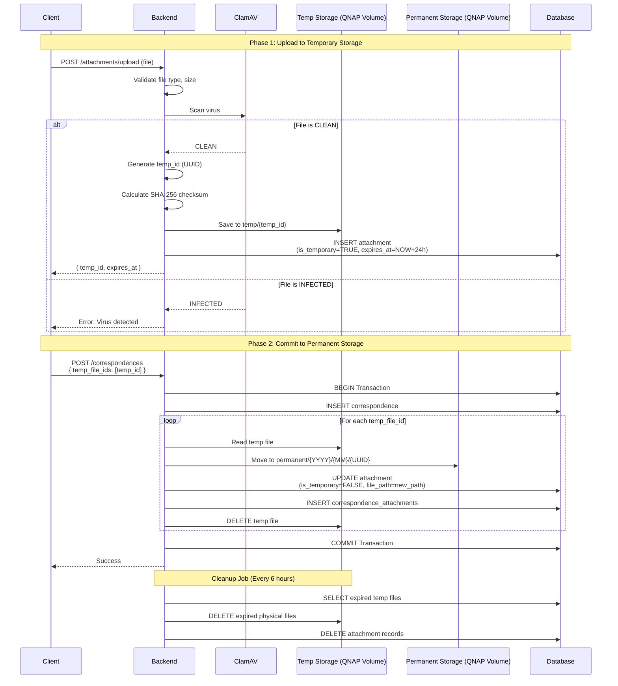

# 3.3 File Storage and Handling

---
title: 'Data & Storage: File Storage and Handling (Two-Phase)'
version: 1.8.0
status: drafted
owner: Nattanin Peancharoen
last_updated: 2026-02-22
related:
- specs/01-requirements/01-03.10-file-handling.md (Merged)
- specs/03-Data-and-Storage/ADR-003-file-storage-approach.md (Merged)
- specs/02-architecture/02-01-system-architecture.md
- ADR-006-security-best-practices
---

## 1. Overview and Core Infrastructure Requirements

เอกสารฉบับนี้รวบรวมข้อกำหนดการจัดการไฟล์และการจัดเก็บไฟล์ (File Storage Approach) สำหรับ LCBP3-DMS โดยมีข้อบังคับด้าน Infrastructure และ Security ที่สำคัญมากดังต่อไปนี้:

### 1.1 Infrastructure Requirement (การจัดเก็บและ Mount Volume)
**สำคัญ (CRITICAL SPECIFICATION):**
1. **Outside Webroot:** ไฟล์รูปและเอกสารทั้งหมดต้องถูกจัดเก็บไว้ **ภายนอก Webroot ของ Application** ห้ามเก็บไฟล์รูปหรือเอกสารไว้ใน Container หรือโฟลเดอร์ Webroot เด็ดขาด เพื่อป้องกันการเข้าถึงไฟล์โดยตรงจากสาธารณะ (Direct Public Access)
2. **QNAP Volume Mount:** ต้องใช้ **QNAP Volume Mount เข้า Docker** (Mount external volume from QNAP NAS to Docker container) สำหรับเป็นพื้นที่เก็บไฟล์ Storage ให้ Container ดึงไปใช้งาน
3. **Authenticated Endpoint:** ไฟล์ต้องถูกเข้าถึงและให้บริการดาวน์โหลดผ่าน Authenticated Endpoint ในฝั่ง Backend เท่านั้น โดยต้องผ่านการตรวจสอบสิทธิ์ (RBAC / Junction Table) เสียก่อน

### 1.2 Access & Security Rules
- **Virus Scan:** ต้องมีการ scan virus สำหรับไฟล์ที่อัปโหลดทั้งหมด โดยใช้ ClamAV หรือบริการ third-party ก่อนการบันทึก
- **Whitelist File Types:** อนุญาตเฉพาะเอกสารตามที่กำหนด: PDF, DWG, DOCX, XLSX, ZIP
- **Max File Size:** ขนาดไฟล์สูงสุดไม่เกิน 50MB ต่อไฟล์ (Total max 500MB per form submission)
- **Expiration Time:** Download links ที่สร้างขึ้นต้องมี expiration time (default: 24 ชั่วโมง)
- **Integrity Check:** ต้องมี file integrity check (checksum เป็น SHA-256) เพื่อป้องกันการแก้ไขไฟล์ภายหลัง
- **Audit Logging:** ต้องบันทึก audit log ทุกครั้งที่มีการดาวน์โหลดไฟล์สำคัญ

---

## 2. Two-Phase File Storage Approach (ADR-003)

### 2.1 Context and Problem Statement
LCBP3-DMS ต้องจัดการ File Uploads สำหรับ Attachments ของเอกสาร (PDF, DWG, DOCX, etc.) โดยต้องรับมือกับปัญหา:
1. **Orphan Files:** User อัปโหลดไฟล์แล้วไม่ Submit Form ทำให้ไฟล์ค้างใน Storage
2. **Transaction Integrity:** ถ้า Database Transaction Rollback ไฟล์ยังอยู่ใน Storage ต้องสอดคล้องกับ Database Record
3. **Virus Scanning:** ต้อง Scan ไฟล์ก่อน Save เข้าระบบถาวร
4. **File Validation:** ตรวจสอบ Type, Size, และสร้าง Checksum
5. **Storage Organization:** จัดเก็บไฟล์แยกเป็นสัดส่วน (เพื่อไม่ให้ QNAP Storage กระจัดกระจายและจำกัดขนาดได้)

### 2.2 Decision Drivers
- **Data Integrity:** File และ Database Record ต้อง Consistent
- **Security:** ป้องกัน Virus และ Malicious Files
- **User Experience:** Upload ต้องรวดเร็ว ไม่ Block UI (ถ้าอัปโหลดพร้อม Submit อาจทำให้ระบบดูค้าง)
- **Storage Efficiency:** ไม่เก็บไฟล์ที่ไม่ถูกใช้งาน (Orphan files)
- **Auditability:** ติดตามประวัติ File Operations ได้

### 2.3 Considered Options & Decision
- **Option 1:** Direct Upload to Permanent Storage (ทิ้งไฟล์ถ้า Transaction Fail / ได้ Orphan Files) - ❌
- **Option 2:** Upload after Form Submission (UX แย่ ผู้ใช้ต้องรออัปโหลดรวดเดียวท้ายสุด) - ❌
- **Option 3: Two-Phase Storage (Temp → Permanent) ⭐ (Selected Option)** - ✅

**แนวทาง Two-Phase Storage (Temp → Permanent):**
1. **Phase 1 (Upload):** ไฟล์ถูกอัปโหลดเข้าโฟลเดอร์ `temp/` ได้รับ `temp_id`
2. **Phase 2 (Commit):** เมื่อ User กด Submit ฟอร์มสำเร็จ ระบบจะย้ายไฟล์จาก `temp/` ไปยัง `permanent/{YYYY}/{MM}/` และบันทึกลง Database ใน Transaction เดียวกัน
3. **Cleanup:** มี Cron Job ทำหน้าที่ลบไฟล์ใน `temp/` ที่ค้างเกินกำหนด (เช่น 24 ชั่วโมง)

---

## 3. Implementation Details

### 3.1 Database Schema
```sql
CREATE TABLE attachments (
  id INT PRIMARY KEY AUTO_INCREMENT,
  original_filename VARCHAR(255) NOT NULL,
  stored_filename VARCHAR(255) NOT NULL,  -- UUID-based
  file_path VARCHAR(500) NOT NULL,        -- QNAP Mount path
  mime_type VARCHAR(100) NOT NULL,
  file_size INT NOT NULL,
  checksum VARCHAR(64) NULL,  -- SHA-256

  -- Two-Phase Fields
  is_temporary BOOLEAN DEFAULT TRUE,
  temp_id VARCHAR(100) NULL,  -- UUID for temp reference
  expires_at DATETIME NULL,   -- Temp file expiration

  uploaded_by_user_id INT NOT NULL,
  created_at TIMESTAMP DEFAULT CURRENT_TIMESTAMP,

  FOREIGN KEY (uploaded_by_user_id) REFERENCES users(user_id),
  INDEX idx_temp_files (is_temporary, expires_at)
);
```

### 3.2 Two-Phase Storage Flow


### 3.3 NestJS Service Implementation

```typescript
// file-storage.service.ts
import { Injectable, BadRequestException, Logger } from '@nestjs/common';
import { ConfigService } from '@nestjs/config';
import { Cron } from '@nestjs/schedule';
import { createHash } from 'crypto';
import * as fs from 'fs-extra';
import * as path from 'path';
import { v4 as uuidv4 } from 'uuid';
import { LessThan } from 'typeorm';

@Injectable()
export class FileStorageService {
  private readonly TEMP_DIR: string;
  private readonly PERMANENT_DIR: string;
  private readonly TEMP_EXPIRY_HOURS = 24;
  private readonly logger = new Logger(FileStorageService.name);

  constructor(private config: ConfigService) {
    // 💡 Must point to the QNAP Volume mount inside the container!
    this.TEMP_DIR = this.config.get('STORAGE_PATH') + '/temp';
    this.PERMANENT_DIR = this.config.get('STORAGE_PATH') + '/permanent';
  }

  // Phase 1: Upload to Temporary
  async uploadToTemp(file: Express.Multer.File): Promise<UploadResult> {
    // 1. Validate file (Size & Type)
    this.validateFile(file);

    // 2. Virus scan (ClamAV)
    await this.virusScan(file);

    // 3. Generate temp ID and File paths
    const tempId = uuidv4();
    const storedFilename = `${tempId}_${file.originalname}`;
    const tempPath = path.join(this.TEMP_DIR, storedFilename);

    // 4. Calculate checksum
    const checksum = await this.calculateChecksum(file.buffer);

    // 5. Save to temp directory (Outside Webroot via volume mount)
    await fs.writeFile(tempPath, file.buffer);

    // 6. Create attachment record in DB (Example assuming typeorm usage)
    const attachment = await this.attachmentRepo.save({
      original_filename: file.originalname,
      stored_filename: storedFilename,
      file_path: tempPath,
      mime_type: file.mimetype,
      file_size: file.size,
      checksum,
      is_temporary: true,
      temp_id: tempId,
      expires_at: new Date(Date.now() + this.TEMP_EXPIRY_HOURS * 3600 * 1000),
      uploaded_by_user_id: this.currentUserId,
    });

    return {
      temp_id: tempId,
      expires_at: attachment.expires_at,
      filename: file.originalname,
      size: file.size,
    };
  }

  // Phase 2: Commit to Permanent (within Transaction Manager)
  async commitFiles(tempIds: string[], entityId: number, entityType: string, manager: EntityManager): Promise<Attachment[]> {
    const attachments = [];

    for (const tempId of tempIds) {
      const tempAttachment = await manager.findOne(Attachment, { where: { temp_id: tempId, is_temporary: true } });
      if (!tempAttachment) throw new Error(`Temporary file not found: ${tempId}`);
      if (tempAttachment.expires_at < new Date()) throw new Error(`Temporary file expired: ${tempId}`);

      // Generate permanent path: permanent/YYYY/MM
      const now = new Date();
      const year = now.getFullYear();
      const month = (now.getMonth() + 1).toString().padStart(2, '0');
      const permanentDir = path.join(this.PERMANENT_DIR, year.toString(), month);
      await fs.ensureDir(permanentDir);

      const permanentFilename = `${uuidv4()}_${tempAttachment.original_filename}`;
      const permanentPath = path.join(permanentDir, permanentFilename);

      // Move file physically in QNAP Volume
      await fs.move(tempAttachment.file_path, permanentPath);

      // Update Database record
      await manager.update(Attachment, { id: tempAttachment.id }, {
        file_path: permanentPath,
        stored_filename: permanentFilename,
        is_temporary: false,
        temp_id: null,
        expires_at: null,
      });

      attachments.push(tempAttachment);
    }
    return attachments;
  }

  // Phase 3: Cleanup Job (Cron)
  @Cron('0 */6 * * *') // Every 6 hours
  async cleanupExpiredFiles(): Promise<void> {
    const expiredFiles = await this.attachmentRepo.find({
      where: { is_temporary: true, expires_at: LessThan(new Date()) },
    });

    for (const file of expiredFiles) {
      try {
        await fs.remove(file.file_path);
        await this.attachmentRepo.remove(file);
        this.logger.log(`Cleaned up expired file: ${file.temp_id}`);
      } catch (error) {
        this.logger.error(`Failed to cleanup file: ${file.temp_id}`, error);
      }
    }
  }

  private validateFile(file: Express.Multer.File): void {
    const allowedTypes = [
      'application/pdf',
      'application/vnd.openxmlformats-officedocument.wordprocessingml.document',
      // ... (DOCX, WHiteListed Mimetypes + XLSX, DWG, ZIP)
    ];
    const maxSize = 50 * 1024 * 1024; // 50MB
    if (!allowedTypes.includes(file.mimetype)) throw new BadRequestException('Invalid file type');
    if (file.size > maxSize) throw new BadRequestException('File too large (max 50MB)');
    // 💡 Add Magic Number Verification logic in real implementation to avoid simple extension spoofing
  }

  private async virusScan(file: Express.Multer.File): Promise<void> {
    // ClamAV integration example
    // const scanner = await this.clamAV.scan(file.buffer);
    // if (scanner.isInfected) throw new BadRequestException('Virus detected in file');
  }

  private async calculateChecksum(buffer: Buffer): Promise<string> {
    return createHash('sha256').update(buffer).digest('hex');
  }
}
```

### 3.4 API Controller Context
ในส่วนของตัว Controller ฝ่ายรับข้อมูลจะต้องแยกระหว่าง Uploading กับ Comit:
1. `POST /attachments/upload` ใช้เพื่อรับไฟล์และ Return `temp_id` แก่ User ทันที
2. `POST /correspondences` หรือ Object อื่นๆ ใช้เพื่อ Commit Database โดยจะรับ `temp_file_ids: []` พ่วงมากับ Body form

---

## 4. Consequences & Mitigation Strategies

### Positive Consequences
1. ✅ **Fast Upload UX:** User upload แบบ Async ก่อน Submit ดำเนินการลื่นไหล
2. ✅ **No Orphan Files:** เกิดระบบ Auto-cleanup จัดการไฟล์หมดอายุโดยอัตโนมัติ ไม่เปลืองสเปซ QNAP
3. ✅ **Transaction Safe:** Rollback ได้สมบูรณ์หากบันทึกฐานข้อมูลผิดพลาด ไฟล์จะถูก Cron จัดการให้ทีหลังไม่ตกค้างในระบบ
4. ✅ **Security:** Virus scan ไฟล์ก่อน Commit เข้าถึงข้อมูล Sensitive Area
5. ✅ **Audit Trail:** ติดตามประวัติ Operations ต่างๆ เพื่อความโปร่งใส
6. ✅ **Storage Organization:** จัดเก็บอย่างเป็นระเบียบ ด้วยรูปแบบ YYYY/MM ลดคอขวด IO Operations ในระบบ

### Negative Consequences & Mitigations
1. ❌ **Complexity:** ต้อง Implement 2 phases ซึ่งซับซ้อนขึ้น
   👉 *Mitigation:* รวบ Logic ทุกอย่างให้เป็น Service ชั้นเดียว (`FileStorageService`) เพื่อให้จัดการง่ายและเรียกใช้ง่ายที่สุด
2. ❌ **Extra Storage:** ต้องใช้พื้นที่ QNAP ในส่วน Temp directory ควบคู่ไปกับแบบ Permanent
   👉 *Mitigation:* คอย Monitor และปรับรอบความถี่ของการ Cleanup หากไฟล์มีปริมาณไหลเวียนเยอะมาก
3. ❌ **Edge Cases:** อาจเกิดประเด็นเรื่อง File lock หรือ missing temp files
   👉 *Mitigation:* ทำ Proper error handling พร้อม Logging ให้ตรวจสอบได้ง่าย

---

## 5. Performance Optimization Consideration
- **Streaming:** ใช้ multipart/form-data streaming เพิ่อลดภาระ Memory ของฝั่งเครื่องเซิฟเวอร์ (NestJS) ขณะสูบไฟล์ใหญ่ๆ
- **Compression:** พิจารณาเรื่องการบีบอัดสำหรับไฟล์ขนาดใหญ่หรือบางประเภท
- **Deduplication Check:** สามารถใช้งาน Field `checksum` ดักการ Commit ด้วยข้อมูลชุดเดิมที่เคยถูกอัปโหลดเพื่อประหยัดพื้นที่จัดเก็บ (Deduplicate)
