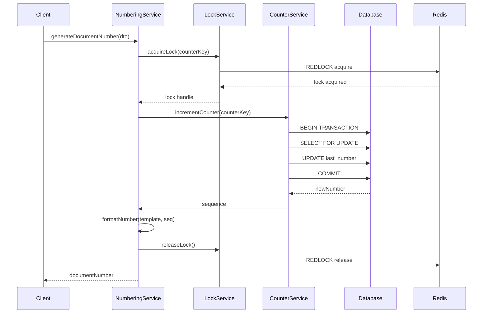
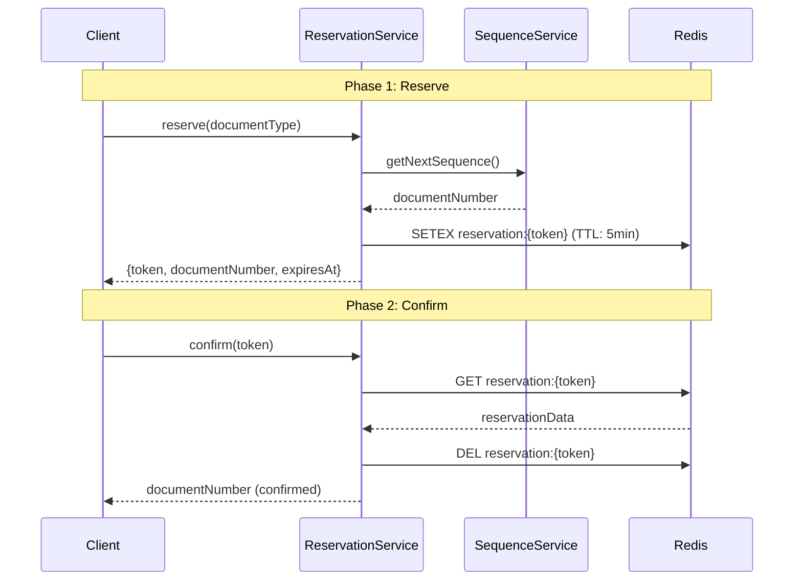
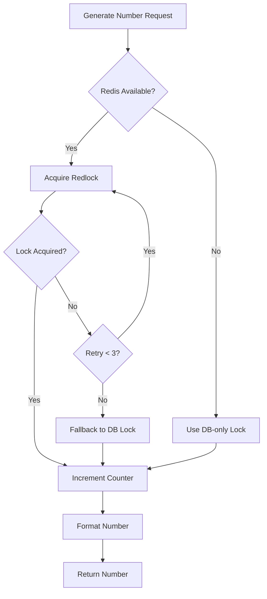

# Document Numbering Implementation Guide (Combined)

---
title: 'Implementation Guide: Document Numbering System'
version: 1.6.2
status: APPROVED
owner: Development Team
last_updated: 2025-12-17
related:
  - specs/01-requirements/03.11-document-numbering.md
  - specs/04-operations/document-numbering-operations.md
  - specs/05-decisions/ADR-002-document-numbering-strategy.md
---

## Overview

เอกสารนี้รวบรวม implementation details สำหรับระบบ Document Numbering โดยผนวกข้อมูลจาก:
- `document-numbering.md` - Core implementation และ database schema
- `document-numbering-add.md` - Extended features (Reservation, Manual Override, Monitoring)

---

## Technology Stack

| Component         | Technology           |
| ----------------- | -------------------- |
| Backend Framework | NestJS 10.x          |
| ORM               | TypeORM 0.3.x        |
| Database          | MariaDB 11.8         |
| Cache/Lock        | Redis 7.x + Redlock  |
| Message Queue     | BullMQ               |
| Monitoring        | Prometheus + Grafana |

---

## 1. Module Structure

```
backend/src/modules/document-numbering/
├── document-numbering.module.ts
├── controllers/
│   ├── document-numbering.controller.ts      # General endpoints
│   ├── document-numbering-admin.controller.ts # Admin endpoints
│   └── numbering-metrics.controller.ts       # Metrics endpoints
├── services/
│   ├── document-numbering.service.ts         # Main orchestration
│   ├── document-numbering-lock.service.ts    # Redis Lock
│   ├── counter.service.ts                    # Sequence counter logic
│   ├── reservation.service.ts                # Two-phase commit
│   ├── manual-override.service.ts            # Manual number handling
│   ├── format.service.ts                     # Template formatting
│   ├── template.service.ts                   # Template CRUD
│   ├── audit.service.ts                      # Audit logging
│   ├── metrics.service.ts                    # Prometheus metrics
│   └── migration.service.ts                  # Legacy import
├── entities/
│   ├── document-number-counter.entity.ts
│   ├── document-number-format.entity.ts
│   ├── document-number-audit.entity.ts
│   ├── document-number-error.entity.ts
│   └── document-number-reservation.entity.ts
├── dto/
│   ├── generate-number.dto.ts
│   ├── preview-number.dto.ts
│   ├── reserve-number.dto.ts
│   ├── confirm-reservation.dto.ts
│   ├── manual-override.dto.ts
│   ├── void-document.dto.ts
│   └── bulk-import.dto.ts
├── validators/
│   └── template.validator.ts
├── guards/
│   └── manual-override.guard.ts
├── decorators/
│   └── audit-numbering.decorator.ts
├── jobs/
│   └── counter-reset.job.ts
└── tests/
    ├── unit/
    ├── integration/
    └── e2e/
```

---

## 2. Database Schema

### 2.1 Format Template Table

```sql
CREATE TABLE document_number_formats (
  id INT AUTO_INCREMENT PRIMARY KEY,
  project_id INT NOT NULL,
  correspondence_type_id INT NULL, -- NULL = default format for project
  format_template VARCHAR(100) NOT NULL,
  reset_sequence_yearly TINYINT(1) DEFAULT 1,
  description VARCHAR(255),
  created_at DATETIME(6) DEFAULT CURRENT_TIMESTAMP(6),
  updated_at DATETIME(6) DEFAULT CURRENT_TIMESTAMP(6) ON UPDATE CURRENT_TIMESTAMP(6),

  UNIQUE KEY idx_unique_project_type (project_id, correspondence_type_id),
  FOREIGN KEY (project_id) REFERENCES projects(id) ON DELETE CASCADE,
  FOREIGN KEY (correspondence_type_id) REFERENCES correspondence_types(id) ON DELETE CASCADE
) ENGINE=InnoDB COMMENT='Document Number Format Templates';
```

### 2.2 Counter Table

```sql
CREATE TABLE document_number_counters (
  project_id INT NOT NULL,
  originator_organization_id INT NOT NULL,
  recipient_organization_id INT NULL,
  correspondence_type_id INT NOT NULL,
  sub_type_id INT DEFAULT 0,
  rfa_type_id INT DEFAULT 0,
  discipline_id INT DEFAULT 0,
  current_year INT NOT NULL,
  version INT DEFAULT 0 NOT NULL,
  last_number INT DEFAULT 0,

  PRIMARY KEY (
    project_id,
    originator_organization_id,
    COALESCE(recipient_organization_id, 0),
    correspondence_type_id,
    sub_type_id,
    rfa_type_id,
    discipline_id,
    current_year
  ),

  FOREIGN KEY (project_id) REFERENCES projects(id) ON DELETE CASCADE,
  FOREIGN KEY (originator_organization_id) REFERENCES organizations(id) ON DELETE CASCADE,
  FOREIGN KEY (recipient_organization_id) REFERENCES organizations(id) ON DELETE CASCADE,
  FOREIGN KEY (correspondence_type_id) REFERENCES correspondence_types(id) ON DELETE CASCADE,

  INDEX idx_counter_lookup (project_id, correspondence_type_id, current_year),
  INDEX idx_counter_org (originator_organization_id, current_year),

  CONSTRAINT chk_last_number_positive CHECK (last_number >= 0),
  CONSTRAINT chk_current_year_valid CHECK (current_year BETWEEN 2020 AND 2100)
) ENGINE=InnoDB DEFAULT CHARSET=utf8mb4 COLLATE=utf8mb4_general_ci
  COMMENT='Running Number Counters';
```

### 2.3 Audit Table

```sql
CREATE TABLE document_number_audit (
  id BIGINT AUTO_INCREMENT PRIMARY KEY,
  operation ENUM('RESERVE', 'CONFIRM', 'CANCEL', 'MANUAL_OVERRIDE', 'VOID', 'GENERATE') NOT NULL,
  document_id INT NULL COMMENT 'FK to documents (NULL initially)',
  document_type VARCHAR(50),
  generated_number VARCHAR(100) NOT NULL,
  counter_key JSON NOT NULL COMMENT 'Counter key used (JSON format)',
  template_used VARCHAR(200) NOT NULL,
  old_value TEXT NULL,
  new_value TEXT NULL,
  user_id INT NULL COMMENT 'FK to users (Allow NULL for system generation)',
  ip_address VARCHAR(45),
  user_agent TEXT,
  is_success BOOLEAN DEFAULT TRUE,
  retry_count INT DEFAULT 0,
  lock_wait_ms INT COMMENT 'Lock acquisition time in milliseconds',
  total_duration_ms INT COMMENT 'Total generation time',
  fallback_used ENUM('NONE', 'DB_LOCK', 'RETRY') DEFAULT 'NONE',
  metadata JSON NULL,
  created_at TIMESTAMP DEFAULT CURRENT_TIMESTAMP,

  INDEX idx_operation (operation),
  INDEX idx_document_id (document_id),
  INDEX idx_document_number (generated_number),
  INDEX idx_user_id (user_id),
  INDEX idx_created_at (created_at),
  FOREIGN KEY (document_id) REFERENCES documents(id) ON DELETE CASCADE,
  FOREIGN KEY (user_id) REFERENCES users(id)
) ENGINE=InnoDB COMMENT='Document Number Generation Audit Trail';
```

### 2.4 Error Log Table

```sql
CREATE TABLE document_number_errors (
  id BIGINT AUTO_INCREMENT PRIMARY KEY,
  error_type ENUM(
    'LOCK_TIMEOUT',
    'VERSION_CONFLICT',
    'DB_ERROR',
    'REDIS_ERROR',
    'VALIDATION_ERROR',
    'SEQUENCE_EXHAUSTED',
    'RESERVATION_EXPIRED',
    'DUPLICATE_NUMBER'
  ) NOT NULL,
  error_message TEXT,
  stack_trace TEXT,
  context_data JSON COMMENT 'Request context (user, project, etc.)',
  user_id INT,
  ip_address VARCHAR(45),
  created_at TIMESTAMP DEFAULT CURRENT_TIMESTAMP,
  resolved_at TIMESTAMP NULL,

  INDEX idx_error_type (error_type),
  INDEX idx_created_at (created_at),
  INDEX idx_user_id (user_id)
) ENGINE=InnoDB COMMENT='Document Numbering Error Log';
```

---

## 3. Core Services

### 3.1 Number Generation Process



### 3.2 Two-Phase Commit (Reserve/Confirm)



### 3.3 Counter Service Implementation

```typescript
// services/counter.service.ts
@Injectable()
export class CounterService {
  private readonly logger = new Logger(CounterService.name);

  constructor(
    @InjectRepository(DocumentNumberCounter)
    private counterRepo: Repository<DocumentNumberCounter>,
    private dataSource: DataSource,
  ) {}

  async incrementCounter(counterKey: CounterKey): Promise<number> {
    const MAX_RETRIES = 2;

    for (let attempt = 0; attempt < MAX_RETRIES; attempt++) {
      try {
        return await this.dataSource.transaction(async (manager) => {
          // ใช้ Optimistic Locking
          const counter = await manager.findOne(DocumentNumberCounter, {
            where: this.buildWhereClause(counterKey),
          });

          if (!counter) {
            const newCounter = manager.create(DocumentNumberCounter, {
              ...counterKey,
              lastNumber: 1,
              version: 0,
            });
            await manager.save(newCounter);
            return 1;
          }

          counter.lastNumber += 1;
          await manager.save(counter); // Auto-check version
          return counter.lastNumber;
        });
      } catch (error) {
        if (error instanceof OptimisticLockVersionMismatchError) {
          this.logger.warn(`Version conflict, retry ${attempt + 1}/${MAX_RETRIES}`);
          if (attempt === MAX_RETRIES - 1) {
            throw new ConflictException('เลขที่เอกสารถูกเปลี่ยน กรุณาลองใหม่');
          }
          continue;
        }
        throw error;
      }
    }
  }
}
```

### 3.4 Redis Lock Service

```typescript
// services/document-numbering-lock.service.ts
@Injectable()
export class DocumentNumberingLockService {
  private readonly logger = new Logger(DocumentNumberingLockService.name);
  private redlock: Redlock;

  constructor(@InjectRedis() private readonly redis: Redis) {
    this.redlock = new Redlock([redis], {
      driftFactor: 0.01,
      retryCount: 5,
      retryDelay: 100,
      retryJitter: 50,
    });
  }

  async acquireLock(counterKey: CounterKey): Promise<Redlock.Lock> {
    const lockKey = this.buildLockKey(counterKey);
    const ttl = 5000; // 5 seconds

    try {
      const lock = await this.redlock.acquire([lockKey], ttl);
      this.logger.debug(`Acquired lock: ${lockKey}`);
      return lock;
    } catch (error) {
      this.logger.error(`Failed to acquire lock: ${lockKey}`, error);
      throw error;
    }
  }

  async releaseLock(lock: Redlock.Lock): Promise<void> {
    try {
      await lock.release();
    } catch (error) {
      this.logger.warn('Failed to release lock (may have expired)', error);
    }
  }

  private buildLockKey(key: CounterKey): string {
    return `lock:docnum:${key.projectId}:${key.originatorOrgId}:` +
           `${key.recipientOrgId ?? 0}:${key.correspondenceTypeId}:` +
           `${key.subTypeId}:${key.rfaTypeId}:${key.disciplineId}:${key.year}`;
  }
}
```

### 3.5 Reservation Service

```typescript
// services/reservation.service.ts
@Injectable()
export class ReservationService {
  private readonly TTL = 300; // 5 minutes

  constructor(
    private redis: Redis,
    private sequenceService: SequenceService,
    private auditService: AuditService,
  ) {}

  async reserve(
    documentType: string,
    scopeValue?: string,
    metadata?: Record<string, any>,
  ): Promise<Reservation> {
    // 1. Generate next number
    const documentNumber = await this.sequenceService.getNextSequence(
      documentType,
      scopeValue,
    );

    // 2. Generate reservation token
    const token = uuidv4();
    const expiresAt = new Date(Date.now() + this.TTL * 1000);

    // 3. Save to Redis
    const reservation: Reservation = {
      token,
      document_number: documentNumber,
      document_type: documentType,
      scope_value: scopeValue,
      expires_at: expiresAt,
      metadata,
    };

    await this.redis.setex(
      `reservation:${token}`,
      this.TTL,
      JSON.stringify(reservation),
    );

    // 4. Audit log
    await this.auditService.log({
      operation: 'RESERVE',
      document_type: documentType,
      document_number: documentNumber,
      metadata: { token, scope_value: scopeValue },
    });

    return reservation;
  }

  async confirm(token: string, userId: number): Promise<string> {
    const reservation = await this.getReservation(token);

    if (!reservation) {
      throw new ReservationExpiredError(
        'Reservation not found or expired. Please reserve a new number.',
      );
    }

    await this.redis.del(`reservation:${token}`);

    await this.auditService.log({
      operation: 'CONFIRM',
      document_type: reservation.document_type,
      document_number: reservation.document_number,
      user_id: userId,
      metadata: { token },
    });

    return reservation.document_number;
  }

  async cancel(token: string, userId: number): Promise<void> {
    const reservation = await this.getReservation(token);

    if (reservation) {
      await this.redis.del(`reservation:${token}`);

      await this.auditService.log({
        operation: 'CANCEL',
        document_type: reservation.document_type,
        document_number: reservation.document_number,
        user_id: userId,
        metadata: { token },
      });
    }
  }

  @Cron('0 */5 * * * *') // Every 5 minutes
  async cleanupExpired(): Promise<void> {
    const keys = await this.redis.keys('reservation:*');
    for (const key of keys) {
      const ttl = await this.redis.ttl(key);
      if (ttl <= 0) {
        await this.redis.del(key);
      }
    }
  }
}
```

---

## 4. Template System

### 4.1 Supported Tokens

| Token          | Description                  | Example Output |
| -------------- | ---------------------------- | -------------- |
| `{PROJECT}`    | Project Code                 | `LCBP3`        |
| `{ORIGINATOR}` | Originator Organization Code | `คคง.`         |
| `{RECIPIENT}`  | Recipient Organization Code  | `สคฉ.3`        |
| `{CORR_TYPE}`  | Correspondence Type Code     | `L`            |
| `{SUB_TYPE}`   | Sub Type Code                | `TD`           |
| `{RFA_TYPE}`   | RFA Type Code                | `RFA`          |
| `{DISCIPLINE}` | Discipline Code              | `CV`           |
| `{SEQ:n}`      | Sequence Number (n digits)   | `0001`         |
| `{YEAR:CE}`    | Year (Common Era)            | `2025`         |
| `{YEAR:BE}`    | Year (Buddhist Era)          | `2568`         |
| `{REV}`        | Revision Number              | `A`            |

### 4.2 Template Validation

```typescript
// validators/template.validator.ts
@Injectable()
export class TemplateValidator {
  private readonly ALLOWED_TOKENS = [
    'PROJECT', 'ORIGINATOR', 'RECIPIENT', 'CORR_TYPE',
    'SUB_TYPE', 'RFA_TYPE', 'DISCIPLINE', 'SEQ', 'YEAR', 'REV',
  ];

  validate(template: string, correspondenceType: string): ValidationResult {
    const tokens = this.extractTokens(template);
    const errors: string[] = [];

    // ตรวจสอบ Token ที่ไม่รู้จัก
    for (const token of tokens) {
      if (!this.ALLOWED_TOKENS.includes(token.name)) {
        errors.push(`Unknown token: {${token.name}}`);
      }
    }

    // กฎพิเศษสำหรับแต่ละประเภท
    if (correspondenceType === 'RFA') {
      if (!tokens.some((t) => t.name === 'PROJECT')) {
        errors.push('RFA template ต้องมี {PROJECT}');
      }
      if (!tokens.some((t) => t.name === 'DISCIPLINE')) {
        errors.push('RFA template ต้องมี {DISCIPLINE}');
      }
    }

    if (correspondenceType === 'TRANSMITTAL') {
      if (!tokens.some((t) => t.name === 'SUB_TYPE')) {
        errors.push('TRANSMITTAL template ต้องมี {SUB_TYPE}');
      }
    }

    // ทุก template ต้องมี {SEQ}
    if (!tokens.some((t) => t.name.startsWith('SEQ'))) {
      errors.push('Template ต้องมี {SEQ:n}');
    }

    return { valid: errors.length === 0, errors };
  }
}
```

---

## 5. API Endpoints

### 5.1 General Endpoints (`/document-numbering`)

| Endpoint        | Method | Permission               | Description                       |
| --------------- | ------ | ------------------------ | --------------------------------- |
| `/logs/audit`   | GET    | `system.view_logs`       | Get audit logs                    |
| `/logs/errors`  | GET    | `system.view_logs`       | Get error logs                    |
| `/sequences`    | GET    | `correspondence.read`    | Get counter sequences             |
| `/counters/:id` | PATCH  | `system.manage_settings` | Update counter value              |
| `/preview`      | POST   | `correspondence.read`    | Preview number without generating |
| `/reserve`      | POST   | `correspondence.create`  | Reserve a document number         |
| `/confirm`      | POST   | `correspondence.create`  | Confirm a reservation             |
| `/cancel`       | POST   | `correspondence.create`  | Cancel a reservation              |

### 5.2 Admin Endpoints (`/admin/document-numbering`)

| Endpoint            | Method | Permission               | Description             |
| ------------------- | ------ | ------------------------ | ----------------------- |
| `/templates`        | GET    | `system.manage_settings` | Get all templates       |
| `/templates`        | POST   | `system.manage_settings` | Create/update template  |
| `/templates/:id`    | DELETE | `system.manage_settings` | Delete template         |
| `/metrics`          | GET    | `system.view_logs`       | Get metrics             |
| `/manual-override`  | POST   | `system.manage_settings` | Override counter value  |
| `/void-and-replace` | POST   | `system.manage_settings` | Void and replace number |
| `/cancel`           | POST   | `system.manage_settings` | Cancel a number         |
| `/bulk-import`      | POST   | `system.manage_settings` | Bulk import counters    |

---

## 6. Monitoring & Observability

### 6.1 Prometheus Metrics

```typescript
@Injectable()
export class NumberingMetrics {
  // Counter: Total numbers generated
  private readonly numbersGenerated = new Counter({
    name: 'numbering_sequences_total',
    help: 'Total document numbers generated',
    labelNames: ['document_type'],
  });

  // Gauge: Sequence utilization (%)
  private readonly sequenceUtilization = new Gauge({
    name: 'numbering_sequence_utilization',
    help: 'Sequence utilization percentage',
    labelNames: ['document_type'],
  });

  // Histogram: Lock wait time
  private readonly lockWaitTime = new Histogram({
    name: 'numbering_lock_wait_seconds',
    help: 'Time spent waiting for lock acquisition',
    labelNames: ['document_type'],
    buckets: [0.01, 0.05, 0.1, 0.5, 1, 2, 5],
  });

  // Counter: Lock failures
  private readonly lockFailures = new Counter({
    name: 'numbering_lock_failures_total',
    help: 'Total lock acquisition failures',
    labelNames: ['document_type', 'reason'],
  });
}
```

### 6.2 Alert Rules

| Alert              | Condition          | Severity | Action                 |
| ------------------ | ------------------ | -------- | ---------------------- |
| `SequenceCritical` | Utilization > 95%  | Critical | Extend max_value       |
| `SequenceWarning`  | Utilization > 90%  | Warning  | Plan extension         |
| `HighLockWaitTime` | p95 > 1s           | Warning  | Check Redis health     |
| `RedisUnavailable` | Redis cluster down | Critical | Switch to DB-only mode |
| `HighErrorRate`    | > 10 errors/sec    | Warning  | Check logs             |

---

## 7. Error Handling

### 7.1 Error Codes

| Code  | Name                        | Description                |
| ----- | --------------------------- | -------------------------- |
| NB001 | CONFIG_NOT_FOUND            | Config not found for type  |
| NB002 | SEQUENCE_EXHAUSTED          | Sequence reached max value |
| NB003 | LOCK_TIMEOUT                | Failed to acquire lock     |
| NB004 | RESERVATION_EXPIRED         | Reservation token expired  |
| NB005 | DUPLICATE_NUMBER            | Number already exists      |
| NB006 | INVALID_FORMAT              | Number format invalid      |
| NB007 | MANUAL_OVERRIDE_NOT_ALLOWED | Manual override disabled   |
| NB008 | REDIS_UNAVAILABLE           | Redis connection failed    |

### 7.2 Fallback Strategy



---

## 8. Testing

### 8.1 Unit Tests
```bash
# Run unit tests
pnpm test:watch -- --testPathPattern=document-numbering
```

### 8.2 Integration Tests
```bash
# Run integration tests
pnpm test:e2e -- --testPathPattern=numbering
```

### 8.3 Concurrency Test
```typescript
// tests/load/concurrency.spec.ts
it('should handle 1000 concurrent requests without duplicates', async () => {
  const promises = Array.from({ length: 1000 }, () =>
    request(app.getHttpServer())
      .post('/document-numbering/reserve')
      .send({ document_type: 'COR' })
  );

  const results = await Promise.all(promises);
  const numbers = results.map(r => r.body.data.document_number);
  const uniqueNumbers = new Set(numbers);

  expect(uniqueNumbers.size).toBe(1000);
});
```

---

## 9. Best Practices

### 9.1 DO's ✅
- ✅ Always use two-phase commit (reserve + confirm)
- ✅ Implement fallback to DB-only if Redis fails
- ✅ Log every operation to audit trail
- ✅ Monitor sequence utilization (alert at 90%)
- ✅ Test under concurrent load (1000+ req/s)
- ✅ Use pessimistic locking in database
- ✅ Set reasonable TTL for reservations (5 min)
- ✅ Validate manual override format
- ✅ Skip cancelled numbers (never reuse)

### 9.2 DON'Ts ❌
- ❌ Never skip validation for manual override
- ❌ Never reuse cancelled numbers
- ❌ Never trust client-generated numbers
- ❌ Never increase sequence without transaction
- ❌ Never deploy without load testing
- ❌ Never modify sequence table directly
- ❌ Never skip audit logging

---

## 10. Environment Variables

```bash
# Redis Configuration
REDIS_HOST=localhost
REDIS_PORT=6379
REDIS_PASSWORD=
REDIS_CLUSTER_NODES=redis-1:6379,redis-2:6379,redis-3:6379

# Database
DB_HOST=localhost
DB_PORT=3306
DB_USERNAME=lcbp3
DB_PASSWORD=
DB_DATABASE=lcbp3_db
DB_POOL_SIZE=20

# Numbering Configuration
NUMBERING_LOCK_TIMEOUT=5000       # 5 seconds
NUMBERING_RESERVATION_TTL=300     # 5 minutes
NUMBERING_RETRY_ATTEMPTS=3
NUMBERING_RETRY_DELAY=200         # milliseconds

# Monitoring
PROMETHEUS_PORT=9090
GRAFANA_PORT=3000
```

---

## References

- [Requirements](file:///d:/nap-dms.lcbp3/specs/01-requirements/03.11-document-numbering.md)
- [Operations Guide](file:///d:/nap-dms.lcbp3/specs/04-operations/document-numbering-operations.md)
- [ADR-018 Document Numbering](file:///d:/nap-dms.lcbp3/specs/05-decisions/adr-018-document-numbering.md)
- [Backend Guidelines](file:///d:/nap-dms.lcbp3/specs/03-implementation/backend-guidelines.md)

---

**Document Version**: 2.0.0
**Created By**: Development Team
**Last Updated**: 2025-12-17
