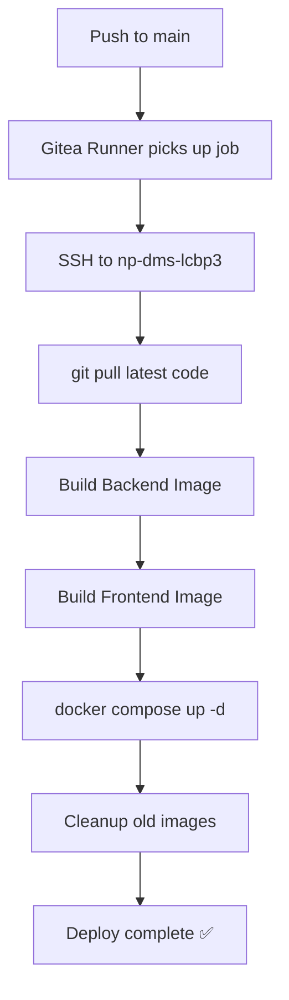

# Deployment Guide: LCBP3-DMS

---

**Project:** LCBP3-DMS (Laem Chabang Port Phase 3 - Document Management System)
**Version:** 1.9.17
**Last Updated:** 2026-09-02
**Owner:** Operations Team
**Status:** Active

---

## 📋 Overview

This guide provides step-by-step instructions for deploying the LCBP3-DMS system on `np-dms-lcbp3` (192.168.10.11) running Docker Compose V2 on Ubuntu/Debian.

> 📌 **Post-ADR-041 (Server Consolidation, 2026-06-20):** All services have been consolidated onto a single host `np-dms-lcbp3`. The QNAP TS-473A is decommissioned as a Docker host (now NAS/backup only). The ASUSTOR AS5403T (192.168.10.9) still runs monitoring/registry/gitea-runner. Pre-ADR-041 QNAP-specific content is preserved in the appendices, marked **⚠️ Archived (pre-ADR-041)**.

### Deployment Strategy

- **Platform:** np-dms-lcbp3 (Ubuntu/Debian, Docker Compose V2)
- **Host IP:** 192.168.10.11
- **Orchestration:** Docker Compose V2 (4-layer stack at `/opt/np-dms/`)
- **Deployment Method:** Direct deploy with `--force-recreate` (replaces previous blue-green approach)
- **Automation:** Gitea Actions → `appleboy/ssh-action` → `scripts/deploy.sh` (build + tag SHA + health check + auto-rollback per ADR-015)
- **Image Tagging:** `lcbp3-backend:${SHA}` + `lcbp3-backend:latest` (ADR-015)
- **Rollback:** Re-trigger previous commit via Gitea Actions (auto-rollback per ADR-015)

---

## 🎯 Prerequisites

### Hardware Requirements

| Component  | Minimum Specification      |
| ---------- | -------------------------- |
| CPU        | 4 cores @ 2.0 GHz          |
| RAM        | 16 GB                      |
| Storage    | 500 GB SSD (System + Data) |
| Network    | 1 Gbps Ethernet            |
| Host       | np-dms-lcbp3 (192.168.10.11) or equivalent |

### Software Requirements

| Software        | Version | Purpose                  |
| --------------- | ------- | ------------------------ |
| Ubuntu/Debian   | 22.04+  | Operating System         |
| Docker          | 24.x+   | Container Runtime        |
| Docker Compose  | V2      | Multi-container Orchestr |

### Network Requirements

- Static IP address for np-dms-lcbp3 (192.168.10.11)
- Domain name (e.g., `lcbp3-dms.example.com`)
- SSL certificate (Let's Encrypt or commercial)
- Firewall rules:
  - Port 80 (HTTP → HTTPS redirect)
  - Port 443 (HTTPS)
  - Port 22 (SSH for management)

---

## 🏗️ Infrastructure Setup

### 1. Directory Structure

Create the following directory structure on `np-dms-lcbp3`:

```bash
# SSH into np-dms-lcbp3
ssh admin@192.168.10.11

# Create base directories (4-layer Docker stack)
mkdir -p /opt/np-dms/00-basic
mkdir -p /opt/np-dms/01-infrastructure
mkdir -p /opt/np-dms/02-platform
mkdir -p /opt/np-dms/03-application
mkdir -p /opt/np-dms/04-ai/ocr-sidecar

# Clone source repository (first time only)
mkdir -p /opt/np-dms-lcbp3
cd /opt/np-dms-lcbp3
git clone https://git.np-dms.work/np-dms/lcbp3.git .

# Create persistent volumes
mkdir -p /opt/np-dms/volumes/mariadb-data
mkdir -p /opt/np-dms/volumes/redis-data
mkdir -p /opt/np-dms/volumes/elastic-data

# Create NGINX proxy directory
mkdir -p /opt/np-dms/nginx-proxy

# Set permissions
chmod -R 755 /opt/np-dms
chown -R admin:admin /opt/np-dms
```

**Directory Structure (post-ADR-041):**

```
/opt/np-dms/                        # 4-layer Docker stack
├── .env                            # Single environment config file (shared by all layers)
├── 00-basic/
│   └── docker-compose.yml          # portainer
├── 01-infrastructure/
│   └── docker-compose.yml          # mariadb, pma, redis, elasticsearch, qdrant, exporters
├── 02-platform/
│   └── docker-compose.yml          # gitea, n8n
├── 03-application/
│   └── docker-compose.yml          # clamav, backend, frontend
├── 04-ai/
│   ├── docker-compose.yml          # ollama-metrics, nvidia-gpu-exporter
│   └── ocr-sidecar/
│       └── docker-compose.yml      # FastAPI OCR sidecar (BGE-M3 + BGE-Reranker)
├── dockerup.sh                     # Start all layers after reboot
├── dockerstart.sh                  # Start stopped containers (no recreate)
└── volumes/                        # Persistent volumes
    ├── mariadb-data/
    ├── redis-data/
    └── elastic-data/

/opt/np-dms-lcbp3/                  # Source repository (auto-synced by CI)
├── backend/
├── frontend/
├── scripts/
│   ├── deploy.sh                   # Deployment script (build + tag SHA + health check)
│   └── rollback.sh
└── specs/04-Infrastructure-OPS/04-00-docker-compose/np-dms-lcbp3/
    └── <layer>/                    # Compose files synced from live /opt/np-dms/<layer>/
```

### 2. SSL Certificate Setup

```bash
# Option 1: Let's Encrypt (Recommended)
# Install certbot on np-dms-lcbp3
sudo apt install certbot

# Generate certificate
certbot certonly --standalone \
  -d lcbp3-dms.example.com \
  --email admin@example.com \
  --agree-tos

# Copy to nginx-proxy
cp /etc/letsencrypt/live/lcbp3-dms.example.com/fullchain.pem \
   /opt/np-dms/nginx-proxy/ssl/cert.pem
cp /etc/letsencrypt/live/lcbp3-dms.example.com/privkey.pem \
   /opt/np-dms/nginx-proxy/ssl/key.pem

# Option 2: Commercial Certificate
# Upload cert.pem and key.pem to /opt/np-dms/nginx-proxy/ssl/
```

---

## 📝 Configuration Files

### 1. Environment Variables (.env.production)

Create `.env` at `/opt/np-dms/.env`:

```bash
# File: /opt/np-dms/.env
# DO NOT commit this file to Git!

# Application
NODE_ENV=production
APP_NAME=LCBP3-DMS
APP_URL=https://lcbp3-dms.example.com

# Database
DB_HOST=lcbp3-mariadb
DB_PORT=3306
DB_USERNAME=lcbp3_user
DB_PASSWORD=<CHANGE_ME_STRONG_PASSWORD>
DB_DATABASE=lcbp3_dms
DB_POOL_SIZE=20

# Redis
REDIS_HOST=lcbp3-redis
REDIS_PORT=6379
REDIS_PASSWORD=<CHANGE_ME_STRONG_PASSWORD>
REDIS_DB=0

# JWT Authentication
JWT_SECRET=<CHANGE_ME_RANDOM_64_CHAR_STRING>
JWT_EXPIRES_IN=8h
JWT_REFRESH_EXPIRES_IN=7d

# File Storage
UPLOAD_PATH=/app/uploads
MAX_FILE_SIZE=52428800
ALLOWED_FILE_TYPES=.pdf,.doc,.docx,.xls,.xlsx,.dwg,.zip

# Email (SMTP)
SMTP_HOST=smtp.gmail.com
SMTP_PORT=587
SMTP_SECURE=false
SMTP_USERNAME=<YOUR_EMAIL>
SMTP_PASSWORD=<YOUR_APP_PASSWORD>
SMTP_FROM=noreply@example.com

# Elasticsearch
ELASTICSEARCH_NODE=http://lcbp3-elasticsearch:9200
ELASTICSEARCH_USERNAME=elastic
ELASTICSEARCH_PASSWORD=<CHANGE_ME>

# Rate Limiting
THROTTLE_TTL=60
THROTTLE_LIMIT=100

# Logging
LOG_LEVEL=info
LOG_FILE_PATH=/app/logs

# ClamAV (Virus Scanning)
CLAMAV_HOST=lcbp3-clamav
CLAMAV_PORT=3310
```

### 2. Docker Compose - Blue Environment

> ⚠️ **Archived (pre-ADR-041):** The blue-green deployment approach has been replaced by direct deploy with `--force-recreate` on the single-host 4-layer stack at `/opt/np-dms/`. This config is preserved for historical reference. Active compose files live at `/opt/np-dms/<layer>/docker-compose.yml` (synced to repo `specs/04-Infrastructure-OPS/04-00-docker-compose/np-dms-lcbp3/<layer>/`).

```yaml
# File: /volume1/lcbp3/blue/docker-compose.yml
version: '3.8'

services:
  backend:
    image: lcbp3-backend:latest
    container_name: lcbp3-blue-backend
    restart: unless-stopped
    env_file:
      - .env.production
    volumes:
      - /volume1/lcbp3/shared/uploads:/app/uploads
      - /volume1/lcbp3/shared/logs:/app/logs
    depends_on:
      - mariadb
      - redis
      - elasticsearch
    networks:
      - lcbp3-network
    healthcheck:
      test: ['CMD', 'curl', '-f', 'http://localhost:3000/health']
      interval: 30s
      timeout: 10s
      retries: 3
      start_period: 40s

  frontend:
    image: lcbp3-frontend:latest
    container_name: lcbp3-blue-frontend
    restart: unless-stopped
    environment:
      - NEXT_PUBLIC_API_URL=https://lcbp3-dms.example.com/api
    depends_on:
      - backend
    networks:
      - lcbp3-network
    healthcheck:
      test: ['CMD', 'curl', '-f', 'http://localhost:3000']
      interval: 30s
      timeout: 10s
      retries: 3

  mariadb:
    image: mariadb:11.8
    container_name: lcbp3-mariadb
    restart: unless-stopped
    environment:
      MYSQL_ROOT_PASSWORD: ${DB_PASSWORD}
      MYSQL_DATABASE: ${DB_DATABASE}
      MYSQL_USER: ${DB_USERNAME}
      MYSQL_PASSWORD: ${DB_PASSWORD}
    volumes:
      - /volume1/lcbp3/volumes/mariadb-data:/var/lib/mysql
    networks:
      - lcbp3-network
    command: >
      --character-set-server=utf8mb4
      --collation-server=utf8mb4_unicode_ci
      --max_connections=200
      --innodb_buffer_pool_size=2G
    healthcheck:
      test: ['CMD', 'mysqladmin', 'ping', '-h', 'localhost']
      interval: 10s
      timeout: 5s
      retries: 5

  redis:
    image: redis:7-alpine
    container_name: lcbp3-redis
    restart: unless-stopped
    command: >
      redis-server
      --requirepass ${REDIS_PASSWORD}
      --appendonly yes
      --appendfsync everysec
      --maxmemory 2gb
      --maxmemory-policy allkeys-lru
    volumes:
      - /volume1/lcbp3/volumes/redis-data:/data
    networks:
      - lcbp3-network
    healthcheck:
      test: ['CMD', 'redis-cli', 'ping']
      interval: 10s
      timeout: 3s
      retries: 3

  elasticsearch:
    image: elasticsearch:8.11.0
    container_name: lcbp3-elasticsearch
    restart: unless-stopped
    environment:
      - discovery.type=single-node
      - xpack.security.enabled=true
      - ELASTIC_PASSWORD=${ELASTICSEARCH_PASSWORD}
      - 'ES_JAVA_OPTS=-Xms2g -Xmx2g'
    volumes:
      - /volume1/lcbp3/volumes/elastic-data:/usr/share/elasticsearch/data
    networks:
      - lcbp3-network
    healthcheck:
      test: ['CMD-SHELL', 'curl -f http://localhost:9200/_cluster/health || exit 1']
      interval: 30s
      timeout: 10s
      retries: 5

networks:
  lcbp3-network:
    name: lcbp3-blue-network
    driver: bridge
```

### 3. Docker Compose - NGINX Proxy

> ⚠️ **Archived (pre-ADR-041):** Historical NGINX proxy config preserved for reference. Post-ADR-041, NGINX/reverse-proxy is managed within the 4-layer stack.

```yaml
# File: /volume1/lcbp3/nginx-proxy/docker-compose.yml
version: '3.8'

services:
  nginx:
    image: nginx:alpine
    container_name: lcbp3-nginx
    restart: unless-stopped
    ports:
      - '80:80'
      - '443:443'
    volumes:
      - ./nginx.conf:/etc/nginx/nginx.conf:ro
      - ./ssl:/etc/nginx/ssl:ro
      - /volume1/lcbp3/shared/logs/nginx:/var/log/nginx
    networks:
      - lcbp3-blue-network
      - lcbp3-green-network
    healthcheck:
      test: ['CMD', 'nginx', '-t']
      interval: 30s
      timeout: 10s
      retries: 3

networks:
  lcbp3-blue-network:
    external: true
  lcbp3-green-network:
    external: true
```

### 4. NGINX Configuration

> ⚠️ **Archived (pre-ADR-041):** Historical NGINX configuration preserved for reference.

```nginx
# File: /volume1/lcbp3/nginx-proxy/nginx.conf

user nginx;
worker_processes auto;
error_log /var/log/nginx/error.log warn;
pid /var/run/nginx.pid;

events {
    worker_connections 1024;
}

http {
    include /etc/nginx/mime.types;
    default_type application/octet-stream;

    log_format main '$remote_addr - $remote_user [$time_local] "$request" '
                    '$status $body_bytes_sent "$http_referer" '
                    '"$http_user_agent" "$http_x_forwarded_for"';

    access_log /var/log/nginx/access.log main;

    sendfile on;
    tcp_nopush on;
    tcp_nodelay on;
    keepalive_timeout 65;
    types_hash_max_size 2048;
    client_max_body_size 50M;

    # Gzip compression
    gzip on;
    gzip_vary on;
    gzip_proxied any;
    gzip_comp_level 6;
    gzip_types text/plain text/css text/xml text/javascript
               application/json application/javascript application/xml+rss;

    # Upstream backends (switch between blue/green)
    upstream backend {
        server lcbp3-blue-backend:3000 max_fails=3 fail_timeout=30s;
        keepalive 32;
    }

    upstream frontend {
        server lcbp3-blue-frontend:3000 max_fails=3 fail_timeout=30s;
        keepalive 32;
    }

    # HTTP to HTTPS redirect
    server {
        listen 80;
        server_name lcbp3-dms.example.com;
        return 301 https://$server_name$request_uri;
    }

    # HTTPS server
    server {
        listen 443 ssl http2;
        server_name lcbp3-dms.example.com;

        # SSL configuration
        ssl_certificate /etc/nginx/ssl/cert.pem;
        ssl_certificate_key /etc/nginx/ssl/key.pem;
        ssl_protocols TLSv1.2 TLSv1.3;
        ssl_ciphers HIGH:!aNULL:!MD5;
        ssl_prefer_server_ciphers on;
        ssl_session_cache shared:SSL:10m;
        ssl_session_timeout 10m;

        # Security headers
        add_header Strict-Transport-Security "max-age=31536000; includeSubDomains" always;
        add_header X-Frame-Options "SAMEORIGIN" always;
        add_header X-Content-Type-Options "nosniff" always;
        add_header X-XSS-Protection "1; mode=block" always;

        # Frontend (Next.js)
        location / {
            proxy_pass http://frontend;
            proxy_http_version 1.1;
            proxy_set_header Upgrade $http_upgrade;
            proxy_set_header Connection 'upgrade';
            proxy_set_header Host $host;
            proxy_set_header X-Real-IP $remote_addr;
            proxy_set_header X-Forwarded-For $proxy_add_x_forwarded_for;
            proxy_set_header X-Forwarded-Proto $scheme;
            proxy_cache_bypass $http_upgrade;
        }

        # Backend API
        location /api {
            proxy_pass http://backend;
            proxy_http_version 1.1;
            proxy_set_header Connection "";
            proxy_set_header Host $host;
            proxy_set_header X-Real-IP $remote_addr;
            proxy_set_header X-Forwarded-For $proxy_add_x_forwarded_for;
            proxy_set_header X-Forwarded-Proto $scheme;

            # Timeouts for file uploads
            proxy_connect_timeout 300s;
            proxy_send_timeout 300s;
            proxy_read_timeout 300s;
        }

        # Health check endpoint (no logging)
        location /health {
            proxy_pass http://backend/health;
            access_log off;
        }

        # Static files caching
        location ~* \.(jpg|jpeg|png|gif|ico|css|js|svg|woff|woff2|ttf|eot)$ {
            proxy_pass http://frontend;
            expires 1y;
            add_header Cache-Control "public, immutable";
        }
    }
}
```

---

## ✏️ Live Edit Protocol

> 📌 **Post-ADR-041 workflow** for editing Docker Compose files on the consolidated host `np-dms-lcbp3`.

### Edit Workflow

1. **Edit live first** — make changes directly on the host at `/opt/np-dms/<layer>/docker-compose.yml`.
2. **Apply the change** — recreate the affected layer using `docker compose` with the shared env file.
3. **Sync back to repo** — copy the verified live compose file back into the repository at `specs/04-Infrastructure-OPS/04-00-docker-compose/np-dms-lcbp3/<layer>/docker-compose.yml` and commit.
4. **Never edit the repo copy first** — the live file on the host is the source of truth; the repo is the backup/audit copy.

### Layer Mapping

| Layer | Live Path | Repo Sync Path |
| ----- | --------- | -------------- |
| 00-basic | `/opt/np-dms/00-basic/docker-compose.yml` | `specs/04-Infrastructure-OPS/04-00-docker-compose/np-dms-lcbp3/00-basic/` |
| 01-infrastructure | `/opt/np-dms/01-infrastructure/docker-compose.yml` | `specs/04-Infrastructure-OPS/04-00-docker-compose/np-dms-lcbp3/01-infrastructure/` |
| 02-platform | `/opt/np-dms/02-platform/docker-compose.yml` | `specs/04-Infrastructure-OPS/04-00-docker-compose/np-dms-lcbp3/02-platform/` |
| 03-application | `/opt/np-dms/03-application/docker-compose.yml` | `specs/04-Infrastructure-OPS/04-00-docker-compose/np-dms-lcbp3/03-application/` |
| 04-ai | `/opt/np-dms/04-ai/docker-compose.yml` | `specs/04-Infrastructure-OPS/04-00-docker-compose/np-dms-lcbp3/04-ai/` |
| 04-ai/ocr-sidecar | `/opt/np-dms/04-ai/ocr-sidecar/docker-compose.yml` | `specs/04-Infrastructure-OPS/04-00-docker-compose/np-dms-lcbp3/04-ai/ocr-sidecar/` |

### Applying a Single Layer Change

> ⚠️ **All `docker compose` commands must use `--env-file ../.env`** (or `--env-file ../../.env` for `ocr-sidecar`, which is nested one level deeper).

```bash
# Example: apply a change to the 01-infrastructure layer
cd /opt/np-dms/01-infrastructure
sudo docker compose --env-file ../.env up -d --force-recreate

# Example: apply a change to the ocr-sidecar (nested layer)
cd /opt/np-dms/04-ai/ocr-sidecar
sudo docker compose --env-file ../../.env up -d --force-recreate
```

### Helper Scripts

Two helper scripts live at `/opt/np-dms/` for starting the full stack.

#### `dockerup.sh` — Start all layers after reboot (creates/recreates containers)

```bash
# File: /opt/np-dms/dockerup.sh
cd /opt/np-dms/00-basic && sudo docker compose --env-file ../.env up -d
cd /opt/np-dms/01-infrastructure && sudo docker compose --env-file ../.env up -d
cd /opt/np-dms/02-platform && sudo docker compose --env-file ../.env up -d
cd /opt/np-dms/03-application && sudo docker compose --env-file ../.env up -d
cd /opt/np-dms/04-ai && sudo docker compose --env-file ../.env up -d
cd /opt/np-dms/04-ai/ocr-sidecar && sudo docker compose --env-file ../../.env up -d
```

#### `dockerstart.sh` — Start stopped containers (no recreate, preserves existing containers)

```bash
# File: /opt/np-dms/dockerstart.sh
cd /opt/np-dms/00-basic && sudo docker compose --env-file ../.env start
cd /opt/np-dms/01-infrastructure && sudo docker compose --env-file ../.env start
cd /opt/np-dms/02-platform && sudo docker compose --env-file ../.env start
cd /opt/np-dms/04-ai && sudo docker compose --env-file ../.env start
cd /opt/np-dms/04-ai/ocr-sidecar && sudo docker compose --env-file ../../.env start
cd /opt/np-dms/03-application && sudo docker compose --env-file ../.env start
```

> 📝 **Note:** `dockerstart.sh` starts `03-application` **last** (after infrastructure, platform, and AI layers are up) to ensure dependencies are ready. `dockerup.sh` starts `03-application` before `04-ai` because `up -d` waits on `depends_on` healthchecks.

### Backend Image Build

The backend image is built from the **repository root** (`/opt/np-dms-lcbp3/`), not from inside the `backend/` directory:

```bash
cd /opt/np-dms-lcbp3
docker build -f backend/Dockerfile -t lcbp3-backend:latest .

# CI/CD also tags with the commit SHA (ADR-015):
#   lcbp3-backend:${SHA}  +  lcbp3-backend:latest
```

### Ollama (Host systemd, not Docker)

Per ADR-040/043, Ollama runs as a **host systemd service** on `np-dms-lcbp3`, not as a Docker container. The `04-ai` layer only contains `ollama-metrics` and `nvidia-gpu-exporter` (monitoring), plus the `ocr-sidecar` FastAPI service.

```bash
# Check Ollama host service
sudo systemctl status ollama
```

---

## 🚀 Initial Deployment

> ⚠️ **Archived (pre-ADR-041):** The steps below reflect the original QNAP-based initial deployment (tarball transfer, blue-green). Post-ADR-041, initial deployment uses the 4-layer stack at `/opt/np-dms/` started via `dockerup.sh` (see [Live Edit Protocol](#-live-edit-protocol) below). Preserved for historical reference.

### Step 1: Prepare Docker Images

```bash
# Build images (on development machine)
cd /path/to/lcbp3/backend
docker build -t lcbp3-backend:1.0.0 .
docker tag lcbp3-backend:1.0.0 lcbp3-backend:latest

cd /path/to/lcbp3/frontend
docker build -t lcbp3-frontend:1.0.0 .
docker tag lcbp3-frontend:1.0.0 lcbp3-frontend:latest

# Save images to tar files
docker save lcbp3-backend:latest | gzip > lcbp3-backend-latest.tar.gz
docker save lcbp3-frontend:latest | gzip > lcbp3-frontend-latest.tar.gz

# Transfer to QNAP
scp lcbp3-backend-latest.tar.gz admin@qnap-ip:/volume1/lcbp3/
scp lcbp3-frontend-latest.tar.gz admin@qnap-ip:/volume1/lcbp3/

# Load images on QNAP
ssh admin@qnap-ip
cd /volume1/lcbp3
docker load < lcbp3-backend-latest.tar.gz
docker load < lcbp3-frontend-latest.tar.gz
```

### Step 2: Initialize Database

```bash
# Start MariaDB only
cd /volume1/lcbp3/blue
docker-compose up -d mariadb

# Wait for MariaDB to be ready
docker exec lcbp3-mariadb mysqladmin ping -h localhost

# Run migrations
docker-compose up -d backend
docker exec lcbp3-blue-backend npm run migration:run

# Seed initial data (if needed)
docker exec lcbp3-blue-backend npm run seed
```

### Step 3: Start Blue Environment

```bash
cd /volume1/lcbp3/blue

# Start all services
docker-compose up -d

# Check status
docker-compose ps

# View logs
docker-compose logs -f

# Wait for health checks
sleep 30

# Test health endpoint
curl http://localhost:3000/health
```

### Step 4: Start NGINX Proxy

```bash
cd /volume1/lcbp3/nginx-proxy

# Create networks (if not exist)
docker network create lcbp3-blue-network
docker network create lcbp3-green-network

# Start NGINX
docker-compose up -d

# Test NGINX configuration
docker exec lcbp3-nginx nginx -t

# Check NGINX logs
docker logs lcbp3-nginx
```

### Step 5: Set Current Environment

```bash
# Mark blue as current
echo "blue" > /volume1/lcbp3/current
```

### Step 6: Verify Deployment

```bash
# Test HTTPS endpoint
curl -k https://lcbp3-dms.example.com/health

# Test API
curl -k https://lcbp3-dms.example.com/api/health

# Check all containers
docker ps --filter "name=lcbp3"

# Check logs for errors
docker-compose -f /volume1/lcbp3/blue/docker-compose.yml logs --tail=100
```

---

## 🔄 Blue-Green Deployment Process

> ⚠️ **Archived (pre-ADR-041):** The blue-green deployment process has been superseded by direct deploy with `--force-recreate` and CI/CD via Gitea Actions → `scripts/deploy.sh` (build + tag SHA + health check + auto-rollback per ADR-015). Scripts preserved for historical reference.

### Deployment Script

```bash
# File: /volume1/lcbp3/scripts/deploy.sh
#!/bin/bash

set -e  # Exit on error

# Configuration
LCBP3_DIR="/volume1/lcbp3"
CURRENT=$(cat $LCBP3_DIR/current)
TARGET=$([[ "$CURRENT" == "blue" ]] && echo "green" || echo "blue")

echo "========================================="
echo "LCBP3-DMS Blue-Green Deployment"
echo "========================================="
echo "Current environment: $CURRENT"
echo "Target environment:  $TARGET"
echo "========================================="

# Step 1: Backup database
echo "[1/9] Creating database backup..."
BACKUP_FILE="$LCBP3_DIR/shared/backups/db-backup-$(date +%Y%m%d-%H%M%S).sql"
docker exec lcbp3-mariadb mysqldump -u root -p${DB_PASSWORD} lcbp3_dms > $BACKUP_FILE
gzip $BACKUP_FILE
echo "✓ Backup created: $BACKUP_FILE.gz"

# Step 2: Pull latest images
echo "[2/9] Pulling latest Docker images..."
cd $LCBP3_DIR/$TARGET
docker-compose pull
echo "✓ Images pulled"

# Step 3: Update configuration
echo "[3/9] Updating configuration..."
# Copy .env if changed
if [ -f "$LCBP3_DIR/.env.production.new" ]; then
    cp $LCBP3_DIR/.env.production.new $LCBP3_DIR/$TARGET/.env.production
    echo "✓ Configuration updated"
fi

# Step 4: Start target environment
echo "[4/9] Starting $TARGET environment..."
docker-compose up -d
echo "✓ $TARGET environment started"

# Step 5: Wait for services to be ready
echo "[5/9] Waiting for services to be healthy..."
sleep 10

# Check backend health
for i in {1..30}; do
    if docker exec lcbp3-${TARGET}-backend curl -f http://localhost:3000/health > /dev/null 2>&1; then
        echo "✓ Backend is healthy"
        break
    fi
    if [ $i -eq 30 ]; then
        echo "✗ Backend health check failed!"
        docker-compose logs backend
        exit 1
    fi
    sleep 2
done

# Step 6: Run database migrations
echo "[6/9] Running database migrations..."
docker exec lcbp3-${TARGET}-backend npm run migration:run
echo "✓ Migrations completed"

# Step 7: Switch NGINX to target environment
echo "[7/9] Switching NGINX to $TARGET..."
sed -i "s/lcbp3-${CURRENT}-backend/lcbp3-${TARGET}-backend/g" $LCBP3_DIR/nginx-proxy/nginx.conf
sed -i "s/lcbp3-${CURRENT}-frontend/lcbp3-${TARGET}-frontend/g" $LCBP3_DIR/nginx-proxy/nginx.conf
docker exec lcbp3-nginx nginx -t
docker exec lcbp3-nginx nginx -s reload
echo "✓ NGINX switched to $TARGET"

# Step 8: Verify new environment
echo "[8/9] Verifying new environment..."
sleep 5
if curl -f -k https://lcbp3-dms.example.com/health > /dev/null 2>&1; then
    echo "✓ New environment is responding"
else
    echo "✗ New environment verification failed!"
    echo "Rolling back..."
    ./rollback.sh
    exit 1
fi

# Step 9: Stop old environment
echo "[9/9] Stopping $CURRENT environment..."
cd $LCBP3_DIR/$CURRENT
docker-compose down
echo "✓ $CURRENT environment stopped"

# Update current pointer
echo "$TARGET" > $LCBP3_DIR/current

echo "========================================="
echo "✓ Deployment completed successfully!"
echo "Active environment: $TARGET"
echo "========================================="

# Send notification (optional)
# /scripts/send-notification.sh "Deployment completed: $TARGET is now active"
```

### Rollback Script

```bash
# File: /volume1/lcbp3/scripts/rollback.sh
#!/bin/bash

set -e

LCBP3_DIR="/volume1/lcbp3"
CURRENT=$(cat $LCBP3_DIR/current)
PREVIOUS=$([[ "$CURRENT" == "blue" ]] && echo "green" || echo "blue")

echo "========================================="
echo "LCBP3-DMS Rollback"
echo "========================================="
echo "Current: $CURRENT"
echo "Rolling back to: $PREVIOUS"
echo "========================================="

# Switch NGINX back
echo "[1/3] Switching NGINX to $PREVIOUS..."
sed -i "s/lcbp3-${CURRENT}-backend/lcbp3-${PREVIOUS}-backend/g" $LCBP3_DIR/nginx-proxy/nginx.conf
sed -i "s/lcbp3-${CURRENT}-frontend/lcbp3-${PREVIOUS}-frontend/g" $LCBP3_DIR/nginx-proxy/nginx.conf
docker exec lcbp3-nginx nginx -s reload
echo "✓ NGINX switched"

# Start previous environment if stopped
echo "[2/3] Ensuring $PREVIOUS environment is running..."
cd $LCBP3_DIR/$PREVIOUS
docker-compose up -d
sleep 10
echo "✓ $PREVIOUS environment is running"

# Verify
echo "[3/3] Verifying rollback..."
if curl -f -k https://lcbp3-dms.example.com/health > /dev/null 2>&1; then
    echo "✓ Rollback successful"
    echo "$PREVIOUS" > $LCBP3_DIR/current
else
    echo "✗ Rollback verification failed!"
    exit 1
fi

echo "========================================="
echo "✓ Rollback completed"
echo "Active environment: $PREVIOUS"
echo "========================================="
```

### Make Scripts Executable

```bash
chmod +x /volume1/lcbp3/scripts/deploy.sh
chmod +x /volume1/lcbp3/scripts/rollback.sh
```

---

## 📋 Deployment Checklist

### Pre-Deployment

- [ ] Backup current database
- [ ] Tag Docker images with version
- [ ] Update `.env.production` if needed
- [ ] Review migration scripts
- [ ] Notify stakeholders of deployment window
- [ ] Verify SSL certificate validity (> 30 days)
- [ ] Check disk space (> 20% free)
- [ ] Review recent error logs

### During Deployment

- [ ] Pull latest Docker images
- [ ] Start target environment (blue/green)
- [ ] Run database migrations
- [ ] Verify health checks pass
- [ ] Switch NGINX proxy
- [ ] Verify application responds correctly
- [ ] Check for errors in logs
- [ ] Monitor performance metrics

### Post-Deployment

- [ ] Monitor logs for 30 minutes
- [ ] Check performance metrics
- [ ] Verify all features working
- [ ] Test critical user flows
- [ ] Stop old environment
- [ ] Update deployment log
- [ ] Notify stakeholders of completion
- [ ] Archive old Docker images

---

## 🔍 Troubleshooting

### Common Issues

#### 1. Container Won't Start

```bash
# Check logs
docker logs lcbp3-blue-backend

# Check resource usage
docker stats

# Restart container
docker restart lcbp3-blue-backend
```

#### 2. Database Connection Failed

```bash
# Check MariaDB is running
docker ps | grep mariadb

# Test connection
docker exec lcbp3-mariadb mysql -u lcbp3_user -p -e "SELECT 1"

# Check environment variables
docker exec lcbp3-blue-backend env | grep DB_
```

#### 3. NGINX 502 Bad Gateway

```bash
# Check backend is running
curl http://localhost:3000/health

# Check NGINX configuration
docker exec lcbp3-nginx nginx -t

# Check NGINX logs
docker logs lcbp3-nginx

# Reload NGINX
docker exec lcbp3-nginx nginx -s reload
```

#### 4. Migration Failed

```bash
# Check migration status
docker exec lcbp3-blue-backend npm run migration:show

# Revert last migration
docker exec lcbp3-blue-backend npm run migration:revert

# Re-run migrations
docker exec lcbp3-blue-backend npm run migration:run
```

---

## 📊 Monitoring

### Health Checks

```bash
# Backend health
curl https://lcbp3-dms.example.com/health

# Database health
docker exec lcbp3-mariadb mysqladmin ping

# Redis health
docker exec lcbp3-redis redis-cli ping

# All containers status
docker ps --filter "name=lcbp3" --format "table {{.Names}}\t{{.Status}}\t{{.Ports}}"
```

### Performance Monitoring

```bash
# Container resource usage
docker stats --no-stream

# Disk usage
df -h /opt/np-dms

# Database size
docker exec lcbp3-mariadb mysql -u root -p -e "
  SELECT table_schema AS 'Database',
         ROUND(SUM(data_length + index_length) / 1024 / 1024, 2) AS 'Size (MB)'
  FROM information_schema.tables
  WHERE table_schema = 'lcbp3_dms'
  GROUP BY table_schema;"
```

---

## 🔐 Security Best Practices

1. **Change Default Passwords:** Update all passwords in `.env.production`
2. **SSL/TLS:** Always use HTTPS in production
3. **Firewall:** Only expose ports 80, 443, and 22 (SSH)
4. **Regular Updates:** Keep Docker images updated
5. **Backup Encryption:** Encrypt database backups
6. **Access Control:** Limit SSH access to specific IPs
7. **Secrets Management:** Never commit `.env` files to Git
8. **Log Monitoring:** Review logs daily for suspicious activity

---

## 📚 Related Documentation

- [Environment Setup Guide](../99-archives/04-02-environment-setup.md)
- [Backup & Recovery](./04-02-backup-recovery.md)
- [Monitoring & Alerting](./04-03-monitoring.md)
- [Maintenance Procedures](04-05-maintenance-procedures.md)
- [ADR-015: Deployment Infrastructure](../06-Decision-Records/ADR-015-deployment-infrastructure.md)
- [ADR-041: Server Consolidation](../06-Decision-Records/ADR-041-server-consolidation.md)
- [ADR-040/043: Ollama Host systemd (not Docker)](../06-Decision-Records/ADR-040-ocr-sidecar-refactor.md)

---

**Version:** 1.9.17
**Last Updated:** 2026-09-02
**Next Review:** 2026-12-01

---

# Appendix A — QNAP Container Station Deployment

> ⚠️ **Archived (pre-ADR-041):** The QNAP TS-473A has been decommissioned as a Docker host (now NAS/backup only). All services have been consolidated onto `np-dms-lcbp3` (192.168.10.11). This appendix is preserved for historical reference only — do not use for active deployments.

> 🖥️ **Platform (historical):** QNAP TS-473A · Container Station · Docker Compose App path: `/share/np-dms/app/`

## A.1 Prerequisites Checklist

Before deploying `lcbp3-app`, ensure these services are **healthy**:

| Service        | Container Name | Stack                         |
| -------------- | -------------- | ----------------------------- |
| MariaDB        | `mariadb`      | `lcbp3-db`                    |
| Redis          | `cache`        | `services`                    |
| Elasticsearch  | `search`       | `services`                    |
| NPM            | `npm`          | `lcbp3-npm`                   |
| Docker Network | `lcbp3`        | `docker network create lcbp3` |

## A.2 Directory Setup (QNAP SSH)

```bash
mkdir -p /share/np-dms/data/uploads/temp
mkdir -p /share/np-dms/data/uploads/permanent
mkdir -p /share/np-dms/data/logs/backend
mkdir -p /share/np-dms/app

# UID 1001 = non-root nestjs user in container
chown -R 1001:1001 /share/np-dms/data/uploads
chown -R 1001:1001 /share/np-dms/data/logs/backend
chmod -R 750 /share/np-dms/data/uploads
```

## A.3 Deploy via Container Station UI

1. เปิด **Container Station** → **Applications** → **Create**
2. ตั้งชื่อ Application: `lcbp3-app`
3. วาง content จาก `specs/04-Infrastructure-OPS/docker-compose-app.yml`
4. แก้ไข Environment Variables ตามต้องการ (secrets ต้องไม่อยู่ใน git)
5. กด **Create**

ตรวจสอบ Container Status: Applications → `lcbp3-app`

- ✅ `backend` → Running (healthy)
- ✅ `frontend` → Running (healthy)

## A.4 Verify Deployment

```bash
# Backend health (inside Docker network)
docker exec frontend wget -qO- http://backend:3000/health

# Via NPM
curl -I https://lcbp3.np-dms.work
curl -I https://backend.np-dms.work/api
```

---

# Appendix B — Gitea Actions CI/CD Pipeline

> 🔄 Automated Build + Deploy on every push to `main`

## B.1 Setup Gitea Secrets

Gitea → Repository → Settings → Actions → Secrets → **Add New Secret**:

| Secret Name | Value           | Description                   |
| ----------- | --------------- | ----------------------------- |
| `HOST`      | `192.168.10.11` | np-dms-lcbp3 IP (VLAN 10)     |
| `PORT`      | `22`            | SSH Port                      |
| `USERNAME`  | `admin`         | SSH user with Docker access   |
| `PASSWORD`  | `***`           | SSH password (or use SSH Key) |

## B.2 Pipeline Flow



## B.3 Manual Trigger (Re-deploy without code change)

1. Go to repository → **Actions** tab (top menu)
2. Select workflow **"Build and Deploy"**
3. Click **"Run workflow"** → Select branch `main` → **Run**

## B.4 Troubleshooting

| Error                                          | Cause                           | Fix                                           |
| ---------------------------------------------- | ------------------------------- | --------------------------------------------- |
| `No matching runner with label: ubuntu-latest` | Runner not registered / offline | Register act_runner per Appendix C            |
| `SSH Timeout`                                  | np-dms-lcbp3 firewall / ACL     | Check VLAN 10 ACL allows runner IP on port 22 |
| `Disk Full`                                    | Old images accumulate           | `docker image prune -a` on np-dms-lcbp3       |
| `Build failed: ENOENT .bin/ts-script`          | pnpm deploy symlink error       | Use `--shamefully-hoist` flag in Dockerfile   |

---

# Appendix C — Gitea Runner (act_runner) on ASUSTOR

> **Platform:** ASUSTOR AS5403T (192.168.10.9) · Path: `/volume1/np-dms/gitea-runner/`
> **Note (post-ADR-041):** Gitea is now on `np-dms-lcbp3` (02-platform layer); the Runner remains on ASUSTOR (per Server Role Separation — monitoring/registry/gitea-runner).

## C.1 Get Registration Token

Gitea Web UI → **Site Administration** → **Actions** → **Runners** → **Create new Runner** → Copy token

## C.2 Setup Directory

```bash
ssh asustor
mkdir -p /volume1/np-dms/gitea-runner/data
```

## C.3 Docker Compose

```yaml
# /volume1/np-dms/gitea-runner/docker-compose.yml
services:
  runner:
    image: gitea/act_runner:latest
    container_name: gitea-runner
    restart: always
    environment:
      GITEA_INSTANCE_URL: https://git.np-dms.work
      GITEA_RUNNER_REGISTRATION_TOKEN: <paste-token-here>
      GITEA_RUNNER_NAME: asustor-runner
      # Label must match runs-on in deploy.yaml
      GITEA_RUNNER_LABELS: ubuntu-latest:docker://node:18-bullseye,self-hosted:docker://node:18-bullseye
    volumes:
      - /volume1/np-dms/gitea-runner/data:/data
      - /var/run/docker.sock:/var/run/docker.sock
```

```bash
cd /volume1/np-dms/gitea-runner
docker compose up -d
```

## C.4 Verify

Gitea → **Settings** → **Actions** → **Runners** — should show **Total: 1** with green indicator next to `asustor-runner`.

## C.5 Maintenance

```bash
# Cleanup old build images periodically
docker image prune -a    # on ASUSTOR (runner images)
ssh admin@192.168.10.11 "docker image prune -a"  # on np-dms-lcbp3 (app images)
```
