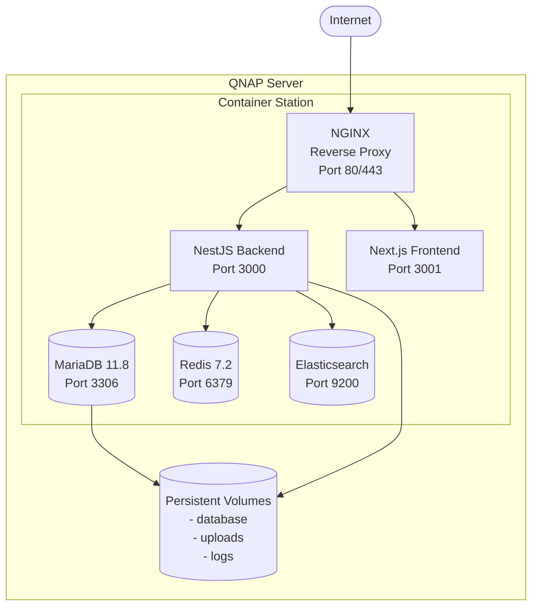

# Operations Documentation

**Project:** LCBP3-DMS (Laem Chabang Port Phase 3 - Document Management System)
**Version:** 1.6.0
**Last Updated:** 2025-12-02

---

## 📋 Overview

This directory contains operational documentation for deploying, maintaining, and monitoring the LCBP3-DMS system.

---

## 📚 Documentation Index

### Deployment & Infrastructure

| Document                                       | Description                                            | Status     |
| ---------------------------------------------- | ------------------------------------------------------ | ---------- |
| [deployment-guide.md](./deployment-guide.md)   | Docker deployment procedures on QNAP Container Station | ✅ Complete |
| [environment-setup.md](./environment-setup.md) | Environment variables and configuration management     | ✅ Complete |

### Monitoring & Maintenance

| Document                                                 | Description                                         | Status     |
| -------------------------------------------------------- | --------------------------------------------------- | ---------- |
| [monitoring-alerting.md](./monitoring-alerting.md)       | Monitoring setup, health checks, and alerting rules | ✅ Complete |
| [backup-recovery.md](./backup-recovery.md)               | Backup strategies and disaster recovery procedures  | ✅ Complete |
| [maintenance-procedures.md](./maintenance-procedures.md) | Routine maintenance and update procedures           | ✅ Complete |

### Security & Compliance

| Document                                           | Description                                    | Status     |
| -------------------------------------------------- | ---------------------------------------------- | ---------- |
| [security-operations.md](./security-operations.md) | Security monitoring and incident response      | ✅ Complete |
| [incident-response.md](./incident-response.md)     | Incident classification and response playbooks | ✅ Complete |

---

## 🚀 Quick Start for Operations Team

### Initial Setup

1. **Read Deployment Guide** - [deployment-guide.md](./deployment-guide.md)
2. **Configure Environment** - [environment-setup.md](./environment-setup.md)
3. **Setup Monitoring** - [monitoring-alerting.md](./monitoring-alerting.md)
4. **Configure Backups** - [backup-recovery.md](./backup-recovery.md)

### Daily Operations

1. Monitor system health via logs and metrics
2. Review backup status (automated daily)
3. Check for security alerts
4. Review system performance metrics

### Weekly/Monthly Tasks

- Review and update SSL certificates (90 days before expiry)
- Database optimization and cleanup
- Log rotation and archival
- Security patch review and application

---

## 🏗️ Infrastructure Overview

### QNAP Container Station Architecture

### Container Services

| Service       | Container Name      | Ports   | Persistent Volume             |
| ------------- | ------------------- | ------- | ----------------------------- |
| NGINX         | lcbp3-nginx         | 80, 443 | /config/nginx                 |
| Backend       | lcbp3-backend       | 3000    | /app/uploads, /app/logs       |
| Frontend      | lcbp3-frontend      | 3001    | -                             |
| MariaDB       | lcbp3-mariadb       | 3306    | /var/lib/mysql                |
| Redis         | lcbp3-redis         | 6379    | /data                         |
| Elasticsearch | lcbp3-elasticsearch | 9200    | /usr/share/elasticsearch/data |

---

## 👥 Roles & Responsibilities

### System Administrator

- Deploy and configure infrastructure
- Manage QNAP server and Container Station
- Configure networking and firewall rules
- SSL certificate management

### Database Administrator (DBA)

- Database backup and recovery
- Performance tuning and optimization
- Migration execution
- Access control management

### DevOps Engineer

- CI/CD pipeline maintenance
- Container orchestration
- Monitoring and alerting setup
- Log aggregation

### Security Officer

- Security monitoring
- Incident response coordination
- Access audit reviews
- Vulnerability management

---

## 📞 Support & Escalation

### Support Tiers

**Tier 1: User Support**

- User access issues
- Password resets
- Basic troubleshooting

**Tier 2: Technical Support**

- Application errors
- Performance issues
- Feature bugs

**Tier 3: Operations Team**

- Infrastructure failures
- Database issues
- Security incidents

### Escalation Path

1. **Minor Issues** → Tier 1/2 Support → Resolution within 24h
2. **Major Issues** → Tier 3 Operations → Resolution within 4h
3. **Critical Issues** → Immediate escalation to System Architect → Resolution within 1h

---

## 🔗 Related Documentation

- [Architecture Documentation](../02-architecture/)
- [Implementation Guidelines](../03-implementation/)
- [Architecture Decision Records](../05-decisions/)
- [Backend Development Tasks](../06-tasks/)

---

## 📝 Document Maintenance

- **Review Frequency:** Monthly
- **Owner:** Operations Team
- **Last Review:** 2025-12-01
- **Next Review:** 2026-01-01

---

**Version:** 1.6.0
**Status:** Active
**Classification:** Internal Use Only
