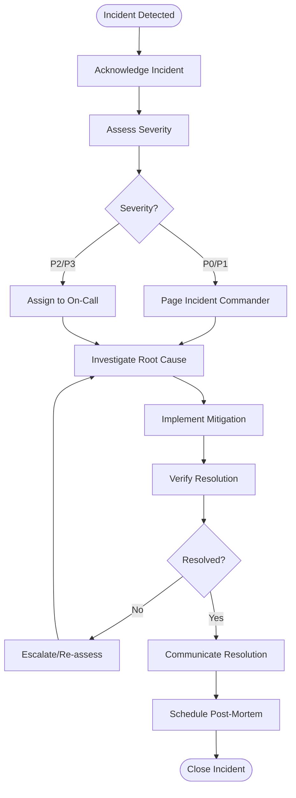

# Incident Response Procedures

**Project:** LCBP3-DMS
**Version:** 1.5.1
**Last Updated:** 2025-12-02

---

## 📋 Overview

This document outlines incident classification, response procedures, and post-incident reviews for LCBP3-DMS.

---

## 🚨 Incident Classification

### Severity Levels

| Severity          | Description                  | Response Time     | Examples                                        |
| ----------------- | ---------------------------- | ----------------- | ----------------------------------------------- |
| **P0 - Critical** | Complete system outage       | 15 minutes        | Database down, All services unavailable         |
| **P1 - High**     | Major functionality impaired | 1 hour            | Authentication failing, Cannot create documents |
| **P2 - Medium**   | Degraded performance         | 4 hours           | Slow response time, Some features broken        |
| **P3 - Low**      | Minor issues                 | Next business day | UI glitch, Non-critical bug                     |

---

## 📞 Incident Response Team

### Roles & Responsibilities

**Incident Commander (IC)**

- Coordinates response efforts
- Makes final decisions
- Communicates with stakeholders

**Technical Lead (TL)**

- Diagnoses technical issues
- Implements fixes
- Coordinates with engineers

**Communications Lead (CL)**

- Updates stakeholders
- Manages internal/external communications
- Documents incident timeline

**On-Call Engineer**

- First responder
- Initial triage and investigation
- Escalates to appropriate team

---

## 🔄 Incident Response Workflow



---

## 📋 Incident Response Playbooks

### P0: Database Down

**Symptoms:**

- Backend returns 500 errors
- Cannot connect to database
- Health check fails

**Immediate Actions:**

1. **Verify Issue**

   ```bash
   docker ps | grep mariadb
   docker logs lcbp3-mariadb --tail=50
   ```

2. **Attempt Restart**

   ```bash
   docker restart lcbp3-mariadb
   ```

3. **Check Database Process**

   ```bash
   docker exec lcbp3-mariadb ps aux | grep mysql
   ```

4. **If Restart Fails:**

   ```bash
   # Check disk space
   df -h

   # Check database logs for corruption
   docker exec lcbp3-mariadb cat /var/log/mysql/error.log

   # If corrupted, restore from backup
   # See backup-recovery.md
   ```

5. **Escalate to DBA** if not resolved in 30 minutes

---

### P0: Complete System Outage

**Symptoms:**

- All services return 502/503
- Health checks fail
- Users cannot access system

**Immediate Actions:**

1. **Check Container Status**

   ```bash
   docker-compose ps
   # Identify which containers are down
   ```

2. **Restart All Services**

   ```bash
   docker-compose restart
   ```

3. **Check QNAP Server Resources**

   ```bash
   top
   df -h
   free -h
   ```

4. **Check Network**

   ```bash
   ping 8.8.8.8
   netstat -tlnp
   ```

5. **If Server Issue:**
   - Reboot QNAP server
   - Contact QNAP support

---

### P1: Authentication System Failing

**Symptoms:**

- Users cannot log in
- JWT validation fails
- 401 errors

**Immediate Actions:**

1. **Check Redis (Session Store)**

   ```bash
   docker exec lcbp3-redis redis-cli ping
   # Should return PONG
   ```

2. **Check JWT Secret Configuration**

   ```bash
   docker exec lcbp3-backend env | grep JWT_SECRET
   # Verify not empty
   ```

3. **Check Backend Logs**

   ```bash
   docker logs lcbp3-backend --tail=100 | grep "JWT\|Auth"
   ```

4. **Temporary Mitigation:**
   ```bash
   # Restart backend to reload config
   docker restart lcbp3-backend
   ```

---

### P1: File Upload Failing

**Symptoms:**

- Users cannot upload files
- 500 errors on file upload
- "Disk full" errors

**Immediate Actions:**

1. **Check Disk Space**

   ```bash
   df -h /var/lib/docker/volumes/lcbp3_uploads
   ```

2. **If Disk Full:**

   ```bash
   # Clean up temp uploads
   find /var/lib/docker/volumes/lcbp3_uploads/_data/temp \
     -type f -mtime +1 -delete
   ```

3. **Check ClamAV (Virus Scanner)**

   ```bash
   docker logs lcbp3-clamav --tail=50
   docker restart lcbp3-clamav
   ```

4. **Check File Permissions**
   ```bash
   docker exec lcbp3-backend ls -la /app/uploads
   ```

---

### P2: Slow Performance

**Symptoms:**

- Pages load slowly
- API response time > 2s
- Users complain about slowness

**Actions:**

1. **Check System Resources**

   ```bash
   docker stats
   # Identify high CPU/memory containers
   ```

2. **Check Database Performance**

   ```sql
   -- Show slow queries
   SHOW PROCESSLIST;

   -- Check connections
   SHOW STATUS LIKE 'Threads_connected';
   ```

3. **Check Redis**

   ```bash
   docker exec lcbp3-redis redis-cli --stat
   ```

4. **Check Application Logs**

   ```bash
   docker logs lcbp3-backend | grep "Slow request"
   ```

5. **Temporary Mitigation:**
   - Restart slow containers
   - Clear Redis cache if needed
   - Kill long-running queries

---

### P2: Email Notifications Not Sending

**Symptoms:**

- Users not receiving emails
- Email queue backing up

**Actions:**

1. **Check Email Queue**

   ```bash
   # Access BullMQ dashboard or check Redis
   docker exec lcbp3-redis redis-cli LLEN bull:email:waiting
   ```

2. **Check Email Processor Logs**

   ```bash
   docker logs lcbp3-backend | grep "email\|SMTP"
   ```

3. **Test SMTP Connection**

   ```bash
   docker exec lcbp3-backend node -e "
   const nodemailer = require('nodemailer');
   const transport = nodemailer.createTransport({
     host: process.env.SMTP_HOST,
     port: process.env.SMTP_PORT,
     auth: {
       user: process.env.SMTP_USER,
       pass: process.env.SMTP_PASS
     }
   });
   transport.verify().then(console.log).catch(console.error);
   "
   ```

4. **Check SMTP Credentials**
   - Verify not expired
   - Check firewall/network access

---

## 📝 Incident Documentation

### Incident Report Template

```markdown
# Incident Report: [Brief Description]

**Incident ID:** INC-YYYYMMDD-001
**Severity:** P1
**Status:** Resolved
**Incident Commander:** [Name]

## Timeline

| Time  | Event                                                     |
| ----- | --------------------------------------------------------- |
| 14:00 | Alert: High error rate detected                           |
| 14:05 | On-call engineer acknowledged                             |
| 14:10 | Identified root cause: Database connection pool exhausted |
| 14:15 | Implemented mitigation: Increased pool size               |
| 14:20 | Verified resolution                                       |
| 14:30 | Incident resolved                                         |

## Impact

- **Duration:** 30 minutes
- **Affected Users:** ~50 users
- **Affected Services:** Document creation, Search
- **Data Loss:** None

## Root Cause

Database connection pool was exhausted due to slow queries not releasing connections.

## Resolution

1. Increased connection pool size from 10 to 20
2. Optimized slow queries
3. Added connection pool monitoring

## Action Items

- [ ] Add connection pool size alert (Owner: DevOps, Due: Next Sprint)
- [ ] Implement automatic query timeouts (Owner: Backend, Due: 2025-12-15)
- [ ] Review all queries for optimization (Owner: DBA, Due: 2025-12-31)

## Lessons Learned

- Connection pool monitoring was insufficient
- Need automated remediation for common issues
```

---

## 🔍 Post-Incident Review (PIR)

### PIR Meeting Agenda

1. **Timeline Review** (10 min)

   - What happened and when?
   - What was the impact?

2. **Root Cause Analysis** (15 min)

   - Why did it happen?
   - What were the contributing factors?

3. **What Went Well** (10 min)

   - What did we do right?
   - What helped us resolve quickly?

4. **What Went Wrong** (15 min)

   - What could we have done better?
   - What slowed us down?

5. **Action Items** (10 min)
   - What changes will prevent this?
   - Who owns each action?
   - When will they be completed?

### PIR Best Practices

- **Blameless Culture:** Focus on systems, not individuals
- **Actionable Outcomes:** Every PIR should produce concrete actions
- **Follow Through:** Track action items to completion
- **Share Learnings:** Distribute PIR summary to entire team

---

## 📊 Incident Metrics

### Track & Review Monthly

- **MTTR (Mean Time To Resolution):** Average time to resolve incidents
- **MTBF (Mean Time Between Failures):** Average time between incidents
- **Incident Frequency:** Number of incidents per month
- **Severity Distribution:** Breakdown by P0/P1/P2/P3
- **Repeat Incidents:** Same root cause occurring multiple times

---

## ✅ Incident Response Checklist

### During Incident

- [ ] Acknowledge incident in tracking system
- [ ] Assess severity and assign IC
- [ ] Create incident channel (Slack/Teams)
- [ ] Begin documenting timeline
- [ ] Investigate and implement mitigation
- [ ] Communicate status updates every 30 min (P0/P1)
- [ ] Verify resolution
- [ ] Communicate resolution to stakeholders

### After Incident

- [ ] Create incident report
- [ ] Schedule PIR within 48 hours
- [ ] Identify action items
- [ ] Assign owners and deadlines
- [ ] Update runbooks/playbooks
- [ ] Share learnings with team

---

## 🔗 Related Documents

- [Monitoring & Alerting](./monitoring-alerting.md)
- [Backup & Recovery](./backup-recovery.md)
- [Security Operations](./security-operations.md)

---

**Version:** 1.5.1
**Last Review:** 2025-12-01
**Next Review:** 2026-03-01
