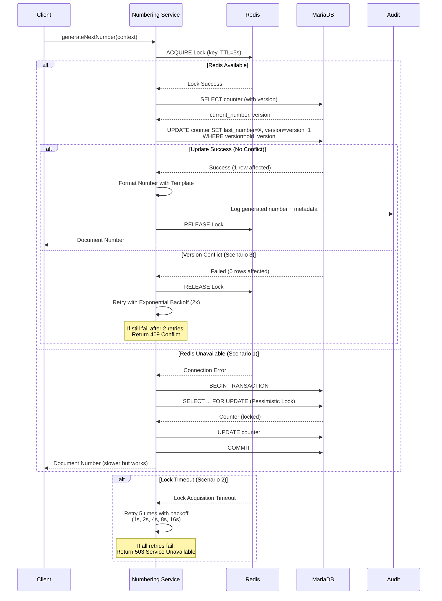

# ADR-002: Document Numbering Strategy

**Status:** Accepted
**Date:** 2025-12-02
**Decision Makers:** Development Team, System Architect
**Related Documents:**

- [System Architecture](../02-architecture/system-architecture.md)
- [Document Numbering Requirements](../01-requirements/03.11-document-numbering.md)

---

## Context and Problem Statement

LCBP3-DMS ต้องสร้างเลขที่เอกสารอัตโนมัติสำหรับ Correspondence, RFA, Transmittal และ Drawing โดยเลขที่เอกสารต้อง:

1. **Unique:** ไม่ซ้ำกันในระบบ
2. **Sequential:** เรียงตามลำดับเวลา
3. **Meaningful:** มีโครงสร้างที่อ่านเข้าใจได้ (เช่น `LCBP3-C2-RFI-ROW-0029-A`)
4. **Configurable:** สามารถปรับรูปแบบได้ตาม Project/Organization/Document Type
5. **Concurrent-safe:** ป้องกัน Race Condition เมื่อมีหลาย Request พร้อมกัน

### Key Challenges

1. **Race Condition:** เมื่อมี 2+ requests พร้อมกัน อาจได้เลขเดียวกัน
2. **Performance:** ต้องรวดเร็วแม้มี concurrent requests (50-100 req/sec)
3. **Flexibility:** รองรับรูปแบบเลขที่หลากหลายตามชนิดเอกสาร
4. **Discipline Support:** เลขที่ต้องรวม Discipline Code (GEN, STR, ARC, etc.)
5. **Transmittal Logic:** เลขที่ Transmittal เปลี่ยนตามผู้รับ (To Owner vs To Contractor)
6. **Year Reset:** Counter ต้อง reset ตาม ปี พ.ศ. หรือ ค.ศ.

---

## Decision Drivers

- **Data Integrity:** เลขที่ต้องไม่ซ้ำกันเด็ดขาด (Mission-Critical)
- **Performance:** Generate เลขที่ได้เร็ว (<500ms normal, <2s p95, <5s p99)
- **Scalability:** รองรับ 50-100 concurrent requests/second
- **Maintainability:** ง่ายต่อการ Config และ Debug
- **Flexibility:** รองรับ Template-based format สำหรับแต่ละ document type
- **Auditability:** บันทึก history ของทุก generated number
- **Security:** ป้องกัน abuse ด้วย rate limiting

---

## Considered Options

### Option 1: Database AUTO_INCREMENT

**แนวทาง:** ใช้ MySQL AUTO_INCREMENT column

**Pros:**

- ✅ Simple implementation
- ✅ Database handles uniqueness
- ✅ Very fast performance

**Cons:**

- ❌ ไม่ Configurable (รูปแบบเลขที่ fixed)
- ❌ ยากต่อการ Partition by Project/Type/Discipline/Year
- ❌ ไม่รองรับ Custom format (เช่น `LCBP3-RFA-2025-0001`)
- ❌ Reset ตาม Year ทำได้ยาก

### Option 2: Application-Level Counter (Single Lock)

**แนวทาง:** ใช้ Redis INCR สำหรับ Counter

**Pros:**

- ✅ Fast performance (Redis in-memory)
- ✅ Configurable format
- ✅ Easy to partition (different Redis keys)

**Cons:**

- ❌ Single Point of Failure (ถ้า Redis down)
- ❌ ไม่มี Persistence ถ้า Redis crash (ถ้าไม่ใช้ AOF/RDB)
- ❌ Difficult to audit (ไม่มี history ใน DB)

### Option 3: **Double-Lock Mechanism (Redis + Database)** ⭐ (Selected)

**แนวทาง:** ใช้ Redis Distributed Lock + Database Optimistic Locking + Version Column

**Pros:**

- ✅ **Guaranteed Uniqueness:** Double-layer protection
- ✅ **Fast Performance:** Redis lock prevents most conflicts (<500ms)
- ✅ **Audit Trail:** Counter history + audit log in database
- ✅ **Configurable Format:** Template-based generation
- ✅ **Resilient:** Fallback to DB pessimistic lock if Redis unavailable
- ✅ **Partition Support:** Different counters per Project/Type/SubType/Discipline/Year
- ✅ **Transmittal Logic:** Support recipient-based counting

**Cons:**

- ❌ More complex implementation
- ❌ Slightly slower than pure Redis (but still fast)
- ❌ Requires both Redis and DB

---

## Decision Outcome

**Chosen Option:** Option 3 - Double-Lock Mechanism (Redis + Database)

### Rationale

เลือก Double-Lock เนื่องจาก:

1. **Mission-Critical:** เลขที่เอกสารต้องถูกต้อง 100% (ไม่ยอมรับการซ้ำ)
2. **Performance + Safety:** Balance ระหว่างความเร็วและความปลอดภัย
3. **Auditability:** มี Counter history + Audit log ใน Database
4. **Flexibility:** รองรับ Template-based format สำหรับทุก document type
5. **Resilience:** ถ้า Redis มีปัญหา ยัง Fallback ไปใช้ DB Lock ได้

---

## Implementation Details

### Database Schema

```sql
-- Format Templates
CREATE TABLE document_number_configs (
  id INT PRIMARY KEY AUTO_INCREMENT,
  project_id INT NOT NULL,
  doc_type_id INT NOT NULL COMMENT 'Correspondence, RFA, Transmittal, Drawing',
  sub_type_id INT DEFAULT 0 COMMENT 'ประเภทย่อย (nullable, use 0 for fallback)',
  discipline_id INT DEFAULT 0 COMMENT 'สาขาวิชา (nullable, use 0 for fallback)',
  template VARCHAR(255) NOT NULL COMMENT 'e.g. {PROJECT}-{ORG}-{TYPE}-{DISCIPLINE}-{SEQ:4}-{REV}',
  description TEXT,
  created_at TIMESTAMP DEFAULT CURRENT_TIMESTAMP,
  updated_at TIMESTAMP DEFAULT CURRENT_TIMESTAMP ON UPDATE CURRENT_TIMESTAMP,
  version INT DEFAULT 0 NOT NULL COMMENT 'For template versioning',
  FOREIGN KEY (project_id) REFERENCES projects(id),
  FOREIGN KEY (doc_type_id) REFERENCES document_types(id),
  UNIQUE KEY unique_config (project_id, doc_type_id, sub_type_id, discipline_id)
) ENGINE=InnoDB COMMENT='Template configurations for document numbering';

-- Counter Table with Optimistic Locking
CREATE TABLE document_number_counters (
  project_id INT NOT NULL,
  doc_type_id INT NOT NULL,
  sub_type_id INT DEFAULT 0 COMMENT 'For Correspondence types, 0 = fallback',
  discipline_id INT DEFAULT 0 COMMENT 'For RFA/Drawing, 0 = fallback',
  recipient_type VARCHAR(20) DEFAULT NULL COMMENT 'For Transmittal: OWNER, CONTRACTOR, CONSULTANT, OTHER',
  year INT NOT NULL COMMENT 'ปี พ.ศ. หรือ ค.ศ. ตาม template',
  last_number INT DEFAULT 0,
  version INT DEFAULT 0 NOT NULL COMMENT 'Version for Optimistic Lock',
  updated_at TIMESTAMP DEFAULT CURRENT_TIMESTAMP ON UPDATE CURRENT_TIMESTAMP,
  PRIMARY KEY (project_id, doc_type_id, sub_type_id, discipline_id, COALESCE(recipient_type, ''), year),
  FOREIGN KEY (project_id) REFERENCES projects(id),
  FOREIGN KEY (doc_type_id) REFERENCES document_types(id),
  INDEX idx_counter_lookup (project_id, doc_type_id, year)
) ENGINE=InnoDB COMMENT='Running number counters with optimistic locking';

-- Audit Trail
CREATE TABLE document_number_audit (
  id BIGINT PRIMARY KEY AUTO_INCREMENT,
  document_id INT DEFAULT NULL COMMENT 'FK to documents (set after doc creation)',
  generated_number VARCHAR(255) NOT NULL,
  counter_key VARCHAR(500) NOT NULL COMMENT 'Redis lock key used',
  template_used VARCHAR(255) NOT NULL,
  sequence_number INT NOT NULL,
  user_id INT NOT NULL,
  ip_address VARCHAR(45),
  retry_count INT DEFAULT 0,
  lock_wait_ms INT DEFAULT 0 COMMENT 'Time spent waiting for lock',
  created_at TIMESTAMP DEFAULT CURRENT_TIMESTAMP,
  FOREIGN KEY (user_id) REFERENCES users(id),
  INDEX idx_audit_number (generated_number),
  INDEX idx_audit_user (user_id, created_at),
  INDEX idx_audit_created (created_at)
) ENGINE=InnoDB COMMENT='Audit trail for all generated document numbers';
```

### Token Types Reference

รองรับ Token ทั้งหมด 9 ประเภท:

| Token | Description | Example Value |
|-------|-------------|---------------|
| `{PROJECT}` | รหัสโครงการ | `LCBP3` |
| `{ORG}` | รหัสหน่วยงาน | `คคง.`, `C2` |
| `{TYPE}` | รหัสชนิดเอกสาร | `RFI`, `03` |
| `{SUB_TYPE}` | รหัสประเภทย่อย | `21` |
| `{DISCIPLINE}` | รหัสสาขาวิชา | `STR`, `ROW` |
| `{CATEGORY}` | หมวดหมู่ | `DRW` |
| `{SEQ:n}` | Running number (n digits) | `0001`, `00029` |
| `{YEAR:B.E.}` | ปี พ.ศ. | `2568` |
| `{YEAR:A.D.}` | ปี ค.ศ. | `2025` |
| `{REV}` | Revision Code | `A`, `B`, `AA` |

### Format Examples by Document Type

#### 1. Correspondence (หนังสือราชการ)

**Letter Type (TYPE = 03):**

```
Template: {ORG}-{ORG}-{TYPE}-{SEQ:4}-{YEAR:B.E.}
Example:  คคง.-สคฉ.3-0985-2568
Counter Key: project_id + doc_type_id + sub_type_id + year
```

**Other Correspondence:**

```
Template: {ORG}-{ORG}-{TYPE}-{SEQ:4}-{YEAR:B.E.}
Example:  คคง.-สคฉ.3-STR-0001-2568
Counter Key: project_id + doc_type_id + sub_type_id + year
```

#### 2. Transmittal

**To Owner (Special Format):**

```
Template: {ORG}-{ORG}-{TYPE}-{SUB_TYPE}-{SEQ:4}-{YEAR:B.E.}
Example:  คคง.-สคฉ.3-03-21-0117-2568
Counter Key: project_id + doc_type_id + recipient_type('OWNER') + year
Note: recipient_type แยก counter จาก To Contractor
```

**To Contractor/Others:**

```
Template: {ORG}-{ORG}-{TYPE}-{SEQ:4}-{YEAR:B.E.}
Example:  ผรม.2-คคง.-0117-2568
Counter Key: project_id + doc_type_id + recipient_type('CONTRACTOR') + year
```

**Alternative Project-based:**

```
Template: {PROJECT}-{ORG}-{TYPE}-{DISCIPLINE}-{SEQ:4}-{REV}
Example:  LCBP3-TR-STR-0001-A
Counter Key: project_id + doc_type_id + discipline_id + year
```

#### 3. RFA (Request for Approval)

```
Template: {PROJECT}-{ORG}-{TYPE}-{DISCIPLINE}-{SEQ:4}-{REV}
Example:  LCBP3-C2-RFI-ROW-0029-A
Counter Key: project_id + doc_type_id + discipline_id + year
```

#### 4. Drawing

```
Template: {PROJECT}-{DISCIPLINE}-{CATEGORY}-{SEQ:4}-{REV}
Example:  LCBP3-STR-DRW-0001-A
Counter Key: project_id + doc_type_id + discipline_id + category + year
```

### NestJS Service Implementation (Simplified)

```typescript
// File: backend/src/modules/document-numbering/document-numbering.service.ts
import { Injectable, Logger } from '@nestjs/common';
import { InjectRepository } from '@nestjs/typeorm';
import { Repository } from 'typeorm';
import Redlock from 'redlock';
import Redis from 'ioredis';

interface NumberingContext {
  projectId: number;
  docTypeId: number;
  subTypeId?: number;
  disciplineId?: number;
  recipientType?: 'OWNER' | 'CONTRACTOR' | 'CONSULTANT' | 'OTHER';
  year?: number;
  userId: number;
  ipAddress: string;
}

@Injectable()
export class DocumentNumberingService {
  private readonly logger = new Logger(DocumentNumberingService.name);

  constructor(
    @InjectRepository(DocumentNumberCounter)
    private counterRepo: Repository<DocumentNumberCounter>,
    @InjectRepository(DocumentNumberConfig)
    private configRepo: Repository<DocumentNumberConfig>,
    @InjectRepository(DocumentNumberAudit)
    private auditRepo: Repository<DocumentNumberAudit>,
    private redis: Redis,
    private redlock: Redlock
  ) {}

  async generateNextNumber(context: NumberingContext): Promise<string> {
    const year = context.year || new Date().getFullYear() + 543; // พ.ศ.
    const subTypeId = context.subTypeId || 0;  // Fallback for NULL
    const disciplineId = context.disciplineId || 0;  // Fallback for NULL

    // Build Redis lock key
    const lockKey = this.buildLockKey(
      context.projectId,
      context.docTypeId,
      subTypeId,
      disciplineId,
      context.recipientType,
      year
    );

    // Retry with exponential backoff (Scenario 2 & 3)
    return this.retryWithBackoff(
      async () => await this.generateNumberWithLock(
        lockKey,
        context,
        year,
        subTypeId,
        disciplineId
      ),
      5,  // Max 5 retries
      1000 // Initial delay 1s
    );
  }

  private async generateNumberWithLock(
    lockKey: string,
    context: NumberingContext,
    year: number,
    subTypeId: number,
    disciplineId: number
  ): Promise<string> {
    let lock: any;
    const lockStartTime = Date.now();

    try {
      // Scenario 1: Redis Unavailable - Fallback to DB lock
      try {
        // Step 1: Acquire Redis Distributed Lock (TTL: 5 seconds)
        lock = await this.redlock.acquire([lockKey], 5000);
      } catch (redisError) {
        this.logger.warn(`Redis lock failed, falling back to DB lock: ${redisError.message}`);
        // Fallback: Use SELECT ... FOR UPDATE (Pessimistic Lock)
        return await this.generateWithDatabaseLock(context, year, subTypeId, disciplineId);
      }

      const lockWaitMs = Date.now() - lockStartTime;

      // Step 2: Query current counter with version
      let counter = await this.counterRepo.findOne({
        where: {
          project_id: context.projectId,
          doc_type_id: context.docTypeId,
          sub_type_id: subTypeId,
          discipline_id: disciplineId,
          recipient_type: context.recipientType || null,
          year: year,
        },
      });

      // Initialize counter if not exists
      if (!counter) {
        counter = this.counterRepo.create({
          project_id: context.projectId,
          doc_type_id: context.docTypeId,
          sub_type_id: subTypeId,
          discipline_id: disciplineId,
          recipient_type: context.recipientType || null,
          year: year,
          last_number: 0,
          version: 0,
        });
        await this.counterRepo.save(counter);
      }

      const currentVersion = counter.version;
      const nextNumber = counter.last_number + 1;

      // Step 3: Update counter with Optimistic Lock check (Scenario 3)
      const result = await this.counterRepo
        .createQueryBuilder()
        .update(DocumentNumberCounter)
        .set({
          last_number: nextNumber,
          version: () => 'version + 1',
        })
        .where({
          project_id: context.projectId,
          doc_type_id: context.docTypeId,
          sub_type_id: subTypeId,
          discipline_id: disciplineId,
          recipient_type: context.recipientType || null,
          year: year,
          version: currentVersion, // Optimistic lock check
        })
        .execute();

      if (result.affected === 0) {
        throw new ConflictException('Counter version conflict - retrying...');
      }

      // Step 4: Generate formatted number
      const config = await this.getConfig(
        context.projectId,
        context.docTypeId,
        subTypeId,
        disciplineId
      );

      const formattedNumber = await this.formatNumber(config.template, {
        ...context,
        year,
        sequenceNumber: nextNumber,
      });

      // Step 5: Audit logging
      await this.auditRepo.save({
        generated_number: formattedNumber,
        counter_key: lockKey,
        template_used: config.template,
        sequence_number: nextNumber,
        user_id: context.userId,
        ip_address: context.ipAddress,
        retry_count: 0,
        lock_wait_ms: lockWaitMs,
      });

      this.logger.log(`Generated: ${formattedNumber} (wait: ${lockWaitMs}ms)`);
      return formattedNumber;

    } finally {
      // Step 6: Release Redis lock
      if (lock) {
        await lock.release();
      }
    }
  }

  private async formatNumber(template: string, data: any): Promise<string> {
    // Token replacement logic
    const tokens = {
      '{PROJECT}': await this.getProjectCode(data.projectId),
      '{ORG}': await this.getOrgCode(data.organizationId),
      '{TYPE}': await this.getTypeCode(data.docTypeId),
      '{SUB_TYPE}': await this.getSubTypeCode(data.subTypeId),
      '{DISCIPLINE}': await this.getDisciplineCode(data.disciplineId),
      '{CATEGORY}': await this.getCategoryCode(data.categoryId),
      '{SEQ:4}': data.sequenceNumber.toString().padStart(4, '0'),
      '{SEQ:5}': data.sequenceNumber.toString().padStart(5, '0'),
      '{YEAR:B.E.}': data.year.toString(),
      '{YEAR:A.D.}': (data.year - 543).toString(),
      '{REV}': data.revisionCode || 'A',
    };

    let result = template;
    for (const [token, value] of Object.entries(tokens)) {
      result = result.replace(new RegExp(token, 'g'), value);
    }

    return result;
  }

  private buildLockKey(...parts: Array<number | string | null | undefined>): string {
    return `doc_num:${parts.filter(p => p !== null && p !== undefined).join(':')}`;
  }

  // Scenario 2: Lock Acquisition Timeout - Exponential Backoff
  private async retryWithBackoff<T>(
    fn: () => Promise<T>,
    maxRetries: number,
    initialDelay: number
  ): Promise<T> {
    for (let attempt = 0; attempt <= maxRetries; attempt++) {
      try {
        return await fn();
      } catch (error) {
        const isRetryable =
          error instanceof ConflictException ||
          error.code === 'ECONNREFUSED' ||  // Scenario 4
          error.code === 'ETIMEDOUT';       // Scenario 4

        if (!isRetryable || attempt === maxRetries) {
          if (attempt === maxRetries) {
            throw new ServiceUnavailableException(
              'ระบบกำลังยุ่ง กรุณาลองใหม่ภายหลัง'
            );
          }
          throw error;
        }

        const delay = initialDelay * Math.pow(2, attempt);
        await new Promise(resolve => setTimeout(resolve, delay));
        this.logger.warn(`Retry ${attempt + 1}/${maxRetries} after ${delay}ms`);
      }
    }
  }

  // Scenario 1: Fallback to Database Lock
  private async generateWithDatabaseLock(
    context: NumberingContext,
    year: number,
    subTypeId: number,
    disciplineId: number
  ): Promise<string> {
    return await this.counterRepo.manager.transaction(async (manager) => {
      // Pessimistic lock: SELECT ... FOR UPDATE
      const counter = await manager
        .createQueryBuilder(DocumentNumberCounter, 'counter')
        .setLock('pessimistic_write')
        .where({
          project_id: context.projectId,
          doc_type_id: context.docTypeId,
          sub_type_id: subTypeId,
          discipline_id: disciplineId,
          recipient_type: context.recipientType || null,
          year: year,
        })
        .getOne();

      const nextNumber = (counter?.last_number || 0) + 1;

      // Update counter
      await manager.save(DocumentNumberCounter, {
        ...counter,
        last_number: nextNumber,
      });

      // Format and return
      const config = await this.getConfig(context.projectId, context.docTypeId, subTypeId, disciplineId);
      return await this.formatNumber(config.template, {
        ...context,
        year,
        sequenceNumber: nextNumber,
      });
    });
  }
}
```

### Algorithm Flow



---

## Error Handling Scenarios

### Scenario 1: Redis Unavailable

**Trigger:** Redis connection error, Redis down

**Fallback:**

- ใช้ Database-only locking (`SELECT ... FOR UPDATE`)
- Log warning และแจ้ง ops team
- ระบบยังใช้งานได้แต่ performance ลดลง (slower)

### Scenario 2: Lock Acquisition Timeout

**Trigger:** หลาย requests แย่งชิง lock พร้อมกัน

**Retry Logic:**

- Retry 5 ครั้งด้วย exponential backoff: 1s, 2s, 4s, 8s, 16s (รวม ~31 วินาที)
- หลัง 5 ครั้ง: Return HTTP 503 "Service Temporarily Unavailable"
- Frontend: แสดง "ระบบกำลังยุ่ง กรุณาลองใหม่ภายหลัง"

### Scenario 3: Version Conflict After Lock

**Trigger:** Optimistic lock version mismatch

**Retry Logic:**

- Retry 2 ครั้ง (reload counter + retry transaction)
- หลัง 2 ครั้ง: Return HTTP 409 Conflict
- Frontend: แสดง "เลขที่เอกสารถูกเปลี่ยน กรุณาลองใหม่"

### Scenario 4: Database Connection Error

**Trigger:** Database connection timeout, connection pool exhausted

**Retry Logic:**

- Retry 3 ครั้งด้วย exponential backoff: 1s, 2s, 4s
- หลัง 3 ครั้ง: Return HTTP 500 "Internal Server Error"
- Frontend: แสดง "เกิดข้อผิดพลาดในระบบ กรุณาติดต่อผู้ดูแลระบบ"

---

## Performance Requirements

### Response Time Targets

| Metric | Target | Description |
|--------|--------|-------------|
| Normal Operation | <500ms | Under normal load, no conflicts |
| 95th Percentile | <2 seconds | Including retry scenarios |
| 99th Percentile | <5 seconds | Extreme cases with multiple retries |

### Throughput Targets

| Load Level | Target | Notes |
|------------|--------|-------|
| Normal Load | 50 req/sec | Typical office hours |
| Peak Load | 100 req/sec | Construction deadline periods |

### Availability

- **Uptime:** ≥99.5% (exclude planned maintenance)
- **Maximum Downtime:** ≤3.6 hours/month

---

## Monitoring & Alerting

### Metrics to Track

1. **Lock Acquisition Metrics:**
   - Lock wait time (p50, p95, p99)
   - Lock acquisition success rate
   - Lock timeout count

2. **Counter Generation:**
   - Generation latency (p50, p95, p99)
   - Generation success rate
   - Retry count distribution

3. **System Health:**
   - Redis connection status
   - Database connection pool usage
   - Error rate by scenario (1-4)

### Alert Conditions

| Severity | Condition | Action |
|----------|-----------|--------|
| 🔴 Critical | Redis unavailable >1 minute | Page ops team |
| 🔴 Critical | Lock failures >10% in 5 min | Page ops team |
| 🟡 Warning | Lock failures >5% in 5 min | Alert ops team |
| 🟡 Warning | Avg lock wait time >1 second | Alert ops team |
| 🟡 Warning | Retry count >100/hour | Review system load |

### Dashboard Panels

- Real-time lock acquisition success rate (%)
- Lock wait time percentiles chart
- Counter generation rate (per minute)
- Error rate breakdown by type
- Redis/Database health indicators

---

## Security Considerations

### Authorization

- เฉพาะ **authenticated users** สามารถ request document number
- เฉพาะ **Project Admin** สามารถแก้ไข template
- เฉพาะ **Super Admin** สามารถ reset counter

### Rate Limiting

Prevent abuse และ resource exhaustion:

| Scope | Limit | Window |
|-------|-------|--------|
| Per User | 10 requests | 1 minute |
| Per IP Address | 50 requests | 1 minute |
| Global | 5000 requests | 1 minute |

**Implementation:** ใช้ Redis-based rate limiter middleware

### Audit & Compliance

- บันทึกทุก API call ที่เกี่ยวข้องกับ document numbering
- เก็บ audit log อย่างน้อย **7 ปี** (ตาม พ.ร.บ. ข้อมูลอิเล็กทรอนิกส์)
- บันทึก: user, IP, timestamp, generated number, retry count

---

## Consequences

### Positive

1. ✅ **Zero Duplicate Risk:** Double-lock + DB constraint guarantees uniqueness
2. ✅ **High Performance:** Redis lock + optimistic locking (<500ms normal)
3. ✅ **Complete Audit Trail:** All counters + generated numbers in database
4. ✅ **Highly Configurable:** Template-based for all document types
5. ✅ **Partition Support:** Separate counters per Project/Type/SubType/Discipline/Recipient/Year
6. ✅ **Resilient:** Multiple fallback strategies for all failure scenarios
7. ✅ **Transmittal Logic:** Supports recipient-based numbering
8. ✅ **Security:** Rate limiting + authorization + audit logging

### Negative

1. ❌ **Complexity:** Requires coordination between Redis and Database
2. ❌ **Dependencies:** Requires both Redis and DB healthy for optimal performance
3. ❌ **Retry Logic:** May retry causing delays under high contention
4. ❌ **Monitoring Overhead:** Need comprehensive monitoring for all scenarios

### Mitigation Strategies

- **Redis Dependency:** Use Redis Persistence (AOF) + Replication + Fallback to DB
- **Complexity:** Encapsulate all logic in `DocumentNumberingService`
- **Retry Delays:** Exponential backoff limits max delay time
- **Monitoring:** Automated dashboards + alerting for all critical metrics

---

## Testing Strategy

### Unit Tests

```typescript
describe('DocumentNumberingService - Concurrent Generation', () => {
  it('should generate unique numbers for 100 concurrent requests', async () => {
    const context: NumberingContext = {
      projectId: 1,
      docTypeId: 2, // RFA
      disciplineId: 3, // STR
      year: 2568,
      userId: 1,
      ipAddress: '192.168.1.1',
    };

    const promises = Array(100)
      .fill(null)
      .map(() => service.generateNextNumber(context));

    const results = await Promise.all(promises);

    // Check uniqueness
    const unique = new Set(results);
    expect(unique.size).toBe(100);

    // Check format
    results.forEach(num => {
      expect(num).toMatch(/^LCBP3-C2-RFI-STR-\d{4}-A$/);
    });
  });

  it('should use correct format for Transmittal To Owner', async () => {
    const number = await service.generateNextNumber({
      projectId: 1,
      docTypeId: 3, // Transmittal
      recipientType: 'OWNER',
      year: 2568,
      userId: 1,
      ipAddress: '192.168.1.1',
    });

    expect(number).toMatch(/^คคง\.-สคฉ\.3-03-21-\d{4}-2568$/);
  });

  it('should fallback to DB lock when Redis unavailable', async () => {
    jest.spyOn(redlock, 'acquire').mockRejectedValue(new Error('Redis down'));

    const number = await service.generateNextNumber(context);
    expect(number).toBeDefined();
    expect(loggerWarnSpy).toHaveBeenCalledWith(expect.stringContaining('falling back to DB lock'));
  });

  it('should retry on version conflict and succeed', async () => {
    let attempt = 0;
    jest.spyOn(counterRepo, 'createQueryBuilder').mockImplementation(() => {
      attempt++;
      return {
        update: () => ({
          set: () => ({
            where: () => ({
              execute: async () => ({
                affected: attempt === 1 ? 0 : 1, // Fail first, succeed second
              }),
            }),
          }),
        }),
      } as any;
    });

    const result = await service.generateNextNumber(context);
    expect(result).toBeDefined();
    expect(attempt).toBe(2);
  });

  it('should throw 503 after max lock acquisition retries', async () => {
    jest.spyOn(redlock, 'acquire').mockRejectedValue(new Error('Lock timeout'));

    await expect(service.generateNextNumber(context))
      .rejects
      .toThrow(ServiceUnavailableException);
  });
});
```

### Load Testing

```yaml
# artillery.yml
config:
  target: 'http://localhost:3000'
  phases:
    - duration: 60
      arrivalRate: 50 # 50 requests/second
      name: 'Normal Load'
    - duration: 30
      arrivalRate: 100 # 100 requests/second
      name: 'Peak Load'

scenarios:
  - name: 'Generate Document Numbers - RFA'
    weight: 40
    flow:
      - post:
          url: '/api/v1/rfa'
          json:
            title: 'Load Test {{ $randomString() }}'
            project_id: 1
            doc_type_id: 2
            discipline_id: 3

  - name: 'Generate Document Numbers - Transmittal'
    weight: 30
    flow:
      - post:
          url: '/api/v1/transmittals'
          json:
            title: 'Load Test {{ $randomString() }}'
            project_id: 1
            doc_type_id: 3
            recipient_type: 'OWNER'

  - name: 'Generate Document Numbers - Correspondence'
    weight: 30
    flow:
      - post:
          url: '/api/v1/correspondences'
          json:
            title: 'Load Test {{ $randomString() }}'
            project_id: 1
            doc_type_id: 1

expect:
  - statusCode: 200
  - statusCode: 201
  - contentType: json

ensure:
  p95: 2000 # 95th percentile < 2 seconds
  p99: 5000 # 99th percentile < 5 seconds
  maxErrorRate: 0.1 # < 0.1% errors
```

---

## Compliance

เป็นไปตาม:

- ✅ [Requirements 3.11](../01-requirements/03.11-document-numbering.md) - Document Numbering Management (v1.5.0)
- ✅ [Backend Plan Section 4.2.10](../../docs/2_Backend_Plan_V1_4_5.md) - DocumentNumberingModule
- ✅ [Data Dictionary](../../docs/4_Data_Dictionary_V1_4_4.md) - Counter Tables
- ✅ [Security Best Practices](../02-architecture/security-architecture.md) - Rate Limiting, Audit Logging

---

## Related ADRs

- [ADR-001: Unified Workflow Engine](./ADR-001-unified-workflow-engine.md) - Workflow triggers number generation
- [ADR-005: Redis Usage Strategy](./ADR-005-redis-usage-strategy.md) - Redis lock implementation details
- [ADR-006: Audit Logging Strategy](./ADR-006-audit-logging-strategy.md) - Comprehensive audit requirements

---

## References

- [Redlock Algorithm](https://redis.io/topics/distlock) - Distributed locking with Redis
- [TypeORM Optimistic Locking](https://typeorm.io/entities#version-column) - Version column usage
- [Distributed Lock Patterns](https://martin.kleppmann.com/2016/02/08/how-to-do-distributed-locking.html) - Martin Kleppmann's analysis
- [Redis Persistence](https://redis.io/topics/persistence) - AOF and RDB strategies
- [Rate Limiting Patterns](https://redis.io/glossary/rate-limiting/) - Redis-based rate limiting

---

## Version History

| Version | Date | Changes |
|---------|------|---------|
| 1.0 | 2025-11-30 | Initial decision |
| 2.0 | 2025-12-02 | Updated with comprehensive error scenarios, monitoring, security, and all token types |
