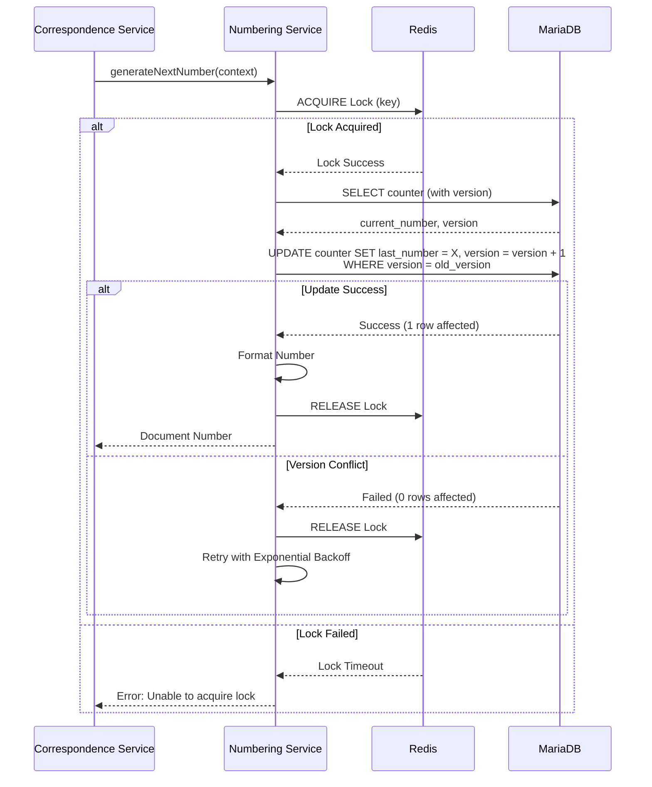

# ADR-002: Document Numbering Strategy

**Status:** Accepted
**Date:** 2025-11-30
**Decision Makers:** Development Team, System Architect
**Related Documents:**

- [System Architecture](../02-architecture/system-architecture.md)
- [Document Numbering Requirements](../01-requirements/03.11-document-numbering.md)

---

## Context and Problem Statement

LCBP3-DMS ต้องสร้างเลขที่เอกสารอัตโนมัติสำหรับ Correspondences และ RF

As โดยเลขที่เอกสารต้อง:

1. **Unique:** ไม่ซ้ำกันในระบบ
2. **Sequential:** เรียงตามลำดับเวลา
3. **Meaningful:** มีโครงสร้างที่อ่านเข้าใจได้ (เช่น `TEAM-RFA-STR-2025-0001`)
4. **Configurable:** สามารถปรับรูปแบบได้ตาม Project/Organization
5. **Concurrent-safe:** ป้องกัน Race Condition เมื่อมีหลาย Request พร้อมกัน

### Key Challenges

1. **Race Condition:** เมื่อมี 2+ requests พร้อมกัน อาจได้เลขเดียวกัน
2. **Performance:** ต้องรวดเร็วแม้มี concurrent requests
3. **Flexibility:** รองรับรูปแบบเลขที่หลากหลาย
4. **Discipline Support:** เลขที่ต้องรวม Discipline Code (GEN, STR, ARC)

---

## Decision Drivers

- **Data Integrity:** เลขที่ต้องไม่ซ้ำกันเด็ดขาด
- **Performance:** Generate เลขที่ได้เร็ว (< 100ms)
- **Scalability:** รองรับ concurrent requests สูง
- **Maintainability:** ง่ายต่อการ Config และ Debug
- **Flexibility:** รองรับรูปแบบที่หลากหลาย

---

## Considered Options

### Option 1: Database AUTO_INCREMENT

**แนวทาง:** ใช้ MySQL AUTO_INCREMENT column

**Pros:**

- ✅ Simple implementation
- ✅ Database handles uniqueness
- ✅ Very fast performance

**Cons:**

- ❌ ไม่ Configurable (รูปแบบเลขที่ fixed)
- ❌ ยากต่อการ Partition by Project/Type/Year
- ❌ ไม่รองรับ Custom format (เช่น `TEAM-RFA-2025-0001`)
- ❌ Reset ตาม Year ทำได้ยาก

### Option 2: Application-Level Counter (Single Lock)

**แนวทาง:** ใช้ Redis INCR สำหรับ Counter

**Pros:**

- ✅ Fast performance (Redis in-memory)
- ✅ Configurable format
- ✅ Easy to partition (different Redis keys)

**Cons:**

- ❌ Single Point of Failure (ถ้า Redis down)
- ❌ ไม่มี Persistence ถ้า Redis crash (ถ้าไม่ใช้ AOF/RDB)
- ❌ Difficult to audit (ไม่มี history ใน DB)

### Option 3: **Double-Lock Mechanism (Redis + Database)** ⭐ (Selected)

**แนวทาง:** ใช้ Redis Distributed Lock + Database Optimistic Locking + Version Column

**Pros:**

- ✅ **Guaranteed Uniqueness:** Double-layer protection
- ✅ **Fast Performance:** Redis lock prevents most conflicts
- ✅ **Audit Trail:** Counter history in database
- ✅ **Configurable Format:** Template-based generation
- ✅ **Resilient:** Fallback to DB if Redis issues
- ✅ **Partition Support:** Different counters per Project/Type/Discipline/Year

**Cons:**

- ❌ More complex implementation
- ❌ Slightly slower than pure Redis (but still fast)
- ❌ Requires both Redis and DB

---

## Decision Outcome

**Chosen Option:** Option 3 - Double-Lock Mechanism (Redis + Database)

### Rationale

เลือก Double-Lock เนื่องจาก:

1. **Mission-Critical:** เลขที่เอกสารต้องถูกต้อง 100% (ไม่ยอมรับการซ้ำ)
2. **Performance + Safety:** Balance ระหว่างความเร็วและความปลอดภัย
3. **Auditability:** มี Counter history ใน Database
4. **Flexibility:** รองรับ Template-based format
5. **Resilience:** ถ้า Redis มีปัญหา ยัง Fallback ไปใช้ DB Lock ได้

---

## Implementation Details

### Database Schema

```sql
-- Format Templates
CREATE TABLE document_number_formats (
  id INT PRIMARY KEY AUTO_INCREMENT,
  project_id INT NOT NULL,
  correspondence_type_id INT NOT NULL,
  format_template VARCHAR(255) NOT NULL,
  -- Example: '{ORG_CODE}-{TYPE_CODE}-{DISCIPLINE_CODE}-{YEAR}-{SEQ:4}'
  description TEXT,
  created_at TIMESTAMP DEFAULT CURRENT_TIMESTAMP,
  FOREIGN KEY (project_id) REFERENCES projects(id),
  FOREIGN KEY (correspondence_type_id) REFERENCES correspondence_types(id),
  UNIQUE KEY (project_id, correspondence_type_id)
);

-- Counter Table with Optimistic Locking
CREATE TABLE document_number_counters (
  project_id INT NOT NULL,
  originator_organization_id INT NOT NULL,
  correspondence_type_id INT NOT NULL,
  discipline_id INT DEFAULT 0,  -- 0 = no discipline
  current_year INT NOT NULL,
  last_number INT DEFAULT 0,
  version INT DEFAULT 0 NOT NULL,  -- Version for Optimistic Lock
  updated_at TIMESTAMP DEFAULT CURRENT_TIMESTAMP ON UPDATE CURRENT_TIMESTAMP,
  PRIMARY KEY (project_id, originator_organization_id, correspondence_type_id, discipline_id, current_year),
  FOREIGN KEY (project_id) REFERENCES projects(id),
  FOREIGN KEY (originator_organization_id) REFERENCES organizations(id),
  FOREIGN KEY (correspondence_type_id) REFERENCES correspondence_types(id),
  FOREIGN KEY (discipline_id) REFERENCES disciplines(id)
);
```

### NestJS Service Implementation

```typescript
// document-numbering.service.ts
import { Injectable } from '@nestjs/common';
import { InjectRepository } from '@nestjs/typeorm';
import { Repository } from 'typeorm';
import Redlock from 'redlock';
import Redis from 'ioredis';

interface NumberingContext {
  projectId: number;
  organizationId: number;
  typeId: number;
  disciplineId?: number;
  year?: number;
}

@Injectable()
export class DocumentNumberingService {
  constructor(
    @InjectRepository(DocumentNumberCounter)
    private counterRepo: Repository<DocumentNumberCounter>,
    @InjectRepository(DocumentNumberFormat)
    private formatRepo: Repository<DocumentNumberFormat>,
    private redis: Redis,
    private redlock: Redlock
  ) {}

  async generateNextNumber(context: NumberingContext): Promise<string> {
    const year = context.year || new Date().getFullYear();
    const disciplineId = context.disciplineId || 0;

    // Step 1: Acquire Redis Distributed Lock
    const lockKey = `doc_num:${context.projectId}:${context.organizationId}:${context.typeId}:${disciplineId}:${year}`;
    const lock = await this.redlock.acquire([lockKey], 3000); // 3 second TTL

    try {
      // Step 2: Query current counter with version
      let counter = await this.counterRepo.findOne({
        where: {
          project_id: context.projectId,
          originator_organization_id: context.organizationId,
          correspondence_type_id: context.typeId,
          discipline_id: disciplineId,
          current_year: year,
        },
      });

      // Initialize counter if not exists
      if (!counter) {
        counter = this.counterRepo.create({
          project_id: context.projectId,
          originator_organization_id: context.organizationId,
          correspondence_type_id: context.typeId,
          discipline_id: disciplineId,
          current_year: year,
          last_number: 0,
          version: 0,
        });
      }

      const currentVersion = counter.version;
      const nextNumber = counter.last_number + 1;

      // Step 3: Update counter with Optimistic Lock check
      const result = await this.counterRepo
        .createQueryBuilder()
        .update(DocumentNumberCounter)
        .set({
          last_number: nextNumber,
          version: () => 'version + 1',
        })
        .where({
          project_id: context.projectId,
          originator_organization_id: context.organizationId,
          correspondence_type_id: context.typeId,
          discipline_id: disciplineId,
          current_year: year,
          version: currentVersion, // Optimistic lock check
        })
        .execute();

      if (result.affected === 0) {
        throw new Error('Optimistic lock conflict - counter version changed');
      }

      // Step 4: Generate formatted number
      const format = await this.getFormat(context.projectId, context.typeId);
      const formattedNumber = await this.formatNumber(format, {
        ...context,
        year,
        sequenceNumber: nextNumber,
      });

      return formattedNumber;
    } finally {
      // Step 5: Release Redis lock
      await lock.release();
    }
  }

  private async formatNumber(
    format: DocumentNumberFormat,
    data: any
  ): Promise<string> {
    let result = format.format_template;

    // Replace tokens
    const tokens = {
      '{ORG_CODE}': await this.getOrgCode(data.organizationId),
      '{TYPE_CODE}': await this.getTypeCode(data.typeId),
      '{DISCIPLINE_CODE}': await this.getDisciplineCode(data.disciplineId),
      '{YEAR}': data.year.toString(),
      '{SEQ:4}': data.sequenceNumber.toString().padStart(4, '0'),
    };

    for (const [token, value] of Object.entries(tokens)) {
      result = result.replace(token, value);
    }

    return result;
  }
}
```

### Algorithm Flow



---

## Consequences

### Positive

1. ✅ **Zero Duplicate Risk:** Double-lock guarantees uniqueness
2. ✅ **High Performance:** Redis lock prevents most DB conflicts (< 100ms)
3. ✅ **Audit Trail:** All counters stored in database
4. ✅ **Template-Based:** Easy to configure different formats
5. ✅ **Partition Support:** Separate counters per Project/Type/Discipline/Year
6. ✅ **Discipline Integration:** รองรับ Discipline Code ตาม Requirement 6B

### Negative

1. ❌ **Complexity:** Requires Redis + Database coordination
2. ❌ **Dependencies:** Requires both Redis and DB healthy
3. ❌ **Retry Logic:** May retry on optimistic lock conflicts
4. ❌ **Monitoring:** Need to monitor lock acquisition times

### Mitigation Strategies

- **Redis Dependency:** Use Redis Persistence (AOF) และ Replication
- **Complexity:** Encapsulate logic in `DocumentNumberingService`
- **Retry:** Exponential backoff with max 3 retries
- **Monitoring:** Track lock wait times และ conflict rates

---

## Testing Strategy

### Unit Tests

```typescript
describe('DocumentNumberingService - Concurrent Generation', () => {
  it('should generate unique numbers for 100 concurrent requests', async () => {
    const context = {
      projectId: 1,
      organizationId: 1,
      typeId: 1,
      disciplineId: 2, // STR
      year: 2025,
    };

    const promises = Array(100)
      .fill(null)
      .map(() => service.generateNextNumber(context));

    const results = await Promise.all(promises);

    // Check uniqueness
    const unique = new Set(results);
    expect(unique.size).toBe(100);

    // Check sequential
    const numbers = results.map((r) => parseInt(r.split('-').pop()));
    const sorted = [...numbers].sort((a, b) => a - b);
    expect(numbers.every((n, i) => sorted.includes(n))).toBe(true);
  });

  it('should use correct format template', async () => {
    const number = await service.generateNextNumber({
      projectId: 1,
      organizationId: 3, // TEAM
      typeId: 1, // RFA
      disciplineId: 2, // STR
      year: 2025,
    });

    expect(number).toMatch(/^TEAM-RFA-STR-2025-\d{4}$/);
  });
});
```

### Load Testing

```yaml
# Artillery configuration
config:
  target: 'http://localhost:3000'
  phases:
    - duration: 60
      arrivalRate: 50 # 50 requests/second

scenarios:
  - name: 'Generate Document Numbers'
    flow:
      - post:
          url: '/correspondences'
          json:
            title: 'Load Test {{ $randomString() }}'
            project_id: 1
            type_id: 1
            discipline_id: 2
```

---

## Compliance

เป็นไปตาม:

- [Backend Plan Section 4.2.10](../../docs/2_Backend_Plan_V1_4_5.md) - DocumentNumberingModule
- [Requirements 3.11](../01-requirements/03.11-document-numbering.md) - Document Numbering
- [Requirements 6B](../../docs/2_Backend_Plan_V1_4_4.Phase6B.md) - Discipline Support

---

## Related ADRs

- [ADR-001: Unified Workflow Engine](./ADR-001-unified-workflow-engine.md) - Workflow triggers number generation
- [ADR-005: Redis Usage Strategy](./ADR-005-redis-usage-strategy.md) - Redis lock implementation

---

## References

- [Redlock Algorithm](https://redis.io/topics/distlock)
- [TypeORM Optimistic Locking](https://typeorm.io/entities#version-column)
- [Distributed Lock Patterns](https://martin.kleppmann.com/2016/02/08/how-to-do-distributed-locking.html)
