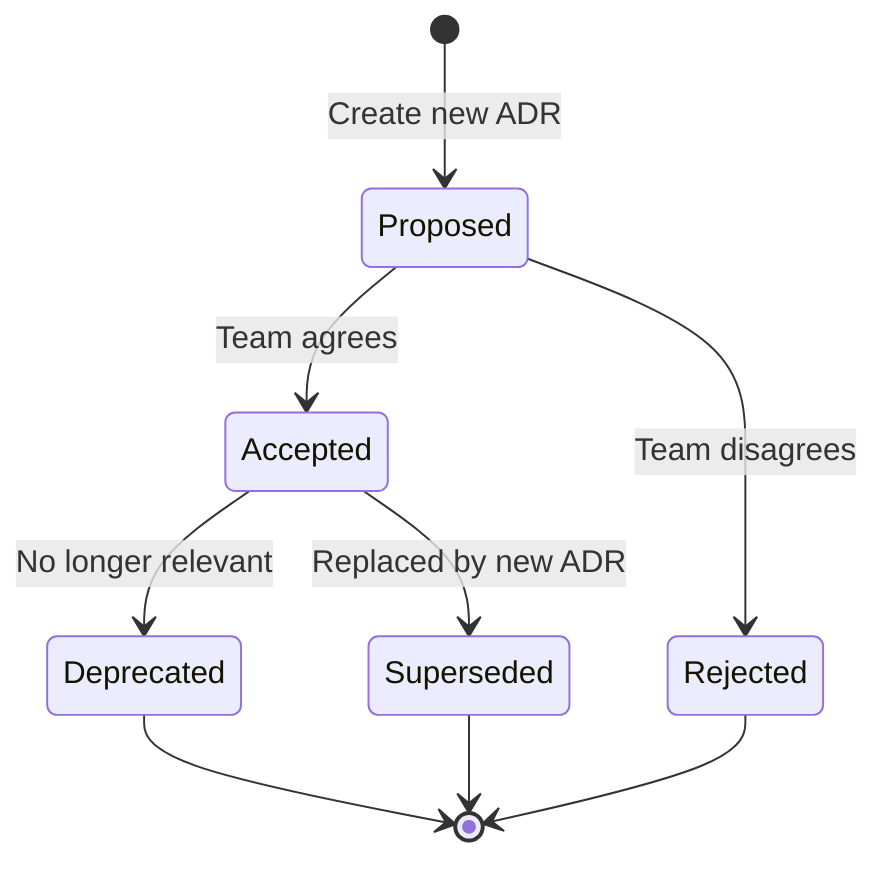
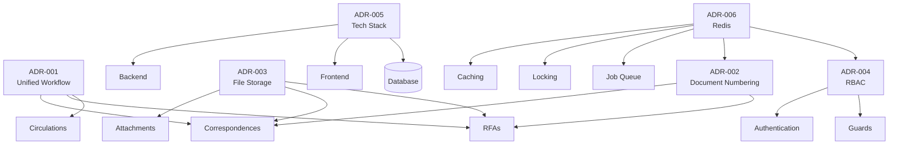

# Architecture Decision Records (ADRs)

**Last Updated:** 2025-11-30
**Project:** LCBP3-DMS (Laem Chabang Port Phase 3 - Document Management System)

---

## 📋 What are ADRs?

Architecture Decision Records (ADRs) เป็นเอกสารที่บันทึก **ประวัติการตัดสินใจทางสถาปัตยกรรมที่สำคัญ** ของโปรเจกต์ โดยร ะบุ:

- **Context**: เหตุผลที่ต้องตัดสินใจ
- **Options Considered**: ทางเลือกที่พิจารณา
- **Decision**: สิ่งที่เลือก และเหตุผล
- **Consequences**: ผลที่ตามมา (ดีและไม่ดี)

**วัตถุประสงค์:**

1. ทำให้ทีมเข้าใจ "ทำไม" นอกเหนือจาก "ทำอย่างไร"
2. ป้องกันการสงสัยว่า "ทำไมถึงออกแบบแบบนี้" ในอนาคต
3. ช่วยในการ Onboard สมาชิกใหม่
4. บันทึกประวัติศาสตร์การพัฒนาโปรเจกต์

---

## 📚 ADR Index

### Core Architecture Decisions

| ADR                                                 | Title                           | Status      | Date       | Summary                                                                      |
| --------------------------------------------------- | ------------------------------- | ----------- | ---------- | ---------------------------------------------------------------------------- |
| [ADR-001](./ADR-001-unified-workflow-engine.md)     | Unified Workflow Engine         | ✅ Accepted | 2025-11-30 | ใช้ DSL-based Workflow Engine สำหรับ Correspondences, RFAs, และ Circulations |
| [ADR-002](./ADR-002-document-numbering-strategy.md) | Document Numbering Strategy     | ✅ Accepted | 2025-11-30 | Double-lock mechanism (Redis + DB Optimistic Lock) สำหรับเลขที่เอกสาร        |
| [ADR-003](./ADR-003-file-storage-approach.md)       | Two-Phase File Storage Approach | ✅ Accepted | 2025-11-30 | Upload → Temp → Commit to Permanent เพื่อป้องกัน Orphan Files                |

### Security & Access Control

| ADR                                         | Title                         | Status      | Date       | Summary                                                       |
| ------------------------------------------- | ----------------------------- | ----------- | ---------- | ------------------------------------------------------------- |
| [ADR-004](./ADR-004-rbac-implementation.md) | RBAC Implementation (4-Level) | ✅ Accepted | 2025-11-30 | Hierarchical RBAC: Global → Organization → Project → Contract |

### Technology & Infrastructure

| ADR                                                 | Title                                | Status      | Date       | Summary                                                        |
| --------------------------------------------------- | ------------------------------------ | ----------- | ---------- | -------------------------------------------------------------- |
| [ADR-005](./ADR-005-technology-stack.md)            | Technology Stack Selection           | ✅ Accepted | 2025-11-30 | Full Stack TypeScript: NestJS + Next.js + MariaDB + Redis      |
| [ADR-006](./ADR-006-redis-caching-strategy.md)      | Redis Usage & Caching Strategy       | ✅ Accepted | 2025-11-30 | Redis สำหรับ Distributed Lock, Cache, Queue, และ Rate Limiting |
| [ADR-009](./ADR-009-database-migration-strategy.md) | Database Migration & Deployment      | ✅ Accepted | 2025-12-01 | TypeORM Migrations พร้อม Blue-Green Deployment                 |
| [ADR-015](./ADR-015-deployment-infrastructure.md)   | Deployment & Infrastructure Strategy | ✅ Accepted | 2025-12-01 | Docker Compose with Blue-Green Deployment on QNAP              |
| [ADR-016](./ADR-016-security-authentication.md)     | Security & Authentication Strategy   | ✅ Accepted | 2025-12-01 | JWT + bcrypt + OWASP Security Best Practices                   |

### API & Integration

| ADR                                                 | Title                         | Status      | Date       | Summary                                                                       |
| --------------------------------------------------- | ----------------------------- | ----------- | ---------- | ----------------------------------------------------------------------------- |
| [ADR-007](./ADR-007-api-design-error-handling.md)   | API Design & Error Handling   | ✅ Accepted | 2025-12-01 | Standard REST API with Custom Error Format + NestJS Exception Filters         |
| [ADR-008](./ADR-008-email-notification-strategy.md) | Email & Notification Strategy | ✅ Accepted | 2025-12-01 | BullMQ + Redis Queue สำหรับ Multi-channel Notifications (Email, LINE, In-app) |

### Observability

| ADR                                                 | Title                         | Status      | Date       | Summary                                                       |
| --------------------------------------------------- | ----------------------------- | ----------- | ---------- | ------------------------------------------------------------- |
| [ADR-010](./ADR-010-logging-monitoring-strategy.md) | Logging & Monitoring Strategy | ✅ Accepted | 2025-12-01 | Winston Structured Logging พร้อม Future ELK Stack Integration |

### Frontend Architecture

| ADR                                              | Title                            | Status      | Date       | Summary                                               |
| ------------------------------------------------ | -------------------------------- | ----------- | ---------- | ----------------------------------------------------- |
| [ADR-011](./ADR-011-nextjs-app-router.md)        | Next.js App Router & Routing     | ✅ Accepted | 2025-12-01 | App Router with Server Components and Nested Layouts  |
| [ADR-012](./ADR-012-ui-component-library.md)     | UI Component Library (Shadcn/UI) | ✅ Accepted | 2025-12-01 | Shadcn/UI + Tailwind CSS for Full Component Ownership |
| [ADR-013](./ADR-013-form-handling-validation.md) | Form Handling & Validation       | ✅ Accepted | 2025-12-01 | React Hook Form + Zod for Type-Safe Forms             |
| [ADR-014](./ADR-014-state-management.md)         | State Management Strategy        | ✅ Accepted | 2025-12-01 | Zustand for Client State + Server Components          |

---

## 🔍 ADR Categories

### 1. Business Logic & Workflows

- **ADR-001:** Unified Workflow Engine - ใช้ JSON DSL แทน Hard-coded routing tables

### 2. Data Integrity & Concurrency

- **ADR-002:** Document Numbering - Double-lock เพื่อป้องกัน Race Condition
- **ADR-003:** File Storage - Two-phase เพื่อ Transaction safety
- **ADR-009:** Database Migration - TypeORM Migrations พร้อม Blue-Green Deployment

### 3. Security & Access Control

- **ADR-004:** RBAC - 4-level scope สำหรับ Fine-grained permissions

### 4. Infrastructure & Performance

- **ADR-005:** Technology Stack - TypeScript ecosystem
- **ADR-006:** Redis - Caching และ Distributed coordination
- **ADR-015:** Deployment - Docker Compose with Blue-Green Deployment
- **ADR-016:** Security - JWT Authentication + OWASP Best Practices

### 5. API & Integration

- **ADR-007:** API Design - REST API with Custom Error Format
- **ADR-008:** Notification - BullMQ Queue สำหรับ Multi-channel notifications

### 6. Observability & Monitoring

- **ADR-010:** Logging - Winston Structured Logging พร้อม Future ELK Stack

### 7. Frontend Architecture

- **ADR-011:** Next.js App Router - Server Components และ Nested Layouts
- **ADR-012:** UI Components - Shadcn/UI + Tailwind CSS
- **ADR-013:** Form Handling - React Hook Form + Zod Validation
- **ADR-014:** State Management - Zustand + Server Components

---

## 📖 How to Read ADRs

### ADR Structure

แต่ละ ADR มีโครงสร้างดังนี้:

1. **Status**: Accepted, Proposed, Deprecated, Superseded
2. **Context**: ปัญหาหรือสถานการณ์ที่ต้องตัดสินใจ
3. **Decision Drivers**: ปัจจัยที่มีผลต่อการตัดสินใจ
4. **Considered Options**: ทางเลือกที่พิจารณา (พร้อม Pros/Cons)
5. **Decision Outcome**: สิ่งที่เลือก และเหตุผล
6. **Consequences**: ผลที่ตามมา (Positive/Negative/Mitigation)
7. **Implementation Details**: รายละเอียดการ Implement (Code examples)
8. **Related ADRs**: ADR อื่นที่เกี่ยวข้อง

### Reading Tips

- เริ่มจาก **Context** เพื่อเข้าใจปัญหา
- ดู **Considered Options** เพื่อเข้าใจ Trade-offs
- อ่าน **Consequences** เพื่อรู้ว่าต้อง Maintain อย่างไร
- ดู **Related ADRs** เพื่อเข้าใจภาพรวม

---

## 🆕 Creating New ADRs

### When to Create an ADR?

สร้าง ADR เมื่อ:

- ✅ เลือก Technology/Framework หลัก
- ✅ ออกแบบ Architecture Pattern สำคัญ
- ✅ แก้ปัญหาซับซ้อนที่มีหลาย Alternatives
- ✅ Trade-offs ที่มีผลกระทบระยะยาว
- ✅ ตัดสินใจที่ยากจะ Revert (Irreversible decisions)

**ไม่ต้องสร้าง ADR สำหรับ:**

- ❌ การเลือก Library เล็กๆ ที่เปลี่ยนได้ง่าย
- ❌ Implementation details ที่ไม่กระทบ Architecture
- ❌ Coding style หรือ Naming conventions

### ADR Template

```markdown
# ADR-XXX: [Title]

**Status:** Proposed
**Date:** YYYY-MM-DD
**Decision Makers:** [Names]
**Related Documents:** [Links]

---

## Context and Problem Statement

[Describe the problem...]

---

## Decision Drivers

- [Driver 1]
- [Driver 2]

---

## Considered Options

### Option 1: [Name]

**Pros:**

- ✅ [Pro 1]

**Cons:**

- ❌ [Con 1]

---

## Decision Outcome

**Chosen Option:** [Option X]

### Rationale

[Why this option...]

---

## Consequences

### Positive

1. ✅ [Impact 1]

### Negative

1. ❌ [Risk 1]

---

## Related ADRs

- [ADR-XXX: Title](./ADR-XXX.md)
```

---

## 🔄 ADR Lifecycle



### Status Definitions

- **Proposed**: รอการ Review และ Approve
- **Accepted**: ผ่านการ Review แล้ว กำลังใช้งาน
- **Deprecated**: เลิกใช้แล้ว แต่ยังอยู่ในระบบ
- **Superseded**: ถูกแทนที่โดย ADR อื่น
- **Rejected**: ไม่ผ่านการ Approve

---

## 📊 ADR Impact Map



---

## 🔗 Related Documentation

- [System Architecture](../02-architecture/system-architecture.md) - สถาปัตยกรรมระบบโดยรวม
- [Data Model](../02-architecture/data-model.md) - โครงสร้างฐานข้อมูล
- [API Design](../02-architecture/api-design.md) - การออกแบบ API
- [Backend Guidelines](../03-implementation/backend-guidelines.md) - มาตรฐานการพัฒนา Backend
- [Frontend Guidelines](../03-implementation/frontend-guidelines.md) - มาตรฐานการพัฒนา Frontend

---

## 📝 Review Process

### Before Merging

1. สร้าง ADR ใน `specs/05-decisions/ADR-XXX-title.md`
2. Update ADR Index ใน `README.md` นี้
3. Link ADR ไปยัง Related Documents
4. Request Review จากทีม
5. อภิปรายและปรับแก้ตาม Feedback
6. Update Status เป็น "Accepted"
7. Merge to main branch

### Review Checklist

- ☐ Context ชัดเจน เข้าใจปัญหา
- ☐ มี Options อย่างน้อย 2-3 ทางเลือก
- ☐ Pros/Cons ครบถ้วน
- ☐ Decision Rationale มีเหตุผลรองรับ
- ☐ Consequences ระบุทั้งดีและไม่ดี
- ☐ Related ADRs linked ถูกต้อง
- ☐ Code examples (ถ้ามี) อ่านง่าย

---

## 🎯 Best Practices

### Writing Good ADRs

1. **Be Concise:** ไม่เกิน 3-4 หน้า (except code examples)
2. **Focus on "Why":** อธิบายเหตุผลมากกว่า "How"
3. **List Alternatives:** แสดงว่าพิจารณาหลายทางเลือก
4. **Be Honest:** ระบุ Cons และ Risks จริงๆ
5. **Use Diagrams:** Visualize ด้วย Mermaid diagrams
6. **Link References:** ใส่ Link ไปเอกสารอ้างอิง

### Common Mistakes

- ❌ เขียนยาวเกินไป (วนเวียน)
- ❌ ไม่มี Alternatives (แสดงว่าไม่ได้พิจารณา)
- ❌ Consequences ไม่จริงใจ (แต่งว่าดีอย่างเดียว)
- ❌ Implementation details มากเกินไป
- ❌ ไม่ Update เมื่อ Decision เปลี่ยน

---

## 📚 External Resources

- [ADR GitHub Organization](https://adr.github.io/)
- [Documenting Architecture Decisions](https://cognitect.com/blog/2011/11/15/documenting-architecture-decisions)
- [ADR Tools](https://github.com/npryce/adr-tools)
- [Architecture Decision Records in Action](https://www.thoughtworks.com/insights/blog/architecture/architecture-decision-records-in-action)

---

## 📧 Contact

หากมีคำถามเกี่ยวกับ ADRs กรุณาติดต่อ:

- **System Architect:** Nattanin Peancharoen
- **Development Team Lead:** [Name]

---

**Version:** 1.5.0
**Last Review:** 2025-11-30
