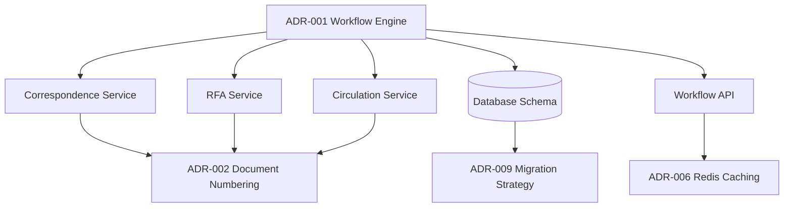

# ADR-001: Unified Workflow Engine

**Status:** Accepted
**Date:** 2026-02-24
**Last Amended:** 2026-05-02
**Decision Makers:** Development Team, System Architect
**Related Documents:**

- [Software Architecture](../02-Architecture/02-02-software-architecture.md)
- [Unified Workflow Requirements](../01-Requirements/01-03-modules/01-03-06-unified-workflow.md)

---

## 🎯 Gap Analysis & Purpose

### ปิด Gap จากเอกสาร:
- **Unified Workflow Requirements** - Section 2.1: "LCBP3-DMS ต้องรองรับเอกสารหลายประเภทพร้อม Workflow ที่แตกต่างกัน"
  - เหตุผล: ระบบเดิมไม่มีกลไกส่วนกลางสำหรับจัดการ Workflow ทำให้เกิด Code Duplication
- **Software Architecture** - Section 3.2: "ระบบต้องมีความยืดหยุ่นในการเพิ่ม Document Type ใหม่"
  - เหตุผล: การ Hard-code Workflow ทำให้การเพิ่มประเภทเอกสารใหม่ทำได้ยาก

### แก้ไขความขัดแย้ง:
- **Correspondence Requirements** vs **RFA Requirements**: ทั้งสอง Module ต้องการ State Management แต่ใช้วิธีต่างกัน
  - การตัดสินใจนี้ช่วยแก้ไขโดย: สร้าง Unified Engine ที่รองรับทุก Document Type

---

## Context and Problem Statement

LCBP3-DMS ต้องจัดการเอกสารหลายประเภท (Correspondences, RFAs, Circulations) โดยแต่ละประเภทมี Workflow การเดินเอกสารที่แตกต่างกัน:

- **Correspondence Routing:** ส่งเอกสารระหว่างองค์กร มีการ Forward, Reply
- **RFA Approval Workflow:** ส่งขออนุมัติ มีขั้นตอน Review → Approve → Respond
- **Circulation Workflow:** เวียนเอกสารภายในองค์กร มีการ Assign ผู้รับเพื่อพิจารณา

### Key Problems

1. **Code Duplication:** หากสร้างตาราง Routing แยกกันสำหรับแต่ละประเภทเอกสาร จะมี Logic ซ้ำซ้อน
2. **Complexity:** การ Maintain หลาย Workflow Systems ทำให้ซับซ้อน
3. **Inconsistency:** State Management และ History Tracking อาจไม่สอดคล้องกัน
4. **Scalability:** เมื่อเพิ่มประเภทเอกสารใหม่ ต้องสร้าง Workflow System ใหม่
5. **Versioning:** การแก้ไข Workflow กระทบเอกสารที่กำลังดำเนินการอยู่

---

## Clarifications

### Session 2026-05-02 (Round 1 — ADR-001-add.md merge)

- Q: Event handling — Outbox Pattern หรือ BullMQ (ADR-008)? → A: **BullMQ only** — WorkflowEngine enqueues BullMQ job โดยตรง ไม่มี outbox table; สอดคล้อง ADR-008
- Q: Concurrency control — Optimistic Lock vs Redis Redlock vs แยก concern? → A: **แยก concern** — `version_no` optimistic lock สำหรับ state transition; Redis Redlock เฉพาะ Document Numbering (ADR-002)
- Q: Context schema — validate ที่ไหน และ scope ระดับใด? → A: **Two-phase validation** (save-time + transition-time); schema scope **per `workflow_definition` version**
- Q: Condition Engine library? → A: **`json-logic-js` in-process** ใน `WorkflowDslService`; fallback to custom parser if production issues
- Q: Auto-action worker — extend existing หรือ dedicated queue? → A: **Dedicated `workflow-events` BullMQ queue** แยกจาก `notification-queue`

### Session 2026-05-02 (Round 2 — ADR-001 full review)

- Q: DDL gap — เพิ่ม `version_no` + `context_schema` ใน DDL? → A: **yes** — `version_no INT NOT NULL DEFAULT 1` ใน `workflow_instances`; `context_schema JSON NULL` ใน `workflow_definitions`
- Q: ConflictException retry strategy? → A: **409 ขึ้น frontend** via `BusinessException` (ADR-007); frontend แสดง toast "กรุณาลองใหม่" — ไม่ auto-retry
- Q: Redis cache TTL/invalidation strategy? → A: **TTL 1h + event invalidation** เมื่อ admin save/activate DSL; key `wf:def:{workflow_code}:{version}`
- Q: WorkflowEventsWorker concurrency/retry config? → A: **concurrency 5, retry 3 + exponential backoff + dead-letter queue**
- Q: RBAC สำหรับ DSL authoring? → A: **Super Admin เท่านั้น** (`system.manage_all`) — create/update/activate/deactivate workflow definitions

### Session 2026-05-02 (Round 3 — ADR-019 compliance + ops)

- Q: `action_by_user_id INT NULL` ใน `workflow_histories` — ADR-019 compliance? → A: **คง INT FK + `@Exclude()`** บน Entity; เพิ่ม `action_by_user_uuid VARCHAR(36) NULL` สำหรับ API response
- Q: `validateContext()` fail ที่ transition-time — HTTP status? → A: **422 Unprocessable Entity** via `ValidationException` (ADR-007 Validation tier) พร้อม field-level errors
- Q: Dead-letter queue `workflow-events-failed` — ops procedure? → A: **n8n webhook alert + Bull Board UI** สำหรับ manual requeue
- Q: n8n webhook URL — เก็บที่ไหน? → A: **`N8N_WEBHOOK_URL` environment variable** ใน `docker-compose.yml`; อ่านผ่าน `ConfigService`
- Q: `context_schema.required` — enforce จริงหรือไม่? → A: **enforce strictly** — required field หาย → throw 422 `ValidationException`; ไม่ block transition

---

## Decision Drivers

- **DRY Principle:** Don't Repeat Yourself - ลดการเขียน Code ซ้ำ
- **Maintainability:** ง่ายต่อการ Maintain และ Debug
- **Flexibility:** รองรับการเปลี่ยนแปลง Workflow ในอนาคต
- **Traceability:** ติดตามประวัติการเปลี่ยนสถานะได้ชัดเจน
- **Performance:** ประมวลผล Workflow ได้เร็วและมีประสิทธิภาพ

---

## Considered Options

### Option 1: Hard-coded Workflow per Document Type

**แนวทาง:** สร้างตาราง `correspondence_routings`, `rfa_approvals`, `circulation_routings` แยกกัน

**Pros:**

- ✅ เข้าใจง่าย straightforward
- ✅ Query performance ดี (table-specific indexes)
- ✅ Schema ชัดเจนสำหรับแต่ละ type

**Cons:**

- ❌ Code duplication มาก
- ❌ ยากต่อการเพิ่ม Document Type ใหม่
- ❌ Inconsistent state management
- ❌ ไม่มี Workflow versioning mechanism
- ❌ ยากต่อการ reuse common workflows

### Option 2: Generic Workflow Engine with Hard-coded State Machines

**แนวทาง:** สร้าง Workflow Engine แต่ Hard-code State Machine ไว้ใน Code

**Pros:**

- ✅ Centralized workflow logic
- ✅ Reusable workflow components
- ✅ Better maintainability

**Cons:**

- ❌ ต้อง Deploy ใหม่ทุกครั้งที่แก้ Workflow
- ❌ ไม่ยืดหยุ่นสำหรับ Business Users
- ❌ Versioning ยังซับซ้อน

### Option 3: **DSL-Based Unified Workflow Engine** ⭐ (Selected)

**แนวทาง:** สร้าง Workflow Engine ที่ใช้ JSON-based DSL (Domain Specific Language) เพื่อ Define Workflows

**Pros:**

- ✅ **Single Source of Truth:** Workflow logic อยู่ใน Database
- ✅ **Versioning Support:** เก็บ Workflow Definition versions ได้
- ✅ **Runtime Flexibility:** แก้ Workflow ได้โดยไม่ต้อง Deploy
- ✅ **Reusability:** Workflow templates สามารถใช้ซ้ำได้
- ✅ **Consistency:** State management เป็นมาตรฐานเดียวกัน
- ✅ **Audit Trail:** ประวัติครบถ้วนใน `workflow_histories`
- ✅ **Scalability:** เพิ่ม Document Type ใหม่ได้ง่าย

**Cons:**

- ❌ Initial development complexity สูง
- ❌ ต้องเขียน DSL Parser และ Validator
- ❌ Performance overhead เล็กน้อย (parse JSON)
- ❌ Learning curve สำหรับทีม

---

## Decision Outcome

**Chosen Option:** Option 3 - DSL-Based Unified Workflow Engine

### Rationale

เลือก Unified Workflow Engine เนื่องจาก:

1. **Long-term Maintainability:** แม้จะมี complexity ในการพัฒนา แต่ในระยะยาวจะลดภาระการ Maintain
2. **Business Flexibility:** Business Users สามารถปรับ Workflow ได้ (ผ่าน Admin UI ในอนาคต)
3. **Consistency:** สถานะและประวัติเป็นมาตรฐานเดียวกันทุก Document Type
4. **Scalability:** เตรียมพร้อมสำหรับ Document Types ใหม่ๆ ในอนาคต
5. **Versioning:** รองรับการแก้ไข Workflow โดยไม่กระทบ In-progress documents

---

## 🔍 Impact Analysis

### Affected Components (ส่วนประกอบที่ได้รับผลกระทบ)

| Component | Level | Impact Description | Required Action |
|-----------|-------|-------------------|-----------------|
| **Backend** | 🔴 High | ต้องสร้าง Workflow Engine Module ใหม่ และ Refactor ทุก Document Service | Implement WorkflowEngineService |
| **Database** | 🔴 High | เพิ่ม Tables: workflow_definitions, workflow_instances, workflow_histories | Create new schema |
| **Frontend** | 🟡 Medium | ต้อง Update UI สำหรับ Workflow Status และ Actions | Update components |
| **API** | 🔴 High | ต้องสร้าง Workflow API endpoints และ Update ทุก Document API | New endpoints + updates |
| **Testing** | 🟡 Medium | ต้องเขียน Tests สำหรับ Workflow Engine และ Integration Tests | New test suites |

### Required Changes (การเปลี่ยนแปลงที่ต้องดำเนินการ)

#### 🔴 Critical Changes (ต้องทำทันที)
- [ ] **Create Workflow Engine Module** - backend/src/modules/workflow-engine/: สร้าง Engine หลัก
- [ ] **Implement Database Schema** - specs/03-Data-and-Storage/: เพิ่ม workflow tables
- [ ] **Refactor Correspondence Service** - backend/src/modules/correspondence/: ใช้ Workflow Engine
- [ ] **Refactor RFA Service** - backend/src/modules/rfa/: ใช้ Workflow Engine
- [ ] **Refactor Circulation Service** - backend/src/modules/circulation/: ใช้ Workflow Engine

#### 🟡 Important Changes (ควรทำภายใน 2 สัปดาห์)
- [ ] **Update Frontend Workflow Components** - frontend/components/workflow/: UI สำหรับ Workflow
- [ ] **Create Workflow API Endpoints** - backend/src/modules/workflow-engine/controller.ts: REST API
- [ ] **Add Workflow DSL Validation** - backend/src/modules/workflow-engine/dsl-validator.ts: JSON Schema validation
- [ ] **Implement Workflow History Tracking** - backend/src/modules/workflow-engine/history.service.ts: Audit trail

#### 🟢 Nice-to-Have (ทำถ้ามีเวลา)
- [ ] **Create Admin UI for Workflow Design** - frontend/app/(admin)/admin/workflow/: Visual workflow builder
- [ ] **Add Workflow Performance Monitoring** - backend/src/modules/workflow-engine/monitoring.service.ts: Metrics

### Cross-Module Dependencies



---

## 📋 Version Dependency Matrix

| ADR | Version | Dependency Type | Affected Version(s) | Implementation Status |
|-----|---------|-----------------|---------------------|----------------------|
| **ADR-001** | 1.0 | Core | v1.8.0+ | ✅ Implemented |
| **ADR-002** | 1.0 | Required By | v1.8.0+ | ✅ Implemented |
| **ADR-006** | 1.0 | Uses | v1.8.0+ | ✅ Implemented |
| **ADR-009** | 1.0 | Database Changes | v1.8.0+ | ✅ Implemented |

### Version Compatibility Rules

- **Minimum Version:** v1.8.0 (ADR มีผลบังคับใช้)
- **Breaking Changes:** ไม่มี (Backward compatible API)
- **Deprecation Timeline:** ไม่มี (Core architecture)

---

## Implementation Details

### Database Schema

```sql
-- Workflow Definitions (Templates)
CREATE TABLE workflow_definitions (
  id VARCHAR(36) PRIMARY KEY, -- UUID
  workflow_code VARCHAR(50) NOT NULL,
  version INT NOT NULL DEFAULT 1,
  description TEXT NULL,
  dsl JSON NOT NULL,            -- Raw DSL from user
  compiled JSON NOT NULL,       -- Validated and optimized for Runtime
  context_schema JSON NULL,     -- JSON Schema for context validation (two-phase)
  is_active BOOLEAN DEFAULT TRUE,
  created_at TIMESTAMP DEFAULT CURRENT_TIMESTAMP,
  updated_at TIMESTAMP DEFAULT CURRENT_TIMESTAMP ON UPDATE CURRENT_TIMESTAMP,
  UNIQUE KEY (workflow_code, version)
);

-- Workflow Instances (Running Workflows)
CREATE TABLE workflow_instances (
  id VARCHAR(36) PRIMARY KEY, -- UUID
  definition_id VARCHAR(36) NOT NULL,
  entity_type VARCHAR(50) NOT NULL, -- e.g. "correspondence", "rfa"
  entity_id VARCHAR(50) NOT NULL,
  current_state VARCHAR(50) NOT NULL,
  version_no INT NOT NULL DEFAULT 1, -- Optimistic lock (@VersionColumn) — ป้องกัน race condition
  status ENUM('ACTIVE', 'COMPLETED', 'CANCELLED', 'TERMINATED') DEFAULT 'ACTIVE',
  context JSON NULL,
  created_at TIMESTAMP DEFAULT CURRENT_TIMESTAMP,
  updated_at TIMESTAMP DEFAULT CURRENT_TIMESTAMP ON UPDATE CURRENT_TIMESTAMP,
  FOREIGN KEY (definition_id) REFERENCES workflow_definitions(id)
);

-- Workflow History (Audit Trail)
CREATE TABLE workflow_histories (
  id VARCHAR(36) PRIMARY KEY, -- UUID
  instance_id VARCHAR(36) NOT NULL,
  from_state VARCHAR(50) NOT NULL,
  to_state VARCHAR(50) NOT NULL,
  action VARCHAR(50) NOT NULL,
  action_by_user_id INT NULL,           -- Internal FK (@Exclude() in Entity) — ห้าม expose ใน API
  action_by_user_uuid VARCHAR(36) NULL, -- UUID สำหรับ API response (ADR-019)
  comment TEXT NULL,
  metadata JSON NULL,
  created_at TIMESTAMP DEFAULT CURRENT_TIMESTAMP,
  FOREIGN KEY (instance_id) REFERENCES workflow_instances(id) ON DELETE CASCADE
);
```

### DSL Example

```json
{
  "workflow": "CORRESPONDENCE_ROUTING",
  "version": 1,
  "description": "Standard correspondence routing",
  "context_schema": {
    "type": "object",
    "properties": {
      "requiresLegal": { "type": "number" },
      "hasRecipient": { "type": "boolean" }
    },
    "required": []
  },
  "states": [
    {
      "name": "DRAFT",
      "initial": true,
      "on": {
        "SUBMIT": {
          "to": "SUBMITTED",
          "require": {
            "role": ["Admin"],
            "user": "123"
          },
          "condition": {
            "type": "json-logic",
            "rule": { ">": [{ "var": "requiresLegal" }, 0] }
          },
          "events": [
            {
              "type": "notify",
              "target": "originator",
              "template": "correspondence_submitted"
            }
          ]
        }
      }
    },
    {
      "name": "SUBMITTED",
      "on": {
        "RECEIVE": {
          "to": "RECEIVED"
        },
        "RETURN": {
          "to": "DRAFT"
        }
      }
    },
    {
      "name": "RECEIVED",
      "on": {
        "CLOSE": {
          "to": "CLOSED"
        }
      }
    },
    {
      "name": "CLOSED",
      "terminal": true
    }
  ]
}
```

> **⚠️ หมายเหตุ:** `condition` ต้องใช้ JSON Logic format (`{ "type": "json-logic", "rule": {...} }`) เท่านั้น — ห้ามใช้ JS string expression (`"context.x === true"`) เพราะเป็น security risk (code injection)

### NestJS Module Structure

```typescript
// workflow-engine.module.ts
@Module({
  imports: [TypeOrmModule.forFeature([WorkflowDefinition, WorkflowInstance, WorkflowHistory]), UserModule],
  controllers: [WorkflowEngineController],
  providers: [WorkflowEngineService, WorkflowDslService, WorkflowEventService],
  exports: [WorkflowEngineService],
})
export class WorkflowEngineModule {}

// workflow-engine.service.ts
@Injectable()
export class WorkflowEngineService {
  async createInstance(
    workflowCode: string,
    entityType: string,
    entityId: string,
    initialContext: Record<string, unknown> = {}
  ): Promise<WorkflowInstance> {
    const definition = await this.workflowDefRepo.findOne({
      where: { workflow_code: workflowCode, is_active: true },
      order: { version: 'DESC' },
    });

    // Validate initial context against context_schema (save-time phase 1)
    if (definition.compiled.contextSchema) {
      this.dslService.validateContext(initialContext, definition.compiled.contextSchema);
    }

    // Initial state directly from compiled DSL
    const initialState = definition.compiled.initialState;

    return this.instanceRepo.save({
      definition_id: definition.id,
      entityType,
      entityId,
      currentState: initialState,
      versionNo: 1,  // TypeORM @VersionColumn — optimistic lock
      status: WorkflowStatus.ACTIVE,
      context: initialContext,
    });
  }

  async processTransition(
    instanceId: string,
    action: string,
    userId: number,
    comment?: string,
    payload: Record<string, unknown> = {}
  ) {
    // Validate context values against schema (transition-time phase 2)
    if (definition.compiled.contextSchema) {
      this.dslService.validateContext(instance.context, definition.compiled.contextSchema);
    }

    // Evaluation via WorkflowDslService (uses json-logic-js in-process)
    const evaluation = this.dslService.evaluate(compiled, instance.currentState, action, context);

    // Optimistic lock: update state only if current_state + version_no match
    // ❌ ไม่ใช้ Redis Redlock ใน workflow transition (Redlock เฉพาะ Document Numbering ADR-002)
    const updated = await this.instanceRepo
      .createQueryBuilder()
      .update(WorkflowInstance)
      .set({
        currentState: evaluation.nextState,
        versionNo: () => 'version_no + 1',
      })
      .where('id = :id AND current_state = :state AND version_no = :ver', {
        id: instance.id,
        state: instance.currentState,
        ver: instance.versionNo,
      })
      .execute();

    if (updated.affected === 0) {
      throw new ConflictException('Concurrent transition detected — please retry');
    }

    if (compiled.states[evaluation.nextState].terminal) {
      instance.status = WorkflowStatus.COMPLETED;
    }

    // Dispatch events async via dedicated BullMQ queue 'workflow-events' (ADR-008)
    // ❌ ห้าม dispatch events แบบ sync ใน request thread
    if (evaluation.events && evaluation.events.length > 0) {
      await this.workflowEventsQueue.add('dispatch', {
        instanceId: instance.id,
        events: evaluation.events,
        context,
      });
    }
  }
}
```

---

## 🏭 Production Architecture

### Runtime Flow

```
[ API / Service Layer ]
        ↓
[ WorkflowEngineService ]
   - validate context (two-phase: save-time + transition-time)
   - evaluate condition (json-logic-js in-process, WorkflowDslService)
   - optimistic lock: UPDATE WHERE current_state = ? AND version_no = ?
   - write workflow_histories
   - enqueue BullMQ job → queue: 'workflow-events'
        ↓
[ DB (workflow_instances + workflow_histories) ]

        ↓ (async, dedicated queue)
[ WorkflowEventsWorker (BullMQ: 'workflow-events') ]
        ↓
 ┌───────────────┐
 │     n8n       │  (webhook / notification dispatch)
 └───────────────┘
```

### Production Rules (Non-Negotiable)

| # | Rule | Detail |
|---|------|--------|
| 1 | **Source of Truth** | Workflow state = DB only — ห้ามเก็บ state ใน memory/cache |
| 2 | **Deterministic Execution** | ทุก transition MUST declared ใน DSL — ห้าม dynamic transition |
| 3 | **No Inline Code Execution** | Condition MUST ใช้ JSON Logic format — ห้าม JS string eval |
| 4 | **Async Side Effects** | ทุก event MUST ผ่าน BullMQ `workflow-events` queue — ห้าม sync dispatch |
| 5 | **Idempotency** | Transition MUST safe to retry — optimistic lock ป้องกัน double-apply |
| 6 | **Instance Isolation** | In-progress instances ใช้ `workflow_definition` version เดิม — ห้าม rebind |

### Concurrency Control (แยก concern)

| Concern | Mechanism | Scope |
|---------|-----------|-------|
| Workflow state transition | `version_no` optimistic lock (TypeORM `@VersionColumn`) | `workflow_instances` table |
| Document Numbering | Redis Redlock (ADR-002) | Number generation only |

> ❌ **ห้ามใช้ Redis Redlock ใน workflow transition layer** — Redlock เฉพาะ Document Numbering

### Condition Engine

- **Library:** `json-logic-js` (npm) — evaluate in-process ใน `WorkflowDslService`
- **Fallback:** migrate to custom parser เมื่อพบปัญหา performance/complexity ใน production
- **Forbidden:** arbitrary JS string evaluation (`eval`, `new Function`, string conditions)

### Context Schema Validation

- `context_schema` stored per `workflow_definition` version (รองรับ schema evolution)
- **Phase 1 (Save-time):** validate schema structure เมื่อ admin save DSL
- **Phase 2 (Transition-time):** validate context values ตรง schema ก่อน evaluate condition
- **Required field enforcement:** `required` array ใน schema **enforce strictly** — missing required field → throw `ValidationException` (ADR-007) → HTTP 422 + field-level errors
- **Failure response:** `{ field: "<context_field>", message: "required field missing" }` — ไม่ block transition — caller ต้องแก้ context แล้ว retry

### Event Queue

- Queue name: `workflow-events` (dedicated BullMQ queue — แยกจาก `notification-queue`)
- Worker: `WorkflowEventsWorker` — config:
  - **concurrency:** 5
  - **attempts:** 3 (exponential backoff)
  - **dead-letter queue:** `workflow-events-failed` หลัง attempts หมด
- **n8n webhook URL:** `N8N_WEBHOOK_URL` env var (ใน `docker-compose.yml`) — อ่านผ่าน `ConfigService`; ห้าม hardcode
- **Dead-letter ops:**
  - เมื่อ job ตกใน `workflow-events-failed` → trigger n8n webhook แจ้ง ops team
  - Manual requeue ผ่าน **Bull Board UI** (admin panel)
  - ❌ ไม่ auto-requeue — ป้องกัน retry loop ถ้าเป็น permanent bug
- ❌ ไม่ใช้ Outbox Pattern (polling DB table) — BullMQ มี retry/dead-letter/persistence อยู่แล้ว

---

## Consequences

### Positive

1. ✅ **Unified State Management:** สถานะทุก Document Type จัดการโดย Engine เดียว
2. ✅ **No Code Changes for Workflow Updates:** แก้ Workflow ผ่าน JSON DSL
3. ✅ **Complete Audit Trail:** ประวัติครบถ้วนใน `workflow_histories`
4. ✅ **Versioning Support:** In-progress documents ใช้ Workflow Version เดิม
5. ✅ **Reusable Templates:** สามารถ Clone Workflow Template ได้
6. ✅ **Future-proof:** พร้อมสำหรับ Document Types ใหม่

### Negative

1. ❌ **Initial Complexity:** ต้องสร้าง DSL Parser, Validator, Executor
2. ❌ **Learning Curve:** ทีมต้องเรียนรู้ DSL Structure
3. ❌ **Performance:** เพิ่ม overhead เล็กน้อยจากการ parse JSON
4. ❌ **Debugging:** ยากกว่า Hard-coded logic เล็กน้อย
5. ❌ **Testing:** ต้อง Test ทั้ง Engine และ Workflow Definitions

### Mitigation Strategies

- **Complexity:** สร้าง UI Builder สำหรับ Workflow Design ในอนาคต
- **Learning Curve:** เขียน Documentation และ Examples ที่ชัดเจน
- **Performance:** Redis Cache สำหรับ `workflow_definitions` — key: `wf:def:{workflow_code}:{version}`, TTL: 1h, invalidate ทันทีเมื่อ admin save/activate DSL ใหม่
- **Concurrency Conflict:** `ConflictException` ส่ง `BusinessException` (ADR-007) → 409 ไป frontend; user retry ด้วยตัวเอง — ไม่ auto-retry
- **Debugging:** สร้าง Workflow Visualization Tool
- **Testing:** เขียน Comprehensive Unit Tests สำหรับ Engine

---

## Compliance

เป็นไปตาม:

- [Backend Guidelines](../05-Engineering-Guidelines/05-02-backend-guidelines.md#workflow-engine-integration) - Unified Workflow Engine
- [Unified Workflow Requirements](../01-Requirements/01-03-modules/01-03-06-unified-workflow.md) - Unified Workflow Specification
- [ADR-007 Error Handling](./ADR-007-error-handling-strategy.md) - `BusinessException` + 409 conflict response pattern
- [ADR-008 Notifications](./ADR-008-email-notification-strategy.md) - BullMQ `workflow-events` queue pattern
- [ADR-016 Security](./ADR-016-security-authentication.md) - `system.manage_all` required for DSL authoring

---

## Notes

- Workflow DSL จะถูก Validate ด้วย JSON Schema ก่อน Save
- Admin UI สำหรับจัดการ Workflow จะพัฒนาใน Phase 2
- ต้องมี Migration Tool สำหรับ Workflow Definition Changes
- พิจารณาใช้ BPMN 2.0 Notation ในอนาคต (ถ้าต้องการ Visual Workflow Designer)
- **Required env vars:** `N8N_WEBHOOK_URL` ต้องตั้งใน `docker-compose.yml` ทุก environment ก่อน deploy
- **Bull Board UI:** ติดตั้ง `@bull-board/nestjs` สำหรับ visibility ของ `workflow-events` และ `workflow-events-failed` queues

---

## 🔄 Review Cycle & Maintenance

### Review Schedule
- **Next Review:** 2026-08-24 (6 months from last review)
- **Review Type:** Scheduled (Core Principle Review)
- **Reviewers:** System Architect, Development Team Lead, Product Owner

### Review Checklist
- [ ] ยังคงเป็น Core Principle หรือไม่? (Workflow Engine เป็นหัวใจสำคัญของระบบ)
- [ ] มีการเปลี่ยนแปลง Technology ที่กระทบหรือไม่? (New Workflow Engine alternatives)
- [ ] มี Issue หรือ Bug ที่เกิดจาก ADR นี้หรือไม่? (Performance bottlenecks, State inconsistencies)
- [ ] ต้องการ Update หรือ Deprecate หรือไม่? (DSL evolution, New document types)

### Version History
| Version | Date | Changes | Status |
|---------|------|---------|--------|
| 1.0 | 2026-02-24 | Initial version - DSL-based Unified Workflow Engine | ✅ Active |
| 1.1 | 2026-05-02 | Production hardening: JSON Logic condition engine, optimistic lock concurrency, BullMQ dedicated queue, context schema two-phase validation, async-only auto-action rule | ✅ Active |

---

## Related ADRs

- [ADR-002: Document Numbering Strategy](./ADR-002-document-numbering-strategy.md) - ใช้ Workflow Engine trigger Document Number Generation; Redis Redlock เฉพาะ numbering
- [ADR-007: Error Handling Strategy](./ADR-007-error-handling-strategy.md) - `ConflictException` → `BusinessException` → 409 pattern
- [ADR-008: Email/Notification Strategy](./ADR-008-email-notification-strategy.md) - BullMQ `workflow-events` dedicated queue
- [ADR-016: Security & Authentication](./ADR-016-security-authentication.md) - `system.manage_all` RBAC guard สำหรับ DSL authoring
- [RBAC Matrix](../01-Requirements/01-02-business-rules/01-02-01-rbac-matrix.md) - Permission Guards ใน Workflow Transitions

---

## References

- [NestJS State Machine Example](https://docs.nestjs.com/techniques/queues)
- [Workflow Patterns](http://www.workflowpatterns.com/)
- [JSON Schema Specification](https://json-schema.org/)
