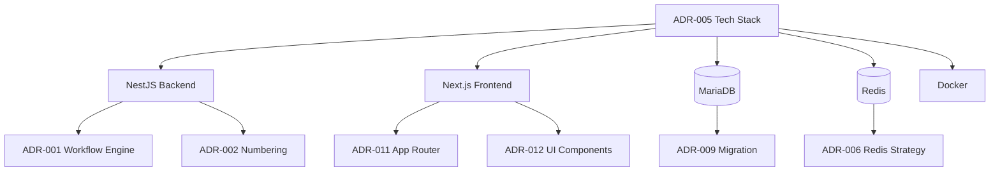

# ADR-005: Technology Stack Selection

**Status:** Accepted
**Date:** 2026-02-24
**Decision Makers:** Development Team, CTO
**Related Documents:**

- [System Architecture](../02-Architecture/02-01-system-architecture.md)
- [FullStack JS Guidelines](../03-implementation/03-01-fullftack-js-v1.7.0.md)

---

## Gap Analysis & Purpose

### ปิด Gap จากเอกสาร:
- **System Architecture** - Section 4.1: "ระบบต้องพัฒนาด้วย Technology Stack ที่ทีมมีความเชี่ยวชาญ"
  - เหตุผล: ทีมมีประสบการณ์ TypeScript/JavaScript จึงเลือก Stack ที่ใช้ภาษาเดียวกัน
- **Infrastructure Constraints** - Section 5.2: "ระบบต้อง Deploy บน QNAP Container Station"
  - เหตุผล: ต้องเลือก Technology ที่เข้ากับ QNAP และ Resource จำกัด

### แก้ไขความขัดแย้ง:
- **Development Speed** vs **Enterprise Requirements**: ต้องการพัฒนาเร็วแต่ต้องเป็น Enterprise-grade
  - การตัดสินใจนี้ช่วยแก้ไขโดย: เลือก TypeScript ecosystem ที่ Modern แต่ก็ Enterprise-ready

---

## Context and Problem Statement

LCBP3-DMS ต้องเลือก Technology Stack สำหรับพัฒนา Document Management System ที่:

- รองรับ Multi-user Concurrent Access
- จัดการเอกสารซับซ้อนพร้อม Workflow
- Deploy บน QNAP Server (ข้อจำกัดด้าน Infrastructure)
- พัฒนาโดย Small Team (1-3 developers)
- Maintain ได้ในระยะยาว (5+ years)

---

## Decision Drivers

- **Development Speed:** พัฒนาได้เร็ว (6-12 months MVP)
- **Maintainability:** Maintain และ Scale ได้ง่าย
- **Team Expertise:** ทีมมีประสบการณ์ TypeScript/JavaScript
- **Infrastructure Constraints:** Deploy บน QNAP Container Station
- **Community Support:** มี Community และ Documentation ดี
- **Future-proof:** Technology ยังได้รับการ Support อย่างน้อย 5 ปี

---

## Considered Options

### Option 1: Traditional Stack (PHP + Laravel + Vue)

**Pros:**

- ✅ Mature ecosystem
- ✅ Good documentation
- ✅ Familiar to many developers

**Cons:**

- ❌ Team ไม่มีประสบการณ์ PHP
- ❌ Separate language for frontend/backend
- ❌ Less TypeScript support

### Option 2: Java Stack (Spring Boot + React)

**Pros:**

- ✅ Enterprise-grade
- ✅ Strong typing
- ✅ Excellent tooling

**Cons:**

- ❌ Team ไม่มีประสบการณ์ Java
- ❌ Higher resource usage (QNAP limitation)
- ❌ Slower development cycle

### Option 3: **Full Stack TypeScript (NestJS + Next.js)** ⭐ (Selected)

**Pros:**

- ✅ **Single Language:** TypeScript ทั้ง Frontend และ Backend
- ✅ **Team Expertise:** ทีมมีประสบการณ์ Node.js/TypeScript
- ✅ **Modern Architecture:** Modular, Scalable, Maintainable
- ✅ **Rich Ecosystem:** NPM packages มากมาย
- ✅ **Fast Development:** Code sharing, Type safety
- ✅ **QNAP Compatible:** Docker deployment support

**Cons:**

- ❌ Runtime Performance ต่ำกว่า Java/Go
- ❌ Package.json dependency management complexity

---

## Decision Outcome

**Chosen Option:** Option 3 - Full Stack TypeScript (NestJS + Next.js)

### Selected Technologies

#### Backend Stack

| Component          | Technology      | Rationale                                                                   |
| :----------------- | :-------------- | :-------------------------------------------------------------------------- |
| **Runtime**        | Node.js 20 LTS  | Stable, modern features, long-term support                                  |
| **Framework**      | NestJS 11       | Modular, TypeScript-first, Express v5 support                               |
| **HTTP Engine**    | Express 5       | Path param changes, improved error handling                                 |
| **Language**       | TypeScript 5.x  | Type safety, better DX                                                      |
| **ORM**            | TypeORM         | TypeScript support, migrations, repositories                                |
| **Database**       | MariaDB 11.8    | JSON support, virtual columns, QNAP compatible                              |
| **Validation**     | class-validator | Decorator-based, integrates with NestJS                                     |
| **Authentication** | Passport + JWT  | Standard, well-supported                                                    |
| **Authorization**  | CASL **6.7.5+** | Flexible RBAC implementation ⚠️ Patched CVE-2026-1774 (Prototype Pollution) |
| **Documentation**  | Swagger/OpenAPI | Auto-generated from decorators                                              |
| **Testing**        | Jest            | Built-in with NestJS                                                        |

#### Frontend Stack

| Component             | Technology                | Rationale                              |
| :-------------------- | :------------------------ | :------------------------------------- |
| **Framework**         | Next.js 16.2.0            | App Router, SSR/SSG, React integration |
| **UI Library**        | React 19.2.4              | Industry standard, large ecosystem     |
| **Language**          | TypeScript 5.x            | Consistency with backend               |
| **Styling**           | Tailwind CSS 4.2.2        | Utility-first, fast development        |
| **Component Library** | shadcn/ui                 | Accessible, customizable, TypeScript   |
| **State Management**  | TanStack Query            | Server state management                |
| **Form Handling**     | React Hook Form 7.71.2    | Performance, ต้ validation with Zod    |
| **Testing**           | Vitest 4.1.0 + Playwright | Fast unit tests, reliable E2E          |

#### Infrastructure

| Component            | Technology              | Rationale                        |
| :------------------- | :---------------------- | :------------------------------- |
| **Containerization** | Docker + Docker Compose | QNAP Container Station           |
| **Reverse Proxy**    | Nginx Proxy Manager     | UI-based SSL management          |
| **Database**         | MariaDB 11.8            | Robust, JSON support             |
| **Cache**            | Redis 7                 | Session, locks, queue management |
| **Search**           | Elasticsearch 8         | Full-text search                 |
| **Workflow**         | n8n                     | Visual workflow automation       |
| **Git**              | Gitea                   | Self-hosted, lightweight         |

---

## 🔍 Impact Analysis

### Affected Components (ส่วนประกอบที่ได้รับผลกระทบ)

| Component | Level | Impact Description | Required Action |
|-----------|-------|-------------------|-----------------|
| **Development Environment** | 🔴 High | ต้องติดตั้ง Node.js, TypeScript, Docker | Setup dev environment |
| **CI/CD Pipeline** | 🔴 High | ต้องสร้าง Pipeline สำหรับ TypeScript, Docker | Build/deploy automation |
| **Team Skills** | 🟡 Medium | ทีมต้องเรียนรู้ NestJS, Next.js | Training sessions |
| **Infrastructure** | 🟡 Medium | ต้องติดตั้ง Docker, Redis, MariaDB | Server setup |
| **Documentation** | 🟡 Medium | ต้องเขียน Docs สำหรับ TypeScript ecosystem | Update documentation |

### Required Changes (การเปลี่ยนแปลงที่ต้องดำเนินการ)

#### 🔴 Critical Changes (ต้องทำทันที)
- [ ] **Setup Development Environment** - All developers: Node.js, Docker, IDE setup
- [ ] **Create Project Structure** - backend/, frontend/, docker-compose.yml: Initial scaffolding
- [ ] **Configure TypeScript** - tsconfig.json, package.json: Build configuration
- [ ] **Setup CI/CD** - .github/workflows/: Build and deploy automation
- [ ] **Install Database** - MariaDB, Redis: Infrastructure setup

#### 🟡 Important Changes (ควรทำภายใน 1 สัปดาห์)
- [ ] **Create Code Standards** - .eslintrc, .prettierrc: Linting and formatting
- [ ] **Setup Testing Framework** - Jest, Vitest, Playwright: Test infrastructure
- [ ] **Documentation Setup** - README.md, CONTRIBUTING.md: Project docs
- [ ] **Team Training** - NestJS, Next.js workshops: Knowledge transfer

#### 🟢 Nice-to-Have (ทำถ้ามีเวลา)
- [ ] **Create Component Library** - shadcn/ui customization: UI consistency
- [ ] **Setup Monitoring** - Logging, metrics: Observability
- [ ] **Performance Benchmarking** - Load testing scripts: Performance validation

### Cross-Module Dependencies



---

## 📋 Version Dependency Matrix

| ADR | Version | Dependency Type | Affected Version(s) | Implementation Status |
|-----|---------|-----------------|---------------------|----------------------|
| **ADR-005** | 1.0 | Foundation | v1.8.0+ | ✅ Implemented |
| **ADR-001** | 1.0 | Depends On | v1.8.0+ | ✅ Implemented |
| **ADR-002** | 1.0 | Depends On | v1.8.0+ | ✅ Implemented |
| **ADR-006** | 1.0 | Required | v1.8.0+ | ✅ Implemented |
| **ADR-009** | 1.0 | Database | v1.8.0+ | ✅ Implemented |

### Version Compatibility Rules

- **Minimum Version:** v1.8.0 (ADR มีผลบังคับใช้)
- **Breaking Changes:** ไม่มี (Foundation stack)
- **Deprecation Timeline:** ไม่มี (Core technology choices)

---

## Architecture Decisions

### Backend Architecture: Modular Monolith

**Chosen:** Modular Monolith (Not Microservices)

**Rationale:**

- ✅ Easier to develop and deploy initially
- ✅ Lower infrastructure overhead (QNAP limitation)
- ✅ Simpler debugging and testing
- ✅ Can split into microservices later if needed
- ✅ Modules communicate via Event Emitters (loosely coupled)

**Module Structure:**

```
backend/src/
├── common/          # Shared utilities
├── modules/
│   ├── auth/
│   ├── user/
│   ├── project/
│   ├── correspondence/
│   ├── rfa/
│   ├── workflow-engine/
│   └── ...
```

### Frontend Architecture: Server-Side Rendering (SSR)

**Chosen:** Next.js with App Router (SSR + Client Components)

**Rationale:**

- ✅ Better SEO (if needed in future)
- ✅ Faster initial page load
- ✅ Flexibility (SSR + CSR)
- ✅ Built-in routing and API routes
- ✅ Image optimization

---

## Development Workflow

### Monorepo Structure

```
lcbp3-dms/
├── backend/         # NestJS
├── frontend/        # Next.js
├── docs/           # Documentation
├── specs/          # Specifications
└── docker-compose.yml
```

**Chosen:** Separate repositories (Not Monorepo)

**Rationale:**

- ✅ ง่ายต่อการ Deploy แยกกัน
- ✅ สิทธิ์ Git แยกได้ (Frontend team / Backend team)
- ✅ CI/CD pipeline ง่ายกว่า
- ❌ Cons: Shared types ต้องจัดการแยก

---

## Database Decisions

### ORM vs Query Builder

**Chosen:** TypeORM (ORM)

**Rationale:**

- ✅ Type-safe entities
- ✅ Migration management
- ✅ Relationship mapping
- ✅ Query Builder available when needed
- ❌ Cons: Learning curve for complex queries

### Database Choice

**Chosen:** MariaDB 11.8 (Not PostgreSQL)

**Rationale:**

- ✅ QNAP supports MariaDB หนึ่งของโจทย์
- ✅ JSON support (MariaDB 10.2+)
- ✅ Virtual columns for JSON indexing
- ✅ Familiar MySQL syntax
- ❌ Cons: ฟีเจอร์บางอย่างไม่เท่า PostgreSQL

---

## Styling Decision

### CSS Framework

**Chosen:** Tailwind CSS (Not Bootstrap, Material-UI)

**Rationale:**

- ✅ Utility-first, fast development
- ✅ Small bundle size (purge unused)
- ✅ Highly customizable
- ✅ Works well with shadcn/ui
- ✅ TypeScript autocomplete support

---

## Consequences

### Positive

1. ✅ **Single Language:** TypeScript ลด Context Switching
2. ✅ **Code Sharing:** Share types/interfaces ระหว่าง Frontend/Backend
3. ✅ **Fast Development:** Modern tooling, hot reload
4. ✅ **Type Safety:** Catch errors at compile time
5. ✅ **Rich Ecosystem:** NPM packages มากมาย
6. ✅ **Good DX:** Excellent developer experience

### Negative

1. ❌ **Runtime Performance:** ช้ากว่า Compiled languages
2. ❌ **Dependency Management:** NPM dependency hell
3. ❌ **Memory Usage:** Node.js ใช้ RAM มากกว่า PHP
4. ❌ **Package Updates:** Breaking changes บ่อย

### Mitigation Strategies

- **Performance:** ใช้ Redis caching, Database indexing
- **Dependencies:** Lock versions, use `pnpm` for deduplication
- **Memory:** Monitor และ Optimize, Set Node.js memory limits
- **Updates:** Test thoroughly before upgrading major versions

---

## 🔄 Review Cycle & Maintenance

### Review Schedule
- **Next Review:** 2026-08-24 (6 months from last review)
- **Review Type:** Scheduled (Foundation Review)
- **Reviewers:** CTO, System Architect, Development Team Lead

### Review Checklist
- [ ] ยังคงเป็น Core Principle หรือไม่? (Technology Stack เป็นรากฐานของระบบ)
- [ ] มีการเปลี่ยนแปลง Technology ที่กระทบหรือไม่? (New frameworks, EOL versions)
- [ ] มี Issue หรือ Bug ที่เกิดจาก ADR นี้หรือไม่? (Performance issues, Compatibility problems)
- [ ] ต้องการ Update หรือ Deprecate หรือไม่? (Version upgrades, New alternatives)

### Version History
| Version | Date | Changes | Status |
|---------|------|---------|--------|
| 1.0 | 2026-02-24 | Initial version - Full Stack TypeScript | ✅ Active |

---

## Compliance

เป็นไปตาม:

- [FullStack JS Guidelines](../03-implementation/03-01-fullftack-js-v1.7.0.md)
- [Backend Guidelines](../03-implementation/03-02-backend-guidelines.md)
- [Frontend Guidelines](../03-implementation/03-03-frontend-guidelines.md)

---

## Related ADRs

- [ADR-007: Deployment Strategy](./ADR-007-deployment-strategy.md) - Docker deployment details

---

## References

- [NestJS Documentation](https://docs.nestjs.com/)
- [Next.js Documentation](https://nextjs.org/docs)
- [TypeORM Documentation](https://typeorm.io/)
- [State of JavaScript 2024](https://stateofjs.com/)
