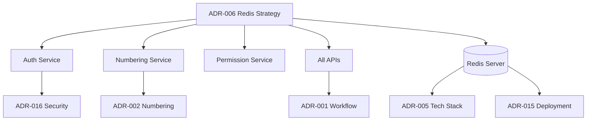

# ADR-006: Redis Usage and Caching Strategy

**Status:** Accepted
**Date:** 2026-02-24
**Decision Makers:** Development Team, System Architect
**Related Documents:**

- [Software Architecture](../02-Architecture/02-02-software-architecture.md)
- [Non-Functional Rules](../01-Requirements/01-02-business-rules/01-02-04-non-functional-rules.md)

---

## 🎯 Gap Analysis & Purpose

### ปิด Gap จากเอกสาร:
- **Non-Functional Rules** - Section 4.2: "ระบบต้องตอบสนอง Performance ได้ < 200ms (p90)"
  - เหตุผล: Database queries ช้า ต้องใช้ Cache ในการเพิ่ม Performance
- **Software Architecture** - Section 5.3: "ระบบต้องรองรับ Concurrent Access พร้อม Locking Mechanism"
  - เหตุผล: ต้องการ Distributed Lock สำหรับ Document Numbering และ Race Conditions

### แก้ไขความขัดแย้ง:
- **Performance Requirements** vs **Data Consistency**: ต้องการความเร็วสูงแต่ต้องรักษาความสม่ำเสมอของข้อมูล
  - การตัดสินใจนี้ช่วยแก้ไขโดย: ใช้ Redis พร้อม Cache Invalidation Strategy ที่ชัดเจน

---

## Context and Problem Statement

LCBP3-DMS ต้องการ High Performance ในการ:

- Check Permissions (ทุก Request)
- Document Numbering (Concurrent Safe)
- Master Data Access (ถูกเรียกบ่อยมาก)
- Session Management
- Background Job Queue

**Challenges:**

- Database queries ช้า (แม้มี indexing)
- Concurrent access ต้องมี Locking mechanism
- Permission checking ต้องเร็ว (< 10ms)
- Master data แทบไม่เปลี่ยน แต่ถูก query บ่อย

---

## Decision Drivers

- **Performance:** Response time < 200ms (p90)
- **Scalability:** รองรับ 100+ concurrent users
- **Consistency:** Data consistency with database
- **Reliability:** Cache must not cause data loss
- **Cost-Effectiveness:** ใช้ Resource น้อยที่สุด

---

## Considered Options

### Option 1: No Caching (Database Only)

**Pros:**

- ✅ Simple, no cache invalidation
- ✅ Always consistent

**Cons:**

- ❌ Slow permission checks (JOIN tables)
- ❌ High DB load
- ❌ No distributed locking

### Option 2: Application-Level In-Memory Cache

**Pros:**

- ✅ Very fast (local memory)
- ✅ No external dependency

**Cons:**

- ❌ Not shared across instances
- ❌ No distributed locking
- ❌ Cache invalidation issues

### Option 3: **Redis as Distributed Cache + Lock** ⭐ (Selected)

**Pros:**

- ✅ **Fast:** In-memory, < 1ms access
- ✅ **Distributed:** Shared across instances
- ✅ **Locking:** Redis locks for concurrency
- ✅ **Pub/Sub:** Cache invalidation broadcasting
- ✅ **Queue:** BullMQ for background jobs

**Cons:**

- ❌ External dependency
- ❌ Requires Redis cluster for HA

---

## Decision Outcome

**Chosen Option:** Redis as Distributed Cache + Lock Provider

---

## 🔍 Impact Analysis

### Affected Components (ส่วนประกอบที่ได้รับผลกระทบ)

| Component | Level | Impact Description | Required Action |
|-----------|-------|-------------------|-----------------|
| **Backend Services** | 🔴 High | ทุก Service ต้องใช้ Redis สำหรับ Cache และ Locking | Implement Redis clients |
| **Authentication** | 🔴 High | Session Management และ Permission Caching | Update Auth service |
| **Document Numbering** | 🔴 High | Distributed Locking สำหรับ Race Condition | Integrate Redlock |
| **Infrastructure** | 🔴 High | ต้องติดตั้ง Redis Server และ Monitoring | Redis setup |
| **API Performance** | 🟡 Medium | Response time ลดลง < 200ms | Performance optimization |

### Required Changes (การเปลี่ยนแปลงที่ต้องดำเนินการ)

#### 🔴 Critical Changes (ต้องทำทันที)
- [ ] **Install Redis Server** - docker-compose.yml: Redis 7 configuration
- [ ] **Create Redis Service** - backend/src/common/redis/: Redis connection management
- [ ] **Update Auth Service** - backend/src/modules/auth/: Session caching
- [ ] **Update Numbering Service** - backend/src/modules/document-numbering/: Distributed locks
- [ ] **Add Permission Caching** - backend/src/modules/permissions/: Cache user abilities

#### 🟡 Important Changes (ควรทำภายใน 1 สัปดาห์)
- [ ] **Create Cache Invalidation Service** - backend/src/common/cache/: Cache management
- [ ] **Add Rate Limiting** - backend/src/common/guards/: Redis-based rate limiter
- [ ] **Setup BullMQ Queues** - backend/src/common/queues/: Background job processing
- [ ] **Add Redis Monitoring** - backend/src/common/monitoring/: Metrics and alerts

#### 🟢 Nice-to-Have (ทำถ้ามีเวลา)
- [ ] **Create Redis Admin UI** - frontend/app/(admin)/admin/redis/: Cache management UI
- [ ] **Add Performance Dashboard** - Grafana dashboards: Redis metrics visualization
- [ ] **Implement Cache Warming** - Scripts: Pre-populate cache

### Cross-Module Dependencies



---

## 📋 Version Dependency Matrix

| ADR | Version | Dependency Type | Affected Version(s) | Implementation Status |
|-----|---------|-----------------|---------------------|----------------------|
| **ADR-006** | 1.0 | Infrastructure | v1.8.0+ | ✅ Implemented |
| **ADR-002** | 1.0 | Required By | v1.8.0+ | ✅ Implemented |
| **ADR-016** | 1.0 | Used By | v1.8.0+ | ✅ Implemented |
| **ADR-005** | 1.0 | Component | v1.8.0+ | ✅ Implemented |

### Version Compatibility Rules

- **Minimum Version:** v1.8.0 (ADR มีผลบังคับใช้)
- **Breaking Changes:** ไม่มี (Infrastructure component)
- **Deprecation Timeline:** ไม่มี (Core infrastructure)

---

## Redis Usage Patterns

### 1. Distributed Locking (Redlock)

**Use Cases:**

- Document Number Generation
- Critical Sections

**Implementation:**

```typescript
const lock = await redlock.acquire([lockKey], 3000); // 3sec TTL
try {
  // Critical section
} finally {
  await lock.release();
}
```

**Configuration:**

- TTL: 2-5 seconds
- Retry: Exponential backoff, max 3 retries

---

### 2. Permission Caching

**Cache Structure:**

```typescript
// Key: user:{user_id}:permissions
// Value: JSON array of CASL rules
// TTL: 30 minutes
await redis.set(`user:${userId}:permissions`, JSON.stringify(abilityRules), 'EX', 1800);
```

**Invalidation Strategy:**

- Role changed → Invalidate all users with that role
- User assignment changed → Invalidate that user
- Permission modified → Invalidate all affected roles

---

### 3. Master Data Caching

**Cached Data:**

- Organizations (TTL: 1 hour)
- Projects (TTL: 1 hour)
- Correspondence Types (TTL: 24 hours)
- RFA Status Codes (TTL: 24 hours)
- Roles & Permissions (TTL: 30 minutes)

**Cache Pattern:**

```typescript
async getOrganizations(): Promise<Organization[]> {
  const cacheKey = 'master:organizations';
  let cached = await redis.get(cacheKey);

  if (!cached) {
    const organizations = await this.orgRepo.find({ where: { is_active: true } });
    await redis.set(cacheKey, JSON.stringify(organizations), 'EX', 3600);
    return organizations;
  }

  return JSON.parse(cached);
}
```

**Invalidation:**

- On CREATE/UPDATE/DELETE → Invalidate immediately
- Publish event to Redis Pub/Sub for multi-instance sync

---

### 4. Session Management

**Structure:**

```typescript
// Key: session:{session_id}
// Value: User session data
// TTL: 8 hours
interface SessionData {
  user_id: number;
  username: string;
  organization_id: number;
  last_activity: Date;
}
```

**Refresh Strategy:**

- Update `last_activity` on every request
- Extend TTL if activity within last 1 hour

---

### 5. Rate Limiting

**Implementation:**

```typescript
const key = `rate_limit:${userId}:${endpoint}`;
const current = await redis.incr(key);
if (current === 1) {
  await redis.expire(key, 3600); // 1 hour window
}
if (current > limit) {
  throw new TooManyRequestsException();
}
```

**Limits:**

- File Upload: 50 req/hour per user
- Search: 500 req/hour per user
- Anonymous: 100 req/hour per IP

---

### 6. Background Job Queue (BullMQ)

**Queues:**

1. **Email Queue:** Send email notifications
2. **Notification Queue:** LINE Notify
3. **Indexing Queue:** Elasticsearch indexing
4. **Cleanup Queue:** Delete temp files
5. **Report Queue:** Generate PDF reports

**Configuration:**

```typescript
const emailQueue = new Queue('email', {
  connection: redisConnection,
  defaultJobOptions: {
    attempts: 3,
    backoff: {
      type: 'exponential',
      delay: 2000,
    },
    removeOnComplete: 100, // Keep last 100
    removeOnFail: 500,
  },
});
```

---

## Cache Invalidation Strategy

### 1. Time-Based Expiration (TTL)

| Data Type      | TTL        | Rationale                     |
| :------------- | :--------- | :---------------------------- |
| Permissions    | 30 minutes | Balance freshness/performance |
| Master Data    | 1 hour     | Rarely changes                |
| Session        | 8 hours    | Match JWT expiration          |
| Search Results | 15 minutes | Data changes frequently       |

### 2. Event-Based Invalidation

**Pattern:**

```typescript
@Injectable()
export class CacheInvalidationService {
  async invalidateUserPermissions(userId: number): Promise<void> {
    await this.redis.del(`user:${userId}:permissions`);

    // Broadcast to other instances
    await this.redis.publish(
      'cache:invalidate',
      JSON.stringify({
        pattern: 'user:permissions',
        userId,
      })
    );
  }

  async invalidateMasterData(entity: string): Promise<void> {
    await this.redis.del(`master:${entity}`);
    await this.redis.publish(
      'cache:invalidate',
      JSON.stringify({
        pattern: 'master',
        entity,
      })
    );
  }
}
```

### 3. Write-Through Cache

**For Master Data:**

```typescript
async updateOrganization(id: number, dto: UpdateOrgDto): Promise<Organization> {
  const org = await this.orgRepo.save({ id, ...dto });

  // Invalidate cache immediately
  await this.cache.invalidateMasterData('organizations');

  return org;
}
```

---

## Redis Configuration

### Production Setup

```yaml
# docker-compose.yml
redis:
  image: redis:7-alpine
  command: >
    redis-server
    --appendonly yes
    --appendfsync everysec
    --maxmemory 2gb
    --maxmemory-policy allkeys-lru
  volumes:
    - redis-data:/data
  ports:
    - '6379:6379'
  healthcheck:
    test: ['CMD', 'redis-cli', 'ping']
    interval: 10s
    timeout: 3s
    retries: 3
```

**Key Settings:**

- `appendonly yes`: AOF persistence
- `appendfsync everysec`: Write every second (balance performance/durability)
- `maxmemory 2gb`: Limit memory usage
- `maxmemory-policy allkeys-lru`: Evict least recently used keys

---

### High Availability Considerations

**Future Improvements:**

1. **Redis Sentinel:** Auto-failover
2. **Redis Cluster:** Horizontal scaling
3. **Read Replicas:** Offload read queries

**Current:** Single Redis instance (sufficient for MVP)

---

## Monitoring

### Key Metrics

```typescript
@Injectable()
export class RedisMonitoringService {
  @Cron('*/5 * * * *') // Every 5 minutes
  async captureMetrics(): Promise<void> {
    const info = await this.redis.info();

    // Parse and log metrics
    metrics.record({
      'redis.memory.used': parseMemoryUsed(info),
      'redis.memory.peak': parseMemoryPeak(info),
      'redis.keyspace.hits': parseHits(info),
      'redis.keyspace.misses': parseMisses(info),
      'redis.connections.active': parseConnections(info),
    });
  }
}
```

**Alert Thresholds:**

- Memory usage > 80%
- Hit rate < 70%
- Connections > 90% of max

---

## Consequences

### Positive

1. ✅ **Fast Permission Check:** < 5ms (vs 50ms from DB)
2. ✅ **Reduced DB Load:** 70% reduction in queries
3. ✅ **Distributed Locking:** No race conditions
4. ✅ **Queue Management:** Background jobs reliable
5. ✅ **Scalability:** รองรับ Multi-instance deployment

### Negative

1. ❌ **Dependency:** Redis ต้อง Available เสมอ
2. ❌ **Memory Limit:** ต้อง Monitor และ Evict
3. ❌ **Complexity:** Cache invalidation ซับซ้อน
4. ❌ **Data Loss Risk:** ถ้า Redis crash (with AOF mitigates this)

### Mit Strategies

- **Dependency:** Health checks + Fallback to DB
- **Memory:** Set max memory + LRU eviction policy
- **Complexity:** Centralize invalidation logic
- **Data Loss:** Enable AOF persistence

---

## 🔄 Review Cycle & Maintenance

### Review Schedule
- **Next Review:** 2026-08-24 (6 months from last review)
- **Review Type:** Scheduled (Infrastructure Review)
- **Reviewers:** System Architect, DevOps Engineer, Development Team Lead

### Review Checklist
- [ ] ยังคงเป็น Core Principle หรือไม่? (Redis เป็น Infrastructure หลัก)
- [ ] มีการเปลี่ยนแปลง Technology ที่กระทบหรือไม่? (New caching solutions, Redis alternatives)
- [ ] มี Issue หรือ Bug ที่เกิดจาก ADR นี้หรือไม่? (Cache invalidation issues, Performance problems)
- [ ] ต้องการ Update หรือ Deprecate หรือไม่? (Redis version upgrades, New patterns)

### Version History
| Version | Date | Changes | Status |
|---------|------|---------|--------|
| 1.0 | 2026-02-24 | Initial version - Redis Distributed Cache + Lock | ✅ Active |

---

## Compliance

เป็นไปตาม:

- [Software Architecture](../02-Architecture/02-02-software-architecture.md#redis)
- [Non-Functional Rules](../01-Requirements/01-02-business-rules/01-02-04-non-functional-rules.md)

---

## Related ADRs

- [ADR-002: Document Numbering Strategy](./ADR-002-document-numbering-strategy.md) - Redis locks
- [RBAC Matrix](../01-Requirements/01-02-business-rules/01-02-01-rbac-matrix.md) - Permission caching

---

## References

- [Redis Documentation](https://redis.io/docs/)
- [Redlock Algorithm](https://redis.io/topics/distlock)
- [BullMQ Documentation](https://docs.bullmq.io/)
- [Cache Invalidation Strategies](https://martinfowler.com/bliki/TwoHardThings.html)
