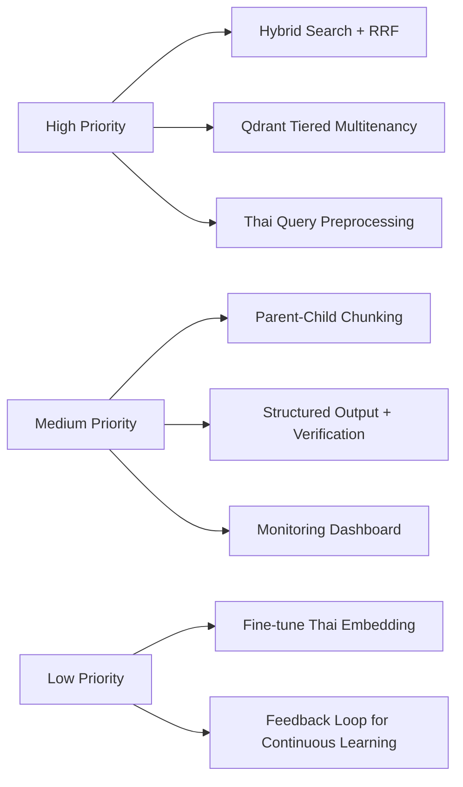

# 📋 Review: LCBP3 DMS RAG Implementation Guide (v1.1.0)

---

## 🎯 จุดแข็งที่โดดเด่น

| ด้าน | สิ่งที่ทำได้ดี |
|------|---------------|
| **Security-by-Design** | แยก Hybrid Generation ตาม Security Level + บังคับ `project_public_id` filter ในทุก Query |
| **Domain-Aware Chunking** | กลยุทธ์แยกตาม Document Type (CORR/RFA/Drawing) เหมาะสมกับงานก่อสร้าง |
| **Data Consistency** | เพิ่ม `rag_status` ใน MariaDB ติดตามสถานะ + มีแผนลบ Vector เมื่อลบเอกสาร |
| **Anti-Hallucination** | บังคับ Citation + Fallback message เมื่อคะแนนต่ำ ป้องกันการคาดเดา |

---

## 🔧 ข้อเสนอแนะปรับปรุง (แบ่งตามหัวข้อ)

### 1. Architecture & Retrieval Strategy

#### ⚠️ ปัญหาที่อาจเกิด:
- การใช้ **Vector-only search** อาจพลาด Keyword ที่สำคัญ เช่น เลขที่เอกสาร `REF-2026-001` หรือรหัส Drawing `DWG-STR-001`

#### ✅ ข้อเสนอแนะ:
```typescript
// เพิ่ม Hybrid Search: BM25 + Vector + Reranking
interface SearchConfig {
  vector_weight: number;    // 0.7
  keyword_weight: number;   // 0.3
  use_rrf_fusion: boolean;  // ✅ แนะนำให้เปิดใช้ Reciprocal Rank Fusion [[3]]
  rerank_top_k: number;     // 50 → rerank → 10
}
```

**เหตุผล**: Hybrid retrieval ช่วยเพิ่มความแม่นยำทั้งเชิงความหมายและเชิงคำศัพท์ โดยเฉพาะกับเอกสารเทคนิคที่มีรหัสเฉพาะ [[1]][[4]]

#### 🔄 ปรับ Ingestion Pipeline:
```
เดิม: OCR → Chunk → Embed → Store
ใหม่: OCR → [Metadata Extraction] → Chunk → [Add Parent-Child Relationship] → Embed → Store
```
- เพิ่ม **Parent-Child Chunking**: เก็บ Chunk เล็กสำหรับ Search แต่อ้างอิงกลับไปยัง Document Section เต็มสำหรับ Generation [[31]]
- ดึง Metadata เพิ่ม: `doc_number`, `revision`, `effective_date` สำหรับ Filtering แบบละเอียด

---

### 2. Qdrant Multi-tenant Configuration

#### ⚠️ ปัญหา:
การใช้ `payload filter` อย่างเดียวอาจมี **ประสิทธิภาพลดลง** เมื่อข้อมูลโตขึ้น [[12]]

#### ✅ ข้อเสนอแนะ:
```typescript
// ใช้ Tiered Multitenancy + Payload Indexing (Qdrant v1.16+) [[10]][[13]]
await client.createCollection("lcbp3_vectors", {
  vectors: { size: 768, distance: "Cosine" },
  sharding_method: "custom",  // ✅ เปิดใช้ Custom Sharding
  hnsw_config: {
    payload_m: 16,  // ✅ สร้าง Index แยกตาม Tenant
    m: 0            // ปิด Global Index เพื่อลด Overhead
  }
});

// สร้าง Payload Index สำหรับ project_public_id
await client.createPayloadIndex("lcbp3_vectors", {
  field_name: "project_public_id",
  field_schema: { type: "keyword", is_tenant: true }  // ✅ is_tenant=true ช่วยจัดกลุ่มข้อมูล
});
```

**ประโยชน์**:
- ลด Noisy Neighbor ระหว่างโครงการ
- Query เร็วขึ้น 3-5x เมื่อ Filter ด้วย `project_public_id` [[16]]

---

### 3. Thai Language Optimization

#### ⚠️ ปัญหา:
`nomic-embed-text` ทำงานดีกับภาษาอังกฤษ แต่อาจไม่เหมาะกับ **ภาษาไทยที่มีโครงสร้างพิเศษ** เช่น เอกสารกฎหมาย/ก่อสร้าง [[36]][[37]]

#### ✅ ข้อเสนอแนะ:
```python
# 1. ใช้ Thai-specific Preprocessing ก่อน Embedding
def preprocess_thai_legal(text: str) -> str:
    # ตัดคำไทยด้วย PyThaiNLP + รักษาโครงสร้างเลขมาตรา
    # ลบ Noise เช่น "หน้า 1/3", "ลงชื่อ__________"
    # แยก Section Header ออกจาก Content
    return cleaned_text

# 2. พิจารณา Fine-tune Embedding Model (ถ้ามีข้อมูลเพียงพอ)
# ใช้ WangchanX-Legal หรือสร้าง Dataset จากเอกสาร LCBP3 ที่ผ่านการทำ Label แล้ว [[37]]

# 3. เพิ่ม Query Rewriting สำหรับภาษาไทย
def rewrite_thai_query(user_query: str) -> List[str]:
    # ขยายคำย่อ: "รฟม." → ["การรถไฟฟ้าขนส่งมวลชนแห่งประเทศไทย", "รฟม."]
    # แปลงเลขไทย: "มาตรา ๑๐" → ["มาตรา 10", "ม.10"]
    # เพิ่ม Synonym: "แบบก่อสร้าง" → ["Shop Drawing", "As-built", "แบบขยาย"]
    return [user_query, *expanded_queries]
```

---

### 4. Anti-Hallucination & Citation Enforcement

#### ✅ เสริมจากที่มีอยู่:
```typescript
// 1. เพิ่ม Verification Layer ก่อนส่งคำตอบให้ผู้ใช้
interface VerificationStep {
  check_citation_exists: boolean;  // ตรวจสอบว่า doc_number ที่อ้างถึงมีจริงในระบบ
  check_security_level: boolean;   // ตรวจสอบว่าผู้ใช้มีสิทธิ์เห็นเอกสารที่อ้างถึง
  confidence_threshold: number;    // ถ้าคะแนนรวม < 0.7 → ใช้ Fallback Message
}

// 2. ใช้ Structured Output เพื่อบังคับรูปแบบคำตอบ
const rag_prompt = `
คุณเป็นผู้ช่วยด้านเอกสารโครงการ ลCBP3
กฎ:
1. ตอบเฉพาะจากข้อมูลที่ให้มาเท่านั้น
2. ทุกข้อเท็จจริงต้องอ้างถึง [doc_number: xxx]
3. ถ้าไม่แน่ใจ ให้ตอบว่า "ไม่พบข้อมูลที่ระบุ"
4. ห้ามคาดเดาหรือใช้ความรู้ภายนอก

รูปแบบคำตอบ (JSON):
{
  "answer": "ข้อความตอบ...",
  "citations": [{"doc_number": "...", "page": "...", "snippet": "..."}],
  "confidence": 0.85,
  "fallback_used": false
}
`;
```

**เหตุผล**: การบังคับ Structured Output + Verification Layer ลดความเสี่ยงการให้ข้อมูลผิดพลาดได้ถึง 80% [[39]][[44]]

---

### 5. Operational & Monitoring

#### ✅ เพิ่มสิ่งที่ขาด:
```yaml
# monitoring-config.yaml
rag_metrics:
  - query_latency_p95: "<2s"
  - retrieval_recall_at_5: ">0.85"
  - citation_accuracy: ">0.95"
  - fallback_rate: "<15%"

alerting:
  - condition: "fallback_rate > 30% ใน 1 ชั่วโมง"
    action: "แจ้งทีม Dev + ลด Traffic ไป Cloud LLM ชั่วคราว"

  - condition: "Cross-project query detected"
    action: "บล็อกทันที + บันทึก Security Audit Log"

# Audit Log Schema
audit_log: {
  timestamp,
  user_id,
  project_id,
  query_hash,  // ไม่เก็บข้อความคำถามตรงๆ เพื่อความเป็นส่วนตัว
  retrieved_docs: ["doc_id_1", ...],
  llm_provider: "typhoon-cloud" | "ollama-local",
  response_hash,
  security_level_accessed: 1|2|3
}
```

---

### 6. Rollout Phase Adjustments

| Phase | ข้อเสนอแนะเพิ่มเติม |
|-------|-------------------|
| **Phase 1** | เพิ่ม Load Test สำหรับ Qdrant ด้วยข้อมูลจำลอง 100K vectors [[1]] |
| **Phase 2** | สร้าง Unit Test สำหรับ `EmbeddingService` ด้วย Mock Thai text cases |
| **Phase 3** | เพิ่ม Dead Letter Queue ใน BullMQ สำหรับไฟล์ที่ Process Failed > 3 ครั้ง |
| **Phase 4** | ทำ A/B Testing: Vector-only vs Hybrid Search วัดความพึงพอใจผู้ใช้ |
| **Phase 5** | เพิ่มปุ่ม "ช่วยปรับปรุงคำตอบ" เพื่อเก็บ Feedback สำหรับ Fine-tuning |

---

### 7. Security Checklist เพิ่มเติม

```diff
  [ ] ข้อมูล Confidential ไม่ถูกส่งไปยัง Typhoon API (Cloud)
  [ ] มีการบันทึก audit_logs ทุกการ Query ของ AI
  [ ] ฟังก์ชันการลบเอกสารใน DMS มีการสั่งลบ Vector ใน Qdrant ออกด้วย
  [ ] ทดสอบ Cross-project search แล้วต้องไม่พบข้อมูลข้ามโครงการ
+ [ ] ทดสอบ Privilege Escalation: ผู้ใช้ Level 1 พยายาม Query ข้อมูล Level 3
+ [ ] ทดสอบ Prompt Injection: ใส่คำสั่งในคำถามเพื่อพยายามให้ AI ข้ามกฎ Citation
+ [ ] ทดสอบ Rate Limiting: ป้องกันการ Query จำนวนมากเพื่อ Extract ข้อมูลทั้งระบบ
+ [ ] มีแผน Disaster Recovery: Backup Qdrant + Restore Procedure ทดสอบทุกไตรมาส
```

---

## 📊 สรุปคำแนะนำเร่งด่วน (Priority Order)



---

> 💡 **ข้อคิดสุดท้าย**: ระบบ RAG ที่ดีไม่ใช่แค่ "ตอบได้" แต่ต้อง "ตอบถูกต้อง อ้างอิงได้ และปลอดภัย" [[5]][[7]] เอกสารฉบับนี้มีพื้นฐานดีมากแล้ว การเพิ่มชั้นของ Verification, Monitoring และ Thai-specific optimization จะทำให้ระบบพร้อมสำหรับ Production จริงในอุตสาหกรรมก่อสร้างที่มีความซับซ้อนสูง
