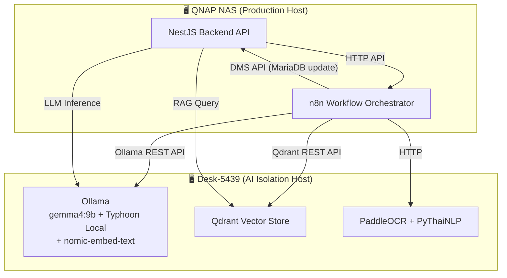

# ADR-023: Unified AI Architecture (สถาปัตยกรรม AI หลักแบบผสานรวม)

**Status:** Accepted
**Date:** 2026-05-14
**Decision Makers:** Development Team, System Architect, Security Team, AI Integration Lead
**Related Documents:**
- [Glossary](../00-Overview/00-02-glossary.md)
- [Data Dictionary](../03-Data-and-Storage/03-01-data-dictionary.md)
- [Legacy Data Migration Plan](../03-Data-and-Storage/03-04-legacy-data-migration.md)
- [n8n Migration Setup Guide](../03-Data-and-Storage/03-05-n8n-migration-setup-guide.md)
- [ADR-016: Security & Authentication](./ADR-016-security-authentication.md)
- [ADR-019: Hybrid Identifier Strategy](./ADR-019-hybrid-identifier-strategy.md)
- [RAG Implementation Guide v1.1.2](../08-Tasks/ADR-022-Retrieval-Augmented-Generation/LCBP3-RAG-Implementation-Guide-v1.1.2.md)

> **หมายเหตุ:** ADR-023 เป็นเอกสารสถาปัตยกรรม AI หลักของระบบ (Master AI Architecture) ที่ทำการยุบรวมและแทนที่ (Supersede) เอกสาร ADR-017, ADR-017B, ADR-018, ADR-020, และ ADR-022 เพื่อให้มี Single Source of Truth เพียงที่เดียวในการควบคุมทั้งโครงสร้างพื้นฐาน, ความปลอดภัย, การนำเข้าข้อมูลเก่า, การสกัดข้อมูลอัตโนมัติ, และระบบสืบค้น RFA/Correspondence แบบถาม-ตอบเชิงลึก

---

## 🎯 Gap Analysis & Purpose

### ปิด Gap จากเอกสาร:
- **Product Vision v1.8.5** - Section 3.1, 3.2, 3.3: ความต้องการยกระดับประสิทธิภาพการนำเข้าเอกสารเก่าและการจัดการเอกสารใหม่ด้วย AI Intelligence
  - เหตุผล: การทำงานด้วยมือ (Manual) มีต้นทุนเวลาสูงและเกิดความผิดพลาดได้ง่าย จำเป็นต้องมี AI ช่วยตรวจสอบและจัดหมวดหมู่โดยอัตโนมัติ
- **Security Requirements & Risk Assessment** - Section 3.1, 4.2: ความเสี่ยงด้านข้อมูลรั่วไหลและการเข้าถึงฐานข้อมูลโดยตรงจากเซอร์วิส AI
  - เหตุผล: ข้อมูลเอกสารก่อสร้างท่าเรือแหลมฉบัง เฟส 3 เป็นความลับระดับสูง (Confidential) ต้องมีขอบเขตความปลอดภัย (AI Boundary) ที่รัดกุม

### แก้ไขความขัดแย้งและการกระจายตัวของเอกสาร:
- **ADR-017, ADR-017B, ADR-018, ADR-020, ADR-022** มีความทับซ้อนในเชิงสถาปัตยกรรมและข้อกำหนด
  - การตัดสินใจนี้ช่วยแก้ไขโดย: ยุบรวมข้อกำหนดทั้งหมดเข้าสู่ร่มใหญ่ฉบับเดียว (Consolidation) เพื่อลดปัญหา Revision Drift และทำให้การทบทวนสถาปัตยกรรม (Review Cycle) เป็นไปอย่างสอดคล้องกันทั้งระบบ

---

## Context and Problem Statement

โครงการ LCBP3-DMS มีความต้องการประยุกต์ใช้ AI ในการเพิ่มประสิทธิภาพการบริหารจัดการเอกสารวิศวกรรมโยธาขนาดใหญ่ โดยเผชิญกับโจทย์และความท้าทายหลัก 5 ด้าน:

1. **Legacy Document Migration:** เอกสาร PDF เก่ากว่า 20,000 ฉบับ ต้องนำเข้าระบบพร้อมตรวจสอบความสอดคล้องกับ Metadata ใน Excel
2. **Real-time Ingestion & Classification:** เอกสารใหม่ที่ผู้ใช้อัปโหลดต้องการการสกัด Metadata และจัดหมวดหมู่แบบเรียลไทม์เพื่อลดภาระงานกรอกข้อมูล
3. **Conversational Retrieval (RAG):** Full-text search บน MariaDB ไม่เข้าใจบริบท (Semantic) และการตัดคำภาษาไทย ทำให้สืบค้นข้อมูลเชิงลึกได้ยาก
4. **Data Confidentiality & Privacy:** ห้ามส่งข้อมูลความลับออกนอกเครือข่ายองค์กรไปยัง Cloud AI Provider (เช่น OpenAI, Google)
5. **System Stability & Isolation:** การรัน AI Inference ใช้ทรัพยากรสูง (GPU VRAM/CPU) ไม่ควรรันร่วมกับ Production Server หลัก (QNAP NAS) เพื่อไม่ให้กระทบประสิทธิภาพของระบบ

---

## Decision Drivers

- **Zero Trust & Physical Isolation:** AI ต้องถูกปฏิบัติเสมือน Untrusted Component รันแยกต่างหากบน Admin Desktop เท่านั้น
- **RFA-First Approach:** มุ่งเน้นกระบวนการเอกสาร RFA (Request for Approval) ซึ่งซับซ้อนที่สุดเป็นแกนหลัก
- **Data Integrity & Human-in-the-Loop:** ข้อมูลจาก AI ต้องผ่านการทวนสอบและยืนยันโดยมนุษย์ก่อน Commit ลงฐานข้อมูลจริงเสมอ
- **Multi-tenant Isolation:** ต้องแยกขอบเขตข้อมูลของแต่ละโครงการอย่างเด็ดขาดในระดับ Vector Database Payload Filter
- **Cost Effectiveness:** ประมวลผลภายในองค์กร (On-Premises) เพื่อหลีกเลี่ยงค่าใช้จ่ายแบบ Pay-per-use
- **Two-Phase Storage Governance:** ควบคุมการย้ายไฟล์ทุกขั้นตอนผ่าน `StorageService` เพื่อให้สแกนไวรัสและเก็บ Audit Log ได้ครบถ้วน

---

## Considered Options

### Option 1: Fragmented AI Subsystems (แยกระบบ AI ตาม Use Case)
**Pros:**
- ออกแบบและพัฒนาง่ายในระยะสั้น แต่ละส่วนไม่พึ่งพากัน
**Cons:**
- ❌ เกิด Code Duplication สูง
- ❌ มาตรฐานความปลอดภัยและการควบคุมสิทธิ์ไม่สม่ำเสมอ
- ❌ บำรุงรักษายากเมื่อมีการเปลี่ยนโมเดลหรือโครงสร้าง Prompt

### Option 2: Cloud AI Platform Integration
**Pros:**
- โมเดลมีความฉลาดแม่นยำสูงมาก ไม่ต้องลงทุนและบำรุงรักษา Hardware
**Cons:**
- ❌ **ผิดข้อกำหนดด้าน Data Privacy** อย่างรุนแรงสำหรับเอกสาร Confidential
- ❌ ค่าใช้จ่ายสูงมากเมื่อต้องประมวลผลเอกสารเก่ากว่า 20,000 ฉบับและรองรับ RAG

### Option 3: Unified Master AI Architecture (On-Premises Isolation + Multi-layer Gateways) ⭐ **SELECTED**
**Pros:**
- ✅ **Single Source of Truth:** รวมสถาปัตยกรรมและข้อกำหนดความปลอดภัยไว้ที่เดียว
- ✅ **Absolute Isolation:** แยกส่วน AI Workload ไปยัง Admin Desktop ปลอดภัยและไม่กวน Production NAS
- ✅ **High Reusability:** ใช้ Pipeline และ UI Components (เช่น `DocumentReviewForm`) ร่วมกันได้ทั้งหมด
- ✅ **Thai Language Optimized:** ผสานการทำงานของ PaddleOCR และ PyThaiNLP เพื่อคุณภาพข้อความภาษาไทยสูงสุด
- ✅ **Absolute Multitenancy:** ป้องกันข้อมูลข้ามโครงการด้วย Qdrant Payload Filter

**Cons:**
- ❌ สถาปัตยกรรมมีความซับซ้อน ต้องใช้คิว (BullMQ) และการจัดการ State ที่รัดกุม

---

## Decision Outcome

**Chosen Option:** Option 3 — Unified Master AI Architecture

### Rationale
การรวมสถาปัตยกรรม AI ไว้ภายใต้ร่มใหญ่เดียวช่วยลดความซ้ำซ้อนของโค้ดและการบำรุงรักษา พร้อมทั้งบังคับใช้นโยบายความปลอดภัยสูงสุด (Physical Isolation & No Direct DB Access) ได้กับทุกฟีเจอร์อย่างเสมอภาค ทำให้ระบบมีความเสถียร ปลอดภัย และพร้อมขยายขีดความสามารถในอนาคต

---

## 🔍 Impact Analysis

### Affected Components

| Component | Level | Impact Description | Required Action |
|-----------|-------|-------------------|-----------------|
| **Security Layer** | 🔴 High | บังคับใช้ขอบเขตการเชื่อมต่อผ่าน API Gateway เท่านั้น | เพิ่ม permissions `ai.suggest`, `ai.rag_query`, `ai.migration_manage`, `ai.audit_log_delete` และ Assign ตาม Role Matrix ด้านล่าง |
| **Backend (NestJS)** | 🔴 High | สร้าง `AiModule` เป็นศูนย์กลางควบคุม Pipeline และ RAG | พัฒนา Gateway Services และ Validation Layers |
| **Database** | 🔴 High | ตารางจัดเก็บประวัติการทวนสอบและสถานะเวกเตอร์ | สร้าง `migration_review_queue` และ `ai_audit_logs` (แยก table, ไม่ใช่ Compliance — เป็น AI Development Feedback Log) |
| **Frontend (Next.js)** | 🟡 Medium | หน้าจอแสดงผลลัพธ์จาก AI พร้อมค่า Confidence | พัฒนา Reusable Form Components และ Dashboard |
| **Infrastructure** | 🔴 High | การตั้งค่า Admin Desktop (Desk-5439) สำหรับ AI | ติดตั้ง Ollama, Qdrant, n8n, PaddleOCR, PyThaiNLP |

### Cross-Module Dependencies

---

## 📋 Version Dependency Matrix

| ADR | Version | Dependency Type | Affected Version(s) | Implementation Status |
|-----|---------|-----------------|---------------------|----------------------|
| **ADR-023** | 1.0 | Master Core | v1.9.0+ | ✅ Consolidated |
| **ADR-016** | 2.0 | Governs | v1.8.0+ | ✅ Active |
| **ADR-019** | 1.5 | Governs | v1.8.0+ | ✅ Active |

---

## Implementation Details (ข้อกำหนดเชิงลึกรายหมวด)

### 1. Security Isolation Policy (ขอบเขตความปลอดภัย)
* **Physical Isolation:** เซอร์วิส AI ทั้งหมด (Ollama, Qdrant, PaddleOCR) **ต้องรันบน Admin Desktop (Desk-5439)** ที่มี GPU RTX 2060 Super 8GB เท่านั้น ห้ามรันบน QNAP NAS หลัก
* **No Direct DB/Storage Access:** เครื่อง AI Host **ห้าม**มีการเชื่อมต่อฐานข้อมูล MariaDB หรือเมาท์ Storage ปลายทางโดยตรง การอ่าน/เขียนข้อมูลทั้งหมดต้องทำผ่าน **DMS Backend API**
* **Validation Layer:** Backend ต้องตรวจสอบความถูกต้องของ Output จาก AI (Schema, System Enum, Confidence Threshold) ก่อนบันทึกลงฐานข้อมูลเสมอ

#### AI RBAC Permission Matrix

> Permission ใหม่ที่ต้องเพิ่มใน `lcbp3-v1.9.0-seed-permissions.sql` (module: `ai`, ID range: 181-190)

| Permission | คำอธิบาย | Superadmin (1) | Org Admin (2) | Document Control (3) | Editor (4) | Viewer (5) |
|---|---|:---:|:---:|:---:|:---:|:---:|
| `ai.suggest` | รับ AI Suggestion เมื่อสร้าง/แก้ไขเอกสาร | ✅ | ✅ | ✅ | ❌ | ❌ |
| `ai.rag_query` | ใช้ RAG Q&A สืบค้นเอกสาร | ✅ | ✅ | ✅ | ❌ | ❌ |
| `ai.migration_manage` | จัดการ Migration Batch (Review/Import/Reject) | ✅ | ✅ | ✅ | ❌ | ❌ |
| `ai.audit_log_delete` | Hard Delete `ai_audit_logs` | ✅ | ❌ | ❌ | ❌ | ❌ |

### 2. Core Infrastructure & Models

> **นโยบาย:** เอกสารทั้งหมดใน LCBP3 จัดชั้นเป็น **INTERNAL** — AI Inference ทั้งหมดต้องรันภายใน Physical Isolation Boundary บน Desk-5439 เท่านั้น ห้ามใช้ Cloud AI Provider โดยเด็ดขาด

* **Orchestrator:** ใช้ **n8n** เป็นตัวควบคุม Flow การนำเข้าและเตรียมข้อมูล
* **LLM Engine (General Inference):** ใช้ **Ollama** บน Desk-5439 รันโมเดล `gemma4:9b` สำหรับงานทำความเข้าใจเอกสารและ RAG Q&A
* **LLM Engine (OCR Post-processing & Extraction):** ใช้ **Typhoon Local Model** (Typhoon 2 series) รันผ่าน Ollama บน Desk-5439 สำหรับทำความสะอาดข้อความ (OCR Post-processing) และสกัด Metadata (Classification/Extraction) จากข้อความที่ PaddleOCR สกัดมาแล้ว
* **Embedding Model:** ใช้ `nomic-embed-text` รันผ่าน Ollama บน Desk-5439 สำหรับแปลงเวกเตอร์ 768-มิติ
* **OCR & NLP:** ใช้ **PaddleOCR** สกัดข้อความจาก Scanned PDF และใช้ **PyThaiNLP** ตัดคำ/เตรียมข้อความภาษาไทย — ทั้งคู่รันบน Desk-5439
* ❌ **Typhoon Cloud API:** ไม่ใช้ — `rag/typhoon.service.ts` ต้องถูก Remove ออกจาก Codebase (Dead Code + Security Risk)

### 3. Legacy Data Migration (การนำเข้าข้อมูลเก่า)
* **Staging Area:** ข้อมูลที่ประมวลผลผ่าน n8n จะถูกส่งเข้าตาราง `migration_review_queue` เสมอ
* **Record Lifecycle:** Record ใน `migration_review_queue` **ไม่ถูกลบ** หลัง Import — เปลี่ยน `status` เป็น `IMPORTED` เก็บไว้ตลอดเพื่อ Debug และตรวจสอบ Batch ย้อนหลัง
  * Status transitions: `PENDING` → `IMPORTED` | `PENDING` → `REJECTED`
* **Confidence Threshold Policy** (กำหนดผ่าน `.env` — ไม่ Hardcode, ไม่มี Admin UI):
  * `AI_THRESHOLD_HIGH=0.85` และ `is_valid = true` $\rightarrow$ สถานะ `PENDING` (พร้อม Import)
  * `AI_THRESHOLD_MID=0.60` ถึง `AI_THRESHOLD_HIGH-0.01` $\rightarrow$ สถานะ `PENDING` (ไฮไลต์เตือน Admin)
  * ต่ำกว่า `AI_THRESHOLD_MID` หรือ `is_valid = false` $\rightarrow$ สถานะ `REJECTED`
  * การเปลี่ยนค่าต้อง Restart service และมีร่องรอยใน deployment log
* **Idempotency Header:** บังคับส่ง `Idempotency-Key: <doc_number>:<batch_id>` ป้องกันบันทึกซ้ำ
* **Two-Phase Storage:** ไฟล์ถูกอัปโหลดเป็น Temp (`is_temporary = true`) และย้ายเข้า Storage จริงเมื่อเรียก API Commit เท่านั้น

### 4. Smart Classification & Real-time Ingestion
* **Enum Enforcement:** ฟิลด์หมวดหมู่และประเภทเอกสารที่สกัดได้ ต้องนำไปทวนสอบกับ Master Data (`GET /api/meta/categories`) เสมอ ห้ามให้ AI สร้างประเภทเอกสารขึ้นมาเองโดยพลการ
* **Human Override:** นำเสนอผลลัพธ์บนหน้าจอ RFA/Correspondence ให้ผู้ใช้กดยืนยันหรือแก้ไขก่อนบันทึก

### 5. Hybrid Retrieval-Augmented Generation (RAG)
* **Hybrid Search Strategy:** ผสานคะแนน Vector Similarity (0.7) + Keyword Exact Match (0.3) และผ่าน Score-based Re-ranking
* **Multi-tenant Isolation:** บังคับใช้ Qdrant Payload Filter กำหนด `project_public_id` เป็นเงื่อนไขในการสืบค้นทุกครั้งเพื่อป้องกันข้อมูลรั่วไหลข้ามโครงการ
* **LLM สำหรับ RAG Q&A:** ใช้ **Local Ollama (`gemma4:9b`)** บน Desk-5439 เท่านั้น — ไม่มี Cloud Fallback เนื่องจากเอกสารทั้งหมดจัดชั้นเป็น INTERNAL
* **Performance Target:** $p95 < 10s$ สำหรับการตอบคำถามผ่าน Local LLM

### 6. `ai_audit_logs` — AI Development Feedback Log

> **วัตถุประสงค์:** บันทึก AI Suggestion + การตัดสินใจของมนุษย์เพื่อใช้วิเคราะห์และปรับปรุงคุณภาพโมเดล AI — **ไม่ใช่ Compliance Audit Trail**
> Compliance จริงๆ ถูกบันทึกอยู่ใน `audit_logs` แล้ว (Human Confirm Action)

* **Key Columns:** `document_public_id`, `model_name`, `ai_suggestion_json`, `human_override_json`, `confidence_score`, `confirmed_by_user_id`, `created_at`
* **Retention:** ตลอดอายุโครงการ (~5-10 ปี) — Admin สามารถ **Hard Delete** ได้ผ่าน Frontend เพื่อจัดการ Test Data และ Storage
* **RBAC:** เฉพาะ Role `SYSTEM_ADMIN` เท่านั้นที่ลบได้ — การลบทุกครั้งต้องบันทึกใน `audit_logs` (`action: 'AI_AUDIT_LOG_DELETED'`)
* **ห้าม Merge:** ต้องเป็น Table แยกจาก `audit_logs` เพื่อให้ Query ด้วย Typed Columns ได้ (เช่น `WHERE confidence_score < 0.85`)

---

## Consequences

### Positive
1. ✅ มีมาตรฐานสถาปัตยกรรม AI ที่เป็นหนึ่งเดียว ง่ายต่อการอ้างอิงและตรวจสอบสิทธิ์
2. ✅ ปลอดภัยสูงสุดตามหลักการ Zero Trust ป้องกันฐานข้อมูลและไฟล์ระบบจากความเสี่ยงของเซอร์วิสภายนอก
3. ✅ รองรับเอกสารภาษาไทยได้อย่างแม่นยำผ่านกระบวนการ NLP เฉพาะทาง
4. ✅ ควบคุมการใช้งานทรัพยากรได้อย่างมีประสิทธิภาพ ไม่รบกวน Production NAS

### Negative
1. ❌ ระบบมีความซับซ้อนในการตั้งค่าและเชื่อมต่อเครือข่ายระหว่าง NAS และ Admin Desktop
2. ❌ มี Overhead ในการดูแลรักษาเครื่อง Desktop (GPU Temperature, Service Uptime)

### Mitigation Strategies
* **Graceful Degradation (Desk-5439 ออฟไลน์):** DMS Core ยังทำงานได้ปกติทุก Feature — เฉพาะ AI Features ถูก Disable ชั่วคราว:
  * Backend ตรวจสอบ Health Check ของ Desk-5439 ทุก **60 วินาที** ผ่าน `/health` endpoint ของ Ollama และ Qdrant
  * เมื่อ Desk-5439 ออฟไลน์ → set `AI_AVAILABLE = false` ใน Redis Cache
  * Frontend แสดง **Global Banner:** "⚠️ ระบบ AI ไม่พร้อมใช้งานชั่วคราว กรุณากรอกข้อมูลด้วยตนเอง"
  * AI Classification form fields แสดงผล แต่ AI Suggestion ถูก hide — User กรอกเองได้ปกติ
  * RAG Q&A endpoint return `503 Service Unavailable` พร้อม error message ที่อ่านเข้าใจได้
* **GPU Overload Prevention:** ใช้ BullMQ จัดคิวงาน AI แบบ Sequential เพื่อไม่ให้ VRAM 8GB โอเวอร์โหลด

---

## 🔄 Review Cycle & Maintenance

### Review Schedule
- **Next Review:** 2026-11-14 (6 months from creation)
- **Review Type:** Scheduled Core Architecture Review
- **Reviewers:** System Architect, Security Lead, AI Integration Lead

### Review History
| Version | Date | Changes | Status |
|---------|------|---------|--------|
| 1.0 | 2026-05-14 | ยุบรวมและแทนที่ ADR-017, 017B, 018, 020, 022 เป็นฉบับเดียว | ✅ Active |
| 1.1 | 2026-05-14 | Grilling Session: (1) ล็อค Local-only AI บน Desk-5439 ทั้งหมด (2) แยก Typhoon Local vs Cloud (3) ลบ Typhoon Cloud API ออก (4) กำหนด `ai_audit_logs` เป็น Development Feedback Log ไม่ใช่ Compliance (5) เพิ่ม Admin Hard Delete Policy | ✅ Active |

---

## Related ADRs (อดีตเอกสารที่ถูกแทนที่)

- [ADR-017: Ollama Data Migration Architecture](./ADR-017-ollama-data-migration.md) — **Superseded**
- [ADR-017B: AI Document Classification](./ADR-017B-ai-document-classification.md) — **Superseded**
- [ADR-018: AI Boundary Policy](./ADR-018-ai-boundary.md) — **Superseded**
- [ADR-020: AI Intelligence Integration Architecture](./ADR-020-ai-intelligence-integration.md) — **Superseded**
- [ADR-022: Retrieval-Augmented Generation (RAG) System](./ADR-022-retrieval-augmented-generation.md) — **Superseded**
