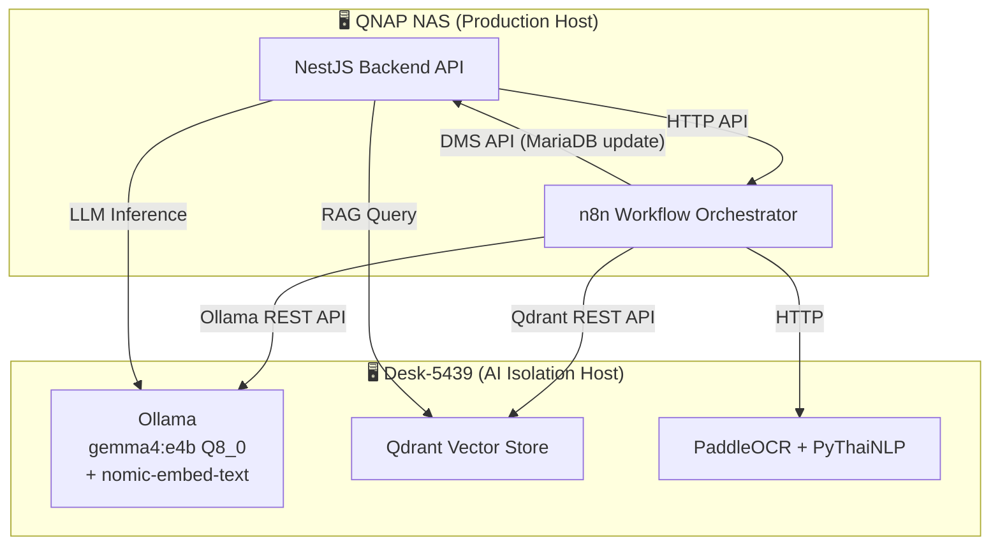

# ADR-023A: Unified AI Architecture — Model Revision (gemma4:e4b Q8_0, 2-Model Stack)

**Status:** Accepted
**Date:** 2026-05-15
**Decision Makers:** Development Team, System Architect, Security Team, AI Integration Lead
**Supersedes Revision:** ADR-023 v1.1 (2026-05-14)
**Related Documents:**
- [Glossary](../00-Overview/00-02-glossary.md)
- [Data Dictionary](../03-Data-and-Storage/03-01-data-dictionary.md)
- [Legacy Data Migration Plan](../03-Data-and-Storage/03-04-legacy-data-migration.md)
- [n8n Migration Setup Guide](../03-Data-and-Storage/03-05-n8n-migration-setup-guide.md)
- [ADR-016: Security & Authentication](./ADR-016-security-authentication.md)
- [ADR-019: Hybrid Identifier Strategy](./ADR-019-hybrid-identifier-strategy.md)
- [RAG Implementation Guide v1.1.2](../08-Tasks/ADR-022-Retrieval-Augmented-Generation/LCBP3-RAG-Implementation-Guide-v1.1.2.md)
- [ADR-023: Unified AI Architecture (Base)](./ADR-023-unified-ai-architecture.md)

> **หมายเหตุ:** ADR-023A เป็นสำเนาอัปเดตของ ADR-023 v1.1 โดยปรับปรุงชุดโมเดล AI เพื่อให้ใช้งาน VRAM ≤ 8GB ได้อย่างมีเสถียรภาพ ลดจาก 3 โมเดล (gemma4:9b + Typhoon Local + nomic-embed-text) เหลือ 2 โมเดล (gemma4:e4b Q8_0 + nomic-embed-text) โดย gemma4:e4b ทำหน้าที่ครอบคลุมทั้ง General Inference และ OCR Post-processing/Extraction แทน Typhoon Local

---

## 🎯 Gap Analysis & Purpose

### ปิด Gap จากเอกสาร:
- **Product Vision v1.8.5** - Section 3.1, 3.2, 3.3: ความต้องการยกระดับประสิทธิภาพการนำเข้าเอกสารเก่าและการจัดการเอกสารใหม่ด้วย AI Intelligence
  - เหตุผล: การทำงานด้วยมือ (Manual) มีต้นทุนเวลาสูงและเกิดความผิดพลาดได้ง่าย จำเป็นต้องมี AI ช่วยตรวจสอบและจัดหมวดหมู่โดยอัตโนมัติ
- **Security Requirements & Risk Assessment** - Section 3.1, 4.2: ความเสี่ยงด้านข้อมูลรั่วไหลและการเข้าถึงฐานข้อมูลโดยตรงจากเซอร์วิส AI
  - เหตุผล: ข้อมูลเอกสารก่อสร้างท่าเรือแหลมฉบัง เฟส 3 เป็นความลับระดับสูง (Confidential) ต้องมีขอบเขตความปลอดภัย (AI Boundary) ที่รัดกุม

### แก้ไขความขัดแย้งและการกระจายตัวของเอกสาร:
- **ADR-017, ADR-017B, ADR-018, ADR-020, ADR-022** มีความทับซ้อนในเชิงสถาปัตยกรรมและข้อกำหนด
  - การตัดสินใจนี้ช่วยแก้ไขโดย: ยุบรวมข้อกำหนดทั้งหมดเข้าสู่ร่มใหญ่ฉบับเดียว (Consolidation) เพื่อลดปัญหา Revision Drift และทำให้การทบทวนสถาปัตยกรรม (Review Cycle) เป็นไปอย่างสอดคล้องกันทั้งระบบ

---

## Context and Problem Statement

โครงการ LCBP3-DMS มีความต้องการประยุกต์ใช้ AI ในการเพิ่มประสิทธิภาพการบริหารจัดการเอกสารวิศวกรรมโยธาขนาดใหญ่ โดยเผชิญกับโจทย์และความท้าทายหลัก 5 ด้าน:

1. **Legacy Document Migration:** เอกสาร PDF เก่ากว่า 20,000 ฉบับ ต้องนำเข้าระบบพร้อมตรวจสอบความสอดคล้องกับ Metadata ใน Excel
2. **Real-time Ingestion & Classification:** เอกสารใหม่ที่ผู้ใช้อัปโหลดต้องการการสกัด Metadata และจัดหมวดหมู่แบบเรียลไทม์เพื่อลดภาระงานกรอกข้อมูล
3. **Conversational Retrieval (RAG):** Full-text search บน MariaDB ไม่เข้าใจบริบท (Semantic) และการตัดคำภาษาไทย ทำให้สืบค้นข้อมูลเชิงลึกได้ยาก
4. **Data Confidentiality & Privacy:** ห้ามส่งข้อมูลความลับออกนอกเครือข่ายองค์กรไปยัง Cloud AI Provider (เช่น OpenAI, Google)
5. **System Stability & Isolation:** การรัน AI Inference ใช้ทรัพยากรสูง (GPU VRAM/CPU) ไม่ควรรันร่วมกับ Production Server หลัก (QNAP NAS) เพื่อไม่ให้กระทบประสิทธิภาพของระบบ

---

## Decision Drivers

- **Zero Trust & Physical Isolation:** AI ต้องถูกปฏิบัติเสมือน Untrusted Component รันแยกต่างหากบน Admin Desktop เท่านั้น
- **RFA-First Approach:** มุ่งเน้นกระบวนการเอกสาร RFA (Request for Approval) ซึ่งซับซ้อนที่สุดเป็นแกนหลัก
- **Data Integrity & Human-in-the-Loop:** ข้อมูลจาก AI ต้องผ่านการทวนสอบและยืนยันโดยมนุษย์ก่อน Commit ลงฐานข้อมูลจริงเสมอ
- **Multi-tenant Isolation:** ต้องแยกขอบเขตข้อมูลของแต่ละโครงการอย่างเด็ดขาดในระดับ Vector Database Payload Filter
- **Cost Effectiveness:** ประมวลผลภายในองค์กร (On-Premises) เพื่อหลีกเลี่ยงค่าใช้จ่ายแบบ Pay-per-use
- **Two-Phase Storage Governance:** ควบคุมการย้ายไฟล์ทุกขั้นตอนผ่าน `StorageService` เพื่อให้สแกนไวรัสและเก็บ Audit Log ได้ครบถ้วน
- **GPU VRAM Budget ≤ 8GB:** โมเดลทั้งหมดต้องโหลดพร้อมกันภายใน RTX 2060 Super 8GB ได้โดยไม่เกิด OOM (Out-of-Memory)

---

## Considered Options

### Option 1: Fragmented AI Subsystems (แยกระบบ AI ตาม Use Case)
**Pros:**
- ออกแบบและพัฒนาง่ายในระยะสั้น แต่ละส่วนไม่พึ่งพากัน
**Cons:**
- ❌ เกิด Code Duplication สูง
- ❌ มาตรฐานความปลอดภัยและการควบคุมสิทธิ์ไม่สม่ำเสมอ
- ❌ บำรุงรักษายากเมื่อมีการเปลี่ยนโมเดลหรือโครงสร้าง Prompt

### Option 2: Cloud AI Platform Integration
**Pros:**
- โมเดลมีความฉลาดแม่นยำสูงมาก ไม่ต้องลงทุนและบำรุงรักษา Hardware
**Cons:**
- ❌ **ผิดข้อกำหนดด้าน Data Privacy** อย่างรุนแรงสำหรับเอกสาร Confidential
- ❌ ค่าใช้จ่ายสูงมากเมื่อต้องประมวลผลเอกสารเก่ากว่า 20,000 ฉบับและรองรับ RAG

### Option 3: 3-Model Stack (gemma4:9b + Typhoon Local + nomic-embed-text)
**เหตุผลที่ไม่เลือก:**
- ❌ Typhoon Local (~4GB VRAM) + gemma4:9b (~5.5GB VRAM) = ~9.5GB → เกิน RTX 2060 Super 8GB ทำให้เกิด GPU Swap และลดความเสถียร
- ❌ Ollama ไม่สลับโมเดลได้ฉับพลัน หากโหลดพร้อมกัน VRAM เต็มแน่นอน
- ❌ ต้องจัดการ Routing Logic (เลือกว่างานไหนใช้โมเดลไหน) เพิ่ม Complexity

### Option 4: Unified 2-Model Stack (gemma4:e4b Q8_0 + nomic-embed-text) ⭐ **SELECTED**

| โมเดล | ขนาด (VRAM โดยประมาณ) | หน้าที่ |
|-------|----------------------|---------|
| `gemma4:e4b Q8_0` | ~4.5GB | General Inference + OCR Post-processing + Extraction + RAG Q&A |
| `nomic-embed-text` | ~0.3GB | Embedding 768-dim สำหรับ Qdrant |
| **รวม** | **~4.8GB** | **เผื่อ headroom ~3.2GB สำหรับ KV Cache และ context window ขนาดใหญ่** |

**Pros:**
- ✅ **VRAM ≤ 8GB อย่างมีเสถียรภาพ:** โมเดลทั้ง 2 โหลดพร้อมกันได้ มี headroom เพียงพอสำหรับ KV Cache ขนาดใหญ่
- ✅ **Single Model ลด Routing Complexity:** gemma4:e4b ครอบคลุมทุก Use Case (OCR clean-up, Extraction, RAG, Classification) ผ่าน Prompt Engineering ที่แตกต่างกัน
- ✅ **BullMQ Sequential Queue:** การใช้โมเดลเดียวทำให้ Queue ทำงานได้ตรงไปตรงมา — ไม่มีปัญหา Worker ต้องสลับโมเดลระหว่างงาน
- ✅ **GPU Overload Prevention ตาม ADR-023:** สอดคล้องกับนโยบายที่กำหนดไว้แต่เดิม
- ✅ **gemma4:e4b Q8_0:** quantization Q8_0 รักษาความแม่นยำของ weights ใกล้เคียง FP16 มากที่สุด เหมาะกับงานที่ต้องการความละเอียดด้านภาษา

**Cons:**
- ❌ ไม่มี Typhoon Local ซึ่งถูก Fine-tune มาสำหรับภาษาไทยโดยเฉพาะ — ต้องพึ่ง Prompt Engineering บน gemma4:e4b แทน

---

## Decision Outcome

**Chosen Option:** Option 4 — Unified 2-Model Stack (gemma4:e4b Q8_0 + nomic-embed-text)

### Rationale
การลด Model Stack จาก 3 → 2 โมเดลช่วยให้ VRAM Budget ≤ 8GB อย่างมีเสถียรภาพ โดย gemma4:e4b Q8_0 สามารถทำหน้าที่แทน Typhoon Local ได้ผ่าน Prompt Engineering เนื่องจาก gemma4 architecture รองรับ Multimodal Context ได้ดี และ Q8_0 quantization รักษา quality ไว้ในระดับสูง BullMQ Sequential Queue ทำงานได้ตรงไปตรงมามากขึ้นเมื่อมีโมเดลเดียว ลด complexity ของ Job Routing

---

## 🔍 Impact Analysis

### Affected Components

| Component | Level | Impact Description | Required Action |
|-----------|-------|-------------------|-----------------|
| **Security Layer** | 🔴 High | บังคับใช้ขอบเขตการเชื่อมต่อผ่าน API Gateway เท่านั้น | เพิ่ม permissions `ai.suggest`, `ai.rag_query`, `ai.migration_manage`, `ai.audit_log_delete` และ Assign ตาม Role Matrix ด้านล่าง |
| **Backend (NestJS)** | 🔴 High | สร้าง `AiModule` เป็นศูนย์กลางควบคุม Pipeline และ RAG | พัฒนา Gateway Services และ Validation Layers |
| **Database** | 🔴 High | ตารางจัดเก็บประวัติการทวนสอบและสถานะเวกเตอร์ | สร้าง `migration_review_queue` และ `ai_audit_logs` (แยก table, ไม่ใช่ Compliance — เป็น AI Development Feedback Log) |
| **Frontend (Next.js)** | 🟡 Medium | หน้าจอแสดงผลลัพธ์จาก AI พร้อมค่า Confidence | พัฒนา Reusable Form Components และ Dashboard |
| **Infrastructure** | 🔴 High | การตั้งค่า Admin Desktop (Desk-5439) สำหรับ AI | ติดตั้ง Ollama, Qdrant, n8n, PaddleOCR, PyThaiNLP |

### Cross-Module Dependencies



---

## 📋 Version Dependency Matrix

| ADR | Version | Dependency Type | Affected Version(s) | Implementation Status |
|-----|---------|-----------------|---------------------|----------------------|
| **ADR-023A** | 1.2 | Model Revision | v1.9.0+ | ✅ Active |
| **ADR-023** | 1.1 | Base Architecture | v1.9.0+ | ✅ Active (superseded by 023A for model config) |
| **ADR-016** | 2.0 | Governs | v1.8.0+ | ✅ Active |
| **ADR-019** | 1.5 | Governs | v1.8.0+ | ✅ Active |

---

## Implementation Details (ข้อกำหนดเชิงลึกรายหมวด)

### 1. Security Isolation Policy (ขอบเขตความปลอดภัย)
* **Physical Isolation:** เซอร์วิส AI ทั้งหมด (Ollama, Qdrant, PaddleOCR) **ต้องรันบน Admin Desktop (Desk-5439)** ที่มี GPU RTX 2060 Super 8GB เท่านั้น ห้ามรันบน QNAP NAS หลัก
* **No Direct DB/Storage Access:** เครื่อง AI Host **ห้าม**มีการเชื่อมต่อฐานข้อมูล MariaDB หรือเมาท์ Storage ปลายทางโดยตรง การอ่าน/เขียนข้อมูลทั้งหมดต้องทำผ่าน **DMS Backend API**
* **Validation Layer:** Backend ต้องตรวจสอบความถูกต้องของ Output จาก AI (Schema, System Enum, Confidence Threshold) ก่อนบันทึกลงฐานข้อมูลเสมอ

#### AI RBAC Permission Matrix

> Permission ใหม่ที่ต้องเพิ่มใน `lcbp3-v1.9.0-seed-permissions.sql` (module: `ai`, ID range: 181-190)

| Permission | คำอธิบาย | Superadmin (1) | Org Admin (2) | Document Control (3) | Editor (4) | Viewer (5) |
|---|---|:---:|:---:|:---:|:---:|:---:|
| `ai.suggest` | รับ AI Suggestion เมื่อสร้าง/แก้ไขเอกสาร | ✅ | ✅ | ✅ | ❌ | ❌ |
| `ai.rag_query` | ใช้ RAG Q&A สืบค้นเอกสาร | ✅ | ✅ | ✅ | ❌ | ❌ |
| `ai.migration_manage` | จัดการ Migration Batch (Review/Import/Reject) | ✅ | ✅ | ✅ | ❌ | ❌ |
| `ai.audit_log_delete` | Hard Delete `ai_audit_logs` | ✅ | ❌ | ❌ | ❌ | ❌ |

### 2. Core Infrastructure & Models

> **นโยบาย:** เอกสารทั้งหมดใน LCBP3 จัดชั้นเป็น **INTERNAL** — AI Inference ทั้งหมดต้องรันภายใน Physical Isolation Boundary บน Desk-5439 เท่านั้น ห้ามใช้ Cloud AI Provider โดยเด็ดขาด

#### 2.1 Model Stack (2 โมเดลเท่านั้น)

| โมเดล | Role | VRAM (โดยประมาณ) | หมายเหตุ |
|-------|------|-----------------|---------|
| `gemma4:e4b Q8_0` | General Inference + OCR Post-processing + Extraction + RAG Q&A | ~4.0GB (weights) + ~0.2GB (KV Cache) | Q8_0 ≈ 4B × 8-bit = ~4.0GB; KV Cache ต่ำเพราะ input ≤ 3 หน้า (~2,000 tokens) |
| `nomic-embed-text` | Embedding 768-dim → Qdrant | ~0.3GB | สร้าง Semantic Vector สำหรับ Hybrid Search |
| **รวม (peak)** | | **~4.5GB** | **เผื่อ headroom ~3.5GB — มั่นใจสูง เพราะ PDF input จำกัด ≤ 3 หน้า** |

* **Orchestrator:** ใช้ **n8n** เป็นตัวควบคุม Flow **Migration Phase เท่านั้น** (trigger batch, monitor progress, handle retry ระดับ batch) — ห้าม n8n เรียก Ollama หรือ PaddleOCR โดยตรง
* **Job Executor:** ทุก AI Inference (OCR, Extraction, Embedding, RAG) ต้องผ่าน **BullMQ บน NestJS เท่านั้น** — n8n call `POST /api/ai/jobs` เพื่อ queue job แล้ว poll ผลผ่าน `GET /api/ai/jobs/:jobId`

```
Migration Flow:
  n8n → POST /api/ai/jobs (DMS API) → BullMQ (ai-batch)
       → Worker: PaddleOCR / Ollama บน Desk-5439
       → n8n poll GET /api/ai/jobs/:jobId → ได้ผล → POST /api/ai/migration/review

Real-time Flow (User Upload):
  NestJS Controller → BullMQ (ai-batch) → Worker → ai_audit_logs
```

> **เหตุผล:** การ inference ทั้งหมดผ่าน BullMQ ทำให้ RBAC, ADR-007 Error Handling และ `ai_audit_logs` ครอบคลุมทุก job โดยอัตโนมัติ — ถ้า n8n bypass BullMQ จะเกิด audit gap

* **LLM Engine:** ใช้ **Ollama** บน Desk-5439 รันโมเดล `gemma4:e4b Q8_0` สำหรับงานทั้งหมด ได้แก่ General Inference, OCR Post-processing, Metadata Extraction, Classification และ RAG Q&A
* **Embedding Model:** ใช้ `nomic-embed-text` รันผ่าน Ollama บน Desk-5439 สำหรับแปลงเวกเตอร์ 768-มิติ
* **OCR & NLP:** ใช้ **PaddleOCR** สกัดข้อความจาก Scanned PDF และใช้ **PyThaiNLP** ตัดคำ/เตรียมข้อความภาษาไทย — ทั้งคู่รันบน Desk-5439
* ❌ **Typhoon Local:** ไม่ใช้ — ถูกแทนที่โดย `gemma4:e4b Q8_0` เพื่อรักษา VRAM Budget
* ❌ **Typhoon Cloud API:** ไม่ใช้ — `rag/typhoon.service.ts` ต้องถูก Remove ออกจาก Codebase (Dead Code + Security Risk)

#### 2.2 BullMQ Queue Architecture (GPU Overload Prevention)

> **นโยบาย:** ใช้ **2 Queues แยกอิสระ** เพื่อป้องกัน RAG Q&A ถูก Block โดย Batch Jobs และป้องกัน VRAM Overflow บน RTX 2060 Super 8GB ทั้งสอง Queue มี **concurrency = 1** เสมอ

##### Phase Context (กำหนดลักษณะการใช้งานแต่ละช่วง)

| Phase | ช่วงเวลา | Volume | หมายเหตุ |
|-------|---------|--------|---------|
| **Migration Phase** | Pre-launch (ก่อนเปิดให้ User ทั่วไป) | ~20,000 ฉบับ (Batch ครั้งเดียว) | รัน `ai-batch` เต็มแรง ไม่มี User แย่งคิว — queue contention = 0 |
| **Production Phase** | หลัง Go-live | ~50 ฉบับ/วัน | Volume ต่ำมาก ทั้ง 2 queues แทบไม่มีงานค้าง |

##### Queue 1: `ai-realtime` (Interactive User Requests)

```
Queue: ai-realtime (BullMQ)
  concurrency: 1
  defaultJobOptions:
    attempts: 3
    backoff: { type: 'exponential', delay: 3000 }
```

| Job Type | โมเดลที่ใช้ | SLA Target |
|----------|-----------|------------|
| `rag-query` | `gemma4:e4b Q8_0` | p95 < 10s (นับตั้งแต่ dequeue) |
| `ai-suggest` | `gemma4:e4b Q8_0` | p95 < 8s |

##### Queue 2: `ai-batch` (Background Processing)

```
Queue: ai-batch (BullMQ)
  concurrency: 1
  defaultJobOptions:
    attempts: 3
    backoff: { type: 'exponential', delay: 5000 }
```

| Job Type | โมเดลที่ใช้ | Priority |
|----------|-----------|---------|
| `ocr-postprocess` | `gemma4:e4b Q8_0` | Normal |
| `metadata-extract` | `gemma4:e4b Q8_0` | Normal |
| `embed-document` | `nomic-embed-text` | Low |

> ⚠️ **GPU Constraint:** แม้จะแยก 2 Queue แต่ Ollama Worker บน Desk-5439 มี GPU เดียว — หาก `ai-realtime` และ `ai-batch` รัน Job พร้อมกัน VRAM อาจเต็ม ให้ตั้งค่า `ai-batch` pause อัตโนมัติเมื่อ `ai-realtime` มี active job (ผ่าน BullMQ Event hooks: `active` / `completed`)

### 3. Legacy Data Migration (การนำเข้าข้อมูลเก่า)

#### 3.0 Ingestion Workflow Overview

```
┌─────────────────────────────────────────────────────────────────┐
│ 1.1 LEGACY INGESTION (Pre-launch, Migration Phase)              │
│                                                                 │
│  Admin วางไฟล์ใน Folder                                         │
│       → n8n UI: Admin กด "Run Migration Workflow" ด้วยตนเอง    │
│       → n8n → POST /api/ai/jobs → BullMQ (ai-batch)            │
│       → OCR/Extract → migration_review_queue (PENDING)         │
│       → DMS Frontend /admin/ai-migration: Admin Approve/Reject  │
│       → IMPORTED → AUTO: queue embed-document (ai-batch)        │
└─────────────────────────────────────────────────────────────────┘

┌─────────────────────────────────────────────────────────────────┐
│ 1.2 NEW DOCUMENT INGESTION (Production Phase, ~50/วัน)          │
│                                                                 │
│  User Upload ผ่านช่องทางปกติ (RFA / Correspondence form)        │
│       → Two-Phase Upload: Temp storage + ClamAV scan            │
│       → User Submit → DMS commit (temp → permanent)            │
│       → AUTO (parallel):                                        │
│           ├─ queue ocr-postprocess + metadata-extract (ai-batch)│
│           │       → AI Suggestion แสดงบนฟอร์ม                  │
│           │       → Human confirm Metadata                      │
│           └─ queue embed-document (ai-batch, Low priority)      │
│                   → Qdrant indexed (background, ไม่บล็อก User)  │
│                                                                 │
│  ช่วง gap (commit → embed เสร็จ): ค้นหาผ่าน DB search ปกติได้  │
│  ไม่ต้อง real-time — ยอมรับได้                                  │
└─────────────────────────────────────────────────────────────────┘
```

> **RAG Embedding Trigger: AUTO เสมอ หลัง commit ทันที** — ห้าม Manual trigger เพื่อป้องกัน Qdrant index ไม่สมบูรณ์
> - **Legacy:** trigger หลัง Admin Approve (`PENDING` → `IMPORTED`)
> - **New doc:** trigger ทันทีหลัง Two-Phase commit สำเร็จ (parallel กับ AI Suggestion — ไม่รอ Human confirm)
> - **Gap period** (ระหว่าง commit → embed เสร็จ): ใช้ MariaDB full-text search แทน — ยอมรับได้ ไม่ต้อง real-time

#### 3.1 Frontend UI Scope (DMS Frontend vs n8n UI)

| งาน | UI ที่ใช้ | หมายเหตุ |
|-----|---------|---------|
| Trigger Migration Batch | **n8n Workflow UI** | Admin กด Run ใน n8n — ไม่มีปุ่มใน DMS Frontend |
| Review migration_review_queue | **DMS Frontend** `/admin/ai-migration` | Approve / Reject + แก้ไข Metadata |
| Monitor job progress | **DMS Frontend** (BullMQ dashboard หรือ job status API) | `GET /api/ai/jobs/:jobId` |
| AI Suggestion on new doc | **DMS Frontend** (form inline) | แสดงบนฟอร์ม RFA/Correspondence |

* **Staging Area:** ข้อมูลที่ประมวลผลผ่าน n8n จะถูกส่งเข้าตาราง `migration_review_queue` เสมอ
* **Record Lifecycle:** Record ใน `migration_review_queue` **ไม่ถูกลบ** หลัง Import — เปลี่ยน `status` เป็น `IMPORTED` เก็บไว้ตลอดเพื่อ Debug และตรวจสอบ Batch ย้อนหลัง
  * Status transitions: `PENDING` → `IMPORTED` | `PENDING` → `REJECTED`
* **Confidence Threshold Policy** (กำหนดผ่าน `.env` — ไม่ Hardcode, ไม่มี Admin UI):
  * `AI_THRESHOLD_HIGH=0.85` และ `is_valid = true` $\rightarrow$ สถานะ `PENDING` (พร้อม Import)
  * `AI_THRESHOLD_MID=0.60` ถึง `AI_THRESHOLD_HIGH-0.01` $\rightarrow$ สถานะ `PENDING` (ไฮไลต์เตือน Admin)
  * ต่ำกว่า `AI_THRESHOLD_MID` หรือ `is_valid = false` $\rightarrow$ สถานะ `REJECTED`
  * การเปลี่ยนค่าต้อง Restart service และมีร่องรอยใน deployment log
* **Threshold Recalibration Policy:**
  * ค่าเริ่มต้น (0.85/0.60) ถูกกำหนดในยุค gemma4:9b — ใช้เป็น baseline สำหรับ Migration Phase แรก
  * **หลัง import เอกสารชุดแรก 100–500 ฉบับ:** ทบทวนค่า threshold โดยดูจาก `ai_audit_logs` (`confidence_score` distribution) เปรียบเทียบกับ Admin override rate
  * **เกณฑ์ปรับ:** ถ้า REJECTED rate > 30% หรือ Admin override rate > 40% ให้ปรับลด threshold ลง และบันทึกการเปลี่ยนแปลงใน Review History ของ ADR นี้
  * **ผู้รับผิดชอบ:** AI Integration Lead ร่วมกับ Document Control Team
* **Idempotency Header:** บังคับส่ง `Idempotency-Key: <doc_number>:<batch_id>` ป้องกันบันทึกซ้ำ
* **Two-Phase Storage:** ไฟล์ถูกอัปโหลดเป็น Temp (`is_temporary = true`) และย้ายเข้า Storage จริงเมื่อเรียก API Commit เท่านั้น

### 4. Smart Classification & Real-time Ingestion

#### 4.1 PDF Input Limit (Hard Constraint)

> **กฎ:** ส่ง PDF เข้า **gemma4:e4b Q8_0** ได้ **สูงสุด 3 หน้าแรกเท่านั้น** สำหรับงาน Summarization, Classification และ Tagging
> ⚠️ **ข้อยกเว้น:** งาน `embed-document` (RAG) ใช้เอกสารทั้งฉบับ — ดู Section 5

**เหตุผล:**
- หน้าปก + หน้าที่ 1–2 ของเอกสารวิศวกรรมมักมีข้อมูลหลักครบ (Document Title, Drawing No., Discipline, Project Code, Revision)
- จำกัด KV Cache ที่ ~2,000 tokens → VRAM peak ≤ ~4.5GB ตามที่ออกแบบไว้
- ป้องกัน Job ใช้เวลานานเกิน SLA

**Implementation Note:**
```
n8n PDF Pre-processor:
  extract_pages: [1, 2, 3]   ← hard limit, ห้ามเปลี่ยนโดยไม่ review ADR
  fallback: ถ้า PDF < 3 หน้า → ใช้ทั้งหมด
```

#### 4.2 PDF Type Auto-Detection (OCR Routing)

> **กฎ:** ระบบต้อง **detect อัตโนมัติ** ว่า PDF มี selectable text หรือไม่ ก่อนเลือก pipeline — ห้ามให้ User เลือกเอง

```
PDF Upload
  └─ n8n: ตรวจสอบ text layer (PyMuPDF: page.get_text())
        ├─ มีข้อความ (len > threshold) → Fast Path: text parser โดยตรง
        └─ ไม่มีข้อความ / image-only → Slow Path: PaddleOCR → PyThaiNLP
```

| Path | เงื่อนไข | เครื่องมือ | เวลาโดยประมาณ |
|------|---------|----------|--------------|
| **Fast Path** | `extracted_chars > 100` ต่อหน้า | PyMuPDF text parser | < 1s |
| **Slow Path** | `extracted_chars ≤ 100` ต่อหน้า | PaddleOCR + PyThaiNLP | 5–30s/หน้า |

> **หมายเหตุ:** threshold `100 chars` ป้องกัน PDF ที่มี text layer แต่ข้อมูลน้อยมาก (เช่น มีแค่ watermark) ถูก route ไป Fast Path ผิด — ปรับค่าได้ผ่าน `.env: OCR_CHAR_THRESHOLD=100`

* **Enum Enforcement:** ฟิลด์หมวดหมู่และประเภทเอกสารที่สกัดได้ ต้องนำไปทวนสอบกับ Master Data (`GET /api/meta/categories`) เสมอ ห้ามให้ AI สร้างประเภทเอกสารขึ้นมาเองโดยพลการ
* **Human Override:** นำเสนอผลลัพธ์บนหน้าจอ RFA/Correspondence ให้ผู้ใช้กดยืนยันหรือแก้ไขก่อนบันทึก

### 5. Hybrid Retrieval-Augmented Generation (RAG)

#### 5.1 Document Embedding Scope (แตกต่างจาก Classification)

> **กฎ:** `embed-document` ต้องฝัง Vector จาก **เอกสารทั้งฉบับ** (ไม่ใช่แค่ 3 หน้า) เพื่อให้ RAG ค้นหาเนื้อหาจากทุกหน้าได้

**เหตุผลที่ไม่กระทบ VRAM:**
- `nomic-embed-text` ประมวลผล **chunk ทีละชิ้น** (stateless) — ไม่ต้องโหลดเอกสารทั้งฉบับพร้อมกัน
- VRAM peak ของ embed job = ขนาด 1 chunk (~512 tokens) เท่านั้น ≈ negligible

**Chunking Strategy:**
```
Chunk size:    512 tokens
Overlap:       64 tokens   ← รักษา context ข้ามขอบ chunk
Unit:          paragraph-aware (ตัดที่ paragraph boundary ก่อน token boundary)
Max chunks/doc: ไม่จำกัด — ขึ้นกับความยาวเอกสาร
```

**Qdrant Payload ต่อ chunk:**
```json
{
  "document_public_id": "<uuid>",
  "project_public_id": "<uuid>",
  "page_number": 12,
  "chunk_index": 5
}
```

#### 5.2 RAG Pipeline
* **Hybrid Search Strategy:** ผสานคะแนน Vector Similarity (0.7) + Keyword Exact Match (0.3) และผ่าน Score-based Re-ranking
* **Multi-tenant Isolation:** บังคับใช้ Qdrant Payload Filter กำหนด `project_public_id` เป็นเงื่อนไขในการสืบค้น **ทุกครั้ง** — enforce ผ่าน `QdrantService` wrapper ที่กำหนด `projectPublicId: string` เป็น **required parameter** (ไม่มี optional fallback) ดังนี้:

```typescript
// ✅ Required contract — ห้ามเปลี่ยน signature โดยไม่ review ADR
@Injectable()
export class QdrantService {
  async search(
    projectPublicId: string,   // required — compile-time enforcement
    vector: number[],
    topK: number = 5,
  ): Promise<QdrantSearchResult[]> {
    return this.client.search('documents', {
      vector,
      limit: topK,
      filter: {
        must: [{ key: 'project_public_id', match: { value: projectPublicId } }],
      },
    });
  }

  async upsert(
    projectPublicId: string,   // required
    chunks: DocumentChunk[],
  ): Promise<void> { ... }

  // ❌ ห้าม expose rawSearch() หรือ method ที่ไม่บังคับ filter
}
```
* **LLM สำหรับ RAG Q&A:** ใช้ **Local Ollama (`gemma4:e4b Q8_0`)** บน Desk-5439 เท่านั้น — ไม่มี Cloud Fallback เนื่องจากเอกสารทั้งหมดจัดชั้นเป็น INTERNAL
* **Context Window สำหรับ RAG:** ส่ง top-K chunks (K=5) เข้า gemma4:e4b ≈ 5 × 512 = ~2,560 tokens — อยู่ในขีดจำกัด VRAM
* **Performance Target:** $p95 < 10s$ สำหรับการตอบคำถามผ่าน Local LLM (นับตั้งแต่ dequeue จาก `ai-realtime`)

### 6. `ai_audit_logs` — AI Development Feedback Log

> **วัตถุประสงค์:** บันทึก AI Suggestion + การตัดสินใจของมนุษย์เพื่อใช้วิเคราะห์และปรับปรุงคุณภาพโมเดล AI — **ไม่ใช่ Compliance Audit Trail**
> Compliance จริงๆ ถูกบันทึกอยู่ใน `audit_logs` แล้ว (Human Confirm Action)

* **Key Columns:** `document_public_id`, `model_name`, `ai_suggestion_json`, `human_override_json`, `confidence_score`, `confirmed_by_user_id`, `created_at`
* **Retention:** ตลอดอายุโครงการ (~5-10 ปี) — Admin สามารถ **Hard Delete** ได้ผ่าน Frontend เพื่อจัดการ Test Data และ Storage
* **RBAC:** เฉพาะ Role `SYSTEM_ADMIN` เท่านั้นที่ลบได้ — การลบทุกครั้งต้องบันทึกใน `audit_logs` (`action: 'AI_AUDIT_LOG_DELETED'`)
* **ห้าม Merge:** ต้องเป็น Table แยกจาก `audit_logs` เพื่อให้ Query ด้วย Typed Columns ได้ (เช่น `WHERE confidence_score < 0.85`)

---

## Consequences

### Positive
1. ✅ มีมาตรฐานสถาปัตยกรรม AI ที่เป็นหนึ่งเดียว ง่ายต่อการอ้างอิงและตรวจสอบสิทธิ์
2. ✅ ปลอดภัยสูงสุดตามหลักการ Zero Trust ป้องกันฐานข้อมูลและไฟล์ระบบจากความเสี่ยงของเซอร์วิสภายนอก
3. ✅ รองรับเอกสารภาษาไทยได้อย่างแม่นยำผ่านกระบวนการ NLP เฉพาะทาง
4. ✅ ควบคุมการใช้งานทรัพยากรได้อย่างมีประสิทธิภาพ ไม่รบกวน Production NAS
5. ✅ **VRAM Budget เสถียร:** 2-Model Stack ใช้ ~4.5GB จาก 8GB (peak) — มี headroom ~3.5GB; ยืนยันโดย PDF 3-page hard limit
6. ✅ **BullMQ Sequential Queue ลด Complexity:** ไม่มี Logic เลือกโมเดล Worker ทำงานได้ตรงไปตรงมา

### Negative
1. ❌ ระบบมีความซับซ้อนในการตั้งค่าและเชื่อมต่อเครือข่ายระหว่าง NAS และ Admin Desktop
2. ❌ มี Overhead ในการดูแลรักษาเครื่อง Desktop (GPU Temperature, Service Uptime)
3. ❌ ไม่มี Typhoon Local ที่ Fine-tune ภาษาไทยโดยเฉพาะ — ต้องใช้ Prompt Engineering ชดเชย

### ⚠️ Unvalidated Assumptions (ข้อสมมติที่ยังไม่ได้ทดสอบ)

> การตัดสินใจเปลี่ยนจาก Typhoon Local → gemma4:e4b Q8_0 อาศัยเหตุผล VRAM เป็นหลัก **ยังไม่มีหลักฐานเชิงคุณภาพ** รองรับ

| Assumption | ความเสี่ยง | Validation Plan |
|------------|-----------|-----------------|
| gemma4:e4b Q8_0 + Prompt Engineering ชดเชยคุณภาพ Typhoon Local ได้ | OCR Post-processing และ Metadata Extraction ภาษาไทยอาจด้อยกว่า → Confidence Score ต่ำ → เพิ่มภาระ Admin Review | ทดสอบด้วย Sample 50–100 ฉบับจากเอกสารจริง เปรียบเทียบ Accuracy ก่อน Go-live |
| PyThaiNLP Pre-processing เพียงพอชดเชยความขาด Thai Fine-tuning | ข้อความที่ตัดคำไม่ถูกต้องอาจทำให้โมเดลเข้าใจผิด | วัด Word Error Rate บน OCR output จริง ก่อน Production |

**ข้อตกลง:** หากทดสอบแล้วพบ Accuracy ต่ำกว่า 80% สำหรับ Thai Metadata Extraction ให้พิจารณา Option เพิ่มเติม เช่น Quantized Typhoon ขนาดเล็กหรือ LoRA Adapter บน gemma4:e4b

### Mitigation Strategies
* **Graceful Degradation (Desk-5439 ออฟไลน์):** DMS Core ยังทำงานได้ปกติทุก Feature — เฉพาะ AI Features ถูก Disable ชั่วคราว:
  * Backend ตรวจสอบ Health Check ของ Desk-5439 ทุก **60 วินาที** ผ่าน `/health` endpoint ของ Ollama และ Qdrant
  * เมื่อ Desk-5439 ออฟไลน์ → set `AI_AVAILABLE = false` ใน Redis Cache
  * Frontend แสดง **Global Banner:** "⚠️ ระบบ AI ไม่พร้อมใช้งานชั่วคราว กรุณากรอกข้อมูลด้วยตนเอง"
  * AI Classification form fields แสดงผล แต่ AI Suggestion ถูก hide — User กรอกเองได้ปกติ
  * RAG Q&A endpoint return `503 Service Unavailable` พร้อม error message ที่อ่านเข้าใจได้
* **GPU Overload Prevention:** ใช้ BullMQ จัดคิวงาน AI แบบ Sequential (concurrency = 1) เพื่อไม่ให้ VRAM 8GB โอเวอร์โหลด — ดูรายละเอียดใน Section 2.2
* **Thai Language Quality:** ใช้ PyThaiNLP สำหรับ Pre-processing (word segmentation) ก่อนส่งให้ gemma4:e4b เพื่อรักษาคุณภาพข้อความภาษาไทย

---

## 🔄 Review Cycle & Maintenance

### Review Schedule
- **Next Review:** 2026-11-15 (6 months from revision)
- **Review Type:** Scheduled Core Architecture Review
- **Reviewers:** System Architect, Security Lead, AI Integration Lead

### Review History
| Version | Date | Changes | Status |
|---------|------|---------|--------|
| 1.0 | 2026-05-14 | ยุบรวมและแทนที่ ADR-017, 017B, 018, 020, 022 เป็นฉบับเดียว | ✅ Superseded |
| 1.1 | 2026-05-14 | Grilling Session: (1) ล็อค Local-only AI บน Desk-5439 ทั้งหมด (2) แยก Typhoon Local vs Cloud (3) ลบ Typhoon Cloud API ออก (4) กำหนด `ai_audit_logs` เป็น Development Feedback Log ไม่ใช่ Compliance (5) เพิ่ม Admin Hard Delete Policy | ✅ Superseded by 023A |
| 1.2 | 2026-05-15 | ADR-023A: เปลี่ยน Model Stack 3→2 (ลบ Typhoon Local, เปลี่ยน gemma4:9b → gemma4:e4b Q8_0), เพิ่ม BullMQ Queue Policy Table, เพิ่ม VRAM Budget breakdown | ✅ Active |

---

## Related ADRs (อดีตเอกสารที่ถูกแทนที่)

- [ADR-017: Ollama Data Migration Architecture](./ADR-017-ollama-data-migration.md) — **Superseded**
- [ADR-017B: AI Document Classification](./ADR-017B-ai-document-classification.md) — **Superseded**
- [ADR-018: AI Boundary Policy](./ADR-018-ai-boundary.md) — **Superseded**
- [ADR-020: AI Intelligence Integration Architecture](./ADR-020-ai-intelligence-integration.md) — **Superseded**
- [ADR-022: Retrieval-Augmented Generation (RAG) System](./ADR-022-retrieval-augmented-generation.md) — **Superseded**
