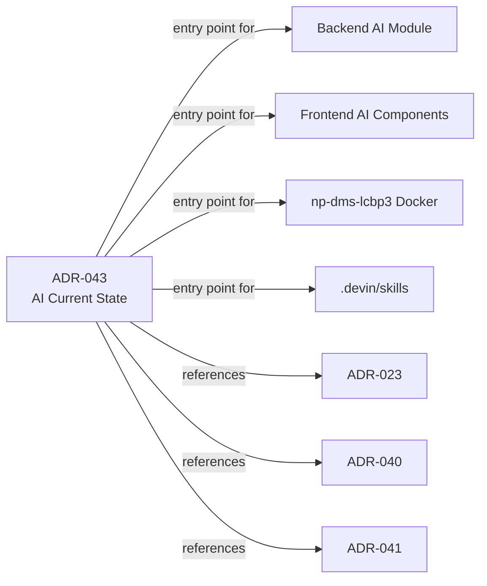

# ADR-043: AI Architecture — Current State (Single Source of Truth)

**Status:** Accepted (Consolidation / Single Source of Truth)
**Date:** 2026-08-03
**Decision Makers:** Development Team, System Architect, AI Integration Lead, Security Team
**Document Type:** Consolidation ADR — restates the **current** AI architecture as a single entry point

**Related Documents:**
- [Glossary](../00-overview/00-02-glossary.md)
- [Data Dictionary](../03-Data-and-Storage/03-01-data-dictionary.md)
- [AI Document Ingestion Flow](../02-architecture/02-05-ai-document-ingestion-flow.md)
- [ADR-016: Security & Authentication](./ADR-016-security-authentication.md)
- [ADR-019: Hybrid Identifier Strategy](./ADR-019-hybrid-identifier-strategy.md)
- [ADR-008: Email & Notification Strategy (BullMQ)](./ADR-008-email-notification-strategy.md)

---

> **หมายเหตุ:** ADR-043 เป็น **Single Source of Truth** สำหรับสถาปัตยกรรม AI ปัจจุบัน — ทำการ restatement ของ ADR ที่ active ทั้งหมด (ADR-023, 023A, 024, 025, 026, 027, 028, 029, 030, 032, 033, 034, 035, 036, 037, 040, 041, 042) และ **ปิด drift** ระหว่าง ADR-035 ↔ ADR-040 อย่างเป็นทางการ
>
> **เอกสารต้นฉบับยังคงอยู่** เพื่อรักษา audit trail ตาม ADR-REVIEW-PROCESS — แต่เมื่อต้องการทราบ "สถาปัตยกรรม AI ปัจจุบันคืออะไร" ให้อ่านที่นี่ก่อน
>
> **Superseded ADRs (กลุ่ม A):** ADR-017, 017B, 018, 020, 022 ถูกย้ายไป [`archive/`](./archive/) เพราะถูกแทนที่โดย ADR-023 และต่อมา ADR-043

---

## 🎯 Gap Analysis & Purpose

### ปิด Gap จากปัญหาการจัดการ ADR ส่วน AI

- **Revision Drift:** ADR-035 (2026-06-05) ระบุ Tesseract fallback, `/normalize` endpoint, และ engine `typhoon-np-dms-ocr:latest` — แต่ ADR-040 (2026-06-20) แก้ไขส่วนเหล่านี้ใน D1/D2 โดยยังไม่ได้ประกาศ `Amends: ADR-035` อย่างเป็นทางการ → เกิด drift note ใน [02-05-ai-document-ingestion-flow.md](../02-architecture/02-05-ai-document-ingestion-flow.md) ว่า "บนกระดาษยัง Accepted แต่ในทางปฏิบัติให้ถือ ADR-040"
  - **การแก้ไข:** ADR-043 ประกาศอย่างเป็นทางการว่า ADR-040 amends ADR-035 (ดู Decision Graph ด้านล่าง)
- **Supersede Chain ไม่ชัดเจน:** ADR-023A §2.1 ถูก supersede โดย ADR-034, ADR-033 §7 ถูก supersede โดย ADR-040, ADR-036 §5 ถูก amend โดย ADR-040 — ต้องไล่หลายฉบับเพื่อทราบสถานะปัจจุบัน
  - **การแก้ไข:** ADR-043 รวม supersede/amend chain ทั้งหมดไว้ใน Decision Graph และ "What is current" table
- **Host Reference เปลี่ยน:** ADR-023/023A อ้าง host `Desk-5439` แต่ ADR-041 (2026-06-20) ย้าย services ทั้งหมดไป `np-dms-lcbp3` (single-host Docker)
  - **การแก้ไข:** ADR-043 ระบุ host ปัจจุบันเป็น `np-dms-lcbp3` พร้อมอ้าง ADR-041 เป็น source

### วัตถุประสงค์

1. สร้าง **Single Source of Truth** สำหรับสถาปัตยกรรม AI ปัจจุบัน — อ่านที่เดียวเข้าใจได้โดยไม่ต้องกระโดดไฟล์อื่น
2. **ปิด drift** ระหว่าง ADR-035 ↔ ADR-040 อย่างเป็นทางการ
3. ระบุ **"ถ้าจะทำ X ให้อ่าน ADR ไหน"** ผ่าน "What is current" table
4. รักษา audit trail ของ ADR เดิมทั้งหมด (ไม่ลบ ไม่แก้เนื้อหา)

---

## Context and Problem Statement

โครงการ LCBP3-DMS ประยุกต์ใช้ AI ในการเพิ่มประสิทธิภาพการบริหารจัดการเอกสารวิศวกรรมโยธาขนาดใหญ่ โดยเผชิญกับความท้าทายหลัก 5 ด้าน:

1. **Legacy Document Migration:** เอกสาร PDF เก่ากว่า 20,000 ฉบับ ต้องนำเข้าระบบพร้อมตรวจสอบความสอดคล้องกับ Metadata ใน Excel
2. **Real-time Ingestion & Classification:** เอกสารใหม่ที่ผู้ใช้อัปโหลดต้องการการสกัด Metadata และจัดหมวดหมู่แบบเรียลไทม์เพื่อลดภาระงานกรอกข้อมูล
3. **Conversational Retrieval (RAG):** Full-text search บน MariaDB ไม่เข้าใจบริบท (Semantic) และการตัดคำภาษาไทย ทำให้สืบค้นเชิงลึกได้ยาก
4. **Data Confidentiality & Privacy:** ห้ามส่งข้อมูลความลับออกนอกเครือข่ายองค์กรไปยัง Cloud AI Provider
5. **System Stability & Isolation:** การรัน AI Inference ใช้ทรัพยากรสูง (GPU VRAM/CPU) ต้องควบคุมไม่ให้กระทบประสิทธิภาพของระบบหลัก

สถาปัตยกรรม AI ของ LCBP3-DMS ถูกตัดสินใจผ่าน ADR หลายฉบับตั้งแต่ ADR-017 (2026-02-26) จนถึง ADR-042 (2026-07-27) รวม ~20 ฉบับ การกระจายตัวของ ADR และ supersede/amend chain ซ้อนทับทำให้การทราบ "สถาปัตยกรรมปัจจุบัน" ทำได้ยาก ADR-043 จึงทำหน้าที่เป็นจุดอ้างอิงเดียว

---

## Decision Drivers

- **Zero Trust & Physical Isolation:** AI ต้องถูกปฏิบัติเสมือน Untrusted Component รันแยกต่างหาก (ปัจจุบัน: บน `np-dms-lcbp3` ตาม ADR-041)
- **RFA-First Approach:** มุ่งเน้นกระบวนการเอกสาร RFA (Request for Approval) ซึ่งซับซ้อนที่สุดเป็นแกนหลัก
- **Data Integrity & Human-in-the-Loop:** ข้อมูลจาก AI ต้องผ่านการทวนสอบและยืนยันโดยมนุษย์ก่อน Commit ลงฐานข้อมูลจริงเสมอ
- **Multi-tenant Isolation:** ต้องแยกขอบเขตข้อมูลของแต่ละโครงการอย่างเด็ดขาดในระดับ Vector Database Payload Filter
- **Cost Effectiveness:** ประมวลผลภายในองค์กร (On-Premises) เพื่อหลีกเลี่ยงค่าใช้จ่ายแบบ Pay-per-use
- **Two-Phase Storage Governance:** ควบคุมการย้ายไฟล์ทุกขั้นตอนผ่าน `StorageService` เพื่อให้สแกนไวรัสและเก็บ Audit Log ได้ครบถ้วน
- **GPU VRAM Budget:** ต้องควบคุมการโหลดโมเดลไม่ให้เกิน VRAM ของ GPU บน `np-dms-lcbp3` (ปัจจุบัน RTX 5060 Ti 16GB ตาม ADR-041)

---

## 🔍 Decision Graph (Supersede / Amend Chain)

```mermaid
graph TB
    %% Archived (superseded by ADR-023)
    A017[ADR-017<br/>Ollama Migration<br/>archived]
    A017B[ADR-017B<br/>AI Classification<br/>archived]
    A018[ADR-018<br/>AI Boundary<br/>archived]
    A020[ADR-020<br/>AI Intelligence<br/>archived]
    A022[ADR-022<br/>RAG<br/>archived]

    %% Base architecture
    A023[ADR-023<br/>Unified AI Arch<br/>2026-05-14]
    A023A[ADR-023A<br/>Model Revision<br/>2026-05-15<br/>§2.1 superseded by ADR-034]

    %% Runtime layer
    A024[ADR-024<br/>Intent Classification]
    A025[ADR-025<br/>AI Tool Layer]
    A026[ADR-026<br/>Chat UI Pattern]
    A027[ADR-027<br/>AI Admin Console]
    A028[ADR-028<br/>Migration Refactor]

    %% Prompt management
    A029[ADR-029<br/>Dynamic Prompt Mgmt<br/>superseded by ADR-037]
    A030[ADR-030<br/>Context-Aware Prompts]
    A037[ADR-037<br/>Unified Prompt UX/UI]

    %% OCR / model stack
    A032[ADR-032<br/>Typhoon OCR Integration]
    A033[ADR-033<br/>Active Model & OCR Mgmt<br/>§7 superseded by ADR-040]
    A034[ADR-034<br/>AI Model Change<br/>supersedes ADR-023A §2.1]
    A035[ADR-035<br/>AI Pipeline Flow<br/>amended by ADR-040]
    A036[ADR-036<br/>Sandbox-Prod Parity<br/>§5 amended by ADR-040]

    %% Sidecar / consolidation
    A040[ADR-040<br/>OCR Sidecar Refactor<br/>amends ADR-035, ADR-036 §5<br/>supersedes ADR-033 §7]
    A041[ADR-041<br/>Server Consolidation<br/>Desk-5439 → np-dms-lcbp3]
    A042[ADR-042<br/>Sandbox Project + OCR Persist]

    %% Consolidation
    A043[ADR-043<br/>⭐ AI Current State<br/>Single Source of Truth<br/>2026-08-03]

    %% Supersede arrows
    A017 -->|superseded by| A023
    A017B -->|superseded by| A023
    A018 -->|superseded by| A023
    A020 -->|superseded by| A023
    A022 -->|superseded by| A023
    A023 -->|entry point replaced by| A043
    A023A -->|entry point replaced by| A043

    A034 -->|supersedes §2.1| A023A
    A037 -->|supersedes| A029
    A040 -->|amends| A035
    A040 -->|amends §5| A036
    A040 -->|supersedes §7| A033
    A041 -->|impacts host refs| A023
    A041 -->|impacts host refs| A023A

    %% ADR-043 references all active
    A024 -.-> A043
    A025 -.-> A043
    A026 -.-> A043
    A027 -.-> A043
    A028 -.-> A043
    A030 -.-> A043
    A032 -.-> A043
    A034 -.-> A043
    A035 -.-> A043
    A036 -.-> A043
    A037 -.-> A043
    A040 -.-> A043
    A041 -.-> A043
    A042 -.-> A043

    style A017 fill:#eee,stroke:#999,stroke-dasharray: 5 5
    style A017B fill:#eee,stroke:#999,stroke-dasharray: 5 5
    style A018 fill:#eee,stroke:#999,stroke-dasharray: 5 5
    style A020 fill:#eee,stroke:#999,stroke-dasharray: 5 5
    style A022 fill:#eee,stroke:#999,stroke-dasharray: 5 5
    style A043 fill:#fff7e6,stroke:#fa8c16,stroke-width:3px
```



---

## 📋 "What is current" Table — ถ้าจะทำ X ให้อ่าน ADR ไหน

| งาน | ADR หลัก | ADR ที่เกี่ยวข้อง | หมายเหตุ |
|-----|----------|------------------|---------|
| แก้ OCR sidecar contract | **ADR-040** | ADR-036 §5, ADR-035 (amended) | Sidecar = pure compute worker; `/normalize` removed; single engine `np-dms-ocr` |
| เปลี่ยน LLM/OCR model | **ADR-034** | ADR-023A §2.1 (superseded) | Model stack: `np-dms-ai` + `np-dms-ocr` + BGE-M3 + BGE-Reranker |
| เปลี่ยน host / topology | **ADR-041** | ADR-023/023A (host refs) | Single-host `np-dms-lcbp3`; QNAP = Edge Proxy + backup; ASUSTOR = Primary NAS |
| แก้ RAG pipeline flow | **ADR-035** + ADR-040 amendments | ADR-042 | 4 flows (Sandbox, Migration, Auto-fill, RAG); BGE-M3; OCR persist split |
| แก้ Intent classification | **ADR-024** | — | Pattern → LLM Fallback; `ai_intent_patterns`; Redis cache 5 min |
| แก้ AI Tool dispatch | **ADR-025** | — | Static Tool Registry; CASL; `ToolResult` publicId only |
| แก้ Chat UI | **ADR-026** | — | Side-panel; `useAiChat()` hook; SSE streaming |
| แก้ AI Admin Console | **ADR-027** + ADR-037 | ADR-033 (non-§7) | `system_settings`; AiEnabledGuard; Unified Prompt UX/UI |
| แก้ Prompt management | **ADR-037** | ADR-029 (superseded), ADR-030 | 4 prompt types; `ai_prompts` table; context_config |
| แก้ Migration pipeline | **ADR-028** | — | Staging Queue; `UuidResolverService`; post-migration cleanup |
| แก้ OCR text persistence | **ADR-042** | ADR-035 | Split `rag-prepare` → `ocr-persist` + `embed-document` |
| แก้ VRAM management | **ADR-033** (non-§7) + ADR-040 D4/D5 | — | `calculate_ocr_residency()`; CPU-fallback for `/embed`, `/rerank` |
| แก้ AI boundary / security | **ADR-023** + ADR-041 | ADR-016 | No direct DB/storage; on-premises only; network isolation (post-ADR-041) |
| แก้ Qdrant multi-tenancy | **ADR-023/023A** | — | `projectPublicId` mandatory filter (compile-time enforcement) |
| แก้ BullMQ queues | **ADR-023A** + ADR-008 | — | `ai-realtime` + `ai-batch`; concurrency=1 |
| แก้ AI audit logging | **ADR-023** | — | `ai_audit_logs` (Development Feedback Log, not Compliance) |

---

## Decision Outcome

**Chosen Option:** Consolidation via Restatement — ADR-043 ทำหน้าที่เป็น Single Source of Truth โดย restatement เนื้อหาจาก ADR ที่ active ทั้งหมด โดยไม่แก้ไขหรือลบ ADR เดิม (รักษา audit trail ตาม ADR-REVIEW-PROCESS)

**Rationale:**
- รักษา ADR pattern (immutable history) — ตัวเอกสารเดิมยังอยู่ครบ ไม่ถูกลบ/แก้
- ลดความซับซ้อนในการอ่าน — ผู้ใช้ใหม่ / developer อ่านที่เดียวเข้าใจสถาปัตยกรรมปัจจุบัน
- ปิด drift อย่างเป็นทางการ — ระบุชัดเจนว่า ADR-040 amends ADR-035 และ ADR-036 §5
- ไม่กระทบ code/skills — เลข ADR เดิมยังใช้ได้ (เช่น `ADR-023`, `ADR-040`) เพราะ ADR-043 เป็นการ restatement ไม่ใช่การแทนที่เลข

---

## 🔍 Impact Analysis

### Affected Components

| Component | Level | Impact Description | Required Action |
|-----------|-------|-------------------|-----------------|
| **Documentation** | 🟢 Low | เพิ่ม ADR-043 เป็น entry point ใหม่ | อัปเดต `06-Decision-Records/README.md` และย้ายกลุ่ม A ไป `archive/` |
| **Code** | 🟢 None | ไม่ต้องแก้ code | ADR-043 เป็น restatement ไม่ใช่ decision ใหม่ — เลข ADR เดิมยังใช้ได้ |
| **Skills / Rules** | 🟡 Low | แก้ link ที่อ้าง path เต็มของกลุ่ม A | อัปเดต path ใน `.devin/skills/*` และ `.agents/skills/*` (mirror) |
| **ADRs เดิม** | 🟢 None | ไม่แก้เนื้อหา ADR เดิม | คงไว้เพื่อ audit trail |

### Required Changes

#### 🟢 Nice-to-Have (ทำตาม schedule)
- [ ] เพิ่ม ADR-043 ใน `06-Decision-Records/README.md` index พร้อม marker ⭐
- [ ] ย้ายกลุ่ม A (5 ไฟล์) ไป `archive/` + สร้าง `archive/README.md`
- [ ] แก้ link path เต็มของกลุ่ม A ใน `specs/README.md`, `03-07-OpenRAG.md`, `.devin/skills/*`, `.agents/skills/*`

### Cross-Module Dependencies



---

## 📋 Version Dependency Matrix

| ADR | Version | Dependency Type | Affected Version(s) | Implementation Status | Relationship to ADR-043 |
|-----|---------|-----------------|---------------------|----------------------|-------------------------|
| **ADR-043** | 1.0 | Consolidation | v1.9.12+ | ✅ Active | This document |
| **ADR-023** | 1.2 | Base Architecture | v1.9.0+ | ✅ Active (host ref amended by ADR-041) | Restated in §1, §14 |
| **ADR-023A** | 1.2 | Model Revision | v1.9.0+ | ✅ Active (§2.1 superseded by ADR-034) | Restated in §2, §5 |
| **ADR-024** | 1.0 | Intent Classification | v1.9.0+ | ✅ Active | Restated in §7 |
| **ADR-025** | 1.0 | AI Tool Layer | v1.9.0+ | ✅ Active | Restated in §8 |
| **ADR-026** | 1.0 | Chat UI Pattern | v1.9.0+ | ✅ Active | Restated in §9 |
| **ADR-027** | 1.0 | AI Admin Console | v1.9.0+ | ✅ Active | Restated in §10 |
| **ADR-028** | 1.0 | Migration Refactor | v1.9.5+ | ✅ Active | Restated in §12 |
| **ADR-029** | 1.0 | Dynamic Prompt Mgmt | v1.9.0+ | ❌ Superseded by ADR-037 | Replaced by ADR-037 |
| **ADR-030** | 1.0 | Context-Aware Prompts | v1.9.0+ | ✅ Active | Restated in §11 |
| **ADR-032** | 1.0 | Typhoon OCR Integration | v1.9.0+ | ✅ Active (host ref amended by ADR-041) | Restated in §2, §3 |
| **ADR-033** | 1.0 | Active Model & OCR Mgmt | v1.9.0+ | ⚠️ §7 superseded by ADR-040 | Restated in §10 (non-§7) |
| **ADR-034** | 1.0 | AI Model Change | v1.9.0+ | ✅ Active | Restated in §2 |
| **ADR-035** | 1.0 | AI Pipeline Flow | v1.9.0+ | ⚠️ Amended by ADR-040 | Restated in §4 (with amendments) |
| **ADR-036** | 1.0 | Sandbox-Prod Parity | v1.9.0+ | ⚠️ §5 amended by ADR-040 | Restated in §10, §11 |
| **ADR-037** | 1.0 | Unified Prompt UX/UI | v1.9.0+ | ✅ Implemented | Restated in §11 |
| **ADR-040** | 1.0 | OCR Sidecar Refactor | v1.9.0+ | ✅ Implemented (Phase 1 + 2) | Restated in §3 |
| **ADR-041** | 1.0 | Server Consolidation | v1.9.0+ | ✅ Implemented | Restated in §13 |
| **ADR-042** | 1.0 | Sandbox Project + OCR Persist | v1.9.0+ | 📋 Proposed | Restated in §4 |

### Version Compatibility Rules

- **Minimum Version:** v1.9.12 (ADR-043 มีผลบังคับใช้)
- **Breaking Changes:** ไม่มี (เป็น restatement ไม่ใช่ decision ใหม่)
- **Deprecation Timeline:** ไม่มี — ADR เดิมยังคงอยู่เพื่อ audit trail

---

## Implementation Details (Current State Restatement)

> **หมายเหตุ:** ส่วนนี้ restatement เนื้อหาจาก ADR ที่ active ทั้งหมด โดยระบุ source ADR ในแต่ละส่วน หากมี drift ระบุไว้ชัดเจน

---

### §1. AI Boundary & Isolation Policy

**Source:** ADR-023 §1 (Security Isolation Policy) + ADR-041 (host consolidation)

#### 1.1 Physical Isolation (post-ADR-041)

- เซอร์วิส AI ทั้งหมด (Ollama, Qdrant, OCR Sidecar) **รันบน `np-dms-lcbp3`** (single-host Docker, ตาม ADR-041) — ไม่ใช่ `Desk-5439` อีกต่อไป
- การ isolation ทำผ่าน **Docker-internal bridge network** (`lcbp3` network) — sidecar และ Ollama ไม่ publish port ไป LAN (ใช้ `expose` เท่านั้น)
- Backend ติดต่อ sidecar/Ollama ผ่าน Docker DNS: `http://ocr-sidecar:8765`, `http://ollama:11434`
- **QNAP** ทำหน้าที่เป็น Edge Proxy (NPM) + Backup server — ไม่รัน AI workload
- **ASUSTOR** เป็น Primary NAS สำหรับ file storage (CIFS mount บน `np-dms-lcbp3`)

#### 1.2 No Direct DB/Storage Access

- เครื่อง AI Host (`np-dms-lcbp3` container ของ sidecar/Ollama) **ห้าม**มีการเชื่อมต่อฐานข้อมูล MariaDB หรือเมาท์ Storage ปลายทางโดยตรง
- การอ่าน/เขียนข้อมูลทั้งหมดต้องทำผ่าน **DMS Backend API**
- OCR Sidecar รับไฟล์ผ่าน multipart upload (`/ocr-upload`) ไม่ใช้ shared volume mount (ตาม ADR-032 revised + ADR-040)

#### 1.3 Validation Layer

- Backend ต้องตรวจสอบความถูกต้องของ Output จาก AI (Schema, System Enum, Confidence Threshold) ก่อนบันทึกลงฐานข้อมูลเสมอ
- การเปลี่ยนค่า threshold ต้อง Restart service และมีร่องรอยใน deployment log

#### 1.4 AI RBAC Permission Matrix

**Source:** ADR-023 §1 (AI RBAC Permission Matrix)

> Permission ใน `lcbp3-v1.9.0-seed-permissions.sql` (module: `ai`, ID range: 181-190)

| Permission | คำอธิบาย | Superadmin (1) | Org Admin (2) | Document Control (3) | Editor (4) | Viewer (5) |
|---|---|:---:|:---:|:---:|:---:|:---:|
| `ai.suggest` | รับ AI Suggestion เมื่อสร้าง/แก้ไขเอกสาร | ✅ | ✅ | ✅ | ❌ | ❌ |
| `ai.rag_query` | ใช้ RAG Q&A สืบค้นเอกสาร | ✅ | ✅ | ✅ | ❌ | ❌ |
| `ai.migration_manage` | จัดการ Migration Batch (Review/Import/Reject) | ✅ | ✅ | ✅ | ❌ | ❌ |
| `ai.audit_log_delete` | Hard Delete `ai_audit_logs` | ✅ | ❌ | ❌ | ❌ | ❌ |

#### 1.5 Network Isolation Authentication (post-ADR-040 Phase 2)

**Source:** ADR-040 D6 + ADR-041

- ❌ **X-API-Key removed** (Phase 2 complete 2026-07-30) — sidecar และ backend ไม่ตรวจส่ง `X-API-Key` อีกต่อไป
- ✅ Authentication ผ่าน **Docker-internal network isolation** (post-ADR-041 consolidation)
- Interim period (ก่อน ADR-041 cutover): VLAN/firewall ACL เป็น fallback

---

### §2. Model Stack & Configuration

**Source:** ADR-034 (Thai-Optimized Model Stack) — supersedes ADR-023A §2.1

#### 2.1 Current Model Stack

| Model | Role | Base Model | Size | Keep-Alive | Called via |
|-------|------|------------|------|------------|-----------|
| `np-dms-ai:latest` | Main AI (General + OCR Post-processing + Extraction + RAG Q&A) | `scb10x/typhoon2.5-qwen3-4b:latest` | ~2.5GB | Standby ตลอด (ไม่ใช่ 0) | BullMQ → OllamaService |
| `np-dms-ocr:latest` | OCR ภาษาไทย | `scb10x/typhoon-ocr1.5-3b:latest` | ~3.2GB | `0` (unload ทันที — แต่คำนวณด้วย `calculate_ocr_residency()` ตาม ADR-040 D4) | OCR Sidecar → Ollama |
| `BGE-M3` (`BAAI/bge-m3`) | Embedding vectors → Qdrant (Dense 1024 + Sparse) | — | ~2.3GB (CPU RAM) | — | OCR Sidecar (CPU RAM) |
| `BGE-Reranker-Large` | Re-rank RAG results ก่อนส่ง LLM | — | ~1.5GB (CPU RAM) | — | OCR Sidecar (CPU RAM) |

> **Note:** `nomic-embed-text` ถูกแทนที่โดย `BGE-M3` + `BGE-Reranker-Large` สำหรับ Thai multilingual support และ Hybrid Search capability (ADR-035)
> **Note:** `gemma4:e2b` ถูกแทนที่โดย `np-dms-ai` (ADR-034 supersedes ADR-023A §2.1)

#### 2.2 Main Model Parameters (`np-dms-ai`)

```
PARAMETER num_ctx 8192
PARAMETER num_predict 2048
PARAMETER temperature 0.1
PARAMETER top_p 0.85
PARAMETER repeat_penalty 1.15
```

#### 2.3 OCR Model Parameters (`np-dms-ocr`)

```
PARAMETER num_ctx 8192
PARAMETER num_predict 4096
PARAMETER temperature 0.1
PARAMETER top_p 0.1
PARAMETER repeat_penalty 1.1
```

#### 2.4 Model Switching Logic (BullMQ Processor)

**Source:** ADR-034 §2 + ADR-040 D4

```typescript
// Pseudo-code for BullMQ processor (ai-batch queue)
async function processJob(job: Job) {
  const { jobType, documentId } = job.data;

  if (jobType === 'ocr-extract') {
    // OCR job: unload main, load OCR, process, unload OCR
    await ollama.unloadModel('np-dms-ai');
    await ollama.loadModel('np-dms-ocr', { keep_alive: 0 });
    const result = await ollama.generate('np-dms-ocr', prompt);
    // keep_alive: 0 จะ unload อัตโนมัติหลังเสร็จ
    // โหลด main model กลับเข้า VRAM สำหรับงานถัดไป
    await ollama.loadModel('np-dms-ai');
    return result;
  }

  // Main model jobs: extraction, rag-query, ai-suggest
  const result = await ollama.generate('np-dms-ai', prompt);
  return result;
}
```

#### 2.5 Rules

- **n8n ห้ามเรียก Ollama โดยตรง** — ต้องผ่าน `POST /api/ai/jobs` → BullMQ เท่านั้น
- **BullMQ concurrency = 1** — ป้องกัน VRAM overflow
- **Main model ต้อง stay in VRAM** (`keep_alive ≠ 0`)
- **OCR model ต้อง unload ทันที** (`keep_alive = 0`) — แต่คำนวณด้วย `calculate_ocr_residency()` ตาม ADR-040 D4 (lazy resource param)
- **Cold start OCR:** 30-60 วินาทีต่อ job ยอมรับได้

---

### §3. OCR Sidecar Contract (Pure Compute Worker)

**Source:** ADR-040 (amends ADR-035 + ADR-036 §5)

> ⚠️ **Drift Closure:** ADR-035 ระบุ Tesseract fallback, `/normalize` endpoint, และ engine `typhoon-np-dms-ocr:latest` — **ทั้งหมดถูกแก้โดย ADR-040 D1/D2** และ ADR-043 ประกาศอย่างเป็นทางการว่า ADR-040 amends ADR-035 ในจุดเหล่านี้

#### 3.1 Sidecar Role

- Sidecar เป็น **pure compute worker** — orchestration, parameter governance, และ business logic อยู่ใน backend (existing services)
- ❌ ห้ามสร้าง `PromptBuilderService`, `OcrNoiseFilterService`, `OcrOrchestratorService` ใน sidecar
- ✅ Fast-path decision (PyMuPDF chars > 100 → fast path): คงไว้ใน sidecar (dead branch สำหรับ PDF scan ใน corpus จริง — image scan)
- ✅ Page range calculation: ย้ายไป backend
- ✅ Engine selection: ไม่ต้อง — ใช้ `np-dms-ocr` single engine (no Tesseract fallback)

#### 3.2 Endpoints

| Endpoint | Status | Purpose |
|----------|--------|---------|
| `POST /ocr-upload` | ✅ Active | OCR upload (multipart, single engine `np-dms-ocr`) |
| `POST /embed` | ✅ Active | BGE-M3 embedding (dense + sparse vectors) |
| `POST /rerank` | ✅ Active | BGE-Reranker-Large reranking |
| `POST /normalize` | ❌ **REMOVED** (ADR-040 D2) | ไม่มี consumer — ลบออกจาก sidecar |
| `POST /ocr` (path-based, legacy) | ⚠️ Backward compat | คงไว้ชั่วคราว — เลิกใช้ |

#### 3.3 Sidecar Architecture

- **Async I/O:** `process_ocr` → `async def`, ใช้ `httpx.AsyncClient` shared via lifespan context manager
- **Lifespan:** ใช้ `@asynccontextmanager lifespan` แทน `@app.on_event("startup")`
- **Model loading:** ผ่าน `asyncio.to_thread` เพื่อไม่ block startup
- **Path traversal hardening:** Canonicalize `pdfPath` ผ่าน `os.path.abspath()` + `os.path.realpath()` + whitelist base path (`OCR_SIDECAR_UPLOAD_BASE`) — reject paths นอก base → 403 Forbidden
- **Runtime params:** รับจาก backend (จาก `ai_execution_profiles` snapshot) — ไม่ hardcode defaults ใน sidecar
- **systemPrompt + DMS tags:** รับจาก backend (จาก Active Prompt ใน `ai_prompts`) — ไม่เป็น prompt authority
- **VRAM:** `keep_alive` คำนวณด้วย `calculate_ocr_residency()` ที่ process time (lazy) — ไม่รับ explicit `options_override["keep_alive"]` จาก backend
- **CPU-Fallback:** `/embed` และ `/rerank` ใช้ dynamic CPU/GPU selection ผ่าน `.to(device)` logic (LLM-First GPU Ownership + CPU Fallback Retrieval)

#### 3.4 Authentication

- ❌ **X-API-Key removed** (Phase 2 complete 2026-07-30)
- ✅ Network isolation ผ่าน Docker-internal network (post-ADR-041)
- Interim (ก่อน ADR-041 cutover): VLAN/firewall ACL

---

### §4. AI Pipeline Flows (4 Flows)

**Source:** ADR-035 (amended by ADR-040) + ADR-042 (Sandbox Project + OCR Persist)

> ⚠️ **Drift Closure:** ADR-035 sections เกี่ยวกับ OCR sidecar contract (engine routing, `/normalize`, model identity) ถูกแก้โดย ADR-040 D1/D2 — ADR-043 ประกาศอย่างเป็นทางการ

#### 4.1 Flow 1 — OCR Sandbox (Admin ทดสอบและปรับ Prompt)

```
Admin อัปโหลด PDF (multipart)
  │
  ├─ [Step 1] POST /api/ai/admin/sandbox/ocr
  │    → BullMQ (ai-realtime) job type: "sandbox-ocr-only"
  │    → OcrService → Sidecar POST /ocr-upload (engine=np-dms-ocr)
  │    → np-dms-ocr:latest → raw OCR text
  │    → Redis: เก็บ ocrResult (text + engineUsed)
  │
  └─ [Step 2] POST /api/ai/admin/sandbox/ai-extract
       → BullMQ (ai-realtime) job type: "sandbox-ai-extract"
       → โหลด prompt template จาก ai_prompts (prompt_type=ocr_extraction)
       → OllamaService → np-dms-ai:latest + ocrText + prompt
       → structured metadata (JSON)
       → Admin ดูผล → ปรับ prompt → บันทึกเวอร์ชันใหม่ลง ai_prompts
```

#### 4.2 Flow 2 — n8n Migration Pipeline

```
n8n (Migration Phase only)
  │
  └─ POST /api/ai/jobs (type: "migrate-document")
       → BullMQ (ai-batch) job type: "migrate-document"
       │
       ├─ [OCR]     OcrService → Sidecar (engine=np-dms-ocr) → raw text
       ├─ [Extract] โหลด prompt จาก ai_prompts → np-dms-ai → metadata JSON
       └─ [Review]  INSERT migration_review_queue (status=PENDING)
                    → ✋ Human review ใน Admin UI
                    → approve → status=APPROVED → trigger Flow 2B

Flow 2B — RAG Prep (หลัง Human Approve → status เปลี่ยนจาก DRAFT)
       → BullMQ (ai-batch) job type: "rag-prepare"
       ├─ [Semantic Chunk] np-dms-ai: วิเคราะห์ OCR text → ใส่ <chunk topic="..."> tag
       ├─ parse <chunk> tags → สร้าง chunk array
       ├─ POST /embed → Sidecar → BGE-M3 → dense + sparse vectors
       ├─ [Delete old] QdrantService.deleteByDocId(projectPublicId, docPublicId) ← ถ้ามี revision เก่า
       └─ QdrantService.upsert(projectPublicId, chunks + payload) → Qdrant Hybrid Collection
```

> **Note (ADR-042 Proposed):** Split `rag-prepare` เป็น `ocr-persist` + `embed-document` เพื่อเก็บ OCR text ลง DB ก่อน embed — ยังเป็น Proposed status

#### 4.3 Flow 3 — Auto-fill (User Upload เอกสารใหม่)

```
User อัปโหลด PDF (two-phase upload)
  │
  ├─ POST /api/storage/upload → temp attachment (UUID)
  │
  └─ POST /api/ai/jobs (type: "auto-fill-document")
       → BullMQ (ai-realtime) job type: "auto-fill-document"
       │
       ├─ [OCR]     OcrService → Sidecar (engine=np-dms-ocr) → raw text
       ├─ [Extract] โหลด prompt จาก ai_prompts → np-dms-ai → metadata JSON
       └─ [Pre-fill] ส่งผลกลับ frontend → ✋ User review/edit form fields
                    → User submit → สร้างเอกสารสำเร็จ (status=ACTIVE)
                    → trigger Flow 3B (async)

Flow 3B — RAG Prep (trigger: status เปลี่ยนจาก DRAFT → IN_REVIEW / SUBOWN)
       → BullMQ (ai-batch) job type: "rag-prepare"
       ├─ [Semantic Chunk] np-dms-ai: วิเคราะห์ OCR text → ใส่ <chunk topic="..."> tag
       ├─ parse <chunk> tags → สร้าง chunk array
       ├─ POST /embed → Sidecar → BGE-M3 → dense + sparse vectors
       ├─ [Delete old] QdrantService.deleteByDocId(projectPublicId, docPublicId) ← ถ้ามี revision เก่า
       └─ QdrantService.upsert(projectPublicId, chunks + payload) → Qdrant Hybrid Collection
```

#### 4.4 Flow 4 — Chat Q&A (ผู้ใช้ถามคำถาม)

```
User ส่งคำถาม (ผ่าน Chat UI — ADR-026, scope = Project)
  │
  └─ POST /api/ai/chat (SSE streaming)
       → BullMQ (ai-realtime) job type: "rag-query"
       ├─ POST /embed → Sidecar → BGE-M3 → query dense + sparse vectors
       ├─ QdrantService.search(projectPublicId, queryVector, topK=15)
       │    filter: project_public_id = X  ← mandatory (ADR-023A)
       │    status: ALL embedded (รวม IN_REVIEW / SUBOWN)
       │    mode: Hybrid (dense + sparse)
       ├─ POST /rerank → Sidecar → BGE-Reranker-Large → top 3-5 chunks
       ├─ ประกอบ context: chunks + doc_number + document_date + status_code
       └─ np-dms-ai:latest: ตอบพร้อมอ้างอิงเลขเอกสาร + วันที่
            → streaming response ไปยัง frontend (SSE)
```

#### 4.5 BullMQ Job Type Summary

| Job Type | Queue | โมเดล / Service | Trigger |
|----------|-------|-----------------|---------|
| `sandbox-ocr-only` | ai-realtime | Sidecar: np-dms-ocr | Admin Sandbox Step 1 |
| `sandbox-ai-extract` | ai-realtime | Ollama: np-dms-ai | Admin Sandbox Step 2 |
| `migrate-document` | ai-batch | Sidecar OCR + Ollama: np-dms-ai | n8n POST /api/ai/jobs |
| `auto-fill-document` | ai-realtime | Sidecar OCR + Ollama: np-dms-ai | User upload |
| `rag-prepare` | ai-batch | Ollama: np-dms-ai (chunk) + Sidecar: BGE-M3 (embed) | status OUT_OF_DRAFT (Flow 2B / 3B) |
| `rag-query` | ai-realtime | Sidecar: BGE-M3 (embed) + Reranker → Ollama: np-dms-ai | User Chat Q&A |

#### 4.6 BullMQ Queue Configuration

**Source:** ADR-023A §2.2

```
Queue: ai-realtime (BullMQ)
  concurrency: 1
  defaultJobOptions:
    attempts: 3
    backoff: { type: 'exponential', delay: 3000 }

Queue: ai-batch (BullMQ)
  concurrency: 1
  defaultJobOptions:
    attempts: 3
    backoff: { type: 'exponential', delay: 5000 }
```

> ⚠️ **GPU Constraint:** Ollama Worker มี GPU เดียว — หาก `ai-realtime` และ `ai-batch` รัน Job พร้อมกัน VRAM อาจเต็ม ให้ตั้งค่า `ai-batch` pause อัตโนมัติเมื่อ `ai-realtime` มี active job

#### 4.7 Qdrant Collection Schema

**Source:** ADR-035

```python
# Hybrid Collection — Dense (BGE-M3 1024 dim) + Sparse (SPLADE keyword)
client.create_collection(
    collection_name="dms_documents",
    vectors_config={
        "bge_dense": VectorParams(size=1024, distance=Distance.COSINE)
    },
    sparse_vectors_config={
        "bge_sparse": SparseVectorParams()
    }
)
```

**Qdrant Payload per chunk (11 fields):**

```json
{
  "doc_public_id": "019xxx-...",
  "project_public_id": "019yyy-...",
  "doc_number": "CORR-ABC-0042",
  "doc_type": "LETTER",
  "status_code": "SUBOWN",
  "revision_number": 1,
  "subject": "ขออนุมัติจัดซื้อ...",
  "document_date": "2026-06-05",
  "chunk_topic": "วัตถุประสงค์และหลักการ",
  "chunk_index": 0,
  "chunk_text": "เนื้อหา chunk..."
}
```

**Payload Index:**
- `project_public_id` — mandatory filter ทุก query
- `doc_public_id` — ใช้ deleteByDocId เมื่อ re-embed
- `status_code` — filter เมื่อต้องการ approved only
- `doc_type` — filter by document type

#### 4.8 PDF Input Limits

**Source:** ADR-023A §4.1 + ADR-030

- **Classification/Tagging:** ใช้ **3 หน้าแรก** เท่านั้น (per ADR-030, ADR-023A)
- **RAG Embedding:** Full document chunked at 512 tokens / 64 tokens overlap
- **OCR Auto-Detect:** PyMuPDF `auto` branch เป็น dead code สำหรับ PDF scan (corpus = image scan); engine `np-dms-ocr` ใช้โดยตรง

#### 4.9 Embed Auto-Trigger

- **AUTO** after commit (parallel), gap covered by DB search
- **Legacy:** trigger หลัง Admin Approve (`PENDING` → `IMPORTED`)
- **New doc:** trigger ทันทีหลัง Two-Phase commit สำเร็จ (parallel กับ AI Suggestion — ไม่รอ Human confirm)
- **Gap period** (commit → embed เสร็จ): ใช้ MariaDB full-text search แทน

---

### §5. Legacy Data Migration

**Source:** ADR-023 §3 + ADR-028 (Migration Refactor)

#### 5.1 Staging Queue Pattern (ADR-028)

- ❌ **ห้าม write directly to production tables** — ต้องผ่าน Staging Queue
- ข้อมูลที่ประมวลผลผ่าน n8n จะถูกส่งเข้าตาราง `migration_review_queue` เสมอ
- **Record Lifecycle:** Record ใน `migration_review_queue` **ไม่ถูกลบ** หลัง Import — เปลี่ยน `status` เป็น `IMPORTED` เก็บไว้ตลอด
  - Status transitions: `PENDING` → `IMPORTED` | `PENDING` → `REJECTED`

#### 5.2 Confidence Threshold Policy

กำหนดผ่าน `.env` — ไม่ Hardcode, ไม่มี Admin UI:
- `AI_THRESHOLD_HIGH=0.85` และ `is_valid = true` → สถานะ `PENDING` (พร้อม Import)
- `AI_THRESHOLD_MID=0.60` ถึง `AI_THRESHOLD_HIGH-0.01` → สถานะ `PENDING` (ไฮไลต์เตือน Admin)
- ต่ำกว่า `AI_THRESHOLD_MID` หรือ `is_valid = false` → สถานะ `REJECTED`

**Threshold Recalibration Policy:**
- หลัง import เอกสารชุดแรก 100–500 ฉบับ: ทบทวนค่า threshold โดยดูจาก `ai_audit_logs` (`confidence_score` distribution) เปรียบเทียบกับ Admin override rate
- เกณฑ์ปรับ: ถ้า REJECTED rate > 30% หรือ Admin override rate > 40% ให้ปรับลด threshold ลง

#### 5.3 Idempotency & Two-Phase Storage

- **Idempotency Header:** บังคับส่ง `Idempotency-Key: <doc_number>:<batch_id>` ป้องกันบันทึกซ้ำ
- **Two-Phase Storage:** ไฟล์ถูกอัปโหลดเป็น Temp (`is_temporary = true`) และย้ายเข้า Storage จริงเมื่อเรียก API Commit เท่านั้น

#### 5.4 UuidResolverService (ADR-028)

- `CommitMigrationReviewDto` รองรับ Hybrid Types (`number | string`)
- `UuidResolverService` decode UUID → INT PK ใน backend โดยไม่ expose PK ออกภายนอก
- Transactional Commit ควบคุม transaction เมื่อ commit
- `import_transactions` table คงถาวรถาวรสำหรับ Idempotency Guard
- 5 staging tables จะ drop ภายใน 30 วันหลัง Gate #3 (end of data import period)
- Access จำกัดเฉพาะ `DOCUMENT_CONTROLLER` หรือ `ADMIN` roles
- Optimistic Locking (`version`) ป้องกัน double commit

#### 5.5 Frontend UI Scope

| งาน | UI ที่ใช้ | หมายเหตุ |
|-----|---------|---------|
| Trigger Migration Batch | **n8n Workflow UI** | Admin กด Run ใน n8n |
| Review migration_review_queue | **DMS Frontend** `/admin/ai-migration` | Approve / Reject + แก้ไข Metadata |
| Monitor job progress | **DMS Frontend** | `GET /api/ai/jobs/:jobId` |
| AI Suggestion on new doc | **DMS Frontend** (form inline) | แสดงบนฟอร์ม RFA/Correspondence |

---

### §6. Qdrant Multi-tenancy

**Source:** ADR-023/023A

- **`projectPublicId` เป็น mandatory filter** สำหรับทุก Qdrant query (compile-time enforcement)
- `QdrantService.search()` ต้องรับ `projectPublicId` เป็น parameter บังคับ
- ❌ ห้าม expose `rawSearch()` หรือ method ที่ไม่มี `projectPublicId` filter

```typescript
@Injectable()
export class QdrantService {
  async search(
    projectPublicId: string,   // required — compile-time enforcement
    vector: number[],
    topK: number = 5,
  ): Promise<QdrantSearchResult[]> {
    return this.client.search('documents', {
      vector,
      limit: topK,
      filter: {
        must: [{ key: 'project_public_id', match: { value: projectPublicId } }],
      },
    });
  }
}
```

---

### §7. Intent Classification Strategy

**Source:** ADR-024

#### 7.1 Pattern → LLM Fallback

- **Pattern Layer First:** โหลด patterns จาก Redis (cache TTL 5 min, fallback: query DB) → Pattern Match Loop (priority ASC)
  - `keyword`: `includes()`
  - `regex`: `RegExp.test()`
- **LLM Fallback:** ถ้า no match → synchronous call to Ollama (np-dms-ai)
  - Semaphore max=3 concurrent
  - Dynamic system prompt (intent list from DB)

#### 7.2 Confidence Threshold

- ≥ 0.7 → use
- 0.4–0.69 → use + log
- < 0.4 → FALLBACK

#### 7.3 v1 Intent Enum (12 intents)

**Read-only:** `RAG_QUERY`, `GET_RFA`, `GET_DRAWING`, `GET_TRANSMITTAL`, `GET_CORRESPONDENCE`, `GET_CIRCULATION`, `GET_RFA_DRAWINGS`, `SUMMARIZE_DOCUMENT`, `LIST_OVERDUE`

**Suggest:** `SUGGEST_METADATA`, `SUGGEST_ACTION`

**Utility:** `FALLBACK`

#### 7.4 Database Tables

- `ai_intent_definitions` — stores intent codes and descriptions
- `ai_intent_patterns` — stores keyword/regex patterns per intent

#### 7.5 Redis Cache

- Key: `ai:intent:patterns:active`
- Format: JSON array of patterns sorted by priority
- TTL: 300 seconds (5 minutes)
- Invalidation: TTL-based only (v1)

#### 7.6 Performance Budget

- Pattern match (cache hit): < 10ms
- Pattern match (cache miss → DB): < 50ms
- LLM fallback (Ollama): < 2000ms (synchronous, prompt ~200 tokens)
- Total worst case: < 2100ms
- Total best case: < 10ms

#### 7.7 Recalibration

- หลัง collecting 100-500 queries ใน `ai_audit_logs` → analyze:
  - Which intents LLM classifies correctly/incorrectly frequently
  - Whether threshold should be adjusted up/down
  - Which patterns should be added to reduce LLM calls

---

### §8. AI Tool Layer Architecture

**Source:** ADR-025

#### 8.1 Static Tool Registry (Server-side dispatch)

```
User Query
    ↓
Intent Classifier (ADR-024)
    returns { intent, confidence, params }
    ↓
AI Gateway
    lookup AiToolRegistryService.getHandler(intent)
    ↓
AiToolRegistryService (Static Map)
    TOOL_REGISTRY[intent] → tool function
    ↓
Tool Function (e.g. RfaToolService.getRfa)
    receives (params, requestUser: RequestUser)
    enforce CASL internally
    call business service
    map entity → *ToolResult DTO
    ↓
ToolCallResult<T>
    { ok: true, data: T }
  | { ok: false, reason, message }
    ↓
AI Gateway
    ok=true  → inject data in LLM prompt → Ollama → response
    ok=false → handle by reason (log, fallback, error message)
```

#### 8.2 Tool Registry

Intents ใน registry: `GET_RFA`, `GET_DRAWING`, `GET_TRANSMITTAL`, `GET_CORRESPONDENCE`, `GET_CIRCULATION`, `GET_RFA_DRAWINGS`, `SUMMARIZE_DOCUMENT`, `LIST_OVERDUE`

Intents ไม่ใน registry (e.g., `RAG_QUERY`, `SUGGEST_*`, `FALLBACK`) → AI Gateway ไป pipeline อื่น (RAG หรือ error)

#### 8.3 ToolResult DTO Rules (ADR-019 Compliance)

- ❌ ห้ามมี `id: number` ใน ToolResult type
- ❌ ห้ามมี TypeORM entity relation objects
- ✅ ต้องใช้ `publicId` + business codes เท่านั้น
- ✅ Date fields ต้องเป็น ISO string (ไม่ใช่ Date object)

#### 8.4 CASL Enforcement

- ทุก tool รับ `RequestUser` และตรวจ CASL ก่อน query
- Error reasons: `FORBIDDEN`, `NOT_FOUND`, `INVALID_PARAMS`, `SERVICE_ERROR`

#### 8.5 Token Budget

- v1: Tool result inject ใน prompt โดยตรง — ไม่ mix กับ RAG chunks
- Token budget สำหรับ tool result: **500 tokens** max
- ถ้าเกิน → truncate with `slice(0, N)` + append `"... (แสดงผลบางส่วน)"`

---

### §9. Document Chat UI Pattern

**Source:** ADR-026

#### 9.1 Side-panel (Right-side, collapsible)

- **Desktop (≥ 1024px):** Panel width 400px (fixed), toggle button top right, slide in/out 200ms ease-out, z-index 40
- **Tablet (768px – 1023px):** Panel width 30% of viewport, min-width 320px
- **Mobile (< 768px):** Bottom sheet (shadcn Sheet side="bottom"), height 60% (expandable to 90%), floating button [💬]

#### 9.2 Hook: `useAiChat`

- TanStack Query + state management
- State: `isOpen`, `messages`, `isLoading`, `suggestedActions`
- Persistence: Session storage (refresh = gone) — v1 ไม่ store บน server
- Context preservation: `documentPublicId` + `documentType` sent every request

#### 9.3 Request Flow

```
User types → useAiChat.sendMessage()
    ↓
POST /api/ai/chat
{
  "query": "สรุปเอกสารนี้",
  "context": { "type": "drawing", "publicId": "0195..." }
}
    ↓
AI Gateway → Intent Classifier → Tool Layer / RAG Pipeline
    ↓
Ollama (np-dms-ai) → Stream/Chunk → UI (SSE)
```

#### 9.4 Error Handling

- Network Error: "ไม่สามารถเชื่อมต่อ AI ได้ กรุณาลองใหม่" + Retry button
- AI Timeout (> 10s): "AI ตอบช้าเกินไป กรุณาลองอีกครั้ง"
- Permission Error: "คุณไม่มีสิทธิ์เข้าถึงข้อมูลนี้" (จาก Tool Layer message)

---

### §10. AI Admin Console & Dynamic Control

**Source:** ADR-027 + ADR-033 (non-§7) + ADR-037

#### 10.1 Dynamic Switch (`system_settings` table)

**Source:** ADR-027

```sql
CREATE TABLE system_settings (
  id INT PRIMARY KEY AUTO_INCREMENT,
  setting_key VARCHAR(100) NOT NULL UNIQUE,
  setting_value TEXT NOT NULL,
  data_type ENUM('string', 'number', 'boolean', 'json') NOT NULL DEFAULT 'string',
  category VARCHAR(50),
  is_encrypted TINYINT(1) DEFAULT 0,
  validation_rules JSON,
  description TEXT,
  is_public TINYINT(1) DEFAULT 0,
  updated_by INT,
  created_at TIMESTAMP DEFAULT CURRENT_TIMESTAMP,
  updated_at TIMESTAMP DEFAULT CURRENT_TIMESTAMP ON UPDATE CURRENT_TIMESTAMP,
  FOREIGN KEY (updated_by) REFERENCES users(user_id) ON DELETE SET NULL,
  INDEX idx_category (category),
  INDEX idx_is_public (is_public)
);
```

**Redis Cache Strategy:**
- Store values as separate Redis Key per setting (e.g., `system_settings:AI_FEATURES_ENABLED`)
- Cache miss flow: [Client App] → [API Guard] → [Redis Cache] → (Miss) → [MariaDB]

#### 10.2 AiEnabledGuard (Layered Check)

```typescript
const aiEnabled = await this.getAiFeaturesEnabled(); // from Redis/DB
const isSuperadmin = user.permissions.includes('system.manage_all');
const hasAiPermission = user.permissions.includes('ai.suggest') || user.permissions.includes('ai.rag_query');

if (!aiEnabled && !(isSuperadmin && hasAiPermission)) {
  throw new ServiceUnavailableException({
    message: 'AI features are temporarily unavailable',
    userMessage: 'ระบบ AI ไม่พร้อมใช้งานชั่วคราว กรุณากรอกข้อมูลด้วยตนเอง',
  });
}
```

- HTTP Status: `503 Service Unavailable`
- Logging: `warn` level rate limit (10 req/user/min)
- Frontend: Custom Global Banner + debounce 5s + Polling 30s (เฉพาะ users ที่มี AI permission)

#### 10.3 Sandbox Queue (Shared `ai-batch`)

- Job types: `sandbox-rag`, `sandbox-extract`
- Priority: `SUPERADMIN` (higher than HIGH)
- Concurrency: 1 (per ADR-023A)
- Dynamic Rate Limiting: queue length < 3 → no limit, queue ≥ 3 → 10 req/hr

#### 10.4 Synchronous Model Pre-loading (ADR-033 non-§7)

- `AiService.activateAiModel()` synchronous with forced load + verify before saving to MariaDB
- Backend calls `/api/tags` to get installed models list
- Backend fires `/api/generate` with `prompt: ""` and `"keep_alive": -1` (Timeout 30s) to load model into VRAM
- If successful → switch active model in DB; if failed → throw `BusinessException` without changing DB
- `unloadModel()` method sends `"keep_alive": 0` via `/api/generate` to unload old model

#### 10.5 Resilient VRAM Monitor Fallback (ADR-033 non-§7)

- When cannot contact `/api/ps`: return simulated free VRAM = `GPU_TOTAL_VRAM_MB` + `hasCapacity = true`
- Maintains continuity so RAG Sandbox doesn't hang permanently

#### 10.6 Health Check

- Timeout: 5s per service → timeout return `DEGRADED` (not `DOWN`)
- Frequency: Cache 30s (synchronized with AI status polling)
- Queue Metrics: waiting, active, failed + processing rate (jobs/second)
- Services: Ollama, Qdrant, BullMQ (`ai-realtime`, `ai-batch`)

---

### §11. Prompt Management (Unified)

**Source:** ADR-037 (supersedes ADR-029) + ADR-030 + ADR-036

#### 11.1 `ai_prompts` Table

**Source:** ADR-029 (base) + ADR-030 (context_config)

```sql
CREATE TABLE ai_prompts (
  id             INT PRIMARY KEY AUTO_INCREMENT,
  prompt_type    VARCHAR(50) NOT NULL,
  version_number INT NOT NULL,
  template       TEXT NOT NULL,
  field_schema   JSON NULL,
  context_config JSON NULL,  -- ADR-030
  is_active      TINYINT(1) DEFAULT 0,
  test_result_json JSON NULL,
  manual_note    TEXT NULL,
  last_tested_at TIMESTAMP NULL,
  activated_at   TIMESTAMP NULL,
  created_by     INT NOT NULL,
  created_at     TIMESTAMP DEFAULT CURRENT_TIMESTAMP,
  UNIQUE KEY uk_type_version (prompt_type, version_number),
  INDEX idx_prompt_type_active (prompt_type, is_active),
  FOREIGN KEY (created_by) REFERENCES users(user_id)
);
```

#### 11.2 Prompt Types (4 types — ADR-037)

| prompt_type | Purpose |
|-------------|---------|
| `ocr_extraction` | OCR metadata extraction (8 fields → 11 fields per ADR-030) |
| `rag_query_prompt` | RAG Q&A system prompt |
| `rag_prep_prompt` | Semantic chunking for RAG prep |
| `classification_prompt` | Document classification |

#### 11.3 Validation Rules

- Template ต้องมี `{{ocr_text}}` placeholder (validated backend before save)
- ห้าม delete active version
- Single `is_active` flag per `prompt_type`
- Every save creates new immutable version

#### 11.4 Context Config (ADR-030)

```json
{
  "filter": { "projectId": 123, "contractId": 456 },
  "pageSize": 3,
  "language": "th",
  "outputLanguage": "th"
}
```

- Page limit = 3 pages for classification/tagging (per ADR-023A)
- Backend queries master data, AI does not query DB directly (per ADR-023)
- AI returns UUID strings, not INT IDs (per ADR-019)
- Prompt language = Thai, output language = Thai
- If AI finds no match → return `null` and require human validation

#### 11.5 Redis Cache

- Key: `ai:prompt:active:ocr_extraction`
- TTL: 60 seconds
- Invalidation: After activate succeeds

#### 11.6 Sandbox Workflow (3-step — ADR-037)

```
Step 1: OCR → POST /api/ai/admin/sandbox/ocr → BullMQ (ai-realtime) "sandbox-ocr-only"
Step 2: AI Extract → POST /api/ai/admin/sandbox/extract → BullMQ (ai-batch) "sandbox-extract"
Step 3: RAG Prep → POST /api/ai/admin/sandbox/rag-prep → BullMQ (ai-batch) "sandbox-rag-prep"
```

- Step 3 ใช้ ACTIVE `rag_prep_prompt` เสมอ (ไม่ใช่ version ที่กำลัง test)
- Sandbox RAG Prep results stored in Redis 60min TTL, NOT committed to Qdrant

#### 11.7 Three Config Types Separation

| Config Type | Table | Per Version? | Purpose | Apply Workflow |
|-------------|-------|--------------|---------|----------------|
| Runtime Parameters | `ai_execution_profiles` | No (global) | Control AI model behavior | Sandbox draft → Production |
| Context Config | `ai_prompts` | Yes | Control data context | Save version → Activate |
| System Prompt | `ai_prompts.template` | Yes | Control AI role/instruction | Save version → Activate |

#### 11.8 Execution Profiles (ADR-036)

- `ai_execution_profiles` — production parameter store (snapshot ณ dispatch)
- `ai_sandbox_profiles` — sandbox draft parameter store (separate)
- `canonicalModel` column: `'np-dms-ai' | 'np-dms-ocr'`
- `numCtx`/`maxTokens` nullable (OCR doesn't use)
- Row `ocr-extract` สำหรับ OCR params (keyed by `canonical_model`)
- Quality params freeze / resource params lazy (`keep_alive` calculated at process time)
- Apply to Production requires: Idempotency-Key, CASL guard, audit log, validation

---

### §12. Migration Pipeline Refactor

**Source:** ADR-028

#### 12.1 Staging Queue Pattern

- ❌ ห้าม write directly to production tables
- ✅ ผ่าน Staging Queue + Human-in-the-Loop review
- `UuidResolverService` decode UUID → INT PK ใน backend
- `CommitMigrationReviewDto` รองรับ Hybrid Types (`number | string`)

#### 12.2 Post-Migration Cleanup

- 5 staging tables drop ภายใน 30 วันหลัง Gate #3 (end of data import period)
- `import_transactions` table คงถาวรถาวรสำหรับ Idempotency Guard
- Drop SQL Delta + Rollback SQL Script ต้องมี

#### 12.3 Validation Gates

- Must pass before promoting to production
- Access จำกัดเฉพาะ `DOCUMENT_CONTROLLER` หรือ `ADMIN` roles
- Optimistic Locking (`version`) ป้องกัน double commit

---

### §13. Server Topology (Single-Host Consolidation)

**Source:** ADR-041

#### 13.1 Single Docker Host (`np-dms-lcbp3`)

- ย้าย services ทั้งหมดไปรวมบน `np-dms-lcbp3` (192.168.10.11) ใน 4 layers:
  - **Layer 1 (01-infrastructure):** MariaDB, phpMyAdmin, Redis, Elasticsearch, Qdrant
  - **Layer 2 (02-platform):** Gitea, n8n + n8n-db (PostgreSQL), docker-socket-proxy
  - **Layer 3 (03-application):** Backend (NestJS), Frontend (Next.js), ClamAV
  - **Layer 4 (04-ai):** Ollama (np-dms-ai, np-dms-ocr, nomic-embed), OCR Sidecar (FastAPI), ollama-metrics
- NPM (Nginx Proxy Manager) stays on QNAP — Edge Proxy separate (SPOF mitigation)
- ASUSTOR (192.168.10.9) as Primary NAS for file storage
- QNAP (192.168.10.8) = Edge Proxy + Backup

#### 13.2 Docker Network

- External bridge network `lcbp3` (Docker internal DNS)
- Sidecar และ Ollama ไม่ publish ports to LAN (`expose` only)
- Backend ติดต่อผ่าน Docker DNS: `http://ocr-sidecar:8765`, `http://ollama:11434`
- Services ที่ NPM ต้องเข้าถึง bind to specific IP (`192.168.10.11:PORT` ไม่ใช่ `0.0.0.0`)

#### 13.3 Hardware

- **CPU:** Ryzen 5 5600 (6 cores / 12 threads)
- **RAM:** 32GB DDR4 (upgraded to 64GB post-migration)
- **GPU:** RTX 5060 Ti 16GB
- **Storage:** SSD (OS) + HDD (data)

#### 13.4 CIFS Mounts (ASUSTOR)

- `/mnt/asustor-uploads/temp` → `//192.168.10.9/np-dms-as/data/uploads/temp`
- `/mnt/asustor-uploads/permanent` → `//192.168.10.9/np-dms-as/data/uploads/permanent`
- `/mnt/asustor-legacy` → `//192.168.10.9/np-dms-as/Legacy` (read-only)

---

### §14. AI Audit Logging & Human-in-the-Loop

**Source:** ADR-023 §6

#### 14.1 `ai_audit_logs` — AI Development Feedback Log

> **วัตถุประสงค์:** บันทึก AI Suggestion + การตัดสินใจของมนุษย์เพื่อวิเคราะห์และปรับปรุงคุณภาพโมเดล AI — **ไม่ใช่ Compliance Audit Trail**
> Compliance จริงๆ ถูกบันทึกอยู่ใน `audit_logs` แล้ว (Human Confirm Action)

- **Key Columns:** `document_public_id`, `model_name`, `ai_suggestion_json`, `human_override_json`, `confidence_score`, `confirmed_by_user_id`, `created_at`
- **Retention:** ตลอดอายุโครงการ (~5-10 ปี)
- **RBAC:** เฉพาะ Role `SYSTEM_ADMIN` เท่านั้นที่ลบได้ — การลบทุกครั้งต้องบันทึกใน `audit_logs` (`action: 'AI_AUDIT_LOG_DELETED'`)
- **ห้าม Merge:** ต้องเป็น Table แยกจาก `audit_logs` เพื่อให้ Query ด้วย Typed Columns ได้

#### 14.2 Human-in-the-Loop Validation

- ข้อมูลจาก AI ต้องผ่านการทวนสอบและยืนยันโดยมนุษย์ก่อน Commit ลงฐานข้อมูลจริงเสมอ
- Enum Enforcement: ฟิลด์หมวดหมู่ที่สกัดได้ต้องทวนสอบกับ Master Data — ห้ามให้ AI สร้างประเภทเอกสารขึ้นมาเอง
- Human Override: นำเสนอผลลัพธ์บนหน้าจอ RFA/Correspondence ให้ผู้ใช้กดยืนยันหรือแก้ไขก่อนบันทึก

#### 14.3 Audit Log Entries (across ADRs)

| ADR | action | Fields |
|-----|--------|--------|
| ADR-024 | `intent_classification` | input, output {intent, confidence}, method, latencyMs, projectPublicId, userPublicId |
| ADR-025 | `tool_call` | intent, params, result, latencyMs, projectPublicId, userPublicId |
| ADR-026 | `chat_message` | contextType, contextPublicId, query, responseType, hasSuggestedActions, latencyMs |
| ADR-036 | `apply_profile` | profile_name, snapshotParamsJson, userId, timestamp |

---

### §15. Graceful Degradation

**Source:** ADR-023 (Consequences)

- เมื่อ `np-dms-lcbp3` ออฟไลน์ → DMS Core ยังทำงานได้ปกติทุก Feature — เฉพาะ AI Features ถูก Disable ชั่วคราว
- Backend ตรวจสอบ Health Check ของ `np-dms-lcbp3` ทุก 60 วินาที ผ่าน `/health` endpoint ของ Ollama และ Qdrant
- เมื่อออฟไลน์ → set `AI_AVAILABLE = false` ใน Redis Cache
- Frontend แสดง Global Banner: "⚠️ ระบบ AI ไม่พร้อมใช้งานชั่วคราว กรุณากรอกข้อมูลด้วยตนเอง"
- AI Classification form fields แสดงผล แต่ AI Suggestion ถูก hide — User กรอกเองได้ปกติ
- RAG Q&A endpoint return `503 Service Unavailable` พร้อม error message ที่อ่านเข้าใจได้

---

## Consequences

### Positive

1. ✅ มี Single Source of Truth สำหรับสถาปัตยกรรม AI ปัจจุบัน — อ่านที่เดียวเข้าใจ
2. ✅ ปิด drift ระหว่าง ADR-035 ↔ ADR-040 อย่างเป็นทางการ
3. ✅ ลด noise ใน `06-Decision-Records/` (ย้ายกลุ่ม A ไป `archive/`)
4. ✅ รักษา audit trail ของ ADR เดิมทั้งหมด (ไม่ลบ ไม่แก้เนื้อหา)
5. ✅ ไม่กระทบ code/skills (เลข ADR เดิมยังใช้ได้)

### Negative

1. ❌ ADR-043 ต้อง maintain ควบคู่กับ ADR เดิม — ถ้า ADR เดิมเปลี่ยน ต้องอัปเดต ADR-043 ด้วย
2. ❌ มีความเสี่ยงว่า ADR-043 จะ drift จาก ADR เดิม ถ้าไม่ maintain

### Mitigation Strategies

- **Review Cycle:** ADR-043 ทบทวนพร้อมกับ ADR-023 (ทุก 6 เดือน) — ถ้า ADR เดิมเปลี่ยน ต้องอัปเดต ADR-043 ในรอบเดียวกัน
- **CI Check (future):** สามารถเพิ่ม script ตรวจว่า ADR-043 อ้าง ADR ที่ยัง active อยู่หรือไม่

---

## 🔄 Review Cycle & Maintenance

### Review Schedule

- **Next Review:** 2027-02-03 (6 months from creation)
- **Review Type:** Scheduled Consolidation Review
- **Reviewers:** System Architect, AI Integration Lead, Security Lead

### Review Checklist

- [ ] ADR-043 ยังสะท้อนสถาปัตยกรรม AI ปัจจุบันหรือไม่?
- [ ] มี ADR ใหม่ที่ต้อง restatement ใน ADR-043 หรือไม่?
- [ ] Drift ระหว่าง ADR-043 และ ADR เดิมหรือไม่?
- [ ] "What is current" table ยังถูกต้องหรือไม่?

### Version History

| Version | Date | Changes | Status |
|---------|------|---------|--------|
| 1.0 | 2026-08-03 | Initial consolidation — restatement of ADR-023, 023A, 024, 025, 026, 027, 028, 029, 030, 032, 033, 034, 035, 036, 037, 040, 041, 042; ปิด drift ADR-035 ↔ ADR-040; archive กลุ่ม A (017, 017B, 018, 020, 022) | ✅ Active |

---

## Related ADRs

### Restated in this document (active)

- [ADR-023: Unified AI Architecture](./ADR-023-unified-ai-architecture.md) — Base architecture (host ref amended by ADR-041)
- [ADR-023A: AI Model Revision](./ADR-023A-unified-ai-architecture.md) — §2.1 superseded by ADR-034
- [ADR-024: Intent Classification Strategy](./ADR-024-intent-classification-strategy.md)
- [ADR-025: AI Tool Layer Architecture](./ADR-025-ai-tool-layer-architecture.md)
- [ADR-026: Document Chat UI Pattern](./ADR-026-document-chat-ui-pattern.md)
- [ADR-027: AI Admin Console & Dynamic Control](./ADR-027-ai-admin-console-and-dynamic-control.md)
- [ADR-028: Migration Architecture Refactor](./ADR-028-migration-architecture-refactor.md)
- [ADR-030: Context-Aware Prompt Templates](./ADR-030-context-aware-prompt-templates.md)
- [ADR-032: Typhoon OCR Integration](./ADR-032-typhoon-ocr-integration.md)
- [ADR-033: Active Model & OCR Management](./ADR-033-active-model-and-ocr-management.md) — §7 superseded by ADR-040
- [ADR-034: AI Model Change](./ADR-034-AI-model-change.md)
- [ADR-035: AI Pipeline Flow Architecture](./ADR-035-ai-pipeline-flow-architecture.md) — amended by ADR-040
- [ADR-036: Unified OCR Architecture](./ADR-036-unified-ocr-architecture.md) — §5 amended by ADR-040
- [ADR-037: Unified Prompt Management UX/UI](./ADR-037-unified-prompt-management-ux-ui.md)
- [ADR-040: OCR Sidecar Refactor](./ADR-040-ocr-sidecar-refactor.md)
- [ADR-041: Server Consolidation](./ADR-041-server-consolidation.md)
- [ADR-042: Sandbox Project + OCR Text Persistence](./ADR-042-sandbox-project-and-ocr-text-persistence.md)

### Superseded (archived)

- [ADR-017: Ollama Data Migration](./archive/ADR-017-ollama-data-migration.md) — Superseded by ADR-023
- [ADR-017B: AI Document Classification](./archive/ADR-017B-ai-document-classification.md) — Superseded by ADR-023
- [ADR-018: AI Boundary Policy](./archive/ADR-018-ai-boundary.md) — Superseded by ADR-023
- [ADR-020: AI Intelligence Integration](./archive/ADR-020-ai-intelligence-integration.md) — Superseded by ADR-023
- [ADR-022: Retrieval-Augmented Generation](./archive/ADR-022-retrieval-augmented-generation.md) — Superseded by ADR-023
- [ADR-029: Dynamic Prompt Management](./ADR-029-dynamic-prompt-management.md) — Superseded by ADR-037 (not archived — still referenced)

### Governing ADRs

- [ADR-016: Security & Authentication](./ADR-016-security-authentication.md)
- [ADR-019: Hybrid Identifier Strategy](./ADR-019-hybrid-identifier-strategy.md)
- [ADR-008: Email & Notification Strategy (BullMQ)](./ADR-008-email-notification-strategy.md)
- [ADR-009: Database Migration Strategy](./ADR-009-database-migration-strategy.md)
- [ADR-007: Error Handling Strategy](./ADR-007-error-handling-strategy.md)

---

## References

- [ADR-REVIEW-PROCESS](./ADR-REVIEW-PROCESS.md) — กระบวนการจัดการ ADR และ Version Dependencies
- [ADR-TEMPLATE-enhanced](./ADR-TEMPLATE-enhanced.md) — ADR Template
- [AI Document Ingestion Flow](../02-architecture/02-05-ai-document-ingestion-flow.md) — end-to-end flow walkthrough
- [archive/README.md](./archive/README.md) — รายการ ADR ที่ archived

---

**Document Version:** 1.0
**Last Updated:** 2026-08-03
**Next Review:** 2027-02-03
