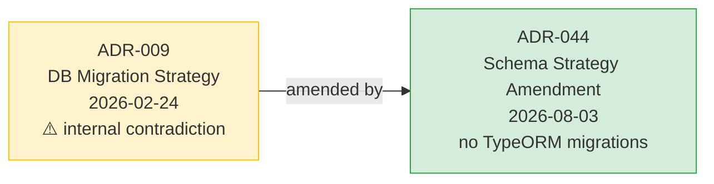

<!-- File: specs/06-Decision-Records/ADR-044-database-schema-strategy-amendment.md -->
<!-- Change Log
- 2026-08-03: Created ADR-044 amending ADR-009 — formalize "no TypeORM migrations, edit schema SQL directly" as the current decision.
  - Resolves internal contradiction in ADR-009 (Decision Outcome "TypeORM Migrations" vs Required Changes "migrations disabled").
  - Aligns ADR-009 with AGENTS.md, .devin/rules, and engineering practice in effect since v1.8.x.
  - ADR-009 original text preserved as audit trail (immutable history per ADR-REVIEW-PROCESS).
-->

# ADR-044: Database Schema Strategy Amendment — No TypeORM Migrations, Edit Schema SQL Directly

**Status:** Accepted (formalize existing real-world state)
**Date:** 2026-08-03
**Amends:** ADR-009 (Database Migration & Deployment Strategy) — Decision Outcome + Implementation Details §1/§2
**Related Documents:**
- [ADR-009: Database Migration & Deployment Strategy](./ADR-009-database-migration-strategy.md) (amended — original preserved as audit trail)
- [ADR-004: Database Schema Design Strategy](./ADR-004-database-schema-design-strategy.md)
- [ADR-005: Technology Stack](./ADR-005-technology-stack.md)
- [ADR-043: AI Architecture Current State](./ADR-043-ai-architecture-current-state.md)
- [Engineering Guidelines 05-02 Backend](../05-Engineering-Guidelines/05-02-backend-guidelines.md)
- [AGENTS.md](../../AGENTS.md) — "no TypeORM migrations — edit schema SQL directly (ADR-009)"

---

## 🎯 Gap Analysis & Purpose

### ปิด Gap จาก ADR-009 internal contradiction

ADR-009 (2026-02-24) มี **contradiction ภายในไฟล์** ที่ไม่เคยได้รับการแก้ไขอย่างเป็นทางการ:

| ส่วนใน ADR-009 | ข้อความ | ความขัดแย้ง |
|---|---|---|
| **Decision Outcome** §163 | "Chosen Option: Option 3 — TypeORM Migrations + Blue-Green Deployment Strategy" | ✅ สนับสนุน TypeORM Migrations |
| **Conflict Resolution** §27 | "Resolution: Chose TypeORM Migrations for production safety" | ✅ สนับสนุน TypeORM Migrations |
| **Implementation §1** §189-191 | `migrations: ['dist/migrations/*.js']`, `migrationsTableName: 'migrations'`, `synchronize: false` | ✅ สนับสนุน TypeORM Migrations |
| **Required Changes §50** | "Configure TypeORM with migrations disabled" | ❌ ขัดกับส่วนอื่น — สนับสนุน no migrations |

### สถานะจริงในปัจจุบัน (real-world state)

การปฏิบัติจริงตั้งแต่ v1.8.x เป็นต้นมา คือ **"no TypeORM migrations — edit schema SQL directly"** ตามที่ระบุใน:
- `AGENTS.md` (Forbidden Actions): "TypeORM migration files → Edit schema SQL directly (ADR-009)"
- `.devin/rules/02-security.md`, `.devin/rules/03-typescript.md`
- `.agents/rules/05-forbidden-actions.md`
- `specs/05-Engineering-Guidelines/05-02-backend-guidelines.md`
- `specs/03-Data-and-Storage/deltas/` (incremental SQL delta files per ADR-009)
- Skill `schema-change` และ `nestjs-best-practices`

แต่ ADR-009 เองยังไม่ได้รับการ amend อย่างเป็นทางการ ทำให้เกิด drift ระหว่าง "สถาปัตยกรรมบนกระดาษ" กับ "การปฏิบัติจริง"

### วัตถุประสงค์

1. **ปิด drift อย่างเป็นทางการ** — ประกาศว่า "no TypeORM migrations, edit schema SQL directly" คือ decision ปัจจุบัน
2. **รักษา ADR-009 เดิม** เป็น audit trail (ไม่แก้เนื้อหา ตาม ADR-REVIEW-PROCESS)
3. **จัดการ schema evolution ผ่าน SQL delta files** ใน `specs/03-Data-and-Storage/deltas/` ตามที่ปฏิบัติอยู่แล้ว

---

## Context and Problem Statement

### Schema Evolution ใน LCBP3-DMS

โครงการ LCBP3-DMS ใช้ MariaDB 11.8 และ TypeORM เป็น ORM แต่ไม่ได้ใช้ TypeORM migration feature สำหรับจัดการ schema changes แต่ใช้วิธี:

1. **Canonical schema SQL** ใน `specs/03-Data-and-Storage/lcbp3-v1.9.0-schema-{01-drop,02-tables,03-views-indexes}.sql`
2. **Incremental delta SQL** ใน `specs/03-Data-and-Storage/deltas/` สำหรับการเปลี่ยนแปลงระหว่างเวอร์ชัน (ตาม ADR-009 version matrix)
3. **Seed data SQL** แยกต่างหาก (`lcbp3-v1.9.0-seed-*.sql`)
4. **DBA ทำการเปลี่ยนแปลงด้วยมือ** ผ่าน SQL script ที่ review แล้ว (ไม่ auto-run ใน CI/CD)

### ทำไมจึงเลือกวิธีนี้

1. **Predictability** — DBA รู้ตรงๆ ว่า SQL อะไรที่รัน ไม่มี auto-generated migration ที่อ่านยาก
2. **Review-friendly** — SQL diff อ่านง่ายกว่า TypeORM migration code สำหรับผู้ review ที่ไม่ใช่ backend dev
3. **No drift risk** — ไม่มี migration table ที่อาจไม่ตรงกับ schema จริง
4. **MariaDB features** — ใช้ MariaDB-specific features (JSON, fulltext, generated columns) ที่ TypeORM migration generator อาจไม่รองรับ
5. **Audit trail** — SQL files ใน Git เป็น audit trail โดยตรง (commit hash + blame)

---

## Decision Drivers

- **Data Integrity** — schema changes ต้อง predictable และ review-able
- **DBA Autonomy** — DBA ทำการเปลี่ยนแปลงโดยตรง ไม่ต้องรอ backend dev generate migration
- **Simplicity** — ไม่มี migration framework ซ้อน ลด tooling complexity
- **Audit Trail** — Git history ของ SQL files เป็น audit trail โดยธรรมชาติ
- **Consistency with Practice** — formalize สถานะจริงที่ใช้อยู่แล้วตั้งแต่ v1.8.x

---

## 🔍 Decision Graph



---

## Decision Outcome

**Chosen Option:** No TypeORM Migrations — Edit Schema SQL Directly via Delta Files

### Decision (formalized)

1. **❌ No TypeORM migration files** — ห้ามสร้างไฟล์ใน `backend/src/migrations/` หรือใช้ `typeorm migration:generate`
2. **✅ Edit schema SQL directly** — เปลี่ยนแปลง schema ผ่าน:
   - Canonical schema SQL: `specs/03-Data-and-Storage/lcbp3-v1.9.0-schema-{01,02,03}.sql` (regenerated เมื่อ major version)
   - Delta SQL: `specs/03-Data-and-Storage/deltas/{version}-delta-{description}.sql` (รายการเปลี่ยนแปลงระหว่างเวอร์ชัน)
3. **✅ TypeORM config: `migrations: []`, `synchronize: false`** — TypeORM ใช้เป็น ORM เท่านั้น ไม่ใช้ migration feature
4. **✅ DBA review + manual execution** — SQL delta ผ่าน review โดย DBA และรันด้วยมือ (ไม่ auto-run ใน CI/CD)
5. **✅ Pre-deployment backup** — สำรองข้อมูลก่อนทุก schema change
6. **✅ Blue-Green deployment** — ใช้ต่อไปสำหรับ breaking changes (เป็น orthogonal concern ไม่ขัดกับ no-migration decision)

### Rationale

1. **Aligns with real-world practice** — เป็นวิธีที่ใช้อยู่จริงตั้งแต่ v1.8.x และได้ผลดี
2. **Reduces tooling complexity** — ไม่ต้อง maintain migration framework คู่กับ SQL files
3. **Better review experience** — SQL diff อ่านง่าย ตรวจสอบง่าย โดยเฉพาะ MariaDB-specific features
4. **No drift risk** — ไม่มี migration table ที่อาจไม่ตรง reality
5. **DBA-friendly** — DBA ทำงานกับ SQL โดยตรง ไม่ต้องเรียน TypeORM migration API

---

## 🔍 Impact Analysis

### Affected Components

| Component | Level | Impact | Required Action |
|---|---|---|---|
| **ADR-009** | 🟢 None | Original text preserved as audit trail | ไม่แก้ ADR-009 — เพิ่ม cross-link ไป ADR-044 |
| **Backend code** | 🟢 None | TypeORM ใช้เป็น ORM เท่านั้น (เป็นเช่นนี้อยู่แล้ว) | ไม่ต้องแก้ code — config `migrations: []` อยู่แล้ว |
| **CI/CD pipeline** | 🟢 None | ไม่มี migration step อยู่แล้ว | ไม่ต้องแก้ |
| **Documentation** | 🟡 Low | อัปเดต ADR-009 README index + AGENTS.md ให้ชี้ไป ADR-044 | เพิ่ม ADR-044 ใน ADR README + cross-link ใน ADR-009 |
| **Skills / Rules** | 🟢 None | ระบุ "no TypeORM migrations (ADR-009)" อยู่แล้ว | อัปเดตเป็น "(ADR-009 → ADR-044)" เพื่อ accuracy |

### Required Changes

- [x] สร้าง ADR-044 (เอกสารนี้)
- [ ] เพิ่ม ADR-044 ใน `06-Decision-Records/README.md` index
- [ ] เพิ่ม cross-link ใน ADR-009 (ไม่แก้เนื้อหา — เพิ่ม note บนสุดว่า "Amended by ADR-044")
- [ ] อัปเดต skills/rules ที่อ้าง "ADR-009" ให้เป็น "ADR-009 → ADR-044" (optional)

---

## 📋 Version Dependency Matrix

| ADR | Version | Dependency Type | Affected Version(s) | Implementation Status | Relationship to ADR-044 |
|-----|---------|-----------------|---------------------|----------------------|-------------------------|
| **ADR-044** | 1.0 | Amendment | v1.9.13+ | ✅ Active | This document |
| **ADR-009** | 1.0 | Amended | v1.8.0+ | ⚠️ Amended by ADR-044 | Decision Outcome superseded by ADR-044 |
| **ADR-004** | 1.0 | Related | v1.8.0+ | ✅ Active | Schema design patterns (Selective Normalization) |
| **ADR-005** | 1.0 | Related | v1.8.0+ | ✅ Active | Tech stack (MariaDB 11.8 + TypeORM) |

### Version Compatibility Rules

- **Minimum Version:** v1.9.13 (ADR-044 มีผลบังคับใช้)
- **Breaking Changes:** ไม่มี (เป็น formalization ของสถานะจริง ไม่ใช่การเปลี่ยนแปลง)
- **Deprecation Timeline:** ADR-009 Decision Outcome (TypeORM Migrations) — deprecated since v1.8.x, formally amended 2026-08-03

---

## Consequences

### Positive

- ✅ ปิด drift อย่างเป็นทางการระหว่าง ADR-009 กับการปฏิบัติจริง
- ✅ Documentation สอดคล้องกับสถานะจริง (no more "บนกระดาษ vs ในทางปฏิบัติ")
- ✅ DBA และ developer ใหม่ อ่าน ADR-044 เข้าใจได้ทันทีว่า schema evolution ทำอย่างไร
- ✅ Schema delta files เป็น audit trail โดยธรรมชาติ (Git history)

### Negative

- ❌ ไม่มี automated rollback mechanism (DBA ต้องเตรียม rollback SQL เอง)
- ❌ Migration testing ต้องทำด้วยมือ (ไม่มี migration test suite อัตโนมัติ)
- ❌ การเปลี่ยนแปลง schema ที่ซับซ้อน (เช่น table rename + data migration) ต้องเขียน SQL ยาว ต้องระมัดระวัง

### Neutral

- Blue-Green deployment ยังใช้ต่อไป (orthogonal concern — เกี่ยวกับ deployment strategy ไม่ใช่ schema strategy)

---

## Implementation Details (Current State)

### Schema File Layout

```
specs/03-Data-and-Storage/
├── lcbp3-v1.9.0-schema-01-drop.sql     # DROP statements (regenerated on major version)
├── lcbp3-v1.9.0-schema-02-tables.sql   # CREATE TABLE (canonical source of truth)
├── lcbp3-v1.9.0-schema-03-views-indexes.sql  # Views + Indexes
├── lcbp3-v1.9.0-seed-basic.sql         # Master data
├── lcbp3-v1.9.0-seed-permissions.sql   # CASL Permission Matrix
├── lcbp3-v1.9.0-seed-contractdrawing.sql
├── lcbp3-v1.9.0-seed-shopdrawing.sql
├── lcbp3-v1.9.0-migration.sql          # Migration helper (legacy data import)
└── deltas/                              # Incremental SQL per ADR-009 version matrix
    ├── v1.8.0-to-v1.8.5-delta-*.sql
    ├── v1.8.5-to-v1.9.0-delta-*.sql
    └── v1.9.0-to-v1.9.x-delta-*.sql
```

### TypeORM Configuration (current)

```typescript
// File: backend/src/config/database.config.ts
export default {
  type: 'mariadb',
  host: process.env.DB_HOST,
  // ... connection params
  entities: ['dist/**/*.entity.js'],
  migrations: [],  // ❌ Empty — no TypeORM migrations (ADR-044)
  migrationsTableName: 'migrations',  // Kept for backward compat (table empty)
  synchronize: false, // NEVER true in production
};
```

### Schema Change Workflow

1. **Create delta SQL** — เขียน SQL ใน `deltas/{from-version}-to-{to-version}-delta-{description}.sql`
2. **Update canonical schema** — แก้ `lcbp3-v1.9.0-schema-02-tables.sql` ให้สะท้อนสถานะใหม่
3. **Update Data Dictionary** — แก้ `specs/03-Data-and-Storage/03-01-data-dictionary.md`
4. **DBA review** — review SQL + data dictionary changes
5. **Pre-deployment backup** — `mysqldump` ก่อนรัน
6. **Execute on staging** — รัน delta SQL บน staging environment ก่อน
7. **Execute on production** — รันหลังผ่าน staging verification
8. **Commit + tag** — commit SQL files + tag release version

---

## 🔄 Change Log

| Version | Date | Changes | Updated By |
|---------|------|---------|------------|
| 1.0 | 2026-08-03 | Initial creation — amend ADR-009 to formalize "no TypeORM migrations" decision | Devin |
