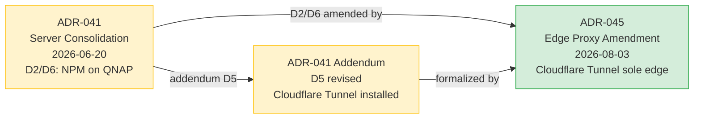

<!-- File: specs/06-Decision-Records/ADR-045-edge-proxy-topology-amendment.md -->
<!-- Change Log
- 2026-08-03: Created ADR-045 amending ADR-041 D2/D6 — formalize Cloudflare Tunnel as the sole edge proxy, with NPM demoted to internal router role.
  - QNAP no longer runs Docker (Container Station decommissioned in real-world operations).
  - ADR-041 Addendum (D5 revised) already documented the Cloudflare Tunnel install but did not formally amend D2/D6.
  - ADR-041 original text preserved as audit trail (immutable history per ADR-REVIEW-PROCESS).
-->

# ADR-045: Edge Proxy Topology Amendment — Cloudflare Tunnel as Sole Edge Proxy, QNAP No Docker

**Status:** Accepted (formalize existing real-world state)
**Date:** 2026-08-03
**Amends:**
- ADR-041 D2 (ASUSTOR as Primary NAS, QNAP as Edge Proxy + Backup)
- ADR-041 D6 (Single Point of Failure Mitigation — NPM on QNAP)
**Related Documents:**
- [ADR-041: Server Consolidation](./ADR-041-server-consolidation.md) (amended — original preserved as audit trail)
- [ADR-015: Deployment & Infrastructure Strategy](./ADR-015-deployment-infrastructure.md)
- [ADR-016: Security & Authentication](./ADR-016-security-authentication.md)
- [04-02 Backup & Recovery](../04-Infrastructure-OPS/04-02-backup-recovery.md) (QNAP = NAS/backup only)
- [04-network-infrastructure-guide](../04-Infrastructure-OPS/04-network-infrastructure-guide.md)
- [np-dms-lcbp3 Stack README](../04-Infrastructure-OPS/04-00-docker-compose/np-dms-lcbp3/README.md)

---

## 🎯 Gap Analysis & Purpose

### ปิด Gap จาก ADR-041 D2/D6 vs real-world state

ADR-041 (2026-06-20) ระบุใน **D2** และ **D6** ว่า:

> **D2:** "QNAP (192.168.10.8, 32GB RAM) คงบทบาท: NPM (Nginx Proxy Manager) — Edge Proxy สำหรับทุก domain (SPOF mitigation, D6); Backup server"
>
> **D6:** "NPM แยกไว้ที่ QNAP — Edge Proxy ไม่อยู่บน New Server → ถ้า New Server ล่ม NPM ยังรับ traffic ได้ (แสดง maintenance page)"

แต่ในปฏิบัติจริง (สถานะ 2026-08-03):

1. **QNAP ไม่รัน Docker อีกต่อไป** — Container Station ถูกปิด/ถอดการใช้งาน ทำให้ NPM ไม่ได้รันบน QNAP
2. **Cloudflare Tunnel ติดตั้งบน `np-dms-lcbp3`** — เป็น edge เดียว (internet-facing) ตามที่ ADR-041 Addendum D5 revised ระบุไว้
3. **NPM ถูก demote** เป็น internal router (ถ้ายังรันอยู่) — ไม่ใช่ edge proxy อีกต่อไป

### สถานะของ Addendum D5 revised

ADR-041 มี Addendum ที่ระบุ D5 revised (Cloudflare Tunnel) แต่:
- ❌ ไม่ได้ประกาศ **Amends: D2/D6** อย่างเป็นทางการ
- ❌ D2/D6 ยังระบุ "NPM on QNAP" อยู่ในเนื้อหาเดิม
- ❌ ไม่ได้ระบุว่า QNAP ไม่รัน Docker อีก (เป็น state change ที่เกิดหลัง ADR-041 publication)

ทำให้เกิด drift ระหว่าง "บนกระดาษ" (D2/D6: NPM on QNAP) กับ "ในทางปฏิบัติ" (Cloudflare Tunnel on np-dms-lcbp3, QNAP no Docker)

### วัตถุประสงค์

1. **ปิด drift อย่างเป็นทางการ** — ประกาศว่า Cloudflare Tunnel บน `np-dms-lcbp3` คือ edge proxy ปัจจุบัน
2. **อัปเดต QNAP role** — QNAP เป็น NAS/backup เท่านั้น ไม่รัน Docker workload ใดๆ
3. **รักษา ADR-041 เดิม** เป็น audit trail (ไม่แก้เนื้อหา D2/D6 ตาม ADR-REVIEW-PROCESS)
4. **จัดการ SPOF concern** — ระบุ SPOF mitigation strategy ใหม่หลัง NPM ไม่อยู่ QNAP

---

## Context and Problem Statement

### Edge Proxy Topology History

| ช่วงเวลา | Edge Proxy | Host | Source |
|---|---|---|---|
| pre-ADR-041 | NPM (Nginx Proxy Manager) | QNAP (Container Station) | ADR-041 D2/D6 |
| post-ADR-041 cutover (2026-07) | NPM | QNAP (ตามแผน) | ADR-041 D2/D6 |
| หลัง migration เสร็จ (2026-07) | Cloudflare Tunnel + NPM (internal router) | `np-dms-lcbp3` | ADR-041 Addendum D5 revised |
| ปัจจุบัน (2026-08-03) | Cloudflare Tunnel (sole edge) | `np-dms-lcbp3` | ADR-045 (เอกสารนี้) — QNAP no Docker |

### ทำไมจึงเปลี่ยน

1. **QNAP Container Station instability** — QNAP ไม่ได้ถูกออกแบบมาสำหรับ production Docker workload ทำให้เกิดปัญหาด้าน stability
2. **Cloudflare Tunnel benefits** — DDoS protection, SSL termination at edge, no inbound port exposure, tunnel auto-reconnect
3. **Simplification** — ลดจำนวน hosts ที่ต้อง maintain Docker runtime
4. **Security** — Cloudflare Tunnel ไม่เปิด inbound port ที่ `np-dms-lcbp3` (tunnel เป็น outbound connection ไป Cloudflare)
5. **QNAP repositioning** — QNAP เหมาะกับบทบาท NAS/backup มากกว่า Docker host

---

## Decision Drivers

- **Real-world state** — QNAP ไม่รัน Docker อีกแล้ว เป็นข้อเท็จจริงที่ต้อง formalize
- **Security** — Cloudflare Tunnel ลด attack surface (no inbound port)
- **Simplification** — ลด host ที่ต้อง maintain Docker runtime
- **DDoS protection** — Cloudflare ให้ DDoS protection โดยธรรมชาติ
- **SPOF re-evaluation** — ต้องจัดการ SPOF concern ใหม่หลัง NPM ไม่อยู่ QNAP

---

## 🔍 Decision Graph



---

## Decision Outcome

**Chosen Option:** Cloudflare Tunnel on `np-dms-lcbp3` as Sole Edge Proxy; QNAP = NAS/Backup Only

### D2 Amended (QNAP Role)

QNAP (192.168.10.8, 32GB RAM) บทบาทปัจจุบัน:

- ❌ **NPM (Nginx Proxy Manager)** — ไม่รัน edge proxy บน QNAP อีกต่อไป (Container Station decommissioned)
- ✅ **NAS** — file storage, backup target (Restic, mysqldump)
- ✅ **Backup server** — เก็บ backup snapshots ที่ pulled โดย ASUSTOR

### D6 Amended (SPOF Mitigation)

SPOF mitigation strategy ใหม่:

| Concern | ADR-041 D6 เดิม | ADR-045 ปัจจุบัน |
|---|---|---|
| Edge proxy SPOF | NPM แยก QNAP → New Server ล่มได้ | Cloudflare รับ traffic แทน + tunnel auto-reconnect (Cloudflare เป็น anycast ไม่ใช่ SPOF) |
| Maintenance page | NPM แสดง maintenance page | Cloudflare Workers หรือ Cloudflare-provided error pages |
| Compute SPOF | New Server เดียว | ยังเป็น compute SPOF (เหมือนเดิม) — แต่ edge แยก Cloudflare แล้ว |

### Current Topology

```
Internet → Cloudflare Edge (anycast, DDoS protection)
              ↓ (Cloudflare Tunnel — outbound from np-dms-lcbp3)
          np-dms-lcbp3 (192.168.10.11)
              ├── cloudflared (tunnel daemon)
              ├── backend  (port 3000, internal)
              ├── frontend (port 3001, internal)
              ├── gitea    (port 3003, internal)
              ├── n8n      (port 5678, internal)
              └── ... (other services, internal)

QNAP (192.168.10.8)    → NAS + backup only (no Docker)
ASUSTOR (192.168.10.9) → Monitoring + Registry + Gitea Runner
```

### Security Implications

- ✅ **No inbound port exposure** ที่ `np-dms-lcbp3` (Cloudflare Tunnel เป็น outbound-only)
- ✅ **DDoS protection** โดย Cloudflare (anycast network)
- ✅ **SSL termination** ที่ Cloudflare edge (certificate auto-renew)
- ⚠️ **Cloudflare account dependency** — หาก Cloudflare account มีปัญหา ระบบเข้าไม่ได้ (mitigate: ใช้ Cloudflare Teams/Enterprise + backup DNS)
- ⚠️ **Tunnel daemon dependency** — `cloudflared` ต้องรันประจำ (mitigate: systemd service + auto-restart)

---

## 🔍 Impact Analysis

### Affected Components

| Component | Level | Impact | Required Action |
|---|---|---|---|
| **ADR-041** | 🟢 None | Original text preserved | เพิ่ม cross-link ไป ADR-045 (ไม่แก้เนื้อหา) |
| **Cloudflare Tunnel config** | 🟢 None | รันอยู่แล้วบน `np-dms-lcbp3` | ไม่ต้องแก้ |
| **QNAP** | 🟢 None | ไม่รัน Docker อยู่แล้ว | ไม่ต้องแก้ (เป็น state change ที่เกิดแล้ว) |
| **NPM** | 🟡 Low | หากยังรันอยู่ ให้ demote เป็น internal router หรือ stop ได้ | ตรวจสอบ NPM ยังจำเป็นหรือไม่ |
| **Documentation** | 🟡 Low | อัปเดต edge topology docs | อัปเดต 04-02 backup, network guide, compose READMEs |
| **Skills / Rules** | 🟢 None | ไม่ได้อ้าง edge proxy โดยตรง | ไม่ต้องแก้ |

### Required Changes

- [x] สร้าง ADR-045 (เอกสารนี้)
- [ ] เพิ่ม ADR-045 ใน `06-Decision-Records/README.md` index
- [ ] เพิ่ม cross-link ใน ADR-041 (ไม่แก้เนื้อหา — เพิ่ม note บนสุดว่า "D2/D6 amended by ADR-045")
- [ ] ย้าย QNAP Docker stack ไป archive (ทำแล้วใน session phase 2.6 — `99-archives/04-00-docker-compose-QNAP/`)
- [ ] อัปเดต 04-02-backup-recovery.md ถ้ามี reference "NPM on QNAP" ที่ต้อง annotate

---

## 📋 Version Dependency Matrix

| ADR | Version | Dependency Type | Affected Version(s) | Implementation Status | Relationship to ADR-045 |
|-----|---------|-----------------|---------------------|----------------------|-------------------------|
| **ADR-045** | 1.0 | Amendment | v1.9.13+ | ✅ Active | This document |
| **ADR-041** | 1.0 | Amended (D2/D6) | v1.9.0+ | ⚠️ D2/D6 amended by ADR-045 | Edge proxy role revised |
| **ADR-015** | 1.0 | Related | v1.8.0+ | ✅ Active | Deployment infrastructure |

### Version Compatibility Rules

- **Minimum Version:** v1.9.13 (ADR-045 มีผลบังคับใช้)
- **Breaking Changes:** ไม่มี (เป็น formalization ของสถานะจริง)
- **Deprecation Timeline:** ADR-041 D2/D6 (NPM on QNAP) — deprecated since Cloudflare Tunnel install (2026-07), formally amended 2026-08-03

---

## Consequences

### Positive

- ✅ ปิด drift อย่างเป็นทางการระหว่าง ADR-041 D2/D6 กับสถานะจริง
- ✅ Documentation สอดคล้องกับ topology จริง (no more "NPM on QNAP" ที่ไม่เป็นจริง)
- ✅ Security benefit — no inbound port exposure ที่ `np-dms-lcbp3`
- ✅ QNAP ลดภาระ Docker runtime เหลือ NAS/backup เท่านั้น
- ✅ Cloudflare DDoS protection + SSL termination โดยธรรมชาติ

### Negative

- ❌ **Cloudflare vendor lock-in** — หากต้องการเปลี่ยน edge provider ต้อง reconfigure DNS + tunnel
- ❌ **Cloudflare account risk** — ปัญหา account (billing, ToS violation) ทำให้ระบบเข้าไม่ได้
- ❌ **Tunnel daemon dependency** — `cloudflared` ต้องรันประจำ (mitigate ด้วย systemd)
- ❌ **SPOF re-evaluation needed** — D6 SPOF mitigation เดิมใช้ไม่ได้ ต้องใช้ Cloudflare anycast แทน

### Neutral

- NPM อาจยังรันบน host อื่นเป็น internal router ได้ (optional — ไม่จำเป็น)

---

## Implementation Details (Current State)

### Cloudflare Tunnel Setup

```
np-dms-lcbp3 (192.168.10.11):
  cloudflared (systemd service: /etc/systemd/system/cloudflared.service)
    ├── tunnel UUID: b2a2ff68-b4da-41b4-8a8c-37ba0b16618e
    ├── credentials: /etc/cloudflared/b2a2ff68-b4da-41b4-8a8c-37ba0b16618e.json
    ├── config: /etc/cloudflared/config.yml
    └── ingress rules (priority order — first match wins):
        # --- SSH / TCP services ---
        ├── ssh.np-dms.work           → ssh://localhost:22
        ├── git-ssh.np-dms.work       → tcp://192.168.10.11:2222
        # --- lcbp3.np-dms.work (path-based routing) ---
        ├── lcbp3.np-dms.work ^/api/auth/sessions → http://192.168.10.11:3000  (backend — session API)
        ├── lcbp3.np-dms.work ^/api/auth          → http://192.168.10.11:3001  (frontend — NextAuth)
        ├── lcbp3.np-dms.work ^/api               → http://192.168.10.11:3000  (backend — API)
        ├── lcbp3.np-dms.work (catch-all)         → http://192.168.10.11:3001  (frontend — Next.js)
        # --- Other services ---
        ├── api.np-dms.work           → http://192.168.10.11:3000  (backend — direct API)
        ├── git.np-dms.work           → http://192.168.10.11:3003  (gitea web)
        ├── pma.np-dms.work           → http://192.168.10.11:81    (phpMyAdmin)
        ├── n8n.np-dms.work           → http://192.168.10.11:5678  (n8n, noTLSVerify: true)
        ├── qnap.np-dms.work          → https://192.168.10.8:8443  (QNAP UI, noTLSVerify: true)
        ├── uptime.np-dms.work        → http://192.168.10.9:3001   (uptime-kuma on ASUSTOR)
        └── (catch-all)               → http_status:404
```

#### Path-based Routing Notes (lcbp3.np-dms.work)

`lcbp3.np-dms.work` ใช้ **path-based routing** เพื่อแยก NextAuth (frontend) จาก backend API บน hostname เดียวกัน:

| Priority | Path Regex | Service | Purpose |
|----------|------------|---------|---------|
| 1 | `^/api/auth/sessions` | backend:3000 | Session management API (admin) |
| 2 | `^/api/auth` | frontend:3001 | NextAuth routes (`/api/auth/session`, `/api/auth/signin`, `/api/auth/callback/*`, `/api/auth/providers`, `/api/auth/csrf`) |
| 3 | `^/api` | backend:3000 | Backend API (ทุก endpoint อื่น) |
| 4 | *(catch-all)* | frontend:3001 | Next.js pages + assets |

> ⚠️ **Rule ordering is critical** — Cloudflare Tunnel หยุดที่ rule แรกที่ match
> `^/api/auth/sessions` ต้องอยู่ก่อน `^/api/auth` ไม่งั้น session API จะถูก NextAuth catch-all จับแทน
> (เพิ่ม 2026-08-18 หลังพบ bug ที่ session API คืน 400 "Bad request." จาก NextAuth)

> 📌 **Config source:** cloudflared ใช้ **remote config จาก Cloudflare Zero Trust dashboard** (ไม่ใช่ local file)
> การแก้ local file `/etc/cloudflared/config.yml` ไม่มีผล — ต้องแก้ใน dashboard แล้ว Cloudflare จะ push config ใหม่อัตโนมัติ
> local file เก็บไว้เป็น documentation/backup reference เท่านั้น

### QNAP Role (post-ADR-045)

```
QNAP TS-473A (192.168.10.8):
  ├── NAS file storage (CIFS shares)
  ├── Backup target (Restic repository + mysqldump archive)
  └── (no Docker — Container Station decommissioned)

ASUSTOR AS5403T (192.168.10.9):
  ├── Monitoring stack (Prometheus, Grafana, Loki, Promtail, uptime-kuma)
  ├── Docker Registry + UI
  ├── Gitea Runner (act_runner)
  └── cAdvisor
```

---

## 🔄 Change Log

| Version | Date | Changes | Updated By |
|---------|------|---------|------------|
| 1.1 | 2026-08-18 | อัปเดต Implementation Details ให้ตรง config จริง — เพิ่ม path-based routing for `lcbp3.np-dms.work`, แก้ tunnel ID เป็น UUID, แก้ service URLs เป็น IP จริง, เพิ่ม ssh/git-ssh/api/qnap/uptime hostnames, แก้ pma port 81, เพิ่มหมายเหตุ remote config + rule ordering | Devin |
| 1.0 | 2026-08-03 | Initial creation — amend ADR-041 D2/D6 to formalize Cloudflare Tunnel as sole edge proxy + QNAP no Docker | Devin |
