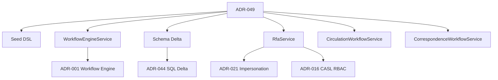

# ADR-049: Workflow Engine State Machine Consolidation & RFA Multi-Party Approval

**Status:** Proposed
**Date:** 2026-08-27
**Decision Makers:** Senior Full Stack Developer (Devin AI), Development Team
**Related Documents:**
- [ADR-001: Unified Workflow Engine](./ADR-001-unified-workflow-engine.md) — แก้ไข/ขยาย (เพิ่ม `statusProjection` block + RFA-specific states)
- [ADR-021: Integrated Workflow Context](./ADR-021-integrated-workflow-context.md) — ขยาย impersonation scope
- [ADR-016: Security and Authentication](./ADR-016-security-authentication.md) — CASL RBAC layering
- [ADR-019: Hybrid Identifier Strategy](./ADR-019-hybrid-identifier-strategy.md) — publicId ใน API
- [ADR-044: Database Schema Strategy Amendment](./ADR-044-database-schema-strategy-amendment.md) — schema delta

---

## 🎯 Gap Analysis & Purpose

### ปิด Gap จากเอกสาร:
- **ADR-001** - Production Rule #2 "Deterministic Execution: ทุก transition MUST declared ใน DSL — ห้าม dynamic transition"
  - เหตุผล: seed DSL ปัจจุบันใช้ string condition (`"context.priority === 'HIGH'"`) ที่ ADR-001 ห้าม และชื่อ state (`IN_REVIEW`) ไม่ตรงกับ `rfa.constants.ts` (`CONSULTANT_REVIEW`, `OWNER_REVIEW`) — เป็น drift ระหว่าง DSL กับ code
- **ADR-021** - Clarification Session 2026-04-12: "Only assigned handler can upload; superadmin and organization admin can upload on behalf (impersonation)"
  - เหตุผล: impersonation ปัจจุบันจำกัดเฉพาะ upload step-specific attachments ไม่ครอบคลุม "action แทน" (approve/reject/consent แทน) ทำให้ flow ติดถ้าฝ่ายที่มีสิทธิ์ลาพัก
- **CONTEXT.md** - "Workflow Instance governs exactly one Correspondence; its current state is projected into entity columns but `workflow_instances` is the source of truth"
  - เหตุผล: projection ปัจจุบันกระจายอยู่ใน `statusMap` dict 4 ชุดในแต่ละ module service ไม่ใช่ใน DSL ทำให้เกิด drift และไม่ test ได้ในฐานะ data

### แก้ไขความขัดแย้ง:
- **seed DSL** vs **`rfa.constants.ts`**: ชื่อ state ไม่ตรงกัน (`IN_REVIEW` vs `CONSULTANT_REVIEW`/`OWNER_REVIEW`)
  - การตัดสินใจนี้ช่วยแก้ไขโดย: สร้าง Canonical Workflow State กลาง + RFA-specific states ที่ชัดเจน พร้อม `statusProjection` ใน DSL
- **`rfa_approve_codes` table** vs **business intent**: table ผสม 2 concept (action vocabulary + consent reason) ในตารางเดียว
  - การตัดสินใจนี้ช่วยแก้ไขโดย: แยกเป็น `rfa_approve_codes` (action → state) + `rfa_consent_reasons` (metadata ของ CONSULTANT)
- **RBAC 3 ที่** (DSL `require.role` vs CASL guard vs context `roles`): ไม่ coordinate กัน
  - การตัดสินใจนี้ช่วยแก้ไขโดย: CASL = coarse gate, DSL `require.role` = fine-grained state-aware — defense in depth

---

## Context and Problem Statement

ระบบ LCBP3-DMS มี Workflow Engine กลาง (ADR-001) ที่ตั้งใจให้เป็น authority เดียวของการเปลี่ยน state แต่ในทางปฏิบัติ state/approval logic กระจายอยู่ **7 จุด**:

1. **`WorkflowEngineService`** — แกนกลาง (Redlock + pessimistic lock + version CAS + DSL eval + history + attachments + events + metrics) ✅ แก่นแน่น
2. **`statusMap` dict 4 ชุด** ใน `RfaService.syncRevisionStatus`, `RfaWorkflowService.syncStatus` (dead code), `CirculationWorkflowService.syncStatus`, `CorrespondenceWorkflowService.syncStatus` — map state → status code ต่างกัน
3. **seed DSL** — ใช้ string condition ที่ห้าม + ชื่อ state ไม่ตรง constants
4. **`RfaWorkflowService`** — เลเยอร์ RFA workflow ที่สอง ไม่ได้ต่อ controller มี `statusMap` ของตัวเอง
5. **`processAction()` legacy** ใน `WorkflowEngineService` เอง (`@deprecated` linear sequence)
6. **Approve codes** — ส่งทางข้างใน `syncRevisionStatus` เฉพาะตอน terminal ไม่มี validation
7. **RBAC** — กระจาย 3 ที่ ไม่ coordinate

นอกจากนี้ RFA เป็น multi-party sequential approval (CONSULTANT → DESIGNER → OWNER) ที่แต่ละฝ่ายมี action vocabulary เป็นของตัวเอง แต่ state machine ปัจจุบันมีแค่ `DRAFT → IN_REVIEW → APPROVED/REJECTED` ไม่ capture ระยะ review ของแต่ละฝ่าย

---

## Decision Drivers

- **Single Source of Truth** — DSL เป็น authority เดียวของทั้ง state และ status projection (ADR-001)
- **Deterministic Execution** — ทุก transition MUST declared ใน DSL ห้าม dynamic (ADR-001 Production Rule #2)
- **Testability** — state machine test ได้ในฐานะ data ไม่ใช่ code กระจาย
- **Business Accuracy** — RFA flow ต้อง capture ระยะ review ของแต่ละฝ่าย + approve code scheme ที่ map ไป state โดยตรง
- **Defense in Depth** — CASL + DSL `require.role` ทำงานร่วมกัน (ADR-016 + ADR-001)
- **Audit Trail** — impersonation ต้องบันทึกทุกครั้ง (ADR-021 ขยาย)

---

## Considered Options

### Option 1: DSL owns status projection + RFA-specific states + approve code as transition action

**แนวทาง:**
- แต่ละ state ใน DSL ประกาศ `statusProjection: { rfa: 'FRE', correspondence: 'SUBOWN' }` — Engine เขียน projected status ลง entity column ตอน transition
- RFA ใช้ state เฉพาะระยะ (`CONSULTANT_REVIEW`, `DESIGNER_REVIEW`, `OWNER_APPROVAL`) เป็นข้อยกเว้นจาก Canonical Workflow State เพราะเป็น multi-party approval
- Approve code (`1`/`2`/`3`/`4`) เป็น transition action ใน DSL ไม่ใช่ payload metadata
- CASL = coarse gate, DSL `require.role` = fine-grained state-aware
- Impersonation: admin ทำแทนได้ทุก action + audit log `impersonated: true` + `on_behalf_of`
- Revision ใหม่ = workflow instance ใหม่

**Pros:**
- ✅ DSL เป็น source of truth เดียวของทั้ง state และ status — versioned, admin-editable, test ได้
- ✅ ฆ่า drift ระหว่าง seed DSL กับ constants
- ✅ RFA flow capture ระยะ review ของแต่ละฝ่าย
- ✅ Approve code validation อยู่ใน DSL (legal สำหรับ state/action นั้น)
- ✅ Defense in depth (CASL + DSL)
- ✅ Audit trail ครบสำหรับ impersonation

**Cons:**
- ❌ DSL ยาวขึ้น (มี `statusProjection` block ต่อ state)
- ❌ เพิ่ม code ใน master data ต้องแก้ DSL ด้วย (แต่ถูกต้องเพราะ state machine เปลี่ยน)
- ❌ RFA มี state 2 มาตรฐานในระบบ (generic + RFA-specific) — แต่เป็นข้อยกเว้นที่จำเป็น

### Option 2: Shared WorkflowStatusProjector service + generic states + approve code as payload

**แนวทาง:**
- `WorkflowStatusProjector` กลาง service เดียวรับ transition result แล้ว map state → module status
- ใช้ generic states สำหรับทุก module (`UNDER_REVIEW` สำหรับ RFA ทั้ง 3 ระยะ)
- Approve code เป็น payload metadata ไม่กำหนด state

**Pros:**
- ✅ สอดคล้อง Q2 (generic states)
- ✅ Approve code อยู่ใน master data ได้

**Cons:**
- ❌ Projector เป็นที่ที่สองให้ drift (ขัด ADR-001 single source of truth)
- ❌ Generic state สูญเสียข้อมูลระยะของ RFA — engine ไม่รู้ว่าอยู่ระยะไหน
- ❌ ใช้ `context.currentPhase` workaround ผิดกฎ "deterministic from state alone" (ADR-001 Production Rule #2)
- ❌ Approve code เป็น metadata ไม่ capture ว่า `1` vs `2` ควรไป state ต่างกัน

### Option 3: Hybrid — DSL owns projection + generic states with context phase + approve code as payload

**แนวทาง:**
- DSL owns `statusProjection` (เหมือน Option 1)
- แต่ใช้ generic states + `context.currentPhase` สำหรับ RFA (เหมือน Option 2)
- Approve code เป็น payload + DSL condition เช็ค code เพื่อเลือก target state

**Pros:**
- ✅ DSL owns projection
- ✅ Generic states สอดคล้อง Q2

**Cons:**
- ❌ `context.currentPhase` ผิดกฎ deterministic from state alone
- ❌ DSL condition ซับซ้อน (ต้องใช้ JSON Logic ไม่ใช่ string eval)
- ❌ 2 ที่กำหนด state (action + code) — drift risk

---

## Decision Outcome

**Chosen Option:** Option 1 — DSL owns status projection + RFA-specific states + approve code as transition action

### Rationale

1. **Single Source of Truth** — ADR-001 ประกาศไว้แล้วว่า DSL เป็น authority การย้าย projection เข้า DSL ทำให้ state→status mapping เป็น versioned, admin-editable, test ได้ในฐานะ data
2. **Deterministic from State Alone** — RFA-specific states (`CONSULTANT_REVIEW`, `DESIGNER_REVIEW`, `OWNER_APPROVAL`) ทำให้ engine รู้ action ที่ใช้ได้จาก state อย่างเดียว ไม่ต้องอ่าน context phase (สอดคล้อง ADR-001 Production Rule #2)
3. **Business Accuracy** — RFA เป็น multi-party approval จริง ๆ การบังคับใช้ generic state สูญเสียข้อมูลระยะที่สำคัญ
4. **Approve Code = Action** — คุณกำหนดว่า code กำหนด state (`1` → APPROVED, `2` → APPROVED_WITH_COMMENTS) ดังนั้น code ต้องอยู่ใน DSL ในฐานะ transition action จึงจะเป็น source of truth ที่เดียว
5. **Defense in Depth** — CASL + DSL `require.role` สอดคล้องทั้ง ADR-001 และ ADR-016

---

## 🔍 Impact Analysis

### Affected Components

| Component | Level | Impact Description | Required Action |
|-----------|-------|-------------------|-----------------|
| **Backend — Workflow Engine** | 🔴 High | Engine เขียน `statusProjection` ลง entity column + รองรับ impersonation flag + ลบ `processAction()` legacy | Refactor `WorkflowEngineService` |
| **Backend — RFA Module** | 🔴 High | `submit()`/`processAction()` ส่ง action ใหม่ + จัดการ revision ใหม่ตอน REVISE_REQUIRED + ลบ `RfaWorkflowService` (dead code) | Refactor `RfaService` |
| **Backend — Other Modules** | 🟡 Medium | ลบ `statusMap` dict ใน Circulation/Correspondence workflow service | Remove dict, rely on DSL projection |
| **Database** | 🔴 High | ปรับ `rfa_approve_codes` (4 codes) + สร้าง `rfa_consent_reasons` + เพิ่ม `impersonated` + `on_behalf_of` ใน `workflow_histories` | SQL delta per ADR-044 |
| **Frontend** | 🟡 Medium | ปุ่ม action ใหม่ + impersonation UI + approve code scheme ใหม่ | Update components |
| **Testing** | 🔴 High | Unit test state machine + integration test multi-party flow + e2e | Coverage 80%+ business logic |

### Required Changes

#### 🔴 Critical Changes (ต้องทำทันที)
- [ ] **T1: ปรับ seed DSL** — `backend/src/database/seeds/workflow-definitions.seed.ts`: เขียน `RFA_APPROVAL` DSL ใหม่ตาม state machine + `statusProjection` + `require.role` + แก้ string condition เป็น JSON Logic
- [ ] **T2: ปรับ `WorkflowEngineService`** — `backend/src/modules/workflow-engine/workflow-engine.service.ts`: engine เขียน `statusProjection` ลง entity column + รองรับ `impersonated` + `on_behalf_of` ใน `workflow_histories` + ลบ `processAction()` legacy
- [ ] **T3: ปรับ schema** — `specs/03-Data-and-Storage/deltas/`: ปรับ `rfa_approve_codes` (4 codes) + สร้าง `rfa_consent_reasons` + เพิ่ม column `impersonated` + `on_behalf_of` ใน `workflow_histories`
- [ ] **T4: ปรับ `RfaService`** — `backend/src/modules/rfa/rfa.service.ts`: `submit()`/`processAction()` ส่ง action ใหม่ + จัดการ revision ใหม่ตอน REVISE_REQUIRED

#### 🟡 Important Changes (ควรทำภายใน 2 สัปดาห์)
- [ ] **T5: ลบ `statusMap` dict + dead code** — ลบ dict ใน `CirculationWorkflowService.syncStatus`, `CorrespondenceWorkflowService.syncStatus` + ลบ `RfaWorkflowService` ทั้งไฟล์
- [ ] **T6: ปรับ constants** — `backend/src/modules/rfa/constants/rfa.constants.ts`: อัปเดต `STATE_TO_STATUS_MAP` + approve code constants + เพิ่ม RFA-specific state constants

#### 🟢 Nice-to-Have (ทำถ้ามีเวลา)
- [ ] **T7: Frontend impersonation UI** — ปุ่ม "Action on behalf" + เลือก handler ที่จะแทน + reason field
- [ ] **T8: Admin Console** — หน้าจัดการ `rfa_consent_reasons` + approve code scheme

### Cross-Module Dependencies



---

## 📋 Version Dependency Matrix

| ADR | Version | Dependency Type | Affected Version(s) | Implementation Status |
|-----|---------|-----------------|---------------------|----------------------|
| **ADR-049** | 1.0 | Core | v1.9.10+ | 🔄 Proposed |
| **ADR-001** | 1.0 | Amends | v1.9.10+ | ✅ Active |
| **ADR-021** | 1.9.0 | Amends (impersonation scope) | v1.9.10+ | ✅ Active |
| **ADR-016** | 1.0 | Uses | v1.9.10+ | ✅ Active |
| **ADR-019** | 1.0 | Uses | v1.9.10+ | ✅ Active |
| **ADR-044** | 1.0 | Required By (schema delta) | v1.9.10+ | ✅ Active |

### Version Compatibility Rules

- **Minimum Version:** v1.9.10 (ADR-049 มีผลบังคับใช้)
- **Breaking Changes:** มี (schema changes, API contract changes, approve code scheme change)
- **Deprecation Timeline:** `processAction()` legacy ใน `WorkflowEngineService` — deprecate ทันที, ลบใน v1.10.0

---

## Implementation Details

### Canonical Workflow State (generic — สำหรับ Correspondence/Circulation/Transmittal)

`DRAFT`, `UNDER_REVIEW`, `PENDING_APPROVAL`, `APPROVED`, `APPROVED_WITH_COMMENTS`, `REJECTED`, `REVISE_REQUIRED`, `CANCELLED`, `COMPLETED`

### RFA-Specific States (multi-party approval)

`DRAFT`, `CONSULTANT_REVIEW`, `DESIGNER_REVIEW`, `OWNER_APPROVAL`, `APPROVED`, `APPROVED_WITH_COMMENTS`, `REJECTED`, `REVISE_REQUIRED`

### RFA State Machine

```
DRAFT
  └─ SUBMIT ─→ CONSULTANT_REVIEW
                ├─ CONSENT_FOR_APPROVE ─→ OWNER_APPROVAL
                ├─ ASK_DESIGNER         ─→ DESIGNER_REVIEW
                ├─ RESUBMIT             ─→ REVISE_REQUIRED (terminal)
                └─ REJECT               ─→ REJECTED (terminal)

DESIGNER_REVIEW
  ├─ AGREED / AGREED_WITH_COMMENTS / NO_OBJECTION ─→ CONSULTANT_REVIEW
  └─ OBJECTED ─→ CONSULTANT_REVIEW

OWNER_APPROVAL
  ├─ APPROVE              ─→ APPROVED (terminal)
  ├─ APPROVE_WITH_COMMENTS ─→ APPROVED_WITH_COMMENTS (terminal)
  ├─ RESUBMIT             ─→ CONSULTANT_REVIEW
  └─ REJECT               ─→ REJECTED (terminal)
```

### Approve Code Scheme (ใหม่)

| Code | State | ใครใช้ |
|------|-------|--------|
| `1` | APPROVED | OWNER |
| `2` | APPROVED_WITH_COMMENTS | OWNER |
| `3` | REVISE_REQUIRED | OWNER/CONSULTANT |
| `4` | REJECTED | ใครก็ได้ |

`5N` (No Further Action) ถูกเอาออก — การยกเลิกเอกสารใช้ `cancel()` ของ RfaService

### Consent Reasons (ตารางใหม่ `rfa_consent_reasons`)

เหตุผลประกอบในการอนุมัติของ CONSULTANT ตอน "Consented for approve" — metadata ไม่มีผลต่อ state

### DSL `statusProjection` Block (ตัวอย่าง)

```json
{
  "name": "CONSULTANT_REVIEW",
  "statusProjection": {
    "rfa": "FRE"
  },
  "on": {
    "CONSENT_FOR_APPROVE": {
      "to": "OWNER_APPROVAL",
      "require": { "role": "CONSULTANT" }
    },
    "ASK_DESIGNER": {
      "to": "DESIGNER_REVIEW",
      "require": { "role": "CONSULTANT" }
    }
  }
}
```

### Impersonation in `workflow_histories`

เพิ่ม column:
- `impersonated TINYINT(1) DEFAULT 0`
- `on_behalf_of_user_id INT NULL` (FK → users.id, `@Exclude()` per ADR-019)
- `on_behalf_of_user_uuid VARCHAR(36) NULL` (สำหรับ API response)

### RBAC Layering

| Layer | Check | ที่ไหน |
|-------|-------|-------|
| CASL guard (coarse) | authenticated + project access | Controller |
| DSL `require.role` (fine) | state + action + role | Engine |

### Revision Lifecycle

Revision ใหม่ = workflow instance ใหม่ — instance เดิมจบที่ `REVISE_REQUIRED` (status `COMPLETED`) ดูประวัติรวมผ่าน `rfa_revisions.rfa_id`

### Task Assignment

| Task | Assignee | Profile | ขนาด |
|------|----------|---------|------|
| T1 (seed DSL) | Devin Local | GLM-5.2 High | ใหญ่ |
| T2 (engine refactor) | Devin Local | GLM-5.2 High | ใหญ่ |
| T3 (schema) | Claude Agent | — | เล็ก |
| T4 (RfaService) | Codex | — | กลาง |
| T5 (ลบ dict + dead code) | Codex | — | กลาง |
| T6 (constants) | Codex | — | กลาง |
| T7 (frontend impersonation) | Devin Local | SWE 1.7 Medium | กลาง |
| T8 (admin console) | Devin Local | SWE 1.7 Medium | กลาง |
| Test (unit + integration + e2e) | Devin Local | GLM-5.2 High | ใหญ่ |

### Dependency Order

```
T3 (schema) ─┐
             ├─→ T1 (DSL) ─→ T2 (engine) ─→ T4 (RfaService) + T5 (ลบ dict) + T6 (constants) ─→ Test
             ┘                                                              ↓
                                                                          T7 + T8 (frontend)
```

---

## Consequences

### Positive

1. ✅ DSL เป็น source of truth เดียวของทั้ง state และ status — ฆ่า drift ระหว่าง seed DSL กับ constants
2. ✅ RFA flow capture ระยะ review ของแต่ละฝ่าย — engine รู้ action ที่ใช้ได้จาก state อย่างเดียว
3. ✅ Approve code validation อยู่ใน DSL — legal สำหรับ state/action นั้น
4. ✅ Defense in depth (CASL + DSL `require.role`)
5. ✅ Audit trail ครบสำหรับ impersonation
6. ✅ State machine test ได้ในฐานะ data — ไม่ใช่ code กระจาย
7. ✅ ลบ dead code (`RfaWorkflowService`, `processAction()` legacy, `statusMap` dict 4 ชุด)

### Negative

1. ❌ DSL ยาวขึ้น (มี `statusProjection` block ต่อ state) — Mitigation: block กะทัดรัด
2. ❌ RFA มี state 2 มาตรฐานในระบบ (generic + RFA-specific) — Mitigation: เป็นข้อยกเว้นที่จำเป็น เพราะ RFA เป็น multi-party approval จริง ๆ
3. ❌ เพิ่ม code ใน master data ต้องแก้ DSL ด้วย — Mitigation: ถูกต้องเพราะ state machine เปลี่ยน
4. ❌ Breaking change: approve code scheme เปลี่ยนจาก `1A`/`1C`/... เป็น `1`/`2`/`3`/`4` — Mitigation: migration script + data dictionary update

### Mitigation Strategies

- **DSL verbosity:** `statusProjection` block กะทัดรัด 1 บรรทัดต่อ module
- **2 state standards:** RFA-specific states เป็นข้อยกเว้นที่จำเป็น เอกสารชัดใน ADR + CONTEXT.md
- **Approve code migration:** migration script แปลง code เดิม → code ใหม่ + update data dictionary
- **Impersonation abuse:** audit log ทุกครั้ง + Admin Console แสดงประวัติ impersonation

---

## 🔄 Review Cycle & Maintenance

### Review Schedule
- **Next Review:** 2027-02-27 (6 months from creation)
- **Review Type:** Scheduled (Architecture Decision Review)
- **Reviewers:** System Architect, Development Team Lead, Product Owner

### Review Checklist
- [ ] DSL `statusProjection` ทำงานถูกต้องทุก module
- [ ] RFA state machine รองรับ edge case ทั้งหมด
- [ ] Approve code scheme ใหม่ใช้งานได้จริง
- [ ] Impersonation audit log ครบถ้วน
- [ ] Test coverage 80%+ business logic

### Version History
| Version | Date | Changes | Status |
|---------|------|---------|--------|
| 1.0 | 2026-08-27 | Initial version — consolidate state machine + RFA multi-party approval + approve code scheme + impersonation + revision lifecycle | 🔄 Proposed |

---

## Related ADRs

- [ADR-001: Unified Workflow Engine](./ADR-001-unified-workflow-engine.md) — Amends (เพิ่ม `statusProjection` block + RFA-specific states)
- [ADR-021: Integrated Workflow Context](./ADR-021-integrated-workflow-context.md) — Amends (ขยาย impersonation scope จาก upload เป็น action แทน)
- [ADR-016: Security and Authentication](./ADR-016-security-authentication.md) — Uses (CASL RBAC layering)
- [ADR-019: Hybrid Identifier Strategy](./ADR-019-hybrid-identifier-strategy.md) — Uses (publicId ใน API)
- [ADR-044: Database Schema Strategy Amendment](./ADR-044-database-schema-strategy-amendment.md) — Required By (schema delta)

---

## References

- [Grill session 2026-08-27](../../CONTEXT.md) — บันทึก resolution ทั้งหมดใน CONTEXT.md section "Workflow"
- [RFA Constants](../../backend/src/modules/rfa/constants/rfa.constants.ts) — ต้นทาง state/status mapping (จะถูกอัปเดตตาม ADR-049)
- [Workflow Engine Service](../../backend/src/modules/workflow-engine/workflow-engine.service.ts) — แกนกลางที่จะถูก refactor
