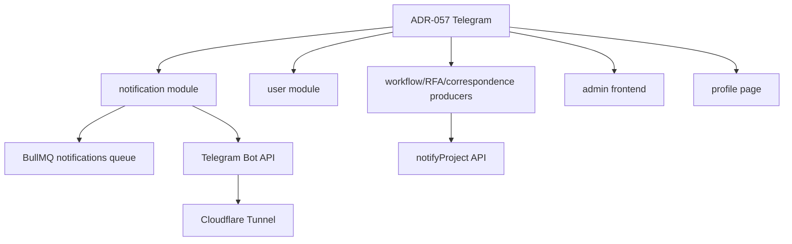

// File: specs/06-Decision-Records/ADR-057-dms-telegram-notification-channel.md
// Change Log:
// - 2026-09-25: Initial creation (Draft) — DMS Telegram Notification Channel (DM binding, per-project group binding, webhook ingress) — ตามที่ ADR-031 ระบุไว้ว่าเป็น future separate ADR/spec

# ADR-057: DMS Telegram Notification Channel

**Status:** Draft (รอทีม review — สร้างจาก grill session 2026-09-25)
**Date:** 2026-09-25
**Decision Makers:** NAP-DMS Architecture Team (รอ sign-off)
**Related Documents:**
- [Feature Spec 258-telegram-notifications](../200-fullstacks/258-telegram-notifications/spec.md) — decisions D1–D11 ตรงกับ ADR นี้
- [ADR-031: Hermes Agent](./ADR-031-hermes-agent-telegram-devops-bridge.md) — locked boundary: DMS Telegram ต้องเป็น implementation แยกจาก Hermes DevOps bot
- [ADR-045: Edge Proxy Topology](./ADR-045-edge-proxy-topology-amendment.md) — Cloudflare Tunnel = sole edge proxy
- [ADR-008: Email/Notification Strategy](./ADR-008-email-notification-strategy.md) — BullMQ only, no inline send
- [ADR-016: Security & Authentication](./ADR-016-security-authentication.md) — CASL, ThrottlerGuard, Idempotency-Key
- [ADR-019: Hybrid Identifier](./ADR-019-hybrid-identifier-strategy.md) — publicId เท่านั้นใน message links
- [ADR-044: DB Schema Strategy](./ADR-044-database-schema-strategy-amendment.md) — แก้ schema SQL ตรง ไม่มี TypeORM migration

---

## 🎯 Gap Analysis & Purpose

### ปิด Gap จากเอกสาร/ระบบปัจจุบัน:

- **ADR-031 locked decision:** "DMS Telegram: Telegram command สำหรับ query/mutate เอกสารจริงเป็น future separate ADR/spec" — ADR นี้คือ spec แยกที่ถูกคาดไว้ ครอบคลุม notification channel (ไม่ใช่ command/query)
- **`users`/`user_preferences` schema:** มี `line_id` + `notify_line` แต่ไม่มี field สำหรับ Telegram — ช่องทางที่ทีมต้องการใช้จริง
- **Profile → Notifications tab:** เป็น mockup (`useState` + toast ปลอม) ไม่ได้ต่อ `GET/PATCH /users/me/preferences` — feature นี้ wire ให้เป็นของจริงทั้งหมด
- **NotificationService ปัจจุบันเป็น per-user เท่านั้น** (`send({userId,...})`) — ไม่มี concept "แจ้งทั้ง project" สำหรับ group post
- **`notifications.notification_type` ENUM** มีแค่ EMAIL/LINE/SYSTEM — ไม่รองรับ TELEGRAM

---

## Context and Problem Statement

LCBP3-DMS ต้องการส่งการแจ้งเตือน (RFA รออนุมัติ, ผลอนุมัติ, เตือน SLA, เอกสารเข้าโครงการ) ไปยัง Telegram เพราะผู้ใช้ภาคสนามอ่าน Telegram เร็วกว่าอีเมลมาก ต้องรองรับ 2 ระดับ: **DM ส่วนตัว** (งานที่ต้องทำ) และ **project group** (ข่าวที่ทีมต้องรู้ร่วมกัน) โดยยึด boundary เดิมของ ADR-031 — แยกจาก Hermes DevOps bot ทุกประการ — และยึดมาตรฐานเดิมของระบบ (BullMQ, CASL, publicId, i18n, audit)

---

## Decision Drivers

- **Platform constraint:** Telegram bot DM หา user ก่อนไม่ได้ — user ต้องกด `/start` เอง → binding flow ต้องออกแบบรอบข้อจำกัดนี้
- **On-prem + Cloudflare Tunnel:** edge เดียวคือ tunnel (ADR-045) — ingress ต้องผ่าน path เดิมหรือไม่มีเลย (polling)
- **Privacy:** group อาจมีคนนอกองค์กรที่ไม่มีสิทธิ์ DMS — เนื้อข้อความต้องไม่รั่ว
- **Project isolation:** group ของ project A ห้ามได้ event ของ project B
- **Auditability:** ทุก send attempt ต้อง audit ได้; bot token/secret ห้ามรั่วใน repo/log/UI
- **Scope discipline:** ฟีเจอร์ใหญ่ต้องแบ่ง increment — configurable matrix เป็นงานอนาคต ไม่ใช่ v1

---

## Considered Options (ต่อประเด็น)

### Ingress (Telegram → DMS)

| Option | ผล | เหตุผลไม่เลือก/เลือก |
|---|---|---|
| **Webhook ผ่าน Cloudflare Tunnel** | ✅ เลือก | tunnel เปิดอยู่แล้ว (ADR-045), real-time, verify secret-token ตาม ADR-031 guidance |
| Long polling `getUpdates` | ❌ | single consumer — scale/restart ต้อง leader election เอง |

### User binding (เอา chat_id)

| Option | ผล | เหตุผล |
|---|---|---|
| **Deep link `t.me/<bot>?start=<token>`** | ✅ เลือก | standard, คลิกเดียวจบ, token single-use+TTL ใน Redis |
| Code กลับทาง (พิมพ์ 6 หลักใน DMS) | ❌ | step เยอะ, พิมพ์ผิดได้ |
| Telegram Login Widget | ❌ | design สำหรับ auth ไม่ใช่ bot binding, ไม่ได้ chat_id ตรง ๆ |

### Group binding (เอา group chat_id — user มองไม่เห็นใน Telegram UI)

| Option | ผล | เหตุผล |
|---|---|---|
| **`/link <code>` ในกลุ่ม** | ✅ เลือก | explicit + proof of intent; bot อ่าน command ได้เสมอ (commands ไม่ติด privacy mode) |
| Auto-detect `my_chat_member` | 🟡 defer | UX ลื่นแต่ไม่มี proof of intent — ทำเป็น discovery เสริมภายหลัง |
| Admin paste chat_id เอง | ❌ | UX แย่, ผิดพลาดง่าย |

### Group routing (event → project group)

| Option | ผล | เหตุผล |
|---|---|---|
| **`notifyProject(projectId, eventType, payload)`** | ✅ เลือก | producer มี project context อยู่แล้ว; explicit, test ง่าย |
| Auto-derive project จาก entity | ❌ | magic, resolve ทุก entity type เอง, debug ยาก |
| Event matrix ใน DB | 🟡 defer | configurable ภายหลัง — v1 fixed catalog |

### Group message content

| Option | ผล | เหตุผล |
|---|---|---|
| **Minimal** (เลขที่ + ประเภท + org + ลิงก์, ไม่มี title) | ✅ เลือก | default ปลอดภัย — คนนอกในกลุ่มเห็นได้แค่ metadata; เปลี่ยนเป็น standard ทีหลังง่าย แต่ข้อมูลที่รั่วถอนไม่ได้ |
| Standard (+ title) | ❌ | title อาจละเอียดอ่อน (ข้อพิพาท/ความปลอดภัย) |
| Per-channel config | 🟡 defer | เพิ่มภายหลังถ้าทีมต้องการ |

### Bot identity

| Option | ผล | เหตุผล |
|---|---|---|
| **Bot ใหม่แยก (`@LCBP3DMSBot`)** | ✅ เลือก | ADR-031 locked: ห้าม share กับ Hermes — token/ingress/permission แยกทั้งหมด |
| Reuse Hermes bot | ❌ | ละเมิด ADR-031 boundary โดยตรง |

---

## Decisions (D1–D11 — ตรงกับ spec)

- **D1 — Ingress:** Webhook `POST /api/v1/notifications/telegram/webhook` ผ่าน Cloudflare Tunnel; verify `X-Telegram-Bot-Api-Secret-Token`; ตอบ 200 ทันที defer งานเข้า queue (ADR-008); handle เฉพาะ `/start <token>` + `my_chat_member`
- **D2 — User binding:** deep link จาก Profile → Notifications; token single-use TTL 15 นาทีใน Redis (`telegram:link:{token}`); เก็บ `telegram_chat_id` (UNIQUE — 1 chat = 1 user), `telegram_username` (display only), `telegram_linked_at`
- **D3 — Group binding:** `/link <code>` โดย admin สร้าง binding intent (เลือก project ล่วงหน้า); unbind/deactivate ผ่าน admin console เท่านั้น ไม่มี `/unlink` ในกลุ่ม
- **D4 — Routing:** `notifyProject(projectId, eventType, payload)` — producer ที่มี context เรียก; service resolve `notification_channels` ที่ active
- **D5 — Event catalog (v1 fixed):**

| Event | DM | Group |
|---|---|---|
| `rfa.pending_approval` | ✅ approver | — |
| `rfa.decision_returned` | ✅ originator | — |
| `sla.deadline_reminder` | ✅ owner | — |
| `transmittal.received` | ✅ doc controller | ✅ project group |
| `correspondence.registered` | — | ✅ project group |
| `correspondence.status_changed` | ✅ stakeholders | ✅ project group (เฉพาะ status สำคัญ) |

- **D6 — Admin user management:** column "Telegram" ใน `/admin/access-control/users` + force-unlink (confirm + audit + system notification แจ้ง user)
- **D7 — Group content:** Minimal — ไม่มี title; DM full detail
- **D8 — Admin nav:** `/admin/notifications/{channels,deliveries,settings}`; ไม่มีหน้าแก้ token บน UI
- **D9 — Preferences:** wire toggles ทั้งหมดเข้า `GET/PATCH /users/me/preferences` จริง
- **D10 — Granularity:** `notify_telegram` master switch เดียว
- **D11 — Defaults:** self-service bind ทุก authenticated user; ข้อความไทย; test-message button; unreachable badge; inactive user skip; deliveries retention 90 วัน; ThrottlerGuard + Idempotency-Key บน link-gen; channel bind ใช้ `notification.manage_all`; bot `@LCBP3DMSBot`
- **D12 — Correction: no DSL effect executor exists (2026-09-25, during task planning):** D1 ของ spec Clarifications เดิม (FR-021) อ้างอิงว่า Workflow DSL มี effect executor ที่ interpret `EffectSchema.type` (`send_email`/`send_line`) แล้วสั่งการจริง — **พบว่าไม่มีอยู่จริง** เป็นแค่ Zod schema validate JSON เท่านั้น การแจ้งเตือนปัจจุบันเป็น hardcoded call ทั้งหมด **แก้ FR-021**: ยกเลิกแนวคิด `send_telegram` DSL effect — ใช้ hardcode call site ตรง (เพิ่ม `.send({type:'TELEGRAM'})` ที่ hook เดิม, สร้าง hook ใหม่สำหรับ `rfa.decision_returned` ที่ไม่มี hook อยู่เดิมเลย) — สร้าง DSL effect executor จริงเกินขอบเขต feature นี้ (เป็นงานของ ADR-001)
- **D13 — Forum Topics support (เพิ่มหลัง plan, 2026-09-25):** ทีมใช้ group ที่เปิด Telegram Forum Topics จริง (group "LCBP3" มี topic "Correspondences") — `notification_channels` เพิ่ม `telegram_topic_id` (nullable, จาก `message_thread_id`); `/link <code>` ที่พิมพ์ในเธรดของ topic จะผูกเฉพาะ topic นั้นโดยอัตโนมัติ (ไม่ต้องมี flow แยก — Telegram ใส่ `message_thread_id` มาในทุก update ที่เกิดในเธรด topic); ส่งข้อความต้องแนบ `message_thread_id` กลับเสมอถ้าค่าไม่ null; unique key ของ channel ต้องรวม `telegram_topic_id` เพื่อให้ผูกหลาย topic ในกลุ่มเดียวกันแยกกันได้ — มี known caveat ว่า MariaDB ยอมให้ unique key ที่มี NULL ซ้ำกันได้หลายแถว ต้องกัน duplicate "ทั้งกลุ่ม" ที่ application layer

---

## 🔍 Impact Analysis

### Affected Components

| Component | Level | Impact Description | Required Action |
|-----------|-------|-------------------|-----------------|
| **Database** | 🔴 High | users +3 cols, user_preferences +1 col, notifications ENUM +TELEGRAM, 2 ตารางใหม่ | แก้ `schema-02-tables.sql` แล้ว — apply SQL delta manual |
| **Backend** | 🔴 High | entities, telegram module (webhook+link+send), notification processor +TELEGRAM, notifyProject, deliveries writer | implement ตาม spec |
| **Frontend** | 🟡 Medium | profile notifications tab (wire จริง), admin users column+action, `/admin/notifications/*` 3 หน้า | implement ตาม spec |
| **Infrastructure** | 🟡 Medium | tunnel route webhook path, bot ผ่าน BotFather, `TELEGRAM_*` settings (seed แล้ว) | ops runbook |
| **Hermes** | 🟢 Low | ไม่แตะ — boundary เดิมคงไว้ | — |

### Required Changes

#### 🔴 Critical
- [ ] Apply SQL delta บน live DB (users cols, user_preferences col, ENUM, `notification_channels`, `notification_deliveries`)
- [ ] Entities: `User` +3 cols, `UserPreference` +`notifyTelegram`, `NotificationType` +`TELEGRAM`, entities ใหม่ 2 ตัว
- [ ] Webhook controller (public + secret verify + dedup `telegram:webhook:dedup:{update_id}`)
- [ ] BullMQ: `notifications` processor เพิ่ม TELEGRAM delivery + limiter (~25 msg/s, ≤20 msg/min/group) + permanent-error detection
- [ ] `notification_deliveries` writer ทุก send attempt

#### 🟡 Important
- [ ] Profile → Notifications tab wire จริงทั้งหมด + binding card (link/unlink/test/unreachable)
- [ ] `/admin/notifications/*` 3 หน้า + admin users column + force-unlink action
- [ ] Producers เรียก `notifyProject` ที่จุด transmittal.received / correspondence.registered / status_changed
- [ ] i18n keys `notification.telegram.*` (th)

#### 🟢 Nice-to-Have
- [ ] QR code สำหรับ deep link
- [ ] Auto-detect unbound groups list
- [ ] `/admin/monitoring` link ไป deliveries

### Cross-Module Dependencies

---

## 📋 Version Dependency Matrix

| ADR | Relationship | Note |
|-----|--------------|------|
| **ADR-031** | Boundary (required) | แยก bot/token/ingress/permission จาก Hermes — locked decision ที่ ADR นี้ fulfill |
| **ADR-045** | Required | Cloudflare Tunnel = เส้นทาง webhook เดียว |
| **ADR-008** | Required | ทุก send ผ่าน BullMQ เท่านั้น |
| **ADR-016** | Required | CASL (`notification.manage_all`, `notification.view`), ThrottlerGuard, Idempotency-Key |
| **ADR-019** | Required | message links + entity_id ใช้ publicId เท่านั้น |
| **ADR-044** | Required | schema แก้ผ่าน SQL delta ไม่มี migration |

**Breaking Changes:** ไม่มี — เป็น additive ทั้งหมด (columns NULL-able, ENUM เพิ่มค่า, ตารางใหม่)

---

## Consequences

### Positive

1. ✅ ผู้ใช้ได้รับงานที่ต้องทำผ่าน Telegram เร็วกว่าอีเมล — ลด turnaround ของ approval
2. ✅ ทีมโครงการเห็นเอกสารเข้า/ออกพร้อมกันในกลุ่มเดียว
3. ✅ Audit ครบทุก send attempt (`notification_deliveries`) — debug ได้เองไม่ต้องถาม user
4. ✅ Profile notifications tab กลายเป็นของจริงทั้งหมด (mockup ถูกขจาย)
5. ✅ Architecture เพิ่ม channel ใหม่ในอนาคตง่าย (`notification_channels.channel_type` รองรับ LINE แล้ว)

### Negative / Risks

1. ❌ ขึ้นกับ external service (Telegram) — tunnel/Telegram ล่ม = channel หาย → **mitigate:** FR-015 degrade เป็น channel อื่น, admin เห็นสถานะ
2. ❌ Group binding มี manual step (`/link`) — admin อาจทำผิด → **mitigate:** โค้ด TTL + คำแนะนำใน UI + bot ตอบยืนยันในกลุ่ม
3. ❌ Webhook เป็น public endpoint เพิ่ม → **mitigate:** secret-token verify + dedup + respond-200-defer + rate limit ที่ tunnel
4. ❌ User block bot = notification หลุดเงียบ → **mitigate:** unreachable detection + badge ใน profile/admin + test button

### Deferred (ไม่ใช่ scope v1 — บันทึกไว้ใน spec)

Event matrix ใน DB, event catalog ขยาย, auto-detect groups, QR link, broadcast channel, interactive commands (`/unlink`, `/status`, approve-in-Telegram — ต้อง design CASL+audit เพิ่ม)

---

## 🔄 Review Cycle & Maintenance

- **Next Review:** 2026-12-25 (3 เดือน — หลัง v1 deploy)
- **Review Type:** Triggered — ถ้ามี deferred item ถูกเลือกทำ หรือ incident ด้าน delivery/privacy
- **Reviewers:** NAP-DMS Architecture Team

### Version History

| Version | Date | Changes | Status |
|---------|------|---------|--------|
| 1.0 | 2026-09-25 | Draft จาก grill session (D1–D11) | 🟡 Draft |
| 1.1 | 2026-09-25 | +D13 Forum Topics support (ops feedback ระหว่าง plan phase — schema แก้ + apply ไปยัง live DB ที่ 192.168.10.11) | 🟡 Draft |
| 1.2 | 2026-09-25 | +D12 Correction: no DSL effect executor exists — FR-021 เปลี่ยนจาก DSL `send_telegram` effect เป็น hardcoded call site (พบระหว่าง task planning) | 🟡 Draft |

---

## Related ADRs

- [ADR-031: Hermes Agent](./ADR-031-hermes-agent-telegram-devops-bridge.md) — boundary parent (DMS Telegram = separate implementation)
- [ADR-008: Email/Notification Strategy](./ADR-008-email-notification-strategy.md) — queue discipline เดียวกัน
- [ADR-016: Security & Authentication](./ADR-016-security-authentication.md) — CASL/RBAC
- [ADR-045: Edge Proxy Topology](./ADR-045-edge-proxy-topology-amendment.md) — webhook ingress path

## References

- [spec.md](../200-fullstacks/258-telegram-notifications/spec.md) — FR-001..FR-020, user stories, edge cases
- [data-model.md](../200-fullstacks/258-telegram-notifications/data-model.md) — schema/Redis/BullMQ/webhook detail
- [contracts/telegram-message-templates.md](../200-fullstacks/258-telegram-notifications/contracts/telegram-message-templates.md) — message templates (minimal group / full DM)
- Telegram Bot API: `sendMessage` (HTML parse mode, ≤4096 chars), `setWebhook` + secret token, `my_chat_member` updates, deep-linking `?start=`
