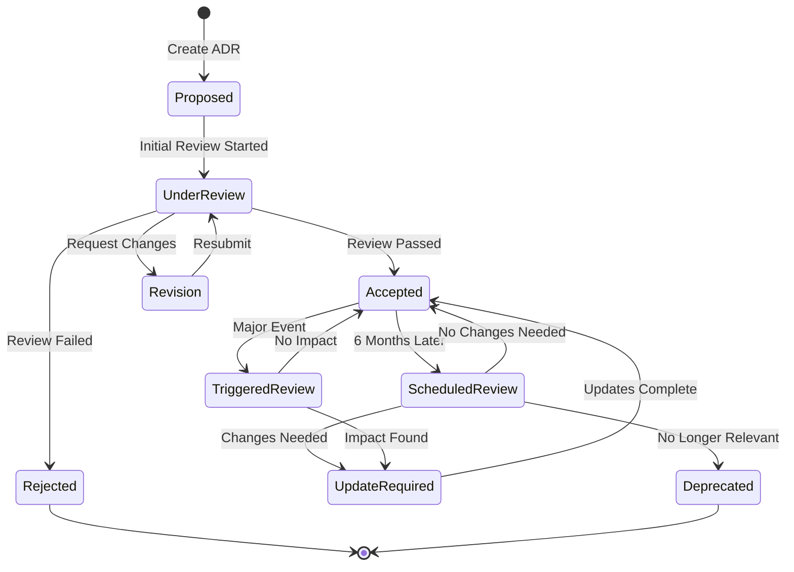

# ADR Review Process & Version Dependency Policy

**Version:** 1.0
**Date:** 2026-04-04
**Owner:** System Architect

---

## 📋 วัตถุประสงค์

เอกสารนี้กำหนดกระบวนการทบทวน ADRs (Architecture Decision Records) และการจัดการ Version Dependencies เพื่อให้มั่นใจว่า:

1. **คุณภาพ ADRs**: การบันทึกการตัดสินใจมีคุณภาพสม่ำเสมอ
2. **Gap Linking**: ทุก ADR เชื่อมโยงกับ Requirements และ Acceptance Criteria
3. **Impact Analysis**: การประเมินผลกระทบเป็นระบบ
4. **Version Management**: การจัดการ Dependencies ระหว่าง ADRs
5. **Review Cycle**: การทบทวน ADRs ที่สำคัญเป็นระยะ

---

## 🔄 ADR Review Process

### Review Types

#### 1. Initial Review (สำหรับ ADR ใหม่)
- **Trigger**: สร้าง ADR ใหม่
- **Timeline**: ภายใน 7 วันทำการ
- **Reviewers**: System Architect + 2 Senior Developers + Product Owner
- **Goal**: ตรวจสอบความสมบูรณ์และความถูกต้อง

#### 2. Scheduled Review (ทบทวนตามกำหนด)
- **Trigger**: ทุก 6 เดือน สำหรับ Core ADRs
- **Timeline**: 1-2 วันทำการ
- **Reviewers**: System Architect + Development Team Lead
- **Goal**: ตรวจสอบความยังคงเป็นปัจจุบัน

#### 3. Triggered Review (ทบทวนตามเหตุการณ์)
- **Trigger**: Major version upgrade, Critical issue, Technology change
- **Timeline**: ภายใน 3 วันทำการ
- **Reviewers**: System Architect + Technical Lead + DevOps
- **Goal**: ประเมินผลกระทบจากการเปลี่ยนแปลง

### Review Checklist

#### ✅ Initial Review Checklist

**Structure & Content:**
- [ ] มี Gap Analysis และเชื่อมโยงกับ Requirements หรือไม่?
- [ ] มี Impact Analysis ครบถ้วนหรือไม่?
- [ ] มี Version Dependency Matrix หรือไม่?
- [ ] Context ชัดเจนและเข้าใจง่ายหรือไม่?
- [ ] มี Options อย่างน้อย 2-3 ทางเลือกพร้อม Pros/Cons หรือไม่?

**Technical Quality:**
- [ ] Decision Rationale มีเหตุผลรองรับที่ดีหรือไม่?
- [ ] Consequences ระบุทั้งดีและไม่ดีอย่างสมจริงหรือไม่?
- [ ] Implementation Details มีรายละเอียดเพียงพอหรือไม่?
- [ ] Cross-Module Dependencies ถูกต้องหรือไม่?

**Compliance:**
- [ ] เป็นไปตาม ADR Template ล่าสุดหรือไม่?
- [ ] Link ไปยัง Related Documents ถูกต้องหรือไม่?
- [ ] ไม่ขัดแย้งกับ ADRs ที่มีอยู่หรือไม่?

#### ✅ Scheduled Review Checklist

**Relevance:**
- [ ] ADR นี้ยังคงเป็น Core Principle หรือไม่?
- [ ] มีการเปลี่ยนแปลง Technology ที่กระทบหรือไม่?
- [ ] มี Alternative ที่ดีกว่าที่เกิดขึ้นหรือไม่?

**Issues & Performance:**
- [ ] มี Issue หรือ Bug ที่เกิดจาก ADR นี้หรือไม่?
- [ ] Performance ยังเป็นไปตามที่คาดหวังหรือไม่?
- [ ] มีปัญหา Maintainability หรือไม่?

**Updates Needed:**
- [ ] ต้องการ Update หรือ Deprecate หรือไม่?
- [ ] ต้องการ Version increment หรือไม่?
- [ ] ต้องการสร้าง ADR ใหม่ที่แทนที่หรือไม่?

### Review Workflow



---

## 📊 Version Dependency Management

### Version Matrix Template

| ADR | Version | Dependency Type | Affected Version(s) | Implementation Status | Review Date |
|-----|---------|-----------------|---------------------|----------------------|-------------|
| **ADR-XXX** | 1.0 | Core | v1.8.0+ | ✅ Implemented | 2026-08-24 |
| **ADR-YYY** | 2.1 | Required By | v1.8.1+ | 🔄 In Progress | 2026-08-24 |
| **ADR-ZZZ** | 1.5 | Conflicts With | v1.7.x | ⚠️ Must Resolve | 2026-08-24 |

### Dependency Types

| Type | Description | Example |
|------|-------------|---------|
| **Core** | ADR พื้นฐานของระบบ | ADR-005 Technology Stack |
| **Required** | ADR ที่จำเป็นต้องมี | ADR-006 Redis for ADR-002 |
| **Used By** | ADR ที่ใช้ ADR อื่น | ADR-002 uses ADR-006 |
| **Conflicts** | ADR ที่ขัดแย้งกัน | Legacy vs New approach |
| **Supersedes** | ADR ที่แทนที่ ADR เก่า | New numbering strategy |

### Version Compatibility Rules

#### Minimum Version Policy
- **Core ADRs**: มีผลบังคับใช้ตั้งแต่ v1.8.0 เป็นต้นไป
- **Feature ADRs**: ระบุ version ที่เริ่มมีผลบังคับใช้
- **Breaking Changes**: ต้อง increment Major version และ Update ทุก ADR ที่เกี่ยวข้อง

#### Breaking Change Classification
- **🔴 Critical**: ต้อง Update ทันที (Security, Data loss risk)
- **🟡 Important**: ควร Update ภายใน 1 เดือน (Performance, Compatibility)
- **🟢 Minor**: สามารถ Update ตาม schedule ได้ (Documentation, Nice-to-have)

#### Deprecation Timeline
- **Announcement**: ประกาศล่วงหน้า 3 เดือน
- **Warning**: Log warning ในระบบ 1 เดือนก่อน deprecate
- **Removal**: ลบหรือ deprecate หลังจาก timeline ครบ

---

## 🎯 Core ADRs Definition

### Core ADRs List (ต้องทบทวนทุก 6 เดือน)

| ADR | Title | Category | Review Priority |
|-----|-------|----------|-----------------|
| **ADR-001** | Unified Workflow Engine | Core Architecture | 🔴 High |
| **ADR-002** | Document Numbering Strategy | Core Business Logic | 🔴 High |
| **ADR-005** | Technology Stack Selection | Foundation | 🔴 High |
| **ADR-006** | Redis Usage & Caching Strategy | Infrastructure | 🔴 High |
| **ADR-016** | Security & Authentication Strategy | Security | 🔴 High |
| **ADR-019** | Hybrid Identifier Strategy | Data Architecture | 🔴 High |

### Feature ADRs (ทบทวนตามความจำเป็น)

- Frontend Architecture ADRs (ADR-011, 012, 013, 014)
- API & Integration ADRs (ADR-008, 010)
- AI & Data Integration ADRs (ADR-017, 018, 020)

---

## 📝 Review Documentation

### Review Meeting Template

**Date:** [Date]
**Attendees:** [Names]
**ADR(s) Reviewed:** [List]

#### Discussion Points
1. **Gap Analysis Validation**: [Notes]
2. **Impact Analysis Review**: [Notes]
3. **Version Dependencies**: [Notes]
4. **Issues Identified**: [List]
5. **Action Items**: [List with owners]

#### Decisions Made
- [ ] ADR-XXX: Approved as is
- [ ] ADR-YYY: Approved with changes
- [ ] ADR-ZZZ: Requires revision
- [ ] ADR-ABC: Deprecated

#### Next Steps
1. [Action item 1] - [Owner] - [Due date]
2. [Action item 2] - [Owner] - [Due date]

### Review Report Template

```markdown
# ADR Review Report - [Date]

## Summary
- Total ADRs Reviewed: [X]
- Approved: [Y]
- Requires Changes: [Z]
- Deprecated: [W]

## Key Findings
1. [Finding 1]
2. [Finding 2]

## Action Items
[List of action items]

## Next Review Date
[Date]
```

---

## 🔧 Tools & Automation

### Automated Checks
- **Template Validation**: ตรวจสอบว่า ADR ใช้ template ล่าสุด
- **Link Validation**: ตรวจสอบลิงก์ภายในเอกสาร
- **Dependency Matrix**: สร้าง automatic dependency graph
- **Version Consistency**: ตรวจสอบ version numbers ใน matrix

### Monitoring & Alerts
- **ADR Age Alert**: ADR ที่ไม่ได้ทบทวน > 6 เดือน
- **Broken Dependencies**: ADR ที่อ้างอิงถึง ADR ที่ deprecated
- **Review Due**: แจ้งเตือนก่อน review date 1 สัปดาห์

---

## 📚 References

- [Enhanced ADR Template](./ADR-TEMPLATE-enhanced.md)
- [ADR Index](./README.md)
- [Version Management Best Practices](../05-Engineering-Guidelines/05-05-git-conventions.md)

---

**Document Version:** 1.0  
**Last Updated:** 2026-04-04  
**Next Review:** 2026-10-04
