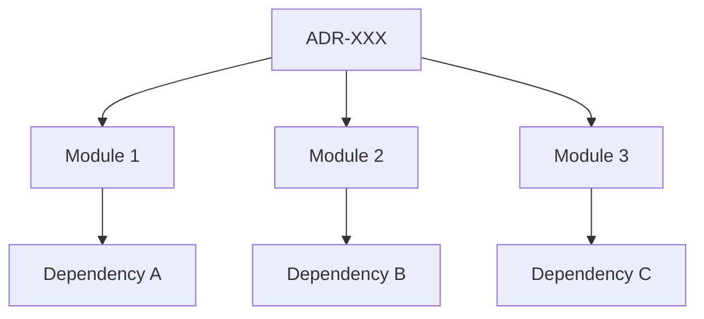

# ADR-XXX: [Title]

**Status:** Proposed
**Date:** YYYY-MM-DD
**Decision Makers:** [Names]
**Related Documents:**
- [Link to relevant specs]

---

## 🎯 Gap Analysis & Purpose

### ปิด Gap จากเอกสาร:
- **[Document Name]** - [Section/Requirement]: [บรรทัดที่เกี่ยวข้อง]
  - เหตุผล: [อธิบายว่า Gap นี้คืออะไร และทำไมต้องแก้ไข]

### แก้ไขความขัดแย้ง:
- **[Document Name]** vs **[Another Document]**: [อธิบายความขัดแย้ง]
  - การตัดสินใจนี้ช่วยแก้ไขโดย: [วิธีการแก้ไข]

---

## Context and Problem Statement

[Describe the problem...]

---

## Decision Drivers

- [Driver 1]
- [Driver 2]

---

## Considered Options

### Option 1: [Name]

**Pros:**

- ✅ [Pro 1]

**Cons:**

- ❌ [Con 1]

---

## Decision Outcome

**Chosen Option:** [Option X]

### Rationale

[Why this option...]

---

## 🔍 Impact Analysis

### Affected Components (ส่วนประกอบที่ได้รับผลกระทบ)

| Component | Level | Impact Description | Required Action |
|-----------|-------|-------------------|-----------------|
| **Backend** | 🔴 High | [รายละเอียดผลกระทบ] | [Action Required] |
| **Frontend** | 🟡 Medium | [รายละเอียดผลกระทบ] | [Action Required] |
| **Database** | 🔴 High | [รายละเอียดผลกระทบ] | [Action Required] |
| **Infrastructure** | 🟢 Low | [รายละเอียดผลกระทบ] | [Action Required] |

### Required Changes (การเปลี่ยนแปลงที่ต้องดำเนินการ)

#### 🔴 Critical Changes (ต้องทำทันที)
- [ ] **[Change 1]** - [File/Module]: [Description]
- [ ] **[Change 2]** - [File/Module]: [Description]

#### 🟡 Important Changes (ควรทำภายใน X วัน)
- [ ] **[Change 3]** - [File/Module]: [Description]
- [ ] **[Change 4]** - [File/Module]: [Description]

#### 🟢 Nice-to-Have (ทำถ้ามีเวลา)
- [ ] **[Change 5]** - [File/Module]: [Description]

### Cross-Module Dependencies

---

## 📋 Version Dependency Matrix

| ADR | Version | Dependency Type | Affected Version(s) | Implementation Status |
|-----|---------|-----------------|---------------------|----------------------|
| **ADR-XXX** | 1.0 | Core | v1.8.0+ | ✅ Implemented |
| **ADR-YYY** | 2.1 | Required By | v1.8.1+ | 🔄 In Progress |
| **ADR-ZZZ** | 1.5 | Conflicts With | v1.7.x | ⚠️ Must Resolve |

### Version Compatibility Rules

- **Minimum Version:** v1.8.0 (ADR มีผลบังคับใช้)
- **Breaking Changes:** ไม่มี (หรือระบุถ้ามี)
- **Deprecation Timeline:** [ระบุถ้ามีการ deprecate]

---

## Implementation Details

[รายละเอียดการ Implement...]

---

## Consequences

### Positive

1. ✅ [Impact 1]

### Negative

1. ❌ [Risk 1]

### Mitigation Strategies

- [Strategy 1]: [Description]

---

## 🔄 Review Cycle & Maintenance

### Review Schedule
- **Next Review:** [Date] (6 months from last review)
- **Review Type:** [Scheduled/Triggered/Major Version]
- **Reviewers:** [Names/Roles]

### Review Checklist
- [ ] ยังคงเป็น Core Principle หรือไม่?
- [ ] มีการเปลี่ยนแปลง Technology ที่กระทบหรือไม่?
- [ ] มี Issue หรือ Bug ที่เกิดจาก ADR นี้หรือไม่?
- [ ] ต้องการ Update หรือ Deprecate หรือไม่?

### Version History
| Version | Date | Changes | Status |
|---------|------|---------|--------|
| 1.0 | YYYY-MM-DD | Initial version | ✅ Active |
| 1.1 | YYYY-MM-DD | [Changes] | ✅ Active |

---

## Related ADRs

- [ADR-XXX: Title](./ADR-XXX.md) - [Relationship]
- [ADR-YYY: Title](./ADR-YYY.md) - [Relationship]

---

## References

- [Reference 1]
- [Reference 2]
