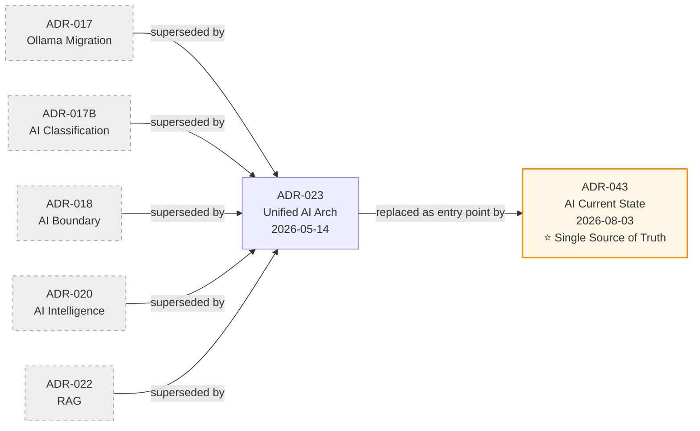

# ADR Archive — Superseded Decision Records

โฟลเดอร์นี้เก็บ Architecture Decision Records (ADRs) ที่ถูก **Superseded** แล้ว คงไว้เพื่อ **ประวัติศาสตร์การตัดสินใจ** ตามกระบวนการ ADR-REVIEW-PROCESS (immutable history)

> ⚠️ **ห้ามอ้างอิงเป็นที่ปัจจุบัน** — สถาปัตยกรรม AI ปัจจุบันรวมอยู่ใน [ADR-043: AI Architecture Current State](.../ADR-043-ai-architecture-current-state.md) (Single Source of Truth)

---

## รายการ ADR ที่ Archived

| ADR | Title | Superseded By | Date Archived |
| :--- | :--- | :--- | :--- |
| [ADR-017](./ADR-017-ollama-data-migration.md) | Ollama Data Migration Architecture | ADR-023 → ADR-043 | 2026-08-03 |
| [ADR-017B](./ADR-017B-ai-document-classification.md) | AI Document Classification | ADR-023 → ADR-043 | 2026-08-03 |
| [ADR-018](./ADR-018-ai-boundary.md) | AI Boundary Policy | ADR-023 → ADR-043 | 2026-08-03 |
| [ADR-020](./ADR-020-ai-intelligence-integration.md) | AI Intelligence Integration Architecture | ADR-023 → ADR-043 | 2026-08-03 |
| [ADR-022](./ADR-022-retrieval-augmented-generation.md) | Retrieval-Augmented Generation (RAG) | ADR-023 → ADR-043 | 2026-08-03 |

---

## เหตุผลในการ Archive

ทั้ง 5 ฉบับมีความทับซ้อนในเชิงสถาปัตยกรรมและข้อกำหนด ถูกยุบรวมครั้งแรกโดย ADR-023 (Unified AI Architecture, 2026-05-14) และต่อมา ADR-043 (AI Architecture Current State, 2026-08-03) ทำหน้าที่เป็น Single Source of Truth ที่รวมสถาปัตยกรรม AI ปัจจุบันทั้งหมด

การย้ายออกจากโฟลเดอร์หลักช่วย:
- ลด noise ใน `06-Decision-Records/` (เหลือเฉพาะ ADR ที่ active หรือมีผลต่อการอ่านปัจจุบัน)
- ป้องกันการอ้างอิง ADR ที่ superseded โดยไม่ได้ตั้งใจ
- คงไว้ซึ่ง audit trail ของการตัดสินใจ (ไม่ลบเนื้อหา)

---

## ความสัมพันธ์กับ ADR ปัจจุบัน

---

## การอ้างอิง

- [ADR-023: Unified AI Architecture](.../ADR-023-unified-ai-architecture.md) — ต้นฉบับที่ทำการ supersede ครั้งแรก
- [ADR-043: AI Architecture Current State](.../ADR-043-ai-architecture-current-state.md) — Single Source of Truth ปัจจุบัน
- [ADR-REVIEW-PROCESS](../ADR-REVIEW-PROCESS.md) — กระบวนการจัดการ ADR และ Version Dependencies
- [README.md](../README.md) — ADR Index หลัก

---

**Last Updated:** 2026-08-03
