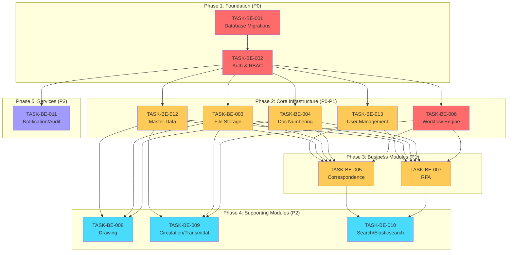

# Development Tasks

**Project:** LCBP3-DMS (Laem Chabang Port Phase 3 - Document Management System)
**Version:** 1.5.1
**Last Updated:** 2025-12-02

---

## 📋 Overview

This directory contains detailed development tasks for both **Backend** and **Frontend** development of LCBP3-DMS.

### Backend Tasks (13 tasks)

Comprehensive backend implementation covering:

- Foundation (Database, Auth)
- Core Services (File Storage, Document Numbering, Workflow Engine)
- Business Modules (Correspondence, RFA, Drawing)
- Supporting Services (Search, Notifications, Master Data)

### Frontend Tasks (5+ tasks)

Complete frontend UI development including:

- Setup & Configuration
- Authentication UI
- Layout & Navigation
- Business Module UIs
- Common Reusable Components

**Total Estimated Timeline:** 24-26 weeks for complete MVP

### Task Status Legend

- 🔴 **Not Started** - ยังไม่เริ่มทำ
- 🟡 **In Progress** - กำลังดำเนินการ
- 🟢 **Completed** - เสร็จสมบูรณ์
- ⏸️ **Blocked** - มีสิ่งที่ Block การทำงาน

### Priority Levels

- **P0 (Critical):** ต้องทำก่อน เป็น Foundation
- **P1 (High):** สำคัญมาก Core Business Logic
- **P2 (Medium):** สำคัญปานกลาง Supporting Features
- **P3 (Low):** ทำทีหลังได้ Enhancements

---

## 🗺️ Task Roadmap



---

## 📊 Task List

### Phase 1: Foundation (2-3 weeks)

| ID                                             | Task                        | Priority | Effort   | Status        | Dependencies |
| ---------------------------------------------- | --------------------------- | -------- | -------- | ------------- | ------------ |
| [BE-001](./TASK-BE-001-database-migrations.md) | Database Setup & Migrations | P0       | 2-3 days | 🔴 Not Started | None         |
| [BE-002](./TASK-BE-002-auth-rbac.md)           | Auth & RBAC Module          | P0       | 5-7 days | 🔴 Not Started | BE-001       |

### Phase 2: Core Infrastructure (3-4 weeks)

| ID                                                | Task                       | Priority | Effort     | Status        | Dependencies   |
| ------------------------------------------------- | -------------------------- | -------- | ---------- | ------------- | -------------- |
| [BE-013](./TASK-BE-013-user-management.md)        | User Management            | P1       | 5-7 days   | 🔴 Not Started | BE-001, BE-002 |
| [BE-012](./TASK-BE-012-master-data-management.md) | Master Data Management     | P1       | 6-8 days   | 🔴 Not Started | BE-001, BE-002 |
| [BE-003](./TASK-BE-003-file-storage.md)           | File Storage (Two-Phase)   | P1       | 4-5 days   | 🔴 Not Started | BE-001, BE-002 |
| [BE-004](./TASK-BE-004-document-numbering.md)     | Document Numbering Service | P1       | 5-6 days   | 🔴 Not Started | BE-001, BE-002 |
| [BE-006](./TASK-BE-006-workflow-engine.md)        | Workflow Engine            | P0       | 10-14 days | 🔴 Not Started | BE-001, BE-002 |

### Phase 3: Business Modules (4-5 weeks)

| ID                                               | Task                  | Priority | Effort    | Status        | Dependencies                       |
| ------------------------------------------------ | --------------------- | -------- | --------- | ------------- | ---------------------------------- |
| [BE-005](./TASK-BE-005-correspondence-module.md) | Correspondence Module | P1       | 7-10 days | 🔴 Not Started | BE-001~004, BE-006, BE-012, BE-013 |
| [BE-007](./TASK-BE-007-rfa-module.md)            | RFA Module            | P1       | 8-12 days | 🔴 Not Started | BE-001~004, BE-006, BE-012, BE-013 |

### Phase 4: Supporting Modules (2-3 weeks)

| ID                                                 | Task                      | Priority | Effort   | Status        | Dependencies               |
| -------------------------------------------------- | ------------------------- | -------- | -------- | ------------- | -------------------------- |
| [BE-008](./TASK-BE-008-drawing-module.md)          | Drawing Module            | P2       | 6-8 days | 🔴 Not Started | BE-001~004, BE-012         |
| [BE-009](./TASK-BE-009-circulation-transmittal.md) | Circulation & Transmittal | P2       | 5-7 days | 🔴 Not Started | BE-001~003, BE-006, BE-012 |
| [BE-010](./TASK-BE-010-search-elasticsearch.md)    | Search & Elasticsearch    | P2       | 4-6 days | 🔴 Not Started | BE-001, BE-005, BE-007     |

### Phase 5: Supporting Services (1 week)

| ID                                            | Task                     | Priority | Effort   | Status        | Dependencies   |
| --------------------------------------------- | ------------------------ | -------- | -------- | ------------- | -------------- |
| [BE-011](./TASK-BE-011-notification-audit.md) | Notification & Audit Log | P3       | 3-5 days | 🔴 Not Started | BE-001, BE-002 |

---

## 🎨 Frontend Tasks

### Phase 1: Foundation (Weeks 1-2)

| Task                                              | Title                             | Priority | Effort   | Dependencies   |
| ------------------------------------------------- | --------------------------------- | -------- | -------- | -------------- |
| [TASK-FE-001](./TASK-FE-001-frontend-setup.md)    | Frontend Setup & Configuration    | P0       | 2-3 days | None           |
| [TASK-FE-002](./TASK-FE-002-auth-ui.md)           | Authentication & Authorization UI | P0       | 3-4 days | FE-001, BE-002 |
| [TASK-FE-003](./TASK-FE-003-layout-navigation.md) | Layout & Navigation System        | P0       | 3-4 days | FE-001, FE-002 |

### Phase 2: Core Components (Week 3)

| Task                                              | Title                           | Priority | Effort   | Dependencies |
| ------------------------------------------------- | ------------------------------- | -------- | -------- | ------------ |
| [TASK-FE-005](./TASK-FE-005-common-components.md) | Common Components & Reusable UI | P1       | 3-4 days | FE-001       |

### Phase 3: Business Modules (Weeks 4-8)

| Task                                              | Title                        | Priority | Effort   | Dependencies           |
| ------------------------------------------------- | ---------------------------- | -------- | -------- | ---------------------- |
| [TASK-FE-004](./TASK-FE-004-correspondence-ui.md) | Correspondence Management UI | P1       | 5-7 days | FE-003, FE-005, BE-005 |
| [TASK-FE-006](./TASK-FE-006-rfa-ui.md)            | RFA Management UI            | P1       | 5-7 days | FE-003, FE-005, BE-007 |
| [TASK-FE-007](./TASK-FE-007-drawing-ui.md)        | Drawing Management UI        | P2       | 4-6 days | FE-003, FE-005, BE-008 |

### Phase 4: Supporting Features (Week 9)

| Task                                                       | Title                        | Priority | Effort   | Dependencies   |
| ---------------------------------------------------------- | ---------------------------- | -------- | -------- | -------------- |
| [TASK-FE-008](./TASK-FE-008-search-ui.md)                  | Search & Global Filters      | P2       | 3-4 days | FE-003, BE-010 |
| [TASK-FE-009](./TASK-FE-009-dashboard-notifications.md)    | Dashboard & Notifications UI | P3       | 3-4 days | FE-003, BE-011 |
| [TASK-FE-013](./TASK-FE-013-circulation-transmittal-ui.md) | Circulation & Transmittal UI | P2       | 5-7 days | FE-005, BE-009 |

### Phase 5: Administration (Weeks 10-11)

| Task                                                | Title                        | Priority | Effort   | Dependencies                   |
| --------------------------------------------------- | ---------------------------- | -------- | -------- | ------------------------------ |
| [TASK-FE-010](./TASK-FE-010-admin-panel.md)         | Admin Panel & Settings UI    | P2       | 5-7 days | FE-002, FE-005, BE-012, BE-013 |
| [TASK-FE-011](./TASK-FE-011-workflow-config-ui.md)  | Workflow Configuration UI    | P2       | 5-7 days | FE-010, BE-006                 |
| [TASK-FE-012](./TASK-FE-012-numbering-config-ui.md) | Document Numbering Config UI | P2       | 3-4 days | FE-010, BE-004                 |
| [TASK-FE-014](./TASK-FE-014-reference-data-ui.md)   | Reference Data & Lookups UI  | P3       | 3-5 days | FE-010, BE-012                 |
| [TASK-FE-015](./TASK-FE-015-security-admin-ui.md)   | Security & System Admin UI   | P2       | 5-7 days | FE-010, BE-002, BE-011         |

---

## 📅 Estimated Timeline

### Sprint Planning (2-week sprints)

#### Sprint 1-2: Foundation (4 weeks)

- Week 1-2: Database Migrations (BE-001)
- Week 2-4: Auth & RBAC (BE-002)
- _Milestone:_ User can login and access protected routes

#### Sprint 3-5: Core Infrastructure (6 weeks)

- Week 5-6: User Management (BE-013) + Master Data (BE-012)
- Week 7-8: File Storage (BE-003) + Document Numbering (BE-004)
- Week 9-10: Workflow Engine (BE-006)
- _Milestone:_ Complete infrastructure ready for business modules

#### Sprint 6-8: Business Modules (6 weeks)

- Week 11-14: Correspondence Module (BE-005)
- Week 15-17: RFA Module (BE-007)
- _Milestone:_ Core business documents managed

#### Sprint 9-10: Supporting Modules (4 weeks)

- Week 18-19: Drawing Module (BE-008)
- Week 20: Circulation & Transmittal (BE-009, FE-013)
- Week 21: Search & Elasticsearch (BE-010)
- _Milestone:_ Complete document ecosystem

#### Sprint 11: Supporting Services (1 week)

- Week 22: Notification & Audit (BE-011)
- _Milestone:_ Full MVP ready

**Total Estimated Time:** ~22 weeks (5.5 months)

---

## 🎯 Task Details

### TASK-BE-001: Database Setup & Migrations

- **Type:** Infrastructure
- **Key Deliverables:**
  - TypeORM configuration
  - 50+ entity classes
  - Migration scripts
  - Seed data
- **Why First:** Foundation for all other modules

### TASK-BE-002: Auth & RBAC

- **Type:** Security & Infrastructure
- **Key Deliverables:**
  - JWT authentication
  - 4-level RBAC with CASL
  - Permission guards
  - Idempotency interceptor
- **Why Critical:** Required for all protected endpoints

### TASK-BE-003: File Storage (Two-Phase)

- **Type:** Core Service
- **Key Deliverables:**
  - Two-phase upload system
  - Virus scanning (ClamAV)
  - File validation
  - Cleanup jobs
- **Related ADR:** [ADR-003](../05-decisions/ADR-003-file-storage-approach.md)

### TASK-BE-004: Document Numbering

- **Type:** Core Service
- **Key Deliverables:**
  - Double-lock mechanism (Redis Redlock + DB Optimistic Lock)
  - Template-based generator (10 token types)
  - Concurrent-safe implementation (100+ concurrent requests)
  - Comprehensive error handling (4 scenarios)
  - Monitoring & alerting (Prometheus + Grafana)
- **Documentation:**
  - 📋 [Requirements](../01-requirements/03.11-document-numbering.md)
  - 📘 [Implementation Guide](../03-implementation/document-numbering.md)
  - 📗 [Operations Guide](../04-operations/document-numbering-operations.md)
- **Related ADR:** [ADR-002](../05-decisions/ADR-002-document-numbering-strategy.md)
- **Task Details:** [TASK-BE-004](./TASK-BE-004-document-numbering.md)

### TASK-BE-006: Workflow Engine

- **Type:** Core Infrastructure
- **Key Deliverables:**
  - DSL parser และ validator
  - DSL parser and validator
  - State machine management
  - Guard and effect executors
  - History tracking
- **Related ADR:** [ADR-001](../05-decisions/ADR-001-unified-workflow-engine.md)

### TASK-BE-005: Correspondence Module

- **Type:** Business Module
- **Key Deliverables:**
  - Master-Revision pattern implementation
  - CRUD operations with workflow
  - Attachment management
  - Search & filter
- **Why Critical:** Core business document type

### TASK-BE-007: RFA Module

- **Type:** Business Module
- **Key Deliverables:**
  - Master-Revision pattern
  - RFA Items management
  - Approval workflow integration
  - Review/Respond actions
- **Why Important:** Critical approval process

### TASK-BE-008: Drawing Module

- **Type:** Supporting Module
- **Key Deliverables:**
  - Contract Drawing management
  - Shop Drawing with revisions
  - Drawing categories and references
  - Version control
- **Why Important:** Technical document management

### TASK-BE-009: Circulation & Transmittal

- **Type:** Supporting Module
- **Key Deliverables:**
  - Circulation sheet with assignees
  - Transmittal with document items
  - PDF generation for transmittal
  - Workflow integration
- **Why Important:** Internal and external document distribution

### TASK-BE-010: Search & Elasticsearch

- **Type:** Performance Enhancement
- **Key Deliverables:**
  - Elasticsearch integration
  - Full-text search across documents
  - Async indexing via queue
  - Advanced filters and aggregations
- **Why Important:** Improved search UX

### TASK-BE-011: Notification & Audit

- **Type:** Supporting Services
- **Key Deliverables:**
  - Email and LINE notifications
  - In-app notifications
  - Audit log recording
  - Audit log export
- **Why Important:** User engagement and compliance

---

## 🔗 Dependencies Graph

```mermaid
BE-001 (Database)
  ├── BE-002 (Auth)
  │   ├── BE-004 (Doc Numbering)
  │   ├── BE-006 (Workflow)
  │   └── BE-011 (Notification/Audit)
  │
  ├── BE-003 (File Storage)
  │   ├── BE-005 (Correspondence)
  │   ├── BE-007 (RFA)
  │   ├── BE-008 (Drawing)
  │   └── BE-009 (Circulation/Transmittal)
  │
  ├── BE-005 (Correspondence)
  │   └── BE-010 (Search)
  │
  └── BE-007 (RFA)
      └── BE-010 (Search)
```

---

## ✅ Definition of Done (DoD)

สำหรับทุก Task ต้องผ่านเกณฑ์ดังนี้:

### Code Quality

- ✅ Code เป็นไปตาม [Backend Guidelines](../03-implementation/backend-guidelines.md)
- ✅ No `any` types (TypeScript Strict Mode)
- ✅ ESLint และ Prettier passed
- ✅ No console.log (use Logger)

### Testing

- ✅ Unit Tests (coverage ≥ 80%)
- ✅ Integration Tests สำหรับ Critical Paths
- ✅ E2E Tests (ถ้ามี)
- ✅ Load Tests สำหรับ Performance-Critical Features

### Documentation

- ✅ API Documentation (Swagger/OpenAPI)
- ✅ Code Comments (JSDoc for public methods)
- ✅ README updated (ถ้าจำเป็น)

### Review

- ✅ Code Review โดยอย่างน้อย 1 คน
- ✅ QA Testing passed
- ✅ No Critical/High bugs

---

## 🚨 Risk Management

### High-Risk Tasks

| Task   | Risk                         | Mitigation                          |
| ------ | ---------------------------- | ----------------------------------- |
| BE-004 | Race conditions in numbering | Comprehensive concurrent testing    |
| BE-006 | Complex DSL parsing          | Extensive validation และ testing    |
| BE-002 | Security vulnerabilities     | Security audit, penetration testing |

### Blockers Tracking

Track potential blockers:

- Redis service availability (for BE-004, BE-002)
- ClamAV service availability (for BE-003)
- External API dependencies (ถ้ามี)

---

## 📚 Related Documentation

### Architecture

- [System Architecture](../02-architecture/system-architecture.md)
- [Data Model](../02-architecture/data-model.md)
- [API Design](../02-architecture/api-design.md)

### Guidelines

- [Backend Guidelines](../03-implementation/backend-guidelines.md)
- [Testing Strategy](../03-implementation/testing-strategy.md)

### Decisions

- [ADR-001: Unified Workflow Engine](../05-decisions/ADR-001-unified-workflow-engine.md)
- [ADR-002: Document Numbering Strategy](../05-decisions/ADR-002-document-numbering-strategy.md)
- [ADR-003: Two-Phase File Storage](../05-decisions/ADR-003-file-storage-approach.md)
- [ADR-004: RBAC Implementation](../05-decisions/ADR-004-rbac-implementation.md)
- [ADR-005: Technology Stack](../05-decisions/ADR-005-technology-stack.md)
- [ADR-006: Redis Caching Strategy](../05-decisions/ADR-006-redis-caching-strategy.md)

---

## 📝 How to Use This Directory

### For Developers

1. **เลือก Task:** เริ่มจาก P0 dependencies ก่อน
2. **อ่าน Task File:** เข้าใจ Objectives และ Acceptance Criteria
3. **ติดตาม Implementation Steps:** Follow code examples
4. **เขียน Tests:** ตามที่ระบุใน Testing section
5. **Update Status:** ให้ทีมทราบความคืบหน้า

### For Project Managers

1. **Track Progress:** ใช้ Task List และ Status
2. **Monitor Dependencies:** ตรวจสอบว่า Blocked หรือไม่
3. **Estimate Timeline:** ใช้ Effort estimates
4. **Review Risks:** ติดตาม High-Risk tasks

---

## 🎬 Getting Started

```bash
# 1. Clone repository
git clone https://git.np-dms.work/lcbp3/backend.git
cd backend

# 2. Install dependencies
npm install

# 3. Setup environment
cp .env.example .env
# Edit .env with your configuration

# 4. Start database (Docker)
docker-compose up -d mariadb redis

# 5. Run migrations
npm run migration:run

# 6. Run seed
npm run seed

# 7. Start development server
npm run start:dev
```

---

## � Future Enhancements (Post-MVP)

The following features are **NOT required for MVP** but may be considered for future phases based on user feedback and business priorities:

### Phase 6: Reports & Analytics (Optional - P3)

**Estimated Effort:** 3-4 weeks

| Feature               | Description                        | Priority | Effort   |
| --------------------- | ---------------------------------- | -------- | -------- |
| Dashboard System      | Real-time charts and metrics       | P3       | 5-7 days |
| Standard Reports      | Document status, workflow progress | P3       | 4-5 days |
| Custom Report Builder | User-defined report templates      | P3       | 6-8 days |
| Export to Excel/PDF   | Report export functionality        | P3       | 3-4 days |
| Data Analytics        | Trend analysis and insights        | P3       | 5-6 days |

**Business Value:**

- Management visibility into project status
- Performance metrics and KPIs
- Compliance reporting

### Phase 7: Advanced Features (Optional - P3)

**Estimated Effort:** 2-3 weeks

| Feature                 | Description                   | Priority | Effort   |
| ----------------------- | ----------------------------- | -------- | -------- |
| Document Templates      | Letter and email templates    | P3       | 3-4 days |
| Advanced Rate Limiting  | Per-user quotas, throttling   | P2       | 2-3 days |
| Structured Logging      | Winston/Pino integration      | P3       | 2-3 days |
| APM Integration         | New Relic, Datadog monitoring | P3       | 3-4 days |
| Email Queue Retry Logic | Failed email retry mechanism  | P2       | 2-3 days |
| Bulk Operations         | Bulk update, bulk approve     | P3       | 4-5 days |

**Business Value:**

- Improved operational efficiency
- Better system observability
- Enhanced user experience

### Phase 8: Mobile & Offline Support (Optional - P2)

**Estimated Effort:** 4-6 weeks

| Feature                    | Description              | Priority | Effort    |
| -------------------------- | ------------------------ | -------- | --------- |
| Mobile App (React Native)  | iOS and Android apps     | P2       | 3-4 weeks |
| Offline-First Architecture | PWA with service workers | P2       | 2-3 weeks |
| Mobile Push Notifications  | Firebase Cloud Messaging | P2       | 1 week    |
| Mobile Document Scanner    | OCR integration          | P3       | 1-2 weeks |

**Business Value:**

- Field access for construction sites
- Work offline, sync later
- Real-time mobile notifications

### Phase 9: Integration & API (Optional - P2)

**Estimated Effort:** 2-3 weeks

| Feature                  | Description                   | Priority | Effort    |
| ------------------------ | ----------------------------- | -------- | --------- |
| REST API Documentation   | OpenAPI 3.0 spec              | P2       | 3-4 days  |
| Webhook System           | External system notifications | P2       | 4-5 days  |
| Third-party Integrations | Email, Calendar, Drive        | P3       | 1-2 weeks |
| GraphQL API              | Alternative to REST           | P3       | 1-2 weeks |
| API Versioning           | v1, v2 support                | P2       | 2-3 days  |

**Business Value:**

- Integration with existing systems
- Extensibility for future needs
- Developer-friendly APIs

### Decision Criteria for Future Enhancements

Add these features when:

- ✅ MVP is stable and in production
- ✅ User feedback indicates need
- ✅ Business case is justified
- ✅ Resources are available
- ✅ Does not compromise core functionality

**Do NOT add these features if:**

- ❌ MVP is not yet complete
- ❌ Core features have bugs
- ❌ Team is understaffed
- ❌ No clear business value

---

## �📧 Contact & Support

- **Backend Team Lead:** [Name]
- **System Architect:** Nattanin Peancharoen
- **Project Channel:** Slack #lcbp3-backend

---

**Version:** 1.5.1
**Last Updated:** 2025-12-02
