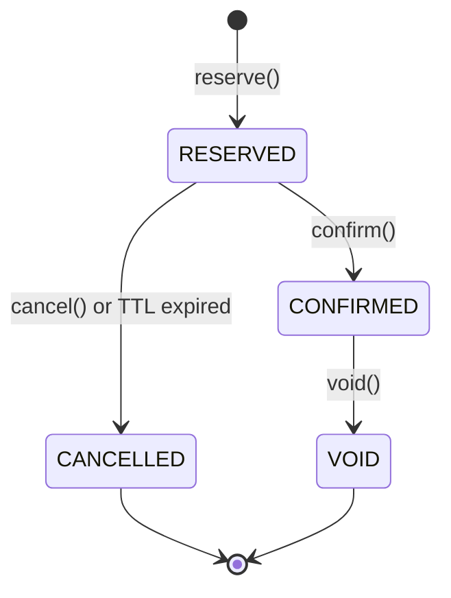

# TASK-BE-017: Document Numbering Backend Refactor

---
status: TODO
priority: HIGH
estimated_effort: 3-5 days
dependencies:
  - specs/01-requirements/03.11-document-numbering.md (v1.6.2)
  - specs/03-implementation/document-numbering.md (v1.6.2)
related_task: TASK-FE-017-document-numbering-refactor.md
---

## Objective

Refactor Document Numbering module ตาม specification v1.6.2 โดยเน้น:
- Number State Machine (RESERVED → CONFIRMED → VOID → CANCELLED)
- Idempotency-Key support
- Counter Key alignment ตาม requirements

---

## Implementation Checklist

### 1. Entity Updates

#### 1.1 DocumentNumberCounter Entity
- [ ] Rename `current_year` → ใช้ `reset_scope` pattern (YEAR_2025, NONE)
- [ ] Ensure FK columns match: `correspondence_type_id`, `originator_organization_id`, `recipient_organization_id`
- [ ] Add `rfa_type_id`, `sub_type_id`, `discipline_id` columns if missing
- [ ] Update Primary Key ให้ตรงกับ requirements spec

```typescript
// Expected Counter Key structure
interface CounterKey {
  projectId: number;
  originatorOrganizationId: number;
  recipientOrganizationId: number; // 0 for RFA
  correspondenceTypeId: number;
  subTypeId: number;         // 0 if not applicable
  rfaTypeId: number;         // 0 if not applicable
  disciplineId: number;      // 0 if not applicable
  resetScope: string;        // 'YEAR_2025', 'NONE'
}
```

#### 1.2 DocumentNumberAudit Entity
- [ ] Add `operation` enum: `RESERVE`, `CONFIRM`, `CANCEL`, `MANUAL_OVERRIDE`, `VOID`, `GENERATE`
- [ ] Ensure `counter_key` is stored as JSON
- [ ] Add `idempotency_key` column

#### 1.3 DocumentNumberReservation Entity (NEW if not exists)
- [ ] Create entity for Two-Phase Commit reservations
- [ ] Fields: `token`, `document_number`, `status`, `expires_at`, `metadata`

---

### 2. Service Updates

#### 2.1 DocumentNumberingService
- [ ] Implement `reserveNumber()` - Phase 1 of Two-Phase Commit
- [ ] Implement `confirmNumber()` - Phase 2 of Two-Phase Commit
- [ ] Implement `cancelNumber()` - Explicit cancel reservation
- [ ] Add Idempotency-Key checking logic
- [ ] Update `generateNextNumber()` to use new CounterKey structure

#### 2.2 Counter Key Builder
- [ ] Create helper to build counter key based on document type:
  - Global (LETTER, MEMO, RFI): `(project, orig, recip, type, 0, 0, 0, YEAR_XXXX)`
  - TRANSMITTAL: `(project, orig, recip, type, subType, 0, 0, YEAR_XXXX)`
  - RFA: `(project, orig, 0, type, 0, rfaType, discipline, NONE)`

#### 2.3 ManualOverrideService
- [ ] Implement `manualOverride()` with validation
- [ ] Auto-update counter if manual number > current

#### 2.4 VoidReplaceService
- [ ] Implement `voidAndReplace()` workflow
- [ ] Link new document to voided document

---

### 3. Controller Updates

#### 3.1 DocumentNumberingController
- [ ] Add `POST /reserve` endpoint
- [ ] Add `POST /confirm` endpoint
- [ ] Add `POST /cancel` endpoint
- [ ] Add `Idempotency-Key` header validation middleware

#### 3.2 DocumentNumberingAdminController
- [ ] Add `POST /manual-override` endpoint
- [ ] Add `POST /void-and-replace` endpoint
- [ ] Add `POST /bulk-import` endpoint
- [ ] Add `GET /metrics` endpoint for monitoring dashboard

---

### 4. Number State Machine



#### 4.1 State Transitions
- [ ] Implement state validation before transitions
- [ ] Log all transitions to audit table
- [ ] TTL 5 minutes for RESERVED state

---

### 5. Testing

#### 5.1 Unit Tests
- [ ] CounterService.incrementCounter()
- [ ] ReservationService.reserve/confirm/cancel()
- [ ] TemplateValidator.validate()
- [ ] CounterKeyBuilder

#### 5.2 Integration Tests
- [ ] Two-Phase Commit flow
- [ ] Idempotency-Key duplicate prevention
- [ ] Redis lock + DB optimistic lock

#### 5.3 Load Tests
- [ ] Concurrent number generation (1000 req/s)
- [ ] Zero duplicates verification

---

## Files to Create/Modify

| Action | Path                                                                                        |
| ------ | ------------------------------------------------------------------------------------------- |
| MODIFY | `backend/src/modules/document-numbering/entities/document-number-counter.entity.ts`         |
| MODIFY | `backend/src/modules/document-numbering/entities/document-number-audit.entity.ts`           |
| CREATE | `backend/src/modules/document-numbering/entities/document-number-reservation.entity.ts`     |
| MODIFY | `backend/src/modules/document-numbering/services/document-numbering.service.ts`             |
| CREATE | `backend/src/modules/document-numbering/services/reservation.service.ts`                    |
| CREATE | `backend/src/modules/document-numbering/services/manual-override.service.ts`                |
| MODIFY | `backend/src/modules/document-numbering/controllers/document-numbering.controller.ts`       |
| MODIFY | `backend/src/modules/document-numbering/controllers/document-numbering-admin.controller.ts` |
| CREATE | `backend/src/modules/document-numbering/guards/idempotency.guard.ts`                        |

---

## Acceptance Criteria

- [ ] All Counter Key ตรงกับ requirements v1.6.2
- [ ] Number State Machine ทำงานถูกต้อง
- [ ] Idempotency-Key ป้องกัน duplicate requests
- [ ] Zero duplicate numbers ใน concurrent load test
- [ ] Audit logs บันทึกทุก operation

---

## References

- [Requirements v1.6.2](file:///d:/nap-dms.lcbp3/specs/01-requirements/03.11-document-numbering.md)
- [Implementation Guide v1.6.2](file:///d:/nap-dms.lcbp3/specs/03-implementation/document-numbering.md)
- [ADR-002](file:///d:/nap-dms.lcbp3/specs/05-decisions/ADR-002-document-numbering-strategy.md)
