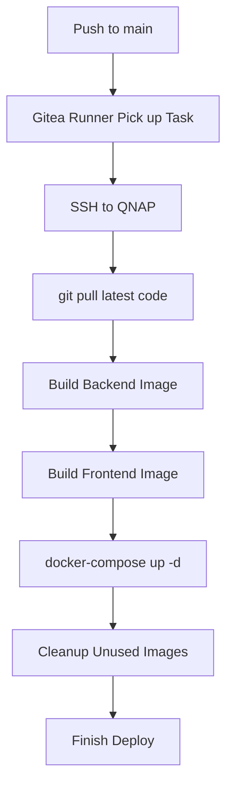

# การ Deploy Application (Backend + Frontend) บน QNAP

> 📍 **Version:** v1.7.0
> 🖥️ **Server:** QNAP TS-473A (Container Station)
> 🔗 **Docker Compose Path:** `/share/np-dms/app/docker-compose.yml`

---

## 📋 Prerequisites

ก่อน deploy ต้องมี services เหล่านี้รันอยู่แล้ว:

| Service        | Container Name | Docker Compose                     | Status |
| :------------- | :------------- | :--------------------------------- | :----- |
| MariaDB        | `mariadb`      | `lcbp3-db` (MariaDB_setting.md)    | ✅      |
| Redis          | `cache`        | `services` (04_Service_setting.md) | ✅      |
| Elasticsearch  | `search`       | `services` (04_Service_setting.md) | ✅      |
| NPM            | `npm`          | `lcbp3-npm` (NPM_setting.md)       | ✅      |
| Docker Network | `lcbp3`        | `docker network create lcbp3`      | ✅      |

---

## 1. Build Docker Images

### Option A: Build บน Dev Machine (Windows) แล้ว Transfer

```powershell
# อยู่ที่ workspace root (nap-dms.lcbp3/)

# Build Backend
docker build -f backend/Dockerfile -t lcbp3-backend:latest .

# Build Frontend (NEXT_PUBLIC_API_URL bake เข้าไปตอน build)
docker build -f frontend/Dockerfile `
  --build-arg NEXT_PUBLIC_API_URL=https://backend.np-dms.work/api `
  -t lcbp3-frontend:latest .

# Export เป็น .tar เพื่อ Transfer
docker save lcbp3-backend:latest -o lcbp3-backend.tar
docker save lcbp3-frontend:latest -o lcbp3-frontend.tar

# Transfer ไปยัง QNAP (ผ่าน SMB Shared Folder)
# Copy lcbp3-backend.tar และ lcbp3-frontend.tar ไปที่ \\192.168.10.8\np-dms\app\
```

### Option B: Build บน QNAP โดยตรง (SSH)

```bash
# SSH เข้า QNAP
ssh admin@192.168.10.8

# Clone หรือ Pull code จาก Gitea
cd /share/np-dms/app/source
git pull origin main

# Build images
docker build -f backend/Dockerfile -t lcbp3-backend:latest .
docker build -f frontend/Dockerfile \
  --build-arg NEXT_PUBLIC_API_URL=https://backend.np-dms.work/api \
  -t lcbp3-frontend:latest .
```

---

## 2. Load Images บน QNAP (เฉพาะ Option A)

```bash
# SSH เข้า QNAP
ssh admin@192.168.10.8

# Load images
docker load < /share/np-dms/app/lcbp3-backend.tar
docker load < /share/np-dms/app/lcbp3-frontend.tar

# ตรวจสอบ
docker images | grep lcbp3
```

---

## 3. สร้าง Directories และกำหนดสิทธิ์

```bash
# สร้าง directories สำหรับ volumes
mkdir -p /share/np-dms/data/uploads/temp
mkdir -p /share/np-dms/data/uploads/permanent
mkdir -p /share/np-dms/data/logs/backend
mkdir -p /share/np-dms/app

# กำหนดสิทธิ์ให้ non-root user ใน container (UID 1001)
chown -R 1001:1001 /share/np-dms/data/uploads
chown -R 1001:1001 /share/np-dms/data/logs/backend
chmod -R 750 /share/np-dms/data/uploads
```

---

## 4. Deploy ผ่าน Container Station

### 4.1 Copy docker-compose.yml

คัดลอกไฟล์ `specs/08-infrastructure/docker-compose-app.yml` ไปยัง QNAP:

```bash
# วางไฟล์ที่ path
/share/np-dms/app/docker-compose.yml
```

### 4.2 สร้าง Application ใน Container Station

1. เปิด **Container Station** บน QNAP Web UI
2. ไปที่ **Applications** → **Create**
3. เลือก **Create Application**
4. ตั้งชื่อ Application: `lcbp3-app`
5. วาง (Paste) เนื้อหาจาก `docker-compose-app.yml`
6. แก้ไข Environment Variables ตามต้องการ (โดยเฉพาะ Secrets)
7. กด **Create** เพื่อ deploy

> ⚠️ **สำคัญ:** ตรวจสอบ environment variables ก่อน deploy:
> - `DB_PASSWORD` — Password ของ MariaDB
> - `REDIS_PASSWORD` — Password ของ Redis
> - `JWT_SECRET` — Secret key สำหรับ JWT Tokens
> - `AUTH_SECRET` — Secret key สำหรับ NextAuth

### 4.3 ตรวจสอบ Container Status

ใน Container Station → Applications → `lcbp3-app`:
- ✅ `backend` — Status: **Running** (healthy)
- ✅ `frontend` — Status: **Running** (healthy)

---

## 5. Verify Deployment

### ตรวจสอบ Health

```bash
# Backend health (จากภายใน Docker network)
docker exec frontend wget -qO- http://backend:3000/health

# Frontend (ผ่าน NPM)
curl -I https://lcbp3.np-dms.work

# Backend API (ผ่าน NPM)
curl -I https://backend.np-dms.work/api
```

### ตรวจสอบ Logs

```bash
# ดู logs ใน Container Station UI
# หรือผ่าน CLI:
docker logs -f backend
docker logs -f frontend
```

---

## 6. Update / Re-deploy

เมื่อต้องการ deploy version ใหม่:

```powershell
# 1. Build images ใหม่ (บน Dev Machine - PowerShell)
docker build -f backend/Dockerfile -t lcbp3-backend:latest .
docker build -f frontend/Dockerfile `
  --build-arg NEXT_PUBLIC_API_URL=https://backend.np-dms.work/api `
  -t lcbp3-frontend:latest .

# 2. Export & Transfer
docker save lcbp3-backend:latest -o lcbp3-backend.tar
docker save lcbp3-frontend:latest -o lcbp3-frontend.tar
# Copy ไปที่ \\192.168.10.8\np-dms\app\ ผ่าน SMB Shared Folder

# 3. Load บน QNAP (SSH)
ssh admin@192.168.10.8
docker load < /share/np-dms/app/lcbp3-backend.tar
docker load < /share/np-dms/app/lcbp3-frontend.tar

# 4. Restart ใน Container Station
#    Applications → lcbp3-app → Restart
```

---

## 7. Automated Deployment via Gitea (CI/CD)

ระบบใช้ **Gitea Actions** เพื่อทำ CI/CD โดยจะทำงานอัตโนมัติเมื่อมีการ `push` เข้าสู่สาขา `main` หรือเรียกใช้งานแบบ `manual`

### 7.1 การตั้งค่า Gitea Secrets
เพื่อให้ Pipeline สามารถเชื่อมต่อกับ QNAP ผ่าน SSH ได้อย่างปลอดภัย ต้องตั้งค่า Secrets ที่ **Gitea Web UI**:
1. เข้าไปที่ Repository: `np-dms/lcbp3`
2. ไปที่ **Settings** → **Actions** → **Secrets**
3. กด **Add New Secret** สำหรับค่าต่อไปนี้:

| Secret Name | Value Example  | Description                              |
| :---------- | :------------- | :--------------------------------------- |
| `HOST`      | `192.168.10.8` | IP ภายในของ QNAP (VLAN 10)               |
| `PORT`      | `22`           | SSH Port ของ QNAP                        |
| `USERNAME`  | `admin`        | User ที่มีสิทธิ์รัน Docker                      |
| `PASSWORD`  | `********`     | รหัสผ่าน SSH (แนะนำให้ใช้ SSH Key แทนในอนาคต) |

### 7.2 โครงสร้าง Pipeline (`deploy.yaml`)
ไฟล์ตั้งค่าอยู่ที่ [`.gitea/workflows/deploy.yaml`](file://../../.gitea/workflows/deploy.yaml) โดยมีขั้นตอนหลักดังนี้:



### 7.3 วิธีการรันแบบ Manual (Manual Trigger)
หากต้องการ Re-deploy โดยไม่ต้องแก้โค้ด:
1. ไปที่แถบเมนู **Actions** (อยู่ข้างๆ Pull Requests ที่เมนูด้านบนสุด **ไม่ใช่ในเมนู Settings**)
2. ทางซ้ายมือจะเห็นรายการ Workflow ให้เลือก **"Build and Deploy"**
3. หากมีไฟล์ `.yaml` ถูกต้อง จะมีปุ่ม **Run workflow** ปรากฏขึ้นมา (สีฟ้า/น้ำเงิน)
4. เลือก Branch `main` -> กด **Run workflow** เพื่อเริ่มทำงาน

### 7.4 ตัวอย่างข้อความแจ้งเตือนและการแก้ไขปัญหา (Troubleshooting)
*   **❌ No matching online runner with label: ubuntu-latest:** 
    *   **สาเหตุ:** แปลว่าในหน้า Settings -> Actions -> Runners **ไม่มี Runner ที่มีสถานะ Online และมีป้ายกำกับ (Label) ว่า `ubuntu-latest`** ครับ
    *   **วิธีแก้ 1:** ไปที่เมนู Settings -> Actions -> Runners กดแก้ไข Runner แล้วเพิ่ม Label `ubuntu-latest` เข้าไป (ถ้ามี Runner อยู่แล้ว)
    *   **วิธีแก้ 2:** แก้ไขไฟล์ `.gitea/workflows/deploy.yaml` ในบรรทัดที่ 11 จาก `runs-on: ubuntu-latest` ให้ตรงกับ **Label** ของ Runner ที่คุณมีจริง (เช่น `self-hosted` หรือชื่อที่คุณตั้งไว้)
*   **📂 Paths:** ตรวจสอบว่า Code อยู่ในพาธที่ถูกต้อง (ปัจจุบันใช้ `/share/np-dms/app/source/lcbp3`)
*   **SSH Timeout:** ตรวจสอบว่า QNAP เปิด SSH Service และ Firewall (ACL) อนุญาตให้เครื่องที่เป็น Runner เชื่อมต่อมายัง Port 22 ได้
*   **Disk Full:** หาก Build ไม่ผ่านบ่อยๆ ให้รัน `docker image prune -a` บน QNAP เพื่อล้าง Image เก่าออก

### 7.5 การตรวจสอบ Gitea Runner (สำคัญมาก ⚠️)
จากรูปที่คุณส่งมา **Runners Management (Total: 0)** หมายความว่ายังไม่มีเครื่องที่จะมารันคำสั่ง Deploy ให้ครับ 
*   **ปัญหา:** แม้จะกด Run workflow ได้ แต่สถานะจะค้างที่ "Waiting" ตลอดไป
*   **วิธีแก้:** ต้องทำการติดตั้งและ Register **Gitea Runner** (หรือ `act_runner`) ตามคู่มือนี้ครับ: [10_gitea_runner.md](10_gitea_runner.md)
*   **ผลลัพธ์:** เมื่อติดตั้งสำเร็จ สถานะในหน้า Settings จะขึ้น **Total: 1** หรือมากกว่า และเป็นสีเขียวครับ

### 7.6 ขั้นตอนการตรวจสอบผลการ Deploy
เมื่อมีการรันแล้ว สามารถดูสถานะได้ที่:
1. คลิกที่รายการในหน้า **Actions** (หน้าหลักของ Actions)
2. จะเห็น Log รายละเอียดแต่ละ Step (Build Backend, Build Frontend, etc.) หากผ่านจะเป็นสีเขียวทั้งหมด

---

## 📦 Resource Summary

| Service      | Image                   | CPU Limit | Memory Limit | Port |
| :----------- | :---------------------- | :-------- | :----------- | :--- |
| **backend**  | `lcbp3-backend:latest`  | 2.0       | 1.5 GB       | 3000 |
| **frontend** | `lcbp3-frontend:latest` | 2.0       | 2 GB         | 3000 |

> 📖 NPM Proxy Hosts ตั้งค่าเรียบร้อยแล้ว:
> - `lcbp3.np-dms.work` → `frontend:3000`
> - `backend.np-dms.work` → `backend:3000`
