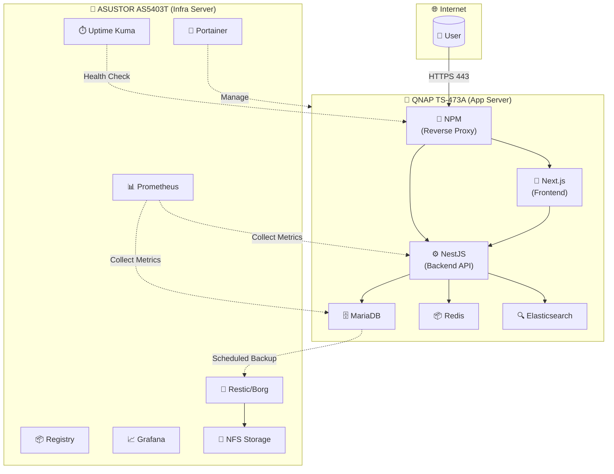
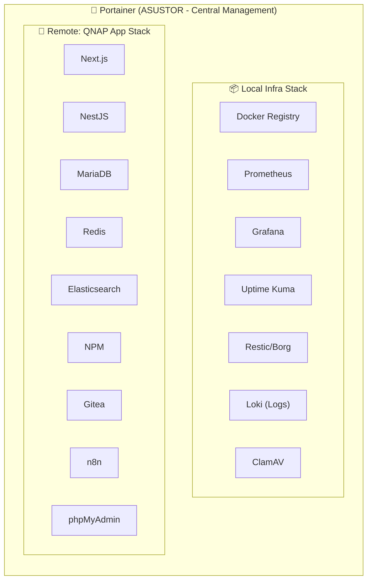
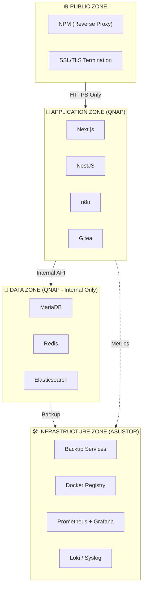

# 🗺️ แผนผัง Network Architecture & Container Services (LCBP3-DMS)

แผนผังนี้แสดงการแบ่งส่วนเครือข่าย (VLANs), การเชื่อมต่อ Firewall (ACLs) และบทบาทของ Server ทั้งสองตัว (QNAP: Application, ASUSTOR: Infrastructure)

> 📖 **ดูรายละเอียด Server Roles และ Service Distribution ได้ที่:** [README.md](README.md#-hardware-infrastructure)

---

## 2. Data Flow Diagram



---

## 3. Docker Management View



---

## 4. Security Zones Diagram



---

## 5. แผนผังการเชื่อมต่อเครือข่าย (Network Flow)

```mermaid
graph TD
    direction TB

    subgraph Flow1["การเชื่อมต่อจากภายนอก (Public WAN)"]
        User["ผู้ใช้งานภายนอก (Internet)"]
    end

    subgraph Router["Router (ER7206) - Gateway"]
        User -- "Port 80/443 (HTTPS/HTTP)" --> ER7206
        ER7206["Port Forwarding<br/>TCP 80 → 192.168.10.8:80<br/>TCP 443 → 192.168.10.8:443"]
    end

    subgraph VLANs["เครือข่ายภายใน (VLANs & Firewall Rules)"]
        direction LR

        subgraph VLAN10["VLAN 10: Servers<br/>192.168.10.x"]
            QNAP["QNAP NAS<br/>(192.168.10.8)"]
            ASUSTOR["ASUSTOR NAS<br/>(192.168.10.9)"]
        end

        subgraph VLAN20["VLAN 20: MGMT<br/>192.168.20.x"]
            AdminPC["Admin PC / Switches"]
        end

        subgraph VLAN30["VLAN 30: USER<br/>192.168.30.x"]
            OfficePC["PC พนักงาน/Wi-Fi"]
        end

        subgraph VLAN70["VLAN 70: GUEST<br/>192.168.70.x"]
            GuestPC["Guest Wi-Fi"]
        end

        subgraph Firewall["Firewall ACLs (OC200/ER7206)"]
            direction TB
            rule1["Rule 1: DENY<br/>Guest (VLAN 70) → All VLANs"]
            rule2["Rule 2: DENY<br/>Server (VLAN 10) → User (VLAN 30)"]
            rule3["Rule 3: ALLOW<br/>User (VLAN 30) → QNAP<br/>Ports: 443, 80"]
            rule4["Rule 4: ALLOW<br/>MGMT (VLAN 20) → All"]
        end

        GuestPC -.x|rule1| QNAP
        QNAP -.x|rule2| OfficePC
        OfficePC -- "https://lcbp3.np-dms.work" -->|rule3| QNAP
        AdminPC -->|rule4| QNAP
        AdminPC -->|rule4| ASUSTOR
    end

    ER7206 --> QNAP

    subgraph DockerQNAP["Docker 'lcbp3' (QNAP - Applications)"]
        direction TB

        subgraph PublicServices["Services ที่ NPM เปิดสู่ภายนอก"]
            direction LR
            NPM["NPM (Nginx Proxy Manager)"]
            FrontendC["frontend:3000"]
            BackendC["backend:3000"]
            GiteaC["gitea:3000"]
            PMAC["pma:80"]
            N8NC["n8n:5678"]
        end

        subgraph InternalServices["Internal Services (Backend Only)"]
            direction LR
            DBC["mariadb:3306"]
            CacheC["cache:6379"]
            SearchC["search:9200"]
        end

        NPM -- "lcbp3.np-dms.work" --> FrontendC
        NPM -- "backend.np-dms.work" --> BackendC
        NPM -- "git.np-dms.work" --> GiteaC
        NPM -- "pma.np-dms.work" --> PMAC
        NPM -- "n8n.np-dms.work" --> N8NC

        BackendC -- "lcbp3 Network" --> DBC
        BackendC -- "lcbp3 Network" --> CacheC
        BackendC -- "lcbp3 Network" --> SearchC
    end

    subgraph DockerASUSTOR["Docker 'lcbp3' (ASUSTOR - Infrastructure)"]
        direction TB

        subgraph InfraServices["Infrastructure Services"]
            direction LR
            PortainerC["portainer:9443"]
            RegistryC["registry:5000"]
            PrometheusC["prometheus:9090"]
            GrafanaC["grafana:3000"]
            UptimeC["uptime-kuma:3001"]
        end

        subgraph BackupServices["Backup & Storage"]
            direction LR
            ResticC["restic/borg"]
            NFSC["NFS Share"]
        end

        PortainerC -.->|"Remote Endpoint"| NPM
        PrometheusC -.->|"Scrape Metrics"| BackendC
        ResticC --> NFSC
    end

    QNAP --> NPM
    ASUSTOR --> PortainerC
    DBC -.->|"Scheduled Backup"| ResticC
```

---

## 6. สรุปการตั้งค่า Firewall ACLs (สำหรับ Omada OC200)

นี่คือรายการกฎ (Rules) ที่คุณต้องสร้างใน **Settings > Network Security > ACL** (เรียงลำดับจากบนลงล่าง):

| ลำดับ   | Name                   | Policy    | Source            | Destination               | Ports                                |
| :---- | :--------------------- | :-------- | :---------------- | :------------------------ | :----------------------------------- |
| **1** | Isolate-Guests         | **Deny**  | Network → VLAN 70 | Network → VLAN 10, 20, 30 | All                                  |
| **2** | Isolate-Servers        | **Deny**  | Network → VLAN 10 | Network → VLAN 30 (USER)  | All                                  |
| **3** | Block-User-to-Mgmt     | **Deny**  | Network → VLAN 30 | Network → VLAN 20 (MGMT)  | All                                  |
| **4** | Allow-User-to-Services | **Allow** | Network → VLAN 30 | IP → QNAP (192.168.10.8)  | Port Group → Web (443, 80, 81, 2222) |
| **5** | Allow-MGMT-to-All      | **Allow** | Network → VLAN 20 | Any                       | All                                  |
| **6** | Allow-Server-Internal  | **Allow** | IP → 192.168.10.8 | IP → 192.168.10.9         | All (QNAP ↔ ASUSTOR)                 |
| **7** | (Default)              | Deny      | Any               | Any                       | All                                  |

---

## 7. สรุปการตั้งค่า Port Forwarding (สำหรับ Omada ER7206)

นี่คือรายการกฎที่คุณต้องสร้างใน **Settings > Transmission > Port Forwarding**:

| Name            | External Port | Internal IP  | Internal Port | Protocol |
| :-------------- | :------------ | :----------- | :------------ | :------- |
| Allow-NPM-HTTPS | 443           | 192.168.10.8 | 443           | TCP      |
| Allow-NPM-HTTP  | 80            | 192.168.10.8 | 80            | TCP      |

> **หมายเหตุ**: Port forwarding ไปที่ QNAP (NPM) เท่านั้น, ASUSTOR ไม่ควรเปิดรับ traffic จากภายนอก

---

## 6. Container Service Distribution

> 📖 **ดูรายละเอียด Container Services, Ports, และ Domain Mapping ได้ที่:** [README.md](README.md#-domain-mapping-npm-proxy)

---

## 9. Backup Flow

```
┌────────────────────────────────────────────────────────────────────────┐
│                         BACKUP STRATEGY                                │
├────────────────────────────────────────────────────────────────────────┤
│                                                                        │
│   QNAP (Source)                         ASUSTOR (Target)               │
│   ┌──────────────┐                      ┌──────────────────────┐       │
│   │  MariaDB     │ ──── Daily 2AM ────▶ │  /volume1/backup/db/ │       │
│   │  (mysqldump) │                      │  (Restic Repository) │       │
│   └──────────────┘                      └──────────────────────┘       │
│                                                                        │
│   ┌──────────────┐                      ┌──────────────────────┐       │
│   │  Redis RDB   │ ──── Daily 3AM ────▶ │  /volume1/backup/    │       │
│   │  + AOF       │                      │  redis/              │       │
│   └──────────────┘                      └──────────────────────┘       │
│                                                                        │
│   ┌──────────────┐                      ┌──────────────────────┐       │
│   │  App Config  │ ──── Weekly ───────▶ │  /volume1/backup/    │       │
│   │  + Volumes   │      Sunday 4AM      │  config/             │       │
│   └──────────────┘                      └──────────────────────┘       │
│                                                                        │
│   Retention Policy:                                                    │
│   • Daily: 7 days                                                      │
│   • Weekly: 4 weeks                                                    │
│   • Monthly: 6 months                                                  │
│                                                                        │
└────────────────────────────────────────────────────────────────────────┘
```

---

> 📝 **หมายเหตุ**: เอกสารนี้อ้างอิงจาก Architecture Document **v1.8.0** - Last updated: 2026-01-28
