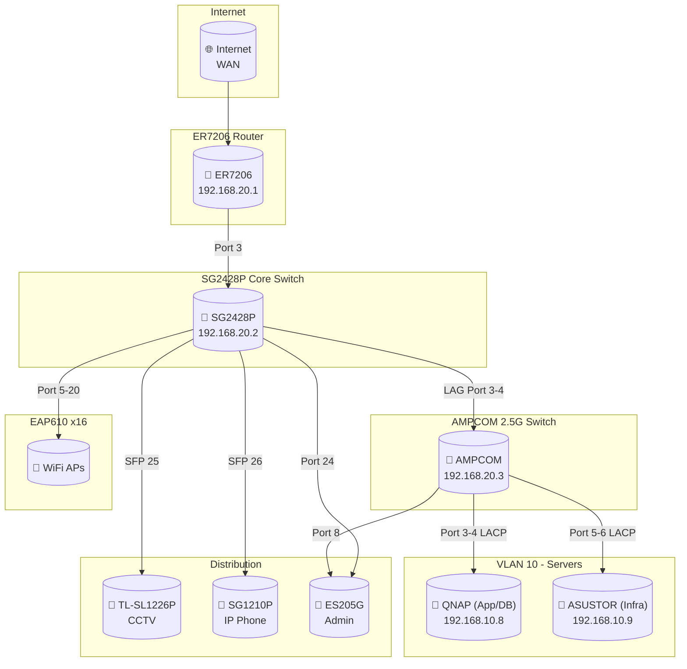

# 08-Infrastructure

คู่มือการตั้งค่า Infrastructure สำหรับ **NAP-DMS LCBP3** (Laem Chabang Port Phase 3 - Document Management System)

> 📍 **Platform:** QNAP (Container Station) + ASUSTOR (Portainer)
> 🌐 **Domain:** `*.np-dms.work` (IP: 159.192.126.103)
> 🔒 **Network:** `lcbp3` (Docker External Network)
> 📄 **Version:** v1.8.0 (aligned with 01-02-architecture.md)
dckr_pat_VzAvAsjeHB3TORZ7vX0kSABIeKI
---

## 🏢 Hardware Infrastructure

### Server Role Separation

#### QNAP TS-473A
| (Application & Database Server) |                   |                       |
| :------------------------------ | :---------------- | :-------------------- |
| ✔ Application Runtime           | ✔ API / Web       | ✔ Database (Primary)  |
| ✔ High CPU / RAM usage          | ✔ Worker / Queue  | ✖ No long-term backup |
| Container Station (UI)          | 32GB RAM (Capped) | AMD Ryzen V1500B      |

#### ASUSTOR AS5403T
| (Infrastructure & Backup Server) |                   |                      |
| :------------------------------- | :---------------- | :------------------- |
| ✔ File Storage                   | ✔ Backup Target   | ✔ Docker Infra       |
| ✔ Monitoring / Registry          | ✔ Log Aggregation | ✖ No heavy App logic |
| Portainer (Manage All)           | 16GB RAM          | Intel Celeron @2GHz  |

### Servers Specification

| Device      | Model   | CPU                     | RAM  | Resource Policy     | Role                   |
| :---------- | :------ | :---------------------- | :--- | :------------------ | :--------------------- |
| **QNAP**    | TS-473A | AMD Ryzen V1500B        | 32GB | **Strict Limits**   | Application, DB, Cache |
| **ASUSTOR** | AS5403T | Intel Celeron @ 2.00GHz | 16GB | **Moderate Limits** | Infra, Backup, Monitor |

### Service Distribution by Server

#### QNAP TS-473A (Application Stack)

| Category        | Service                   | Strategy                        | Resource Limit (Est.) |
| :-------------- | :------------------------ | :------------------------------ | :-------------------- |
| **Web App**     | Next.js (Frontend)        | Single Instance                 | 2.0 CPU / 2GB RAM     |
| **Backend API** | NestJS                    | **2 Replicas** (Load Balanced)  | 2.0 CPU / 1.5GB RAM   |
| **Database**    | MariaDB (Primary)         | Performance Tuned (Buffer Pool) | 4.0 CPU / 5GB RAM     |
| **Worker**      | Redis + BullMQ Worker     | **Standalone + AOF**            | 2.0 CPU / 1.5GB RAM   |
| **Search**      | Elasticsearch             | **Heap Locked (2GB)**           | 2.0 CPU / 4GB RAM     |
| **API Gateway** | NPM (Nginx Proxy Manager) | SSL Termination                 | 1.0 CPU / 512MB RAM   |
| **Workflow**    | n8n                       | Automation                      | 1.0 CPU / 1GB RAM     |
| **Code**        | Gitea                     | Git Repository                  | 1.0 CPU / 1GB RAM     |

#### ASUSTOR AS5403T (Infrastructure Stack)
| Category         | Service             | Notes                           |
| :--------------- | :------------------ | :------------------------------ |
| **File Storage** | NFS / SMB           | Shared volumes for backup       |
| **Backup**       | Restic / Borg       | Pull-based Backup (More Safe)   |
| **Docker Infra** | Registry, Portainer | Container image registry, mgmt  |
| **Monitoring**   | Uptime Kuma         | Service availability monitoring |
| **Metrics**      | Prometheus, Grafana | Cross-Server Scraping           |
| **Log**          | Loki / Syslog       | Centralized logging             |

---

## 🔄 Architecture Diagrams

> 📊 **ดู Diagrams แบบ Interactive (Mermaid) ได้ที่:** [Network_daigram.md](Network_daigram.md)
>
> เอกสารนี้รวม Diagrams หลักไว้ได้แก่:
> - **Data Flow Diagram** - การไหลของข้อมูลระหว่าง Services
> - **Docker Management View** - การจัดการ Containers ผ่าน Portainer
> - **Security Zones Diagram** - การแบ่ง Security Zones (Public, App, Data, Infra)
> - **Network Flow Diagram** - การเชื่อมต่อ VLANs และ Firewall Rules

---

## 🌐 Network Architecture (VLAN)

### VLAN Networks

| VLAN ID | Name   | Gateway/Subnet  | DHCP Range         | Purpose               |
| :------ | :----- | :-------------- | :----------------- | :-------------------- |
| 10      | SERVER | 192.168.10.1/24 | Static             | Servers (NAS, Docker) |
| 20      | MGMT   | 192.168.20.1/24 | Static             | Network Management    |
| 30      | USER   | 192.168.30.1/24 | .10-.254 (7 days)  | Staff Devices         |
| 40      | CCTV   | 192.168.40.1/24 | .100-.150 (7 days) | Surveillance          |
| 50      | VOICE  | 192.168.50.1/24 | .201-.250 (7 days) | IP Phones             |
| 60      | DMZ    | 192.168.60.1/24 | Static             | Public Services       |
| 70      | GUEST  | 192.168.70.1/24 | .200-.250 (1 day)  | Guest WiFi            |

### Static IP Allocation (Key Devices)

| VLAN       | Device  | IP Address     | Role                |
| :--------- | :------ | :------------- | :------------------ |
| SERVER(10) | QNAP    | 192.168.10.8   | App/DB Server       |
| SERVER(10) | ASUSTOR | 192.168.10.9   | Infra/Backup Server |
| MGMT(20)   | ER7206  | 192.168.20.1   | Gateway/Router      |
| MGMT(20)   | SG2428P | 192.168.20.2   | Core Switch         |
| MGMT(20)   | AMPCOM  | 192.168.20.3   | Server Switch       |
| MGMT(20)   | OC200   | 192.168.20.250 | Omada Controller    |
| USER(30)   | Printer | 192.168.30.222 | Kyocera CS3554ci    |
| CCTV(40)   | NVR     | 192.168.40.100 | HikVision NVR       |

### Network Equipment

| Device              | Model              | Ports                   | IP Address     | Role             |
| :------------------ | :----------------- | :---------------------- | :------------- | :--------------- |
| **Router**          | TP-LINK ER7206     | 1 SFP + WAN + 4×GbE     | 192.168.20.1   | Gateway/Firewall |
| **Core Switch**     | TP-LINK SG2428P    | 24×GbE PoE+ + 4×SFP     | 192.168.20.2   | Core/PoE Switch  |
| **Server Switch**   | AMPCOM             | 8×2.5GbE + 1×10G SFP+   | 192.168.20.3   | Server Uplink    |
| **Admin Switch**    | TP-LINK ES205G     | 5×GbE (Unmanaged)       | N/A            | Admin PC         |
| **CCTV Switch**     | TP-LINK TL-SL1226P | 24×PoE+ 100Mbps + 2×SFP | 192.168.20.4   | CCTV PoE         |
| **IP Phone Switch** | TP-LINK SG1210P    | 8×PoE+ + 1×GbE + 1×SFP  | 192.168.20.5   | VoIP             |
| **Controller**      | TP-LINK OC200      | Omada Controller        | 192.168.20.250 | AP Management    |

> 📖 Detailed port mappings and ACL rules: see [Securities.md](Securities.md) and [แผนผัง Network.md](แผนผัง%20Network.md)

---

## 🔗 Network Topology



---

## 📁 สารบัญเอกสาร

| ไฟล์                                                  | คำอธิบาย                                                                       |
| :--------------------------------------------------- | :--------------------------------------------------------------------------- |
| [Infrastructure Setup.md](Infrastructure%20Setup.md) | ภาพรวมการตั้งค่าโครงสร้างพื้นฐาน (Redis, MariaDB, Backend, Monitoring, Backup, DR) |
| [แผนผัง Network.md](แผนผัง%20Network.md)               | แผนผัง Network Architecture และ Container Services                            |
| [Securities.md](Securities.md)                       | VLAN Segmentation, Firewall Rules, ACL (ER7206, SG2428P, EAP)                |

---

## 🐳 Docker Compose Files

### Core Services (QNAP)

| ไฟล์                                      | Application | Services                                  | Path บน QNAP              |
| :--------------------------------------- | :---------- | :---------------------------------------- | :------------------------ |
| [MariaDB_setting.md](MariaDB_setting.md) | `lcbp3-db`  | `mariadb`, `pma`                          | `/share/np-dms/mariadb/`  |
| [NPM_setting.md](NPM_setting.md)         | `lcbp3-npm` | `npm`, `landing`                          | `/share/np-dms/npm/`      |
| [Service_setting.md](Service_setting.md) | `services`  | `cache` (Redis), `search` (Elasticsearch) | `/share/np-dms/services/` |
| [Gitea_setting.md](Gitea_setting.md)     | `git`       | `gitea`                                   | `/share/np-dms/gitea/`    |
| [n8n_setting.md](n8n_setting.md)         | `n8n`       | `n8n`                                     | `/share/np-dms/n8n/`      |

### Infrastructure Services (ASUSTOR)

| ไฟล์                            | Application        | Services                                             | Path บน ASUSTOR               |
| :----------------------------- | :----------------- | :--------------------------------------------------- | :---------------------------- |
| [monitoring.md](monitoring.md) | `lcbp3-monitoring` | `prometheus`, `grafana`, `node-exporter`, `cadvisor` | `/volume1/np-dms/monitoring/` |
| *(NEW)* backup.md              | `lcbp3-backup`     | `restic`, `borg`                                     | `/volume1/np-dms/backup/`     |
| *(NEW)* registry.md            | `lcbp3-registry`   | `registry`                                           | `/volume1/np-dms/registry/`   |
| *(NEW)* uptime-kuma.md         | `lcbp3-uptime`     | `uptime-kuma`                                        | `/volume1/np-dms/uptime/`     |

---

## 🌐 Domain Mapping (NPM Proxy)

### Application Domains (QNAP)

| Domain                | Service  | Port | Host | Description               |
| :-------------------- | :------- | :--- | :--- | :------------------------ |
| `lcbp3.np-dms.work`   | frontend | 3000 | QNAP | Frontend Next.js          |
| `backend.np-dms.work` | backend  | 3000 | QNAP | Backend NestJS API        |
| `pma.np-dms.work`     | pma      | 80   | QNAP | phpMyAdmin                |
| `git.np-dms.work`     | gitea    | 3000 | QNAP | Gitea Git Server          |
| `n8n.np-dms.work`     | n8n      | 5678 | QNAP | n8n Workflow Automation   |
| `npm.np-dms.work`     | npm      | 81   | QNAP | Nginx Proxy Manager Admin |

### Infrastructure Domains (ASUSTOR)

| Domain                   | Service     | Port | Host    | Description        |
| :----------------------- | :---------- | :--- | :------ | :----------------- |
| `grafana.np-dms.work`    | grafana     | 3000 | ASUSTOR | Grafana Dashboard  |
| `prometheus.np-dms.work` | prometheus  | 9090 | ASUSTOR | Prometheus Metrics |
| `uptime.np-dms.work`     | uptime-kuma | 3001 | ASUSTOR | Uptime Monitoring  |
| `portainer.np-dms.work`  | portainer   | 9443 | ASUSTOR | Docker Management  |
| `registry.np-dms.work`   | registry    | 5000 | ASUSTOR | Docker Registry    |

---

## ⚙️ Core Services Summary

### QNAP Services (Application)

| Service           | Technology         | Port   | Purpose                                      |
| :---------------- | :----------------- | :----- | :------------------------------------------- |
| **Reverse Proxy** | NPM                | 80/443 | SSL Termination, Domain Routing              |
| **Backend API**   | NestJS             | 3000   | REST API, Business Logic, Workflow Engine    |
| **Frontend**      | Next.js            | 3000   | Web UI (App Router, React, Tailwind, Shadcn) |
| **Database**      | MariaDB 11.8       | 3306   | Primary Relational Database                  |
| **Cache**         | Redis 7.2          | 6379   | Caching, Session, BullMQ                     |
| **Search**        | Elasticsearch 8.11 | 9200   | Full-text Search                             |
| **Code Hosting**  | Gitea              | 3000   | Git Repository (Self-hosted)                 |
| **Workflow**      | n8n                | 5678   | Automation, Integrations (LINE, Email)       |

### ASUSTOR Services (Infrastructure)

| Service          | Technology      | Port | Purpose                       |
| :--------------- | :-------------- | :--- | :---------------------------- |
| **Metrics**      | Prometheus      | 9090 | Metrics Collection            |
| **Dashboard**    | Grafana         | 3000 | Visualization, Alerting       |
| **Uptime**       | Uptime Kuma     | 3001 | Service Availability Monitor  |
| **Registry**     | Docker Registry | 5000 | Private Container Images      |
| **Management**   | Portainer       | 9443 | Centralized Docker Management |
| **Host Metrics** | node-exporter   | 9100 | CPU, Memory, Disk metrics     |
| **Container**    | cAdvisor        | 8080 | Container resource metrics    |
| **Backup**       | Restic/Borg     | N/A  | Automated Backups             |

---

## 🔧 Quick Reference

### Docker Commands (QNAP - Container Station)

```bash
# ดู containers ทั้งหมด
docker ps -a

# ดู logs
docker logs -f <container_name>

# เข้าไปใน container
docker exec -it <container_name> sh

# Restart service
docker restart <container_name>
```

### Docker Commands (ASUSTOR - Portainer)

```bash
# Remote Docker endpoint connection
# Configure via Portainer UI: Settings > Environments > Add Environment

# Direct SSH to ASUSTOR
ssh admin@192.168.10.9

# Portainer API (Optional)
curl -X GET https://portainer.np-dms.work/api/endpoints \
  -H "X-API-Key: <your-api-key>"
```

### Network

```bash
# สร้าง external network (ครั้งแรก) - ต้องทำทั้ง 2 servers
# On QNAP:
docker network create lcbp3

# On ASUSTOR:
docker network create lcbp3

# ดู network
docker network ls
docker network inspect lcbp3
```

### MariaDB

```bash
# เข้า MySQL CLI (QNAP)
docker exec -it mariadb mysql -u root -p

# Backup database (QNAP -> ASUSTOR)
docker exec mariadb mysqldump -u root -p lcbp3 > backup.sql
# Copy to ASUSTOR via NFS/SCP
```

---

## ⚙️ Environment Variables

ตัวแปรสำคัญที่ใช้ร่วมกันทุก Service:

| Variable                 | Value          | Description            |
| :----------------------- | :------------- | :--------------------- |
| `TZ`                     | `Asia/Bangkok` | Timezone               |
| `MYSQL_HOST` / `DB_HOST` | `mariadb`      | MariaDB hostname       |
| `MYSQL_PORT` / `DB_PORT` | `3306`         | MariaDB port           |
| `REDIS_HOST`             | `cache`        | Redis hostname         |
| `ELASTICSEARCH_HOST`     | `search`       | Elasticsearch hostname |

> ⚠️ **Security Note:** Sensitive secrets (Password, Keys) ต้องใช้ `docker-compose.override.yml` (gitignored) หรือ Docker secrets - ห้ามระบุใน docker-compose.yml หลัก

---

## 📚 เอกสารเสริม

| ไฟล์                              | คำอธิบาย                                            |
| :------------------------------- | :------------------------------------------------ |
| [Git_command.md](Git_command.md) | คำสั่ง Git + Gitea Cheat Sheet                       |
| [lcbp3-db.md](lcbp3-db.md)       | Docker Compose สำหรับ MariaDB (alternative version) |

---

## 📋 Checklist สำหรับการติดตั้งใหม่

### Phase 1: Network & Infrastructure
1. [ ] Configure VLANs on ER7206 Router
2. [ ] Configure Switch Profiles on SG2428P
3. [ ] Configure Static IPs (QNAP: .8, ASUSTOR: .9)

### Phase 2: ASUSTOR Setup (Infra)
1. [ ] Create Docker Network: `docker network create lcbp3`
2. [ ] Deploy Portainer & Registry
3. [ ] Deploy Monitoring Stack (`prometheus.yml` with QNAP IP target)
4. [ ] Verify Prometheus can reach QNAP services

### Phase 3: QNAP Setup (App)
1. [ ] Create Docker Network: `docker network create lcbp3`
2. [ ] Create `.env` file with secure passwords
3. [ ] Deploy **MariaDB** (Wait for init)
4. [ ] Deploy **Redis Standalone** (Check AOF is active)
5. [ ] Deploy **Elasticsearch** (Check Heap limit)
6. [ ] Deploy **NPM** & App Services (Backend/Frontend)
7. [ ] Verify Internal Load Balancing (Backend Replicas)

### Phase 4: Backup & Security
1. [ ] Configure Restic on ASUSTOR to pull from QNAP
2. [ ] Set Resource Limits (Check `docker stats`)
3. [ ] Configure Firewall ACL Rules

---

> 📝 **หมายเหตุ:** เอกสารทั้งหมดอ้างอิงจาก Architecture Document **v1.8.0** และ DMS Container Schema **v1.7.0**
