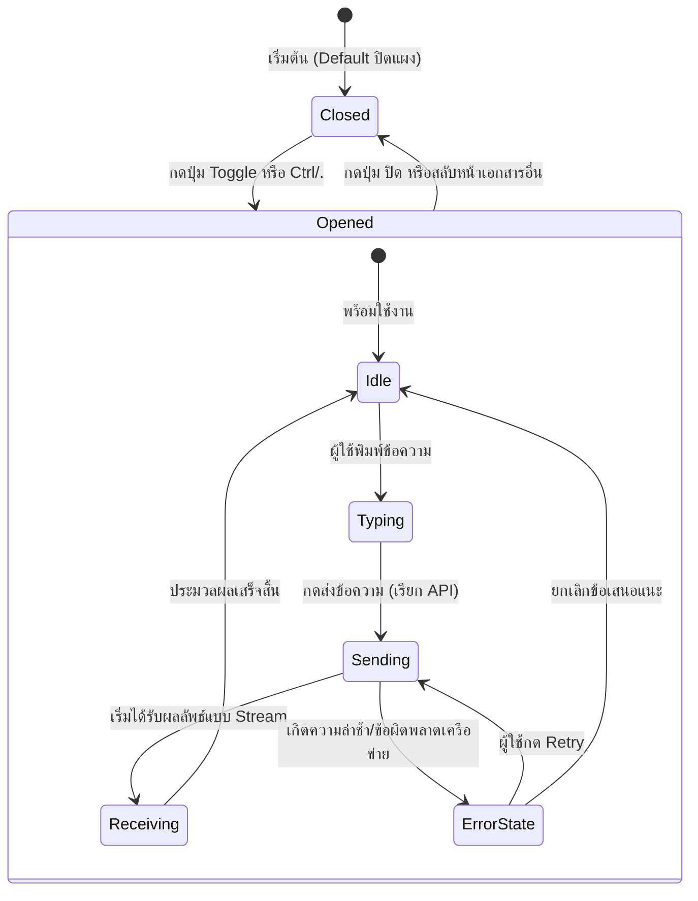

// File: specs/200-fullstacks/226-document-chat-ui-pattern/data-model.md
// Change Log:
// - 2026-05-19: Initial data model specifications for Document Chat UI Pattern

# Data Model & State Specifications: Document Chat UI Pattern

เนื่องจากข้อตกลงใน ADR-026 กำหนดให้ระบบ Document Chat ใน v1 นี้ ทำงานแบบ **Client-side Persistence (Session Storage เท่านั้น)** ดังนั้นจึงไม่มีการเปลี่ยนแปลงโครงสร้างตารางฐานข้อมูล MariaDB หรือ Qdrant เพิ่มเติม เอกสารฉบับนี้จึงเน้นกำหนดโครงสร้างอ็อบเจกต์ข้อมูลในฝั่ง Frontend และ API Request/Response DTOs เพื่อความเป็นระเบียบและสอดคล้องกับมาตรฐานความปลอดภัย

---

## 1. Frontend Data Structures (โครงสร้างข้อมูลฝั่งไคลเอนต์)

### 1.1 ChatMessage (โครงสร้างข้อความแชท)
ใช้เก็บประวัติการสนทนาในแต่ละ Session

| Field | Type | Description |
|---|---|---|
| `id` | `string` | รหัสเฉพาะของข้อความในรูปแบบ **UUIDv7 string** |
| `role` | `'user' \| 'assistant' \| 'system'` | บทบาทของผู้ส่งข้อความ |
| `content` | `string` | เนื้อหาของข้อความ (รองรับการเขียนแบบ Markdown พื้นฐาน) |
| `timestamp` | `Date` | วันเวลาที่ส่งหรือได้รับข้อความ |
| `suggestedActions` | `SuggestedAction[]` | รายการปุ่มสั่งการแนะนำที่ส่งมาพร้อมคำตอบของ AI (ถ้ามี) |
| `isStreaming` | `boolean` | สถานะบ่งบอกว่าคำตอบนี้กำลังอยู่ในกระบวนการโหลดข้อมูลแบบ Stream |

### 1.2 SuggestedAction (ปุ่มกระทำการแนะนำ)
ปุ่มที่ปรากฏใต้ข้อความของ AI เพื่อช่วยให้ผู้ใช้กดสั่งการระบบต่อได้ง่ายขึ้น

| Field | Type | Description |
|---|---|---|
| `label` | `string` | ข้อความที่จะแสดงบนปุ่ม Chip (เช่น "ดู Drawing ฉบับใหม่ล่าสุด") |
| `query` | `string` | ข้อความที่จะถูกส่งเข้าสู่กล่องสนทนาแทนการพิมพ์เมื่อผู้ใช้กดคลิกปุ่มนี้ |

---

## 2. API DTOs (Data Transfer Objects)

### 2.1 ChatRequestDto
ข้อมูลที่ระบบส่งไปยัง API Endpoint `/api/ai/chat`

```typescript
// ✅ สอดคล้องกับหลักการ UUIDv7 และหลีกเลี่ยง Integer PK (ADR-019)
export interface ChatRequestDto {
  query: string; // ข้อความถามคำถามของผู้ใช้
  context: {
    type: 'drawing' | 'rfa' | 'transmittal' | 'correspondence'; // ประเภทเอกสารต้นทาง
    publicId: string; // UUIDv7 publicId ของเอกสารนั้นๆ
  };
}
```

### 2.2 ChatResponseDto
ข้อมูลที่ระบบตอบรับกลับมาจาก API (ในกรณีไม่เปิดใช้ Web Stream หรือเป็น Fallback)

```typescript
export interface ChatResponseDto {
  messageId: string; // UUIDv7 string ของข้อความตอบกลับ
  role: 'assistant';
  content: string; // คำตอบของ AI (Markdown format)
  suggestedActions?: SuggestedAction[]; // ปุ่มสั่งการแนะนำ
  latencyMs: number; // ระยะเวลาการประมวลผลของ AI Subsystem
}
```

---

## 3. UI State Transitions (สถานะและการเปลี่ยนสถานะในระบบ UI)

ระบบใช้วงจรสถานะแชท (Chat Panel State Life-cycle) ดังแผนภาพนี้:


