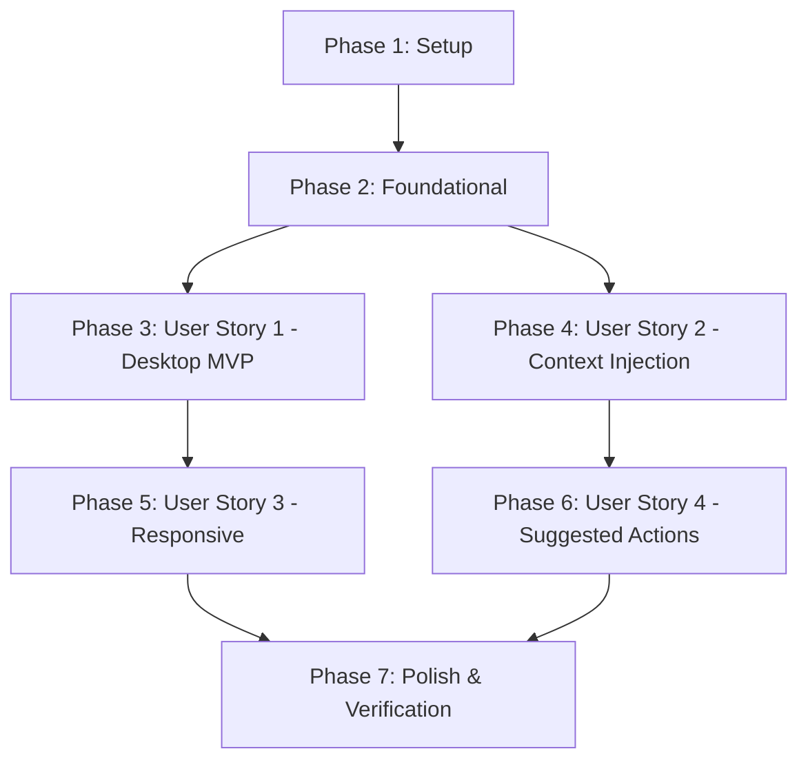

// File: specs/200-fullstacks/226-document-chat-ui-pattern/tasks.md
// Change Log:
// - 2026-05-19: Initial task list for Document Chat UI Pattern

# Tasks: Document Chat UI Pattern

**Input**: Design documents from `/specs/200-fullstacks/226-document-chat-ui-pattern/`
**Prerequisites**: plan.md (required), spec.md (required)

---

## Phase 1: Setup (การเตรียมโครงสร้างและ Proxy API)

**Purpose**: ตั้งค่าโครงสร้างโปรเจกต์และสร้าง API endpoint proxy เบื้องต้น

- [X] T001 สร้างโครงสร้างโฟลเดอร์สำหรับเอกสารวิศวกรรมใน `specs/200-fullstacks/226-document-chat-ui-pattern/`
- [X] T002 ตั้งค่า API Route Proxy สำหรับ Chat ใน `frontend/app/api/ai/chat/route.ts` เพื่อรับส่งงานไปยัง AI Gateway

---

## Phase 2: Foundational (โครงสร้างข้อมูลแชทและ React State Hook)

**Purpose**: สร้างระบบพื้นฐานและ Hook สำหรับจัดการแชท ซึ่งเป็นรากฐานของหน้าจอย่อยทั้งหมด

**⚠️ CRITICAL**: ต้องทำส่วนนี้ให้เสร็จสิ้นก่อนเริ่มทำ User Story อื่นๆ

- [X] T003 [P] สร้างอินเตอร์เฟซ TypeScript สำหรับ Chat Messages และ API payload ใน `frontend/types/ai-chat.ts`
- [X] T004 พัฒนา custom React Hook `useAiChat` ใน `frontend/hooks/use-ai-chat.ts` เพื่อจัดการ Session Storage และการเรียกใช้ API ของ AI Chat

**Checkpoint**: โครงสร้างพื้นฐานเสร็จสมบูรณ์ - พร้อมสำหรับการเริ่มพัฒนา User Story ในขั้นตอนถัดไป

---

## Phase 3: User Story 1 - ดูเอกสารและคุยกับ AI พร้อมกันบน Desktop (Priority: P1) 🎯 MVP

**Goal**: พัฒนาหน้าจอแชทแบบ Slide-in panel ด้านขวาในหน้าดูรายละเอียดเอกสารหลัก โดยไม่บดบังเนื้อหา (Desktop)

**Independent Test**: ผู้ใช้งานบน Desktop สามารถเปิด/ปิด Chat Panel ได้ผ่านปุ่ม Toggle และพิมพ์สนทนากับ AI ได้อย่างลื่นไหลโดยเอกสารหลักย่อขนาดหลบด้านข้าง

### Implementation for User Story 1

- [X] T005 [P] [US1] พัฒนาคอมโพเนนต์ `AiChatToggle` ใน `frontend/components/ai/ai-chat-toggle.tsx` สำหรับเป็นปุ่มควบคุม
- [X] T006 [P] [US1] พัฒนาคอมโพเนนต์ `AiChatInput` ใน `frontend/components/ai/ai-chat-input.tsx` สำหรับพิมพ์คำสั่งและส่งข้อความ
- [X] T007 [US1] พัฒนาคอมโพเนนต์หลัก `AiChatPanel` ใน `frontend/components/ai/ai-chat-panel.tsx` เพื่อเรนเดอร์แผงกว้าง 400px (Desktop) แบบ Slide-in (ขึ้นกับ T005, T006)
- [X] T008 [US1] ติดตั้ง `AiChatPanel` และ `AiChatToggle` ในหน้าดูข้อมูล Drawing ใน `frontend/app/drawings/[publicId]/page.tsx`
- [X] T009 [US1] ติดตั้ง `AiChatPanel` และ `AiChatToggle` ในหน้าดูข้อมูล RFA ใน `frontend/app/rfas/[publicId]/page.tsx`

**Checkpoint**: สิ้นสุดขั้นตอนนี้ ระบบจะสามารถใช้งาน AI Chat เคียงคู่กับเอกสารบน Desktop ได้อย่างสมบูรณ์แบบอิสระ

---

## Phase 4: User Story 2 - การสนทนากับ AI โดยใช้เอกสารเป็นบริบท (Context Injection) (Priority: P1)

**Goal**: ระบบแนบบริบทของเอกสาร (type และ publicId) ไปพร้อมคำถามทุกครั้งเพื่อให้ AI ให้ Insight ได้ตรงจุด

**Independent Test**: เมื่อพิมพ์คำถาม "สรุปเอกสารนี้" ระบบสามารถเรียก endpoint ด้วย context payload ที่ถูกต้อง โดยที่ไม่มี integer id รั่วไหล

### Implementation for User Story 2

- [X] T010 [US2] เพิ่มตรรกะตรวจจับบริบท (Context Injection) ใน `frontend/hooks/use-ai-chat.ts` เพื่อแนบประเภทและ publicId อัตโนมัติ
- [X] T011 [US2] พัฒนาคอมโพเนนต์แสดงผลรายการประวัติข้อความ `AiChatMessages` ใน `frontend/components/ai/ai-chat-messages.tsx` ให้แยกความแตกต่างระหว่างกล่องข้อความผู้ใช้, AI, ระบบ, หรือข้อผิดพลาด

**Checkpoint**: ระบบเข้าใจบริบทของเอกสารที่ผู้ใช้เปิดอ่านอยู่ได้สำเร็จและแสดงผลการตอบสนองได้ตรงประเด็น

---

## Phase 5: User Story 3 - ปรับเปลี่ยนการแสดงผลตามขนาดหน้าจอ (Priority: P2)

**Goal**: รองรับ Responsive layout (Tablet กว้าง 30%, Mobile แสดงผลเป็น Bottom sheet เด้งลอยสูง 60%)

**Independent Test**: ย่อบราวเซอร์หรือทดสอบบนแท็บเล็ตและอุปกรณ์พกพา ยืนยันว่าลักษณะของ Chat Panel ปรับตาม Breakpoint ได้ถูกต้อง

### Implementation for User Story 3

- [X] T012 [US3] ปรับปรุง `AiChatPanel` ใน `frontend/components/ai/ai-chat-panel.tsx` โดยใช้ CSS Media query หรือ Radix UI primitives ให้ปรับเปลี่ยนเลย์เอาต์ตาม Responsive breakpoint

---

## Phase 6: User Story 4 - การนำเสนอ Suggested Actions แนะนำการสั่งงาน (Priority: P2)

**Goal**: แสดงปุ่ม Chip แนะนำการทำงาน และเมื่อคลิกจะส่งคำถามไปยัง AI อัตโนมัติ

**Independent Test**: กล่องข้อความ AI เรนเดอร์ปุ่ม Chip สั่งงานใต้คำตอบ และเมื่อคลิกจะส่งข้อความนั้นเข้ากล่องแชททันที

### Implementation for User Story 4

- [X] T013 [P] [US4] สร้างคอมโพเนนต์แนะนำคำสั่ง `AiSuggestedActions` ใน `frontend/components/ai/ai-suggested-actions.tsx` สำหรับแสดงปุ่ม Chip
- [X] T014 [US4] ผนวกรหัสสั่งงานเข้ากับ `AiChatPanel` ใน `frontend/components/ai/ai-chat-panel.tsx` เพื่อให้การกด Chip ส่งคำสั่งทันที

---

## Phase 7: Polish & Cross-Cutting Concerns (ความสมบูรณ์ขั้นสุดท้ายและเค้าโครงระบบทดสอบ)

**Purpose**: ปรับแต่งจุดข้ามผ่าน ความเป็นระเบียบ และการติดตั้งระบบตรวจสอบอัตโนมัติ

- [X] T015 ติดตั้งคีย์บอร์ดชอร์ตคัต `Ctrl/Cmd + .` ใน `frontend/components/ai/ai-chat-panel.tsx`
- [X] T016 เพิ่ม Unit Test สำหรับ `useAiChat` ใน `frontend/hooks/use-ai-chat.spec.ts` ด้วย Vitest
- [X] T017 เพิ่ม Unit Test สำหรับ `AiChatPanel` ใน `frontend/components/ai/ai-chat-panel.spec.tsx`
- [X] T018 ตรวจทานความสอดคล้องกับมาตรการความปลอดภัยและ UUIDv7 (ADR-019) ในทุกไฟล์ที่พัฒนาขึ้นใหม่

---

## Dependencies & Execution Order (ลำดับและการพึ่งพากันในการรันงาน)

### Phase Dependencies

### Parallel Opportunities (โอกาสทำงานคู่ขนาน)

- **Foundational (Phase 2)**: สามารถพัฒนาอินเตอร์เฟซและโมเดลข้อมูล `T003` คู่ขนานไปกับการออกแบบ custom hook `T004` ได้
- **User Story 1 (Phase 3)**: สามารถแยกสร้างคอมโพเนนต์ย่อย `T005` (Toggle) และ `T006` (Input) ในเวลาเดียวกันได้
- **User Story 4 (Phase 6)**: สามารถพัฒนาปุ่มแนะนำ `T013` คู่ขนานไปกับส่วนประกอบอื่นได้
