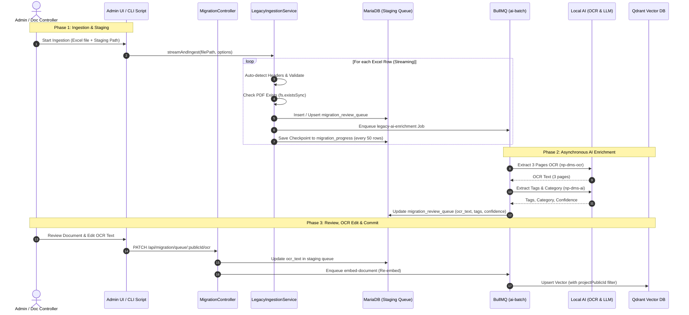

# Implementation Plan: 244-native-backend-legacy-ingestion

**Branch**: `244-native-backend-legacy-ingestion` | **Date**: 2026-08-20 | **Spec**: [spec.md](./spec.md)
**Input**: Feature specification from `specs/200-fullstacks/244-native-backend-legacy-ingestion/spec.md`

---

## 1. Summary

พัฒนาระบบ Ingestion สำหรับเอกสาร Legacy (20,000 ฉบับ) ในรูปแบบ **Native NestJS Module (`LegacyIngestionService`)** โดยใช้ `ExcelJS` Streaming Reader อ่านไฟล์ขนาดใหญ่โดยใช้หน่วยความจำต่ำ (<100MB RAM), เชื่อมต่อกับ Staging Queue (`migration_review_queue`), จัดคิว AI Enrichment ผ่าน BullMQ (`ai-batch`), บันทึกข้อความ OCR 3 หน้าแรกถาวร และเปิดให้แก้ไข OCR พร้อม Re-embed ลง Qdrant อัตโนมัติ (ADR-042/047) รองรับทั้ง CLI Script บน Server และ Web UI ใน Admin Console

---

## 2. Technical Context

- **Backend Framework**: NestJS 11 + TypeScript 5 (Strict mode)
- **Primary Dependencies**: `exceljs` (^4.4.0), `@nestjs/bullmq`, `typeorm`, `@casl/ability`, `class-validator`
- **Database & Storage**: MariaDB 11.8 (`migration_review_queue`, `migration_progress`, `migration_errors`, `attachments`)
- **AI & Vector Engine**: Ollama (`np-dms-ai`), OCR Sidecar (`np-dms-ocr`), Qdrant Vector DB (BGE-M3 1024-dim)
- **Frontend Framework**: Next.js 16 (App Router) + TanStack Query + Shadcn/UI + Tailwind CSS
- **Target Platform**: Linux (np-dms-lcbp3, single-host Docker)
- **Performance Goals**: Read & Stage 20,000 Excel rows in < 3 minutes; Memory footprint < 100MB RAM; GPU Concurrency = 1
- **Security & Standards**: ADR-019 (UUIDv7 `publicId`), ADR-016 (CASL RBAC + Idempotency), ADR-023A (AI Boundary), ADR-044 (No TypeORM Migrations)

---

## 3. Constitution & ADR Alignment Check

| Rule / ADR | Compliance Strategy | Status |
| :--- | :--- | :--- |
| **ADR-019 (Hybrid Identifier)** | ใช้งาน `publicId` (UUIDv7 string) ในทุก API Response และ DTO; ซ่อน Internal INT PK ด้วย `@Exclude()` | ✅ Compliant |
| **ADR-023/023A (AI Boundary)** | การประมวลผล AI ต้องผ่าน BullMQ `ai-batch` ไปยัง Ollama บนเครื่องภายใน; ห้าม AI แตะ DB ตรง; บังคับ `projectPublicId` filter ใน Qdrant | ✅ Compliant |
| **ADR-042 (OCR Text Persistence)** | บันทึก OCR Text 3 หน้าแรกใน `ocr_text` (ทั้ง staging queue และ attachments); แยก OCR persist กับ RAG embedding | ✅ Compliant |
| **ADR-044 (Database Schema)** | จัดการ schema ผ่าน SQL script / deltas โดยตรง ห้ามสร้างไฟล์ TypeORM migration | ✅ Compliant |
| **ADR-047 (Native Ingestion)** | ปลดระวาง n8n สำหรับ migration; ใช้ NestJS Streaming Ingestion + Hybrid Triggers (CLI + UI) | ✅ Compliant |
| **Zero `any` & Zero `console.log`** | ใช้ Proper Types และ NestJS `Logger` เท่านั้น | ✅ Compliant |

---

## 4. Architecture & Data Flow

---

## 5. Detailed Component Plan

### 5.1 Backend Services & Scripts
1. **`LegacyIngestionService` (`backend/src/modules/migration/services/legacy-ingestion.service.ts`):**
   - Stream reader via `ExcelJS.stream.xlsx.WorkbookReader` (reads first sheet by default or specified `--sheet=<name>`)
   - Header normalizer and flexible mapper (TH/EN)
   - Sender/Receiver Org resolver with fallback to `details.unresolved_orgs`
   - PDF existence verifier (`fs.existsSync` against staging directory)
   - Staging queue persister with transaction / batch insert
   - Checkpoint recorder (`migration_progress`) and Error logger (`migration_errors`)
   - BullMQ queue dispatcher (`ai-batch`)
2. **CLI Script (`backend/src/scripts/legacy-ingest.ts`):**
   - Standalone NestJS application bootstrap
   - Argument parser (`commander` or `yargs` style: `--file`, `--project`, `--contract`, `--sheet`, `--resume`)
   - Real-time terminal progress bar (processed, succeeded, errors, elapsed time)
   - Graceful shutdown on SIGINT / SIGTERM with checkpoint flush
3. **AI Processor & Batch Commit Worker (`backend/src/modules/ai/processors/ai-batch.processor.ts` & `backend/src/modules/migration/workers/`):**
   - Add handler for job type `legacy-ai-enrichment` (OCR 3 pages + LLM tagging)
   - Add background batch commit processor for asynchronous batch approval without web request timeout
   - Persist results back to `migration_review_queue`
4. **OCR Update & RAG Sync Endpoint (`backend/src/modules/migration/migration.controller.ts`):**
   - `PATCH /api/migration/queue/:publicId/ocr`: Update OCR text and trigger RAG re-embedding
   - `POST /api/migration/ingest/upload`: Multipart upload for Excel files
   - `POST /api/migration/ingest/start`: Trigger background ingestion from file path
   - `POST /api/migration/queue/batch-approve`: Dispatch background batch commit job

### 5.2 Frontend Components
1. **Ingestion Management Card (`frontend/app/(dashboard)/admin/migration/components/legacy-ingest-card.tsx`):**
   - Upload Excel dropzone with project/contract dropdown
   - Progress bar with polling / WebSocket progress updates
2. **OCR Text Editor in Review Panel (`frontend/app/(dashboard)/admin/migration/components/ocr-text-editor.tsx`):**
   - Textarea displaying extracted 3-page OCR text
   - Action buttons: "Save OCR Text", "Save & Re-embed RAG"
   - AI Confidence badge and extracted tags preview
3. **Batch Actions Bar:**
   - "Approve All High Confidence (> 0.85)"
   - "Filter by AI Failed / Low Confidence"

---

## 6. Verification & Test Plan

1. **Unit Testing:**
   - `legacy-ingestion.service.spec.ts`: Test streaming Excel parser with mock 100 rows, header variations (TH/EN), missing files, checkpoint resumption, and BullMQ dispatching.
   - `migration-review.service.spec.ts`: Test OCR text updating and RAG sync triggering.
2. **Build & Typecheck:**
   - `cd backend && pnpm test && pnpm run lint && pnpm run build`
   - `cd frontend && pnpm run lint && pnpm run build`
3. **Integration Test (Sandbox):**
   - Run CLI script with a sample Excel file in sandbox environment.
   - Verify rows appear in `migration_review_queue`, AI worker processes jobs sequentially, OCR text is saved, and editing OCR triggers vector re-embedding in Qdrant.
