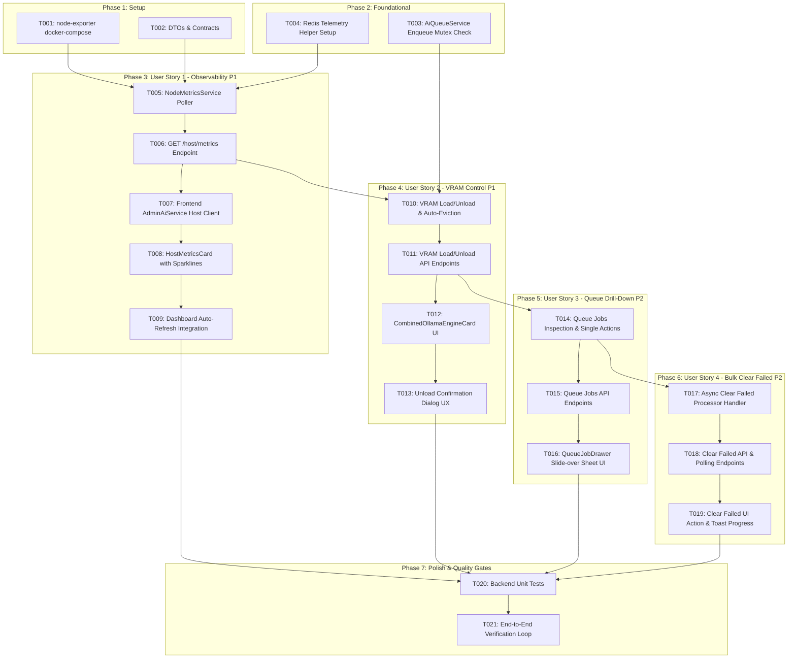

# Tasks: AI Engine Control Center (248-ai-engine-control-center)

**Feature ID**: `248-ai-engine-control-center`
**Date**: 2026-08-24
**Spec**: [spec.md](./spec.md) | **Plan**: [plan.md](./plan.md)
**Related ADR**: [ADR-048-ai-engine-control-center.md](../../06-Decision-Records/ADR-048-ai-engine-control-center.md)

---

## Task Dependencies & Execution Flow

---

## Phase 1: Setup & Infrastructure (Phase 1 Baseline)

- [x] T001 Add `node-exporter` service to `specs/04-Infrastructure-OPS/04-00-docker-compose/np-dms-lcbp3/04-ai/docker-compose.yml` on port `192.168.10.11:9100` ([#4](http://192.168.10.11:3003/np-dms/lcbp3/issues/4))
- [x] T002 [P] Create DTOs and interfaces in `backend/src/modules/ai/dto/host-metrics.dto.ts` and `backend/src/modules/ai/dto/queue-jobs.dto.ts` ([#5](http://192.168.10.11:3003/np-dms/lcbp3/issues/5))

---

## Phase 2: Foundational (Blocking Prerequisites)

- [x] T003 Implement single choke-point lock check in `backend/src/modules/ai/ai-queue.service.ts` checking `ai:model:transitioning` before `queue.add()` ([#6](http://192.168.10.11:3003/np-dms/lcbp3/issues/6))
- [x] T004 [P] Register `NodeMetricsService` and configure Redis telemetry keys in `backend/src/modules/ai/ai.module.ts` ([#7](http://192.168.10.11:3003/np-dms/lcbp3/issues/7))

---

## Phase 3: User Story 1 - Real-time Server & Telemetry Observability (Priority: P1)

- [x] T005 [US1] Implement `NodeMetricsService` in `backend/src/modules/ai/services/node-metrics.service.ts` with 10s background poller, delta calculation, Redis cache, and sensor heuristics ([#8](http://192.168.10.11:3003/np-dms/lcbp3/issues/8))
- [x] T006 [US1] Add `GET /ai/admin/host/metrics` endpoint in `backend/src/modules/ai/ai.controller.ts` with `system.manage_all` guard ([#9](http://192.168.10.11:3003/np-dms/lcbp3/issues/9))
- [x] T007 [P] [US1] Add `getHostMetrics` method in `frontend/services/admin-ai.service.ts` ([#10](http://192.168.10.11:3003/np-dms/lcbp3/issues/10))
- [x] T008 [P] [US1] Create `HostMetricsCard.tsx` with CPU %, RAM %, Temp °C and SVG Sparklines in `frontend/components/admin/ai/HostMetricsCard.tsx` ([#11](http://192.168.10.11:3003/np-dms/lcbp3/issues/11))
- [x] T009 [US1] Integrate HostMetricsCard and 10s auto-refresh controls (pause/play/manual) in `frontend/components/admin/ai/AiInfrastructureMonitoring.tsx` ([#12](http://192.168.10.11:3003/np-dms/lcbp3/issues/12))

---

## Phase 4: User Story 2 - Consolidated Ollama & VRAM Management (Priority: P1)

- [x] T010 [US2] Implement `loadModelVram` and `unloadModelVram` with auto-eviction and global empty-queue check in `backend/src/modules/ai/services/vram-monitor.service.ts` ([#13](http://192.168.10.11:3003/np-dms/lcbp3/issues/13))
- [x] T011 [US2] Add `POST /ai/admin/models/:modelName/vram/load` and `POST /ai/admin/models/:modelName/vram/unload` in `backend/src/modules/ai/ai.controller.ts` with `@Audit()` ([#14](http://192.168.10.11:3003/np-dms/lcbp3/issues/14))
- [x] T012 [P] [US2] Build `CombinedOllamaEngineCard.tsx` merging Ollama status and VRAM model table in `frontend/components/admin/ai/CombinedOllamaEngineCard.tsx` ([#15](http://192.168.10.11:3003/np-dms/lcbp3/issues/15))
- [x] T013 [US2] Add Confirmation Dialog for VRAM Unload with cold-start warning in `frontend/components/admin/ai/CombinedOllamaEngineCard.tsx` ([#16](http://192.168.10.11:3003/np-dms/lcbp3/issues/16))

---

## Phase 5: User Story 3 - Queue Job Drill-Down & Individual Actions (Priority: P2)

- [x] T014 [US3] Implement `getQueueJobs`, `retryJob`, and `deleteJob` in `backend/src/modules/ai/ai-queue.service.ts` ([#17](http://192.168.10.11:3003/np-dms/lcbp3/issues/17))
- [x] T015 [US3] Add endpoints `GET /ai/admin/queues/:queueName/jobs`, `POST .../jobs/:jobId/retry`, and `DELETE .../jobs/:jobId` in `backend/src/modules/ai/ai.controller.ts` ([#18](http://192.168.10.11:3003/np-dms/lcbp3/issues/18))
- [x] T016 [US3] Create slide-over Sheet `QueueJobDrawer.tsx` in `frontend/components/admin/ai/QueueJobDrawer.tsx` with tabs (`All`, `Failed`, `Active`, `Waiting`), pagination, and row actions ([#19](http://192.168.10.11:3003/np-dms/lcbp3/issues/19))

---

## Phase 6: User Story 4 - Bulk Clear Failed Jobs (Priority: P2)

- [x] T017 [US4] Implement `clear-failed-jobs` async worker handler with chunked 1,000 loop up to 10,000 cap in `backend/src/modules/ai/processors/ai-batch.processor.ts` ([#20](http://192.168.10.11:3003/np-dms/lcbp3/issues/20))
- [x] T018 [US4] Add `POST /ai/admin/queues/:queueName/clear-failed` and `GET .../clear-failed/:jobId` in `backend/src/modules/ai/ai.controller.ts` ([#21](http://192.168.10.11:3003/np-dms/lcbp3/issues/21))
- [x] T019 [US4] Integrate Clear Failed button in `QueueJobDrawer.tsx` header with async polling and toast summary ([#22](http://192.168.10.11:3003/np-dms/lcbp3/issues/22))

---

## Phase 7: Polish & Cross-Cutting Concerns

- [x] T020 [P] Write unit tests for `NodeMetricsService`, `VramMonitorService`, and `AiQueueService` in `backend/src/modules/ai/` ([#23](http://192.168.10.11:3003/np-dms/lcbp3/issues/23))
- [x] T021 Run full verification loop (type-check, lint, build, test) and smoke-test `/admin/ai/system` ([#24](http://192.168.10.11:3003/np-dms/lcbp3/issues/24))
