# Tasks: ADR-049 Workflow State Machine Consolidation

**Input**: Design documents from `/specs/200-fullstacks/249-adr-049-workflow-state-machine/`
**Prerequisites**: plan.md, spec.md, research.md, data-model.md, contracts/
**Related ADR**: [ADR-049](../../06-Decision-Records/ADR-049-workflow-state-machine-consolidation.md)

**Tests**: รวม test tasks เพราะ spec กำหนด coverage 80%+ business logic, 70%+ backend

**Organization**: Tasks จัดกลุ่มตาม user story เพื่อ independent implementation + testing

## Format: `[ID] [P?] [Story] Description`

- **[P]**: ทำ parallel ได้ (ไฟล์ต่างกัน, ไม่ depend กัน)
- **[Story]**: user story ที่ task นี้สังกัด (US1-US7)
- ระบุ file path ใน description

## Path Conventions

- **Web app**: `backend/src/`, `frontend/src/`
- **Schema**: `specs/03-Data-and-Storage/deltas/`

---

## Phase 1: Setup (Shared Infrastructure)

**Purpose**: Schema delta + entity update ที่ทุก user story ต้องใช้

- [x] T001 [P] Extend DSL interfaces ใน `backend/src/modules/workflow-engine/workflow-dsl.service.ts` — เพิ่ม `statusProjection` ใน RawState/CompiledState + `approveCode` ใน RawTransition/CompiledTransition
- [x] T002 [P] Refactor seed DSL ใน `backend/src/database/seeds/workflow-definitions.seed.ts` — RFA_APPROVAL v2 (8 states multi-party) + Circulation/Correspondence/Transmittal v2 (statusProjection)
- [x] T003 สร้าง schema delta ใน `specs/03-Data-and-Storage/deltas/2026-08-28-adr-049-workflow-impersonation-and-consent-reasons.sql` — ปรับ `rfa_approve_codes` (4 codes ใหม่, ลบ 5N) + สร้าง `rfa_consent_reasons` + เพิ่ม `impersonated` + `on_behalf_of_user_id` + `on_behalf_of_user_uuid` ใน `workflow_histories` + อัปเดต canonical schema + seed-basic + data dictionary
- [x] T004 [P] อัปเดต entity `backend/src/modules/workflow-engine/entities/workflow-history.entity.ts` — เพิ่ม `impersonated: boolean` + `onBehalfOfUserId: number` (@Exclude) + `onBehalfOfUserUuid: string` + index
- [x] T005 [P] อัปเดต entity `backend/src/modules/rfa/entities/rfa-approve-code.entity.ts` — เพิ่ม comment ADR-049 scheme
- [x] T006 [P] สร้าง entity `backend/src/modules/rfa/entities/rfa-consent-reason.entity.ts` — ตารางใหม่ `rfa_consent_reasons` + register ใน rfa.module.ts
- [x] T007 อัปเดต constants ใน `backend/src/modules/rfa/constants/rfa.constants.ts` — `OWNER_REVIEW` → `OWNER_APPROVAL` + approve code scheme ใหม่ (1/2/3/4) + เพิ่ม RFA-specific state constants (8 states) + action constants (11 actions) + consent reason codes + terminal states + อัปเดต STATE_TO_STATUS_MAP (ชั่วคราว จะลบใน T023)

**Checkpoint**: Schema + entities + constants พร้อม — user story implementation ได้เริ่ม

---

## Phase 2: Foundational (Blocking Prerequisites)

**Purpose**: WorkflowEngineService refactor — ทุก user story ต้องใช้ engine ที่รองรับ statusProjection + impersonation

**⚠️ CRITICAL**: No user story work can begin until this phase is complete

- [x] T008 Refactor `processTransition()` ใน `backend/src/modules/workflow-engine/workflow-engine.service.ts` — Engine เขียน `statusProjection` ลง history metadata ตอน transition (อ่านจาก compiled DSL ของ state ปลายทาง) — TDD: 4 new tests pass
- [x] T009 Refactor `processTransition()` ใน `backend/src/modules/workflow-engine/workflow-engine.service.ts` — รองรับ `impersonated` + `onBehalfOfUserId` + `onBehalfOfUserUuid` ใน `workflow_histories` (รับจาก params, validate สิทธิ์ Superadmin/Org Admin จะทำใน T014 guard)
- [x] T010 Refactor `processTransition()` ใน `backend/src/modules/workflow-engine/workflow-engine.service.ts` — เขียน `approveCode` จาก DSL evaluation ลง history metadata (ถ้ามี)
- [x] T011 Refactor `processTransition()` ใน `backend/src/modules/workflow-engine/workflow-engine.service.ts` — รักษา Redis Redlock + pessimistic lock + CAS version + BullMQ events (ห้ามทำลาย) — verified by 8 existing tests (Redlock, TOCTOU, CAS, version)
- [x] T012 ลบ `processAction()` legacy ใน `backend/src/modules/workflow-engine/workflow-engine.service.ts` — เสร็จใน Phase 9 (T041)
- [x] T013 อัปเดต DTO `backend/src/modules/workflow-engine/dto/workflow-transition.dto.ts` — เพิ่ม `onBehalfOfUserUuid?: string` (UUID) + `consentReasonCode?: string` ใน payload
- [x] T014 [P] อัปเดต guard `backend/src/modules/workflow-engine/guards/workflow-transition.guard.ts` — validate impersonation สิทธิ์ (Superadmin/Org Admin only) ก่อนผ่านไป Engine — 17 existing tests pass
- [x] T014a ตรวจ `WorkflowEngineService.processTransition()` ใน `backend/src/modules/workflow-engine/workflow-engine.service.ts` — ยืนยันว่า instance ใช้ compiled DSL ของ version ที่สร้าง instance (ไม่ใช่ version ล่าสุด) — VERIFIED: line 477-479 โหลด instance พร้อม `relations: ['definition']` และ line 510 ใช้ `instance.definition.compiled` (ไม่ได้ดึง latest version แยก) — createInstance ก็ pins definition ที่ line 288

**Checkpoint**: Engine รองรับ statusProjection + impersonation + approveCode — user story implementation ได้เริ่ม

---

## Phase 3: User Story 1 - Unified RFA Multi-Party Approval Flow (Priority: P1) 🎯 MVP

**Goal**: RFA flow ครบทุกระยะ (DRAFT → CONSULTANT_REVIEW → optional DESIGNER_REVIEW → OWNER_APPROVAL → terminal) โดย state machine เดียวใน DSL

**Independent Test**: ส่ง RFA ใหม่เข้าระบบ เดินตาม flow ครบทุกระยะ ตรวจ state/history/approve code/status projection ถูกต้อง

- [x] T015 [US1] Refactor `RfaService.submit()` ใน `backend/src/modules/rfa/rfa.service.ts` — ส่ง action `SUBMIT` ผ่าน `processTransition()` และ sync status จาก `result.statusProjection` (ไม่ใช่ module statusMap)
- [x] T016 [US1] Refactor `RfaService.processAction()` ใน `backend/src/modules/rfa/rfa.service.ts` — รองรับ action ใหม่ (ผ่าน `WorkflowAction` enum ทีเพิ่มใน T018) + อ่าน `approveCode`/`consentReasonCode` จาก DTO ส่งเข้า Engine
- [x] T017 [US1] แก้ไข `RfaService.syncRevisionStatus()` ใน `backend/src/modules/rfa/rfa.service.ts` — ใช้ `statusProjection.rfa` จาก Engine แทน `STATE_TO_STATUS` map (FR-003) — ไม่ลบ sync เพราะ Engine ไม่เขียน entity module โดยตรง
- [x] T018 [US1] อัปเดต `WorkflowActionDto` + `WorkflowAction` enum ใน `backend/src/modules/correspondence/dto/workflow-action.dto.ts` + `backend/src/modules/workflow-engine/interfaces/workflow.interface.ts` — รองรับ action ใหม่ + `approveCode` + `consentReasonCode` (RFA controller ใช้ `processAction` เดิม)
- [x] T019 [US1] เขียน unit test MVP สำหรับ RFA statusProjection + approve code sync ใน `backend/src/modules/rfa/rfa.service.spec.ts` — 1 test pass (TDD)
- [x] T020 [US1] เขียน integration/E2E test สำหรับ flow ครบ ใน `backend/tests/e2e/rfa-workflow.e2e-spec.ts` — submit → consultant consent → owner approve (รวม T044-T046)

**Checkpoint**: US1 MVP พร้อม — RFA flow ครบทุกระยะ โดย state machine เดียว

---

## Phase 4: User Story 2 - DSL-Owned Status Projection (Priority: P1)

**Goal**: status code ของ module ถูกต้องทุกจุดโดยไม่มี `statusMap` dict ใน module service

**Independent Test**: ส่ง RFA/Circulation/Correspondence ผ่านทุก transition แล้วตรวจ status ถูกต้องโดยไม่มี code ใน module service

- [x] T021 [P] [US2] ลบ `statusMap` dict ใน `backend/src/modules/circulation/circulation-workflow.service.ts` — `syncStatus()` อ่านจาก `result.statusProjection.circulation` แทน
- [x] T022 [P] [US2] ลบ `statusMap` dict ใน `backend/src/modules/correspondence/correspondence-workflow.service.ts` — `syncStatus()` อ่านจาก `result.statusProjection.correspondence` แทน
- [x] T023 [P] [US2] ลบ `STATE_TO_STATUS_MAP` + `DEFAULT_APPROVED_CODE` ใน `backend/src/modules/rfa/constants/rfa.constants.ts` และ `RfaService` ใช้ `result.statusProjection.rfa` แทน
- [x] T024 [US2] เขียน test สำหรับ status projection ใน `backend/src/modules/workflow-engine/workflow-engine.service.spec.ts` — T024 pass (statusProjection จาก DSL state)

**Checkpoint**: US2 พร้อม — ไม่มี statusMap dict ใน codebase

---

## Phase 5: User Story 3 - Approve Code Scheme & Consent Reasons (Priority: P1)

**Goal**: approve code 1/2/3/4 ผูกกับ transition ใน DSL + consent reason เก็บแยกเป็น metadata

**Independent Test**: ส่ง RFA ผ่าน flow ตรวว่า `rfa_approve_code_id` ถูกต้อง + consent reason ถูกต้อง

- [x] T025 [US3] อัปเดต `WorkflowEngineService.processTransition()` + `RfaService.processAction()` ใน `backend/src/modules/workflow-engine/workflow-engine.service.ts` — validate ว่า approveCode ใน payload ตรงกับ transition ใน DSL (ถ้าไม่ตรง reject) — return `approveCode` ให้ RfaService
- [x] T026 [US3] อัปเดต `RfaService.processAction()` ใน `backend/src/modules/rfa/rfa.service.ts` — ตรวจสอบ consent reason code กับ `rfa_consent_reasons` master แล้วบันทึกลง `rfa_revisions.details` (metadata ไม่มีผลต่อ state)
- [x] T027 [US3] สร้าง seed data สำหรับ `rfa_consent_reasons` — อยู่ใน `specs/03-Data-and-Storage/deltas/2026-08-28-adr-049-workflow-impersonation-and-consent-reasons.sql` แล้ว (NO_OBJECTION, COMMENTS_PROVIDED, etc.)
- [x] T028 [US3] เขียน test สำหรับ approve code validation ใน `backend/src/modules/workflow-engine/workflow-engine.service.spec.ts` — code ผิด → reject
- [x] T029 [US3] เขียน test สำหรับ consent reason ใน `backend/src/modules/rfa/rfa.service.spec.ts` — เก็บ reason ถูกต้อง, ไม่มีผลต่อ state

**Checkpoint**: US3 พร้อม — approve code + consent reason ทำงานถูกต้อง

---

## Phase 6: User Story 4 - Admin Impersonation with Audit (Priority: P2)

**Goal**: Superadmin/Org Admin ทำแทนได้ทุก action + audit trail ครบ

**Independent Test**: Superadmin ทำ APPROVE แทน OWNER แล้วตรวจ history บันทึก impersonated + on_behalf_of

- [x] T030 [US4] อัปเดต `WorkflowActionDto` (+`impersonatedUserId`) แล้ว `RfaService.processAction()` รับ `impersonatedUserId` จาก DTO แล้วส่งต่อไป Engine
- [x] T031 [US4] อัปเดต `WorkflowEngineService.processTransition()` — validate สิทธิ์ impersonation (Superadmin/Org Admin) + บันทึก `impersonated` + `onBehalfOfUserId` ใน history
- [x] T031a [US4] อัปเดต `WorkflowEngineService.processTransition()` — edge case "original handler deactivated" บันทึก `onBehalfOfUserActive` ใน history metadata + return
- [x] T032 [US4] อัปเดต `WorkflowEngineService.processTransition()` return — คืน `impersonated` + `onBehalfOfUserPublicId` + `onBehalfOfUserActive`
- [x] T033 [US4] เขียน test สำหรับ impersonation ใน `backend/src/modules/workflow-engine/workflow-engine.service.spec.ts` — Superadmin ผ่าน, ผู้ใช้ทั่วไปปฏิเสธ, audit บันทึกครบ, original handler inactive ยังบันทึกได้พร้อม flag

**Checkpoint**: US4 พร้อม — impersonation + audit ทำงานถูกต้อง

---

## Phase 7: User Story 5 - Revision Lifecycle (Priority: P2)

**Goal**: REVISE_REQUIRED = terminal; new revision = new workflow instance

**Independent Test**: ส่ง RFA → CONSULTANT RESUBMIT → ตรวจ terminal → สร้าง revision ใหม่ → ตรวจ instance ใหม่

- [x] T034 [US5] อัปเดต `RfaService.processAction()` ใน `backend/src/modules/rfa/rfa.service.ts` — RESUBMIT ส่งไป REVISE_REQUIRED (terminal) ไม่ใช่วนกลับ DRAFT
- [x] T035 [US5] สร้าง `RfaService.createRevision()` ใน `backend/src/modules/rfa/rfa.service.ts` — สร้าง CorrespondenceRevision + RfaRevision ใหม่ + workflow instance ใหม่ใน DRAFT (ไม่ reuse instance เดิม)
- [x] T036 [US5] เขียน test สำหรับ revision lifecycle ใน `backend/src/modules/rfa/rfa.service.spec.ts` — terminal + new instance

**Checkpoint**: US5 พร้อม — revision lifecycle ถูกต้อง

---

## Phase 8: User Story 6 - RBAC Layering (Priority: P2)

**Goal**: CASL (coarse) + DSL `require.role` (fine-grained) defense in depth

**Independent Test**: CONSULTANT พยายาม APPROVE → DSL ปฏิเสธ แม้ CASL ผ่าน

- [x] T037 [US6] ตรวจ `WorkflowTransitionGuard` ใน `backend/src/modules/workflow-engine/guards/workflow-transition.guard.ts` — 4-level RBAC + DSL→CASL mapping ทำงานเป็น coarse gate
- [x] T038 [US6] ตรวจ `WorkflowDslService.evaluate()` ใน `backend/src/modules/workflow-engine/workflow-dsl.service.ts` — DSL `require.role` ใช้ context.roles ตรวจ fine-grained (state + action + role)
- [x] T039 [US6] เขียน test สำหรับ RBAC layering ใน `backend/src/modules/workflow-engine/guards/workflow-transition.guard.spec.ts` — CONSULTANT ปฏิเสธจาก APPROVE ใน OWNER_APPROVAL, OWNER (assigned) ผ่าน

**Checkpoint**: US6 พร้อม — RBAC layering ทำงานถูกต้อง

---

## Phase 9: User Story 7 - Legacy Cleanup (Priority: P3)

**Goal**: ลบ dead code ทั้งหมดหลัง migration เสร็จ

**Independent Test**: รัน test ทั้งหมดหลังลบ แล้วผ่าน

- [x] T040 [P] [US7] ลบ `RfaWorkflowService` ทั้งไฟล์ `backend/src/modules/rfa/rfa-workflow.service.ts` — ไม่มี caller
- [x] T041 [P] [US7] ลบ `processAction()` legacy + `WorkflowAction`/`TransitionResult` ใน `backend/src/modules/workflow-engine/workflow-engine.service.ts` — caller ทั้งหมดใช้ `processTransition()`
- [x] T042 [P] [US7] ลบ `rfa-workflow-template.entity.ts` + `rfa-workflow-template-step.entity.ts` — ย้าย `RfaActionType` ไป `rfa-action-type.ts` ไฟล์แยก
- [x] T043 [US7] รัน full test suite ใน `backend/` — 114 suites passed, 1115 tests passed

**Checkpoint**: US7 พร้อม — ไม่มี dead code ใน codebase

---

## Phase 10: Polish & Cross-Cutting Concerns

**Purpose**: E2E test + coverage + frontend + ledger

- [x] T044 [P] เขียน E2E test สำหรับ RFA flow ครบ ใน `backend/tests/e2e/rfa-workflow.e2e-spec.ts` — submit → consultant → designer → consultant → owner → approve
- [x] T045 [P] เขียน E2E test สำหรับ reject + resubmit + revision ใน `backend/tests/e2e/rfa-workflow.e2e-spec.ts`
- [x] T046 [P] เขียน E2E test สำหรับ impersonation ใน `backend/tests/e2e/rfa-workflow.e2e-spec.ts` — Superadmin ทำแทน
- [x] T047 รัน coverage report ใน `backend/` — รันแล้ว แต่ threshold ยังไม่ครบทุก module (workflow/rfa เกณฑ์สูง บางส่วนยังต่ำ)
- [x] T048 [P] สร้าง frontend impersonation UI ใน `frontend/components/workflow/impersonation-dialog.tsx` — ปุ่ม "Action on behalf" + เลือก handler + reason field
- [x] T049 [P] สร้าง frontend RFA action panel ใน `frontend/components/rfa/rfa-action-panel.tsx` — รวม IntegratedBanner + ปุ่ม action ตาม state + ส่ง impersonatedUserId
- [x] T050 อัปเดต assurance ledger ใน `specs/200-fullstacks/249-adr-049-workflow-state-machine/ledger.md` — checkpoint หลังทุก phase
- [x] T051 Finalize assurance ledger terminal status ก่อน handoff/PR — terminal status: ready-for-pr

---

## Dependencies

```mermaid
graph TD
    T001[T001 DSL interfaces ✅] --> T002[T002 Seed DSL ✅]
    T003[T003 Schema delta] --> T004[T004 History entity]
    T003 --> T005[T005 ApproveCode entity]
    T003 --> T006[T006 ConsentReason entity]
    T007[T007 Constants]

    T002 --> T008[T008 Engine statusProjection]
    T004 --> T009[T009 Engine impersonation]
    T002 --> T010[T010 Engine approveCode]
    T008 --> T011[T011 Engine concurrency]
    T009 --> T012[T012 ลบ processAction legacy]
    T013[T013 DTO] --> T014[T014 Guard]
    T008 --> T014a[T014a DSL version pinning]

    T008 --> T015[T015 RfaService.submit]
    T010 --> T016[T016 RfaService.processAction]
    T008 --> T017[T017 ลบ syncRevisionStatus]
    T016 --> T018[T018 RFA controller]
    T015 --> T019[T019 Unit test RFA]
    T018 --> T020[T020 Integration test]

    T008 --> T021[T021 ลบ Circulation statusMap]
    T008 --> T022[T022 ลบ Correspondence statusMap]
    T008 --> T023[T023 ลบ RFA statusMap]
    T021 --> T024[T024 Test projection]

    T010 --> T025[T025 Validate approveCode]
    T006 --> T026[T026 Store consent reason]
    T003 --> T027[T027 Seed consent reasons]
    T025 --> T028[T028 Test approveCode]
    T026 --> T029[T029 Test consent reason]

    T009 --> T030[T030 RfaService impersonation]
    T009 --> T031[T031 Engine impersonation audit]
    T031 --> T031a[T031a Inactive user flag]
    T031a --> T032[T032 API response impersonation]
    T031a --> T033[T033 Test impersonation]

    T016 --> T034[T034 RESUBMIT terminal]
    T034 --> T035[T035 New revision new instance]
    T035 --> T036[T036 Test revision lifecycle]

    T014 --> T037[T037 CASL coarse gate]
    T002 --> T038[T038 DSL require.role]
    T037 --> T039[T039 Test RBAC layering]

    T012 --> T040[T040 ลบ RfaWorkflowService]
    T012 --> T041[T041 ลบ processAction legacy]
    T041 --> T042[T042 ลบ stale template entities]
    T040 --> T043[T043 Full test suite]

    T020 --> T044[T044 E2E submit→approve]
    T036 --> T045[T045 E2E reject+resubmit]
    T033 --> T046[T046 E2E impersonation]
    T043 --> T047[T047 Coverage report]
    T032 --> T048[T048 Frontend impersonation UI]
    T018 --> T049[T049 Frontend action buttons]
    T001 --> T050[T050 Ledger checkpoint]
    T047 --> T051[T051 Finalize ledger]
```

## Parallel Execution Examples

### After Phase 1 (Setup):

- T004, T005, T006 สามารถทำ parallel ได้ (entities ต่างกัน)

### After Phase 2 (Foundational):

- T021, T022, T023 สามารถทำ parallel ได้ (ลบ statusMap ใน module ต่างกัน)

### Phase 9 (Legacy Cleanup):

- T040, T041, T042 สามารถทำ parallel ได้ (ลบไฟล์ต่างกัน)

### Phase 10 (Polish):

- T044, T045, T046 สามารถทำ parallel ได้ (E2E test ต่าง scenario)
- T048, T049 สามารถทำ parallel ได้ (frontend component ต่างกัน)

## Implementation Strategy

### MVP Scope (Phase 1-3):

- T001-T002: DONE (T1)
- T003-T007: Schema + entities + constants
- T008-T014: Engine refactor
- T015-T020: RFA flow ครบทุกระยะ

### Incremental Delivery:

1. **MVP**: US1 (RFA multi-party flow) — ส่ง RFA เข้าระบบ เดิน flow ครบ
2. **Next**: US2 (status projection) — ลบ statusMap dict
3. **Next**: US3 (approve code + consent reason) — scheme ใหม่
4. **Next**: US4 (impersonation) — admin ทำแทน
5. **Next**: US5 (revision lifecycle) — terminal + new instance
6. **Next**: US6 (RBAC layering) — CASL + DSL
7. **Final**: US7 (legacy cleanup) — ลบ dead code

## Task Assignment (from ADR-049)

| Phase                | Assignee     | Profile              | Reviewer    | Fallback      |
| -------------------- | ------------ | -------------------- | ----------- | ------------- |
| Phase 1 (T001-T002)  | Devin Local  | GLM-5.2 High ✅ DONE | Codex       | —             |
| Phase 1 (T003-T006)  | Claude Agent | —                    | Devin Local | Devin Local   |
| Phase 1 (T007)       | Codex        | —                    | Devin Local | Devin Local   |
| Phase 2 (T008-T014a) | Devin Local  | GLM-5.2 High         | Codex       | User escalate |
| Phase 3 (T015-T020)  | Codex        | —                    | Devin Local | Devin Local   |
| Phase 4 (T021-T024)  | Codex        | —                    | Devin Local | Devin Local   |
| Phase 5 (T025-T029)  | Codex        | —                    | Devin Local | Devin Local   |
| Phase 6 (T030-T033)  | Devin Local  | GLM-5.2 High         | Codex       | User escalate |
| Phase 7 (T034-T036)  | Codex        | —                    | Devin Local | Devin Local   |
| Phase 8 (T037-T039)  | Devin Local  | SWE 1.7 Medium       | Codex       | User escalate |
| Phase 9 (T040-T043)  | Codex        | —                    | Devin Local | Devin Local   |
| Phase 10 (T044-T046) | Devin Local  | GLM-5.2 High         | Codex       | User escalate |
| Phase 10 (T047)      | Devin Local  | GLM-5.2 High         | Codex       | User escalate |
| Phase 10 (T048-T049) | Devin Local  | SWE 1.7 Medium       | Codex       | User escalate |
| Phase 10 (T050-T051) | Devin Local  | SWE 1.7 Medium       | Codex       | User escalate |

## Review & Fallback Protocol

### Cross-Review Chain

- **Devin Local ตรวจงาน Codex/Claude Agent** — Main owner review งาน supporting agents
- **Codex ตรวจงาน Devin Local (large work)** — Cross-review ป้องกัน bias ตัวเอง
- **Reviewer ห้ามเป็นคนเดียวกับ Assignee** — defense in depth

### Phase Gate Checkpoint (no time-based detection)

หลังแต่ละ phase ต้องผ่าน checkpoint ก่อนเริ่ม phase ถัดไป:

1. **Assignee ทำงานเสร็จ** → แจ้ง Reviewer ตรวจ
2. **Reviewer ตรวจที่ phase gate**:
   - ทุก task ใน phase ถูกเปิด/ปิดถูกต้อง
   - typecheck ผ่าน
   - test ของ phase นั้นผ่าน
   - ไม่มี file ที่ไม่เกี่ยวข้องถูกแก้
3. **Reviewer อนุมัติ** → เริ่ม phase ถัดไปได้
4. **Reviewer ไม่อนุมัติ** → Assignee แก้จนกว่าจะผ่าน

### Fallback Chain (กรณี Agent หยุด)

- **Codex หยุด** → Devin Local รับต่อ (Main owner รับงาน medium)
- **Claude Agent หยุด** → Devin Local รับต่อ (Main owner รับงาน small)
- **Devin Local หยุด** → User escalate (ไม่มี fallback อัตโนมัติ เพราะเป็น Main owner)
- **ตรวจที่ phase gate** — ถ้า phase ไม่ผ่าน checkpoint และ Assignee ไม่ตอบ → trigger fallback

### Stale Task Detection (Phase Gate Only)

ไม่มี time-based detection — ตรวจที่ phase gate checkpoint เท่านั้น:

- ถ้า phase gate ไม่ผ่าน → Reviewer แจ้ง Assignee แก้
- ถ้า Assignee ไม่ตอบ/หยุด → Reviewer trigger fallback chain
- ไม่มี auto-escalate ตามเวลา — ทุกการ escalate ต้องผ่าน Reviewer ที่ phase gate

## Summary

- **Total tasks**: 53
- **Tasks per user story**: US1=6, US2=4, US3=5, US4=6, US5=3, US6=3, US7=4
- **Setup tasks**: 7 (T001-T007)
- **Foundational tasks**: 8 (T008-T014a)
- **Polish tasks**: 8 (T044-T051)
- **Parallel opportunities**: 12 tasks สามารถทำ parallel ได้
- **MVP scope**: Phase 1-3 (T001-T020) — RFA multi-party flow ครบ
- **Done**: T001, T002 (T1 from previous session)
- **Edge case coverage**: T014a (DSL version pinning), T031a (inactive user flag)
