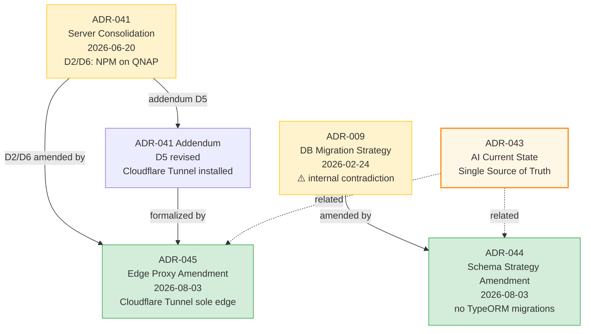

# Session — 2026-08-03 (ADR-044 + ADR-045 Escalation)

## Summary

จัดการ escalate ประเด็นที่พบใน [Phase 5 specs drift cleanup](./session-2026-08-03-specs-drift-cleanup-phase3-5.md) โดยสร้าง ADR amendment 2 ฉบับ + Gitea issue 1 issue สำหรับ tracking

## ปัญหาที่ escalate

### 1. ADR-009 internal contradiction

ADR-009 (Database Migration & Deployment Strategy, 2026-02-24) มี contradiction ภายใน:
- Decision Outcome: "TypeORM Migrations"
- Required Changes §50: "migrations disabled"
- ขัดกับ AGENTS.md "no TypeORM migrations"

### 2. ADR-041 D2/D6 vs real-world state

ADR-041 ระบุ "NPM on QNAP (SPOF mitigation)" แต่ QNAP ไม่รัน Docker อีก — Cloudflare Tunnel บน np-dms-lcbp3 เป็น edge จริง (มี Addendum D5 revised แต่ไม่ได้ amend D2/D6 อย่างเป็นทางการ)

## การดำเนินการ (ตามที่ผู้ใช้อนุมัติ)

| ประเด็น | Action | Status |
|---|---|---|
| ADR-009 contradiction | สร้าง ADR-044 amendment + Gitea issue | ✅ เสร็จ |
| QNAP NPM role change | สร้าง ADR-045 amendment (no issue) | ✅ เสร็จ |
| ADR status | Accepted (formalize existing real-world state) | ✅ ตามมติผู้ใช้ |

## การเปลี่ยนแปลง

### สร้าง ADR ใหม่ (2 ไฟล์)

| ไฟล์ | ขนาด | Action |
|---|---|---|
| `specs/06-Decision-Records/ADR-044-database-schema-strategy-amendment.md` | 14.9 KB | สร้างใหม่ — amend ADR-009, formalize "no TypeORM migrations, edit schema SQL directly via delta files" |
| `specs/06-Decision-Records/ADR-045-edge-proxy-topology-amendment.md` | 14.2 KB | สร้างใหม่ — amend ADR-041 D2/D6, formalize Cloudflare Tunnel as sole edge proxy; QNAP no Docker |

### อัปเดต ADR ที่ถูก amend (เพิ่ม cross-link note ไม่แก้เนื้อหา)

| ไฟล์ | การเปลี่ยนแปลง |
|---|---|
| `specs/06-Decision-Records/ADR-009-database-migration-strategy.md` | เพิ่ม note บนสุด: "Amended by ADR-044 — Decision Outcome superseded" + อัปเดต Status เป็น "⚠️ Accepted (Decision Outcome amended by ADR-044)" + เพิ่ม ADR-044 ใน Related Documents |
| `specs/06-Decision-Records/ADR-041-server-consolidation.md` | เพิ่ม note บนสุด: "D2/D6 Amended by ADR-045 — Cloudflare Tunnel as sole edge proxy" + อัปเดต Status เป็น "⚠️ Implemented (D2/D6 amended by ADR-045)" + เพิ่ม ADR-045 ใน Related Documents |

### อัปเดต ADR README index

| ไฟล์ | การเปลี่ยนแปลง |
|---|---|
| `specs/06-Decision-Records/README.md` | เพิ่ม ADR-043 (เคยมีอยู่แล้วในเอกสารก่อนหน้า), ADR-044, ADR-045 ในตาราง ADR index; อัปเดต ADR-041 row เป็น "D2/D6 amended by ADR-045" |

### สร้าง Gitea issue

- **Issue #2**: "[ADR-009] Database Schema Strategy — formalize 'no TypeORM migrations' decision (resolved by ADR-044)"
- URL: http://192.168.10.11:3003/np-dms/lcbp3/issues/2
- สถานะ: open (รอทีม review ADR-044 และ confirm acceptance)
- ใช้สำหรับ tracking เท่านั้น (ADR-044 สร้างเป็น draft ที่พร้อม review แล้ว)

## หลักการที่ใช้ (ตาม ADR-REVIEW-PROCESS)

1. **Immutable history** — ไม่แก้เนื้อหา ADR เดิม (ADR-009, ADR-041) รักษา audit trail
2. **Amendment via new ADR** — สร้าง ADR-044/045 แยกต่างหาก อ้างอิง ADR ที่ถูก amend
3. **Cross-link note** — เพิ่ม note บนสุดของ ADR ที่ถูก amend ชี้ไป ADR ใหม่ (ไม่ใช่การแก้เนื้อหา)
4. **Formalize real-world state** — ADR-044/045 ใช้สถานะ "Accepted" เพราะเป็นการ formalize สถานะจริงที่ใช้อยู่แล้ว (คล้าย ADR-043)
5. **Gitea issue tracking** — สร้าง issue สำหรับ ADR-009 (ตามมติผู้ใช้) เพื่อให้ทีม review และ confirm ได้

## Decision Graph (หลัง escalate)

## งานที่เหลือ (สำหรับทีม)

1. **Review ADR-044** — ทีม backend + DBA review และ confirm acceptance (Gitea issue #2 tracking)
2. **Review ADR-045** — ทีม DevOps review และ confirm edge topology (NPM ยังจำเป็นหรือไม่, Cloudflare Tunnel config ครบไหม)
3. **Verify practices สอดคล้อง ADR-044** — ตรวจว่าทีม backend ใช้ SQL delta files จริง ไม่มี TypeORM migration files หลงเหลือ
4. **Verify NPM status** — ตรวจว่า NPM ยังรันอยู่บน host ใด หรือ stop ไปแล้ว (หากยังรัน ให้ demote เป็น internal router หรือ stop ได้)
5. **Close Gitea issue #2** — หลังทีม review ADR-044 แล้ว

## หมายเหตุ

- ไม่ได้ commit (เป็น policy ปกติ — ผู้ใช้ไม่ได้ขอ commit)
- รวม Phase 1-5 + escalation: 130+ files changed, 600+ insertions, 432 deletions
- ADR-044 + ADR-045 สร้างตาม format ADR-040 (amendment ADR ตัวอย่าง) และ enhanced template v1.2
- ADR numbers 038-039 skipped (per ADR-040 note) — 044/045 เป็นลำดับถัดไป
